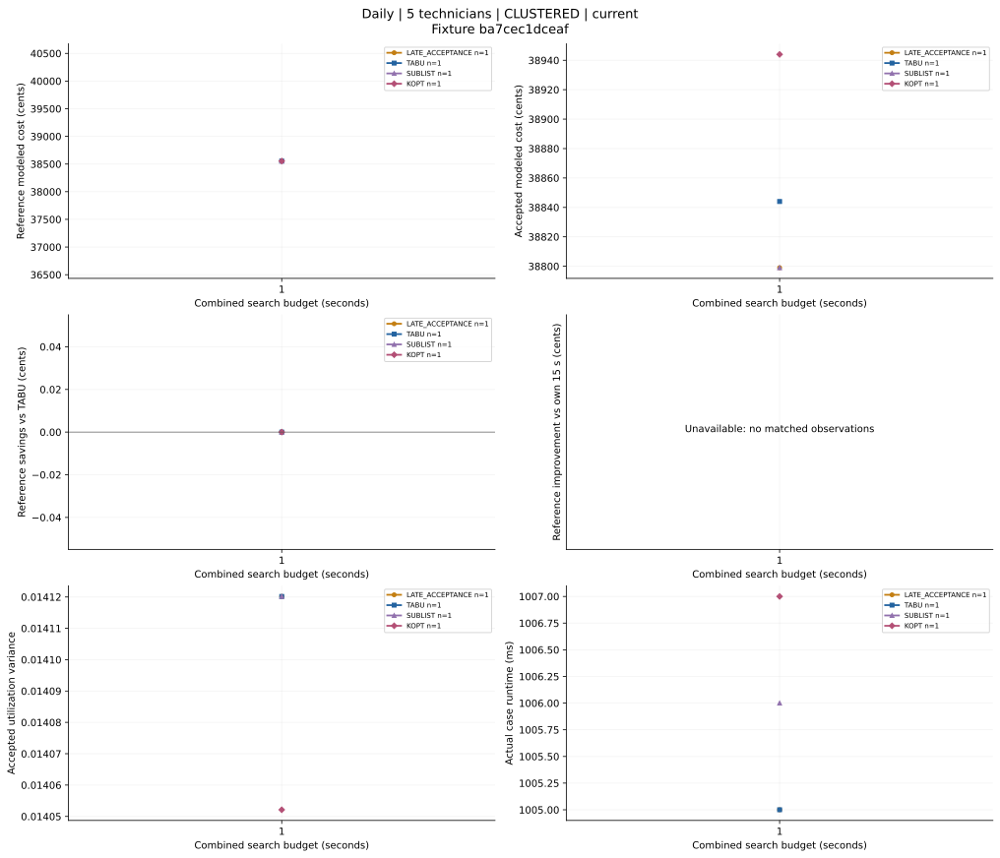
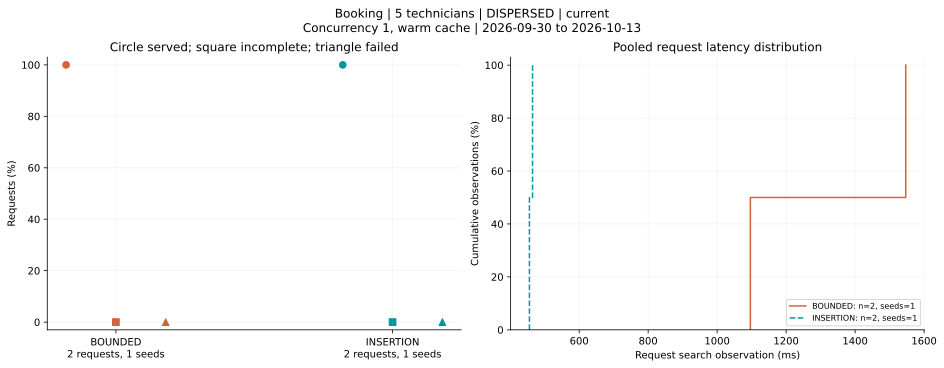

# Experiment toolkit verification

These small runs verify the harness, archive/resume behavior, and figure generation. They do not compare production quality and are not the 480-case daily or 240-case booking studies.

The [verification receipt](verification.json) records source revisions, run IDs, executable/raw hashes, case summaries, and checks. Compressed raw files beside it are copies of the completed local run evidence. Full source/artifact snapshots and logs remain in the gitignored `experiments/runs` archives.

| Check | Result |
| --- | --- |
| Strict Java `-Pnullability clean verify` | 176 tests, zero failures/errors/skips |
| Web lint and typecheck | Passed |
| Web unit tests | 96 passed |
| Python regressions | 27 passed |
| Daily smoke | Four selected solvers, fleet 5, CLUSTERED, seed 17 at 500 ms; then seed 23 at 1000 ms |
| Booking smoke | INSERTION and BOUNDED, fleet 5, DISPERSED, concurrency 1, warm scheduler cache, two requests each; both runs independently audited |
| Active booking settings | Strategy, bounded gate, and reservations checked before/after each case |
| 90/120/240-second budgets | CLI propagation and Java bounds checked without consuming long budgets |
| Independent changed-config archive | Every first-run file hash unchanged after the second configuration |
| Archived command resume | All completed cases skipped; new analysis version produced |
| Concurrent toolkit run | Rejected by machine-wide measurement lock |
| Historical import | 466 observed rows, 54 figures, one explicitly retained historical failure; all original source files unchanged |

The frozen daily and booking artifacts used for the retained copies were built from `72a9ea3`. Later analysis-only changes are reflected in the figures and current analyzer. Each raw archive identifies its source/artifact revision, and every analysis invocation records its analyzer hash. The receipts do not relabel earlier measurements as later commits.

PNG and SVG exports were inspected for labels, units, solver colors, sample counts and missing-data behavior. A clipped multiline booking title found during inspection was corrected. Missing 15-second baselines in smoke runs are explicitly unavailable. Historical multi-budget plots preserve individual seed variation and non-monotonic outcomes. The historical failure was not converted into a successful case or removed from the source archive.

