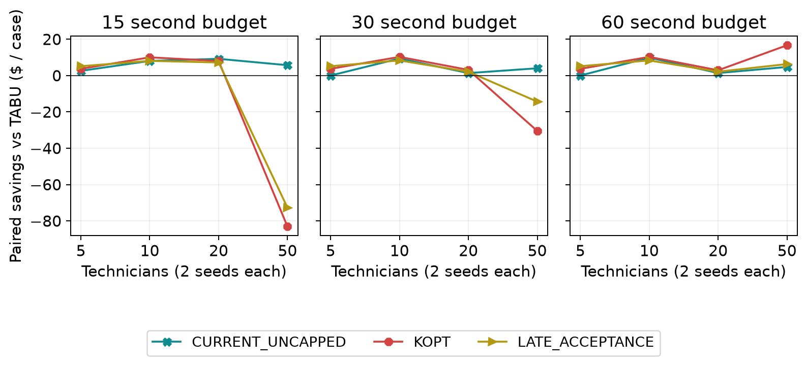

# Scheduler algorithm comparison | 29 September 2026

## Decision summary

Retain the current booking selection and daily TABU default. Prioritize BOUNDED booking and CURRENT_UNCAPPED daily follow-up, investigate SHARED reliability, and evaluate KOPT by fleet size and available time. These modeled fixtures do not establish production savings.

BOUNDED confirmed 360/480 held-out requests versus INSERTION's 346/480, a 2.92 percentage-point gain. Its service advantage depends on concurrency. CURRENT_UNCAPPED has positive paired mean savings at every tested daily budget. KOPT's shorter-budget losses are concentrated in the largest fleet.

Coverage is the main limit: all 240 daily solver cases use CLUSTERED workloads. Only two held-out seeds (59 and 83) provide independent seed replication; they do not establish geographic diversity. Held-out booking uses dispersed GraphHopper 11 roads, but that coverage must not be attributed to daily solvers.

## Experiment overview

Booking chooses where to admit a new request while preserving confirmed customer arrival windows. Daily optimization rearranges already accepted work without admitting demand. Internal planned arrival times and technician assignments may change while the customer promise remains valid. A completion flag describes search work, not whether a request was served or whether all possible schedules are infeasible.

| Experiment | Retained scope | Comparison limit |
| --- | --- | --- |
| Booking original | 12 cases; earlier policy | Bundled policy/lifecycle changes; not isolated algorithm evidence |
| Booking screen | 30 cases; clustered; 3 requests/case | Repeated geometry; one independent stream |
| Booking held out | 144 cases; 2 seeds; 5/10/20/50 technicians; concurrency 1/5/10; cold/warm | 48 cases and 480 requests per tested variant |
| Booking stress / browser | 8 / 24 cases; 10 requests/case | Stress: INSERTION/BOUNDED; browser: INSERTION only |
| Daily | 240 clustered cases: 48 screen + 192 held out | 8 variants; held: 2 seeds x 4 fleets x 3 budgets |

## Mechanisms in plain language

| Term | What the search does |
| --- | --- |
| Insertion | Places a new visit among existing stops without rearranging those stops. |
| Relocation / swap | Moves one visit to another position or route / exchanges two visits. |
| Reversal / sublist | Reverses an ordered stretch of visits / moves a stretch together. |
| Beam search | Retains a limited number of promising arrangements at each depth. |
| Tabu | Temporarily discourages revisiting recently changed entities to escape local traps. |
| Late acceptance | May accept a move if it beats an older solution, even when it worsens the current one. |
| K-opt | Reconnects several route links to explore coordinated order changes. |
| Ruin/recreate | Removes related visits, then rebuilds their placement to explore a larger change. |

Modeled operating cost includes paid time and mileage. Retained rates are $30/hour regular labor, $45/hour overtime labor (new overtime prohibited), and $0.67/mile. Travel buffers are 20% plus five minutes per leg. Waiting and buffers can change cost even with little or no road travel. These rates and fixture routes are assumptions, not measured payroll savings.

## Booking configuration differences

| Variant | Configuration and comparison |
| --- | --- |
| INSERTION | Policy-only control; eligible routes and insertion positions. |
| BOUNDED | Relocation/swap/reversal: 6 routes, depth 2, beam 8, 500 arrangements/window. Adds a search family, not one isolated move. |
| EXPANDED | 12 routes, depth 3, beam 16, 2,000 arrangements/window and ranked moves. Multiple settings change together. |
| RUIN_RECREATE | EXPANDED plus complete reconstruction of removed related visits. |
| SHARED | Same reconstruction search with shared route evaluation across windows. The intended evaluation-sharing comparison is against RUIN_RECREATE in the screen. |

## Booking comparison

Figure 1. Separate categorical stages, with no connecting trend lines. Service counts confirmed requests; latency is the arithmetic mean of each case's p95, not an overall p95. Missing variants are untested. Original policy, stress, and browser populations differ.

| Held variant | Served / rate | Unsuccessful | Incomplete | Served AND incomplete | Unknown completion |
| --- | --- | --- | --- | --- | --- |
| INSERTION | 346/480 (72.1%) | 134 | 132 | 0 | 0 |
| BOUNDED | 360/480 (75.0%) | 120 | 120 | 0 | 0 |
| SHARED | 334/480 (69.6%) | 146 | 153 | 7 | 0 |

Service and search completion overlap: 7 SHARED requests were served despite incomplete search. Unsuccessful means no confirmed service in this attempt; it does not prove infeasibility. Completion is reported separately, so incomplete counts must not be added to unsuccessful counts. SHARED's original final audit returned HTTP 409; its recovery run is separate.

## Illustrative fixture evidence: rearrangement admits C

| Technician | Before C | After C |
| --- | --- | --- |
| omaha | A | C > B |
| nearby | B | A |

| Visit | Promised arrival window (UTC) | Planned arrival (UTC) |
| --- | --- | --- |
| A | 13:00 to 17:00 (end exclusive) | 13:05 |
| B | 13:00 to 17:00 (end exclusive) | 15:15 |
| C | 13:00 to 17:00 (end exclusive) | 13:40 |

In reassignment-240-BOUNDED, A moves to the nearby technician and B to Omaha, allowing new request C to be served. Retained arrival plans remain inside the existing promises. The resulting plan has 100 driving minutes, 0 overtime minutes and $183.31 modeled cost. The no-new-request oracle is $91.66; the difference includes serving C and is not a savings estimate. This constructed fixture illustrates the mechanism, not its frequency in operations.

## Held-out service by operating condition

Each breakdown pools the other tested dimensions within the same held-out population. It describes marginal outcomes, not an isolated causal effect. Percentage-point differences use INSERTION within the same group; all group denominators are equal across the three variants.

## Concurrency

| Concurrency | Variant | Served | Rate | Delta pp |
| --- | --- | --- | --- | --- |
| 1 | INSERTION | 160/160 | 100.00% | reference |
| 1 | BOUNDED | 158/160 | 98.75% | -1.25 |
| 1 | SHARED | 160/160 | 100.00% | +0.00 |
| 5 | INSERTION | 96/160 | 60.00% | reference |
| 5 | BOUNDED | 100/160 | 62.50% | +2.50 |
| 5 | SHARED | 96/160 | 60.00% | +0.00 |
| 10 | INSERTION | 90/160 | 56.25% | reference |
| 10 | BOUNDED | 102/160 | 63.75% | +7.50 |
| 10 | SHARED | 78/160 | 48.75% | -7.50 |

## Fleet size

| Fleet size | Variant | Served | Rate | Delta pp |
| --- | --- | --- | --- | --- |
| 5 | INSERTION | 86/120 | 71.67% | reference |
| 5 | BOUNDED | 91/120 | 75.83% | +4.17 |
| 5 | SHARED | 95/120 | 79.17% | +7.50 |
| 10 | INSERTION | 88/120 | 73.33% | reference |
| 10 | BOUNDED | 92/120 | 76.67% | +3.33 |
| 10 | SHARED | 99/120 | 82.50% | +9.17 |
| 20 | INSERTION | 88/120 | 73.33% | reference |
| 20 | BOUNDED | 89/120 | 74.17% | +0.83 |
| 20 | SHARED | 91/120 | 75.83% | +2.50 |
| 50 | INSERTION | 84/120 | 70.00% | reference |
| 50 | BOUNDED | 88/120 | 73.33% | +3.33 |
| 50 | SHARED | 49/120 | 40.83% | -29.17 |

## Cache condition

| Cache condition | Variant | Served | Rate | Delta pp |
| --- | --- | --- | --- | --- |
| cold | INSERTION | 174/240 | 72.50% | reference |
| cold | BOUNDED | 179/240 | 74.58% | +2.08 |
| cold | SHARED | 168/240 | 70.00% | -2.50 |
| warm | INSERTION | 172/240 | 71.67% | reference |
| warm | BOUNDED | 181/240 | 75.42% | +3.75 |
| warm | SHARED | 166/240 | 69.17% | -2.50 |

At concurrency 1, BOUNDED serves 158/160 versus INSERTION's 160/160. BOUNDED serves more at concurrency 5 and 10. Its aggregate advantage does not mean it wins in every operating condition.

## Latency and matched-customer cost

Request latency is the harness elapsedMs for the search, including queueing and polling, excluding selectionElapsedMs, address entry and geocoding. Request median and pooled p95 use all attempts, including unsuccessful ones. Pooled p95 uses nearest rank, ceil(0.95 x N). Mean case p95 retains the original statistic, giving each case equal weight; it is not the p95 of the pooled requests.

| Stage | Variant | Requests | Mean case p95 s | Request median s | Pooled p95 s |
| --- | --- | --- | --- | --- | --- |
| original | INSERTION | 18 | 0.61 | 0.50 | 0.85 |
| original | BOUNDED | 18 | 0.85 | 0.70 | 1.13 |
| screen | INSERTION | 18 | 0.75 | 0.58 | 0.97 |
| screen | BOUNDED | 18 | 3.37 | 2.82 | 4.08 |
| screen | EXPANDED | 18 | 20.03 | 18.80 | 25.95 |
| screen | RUIN_RECREATE | 18 | 23.37 | 19.01 | 31.44 |
| screen | SHARED | 18 | 19.51 | 17.49 | 25.40 |
| held | INSERTION | 480 | 2.88 | 1.02 | 4.57 |
| held | BOUNDED | 480 | 15.71 | 5.79 | 27.08 |
| held | SHARED | 480 | 64.15 | 32.77 | 121.03 |
| stress | INSERTION | 40 | 3.61 | 2.32 | 3.64 |
| stress | BOUNDED | 40 | 6.36 | 3.57 | 6.50 |
| browser | INSERTION | 240 | 3.53 | 1.63 | 5.43 |

Cost pairing requires identical served request indices on the same seed, fleet, workload, concurrency, cache condition and dataset fingerprint. First average matched case savings within a stream, then average streams equally. Clustered screen cases collapse to one stream; dispersed held-out streams are seed units. Do not extrapolate these subset estimates to all requests or production.

| Stage | Vs INSERTION | Matched / tested cases | Stream units | Mean savings / stream |
| --- | --- | --- | --- | --- |
| screen | BOUNDED | 6/6 | 1 | $12.50 |
| screen | EXPANDED | 6/6 | 1 | $15.00 |
| screen | RUIN_RECREATE | 6/6 | 1 | $20.00 |
| screen | SHARED | 6/6 | 1 | $20.00 |
| held | BOUNDED | 15/48 | 2 | $23.44 |
| held | EXPANDED | untested | untested | unavailable |
| held | RUIN_RECREATE | untested | untested | unavailable |
| held | SHARED | 16/48 | 2 | $31.36 |

## Search quality and booking implications

Figure 2. Fixed variant colors and markers across both stages, including SHARED in purple. Upper panels: fraction with a visible option by each checkpoint. Lower panels: incremental cost among visible options only; missing options are excluded, not zero. Visibility does not guarantee final confirmation.

Checkpoint time includes queueing and polling. Visible incremental cost is the option's modeled cost delta, not final total inventory cost. The lower panels have changing and variant-specific denominators, so they cannot rank all-request savings.

INSERTION: held service 346/480; mean case p95 2.9 s. Cost reference. Fast control and the only retained browser variant. Lower service than BOUNDED overall; retain as the current selection while testing changes.

BOUNDED: held service 360/480; mean case p95 15.7 s. Matched savings $23.44/stream (15/48 cases). Best aggregate held-out service, but slower and not better at sequential service. Prioritize replicated concurrent and sequential tests together.

EXPANDED: screen service 18/18; mean case p95 20.0 s. Matched savings $15.00/stream (6/6 cases). Screen-only broader beam and ranked moves. Higher matched cost savings than BOUNDED with substantially longer search; no held-out service claim is supported.

RUIN_RECREATE: screen service 18/18; mean case p95 23.4 s. Matched savings $20.00/stream (6/6 cases). Screen-only reconstruction improves matched cost further. Its runtime and limited geography require a broader test before promotion.

SHARED: held service 334/480; mean case p95 64.1 s. Matched savings $31.36/stream (16/48 cases). Matched cost savings coexist with lower service, long latency and a failed audit. Diagnose reliability before promotion.

## Daily-solver comparison

All daily results report zero violations. Held-out comparisons pair the same dataset fingerprint, seed, fleet and budget, with identical starting costs. Accepted cost is measured after the policy's reference and fairness phases. Lower accepted cost means greater cleanup from that same start; different starting costs do not explain rankings here.

| Configuration | What changes |
| --- | --- |
| CURRENT_CAPPED | Relocation/swap; 100 selected and accepted; 1,000-step cap. |
| CURRENT_UNCAPPED | Same moves/counts, without cap: isolates additional work. |
| LATE_ACCEPTANCE_CHANGE | Relocation only; history 400; 10,000 selected, 1 accepted. Changes acceptor and counts versus CURRENT. |
| LATE_ACCEPTANCE | Adds swap to CHANGE; same acceptor/counts. |
| TABU | Relocation/swap; entity tabu 7; 10,000 selected, 1,000 accepted. Changes multiple settings versus late acceptance. |
| SUBLIST | Late acceptance plus sublist movement/reversal. |
| KOPT | SUBLIST plus coordinated k-opt list moves. |
| RUIN_RECREATE | KOPT plus list ruin/recreate. |

Figure 3. Held-out paired mean savings in dollars/case; 8 matched cases per cell (2 seeds x 4 fleet sizes). Blue is positive, red negative. Heatmap colors encode savings, not algorithm identity. Each seed averages its four fleets, then seeds receive equal weight.

## Fleet size changes the daily conclusion

Figure 4. Selected follow-up candidates by fleet and budget; each point averages 2 matched seed cases. TABU is the zero reference. Equal spacing is categorical by fleet size. Full variant results follow in the appendix.

At 15 seconds, KOPT beats TABU in 6/6 smaller-fleet cases (5/10/20 technicians). It loses in 2/2 50-technician cases; their mean $-83.16 paired savings drives the overall $-15.36 mean.

At 30 seconds, KOPT beats TABU in 6/6 smaller-fleet cases (5/10/20 technicians). It loses in 2/2 50-technician cases; their mean $-30.48 paired savings drives the overall $-3.35 mean.

LATE_ACCEPTANCE already has a small positive mean at 30 seconds: $0.30/case, rising to $5.48 at 60 seconds. KOPT's largest overall advantage occurs at 60 seconds, but the shorter-budget smaller-fleet wins justify stratified follow-up.

## Individual seeds and paired wins

Positive savings means the candidate's accepted cost is lower than TABU. Wins/ties/losses compare exact integer cents, with no tolerance. Each seed column averages four fleets, and W/T/L counts all eight paired cases per budget. Two seeds are insufficient for a broad population claim.

## 15-second budget

| Variant | Seed 59 $ | Seed 83 $ | Mean $ | W/T/L (n=8) |
| --- | --- | --- | --- | --- |
| CURRENT_CAPPED | -5.15 | +2.80 | -1.18 | 4/1/3 |
| CURRENT_UNCAPPED | +2.35 | +10.41 | +6.38 | 6/1/1 |
| LATE_ACCEPTANCE_CHANGE | -25.66 | -18.05 | -21.85 | 5/0/3 |
| LATE_ACCEPTANCE | -16.25 | -9.92 | -13.09 | 6/0/2 |
| TABU | 0.00 | 0.00 | 0.00 | 0/8/0 |
| SUBLIST | -16.82 | -13.30 | -15.06 | 6/0/2 |
| KOPT | -17.73 | -12.98 | -15.36 | 6/0/2 |
| RUIN_RECREATE | -42.82 | -37.14 | -39.98 | 6/0/2 |

## 30-second budget

| Variant | Seed 59 $ | Seed 83 $ | Mean $ | W/T/L (n=8) |
| --- | --- | --- | --- | --- |
| CURRENT_CAPPED | -8.00 | -1.60 | -4.80 | 3/1/4 |
| CURRENT_UNCAPPED | -0.51 | +7.88 | +3.68 | 5/2/1 |
| LATE_ACCEPTANCE_CHANGE | -10.60 | -10.24 | -10.42 | 5/0/3 |
| LATE_ACCEPTANCE | -1.11 | +1.71 | +0.30 | 6/0/2 |
| TABU | 0.00 | 0.00 | 0.00 | 0/8/0 |
| SUBLIST | -8.30 | -5.07 | -6.68 | 5/0/3 |
| KOPT | -5.75 | -0.94 | -3.35 | 6/0/2 |
| RUIN_RECREATE | -39.43 | -34.02 | -36.72 | 6/0/2 |

## 60-second budget

| Variant | Seed 59 $ | Seed 83 $ | Mean $ | W/T/L (n=8) |
| --- | --- | --- | --- | --- |
| CURRENT_CAPPED | -8.00 | -1.59 | -4.79 | 3/1/4 |
| CURRENT_UNCAPPED | +0.05 | +7.93 | +3.99 | 5/2/1 |
| LATE_ACCEPTANCE_CHANGE | -2.31 | +0.83 | -0.74 | 5/0/3 |
| LATE_ACCEPTANCE | +3.26 | +7.70 | +5.48 | 8/0/0 |
| TABU | 0.00 | 0.00 | 0.00 | 0/8/0 |
| SUBLIST | +5.13 | +8.20 | +6.67 | 7/0/1 |
| KOPT | +5.59 | +11.17 | +8.38 | 8/0/0 |
| RUIN_RECREATE | -25.02 | -23.80 | -24.41 | 6/0/2 |

## Daily implications

All daily implications below are limited to two clustered held-out seeds. Each estimate has 8/8 matched cases per budget; mean gains can conceal seed and fleet differences.

CURRENT_CAPPED: paired savings at 15/30/60 seconds are $-1.18, $-4.80, $-4.79 per case (8/8 matched at each budget). Speed reference: about three seconds regardless of allowance. Lower cost quality than TABU at all budgets; useful when little time is available.

CURRENT_UNCAPPED: paired savings at 15/30/60 seconds are $6.38, $3.68, $3.99 per case (8/8 matched at each budget). Positive paired mean at every budget. Prioritize replication across dispersed and operational workloads; it consumes the full allowance.

LATE_ACCEPTANCE_CHANGE: paired savings at 15/30/60 seconds are $-21.85, $-10.42, $-0.74 per case (8/8 matched at each budget). Relocation-only trajectory approaches TABU with more time but remains behind at each tested budget. No promotion signal.

LATE_ACCEPTANCE: paired savings at 15/30/60 seconds are $-13.09, $0.30, $5.48 per case (8/8 matched at each budget). Adding swap improves on change-only at every budget; positive means at 30 and 60 seconds. Verify that advantage with broader workloads.

TABU: paired savings at 15/30/60 seconds are $0.00, $0.00, $0.00 per case (8/8 matched at each budget). Retained production reference. Additional mean cleanup is flat from 30 to 60 seconds here; retain until broader evidence supports changing it.

SUBLIST: paired savings at 15/30/60 seconds are $-15.06, $-6.68, $6.67 per case (8/8 matched at each budget). Positive at 60 seconds after shorter-budget losses. Longer-budget candidate; combined moves do not isolate an individual move effect.

KOPT: paired savings at 15/30/60 seconds are $-15.36, $-3.35, $8.38 per case (8/8 matched at each budget). Largest overall 60-second mean advantage. Shorter-budget wins in smaller fleets are hidden by 50-technician losses; evaluate fleet and budget jointly.

RUIN_RECREATE: paired savings at 15/30/60 seconds are $-39.98, $-36.72, $-24.41 per case (8/8 matched at each budget). Improves its own starting schedule but remains behind TABU. Larger neighborhood search does not repay its cost in this matrix.

Historical context: the separate September 24 comparison retained 294 accepted cases across seven workload families and three fleet sizes. All eight variants ran at seed 17; capped, uncapped and TABU repeated at seeds 23 and 41. TABU had lower aggregate accepted cost than both retained alternatives in every seed, supporting the default. Its configurations, policy and populations differ from September 29; do not pool the experiments. See the linked daily solver protocol for exclusions and original measurements.

## Recommendations and follow-up

| Priority / question | Additional experiment | Decision informed |
| --- | --- | --- |
| 1. BOUNDED service tradeoff | More independent dispersed streams, balanced across concurrency, fleet and cache; record confirmation failures and completion separately. | Whether its aggregate service gain survives the sequential shortfall and latency cost. |
| 1. CURRENT_UNCAPPED generality | Matched TABU comparisons across dispersed, tight-window, skill and near-capacity work, retaining cost and fairness acceptance. | Whether to change the daily default. |
| 2. SHARED reliability | Reproduce the retained HTTP 409 audit with complete client/server timing; trace served/incomplete overlap and final revalidation. | Whether the candidate is reliable enough for broader quality tests. |
| 2. KOPT fleet/budget interaction | Replicated 5/10/20/50-technician comparisons at 15/30/60 seconds; preserve paired fingerprints. | Whether fleet-specific or longer-budget use is justified. |
| 3. Longer-budget alternatives | Replicate LATE_ACCEPTANCE and SUBLIST beside KOPT and TABU on the same schedules. | Whether their cost/fairness/runtime tradeoffs merit promotion. |
| 3. Expanded booking coverage | Test EXPANDED and RUIN_RECREATE on dispersed concurrent demand after reliability priorities. | Whether screen-only cost gains survive realistic service constraints. |

No new benchmark runs, API changes or production configuration changes are part of this report revision. The recommendation remains to retain defaults pending the follow-up evidence.

## Technical appendix: metric glossary

| Metric | Definition and denominator |
| --- | --- |
| Operating cost | Modeled paid labor plus mileage under retained rates. Includes existing workload; final totals are not automatically savings. |
| Incremental cost | Visible option cost delta for adding a request; mean includes only searches with visible options at that checkpoint. |
| Paired booking savings | INSERTION final cost minus candidate final cost for identical served customers. Average within stream, then across streams; matched coverage shown beside estimate. |
| Paired daily savings | TABU accepted cost minus candidate accepted cost on the same case/budget. Average fleets within seed then seeds equally. |
| Served / unsuccessful | Confirmed request / attempt without confirmed service. Exhaustive and mutually exclusive for service only. |
| Incomplete / unknown | Explicit false / unavailable search-completion flag. Independent of service; never interpreted as proven infeasibility. |
| Visible option | At least one non-null cost incumbent by checkpoint. May fail final revalidation. |
| Mean case p95 | Arithmetic mean of retained p95Ms for cases in a stage/variant. Not an overall request percentile. |
| Request median / pooled p95 | Median / nearest-rank 95th percentile of all attempt elapsedMs within the stated group. |
| Fairness / waiting | Capacity-weighted utilization variance (lower is more balanced) / paid waiting minutes. |
| Schedule change | Changed technician assignments and retimed appointments, reported separately. Customer arrival promises remain constraints. |
| Untested / unavailable / zero | No experiment / metric cannot be estimated / measured numeric zero. These are not interchangeable. |

## Technical appendix: complete daily fleet comparison

Each cell is mean paired savings in dollars/case against TABU for exactly 2/2 matched seed cases at that fleet and budget. This appendix includes every variant, including the zero-cost reference.

## 15 seconds: savings by technician count

| Variant | 5 | 10 | 20 | 50 |
| --- | --- | --- | --- | --- |
| CURRENT_CAPPED | +2.57 | +7.83 | -2.60 | -12.50 |
| CURRENT_UNCAPPED | +2.57 | +8.05 | +9.20 | +5.69 |
| LATE_ACCEPTANCE_CHANGE | +4.69 | +7.42 | +1.82 | -101.36 |
| LATE_ACCEPTANCE | +5.14 | +8.07 | +7.20 | -72.76 |
| TABU | 0.00 | 0.00 | 0.00 | 0.00 |
| SUBLIST | +4.42 | +9.55 | +4.40 | -78.61 |
| KOPT | +3.69 | +10.03 | +8.00 | -83.16 |
| RUIN_RECREATE | +3.69 | +10.25 | +2.65 | -176.51 |

## 30 seconds: savings by technician count

| Variant | 5 | 10 | 20 | 50 |
| --- | --- | --- | --- | --- |
| CURRENT_CAPPED | +2.57 | +8.07 | -10.25 | -19.60 |
| CURRENT_UNCAPPED | 0.00 | +9.38 | +1.35 | +4.00 |
| LATE_ACCEPTANCE_CHANGE | +4.69 | +7.67 | -2.70 | -51.34 |
| LATE_ACCEPTANCE | +5.14 | +8.32 | +2.08 | -14.36 |
| TABU | 0.00 | 0.00 | 0.00 | 0.00 |
| SUBLIST | +4.42 | +9.80 | -1.23 | -39.73 |
| KOPT | +3.69 | +10.28 | +3.12 | -30.48 |
| RUIN_RECREATE | +3.69 | +10.50 | +0.38 | -161.46 |

## 60 seconds: savings by technician count

| Variant | 5 | 10 | 20 | 50 |
| --- | --- | --- | --- | --- |
| CURRENT_CAPPED | +2.57 | +8.07 | -10.25 | -19.57 |
| CURRENT_UNCAPPED | 0.00 | +9.88 | +1.38 | +4.72 |
| LATE_ACCEPTANCE_CHANGE | +4.69 | +7.67 | -1.48 | -13.85 |
| LATE_ACCEPTANCE | +5.14 | +8.32 | +2.12 | +6.32 |
| TABU | 0.00 | 0.00 | 0.00 | 0.00 |
| SUBLIST | +4.42 | +9.80 | -0.60 | +13.04 |
| KOPT | +3.69 | +10.28 | +2.90 | +16.66 |
| RUIN_RECREATE | +3.69 | +10.50 | +1.65 | -113.47 |

## Technical appendix: accepted schedule diagnostics

Held-out arithmetic means over eight cases per variant/budget. Cost change is accepted after minus before (negative means cleanup). Variance is accepted capacity-weighted utilization variance; waiting is paid minutes after acceptance. Assignment and timing changes count affected appointments. All 240 retained daily cases report zero violations.

## 15-second diagnostics

| Variant | Cost change | Elapsed s | Variance | Waiting min | Assigned | Retimed |
| --- | --- | --- | --- | --- | --- | --- |
| CURRENT_CAPPED | $-54.46 | 3.24 | 0.008377 | 7.00 | 65.75 | 79.25 |
| CURRENT_UNCAPPED | $-62.02 | 15.01 | 0.012830 | 14.50 | 65.12 | 78.38 |
| LATE_ACCEPTANCE_CHANGE | $-33.78 | 15.00 | 0.007126 | 10.12 | 70.00 | 75.50 |
| LATE_ACCEPTANCE | $-42.55 | 15.00 | 0.010876 | 12.62 | 67.88 | 76.50 |
| TABU | $-55.64 | 15.00 | 0.017485 | 9.38 | 63.50 | 79.00 |
| SUBLIST | $-40.58 | 15.01 | 0.016880 | 13.00 | 70.88 | 78.12 |
| KOPT | $-40.28 | 15.01 | 0.011271 | 11.12 | 70.38 | 77.12 |
| RUIN_RECREATE | $-15.66 | 15.02 | 0.013895 | 14.75 | 69.88 | 77.38 |

## 30-second diagnostics

| Variant | Cost change | Elapsed s | Variance | Waiting min | Assigned | Retimed |
| --- | --- | --- | --- | --- | --- | --- |
| CURRENT_CAPPED | $-54.46 | 2.92 | 0.008377 | 7.00 | 65.75 | 79.25 |
| CURRENT_UNCAPPED | $-62.94 | 30.00 | 0.011419 | 6.00 | 66.50 | 79.25 |
| LATE_ACCEPTANCE_CHANGE | $-48.84 | 30.00 | 0.015817 | 16.88 | 70.25 | 77.62 |
| LATE_ACCEPTANCE | $-59.56 | 30.00 | 0.017330 | 17.25 | 67.88 | 77.88 |
| TABU | $-59.26 | 30.00 | 0.014413 | 6.88 | 64.38 | 78.38 |
| SUBLIST | $-52.58 | 30.00 | 0.015058 | 10.50 | 68.62 | 78.25 |
| KOPT | $-55.92 | 30.00 | 0.012707 | 13.75 | 71.12 | 77.38 |
| RUIN_RECREATE | $-22.54 | 30.01 | 0.010853 | 11.38 | 71.50 | 78.38 |

## 60-second diagnostics

| Variant | Cost change | Elapsed s | Variance | Waiting min | Assigned | Retimed |
| --- | --- | --- | --- | --- | --- | --- |
| CURRENT_CAPPED | $-54.46 | 2.82 | 0.008377 | 7.00 | 65.75 | 79.25 |
| CURRENT_UNCAPPED | $-63.25 | 60.01 | 0.009092 | 7.62 | 67.12 | 79.12 |
| LATE_ACCEPTANCE_CHANGE | $-58.52 | 60.00 | 0.017492 | 12.50 | 68.88 | 77.75 |
| LATE_ACCEPTANCE | $-64.73 | 60.01 | 0.011970 | 18.00 | 68.38 | 77.50 |
| TABU | $-59.26 | 60.00 | 0.014413 | 6.88 | 64.50 | 78.38 |
| SUBLIST | $-65.92 | 60.00 | 0.016121 | 7.75 | 70.12 | 78.88 |
| KOPT | $-67.64 | 60.00 | 0.012173 | 10.38 | 69.38 | 78.62 |
| RUIN_RECREATE | $-34.85 | 60.01 | 0.009020 | 8.62 | 71.12 | 76.75 |

## Technical appendix: exploratory intervals

Percentile bootstrap intervals resample only two independent held-out seeds after averaging fleets (daily) or matched cases (booking). They are exploratory, not reliable population confidence intervals. Screen booking has one stream, so no interval is available. Individual seed values in the main report should receive greater weight than these intervals.

| Daily variant | 15 s: mean [interval] $ | 30 s: mean [interval] $ | 60 s: mean [interval] $ |
| --- | --- | --- | --- |
| CURRENT_CAPPED | -1.18 [-5.15, +2.80] | -4.80 [-8.00, -1.60] | -4.79 [-8.00, -1.59] |
| CURRENT_UNCAPPED | +6.38 [+2.35, +10.41] | +3.68 [-0.51, +7.88] | +3.99 [+0.05, +7.93] |
| LATE_ACCEPTANCE_CHANGE | -21.85 [-25.66, -18.05] | -10.42 [-10.60, -10.24] | -0.74 [-2.31, +0.83] |
| LATE_ACCEPTANCE | -13.09 [-16.25, -9.92] | +0.30 [-1.11, +1.71] | +5.48 [+3.26, +7.70] |
| TABU | baseline | baseline | baseline |
| SUBLIST | -15.06 [-16.82, -13.30] | -6.68 [-8.30, -5.07] | +6.67 [+5.13, +8.20] |
| KOPT | -15.36 [-17.73, -12.98] | -3.35 [-5.75, -0.94] | +8.38 [+5.59, +11.17] |
| RUIN_RECREATE | -39.98 [-42.82, -37.14] | -36.72 [-39.43, -34.02] | -24.41 [-25.02, -23.80] |

| Booking stage / variant | Matched / tested | Mean / interval per stream |
| --- | --- | --- |
| screen / BOUNDED | 6/6 | $12.50 / unavailable: one stream |
| screen / EXPANDED | 6/6 | $15.00 / unavailable: one stream |
| screen / RUIN_RECREATE | 6/6 | $20.00 / unavailable: one stream |
| screen / SHARED | 6/6 | $20.00 / unavailable: one stream |
| held / BOUNDED | 15/48 | $23.44 / $23.28 to $23.59 |
| held / SHARED | 16/48 | $31.36 / $29.84 to $32.87 |

## Technical appendix: evidence and reproducibility

The inventory retains 218 validated booking cases and 240 daily solver cases. Every inventoried raw file is checked by SHA-256; compressed JSONL content is also checked by uncompressed SHA-256. The original failed SHARED seed-83 audit is retained and excluded from successful cases, with its recovery separately labeled. Eight original stress-normal-only audits omitted overflow dates and remain excluded; full-date reruns supply the validated stress set. No inclusion rules have changed.

Failure detail: the original SHARED seed-83, 50-technician, concurrency-five cold run returned HTTP 409 at final audit. Detailed client timing and reason were not retained. Later audit evidence does not erase the failure. Frozen artifacts ran concurrently on one Windows workstation, limiting timing generalization. Browser coverage is INSERTION only and does not establish production concurrency performance.

Reproduce: install reportlab, matplotlib and pymupdf for Python 3. Run py -3 infra/build-scheduler-algorithm-comparison.py to regenerate both formats and shared PNG figures. Run it with --check to reconcile raw evidence and verify report content, images and links. Run py -3 infra/test_scheduler_algorithm_comparison.py for targeted regression checks. Raw evidence remains immutable.

- [Retained summary](evidence/scheduler-field-2026-09-29/summary.json)
- [Experiment manifest](evidence/scheduler-field-2026-09-29/experiment-manifest.json)
- [Validation records](evidence/scheduler-field-2026-09-29/validation.json)
- [Illustrative fixture](evidence/scheduler-field-2026-09-29/field-reassignment-240-BOUNDED.json)
- [Full field validation](scheduler-field-validation.md)
- [September 24 daily solver protocol](solver-benchmarks.md)
