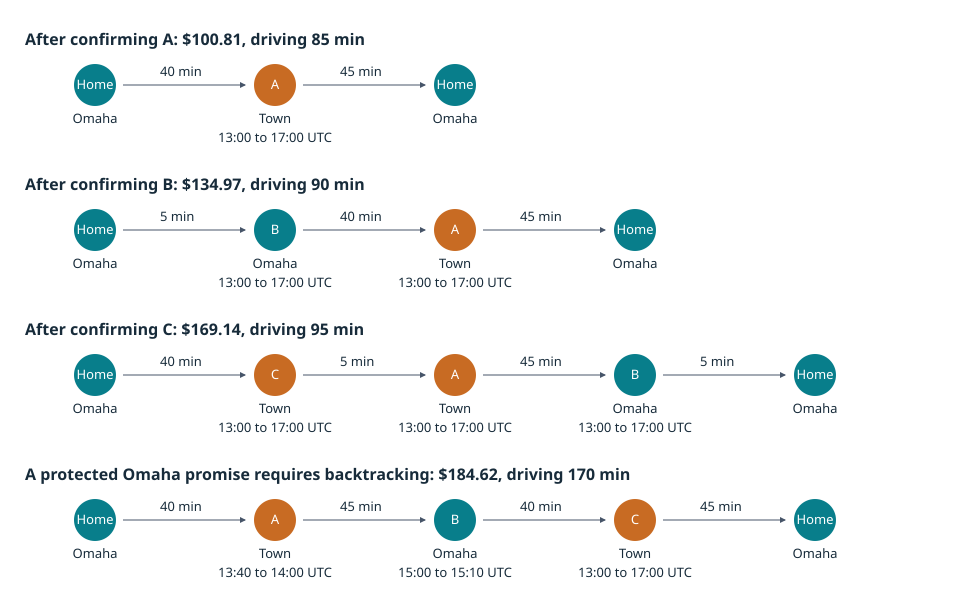

# Scheduler policy, search, and field validation

Execution status: complete. Retained 218/218 validated booking cases and 240/240 daily-solver cases. Every raw case remains included in its stage. Separately retained failures are disclosed below.

## Decision and scope

Adopt the single-offer, four-hour, zero-new-overtime safety policy and durable search lifecycle. Retain the existing production search selection and daily TABU default. Expanded search remains experimental. No algorithm promotion is justified by this evidence alone: concurrent service outcomes, limited independent geography, and runtime remain material constraints. These are modeled fixture results, not operational savings or a reproduction from customer production records.

Baseline checkout: `c28a24c4c0c1b4614b442c7a362d205cfa7e0db3`. Original behavior is rebuilt in an isolated checkout and recorded separately as `original`; `screen` and `held` use the new policy. Historical reports and artifacts remain unchanged. Algorithm rollback continues through the common policy and reservation validation layer.

[Machine-readable totals and raw-file checksums](evidence/scheduler-field-2026-09-29/summary.json), [experiment manifest](evidence/scheduler-field-2026-09-29/experiment-manifest.json), and [validation checks](evidence/scheduler-field-2026-09-29/validation.json) back this report. Gzip archives preserve the exact original JSONL/log bytes. Algorithm rollback means selecting the earlier algorithm in this policy release, not deploying a pre-policy binary.

## Policy and implementation

New bookings reserve one best-found offer ranked by incremental operating cost, workload balance, earlier promise, and stable identifiers. Arrival promises span four hours and start hourly. Service and return travel must fit regular availability. Existing confirmed dates/windows, actual dated home/depot endpoints, absences, skills, directed routing, holds, and the 06:00 America/Chicago freeze remain hard boundaries. Existing overtime routes retain their facts and are excluded from new work and flagged for follow-up. An already infeasible snapshot still fails closed; it is not silently repaired during booking.

Insertion covers the normal horizon first, including weekend availability inside the weekday-counted horizon. The search only enters five additional weekdays after a completed normal search finds no candidate, then selects the cheapest candidate on the first feasible overflow date. An interrupted search does not establish infeasibility.

Durable start/status/cancel operations use idempotent UUIDs, one active search per job, a database admission cap of 16, two workers per instance, a 15-second lease renewed each second, and a finite two-minute work lifetime. Search runs outside transactions. Publication revalidates under short transactions and permits one fresh-snapshot retry. Offer TTL starts at publication. Browser reload reconnects using an opaque saved pointer; explicit cancellation releases capacity. Lost ownership becomes a terminal incomplete result. Completed-no-candidate, incomplete, cancelled, and failed results remain distinct.

## Tested algorithms and hypotheses

| Variant | Work limits / intended effect | Decision |
| --- | --- | --- |
| INSERTION | Every eligible route and insertion position; policy-only control | Retain control |
| BOUNDED | 6 routes, depth 2, beam 8, 500 arrangements/window; relocation, swap, reversal | Retain existing option |
| EXPANDED | 12 routes, depth 3, beam 16, 2,000 arrangements/window; rank moves before truncation | Screened out in favor of stronger shared variant; not promoted |
| RUIN_RECREATE | Expanded plus removal of 2/3 related visits, constrained/regret-first complete reconstruction | Screened out in favor of shared variant with equal screen cost and lower runtime |
| SHARED | Same reconstruction search with shared route evaluation across windows | Reject promotion: high-concurrency latency, served-demand deterioration, and retained audit failure |

Ruin-and-recreate counts reconstruction attempts and route/candidate work separately from arrangement limits. Incomplete reconstruction is rejected. Shared evaluation isolates route-evaluation caching; neighborhood ranking caches still exist in the expanded control. Stronger variants are never attributed to an individual move type solely from a combined result. Daily configurations retain their exact XML and phase counters in raw artifacts.

## Booking results

| Stage | Variant | Cases | Served / requests | Incomplete | Mean case p95, ms | Total modeled final cost |
| --- | --- | --- | --- | --- | --- | --- |
| browser | INSERTION | 24 | 141/240 | 53 | 3,526 | $195,066.06 |
| held | BOUNDED | 48 | 360/480 | 120 | 15,708 | $390,664.31 |
| held | INSERTION | 48 | 346/480 | 132 | 2,877 | $391,365.76 |
| held | SHARED | 48 | 334/480 | 153 | 64,149 | $390,248.13 |
| original | BOUNDED | 6 | 18/18 | 0 | 845 | $33,992.50 |
| original | INSERTION | 6 | 18/18 | 0 | 608 | $34,065.00 |
| screen | BOUNDED | 6 | 18/18 | 0 | 3,373 | $33,990.00 |
| screen | EXPANDED | 6 | 18/18 | 0 | 20,029 | $33,975.00 |
| screen | INSERTION | 6 | 18/18 | 0 | 750 | $34,065.00 |
| screen | RUIN_RECREATE | 6 | 18/18 | 0 | 23,365 | $33,945.00 |
| screen | SHARED | 6 | 18/18 | 0 | 19,506 | $33,945.00 |
| stress | BOUNDED | 4 | 18/40 | 11 | 7,855 | $145,500.00 |
| stress | INSERTION | 4 | 22/40 | 5 | 4,725 | $145,500.00 |

Final-cost totals include the existing ten-day workload and differing served customers. They are inventory totals, not a causal savings comparison. The screen has only three requests per case. Clustered jobs coincide with technician homes and have zero routed road seconds; improvements there describe modeled buffer/waiting cleanup. Held-out dispersed cases use GraphHopper 11 and actual nonzero directed road travel where endpoints differ.

### Original baseline versus policy-only controls

| Variant | Seed / technicians | Original / new served | Original cost | New policy cost | Same customers |
| --- | --- | --- | --- | --- | --- |
| BOUNDED | 17/10 | 3/3 | $3,792.50 | $3,792.50 | True |
| BOUNDED | 17/20 | 3/3 | $7,537.50 | $7,537.50 | True |
| BOUNDED | 23/10 | 3/3 | $3,792.50 | $3,792.50 | True |
| BOUNDED | 23/20 | 3/3 | $7,537.50 | $7,537.50 | True |
| BOUNDED | 41/10 | 3/3 | $3,795.00 | $3,792.50 | True |
| BOUNDED | 41/20 | 3/3 | $7,537.50 | $7,537.50 | True |
| INSERTION | 17/10 | 3/3 | $3,802.50 | $3,802.50 | True |
| INSERTION | 17/20 | 3/3 | $7,552.50 | $7,552.50 | True |
| INSERTION | 23/10 | 3/3 | $3,802.50 | $3,802.50 | True |
| INSERTION | 23/20 | 3/3 | $7,552.50 | $7,552.50 | True |
| INSERTION | 41/10 | 3/3 | $3,802.50 | $3,802.50 | True |
| INSERTION | 41/20 | 3/3 | $7,552.50 | $7,552.50 | True |

These pairs have identical seeded fixture fingerprints and request streams. The original policy includes two-hour promises and multiple choices; the new policy uses four-hour promises, one choice, no new overtime, and durable search. This bundled policy/lifecycle comparison cannot attribute its difference to a single policy. The independent field two-by-two experiment isolates promise width from insertion versus rearrangement. Immediate snapshots are compared there; sequential histories are allowed to diverge in this replay.

### Resource and route diagnostics

| Stage / variant | CPU sec | Peak heap MiB | Requested road pairs | Road min | Paid waiting min | Mean variance |
| --- | --- | --- | --- | --- | --- | --- |
| browser/INSERTION | 71.4 | 371.7 | 0 | 289.5 | 0 | 0.004291 |
| held/BOUNDED | 2,581.2 | 682.0 | 2098 | 501.9 | 0 | 0.005199 |
| held/INSERTION | 135.4 | 379.4 | 2014 | 687.2 | 0 | 0.004259 |
| held/SHARED | 29,390.9 | 2,498.0 | 2096 | 527.8 | 0 | 0.005059 |
| original/BOUNDED | 34.9 | 365.1 | 0 | 0.0 | 0 | 0.004526 |
| original/INSERTION | 22.7 | 93.5 | 0 | 0.0 | 0 | 0.004083 |
| screen/BOUNDED | 93.9 | 578.7 | 0 | 0.0 | 0 | 0.004690 |
| screen/EXPANDED | 671.5 | 1,166.4 | 0 | 0.0 | 0 | 0.004676 |
| screen/INSERTION | 19.2 | 97.8 | 0 | 0.0 | 0 | 0.004083 |
| screen/RUIN_RECREATE | 782.7 | 1,173.2 | 0 | 0.0 | 0 | 0.005611 |
| screen/SHARED | 625.7 | 904.0 | 0 | 0.0 | 0 | 0.005611 |
| stress/BOUNDED | 131.5 | 551.6 | 0 | 0.0 | 0 | 0.000000 |
| stress/INSERTION | 49.5 | 442.4 | 0 | 0.0 | 0 | 0.000000 |

Road and waiting totals include existing work across all cases. Queue time, request service dates (lead time/overflow), per-request outcomes, and CPU/heap/routing snapshots remain in the raw attempt records. The audit does not retain aggregate road distance, so no fleet-distance estimate is fabricated. The field fixtures independently retain meters. [Cost versus runtime chart](scheduler-field-cost-runtime.svg).

| Stage / variant | Mean queue ms | Mean lead days | Overflow | Candidate / route evaluations | Reconstructions | Prepared snapshots |
| --- | --- | --- | --- | --- | --- | --- |
| browser/INSERTION | 1,009 | 1.35 | 0 | 1,329,924/777,268 | 0 | 339 |
| held/BOUNDED | 4,973 | 1.52 | 0 | 225,038,628/27,891,583 | 0 | 636 |
| held/INSERTION | 999 | 1.33 | 0 | 2,682,282/1,568,214 | 0 | 653 |
| held/SHARED | 18,073 | 1.85 | 0 | 1,120,949,301/90,154,822 | 676164 | 502 |
| original/BOUNDED | 0 | 2.00 | 0 | 690,940/140,087 | 0 | 18 |
| original/INSERTION | 0 | 1.00 | 0 | 64,944/31,104 | 0 | 18 |
| screen/BOUNDED | 99 | 1.33 | 0 | 6,657,120/696,951 | 0 | 18 |
| screen/EXPANDED | 79 | 2.00 | 0 | 48,517,890/4,103,306 | 0 | 18 |
| screen/INSERTION | 99 | 1.00 | 0 | 48,708/27,714 | 0 | 18 |
| screen/RUIN_RECREATE | 94 | 1.67 | 0 | 48,148,380/4,691,775 | 25920 | 18 |
| screen/SHARED | 87 | 1.67 | 0 | 48,148,380/4,271,895 | 25920 | 18 |
| stress/BOUNDED | 2,209 | 15.00 | 18 | 59,505/392,561 | 0 | 66 |
| stress/INSERTION | 1,301 | 15.00 | 22 | 6,210/73,965 | 0 | 68 |

Lead time is calendar days from the day before the first normal booking date, for served requests only. Overflow counts served dates after the audited normal horizon. Prepared-snapshot counters include fresh-snapshot retries separately; failures before preparation may lack diagnostics, so these counters are not total CPU-work estimates. Original search has no reconstruction move, represented by zero for that algorithm rather than a missing scheduling fact.

### Paired comparison against new-policy insertion

| Stage | Variant | Same customers / different customers | Stream units | Served delta | Mean savings per stream | Exploratory 95% interval |
| --- | --- | --- | --- | --- | --- | --- |
| screen | BOUNDED | 6/0 | 1 | 0 | $12.50 | n/a |
| screen | EXPANDED | 6/0 | 1 | 0 | $15.00 | n/a |
| screen | RUIN_RECREATE | 6/0 | 1 | 0 | $20.00 | n/a |
| screen | SHARED | 6/0 | 1 | 0 | $20.00 | n/a |
| held | BOUNDED | 15/33 | 2 | 14 | $23.44 | $23.28 to $23.59 |
| held | EXPANDED | 0/0 | 0 | 0 | n/a | n/a |
| held | RUIN_RECREATE | 0/0 | 0 | 0 | n/a | n/a |
| held | SHARED | 16/32 | 2 | -12 | $31.36 | $29.84 to $32.87 |

Customer identity is the stable request index within an identical seeded dataset, not a random database UUID. Cost pairs with different served identities are excluded from savings estimates and counted explicitly. Fleet sizes, cache modes, and concurrency repetitions are averaged within a seeded request stream before a deterministic 10,000-resample percentile bootstrap. Clustered seeds generate the same request sequence and collapse to one stream, so no interval is reported there. Held-out dispersed evidence has only two independent seeded streams. These intervals are exploratory, not population confidence or independent operational replication. Served-demand deterioration blocks promotion even when equal-customer cost improves.

### Search quality over time

| Stage / variant | Seconds | Visible incumbent / searches | Mean visible incremental cost |
| --- | --- | --- | --- |
| browser/INSERTION | 1 | 93/240 | $19.39 |
| browser/INSERTION | 5 | 231/240 | $19.15 |
| browser/INSERTION | 15 | 240/240 | $19.37 |
| browser/INSERTION | 30 | 240/240 | $19.37 |
| browser/INSERTION | 60 | 240/240 | $19.37 |
| held/BOUNDED | 1 | 180/480 | $18.56 |
| held/BOUNDED | 5 | 305/480 | $17.69 |
| held/BOUNDED | 15 | 423/480 | $17.30 |
| held/BOUNDED | 30 | 466/480 | $17.02 |
| held/BOUNDED | 60 | 478/480 | $16.94 |
| held/INSERTION | 1 | 254/480 | $20.00 |
| held/INSERTION | 5 | 459/480 | $19.45 |
| held/INSERTION | 15 | 478/480 | $19.37 |
| held/INSERTION | 30 | 478/480 | $19.37 |
| held/INSERTION | 60 | 478/480 | $19.37 |
| held/SHARED | 1 | 188/480 | $18.84 |
| held/SHARED | 5 | 256/480 | $17.95 |
| held/SHARED | 15 | 293/480 | $17.83 |
| held/SHARED | 30 | 336/480 | $17.65 |
| held/SHARED | 60 | 399/480 | $17.22 |
| screen/BOUNDED | 1 | 14/18 | $15.71 |
| screen/BOUNDED | 5 | 18/18 | $13.33 |
| screen/BOUNDED | 15 | 18/18 | $13.33 |
| screen/BOUNDED | 30 | 18/18 | $13.33 |
| screen/BOUNDED | 60 | 18/18 | $13.33 |
| screen/EXPANDED | 1 | 11/18 | $21.72 |
| screen/EXPANDED | 5 | 18/18 | $15.00 |
| screen/EXPANDED | 15 | 18/18 | $12.50 |
| screen/EXPANDED | 30 | 18/18 | $12.50 |
| screen/EXPANDED | 60 | 18/18 | $12.50 |
| screen/INSERTION | 1 | 18/18 | $17.50 |
| screen/INSERTION | 5 | 18/18 | $17.50 |
| screen/INSERTION | 15 | 18/18 | $17.50 |
| screen/INSERTION | 30 | 18/18 | $17.50 |
| screen/INSERTION | 60 | 18/18 | $17.50 |
| screen/RUIN_RECREATE | 1 | 13/18 | $17.50 |
| screen/RUIN_RECREATE | 5 | 18/18 | $15.00 |
| screen/RUIN_RECREATE | 15 | 18/18 | $12.22 |
| screen/RUIN_RECREATE | 30 | 18/18 | $10.83 |
| screen/RUIN_RECREATE | 60 | 18/18 | $10.83 |
| screen/SHARED | 1 | 15/18 | $17.50 |
| screen/SHARED | 5 | 18/18 | $15.00 |
| screen/SHARED | 15 | 18/18 | $12.08 |
| screen/SHARED | 30 | 18/18 | $10.83 |
| screen/SHARED | 60 | 18/18 | $10.83 |
| stress/BOUNDED | 1 | 0/40 | n/a |
| stress/BOUNDED | 5 | 22/40 | $19.32 |
| stress/BOUNDED | 15 | 40/40 | $19.44 |
| stress/BOUNDED | 30 | 40/40 | $19.44 |
| stress/BOUNDED | 60 | 40/40 | $19.44 |
| stress/INSERTION | 1 | 10/40 | $19.75 |
| stress/INSERTION | 5 | 39/40 | $19.29 |
| stress/INSERTION | 15 | 40/40 | $19.31 |
| stress/INSERTION | 30 | 40/40 | $19.31 |
| stress/INSERTION | 60 | 40/40 | $19.31 |

This samples the last non-null polled incumbent at or before each elapsed time, including queue time. A missing incumbent remains missing. A terminal result persists for later checkpoints. Heartbeats are sampled about once per second; this is browser-observable progress, not exact internal time-to-best. Revalidation can invalidate a provisional incumbent. API latency is measured by the harness; full browser performance under concurrent production traffic was not measured. Stress cases add one-second delayed confirmation, explicit abandonment of every third offer, near-capacity schedules, and concurrency five.

## Daily solvers

All eight existing configurations are rerun under the new zero-overtime policy. Fixture roads are deterministic directed legs, not GraphHopper. Development seeds 17/23/41 screen 10/20 technicians; held-out seeds 59/83 cover 5/10/20/50 at equal total 15/30/60-second budgets. A capped solver may finish early. The cost-reference and fairness phases share the total budget. No-new-request daily optimization is the cleanup control.

| Configuration | Mechanism / hypothesis | Decision |
| --- | --- | --- |
| CURRENT_CAPPED | Relocation and swap; 100 selected/accepted, 1,000 steps. Test inexpensive bounded work. | Retain diagnostic control |
| CURRENT_UNCAPPED | Same moves and counts without step cap. Isolate additional work. | Retain rollback comparison |
| LATE_ACCEPTANCE_CHANGE | Relocation only; history 400, 10,000 selected, 1 accepted. Escape local minima. | Inconclusive for promotion |
| LATE_ACCEPTANCE | Add swap to the same late-acceptance configuration. | Inconclusive for promotion |
| TABU | Relocation/swap; entity tabu 7, 10,000 selected, 1,000 accepted. Diversify search. | Retain production baseline |
| SUBLIST | Late acceptance plus sublist movement/reversal. Move related visits together. | Inconclusive for promotion |
| KOPT | Sublist configuration plus k-opt list moves. Explore coordinated order changes. | Inconclusive for promotion |
| RUIN_RECREATE | K-opt configuration plus list ruin/recreate. Escape larger local minima. | Inconclusive for promotion |

| Stage | Seconds | Variant | Cases | Mean accepted cost change | Mean elapsed, ms | Violations |
| --- | --- | --- | --- | --- | --- | --- |
| held | 15 | CURRENT_CAPPED | 8 | $-54.46 | 3,244 | 0 |
| held | 15 | CURRENT_UNCAPPED | 8 | $-62.02 | 15,005 | 0 |
| held | 15 | KOPT | 8 | $-40.28 | 15,005 | 0 |
| held | 15 | LATE_ACCEPTANCE | 8 | $-42.55 | 15,005 | 0 |
| held | 15 | LATE_ACCEPTANCE_CHANGE | 8 | $-33.78 | 15,005 | 0 |
| held | 15 | RUIN_RECREATE | 8 | $-15.66 | 15,015 | 0 |
| held | 15 | SUBLIST | 8 | $-40.58 | 15,005 | 0 |
| held | 15 | TABU | 8 | $-55.64 | 15,005 | 0 |
| held | 30 | CURRENT_CAPPED | 8 | $-54.46 | 2,924 | 0 |
| held | 30 | CURRENT_UNCAPPED | 8 | $-62.94 | 30,004 | 0 |
| held | 30 | KOPT | 8 | $-55.92 | 30,004 | 0 |
| held | 30 | LATE_ACCEPTANCE | 8 | $-59.56 | 30,004 | 0 |
| held | 30 | LATE_ACCEPTANCE_CHANGE | 8 | $-48.84 | 30,004 | 0 |
| held | 30 | RUIN_RECREATE | 8 | $-22.54 | 30,011 | 0 |
| held | 30 | SUBLIST | 8 | $-52.58 | 30,005 | 0 |
| held | 30 | TABU | 8 | $-59.26 | 30,005 | 0 |
| held | 60 | CURRENT_CAPPED | 8 | $-54.46 | 2,824 | 0 |
| held | 60 | CURRENT_UNCAPPED | 8 | $-63.25 | 60,005 | 0 |
| held | 60 | KOPT | 8 | $-67.64 | 60,005 | 0 |
| held | 60 | LATE_ACCEPTANCE | 8 | $-64.73 | 60,005 | 0 |
| held | 60 | LATE_ACCEPTANCE_CHANGE | 8 | $-58.52 | 60,005 | 0 |
| held | 60 | RUIN_RECREATE | 8 | $-34.85 | 60,009 | 0 |
| held | 60 | SUBLIST | 8 | $-65.92 | 60,004 | 0 |
| held | 60 | TABU | 8 | $-59.26 | 60,005 | 0 |
| screen | 15 | CURRENT_CAPPED | 6 | $-37.46 | 1,890 | 0 |
| screen | 15 | CURRENT_UNCAPPED | 6 | $-40.12 | 15,003 | 0 |
| screen | 15 | KOPT | 6 | $-40.13 | 15,003 | 0 |
| screen | 15 | LATE_ACCEPTANCE | 6 | $-39.54 | 15,003 | 0 |
| screen | 15 | LATE_ACCEPTANCE_CHANGE | 6 | $-36.05 | 15,003 | 0 |
| screen | 15 | RUIN_RECREATE | 6 | $-31.82 | 15,004 | 0 |
| screen | 15 | SUBLIST | 6 | $-40.11 | 15,003 | 0 |
| screen | 15 | TABU | 6 | $-33.15 | 15,002 | 0 |

| Held budget | Variant vs TABU | Independent seeds | Mean modeled savings | Exploratory 95% interval |
| --- | --- | --- | --- | --- |
| 15 | CURRENT_CAPPED | 2 | $-1.18 | $-5.15 to $2.80 |
| 15 | CURRENT_UNCAPPED | 2 | $6.38 | $2.35 to $10.41 |
| 15 | KOPT | 2 | $-15.36 | $-17.73 to $-12.98 |
| 15 | LATE_ACCEPTANCE | 2 | $-13.09 | $-16.25 to $-9.92 |
| 15 | LATE_ACCEPTANCE_CHANGE | 2 | $-21.85 | $-25.66 to $-18.05 |
| 15 | RUIN_RECREATE | 2 | $-39.98 | $-42.82 to $-37.14 |
| 15 | SUBLIST | 2 | $-15.06 | $-16.82 to $-13.30 |
| 30 | CURRENT_CAPPED | 2 | $-4.80 | $-8.00 to $-1.60 |
| 30 | CURRENT_UNCAPPED | 2 | $3.68 | $-0.51 to $7.88 |
| 30 | KOPT | 2 | $-3.35 | $-5.75 to $-0.94 |
| 30 | LATE_ACCEPTANCE | 2 | $0.30 | $-1.11 to $1.71 |
| 30 | LATE_ACCEPTANCE_CHANGE | 2 | $-10.42 | $-10.60 to $-10.24 |
| 30 | RUIN_RECREATE | 2 | $-36.72 | $-39.43 to $-34.02 |
| 30 | SUBLIST | 2 | $-6.68 | $-8.30 to $-5.07 |
| 60 | CURRENT_CAPPED | 2 | $-4.79 | $-8.00 to $-1.59 |
| 60 | CURRENT_UNCAPPED | 2 | $3.99 | $0.05 to $7.93 |
| 60 | KOPT | 2 | $8.38 | $5.59 to $11.17 |
| 60 | LATE_ACCEPTANCE | 2 | $5.48 | $3.26 to $7.70 |
| 60 | LATE_ACCEPTANCE_CHANGE | 2 | $-0.74 | $-2.31 to $0.83 |
| 60 | RUIN_RECREATE | 2 | $-24.41 | $-25.02 to $-23.80 |
| 60 | SUBLIST | 2 | $6.67 | $5.13 to $8.20 |

Daily pairs match the exact dataset fingerprint and budget, average fleet sizes within each seed, then bootstrap seed units. Two held-out seeds cannot establish broad generalization. Conditional configuration comparisons are available for capped/uncapped work, change-only/change-plus-swap, sublist, k-opt, and ruin/recreate additions. They do not establish an isolated causal effect for a move type across different acceptors or combined neighborhoods. Raw reference/fairness phase records retain score calculations, time to best, termination, CPU, heap, and waiting/fairness outcomes.

## Field scenarios



The independent small-case oracle enumerates assignments, route order, and minute-grid departure/arrival timing without calling production RouteEvaluator. The flagship has directed Omaha-to-town travel of 40 minutes, town-to-Omaha travel of 45 minutes, and five-minute local legs, with 60-minute visits and an 08:00-16:00 regular shift. Both actual route endpoints are Omaha. Rates are $30/hour regular labor, $45/hour overtime labor (prohibited), and $0.67/mile. Arrival-window ends are exclusive. The oracle independently establishes the cheapest offered arrangement across all candidate windows.

All 180 sequential steps match their exact optimum: all six booking orders, two/four-hour promises, five variants, and three confirmed requests. Earlier promises remain fixed while internal order/time may change. This simple fixture is already solved by insertion, so it does not reproduce a failure of insertion. Both wider promises and stronger search are separately varied; neither is required for this fixture's optimal grouping.

### A, then B, then C

| Promise | Search | After request | Route (actual endpoints included) | Cost | Drive / wait min | Return (UTC) | Crossings |
| --- | --- | --- | --- | --- | --- | --- | --- |
| 120 | INSERTION | A | Omaha > A > Omaha | $100.81 | 85/0 | 2026-10-26T15:25:00Z | 2 |
| 120 | INSERTION | B | Omaha > B > A > Omaha | $134.97 | 90/0 | 2026-10-26T16:30:00Z | 2 |
| 120 | INSERTION | C | Omaha > B > A > C > Omaha | $169.14 | 95/0 | 2026-10-26T17:35:00Z | 2 |
| 120 | BOUNDED | A | Omaha > A > Omaha | $100.81 | 85/0 | 2026-10-26T15:25:00Z | 2 |
| 120 | BOUNDED | B | Omaha > B > A > Omaha | $134.97 | 90/0 | 2026-10-26T16:30:00Z | 2 |
| 120 | BOUNDED | C | Omaha > B > A > C > Omaha | $169.14 | 95/0 | 2026-10-26T17:35:00Z | 2 |
| 240 | INSERTION | A | Omaha > A > Omaha | $100.81 | 85/0 | 2026-10-26T15:25:00Z | 2 |
| 240 | INSERTION | B | Omaha > B > A > Omaha | $134.97 | 90/0 | 2026-10-26T16:30:00Z | 2 |
| 240 | INSERTION | C | Omaha > B > C > A > Omaha | $169.14 | 95/0 | 2026-10-26T17:35:00Z | 2 |
| 240 | BOUNDED | A | Omaha > A > Omaha | $100.81 | 85/0 | 2026-10-26T15:25:00Z | 2 |
| 240 | BOUNDED | B | Omaha > B > A > Omaha | $134.97 | 90/0 | 2026-10-26T16:30:00Z | 2 |
| 240 | BOUNDED | C | Omaha > C > A > B > Omaha | $169.14 | 95/0 | 2026-10-26T17:35:00Z | 2 |

```text
Arrival history: A (town), B (Omaha), C (town)
Before C: Omaha home -> A town -> B Omaha -> Omaha home
After C:  Omaha home -> A/C town together -> B Omaha -> Omaha home
Protected tight B: Omaha home -> A town -> B Omaha -> C town -> Omaha home
```

A and C can exchange order in an equivalent optimum. Region crossings are diagnostic only. The protected Omaha case correctly makes grouping lose: its narrow existing promise forces a return before C. Removing that appointment or releasing its reservation restores flexibility without phantom capacity.

| Booking order | Width | Final route | Final promises (UTC) | Final cost |
| --- | --- | --- | --- | --- |
| A/B/C | 120 | B/A/C | A: 2026-10-26T13:00:00Z to 2026-10-26T15:00:00Z; B: 2026-10-26T13:00:00Z to 2026-10-26T15:00:00Z; C: 2026-10-26T14:00:00Z to 2026-10-26T16:00:00Z | $169.14 |
| A/B/C | 240 | C/A/B | A: 2026-10-26T13:00:00Z to 2026-10-26T17:00:00Z; B: 2026-10-26T13:00:00Z to 2026-10-26T17:00:00Z; C: 2026-10-26T13:00:00Z to 2026-10-26T17:00:00Z | $169.14 |
| A/C/B | 120 | A/C/B | A: 2026-10-26T13:00:00Z to 2026-10-26T15:00:00Z; B: 2026-10-26T15:00:00Z to 2026-10-26T17:00:00Z; C: 2026-10-26T13:00:00Z to 2026-10-26T15:00:00Z | $169.14 |
| A/C/B | 240 | B/A/C | A: 2026-10-26T13:00:00Z to 2026-10-26T17:00:00Z; B: 2026-10-26T13:00:00Z to 2026-10-26T17:00:00Z; C: 2026-10-26T13:00:00Z to 2026-10-26T17:00:00Z | $169.14 |
| B/A/C | 120 | B/A/C | A: 2026-10-26T13:00:00Z to 2026-10-26T15:00:00Z; B: 2026-10-26T13:00:00Z to 2026-10-26T15:00:00Z; C: 2026-10-26T14:00:00Z to 2026-10-26T16:00:00Z | $169.14 |
| B/A/C | 240 | C/A/B | A: 2026-10-26T13:00:00Z to 2026-10-26T17:00:00Z; B: 2026-10-26T13:00:00Z to 2026-10-26T17:00:00Z; C: 2026-10-26T13:00:00Z to 2026-10-26T17:00:00Z | $169.14 |
| B/C/A | 120 | B/C/A | A: 2026-10-26T14:00:00Z to 2026-10-26T16:00:00Z; B: 2026-10-26T13:00:00Z to 2026-10-26T15:00:00Z; C: 2026-10-26T13:00:00Z to 2026-10-26T15:00:00Z | $169.14 |
| B/C/A | 240 | A/C/B | A: 2026-10-26T13:00:00Z to 2026-10-26T17:00:00Z; B: 2026-10-26T13:00:00Z to 2026-10-26T17:00:00Z; C: 2026-10-26T13:00:00Z to 2026-10-26T17:00:00Z | $169.14 |
| C/A/B | 120 | A/C/B | A: 2026-10-26T13:00:00Z to 2026-10-26T15:00:00Z; B: 2026-10-26T15:00:00Z to 2026-10-26T17:00:00Z; C: 2026-10-26T13:00:00Z to 2026-10-26T15:00:00Z | $169.14 |
| C/A/B | 240 | B/A/C | A: 2026-10-26T13:00:00Z to 2026-10-26T17:00:00Z; B: 2026-10-26T13:00:00Z to 2026-10-26T17:00:00Z; C: 2026-10-26T13:00:00Z to 2026-10-26T17:00:00Z | $169.14 |
| C/B/A | 120 | B/C/A | A: 2026-10-26T14:00:00Z to 2026-10-26T16:00:00Z; B: 2026-10-26T13:00:00Z to 2026-10-26T15:00:00Z; C: 2026-10-26T13:00:00Z to 2026-10-26T15:00:00Z | $169.14 |
| C/B/A | 240 | A/C/B | A: 2026-10-26T13:00:00Z to 2026-10-26T17:00:00Z; B: 2026-10-26T13:00:00Z to 2026-10-26T17:00:00Z; C: 2026-10-26T13:00:00Z to 2026-10-26T17:00:00Z | $169.14 |

The order table reports each history's actual promises. Equal final cost does not require equal promises or an identical optimal route order.

| Promise width | After request | Visit | Promised arrival interval (UTC) | Planned arrival (UTC) |
| --- | --- | --- | --- | --- |
| 120 | A | A | 2026-10-26T13:00:00Z to 2026-10-26T15:00:00Z | 2026-10-26T13:40:00Z |
| 120 | B | A | 2026-10-26T13:00:00Z to 2026-10-26T15:00:00Z | 2026-10-26T14:45:00Z |
| 120 | B | B | 2026-10-26T13:00:00Z to 2026-10-26T15:00:00Z | 2026-10-26T13:05:00Z |
| 120 | C | A | 2026-10-26T13:00:00Z to 2026-10-26T15:00:00Z | 2026-10-26T14:45:00Z |
| 120 | C | B | 2026-10-26T13:00:00Z to 2026-10-26T15:00:00Z | 2026-10-26T13:05:00Z |
| 120 | C | C | 2026-10-26T14:00:00Z to 2026-10-26T16:00:00Z | 2026-10-26T15:50:00Z |
| 240 | A | A | 2026-10-26T13:00:00Z to 2026-10-26T17:00:00Z | 2026-10-26T13:40:00Z |
| 240 | B | A | 2026-10-26T13:00:00Z to 2026-10-26T17:00:00Z | 2026-10-26T14:45:00Z |
| 240 | B | B | 2026-10-26T13:00:00Z to 2026-10-26T17:00:00Z | 2026-10-26T13:05:00Z |
| 240 | C | A | 2026-10-26T13:00:00Z to 2026-10-26T17:00:00Z | 2026-10-26T14:45:00Z |
| 240 | C | B | 2026-10-26T13:00:00Z to 2026-10-26T17:00:00Z | 2026-10-26T16:30:00Z |
| 240 | C | C | 2026-10-26T13:00:00Z to 2026-10-26T17:00:00Z | 2026-10-26T13:40:00Z |

| Companion | Selected routes | Cost | Drive / wait min | Crossings | Source |
| --- | --- | --- | --- | --- | --- |
| active-hold | omaha: A,B,C | $184.62 | 170/6 | 4 | INSERTION |
| alternating-120-A | omaha: A | $85.81 | 85/0 | 2 | INSERTION |
| alternating-120-B | omaha: B,A | $104.97 | 90/0 | 2 | INSERTION |
| alternating-120-C | omaha: B,C,A | $124.14 | 95/0 | 2 | INSERTION |
| alternating-120-D | omaha: B,A,C,D | $143.31 | 100/0 | 2 | REARRANGEMENT |
| alternating-120-E | omaha: B,A,C,E,D | $162.47 | 105/0 | 2 | INSERTION |
| alternating-240-A | omaha: A | $85.81 | 85/0 | 2 | INSERTION |
| alternating-240-B | omaha: B,A | $104.97 | 90/0 | 2 | INSERTION |
| alternating-240-C | omaha: C,A,B | $124.14 | 95/0 | 2 | REARRANGEMENT |
| alternating-240-D | omaha: D,A,C,B | $143.31 | 100/0 | 2 | REARRANGEMENT |
| alternating-240-E | omaha: E,A,C,B,D | $162.47 | 105/0 | 2 | REARRANGEMENT |
| cancelled-omaha | omaha: A,C | $109.97 | 90/0 | 2 | INSERTION |
| nearby-qualified-false | nearby: ; omaha: A | $100.81 | 85/0 | 2 | INSERTION |
| nearby-qualified-true | nearby: A; omaha:  | $38.33 | 10/0 | 0 | INSERTION |
| protected-omaha | omaha: A,B,C | $184.62 | 170/6 | 4 | INSERTION |
| reassignment-120-BOUNDED | nearby: A; omaha: B,C | $183.31 | 100/0 | 2 | REARRANGEMENT |
| reassignment-120-EXPANDED | nearby: A; omaha: B,C | $183.31 | 100/0 | 2 | REARRANGEMENT |
| reassignment-120-RUIN_RECREATE | nearby: A; omaha: B,C | $183.31 | 100/0 | 2 | REARRANGEMENT |
| reassignment-120-SHARED | nearby: A; omaha: B,C | $183.31 | 100/0 | 2 | REARRANGEMENT |
| reassignment-240-BOUNDED | nearby: A; omaha: C,B | $183.31 | 100/0 | 2 | REARRANGEMENT |
| reassignment-240-EXPANDED | nearby: A; omaha: C,B | $183.31 | 100/0 | 2 | REARRANGEMENT |
| reassignment-240-RUIN_RECREATE | nearby: A; omaha: C,B | $183.31 | 100/0 | 2 | REARRANGEMENT |
| reassignment-240-SHARED | nearby: A; omaha: C,B | $183.31 | 100/0 | 2 | REARRANGEMENT |
| released-hold | omaha: A,C | $109.97 | 90/0 | 2 | INSERTION |

The reassignment fixture gives the Omaha technician 220 paid minutes and the nearby technician 160 paid minutes of daily capacity, existing jobs of 90 and 60 minutes, and a new 50-minute job qualified only on the original technician. Moving the existing jobs between technicians makes the request possible with the same directed rural travel. The retained no-new-request oracle cost separates preexisting cleanup from insertion effects. It is checked with existing two-hour and four-hour promises. Alternating A/B/C/D/E requests remain grouped where their promises allow. Separate assertions reject an unqualified nearby technician, a long rural service plus return beyond regular hours, an unreachable directed return, and a split-availability violation. The nearby technician begins and ends in the town, not an assumed Omaha depot.

Every flagship row retains before-history, selected route, promised and planned timestamps, service durations, driving, waiting, meters, cost, return time, actual endpoint coordinates, coverage, and reconstruction counts. Companion JSON files retain before/after order and promised/planned/return times. Dated depot, cancellation, hold, cutoff, stale-preview, and overflow behavior also has database/API regression coverage. The flagship confirmation is an in-memory sequential snapshot replay; API lifecycle tests separately exercise persisted confirmation. It is not a customer production trace.

## Reproducibility and limitations

### Failed concurrency audit and retained evidence

The original SHARED seed-83, 50-technician, concurrency-five cold run ended with HTTP 409 from the final audit. Its detailed reason and client timing array were not retained by that harness revision. The original failure log and a PostgreSQL snapshot taken before restart remain in the evidence directory. A fresh audit of the saved schedule passed with zero overtime, and an independent inspection of the dump found all 1,000 original dates/windows intact. One new request was confirmed. Cleanup overlapped the original audit interval, consistent with a snapshot conflict, but the cause is unresolved. This failed attempt is excluded from paired cost/latency summaries; the separately labeled held-recovery run repeats that matrix cell and runs the three remaining cells. The original failure is not erased or counted as a passing experiment. Future audit failures retain attempts and diagnostics. See [investigation](evidence/scheduler-field-2026-09-29/failed-shared-83-investigation.json).

Booking artifact `1438506db10605f88e51cfbeeca0900c58da158d1da3e0ed4269e790b121014b` was built from `2258b2a14e8a9ecd085c79ec377448c0555c2b1e`. Some held runtime headers name the later harness checkout `adcda9a`; the jar hash, not that checkout label, identifies the unchanged tested server. Daily frozen classes were copied from `6da6d9341815d7f290cfe34190974fef1ffe2ff3`. Subsequent preview/contract/migration and bounded worker-query fixes do not change these booking/daily algorithms. Per-file metadata records configurations, seeds, dataset fingerprints, routing identity, and source fingerprints. Original baseline artifacts explicitly name c28a24c.

Local Windows Java 25 runs share one 24-logical-CPU host, PostgreSQL, and routing cache with concurrent benchmark processes and validation. CPU and heap counters are process diagnostics, not isolated per-request CPU or resident memory. Cold mode clears the benchmark cache as implemented by the harness; shared routing infrastructure can still be warm. No wall-clock speedup should be generalized from these runs. Road service identity is retained in each audit. No same-day field replanning, automatic merge, or operational deployment was performed.

Reproduce booking runs with `node infra/run-field-booking-benchmarks.mjs` and the FIELD_* settings in each runtime manifest. Use only fresh schemas in waterflex_test. Run the field oracle with `mvnw -Pnullability -pl scheduler-service clean test -Dtest=FieldScenarioTest`. Rebuild this report with `python infra/report-field-validation.py --require-complete`. The generator verifies complete case counts, served totals, zero reported promise/constraint violations, and all exact-case cost equalities. Raw failed and incomplete outcomes are retained. Unmeasured cases are not assigned fabricated zero metrics.

## Gates and remaining acceptance boundaries

See `validation.json` for exact executed checks and their results. Required local checks cover strict Java nullability, frontend lint/typecheck, schema contract, browser recovery/cancellation, PostgreSQL worker ownership/restart, confirmation/holds, optimizer apply, and time-off. CI is independently reported in the PR. The browser stage measures Chromium HTTP through an isolated production-built portal at concurrency 1/5/10, 5/10/20/50 technicians, and held-out seeds 59/83 with the retained insertion baseline. It uses actual durable start/poll endpoints and 750ms polling, starting from validated jobs. Confirmation uses the API harness; address entry, rendering, and geocoding time are excluded. Broad production representativeness and operational savings remain unestablished; retain baseline defaults until held-out evidence satisfies every promotion criterion.
