<a id="section-0001"></a>
# Timefold Solver User Guide

The Timefold Team

<a id="pdf-dest-4ebde790877e2f92"></a>

Source: [Timefold-Solver-Docs.pdf](Timefold-Solver-Docs.pdf). Full conversion of the supplied PDF; printed contents are replaced with linked navigation.

PDF code examples can retain visual line wrapping. Check long commands and string literals against the PDF before running them.

## Table of contents

- [Introduction](#section-0002)
  - [Chapter 1. Planning problems](#section-0003)
  - [Chapter 2. Constraints](#section-0004)
  - [Chapter 3. Technology](#section-0005)
  - [Next](#section-0006)
- [Getting started](#section-0007)
  - [Chapter 4. Getting started](#section-0008)
    - [4.1. Run as a service](#section-0009)
    - [4.2. Embed as a library](#section-0010)
  - [Chapter 5. Getting started: building a service (Preview)](#section-0011)
    - [What you will build](#section-0012)
    - [Solution source code](#section-0013)
    - [Prerequisites](#section-0014)
    - [5.1. The build file and the dependencies](#section-0015)
    - [5.2. Model the domain objects](#section-0016)
      - [5.2.1. Timeslot](#section-0017)
      - [5.2.2. Room](#section-0018)
      - [5.2.3. Lesson](#section-0019)
    - [5.3. Define the constraints and calculate the score](#section-0020)
    - [5.4. Gather the domain objects in a planning solution](#section-0021)
      - [5.4.1. The value range providers](#section-0022)
      - [5.4.2. The problem fact and planning entity properties](#section-0023)
    - [5.5. Add the Solver Configuration](#section-0024)
    - [5.6. REST API](#section-0025)
    - [5.7. Running and manually testing the model](#section-0026)
      - [5.7.1. Sending the problem](#section-0027)
      - [5.7.2. Getting the solution](#section-0028)
    - [5.8. Generating the initial OpenAPI specification](#section-0029)
    - [Next](#section-0030)
  - [Chapter 6. Hello World Quick Start Guide](#section-0031)
    - [6.1. What you will build](#section-0032)
    - [6.2. Solution source code](#section-0033)
    - [6.3. Prerequisites](#section-0034)
    - [6.4. The build file and the dependencies](#section-0035)
    - [6.5. Model the domain objects](#section-0036)
      - [6.5.1. Timeslot](#section-0037)
      - [6.5.2. Room](#section-0038)
      - [6.5.3. Lesson](#section-0039)
    - [6.6. Define the constraints and calculate the score](#section-0040)
    - [6.7. Gather the domain objects in a planning solution](#section-0041)
      - [6.7.1. The value range providers](#section-0042)
      - [6.7.2. The problem fact and planning entity properties](#section-0043)
    - [6.8. Create the application](#section-0044)
      - [6.8.1. Configure logging](#section-0045)
    - [6.9. Run the application](#section-0046)
      - [6.9.1. Run the application in IDE](#section-0047)
      - [6.9.2. Test the application](#section-0048)
      - [6.9.3. Logging](#section-0049)
      - [6.9.4. Make a standalone application](#section-0050)
    - [6.10. Summary](#section-0051)
  - [Chapter 7. Quarkus Quick Start Guide](#section-0052)
    - [7.1. What you will build](#section-0053)
    - [7.2. Solution source code](#section-0054)
    - [7.3. Prerequisites](#section-0055)
    - [7.4. The build file and the dependencies](#section-0056)
    - [7.5. Model the domain objects](#section-0057)
      - [7.5.1. Timeslot](#section-0058)
      - [7.5.2. Room](#section-0059)
      - [7.5.3. Lesson](#section-0060)
    - [7.6. Define the constraints and calculate the score](#section-0061)
    - [7.7. Gather the domain objects in a planning solution](#section-0062)
      - [7.7.1. The value range providers](#section-0063)
      - [7.7.2. The problem fact and planning entity properties](#section-0064)
    - [7.8. Create the solver service](#section-0065)
    - [7.9. Set the termination time](#section-0066)
    - [7.10. Run the application](#section-0067)
      - [7.10.1. Try the application](#section-0068)
      - [7.10.2. Test the application](#section-0069)
      - [7.10.3. Logging](#section-0070)
    - [7.11. Summary](#section-0071)
  - [Chapter 8. Spring Boot Quick Start Guide](#section-0072)
    - [8.1. What you will build](#section-0073)
    - [8.2. Solution source code](#section-0074)
    - [8.3. Prerequisites](#section-0075)
    - [8.4. The build file and the dependencies](#section-0076)
    - [8.5. Model the domain objects](#section-0077)
      - [8.5.1. Timeslot](#section-0078)
      - [8.5.2. Room](#section-0079)
      - [8.5.3. Lesson](#section-0080)
    - [8.6. Define the constraints and calculate the score](#section-0081)
    - [8.7. Gather the domain objects in a planning solution](#section-0082)
      - [8.7.1. The value range providers](#section-0083)
      - [8.7.2. The problem fact and planning entity properties](#section-0084)
    - [8.8. Create the solver service](#section-0085)
    - [8.9. Set the termination time](#section-0086)
    - [8.10. Make the application executable](#section-0087)
      - [8.10.1. Try the application](#section-0088)
      - [8.10.2. Test the application](#section-0089)
      - [8.10.3. Logging](#section-0090)
    - [8.11. Summary](#section-0091)
- [Domain modeling](#section-0092)
  - [Chapter 9. Domain modeling guide](#section-0093)
  - [Chapter 10. Modeling building blocks](#section-0094)
    - [10.1. Introduction](#section-0095)
      - [10.1.1. Types of planning variables](#section-0096)
    - [10.2. Problem fact](#section-0097)
      - [10.2.1. @PlanningId](#section-0098)
    - [10.3. Planning entity](#section-0099)
      - [10.3.1. Planning entity definition](#section-0100)
      - [10.3.2. Planning entity considerations](#section-0101)
      - [10.3.3. Planning entity sorting](#section-0102)
      - [10.3.4. When is a planning entity considered initialized](#section-0103)
    - [10.4. Basic planning variable (@PlanningVariable)](#section-0104)
      - [10.4.1. Allowing unassigned values](#section-0105)
      - [10.4.2. Basic variable shadow variables](#section-0106)
      - [10.4.3. Pinning a planning variable (@PlanningPin)](#section-0107)
    - [10.5. Planning list variable (VRP, Task assigning, …)](#section-0108)
      - [10.5.1. Allowing unassigned values](#section-0109)
      - [10.5.2. List variable shadow variables](#section-0110)
      - [10.5.3. Pinning a list variable (@PlanningPinToIndex)](#section-0111)
      - [10.5.4. Updating tail chains](#section-0112)
    - [10.6. Planning value and planning value range](#section-0113)
      - [10.6.1. Planning value](#section-0114)
      - [10.6.2. Planning value range provider](#section-0115)
      - [10.6.3. Planning value sorting](#section-0116)
    - [10.7. Mixed models](#section-0117)
      - [10.7.1. Both variable types on a single entity](#section-0118)
      - [10.7.2. Multiple entities with independent variable types](#section-0119)
      - [10.7.3. Entities inside a list variable with their own basic variables](#section-0120)
    - [10.8. Shadow variables](#section-0121)
      - [10.8.1. Built-in shadow variables](#section-0122)
      - [10.8.2. Custom Shadow Variables](#section-0123)
      - [10.8.3. Shadow variable cloning](#section-0124)
      - [10.8.4. Testing a shadow variable](#section-0125)
    - [10.9. Planning problem and planning solution](#section-0126)
      - [10.9.1. Planning problem instance](#section-0127)
      - [10.9.2. Solution class](#section-0128)
      - [10.9.3. Planning entities of a solution (@PlanningEntityCollectionProperty)](#section-0129)
      - [10.9.4. Score of a Solution (@PlanningScore)](#section-0130)
      - [10.9.5. Problem facts of a solution (@ProblemFactCollectionProperty)](#section-0131)
      - [10.9.6. Cloning a solution](#section-0132)
      - [10.9.7. Create an uninitialized solution](#section-0133)
    - [10.10. Inheritance for Planning Solutions](#section-0134)
      - [10.10.1. Defining multiple annotated members](#section-0135)
      - [10.10.2. Inheriting annotated members](#section-0136)
      - [10.10.3. Non-solution classes cannot define annotated members](#section-0137)
      - [10.10.4. Redefining annotated members](#section-0138)
      - [10.10.5. Multiple inheritance](#section-0139)
    - [10.11. Inheritance for Planning Entities](#section-0140)
      - [10.11.1. Defining multiple planning variables](#section-0141)
      - [10.11.2. Inheriting planning variables](#section-0142)
      - [10.11.3. Non-entities cannot define planning variables](#section-0143)
      - [10.11.4. Redefining planning variables](#section-0144)
      - [10.11.5. Multiple inheritance](#section-0145)
      - [10.11.6. Mixed inheritance](#section-0146)
  - [Chapter 11. Common patterns](#section-0147)
    - [11.1. Choosing a time representation](#section-0148)
    - [11.2. Assigning time to planning entities](#section-0149)
      - [11.2.1. Timeslot pattern: assign to a fixed-length timeslot](#section-0150)
      - [11.2.2. TimeGrain pattern: assign to a starting TimeGrain](#section-0151)
      - [11.2.3. Chained through time pattern: assign in a chain that determines starting time](#section-0152)
      - [11.2.4. Time bucket pattern: assign to a capacitated bucket per time period](#section-0153)
    - [11.3. Overconstrained planning](#section-0154)
      - [11.3.1. The recommended approach](#section-0155)
      - [11.3.2. The dummy values antipattern](#section-0156)
- [Constraints and score](#section-0157)
  - [Chapter 12. Constraints and Score: Overview](#section-0158)
    - [12.1. Score terminology](#section-0159)
      - [12.1.1. What is a score?](#section-0160)
      - [12.1.2. Formalize the business constraints](#section-0161)
      - [12.1.3. Score constraint signum (positive or negative)](#section-0162)
      - [12.1.4. Score constraint weight](#section-0163)
      - [12.1.5. Score constraint level (hard, soft, …)](#section-0164)
      - [12.1.6. Structural score](#section-0165)
      - [12.1.7. Pareto scoring (AKA multi-objective optimization scoring)](#section-0166)
      - [12.1.8. Combining score techniques](#section-0167)
      - [12.1.9. Score interface](#section-0168)
      - [12.1.10. Avoid floating point numbers in score calculation](#section-0169)
    - [12.2. Choose a score type](#section-0170)
      - [12.2.1. SimpleScore](#section-0171)
      - [12.2.2. HardSoftScore (Recommended)](#section-0172)
      - [12.2.3. HardMediumSoftScore](#section-0173)
      - [12.2.4. BendableScore](#section-0174)
    - [12.3. Calculate the Score](#section-0175)
      - [12.3.1. Score calculation types](#section-0176)
      - [12.3.2. InitializingScoreTrend](#section-0177)
      - [12.3.3. Invalid score detection](#section-0178)
  - [Chapter 13. Score calculation](#section-0179)
    - [13.1. Introducing Constraint Streams](#section-0180)
    - [13.2. Creating a constraint stream](#section-0181)
    - [13.3. Constraint stream cardinality](#section-0182)
      - [13.3.1. Achieving higher cardinalities](#section-0183)
    - [13.4. Building blocks](#section-0184)
      - [13.4.1. ForEach](#section-0185)
      - [13.4.2. Penalties and rewards](#section-0186)
      - [13.4.3. Filtering](#section-0187)
      - [13.4.4. Joining](#section-0188)
      - [13.4.5. Grouping and collectors](#section-0189)
      - [13.4.6. Conditional propagation](#section-0190)
      - [13.4.7. Mapping tuples](#section-0191)
      - [13.4.8. Flattening](#section-0192)
      - [13.4.9. Concatenation](#section-0193)
      - [13.4.10. Complementing a stream](#section-0194)
      - [13.4.11. Precomputing a stream](#section-0195)
    - [13.5. Testing a constraint stream](#section-0196)
      - [13.5.1. Testing constraints in isolation](#section-0197)
      - [13.5.2. Employing custom assertions](#section-0198)
      - [13.5.3. Testing all constraints together](#section-0199)
      - [13.5.4. Testing in Quarkus](#section-0200)
      - [13.5.5. Testing in Spring Boot](#section-0201)
    - [13.6. Other types of score calculation](#section-0202)
      - [13.6.1. Easy score calculation](#section-0203)
      - [13.6.2. Incremental score calculation](#section-0204)
  - [Chapter 14. Understanding the score (Score Analysis)](#section-0205)
    - [14.1. Score Analysis: Which constraints are broken?](#section-0206)
      - [14.1.1. Finding the broken constraints](#section-0207)
      - [14.1.2. Identifying changes between two solutions](#section-0208)
      - [14.1.3. Sending score analysis over the wire](#section-0209)
    - [14.2. Solution Diff: What changed between now and then?](#section-0210)
  - [Chapter 15. Load balancing and fairness](#section-0211)
    - [15.1. What is fair?](#section-0212)
      - [15.1.1. Which is fairer?](#section-0213)
    - [15.2. Fairness constraints](#section-0214)
      - [15.2.1. Why BigDecimal?](#section-0215)
  - [Chapter 16. Performance tips and tricks](#section-0216)
    - [16.1. Overview](#section-0217)
    - [16.2. Move evaluation and score calculation speed](#section-0218)
    - [16.3. Incremental score calculation (with deltas)](#section-0219)
    - [16.4. Enterprise performance improvements](#section-0220)
    - [16.5. Avoid calling remote services during score calculation](#section-0221)
    - [16.6. Unused constraints](#section-0222)
    - [16.7. Built-in hard constraint](#section-0223)
    - [16.8. Large cross-products](#section-0224)
      - [16.8.1. Filters before joins](#section-0225)
      - [16.8.2. Joiners over filters](#section-0226)
      - [16.8.3. Removing more and earlier](#section-0227)
    - [16.9. Indexing, Hashing, Looping](#section-0228)
    - [16.10. Benchmark](#section-0229)
    - [16.11. Constraint Profiling](#section-0230)
      - [16.11.1. Configuration](#section-0231)
      - [16.11.2. Understanding the report](#section-0232)
      - [16.11.3. Interpreting the results](#section-0233)
    - [16.12. Validate the implementation using FULL_ASSERT](#section-0234)
    - [16.13. Other score calculation performance tricks](#section-0235)
    - [16.14. Score trap](#section-0236)
    - [16.15. stepLimit benchmark](#section-0237)
- [Running the Solver](#section-0238)
  - [Chapter 17. Using Timefold Solver: Overview](#section-0239)
    - [17.1. Run as a Service (recommended)](#section-0240)
    - [17.2. Use as a Library (advanced)](#section-0241)
    - [17.3. Common foundation](#section-0242)
  - [Chapter 18. Building a service](#section-0243)
    - [18.1. How solving works](#section-0244)
    - [18.2. Built on Timefold Solver (the library)](#section-0245)
  - [Chapter 19. REST API](#section-0246)
    - [19.1. Setup](#section-0247)
    - [19.2. Generated endpoints](#section-0248)
    - [19.3. Request and response structure](#section-0249)
      - [19.3.1. Structured solving request](#section-0250)
      - [19.3.2. Structured solving response](#section-0251)
    - [19.4. Decoupling API interaction from the solver domain](#section-0252)
    - [19.5. Validating REST input](#section-0253)
      - [19.5.1. Simple validation result in metadata object](#section-0254)
      - [19.5.2. Machine-readable validation result](#section-0255)
    - [19.6. Adding custom endpoints](#section-0256)
    - [19.7. OpenAPI specification](#section-0257)
      - [19.7.1. Deliberate API changes](#section-0258)
      - [19.7.2. Customize summary of solver methods](#section-0259)
  - [Chapter 20. Model configuration overrides](#section-0260)
    - [20.1. Defining constraint weights](#section-0261)
    - [20.2. Enabling weight overrides](#section-0262)
    - [20.3. ModelConfigOverrides](#section-0263)
    - [20.4. @ConstraintReference](#section-0264)
      - [20.4.1. Weight multipliers](#section-0265)
    - [20.5. Applying overrides in ModelConvertor](#section-0266)
      - [20.5.1. Reading constraint weights](#section-0267)
      - [20.5.2. Reading constraint parameters](#section-0268)
      - [20.5.3. ConstraintParameters in the solver model](#section-0269)
    - [20.6. Conventions](#section-0270)
  - [Chapter 21. Model enrichment](#section-0271)
    - [21.1. What is model enrichment?](#section-0272)
    - [21.2. Why enrich the model instead of computing inside constraints?](#section-0273)
    - [21.3. Best practices](#section-0274)
    - [21.4. Implementing an enricher](#section-0275)
    - [21.5. Controlling enrichment order](#section-0276)
  - [Chapter 22. Demo data](#section-0277)
    - [22.1. Generating demo data](#section-0278)
  - [Chapter 23. Exposing metrics](#section-0279)
    - [23.1. Input metrics](#section-0280)
    - [23.2. Output metrics](#section-0281)
    - [23.3. Combining input and output metrics](#section-0282)
  - [Chapter 24. Service consumer guide](#section-0283)
    - [24.1. Discover the API](#section-0284)
    - [24.2. Try it out with demo data](#section-0285)
      - [24.2.1. List available demo datasets](#section-0286)
      - [24.2.2. Retrieve a demo dataset](#section-0287)
    - [24.3. Submit a run](#section-0288)
      - [24.3.1. Request structure](#section-0289)
      - [24.3.2. Response](#section-0290)
    - [24.4. Poll for results](#section-0291)
      - [24.4.1. Solver status lifecycle](#section-0292)
      - [24.4.2. Polling vs Server-Sent Events](#section-0293)
      - [24.4.3. Polling](#section-0294)
      - [24.4.4. Server-Sent Events](#section-0295)
    - [24.5. Interpret the response](#section-0296)
      - [24.5.1. Metadata](#section-0297)
      - [24.5.2. Solution output](#section-0298)
      - [24.5.3. Metrics](#section-0299)
    - [24.6. Inspect score analysis](#section-0300)
    - [24.7. Terminate a run early](#section-0301)
    - [24.8. Handle validation errors](#section-0302)
  - [Chapter 25. Using Timefold Solver as a Library](#section-0303)
    - [25.1. Solver basics](#section-0304)
    - [25.2. SolverManager](#section-0305)
    - [25.3. The SolverManager Builder](#section-0306)
      - [25.3.1. Required settings](#section-0307)
      - [25.3.2. Optional settings](#section-0308)
      - [25.3.3. Solve batch problems](#section-0309)
      - [25.3.4. Solve and listen to show progress to the end-user](#section-0310)
    - [25.4. Java Platform Module System (JPMS)](#section-0311)
  - [Chapter 26. Configuring Timefold Solver](#section-0312)
    - [26.1. Solver configuration by XML](#section-0313)
    - [26.2. Solver configuration as code](#section-0314)
    - [26.3. Annotation alternatives](#section-0315)
    - [26.4. Custom properties configuration](#section-0316)
  - [Chapter 27. Adjusting constraints at runtime](#section-0317)
    - [27.1. Defining constraint weights](#section-0318)
    - [27.2. Enabling weight overrides](#section-0319)
    - [27.3. Applying overrides](#section-0320)
      - [27.3.1. Sending overrides over the wire](#section-0321)
    - [27.4. Passing parameters to constraints](#section-0322)
  - [Chapter 28. Quarkus integration](#section-0323)
    - [28.1. Supported Quarkus versions](#section-0324)
    - [28.2. Available configuration properties](#section-0325)
    - [28.3. Injecting managed resources](#section-0326)
    - [28.4. Injecting multiple instances of SolverManager](#section-0327)
      - [28.4.1. Solver configuration properties](#section-0328)
      - [28.4.2. Working with multiple Solvers](#section-0329)
  - [Chapter 29. Spring Boot integration](#section-0330)
    - [29.1. Available configuration properties](#section-0331)
    - [29.2. Injecting managed resources](#section-0332)
    - [29.3. Injecting multiple instances of SolverManager](#section-0333)
      - [29.3.1. Solver configuration properties](#section-0334)
      - [29.3.2. Working with multiple Solvers](#section-0335)
  - [Chapter 30. JPA/JAXB/JSON integration](#section-0336)
    - [30.1. Database: JPA and Hibernate](#section-0337)
      - [30.1.1. JPA and Hibernate: persisting a Score](#section-0338)
      - [30.1.2. JPA and Hibernate: planning cloning](#section-0339)
    - [30.2. XML or JSON: JAXB](#section-0340)
      - [30.2.1. JAXB: marshalling a Score](#section-0341)
    - [30.3. JSON: Jackson](#section-0342)
      - [30.3.1. Jackson: marshalling a Score](#section-0343)
- [Diagnosing the Solver](#section-0344)
  - [Chapter 31. Benchmarking](#section-0345)
    - [31.1. Find the best solver configuration](#section-0346)
    - [31.2. Benchmark configuration](#section-0347)
      - [31.2.1. Add a dependency on timefold-solver-benchmark](#section-0348)
      - [31.2.2. Run a simple benchmark](#section-0349)
      - [31.2.3. Configure and run an advanced benchmark](#section-0350)
      - [31.2.4. SolutionFileIO: input and output of solution files](#section-0351)
      - [31.2.5. Warming up the HotSpot compiler](#section-0352)
      - [31.2.6. Benchmark blueprint: a predefined configuration](#section-0353)
      - [31.2.7. Write the output solution of benchmark runs](#section-0354)
      - [31.2.8. Benchmark logging](#section-0355)
    - [31.3. Benchmark report](#section-0356)
      - [31.3.1. HTML report](#section-0357)
      - [31.3.2. Ranking the solvers](#section-0358)
    - [31.4. Summary statistics](#section-0359)
      - [31.4.1. Best score summary (graph and table)](#section-0360)
      - [31.4.2. Best score scalability summary (graph)](#section-0361)
      - [31.4.3. Best score distribution summary (graph)](#section-0362)
      - [31.4.4. Winning score difference summary (graph And table)](#section-0363)
      - [31.4.5. Worst score difference percentage (ROI) summary (graph And table)](#section-0364)
      - [31.4.6. Score calculation speed summary (graph And table)](#section-0365)
      - [31.4.7. Move evaluation speed summary (graph and table)](#section-0366)
      - [31.4.8. Time spent summary (graph And table)](#section-0367)
      - [31.4.9. Time spent scalability summary (graph)](#section-0368)
      - [31.4.10. Best score per time spent summary (graph)](#section-0369)
    - [31.5. Statistic per dataset (graph and CSV)](#section-0370)
      - [31.5.1. Enable a problem statistic](#section-0371)
      - [31.5.2. Best score over time statistic (graph and CSV)](#section-0372)
      - [31.5.3. Step score over time statistic (graph and CSV)](#section-0373)
      - [31.5.4. Score calculation speed over time statistic (graph and CSV)](#section-0374)
      - [31.5.5. Move evaluation speed over time statistic (graph and CSV)](#section-0375)
      - [31.5.6. Move evaluation count per move type statistic (graph and CSV)](#section-0376)
      - [31.5.7. Best solution mutation over time statistic (graph and CSV)](#section-0377)
      - [31.5.8. Move count per step statistic (graph and CSV)](#section-0378)
      - [31.5.9. Memory use statistic (graph and CSV)](#section-0379)
    - [31.6. Statistic per single benchmark (graph and CSV)](#section-0380)
      - [31.6.1. Enable a single statistic](#section-0381)
      - [31.6.2. Constraint match total best score over time statistic (graph and CSV)](#section-0382)
      - [31.6.3. Constraint match total step score over time statistic (graph and CSV)](#section-0383)
      - [31.6.4. Picked move type best score diff over time statistic (graph and CSV)](#section-0384)
      - [31.6.5. Picked move type step score diff over time statistic (graph and CSV)](#section-0385)
    - [31.7. Advanced benchmarking](#section-0386)
      - [31.7.1. Benchmarking performance tricks](#section-0387)
      - [31.7.2. Statistical benchmarking](#section-0388)
      - [31.7.3. Template-based benchmarking and matrix benchmarking](#section-0389)
      - [31.7.4. Benchmark report aggregation](#section-0390)
  - [Chapter 32. Solver diagnostics](#section-0391)
    - [32.1. Environment mode: are there bugs in my code?](#section-0392)
      - [32.1.1. Reproducibility](#section-0393)
      - [32.1.2. Available environment modes](#section-0394)
      - [32.1.3. Using different environment modes per phase](#section-0395)
      - [32.1.4. Best practices](#section-0396)
    - [32.2. Random number generator](#section-0397)
    - [32.3. Logging level: what is the Solver doing?](#section-0398)
    - [32.4. Monitoring the solver](#section-0399)
      - [32.4.1. Additional metrics](#section-0400)
- [Deploying to the Timefold Platform](#section-0401)
  - [Chapter 33. Deploying to the Timefold Platform (Preview)](#section-0402)
    - [33.1. Platform layers](#section-0403)
      - [33.1.1. Enterprise Edition features](#section-0404)
      - [33.1.2. Hosting and orchestration](#section-0405)
      - [33.1.3. Integrations](#section-0406)
      - [33.1.4. Explainability and trust](#section-0407)
      - [33.1.5. Intelligence](#section-0408)
    - [33.2. Platform concepts](#section-0409)
  - [Chapter 34. Deploying to the platform guide (Preview)](#section-0410)
    - [Prerequisites](#section-0411)
    - [34.1. Add the Maven plugin](#section-0412)
    - [34.2. Build with the Enterprise Edition](#section-0413)
    - [34.3. Authenticate](#section-0414)
      - [34.3.1. Generate a Personal Access Token](#section-0415)
      - [34.3.2. Provide the token](#section-0416)
    - [34.4. Build and deploy](#section-0417)
      - [34.4.1. Preview without pushing the container](#section-0418)
      - [34.4.2. What happens on deploy](#section-0419)
    - [34.5. Verify on the platform](#section-0420)
    - [Next](#section-0421)
  - [Chapter 35. Platform model metadata](#section-0422)
    - [35.1. Model identity properties](#section-0423)
      - [35.1.1. Logo](#section-0424)
    - [35.2. Constraint descriptions and groups](#section-0425)
    - [35.3. Configuration profiles](#section-0426)
    - [35.4. Visualization](#section-0427)
  - [Chapter 36. Using metrics](#section-0428)
- [Optimization algorithms](#section-0429)
  - [Chapter 37. Optimization Algorithms: Overview](#section-0430)
    - [37.1. The basics](#section-0431)
      - [37.1.1. Search space size in the real world](#section-0432)
      - [37.1.2. Does Timefold Solver find the optimal solution?](#section-0433)
      - [37.1.3. Supported optimization algorithms](#section-0434)
      - [37.1.4. Which optimization algorithms should I use?](#section-0435)
    - [37.2. Architecture](#section-0436)
      - [37.2.1. Power tweaking or default parameter values](#section-0437)
      - [37.2.2. Solver phase](#section-0438)
      - [37.2.3. Scope overview](#section-0439)
      - [37.2.4. Termination](#section-0440)
      - [37.2.5. SolverEventListener](#section-0441)
      - [37.2.6. Custom solver phase](#section-0442)
    - [37.3. Move and neighborhood selection](#section-0443)
      - [37.3.1. What is a Move?](#section-0444)
      - [37.3.2. Custom moves](#section-0445)
  - [Chapter 38. Construction heuristics](#section-0446)
    - [38.1. Overview](#section-0447)
    - [38.2. First fit](#section-0448)
      - [38.2.1. Algorithm description](#section-0449)
      - [38.2.2. Configuration](#section-0450)
    - [38.3. First fit decreasing](#section-0451)
      - [38.3.1. Algorithm description](#section-0452)
      - [38.3.2. Configuration](#section-0453)
    - [38.4. Weakest fit](#section-0454)
      - [38.4.1. Algorithm description](#section-0455)
      - [38.4.2. Configuration](#section-0456)
    - [38.5. Weakest fit decreasing](#section-0457)
      - [38.5.1. Algorithm description](#section-0458)
      - [38.5.2. Configuration](#section-0459)
    - [38.6. Strongest fit](#section-0460)
      - [38.6.1. Algorithm description](#section-0461)
      - [38.6.2. Configuration](#section-0462)
    - [38.7. Strongest fit decreasing](#section-0463)
      - [38.7.1. Algorithm description](#section-0464)
      - [38.7.2. Configuration](#section-0465)
    - [38.8. Allocate entity from queue](#section-0466)
      - [38.8.1. Algorithm description](#section-0467)
      - [38.8.2. Configuration](#section-0468)
      - [38.8.3. Multiple entity classes](#section-0469)
      - [38.8.4. Pick early type](#section-0470)
    - [38.9. Allocate to value from queue](#section-0471)
      - [38.9.1. Algorithm description](#section-0472)
      - [38.9.2. Configuration](#section-0473)
    - [38.10. Cheapest insertion](#section-0474)
      - [38.10.1. Algorithm description](#section-0475)
      - [38.10.2. Configuration](#section-0476)
    - [38.11. Regret insertion](#section-0477)
      - [38.11.1. Algorithm description](#section-0478)
      - [38.11.2. Configuration](#section-0479)
    - [38.12. Allocate from pool](#section-0480)
      - [38.12.1. Algorithm description](#section-0481)
      - [38.12.2. Configuration](#section-0482)
    - [38.13. Mixed modeling and construction heuristics](#section-0483)
      - [38.13.1. Algorithm description](#section-0484)
      - [38.13.2. Configuration](#section-0485)
    - [38.14. Scaling construction heuristics](#section-0486)
      - [38.14.1. InitializingScoreTrend shortcuts](#section-0487)
      - [38.14.2. Scaling multiple planning variables in construction heuristics](#section-0488)
      - [38.14.3. Other scaling techniques in construction heuristics](#section-0489)
  - [Chapter 39. Local search](#section-0490)
    - [39.1. Overview](#section-0491)
    - [39.2. Local search concepts](#section-0492)
      - [39.2.1. Step by step](#section-0493)
      - [39.2.2. Decide the next step](#section-0494)
      - [39.2.3. Acceptor](#section-0495)
      - [39.2.4. Forager](#section-0496)
    - [39.3. Hill climbing (simple local search)](#section-0497)
      - [39.3.1. Algorithm description](#section-0498)
      - [39.3.2. Stuck in local optima](#section-0499)
      - [39.3.3. Configuration](#section-0500)
    - [39.4. Tabu search](#section-0501)
      - [39.4.1. Algorithm description](#section-0502)
      - [39.4.2. Configuration](#section-0503)
    - [39.5. Simulated annealing](#section-0504)
      - [39.5.1. Algorithm description](#section-0505)
      - [39.5.2. Configuration](#section-0506)
    - [39.6. Late acceptance](#section-0507)
      - [39.6.1. Algorithm description](#section-0508)
      - [39.6.2. Configuration](#section-0509)
    - [39.7. Diversified Late acceptance](#section-0510)
      - [39.7.1. Algorithm description](#section-0511)
      - [39.7.2. Configuration](#section-0512)
    - [39.8. Great Deluge](#section-0513)
      - [39.8.1. Algorithm description](#section-0514)
      - [39.8.2. Configuration](#section-0515)
    - [39.9. Step counting hill climbing](#section-0516)
      - [39.9.1. Algorithm description](#section-0517)
      - [39.9.2. Configuration](#section-0518)
    - [39.10. Strategic oscillation](#section-0519)
      - [39.10.1. Algorithm description](#section-0520)
      - [39.10.2. Configuration](#section-0521)
    - [39.11. Variable neighborhood descent](#section-0522)
      - [39.11.1. Algorithm description](#section-0523)
      - [39.11.2. Configuration](#section-0524)
  - [Chapter 40. Exhaustive search](#section-0525)
    - [40.1. Overview](#section-0526)
    - [40.2. Brute force](#section-0527)
      - [40.2.1. Algorithm description](#section-0528)
  - [Brute Force is mostly unusable for a real-world problem due to time](#section-0529)
      - [40.2.2. Configuration](#section-0530)
    - [40.3. Branch and bound](#section-0531)
      - [40.3.1. Algorithm description](#section-0532)
  - [Branch And Bound is mostly unusable for a real-world problem due to time](#section-0533)
      - [40.3.2. Configuration](#section-0534)
    - [40.4. Scalability of exhaustive search](#section-0535)
  - [Chapter 41. Neighborhoods: A new way to define custom moves](#section-0536)
    - [41.1. Key concepts](#section-0537)
      - [41.1.1. Note on terminology](#section-0538)
    - [41.2. Moves and their purpose](#section-0539)
      - [41.2.1. Anatomy of a move](#section-0540)
      - [41.2.2. Move execution](#section-0541)
      - [41.2.3. Example move implementation](#section-0542)
      - [41.2.4. Built-in moves](#section-0543)
      - [41.2.5. Testing moves with MoveTester](#section-0544)
    - [41.3. Move providers](#section-0545)
      - [41.3.1. The default set of move providers](#section-0546)
      - [41.3.2. Samples and samplers](#section-0547)
      - [41.3.3. Working with unassigned values](#section-0548)
      - [41.3.4. Built-in move providers for basic variables](#section-0549)
      - [41.3.5. Built-in move providers for list variables](#section-0550)
    - [41.4. Producing custom moves using Move Streams](#section-0551)
      - [41.4.1. Architecture](#section-0552)
      - [41.4.2. Dataset enumeration](#section-0553)
      - [41.4.3. Picking from the datasets](#section-0554)
      - [41.4.4. Move Generation](#section-0555)
      - [41.4.5. Building moves from a custom iterator](#section-0556)
      - [41.4.6. Testing move generation with NeighborhoodTester](#section-0557)
    - [41.5. Configuring the solver to use Neighborhoods](#section-0558)
      - [41.5.1. Runtime limitations](#section-0559)
  - [Chapter 42. Move Selector reference](#section-0560)
    - [42.1. What is a MoveSelector?](#section-0561)
      - [42.1.1. Subselecting of entities, values, and other moves](#section-0562)
      - [42.1.2. Combining multiple MoveSelectors](#section-0563)
      - [42.1.3. EntitySelector](#section-0564)
      - [42.1.4. ValueSelector](#section-0565)
      - [42.1.5. General Selector features](#section-0566)
      - [42.1.6. Nearby selection](#section-0567)
    - [42.2. Move selectors for basic variables](#section-0568)
      - [42.2.1. ChangeMoveSelector](#section-0569)
      - [42.2.2. SwapMoveSelector](#section-0570)
      - [42.2.3. Pillar-based move selectors](#section-0571)
      - [42.2.4. RuinRecreateMoveSelector](#section-0572)
      - [42.2.5. MultistageMoveSelector](#section-0573)
    - [42.3. Move selectors for list variables](#section-0574)
      - [42.3.1. ListChangeMoveSelector](#section-0575)
      - [42.3.2. ListSwapMoveSelector](#section-0576)
      - [42.3.3. SubListChangeMoveSelector](#section-0577)
      - [42.3.4. SubListSwapMoveSelector](#section-0578)
      - [42.3.5. KOptListMoveSelector](#section-0579)
      - [42.3.6. ListRuinRecreateMoveSelector](#section-0580)
      - [42.3.7. ListMultistageMoveSelector](#section-0581)
    - [42.4. Custom moves](#section-0582)
      - [42.4.1. Generating custom moves](#section-0583)
- [Responding to change](#section-0584)
  - [Chapter 43. Continuous planning](#section-0585)
    - [43.1. The planning window](#section-0586)
  - [Chapter 44. Real-time planning](#section-0587)
    - [44.1. ProblemChange](#section-0588)
      - [44.1.1. Writing a ProblemChange correctly](#section-0589)
      - [44.1.2. Cloning solutions to avoid race conditions](#section-0590)
    - [44.2. Daemon: solve() does not return](#section-0591)
  - [Chapter 45. Non-disruptive replanning](#section-0592)
  - [Chapter 46. Assignment Recommendation API](#section-0593)
    - [46.1. Using the Assignment Recommendation API](#section-0594)
    - [46.2. Using mutable types in the proposition function](#section-0595)
- [Example use cases](#section-0596)
  - [Chapter 47. Vehicle Routing Quick Start Guide](#section-0597)
    - [47.1. What you will build](#section-0598)
    - [47.2. Solution source code](#section-0599)
    - [47.3. Prerequisites](#section-0600)
    - [47.4. The build file and the dependencies](#section-0601)
    - [47.5. Model the domain objects](#section-0602)
      - [47.5.1. Location](#section-0603)
      - [47.5.2. Vehicle](#section-0604)
      - [47.5.3. Visit](#section-0605)
    - [47.6. Define the constraints and calculate the score](#section-0606)
    - [47.7. Gather the domain objects in a planning solution](#section-0607)
      - [47.7.1. The value range providers](#section-0608)
      - [47.7.2. Distance calculation](#section-0609)
    - [47.8. Create the solver service](#section-0610)
    - [47.9. Set the termination time](#section-0611)
    - [47.10. Run the application](#section-0612)
      - [47.10.1. Try the application](#section-0613)
      - [47.10.2. Test the application](#section-0614)
      - [47.10.3. Logging](#section-0615)
    - [47.11. Summary](#section-0616)
- [FAQ](#section-0617)
  - [Chapter 48. How is Timefold Solver Licensed?](#section-0618)
  - [Chapter 49. Does Timefold offer pre-built models?](#section-0619)
  - [Chapter 50. Which versions of Java, Quarkus, and Spring Boot are supported?](#section-0620)
  - [Chapter 51. Will Timefold Solver replace our human planners?](#section-0621)
  - [Chapter 52. Infrastructure requirements](#section-0622)
  - [Chapter 53. Can Timefold Solver be included in a (GraalVM) native application?](#section-0623)
  - [Chapter 54. Why is Timefold Solver so much slower in Quarkus Dev mode?](#section-0624)
- [Upgrading Timefold Solver](#section-0625)
  - [Chapter 55. Upgrading Timefold Solver: Overview](#section-0626)
  - [Chapter 56. Upgrade Timefold Solver to the latest version](#section-0627)
    - [56.1. Before you start](#section-0628)
    - [56.2. Automatic upgrade to latest Timefold Solver](#section-0629)
      - [56.2.1. Summary of automated changes](#section-0630)
    - [56.3. Manual upgrade recipe](#section-0631)
      - [56.3.1. Conceptual changes](#section-0632)
    - [56.4. Changes to preview features](#section-0633)
      - [56.4.1. Timefold Solver 2.7.0 hides move implementations](#section-0634)
  - [Chapter 57. Upgrade from Timefold Solver 1.x to 2.x](#section-0635)
    - [57.1. Before you start](#section-0636)
    - [57.2. Automatic upgrade to Timefold Solver 2.x](#section-0637)
      - [57.2.1. Summary of automated changes](#section-0638)
    - [57.3. Manual upgrade recipe](#section-0639)
      - [57.3.1. Conceptual changes](#section-0640)
      - [57.3.2. Changes likely requiring manual intervention](#section-0641)
  - [Chapter 58. Backwards compatibility](#section-0642)
    - [58.1. Preview features](#section-0643)
  - [Chapter 59. Variable Listeners to Custom Shadow Variables](#section-0644)
    - [59.1. Why migrate](#section-0645)
    - [59.2. Migration steps](#section-0646)
      - [59.2.1. 1. Add the supplier method](#section-0647)
      - [59.2.2. 2. Update the shadow variable annotation](#section-0648)
      - [59.2.3. 3. Remove the VariableListener class](#section-0649)
    - [59.3. Example: before and after](#section-0650)
      - [59.3.1. Before: using VariableListener](#section-0651)
      - [59.3.2. After: declarative custom shadow variable](#section-0652)
    - [59.4. Advanced migration scenarios](#section-0653)
      - [59.4.1. Shadow variables with multiple dependencies](#section-0654)
      - [59.4.2. Variable listeners that updated multiple fields](#section-0655)
      - [59.4.3. Accessing the planning solution](#section-0656)
    - [59.5. Next](#section-0657)
  - [Chapter 60. Chained planning variable to planning list variable](#section-0658)
    - [60.1. Migration steps](#section-0659)
      - [60.1.1. 1. Define the list variable on the parent entity](#section-0660)
      - [60.1.2. 2. Convert the chained entity to use shadow variables](#section-0661)
      - [60.1.3. 3. Update the planning solution](#section-0662)
      - [60.1.4. 4. Clean up chain-specific constructs](#section-0663)
    - [60.2. Example: before and after](#section-0664)
      - [60.2.1. Before: using a chained planning variable](#section-0665)
      - [60.2.2. After: using a planning list variable](#section-0666)
    - [60.3. Next](#section-0667)
  - [Chapter 61. @ShadowVariablesInconsistent to structural scores](#section-0668)
    - [61.1. Migration steps](#section-0669)
      - [61.1.1. 1. Remove the @ShadowVariablesInconsistent fields from all entities](#section-0670)
      - [61.1.2. 2. Remove shadow variable consistency constraints](#section-0671)
- [Commercial editions](#section-0672)
  - [Chapter 62. Enterprise Edition](#section-0673)
    - [62.1. Free trials and licenses](#section-0674)
    - [62.2. Features](#section-0675)
  - [Chapter 63. Installing Timefold Solver Enterprise](#section-0676)
    - [63.1. License Key](#section-0677)
      - [63.1.1. Obtaining a license key](#section-0678)
      - [63.1.2. Set up your license key](#section-0679)
    - [63.2. Use the enterprise artifacts](#section-0680)
    - [63.3. Troubleshooting](#section-0681)
  - [Chapter 64. Performance improvements](#section-0682)
    - [64.1. Faster shadow variables](#section-0683)
    - [64.2. Node sharing](#section-0684)
      - [64.2.1. Restrictions](#section-0685)
      - [64.2.2. Configuration](#section-0686)
      - [64.2.3. What is node sharing?](#section-0687)
  - [Chapter 65. Multistage moves](#section-0688)
  - [Chapter 66. License management](#section-0689)
    - [66.1. Register and free trial](#section-0690)
    - [66.2. Managing licenses](#section-0691)
      - [66.2.1. View your licenses](#section-0692)
      - [66.2.2. Add a license](#section-0693)
      - [66.2.3. Download a license key](#section-0694)
      - [66.2.4. Expired licenses](#section-0695)
    - [66.3. Notifications](#section-0696)
      - [66.3.1. Email reminders](#section-0697)
      - [66.3.2. Solver warnings](#section-0698)
    - [66.4. Managing your team](#section-0699)
      - [66.4.1. Invite team members](#section-0700)
      - [66.4.2. Change a user’s role or remove a user](#section-0701)
    - [66.5. Account and company settings](#section-0702)
    - [66.6. Pricing](#section-0703)

<a id="pdf-dest-601e0ae9a75a4274"></a>

<a id="pdf-dest-197c76b8e0e41599"></a>

<a id="section-0002"></a>
# Introduction

Every organization faces planning problems: providing products or services with a limited set of constrained resources (employees, assets, time, and money). [Timefold Solver](https://timefold.ai) is a lightweight, embeddable constraint satisfaction engine that optimizes these problems to do more business with fewer resources.

This documentation provides guidance on using our open-source solver to build custom models from scratch. For common planning problems, we also offer ready-made models that can be seamlessly integrated via our REST API.

Explore our documentation and available models [here](https://docs.timefold.ai/)

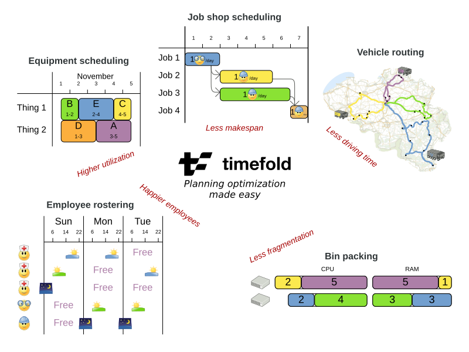

Figure 1. Timefold Solver’s use cases include vehicle routing, employee scheduling, rostering, bin packing, and equipment scheduling.

<a id="pdf-dest-23b520918ca8817d"></a>

<a id="section-0003"></a>
## Chapter 1. Planning problems

A planning problem arises from a need to achieve a goal by organizing available resources under a set of constraints:

- Building a house, where workers and materials are the resources, and construction order and site hours are the constraints.
- Staffing a hospital shift, where qualified personnel are the resources, and working hour rules and required specializations are the constraints.
- Routing delivery vehicles, where vehicles and drivers are the resources, and time windows, capacity, and distance are the constraints.

Planning problems grow combinatorially as resources and constraints are added. Even a small field service problem with 4 vehicles and 8 visits produces over 19 million possible assignments for a brute-force algorithm to consider. Timefold Solver evaluates this space efficiently, finding good solutions in a fraction of the time it would take to do manually.

<a id="pdf-dest-9c66fb9a6446850e"></a>

<a id="section-0004"></a>
## Chapter 2. Constraints

Constraints can be classified as hard, medium, or soft:

- Hard constraints are rules that must not be broken - for example, an employee can only be in one place at a time, or dependent tasks must complete in order. Violating a hard constraint produces an infeasible plan.
- Medium constraints apply when resources are scarce - for instance, assign as many customer visits as possible when there aren’t enough technicians to cover all of them.
- Soft constraints express business preferences - minimize travel time, assign employees to preferred shifts, and similar goals.

Solutions are scored to reflect how well they satisfy these constraints. For example: 0hard/-257medium/-6119520soft. A solution with zero hard constraint violations is always considered better than one that breaks even a single hard constraint, regardless of the soft score.

<a id="pdf-dest-bc4a53ec33354f8f"></a>

<a id="section-0005"></a>
## Chapter 3. Technology

Timefold Solver is 100% pure JavaTM and runs on Java 21 or higher, on any JVM platform. It integrates natively with [Quarkus](#pdf-dest-601e0ae9a75a4274) and Spring Boot, and supports Kotlin.

You can use it to build an [optimization service](#pdf-dest-5067ba1ac11cd371), or embed it into your software as a library. ([source](#pdf-dest-d344bee75d47b543))

<a id="pdf-dest-6f531cbeb77bde49"></a>

<a id="section-0006"></a>
## Next

- Follow the [Quickstart](#pdf-dest-601e0ae9a75a4274) to tackle your first planning problem.

<a id="pdf-dest-9e09ce446b9ebe33"></a>

<a id="section-0007"></a>
# Getting started

<a id="pdf-dest-5ec4bc3b05bcdcfc"></a>

<a id="section-0008"></a>
## Chapter 4. Getting started

This documentation covers our Open Source solver to build a model from scratch. We also provide off-the-shelf models to solve common planning problems. [These](https://docs.timefold.ai/) [can be found here.](https://docs.timefold.ai/)

Timefold Solver can be used in two ways. Pick the approach that best fits your architecture:

| Run as a service<br>Deploy a fully isolated optimization service. This<br>opinionated approach reduces the amount of<br>boilerplate code needed to get to a running<br>application. | Embed as a library<br>Add the solver as a dependency and wire it into<br>your application however you like. Use Spring<br>Boot, Quarkus… or no framework at all. |
| --- | --- |

Table 1. Comparison

|  | Run as a service | Embed as a library |
| --- | --- | --- |
| Best for | Running optimization as a standalone,<br>isolated service that is easier to<br>integrate, orchestrate & scale | Embedding the solver into an existing<br>application |
| Ease of use | Minimal setup: the framework handles<br>REST endpoints and lifecycle for you | Requires manual wiring: you manage<br>configuration, lifecycle, and integration |
| Integration | Opinionated, ready-to-run service built<br>on Quarkus | You control how the solver is wired into<br>your application. Integrations for Spring<br>Boot and Quarkus available. |
| Flexibility | Constrained by design, the service only<br>runs optimization | Use any framework or no framework at<br>all |
| Status | Stable | Stable |

<a id="pdf-dest-5067ba1ac11cd371"></a>

<a id="section-0009"></a>
### 4.1. Run as a service

This is the approach we recommend for integrating Timefold Solver into a larger system, and it is the approach we use ourselves when building optimization models at Timefold.

The service has a single responsibility: running optimization. It receives a dataset, solves it, and returns the result over a well-defined REST API. That is all it does.

Why no database? Deliberately. The service does not store datasets, manage user state, or own any persistence layer. Your application already has a database; the service does not need one. This makes the service stateless, trivially scalable, and completely free of operational concerns like schema migrations or data ownership. When optimization is one step in a larger workflow, a stateless service with a clean API slots into any architecture without friction.

Why opinionated? An opinionated framework means less boilerplate, fewer ways to get it wrong, and a consistent shape that we all can reason about together. The library approach gives you full control; this approach gives you a proven path.

To get started, see [Getting started: building a service](#pdf-dest-601e0ae9a75a4274).

<a id="pdf-dest-d344bee75d47b543"></a>

<a id="section-0010"></a>
### 4.2. Embed as a library

The library approach gives you the solver core as a dependency. You integrate it into your application however you see fit. There are no constraints on your application framework or architecture.

The following getting started guides demonstrate the library approach:

- [Hello World](#pdf-dest-5baf08976087fced)
  - The minimal starting point. Build a plain Java or Kotlin application with no additional framework.
- [Quarkus](#pdf-dest-bb88aab21269eb7a)
  - Build a REST application with Java or Kotlin on top of [Quarkus](https://quarkus.io), a popular Java platform that supports native compilation.
- [Spring Boot](#pdf-dest-05d7f26a7f15d752)
  - Build a REST application with Java or Kotlin on top of [Spring Boot](https://spring.io), a popular Java platform that supports native compilation.

All three guides optimize a school timetable for students and teachers:

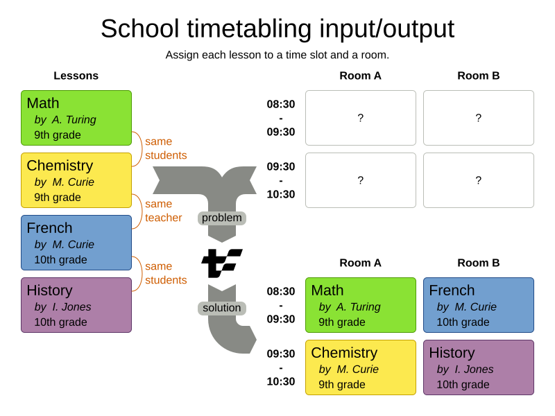

The [timefold-quickstarts](https://github.com/TimefoldAI/timefold-quickstarts) repository contains the source code for all these guides.

For additional use cases using [the](https://github.com/TimefoldAI/timefold-quickstarts) library approach, take a look at the timefold-quickstarts GitHub [repository](https://github.com/TimefoldAI/timefold-quickstarts).

<a id="pdf-dest-e819048484386433"></a>

<a id="section-0011"></a>
## Chapter 5. Getting started: building a service (Preview)

This guide walks you through the process of creating an AI Optimization service.

With this approach, you define your planning model: the domain objects, constraints, and planning solution. Timefold Solver takes care of the rest. There is no need to wire up a solver manually, manage thread pools, or implement REST endpoints by hand. The service exposes a ready-to-use REST API automatically and supports our recommended optimization architecture.

This is a preview feature subject to change.

<a id="pdf-dest-4d39ffd7190aa9c1"></a>

<a id="section-0012"></a>
### What you will build

You will build an optimization service that runs locally on your machine, and optimizes a school timetable for students and teachers.

Your application will assign Lesson instances to Timeslot and Room instances automatically by using AI to adhere to hard and soft scheduling constraints, for example:

- A room can have at most one lesson at the same time.
- A teacher can teach at most one lesson at the same time.
- A student can attend at most one lesson at the same time.
- A teacher prefers to teach all lessons in the same room.
- A teacher prefers to teach sequential lessons and dislikes gaps between lessons.
- A student dislikes sequential lessons on the same subject.

Mathematically speaking, school timetabling is an NP-hard problem. This means it is difficult to scale. Simply brute force iterating through all possible combinations takes millions of years for a non-trivial dataset, even on a supercomputer.

Fortunately, AI constraint solvers such as Timefold Solver have advanced algorithms that deliver a near-optimal solution in a reasonable amount of time.

<a id="pdf-dest-5b794514c5e2f87d"></a>

<a id="section-0013"></a>
### Solution source code

Follow the instructions in the next sections to create the application step by step (recommended).

In case you get stuck during this Getting Started guide, it might be worth checking the solution project [on GitHub](https://github.com/TimefoldAI/timefold-quickstarts/tree/stable/getting-started/service).

<a id="pdf-dest-584636d9f44a4811"></a>

<a id="section-0014"></a>
### Prerequisites

To complete this guide, you need:

- Tools
  - JDK 21 or higher
  - Maven
  - An IDE of your choice (IntelliJ IDEA, VSCode, …)
- Knowledge
  - Java (Basic)
  - Quarkus (Basic)

<a id="pdf-dest-8f3a2e6ce9a80abd"></a>

<a id="section-0015"></a>
### 5.1. The build file and the dependencies

Create a Maven file and use the following parent POM:

Maven Your pom.xml file has the following content:

```
<project xmlns="http://maven.apache.org/POM/4.0.0" xmlns:xsi=
"http://www.w3.org/2001/XMLSchema-instance"
        xsi:schemaLocation="http://maven.apache.org/POM/4.0.0
https://maven.apache.org/xsd/maven-4.0.0.xsd">
    <parent>
    <groupId>ai.timefold.solver</groupId>
    <artifactId>timefold-solver-service-parent</artifactId>
    <version>2.7.0</version>
    </parent>

    <modelVersion>4.0.0</modelVersion>
    <groupId>org.acme</groupId>
    <artifactId>schooltimetabling</artifactId>
    <version>${revision}</version>
    <name>School Timetabling</name>
    <description>Solution for the Timefold Service getting started
example</description>

    <properties>
    <revision>1.0.0-SNAPSHOT</revision>
    </properties>

</project>
```

<a id="pdf-dest-e75e67266cb679b3"></a>

<a id="section-0016"></a>
### 5.2. Model the domain objects

Your goal is to assign each lesson to a time slot and a room. You will create these classes:

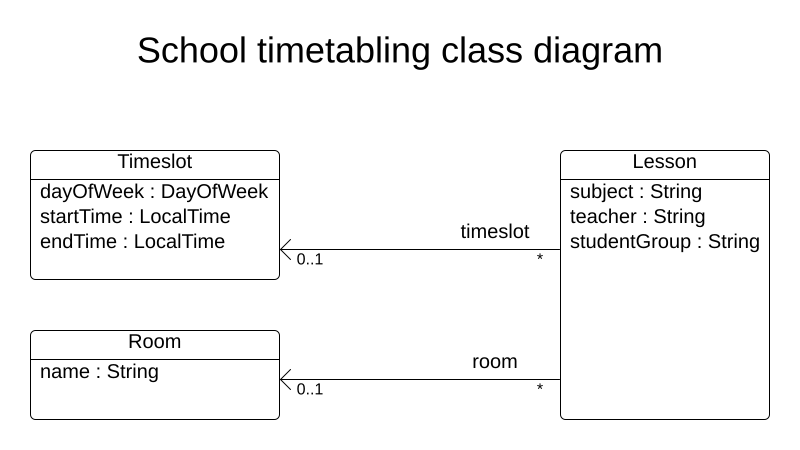

<a id="pdf-dest-9c7324e2b6c475b4"></a>

<a id="section-0017"></a>
#### 5.2.1. Timeslot

The Timeslot class represents a time interval when lessons are taught, for example, Monday 10:30 -11:30 or Tuesday 13:30 - 14:30. For simplicity’s sake, all time slots have the same duration and there are no time slots during lunch or other breaks.

A time slot has no date, because in this example, the high school schedule just repeats every week.

Java Create the src/main/java/org/acme/schooltimetabling/domain/Timeslot.java class:

```
package org.acme.schooltimetabling.domain;

import java.time.DayOfWeek;
import java.time.LocalTime;

public class Timeslot {

    private DayOfWeek dayOfWeek;
    private LocalTime startTime;
    private LocalTime endTime;

    public Timeslot() {
    }

    public Timeslot(DayOfWeek dayOfWeek, LocalTime startTime, LocalTime
endTime) {
        this.dayOfWeek = dayOfWeek;
        this.startTime = startTime;
        this.endTime = endTime;
    }

    public DayOfWeek getDayOfWeek() {
        return dayOfWeek;
    }

    public LocalTime getStartTime() {
        return startTime;
    }

    public LocalTime getEndTime() {
        return endTime;
    }

    @Override
    public String toString() {
        return dayOfWeek + " " + startTime;
    }

}
```

Because no Timeslot instances change during solving, a Timeslot is called a problem fact. Such classes do not require any Timefold Solver specific annotations.

Notice the toString() method keeps the output short, so it is easier to read Timefold Solver’s DEBUG or TRACE log, as shown later.

<a id="pdf-dest-13a845f36d7246b8"></a>

<a id="section-0018"></a>
#### 5.2.2. Room

The Room class represents a location where lessons are taught, for example, Room A or Room B. For simplicity’s sake, all rooms are without capacity limits and they can accommodate all lessons.

Java Create the src/main/java/org/acme/schooltimetabling/domain/Room.java class:

```
package org.acme.schooltimetabling.domain;

public record Room(String name) { }
```

Room instances do not change during solving, so Room is also a problem fact.

<a id="pdf-dest-ae7c497dd0895b39"></a>

<a id="section-0019"></a>
#### 5.2.3. Lesson

During a lesson, represented by the Lesson class, a teacher teaches a subject to a group of students, for example, Math by A.Turing for 9th grade or Chemistry by M.Curie for 10th grade. If a subject is taught multiple times per week by the same teacher to the same student group, there are multiple Lesson instances that are only distinguishable by id. For example, the 9th grade has six math lessons a week.

During solving, Timefold Solver changes the timeslot and room fields of the Lesson class, to assign each lesson to a time slot and a room. Because Timefold Solver changes these fields, Lesson is a planning entity:

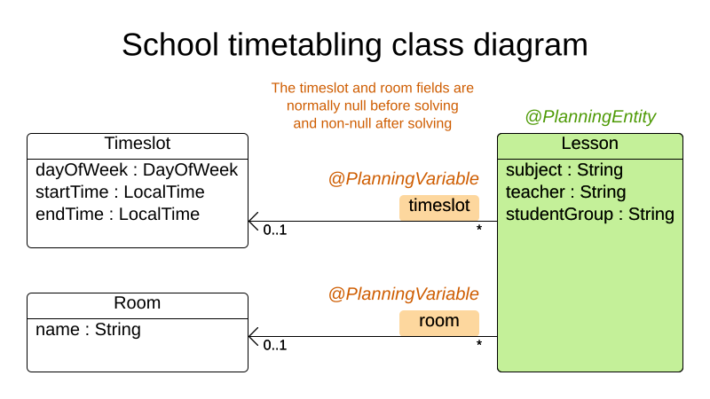

Most of the fields in the previous diagram contain input data, except for the orange fields: A lesson’s timeslot and room fields are unassigned (null) in the input data and assigned (not null) in the output data. Timefold Solver changes these fields during solving. Such fields are called planning variables. In order for Timefold Solver to recognize them, both the timeslot and room fields require an @PlanningVariable annotation. Their containing class, Lesson, requires an @PlanningEntity annotation.

Java Create the src/main/java/org/acme/schooltimetabling/domain/Lesson.java class:

```
package org.acme.schooltimetabling.domain;

import ai.timefold.solver.core.api.domain.entity.PlanningEntity;
import ai.timefold.solver.core.api.domain.common.PlanningId;
import ai.timefold.solver.core.api.domain.variable.PlanningVariable;

@PlanningEntity
public class Lesson {

    @PlanningId
    private String id;
    private String subject;
    private String teacher;
    private String studentGroup;

    @PlanningVariable
    private Timeslot timeslot;
    @PlanningVariable
    private Room room;

    public Lesson() {
    }

    public Lesson(String id, String subject, String teacher, String
studentGroup) {
        this.id = id;
        this.subject = subject;
        this.teacher = teacher;
        this.studentGroup = studentGroup;
    }

    // This constructor is only for tests
    Lesson(String id, String subject, String teacher, String studentGroup,
Timeslot timeslot, Room room) {
        this(id, subject, teacher, studentGroup);
        this.timeslot = timeslot;
        this.room = room;
    }

    public String getId() {
        return id;
    }

    public String getSubject() {
        return subject;
    }

    public String getTeacher() {
        return teacher;
    }

    public String getStudentGroup() {
        return studentGroup;
    }

    public Timeslot getTimeslot() {
        return timeslot;
    }

    public void setTimeslot(Timeslot timeslot) {
        this.timeslot = timeslot;
    }

    public Room getRoom() {
        return room;
    }

    public void setRoom(Room room) {
        this.room = room;
    }

    @Override
    public String toString() {
        return subject + "(" + id + ")";
    }

}
```

The Lesson class has an @PlanningEntity annotation, so Timefold Solver knows that this class changes during solving because it contains one or more planning variables.

The timeslot field has an @PlanningVariable annotation, so Timefold Solver knows that it can change its value. In order to find potential Timeslot instances to assign to this field, Timefold Solver uses the variable type to connect to a [value range provider](#pdf-dest-5f40b7b5c099b69d) that provides a List<Timeslot> to pick from.

The room field also has an @PlanningVariable annotation, for the same reasons.

Determining the @PlanningVariable fields for an arbitrary constraint solving use case is often challenging the first time. Read [the domain modeling guidelines](#pdf-dest-7fe374d78081ce90) to avoid common pitfalls.

<a id="pdf-dest-b801ed95ee1f6f04"></a>

<a id="section-0020"></a>
### 5.3. Define the constraints and calculate the score

A score represents the quality of a specific solution. The higher the better. Timefold Solver looks for the best solution, which is the solution with the highest score found in the available time. It might be the optimal solution.

Because this use case has hard and soft constraints, use the HardMediumSoftScore class to represent the score:

- Hard constraints must not be broken. For example: A room can have at most one lesson at the same time.
- Soft constraints should not be broken. For example: A teacher prefers to teach in a single room.

Hard constraints are weighted against other hard constraints. Soft constraints are weighted too, against other soft constraints. Hard constraints always outweigh soft constraints, regardless of their respective weights. To calculate the score, implement a TimetableConstraintProvider class. It uses Timefold Solver’s [Constraint Streams API](#pdf-dest-601e0ae9a75a4274) which is inspired by Java Streams and SQL:

Java Create a src/main/java/org/acme/schooltimetabling/solver/TimetableConstraintProvider.java class:

```
package org.acme.schooltimetabling.solver;

import org.acme.schooltimetabling.domain.Lesson;
import ai.timefold.solver.core.api.score.HardMediumSoftScore;
import ai.timefold.solver.core.api.score.stream.Constraint;
import ai.timefold.solver.core.api.score.stream.ConstraintFactory;
import ai.timefold.solver.core.api.score.stream.ConstraintProvider;
import ai.timefold.solver.core.api.score.stream.Joiners;

public class TimetableConstraintProvider implements ConstraintProvider {

    @Override
    public Constraint[] defineConstraints(ConstraintFactory constraintFactory)
{
        return new Constraint[] {
                // Hard constraints
                roomConflict(constraintFactory),
                teacherConflict(constraintFactory),
                studentGroupConflict(constraintFactory),
                // Soft constraints are only implemented in the timefold-quickstarts code
        };
    }

    Constraint roomConflict(ConstraintFactory constraintFactory) {
        // A room can accommodate at most one lesson at the same time.
        return constraintFactory
                // Select each pair of 2 different lessons ...
                .forEachUniquePair(Lesson.class,
                        // ... in the same timeslot ...
                        Joiners.equal(Lesson::getTimeslot),
                        // ... in the same room ...
                        Joiners.equal(Lesson::getRoom))
                // ... and penalize each pair with a hard weight.
                .penalize(HardMediumSoftScore.ONE_HARD)
                .asConstraint("Room conflict");
    }

    Constraint teacherConflict(ConstraintFactory constraintFactory) {
        // A teacher can teach at most one lesson at the same time.
        return constraintFactory
                .forEachUniquePair(Lesson.class,
                        Joiners.equal(Lesson::getTimeslot),
                        Joiners.equal(Lesson::getTeacher))
                .penalize(HardMediumSoftScore.ONE_HARD)
                .asConstraint("Teacher conflict");
    }

    Constraint studentGroupConflict(ConstraintFactory constraintFactory) {
        // A student can attend at most one lesson at the same time.
        return constraintFactory
                .forEachUniquePair(Lesson.class,
                        Joiners.equal(Lesson::getTimeslot),
                        Joiners.equal(Lesson::getStudentGroup))
                .penalize(HardMediumSoftScore.ONE_HARD)
                .asConstraint("Student group conflict");
    }

}
```

The ConstraintProvider scales an order of magnitude better than the EasyScoreCalculator: O(n) instead of O(n²).

<a id="pdf-dest-be4da37be4fda3b4"></a>

<a id="section-0021"></a>
### 5.4. Gather the domain objects in a planning solution

A Timetable wraps all Timeslot, Room, and Lesson instances of a single dataset. Furthermore, because it contains all lessons, each with a specific planning variable state, it is known as a planning solution.

Extending AbstractSimpleModel:

- Configures this class to be (de-)serialized as part of the ModelInput and ModelOutput of the [REST](#pdf-dest-601e0ae9a75a4274) [API](#pdf-dest-601e0ae9a75a4274).
- Implements the SolverModel interface using the default HardMediumSoftScore.

It’s ok if you are not familiar with these terms yet. We’ll get to them later.

Java Create the src/main/java/org/acme/schooltimetabling/domain/Timetable.java class:

```
package org.acme.schooltimetabling.domain;

import java.util.List;

import ai.timefold.solver.service.definition.api.AbstractSimpleModel;
import
ai.timefold.solver.core.api.domain.solution.PlanningEntityCollectionProperty;
import ai.timefold.solver.core.api.domain.solution.PlanningScore;
import ai.timefold.solver.core.api.domain.solution.PlanningSolution;
import
ai.timefold.solver.core.api.domain.solution.ProblemFactCollectionProperty;
import ai.timefold.solver.core.api.domain.valuerange.ValueRangeProvider;
import ai.timefold.solver.core.api.score.HardMediumSoftScore;
import ai.timefold.solver.core.api.domain.solution.ConstraintWeightOverrides;

@PlanningSolution
public class Timetable extends AbstractSimpleModel {

    @ValueRangeProvider
    @ProblemFactCollectionProperty
    private List<Timeslot> timeslots;
    @ValueRangeProvider
    @ProblemFactCollectionProperty
    private List<Room> rooms;
    @PlanningEntityCollectionProperty
    private List<Lesson> lessons;
    public Timetable() {
    }

    public Timetable(List<Timeslot> timeslots, List<Room> rooms, List<Lesson>
lessons) {
        this.timeslots = timeslots;
        this.rooms = rooms;
        this.lessons = lessons;
    }

    public List<Timeslot> getTimeslots() {
        return timeslots;
    }

    public List<Room> getRooms() {
        return rooms;
    }

    public List<Lesson> getLessons() {
        return lessons;
    }

    @Override
    public ConstraintWeightOverrides<HardMediumSoftScore>
getConstraintWeightOverrides() {
        return ConstraintWeightOverrides.none();
    }

    public void setConstraintWeightOverrides(ConstraintWeightOverrides
<HardMediumSoftScore> constraintWeightOverrides) {
        // Left empty for now; see constraint weights documentation
    }
}
```

The Timetable class has an @PlanningSolution annotation, so Timefold Solver knows that this class contains all of the input and output data.

Specifically, these classes are the input of the problem:

- The timeslots field with all time slots
  - This is a list of problem facts, because they do not change during solving.
- The rooms field with all rooms
  - This is a list of problem facts, because they do not change during solving.
- The lessons field with all lessons
  - This is a list of planning entities, because they change during solving.
  - Of each Lesson:
  - The values of the timeslot and room fields are typically still null, so unassigned. They are planning variables.
  - The other fields, such as subject, teacher and studentGroup, are filled in. These fields are problem properties.

However, this class is also the output of the solution:

- The lessons field for which each Lesson instance has non-null timeslot and room fields after solving.

The getConstraintWeightOverrides() method is required by the SolverModel interface (implemented by AbstractSimpleModel), and

setConstraintWeightOverrides() is optional. For now

getConstraintWeightOverrides() is left as a stub - none() means no constraint weights can be overridden per request. Configuring this properly is covered in the [constraint weights](#pdf-dest-9924d437d1d55f7f) section and is not part of this guide.

<a id="pdf-dest-faad458f49471aa1"></a>

<a id="section-0022"></a>
#### 5.4.1. The value range providers

The timeslots field is a value range provider. It holds the Timeslot instances which Timefold Solver can pick from to assign to the timeslot field of Lesson instances. The timeslots field has an @ValueRangeProvider annotation to connect the @PlanningVariable with the @ValueRangeProvider, by matching the type of the planning variable with the type returned by the [value range provider](#pdf-dest-5f40b7b5c099b69d).

Following the same logic, the rooms field also has an @ValueRangeProvider annotation.

<a id="pdf-dest-6b33c5db1b48dd0a"></a>

<a id="section-0023"></a>
#### 5.4.2. The problem fact and planning entity properties

Furthermore, Timefold Solver needs to know which Lesson instances it can change as well as how to retrieve the Timeslot and Room instances used for score calculation by your TimetableConstraintProvider. The timeslots and rooms fields have an @ProblemFactCollectionProperty annotation, so your TimetableConstraintProvider can select from those instances.

The lessons has an @PlanningEntityCollectionProperty annotation, so Timefold Solver can change them during solving and your TimetableConstraintProvider can select from those too.

<a id="pdf-dest-0609dbd7ede07007"></a>

<a id="section-0024"></a>
### 5.5. Add the Solver Configuration

Without a termination setting, the solver runs forever. You also need to provide some basic metadata about your application.

Create the src/main/resources/application.properties file:

```
# The solver runs for 30 seconds by default.
# Increase this for larger datasets to find a better solution.
timefold.model.termination.spent-limit=PT30S

# Application metadata - included in the generated OpenAPI specification
timefold.model.name=my-model
timefold.model.contact.email=info@example.com
timefold.model.contact.name=Your Name
timefold.model.contact.url=https://example.com
```

timefold.model.termination.spent-limit sets the default maximum time the solver will run. The value uses the [ISO 8601 duration format](https://en.wikipedia.org/wiki/ISO_8601#Durations): PT30S means 30 seconds. For production use, consider at least five minutes (PT5M) to allow the solver more time to find a better solution.

The per-request config.run.termination.spentLimit field in the POST body (shown

later) overrides this default for individual runs.

timefold.model.name and the contact fields are required metadata. They are used to identify your service, validate the JSON schema of requests, and populate the generated OpenAPI specification.

<a id="pdf-dest-ac054f5b864169f1"></a>

<a id="section-0025"></a>
### 5.6. REST API

The standard way to interact with the optimization service is through a REST API.

Using the service module, most of the REST Endpoints will be automatically generated thanks to the use of the ModelInput, ModelOutput and SolverModel interfaces. You didn’t have to implement those interfaces in this guide, because they were already implemented for you in the AbstractSimpleModel.

To configure the REST API, you need to provide an interface which extends the ModelRest interface.

Java Create the src/main/java/org/acme/schooltimetabling/rest/TimetableResource.java class:

```
package org.acme.schooltimetabling.rest;
import jakarta.ws.rs.Path;
import ai.timefold.solver.service.rest.api.ModelRest;

@Path("/timetables")
public interface TimetableResource extends ModelRest {
}
```

This is the most basic version of the interface. The SDK will automatically create multiple [REST API](#pdf-dest-601e0ae9a75a4274) [endpoints](#pdf-dest-601e0ae9a75a4274) for optimization actions. The @Path annotation is used to configure the base path of all those endpoints.

Do not include an API version in @Path. The SDK default configuration sets

quarkus.rest.path=${timefold.model.version}, which Quarkus automatically

prepends to every @Path at runtime. So with timefold.model.version=v1, @Path("/timetables") is served at /v1/timetables - locally and on the platform.

<a id="pdf-dest-e2ae6b2860e4d88a"></a>

<a id="section-0026"></a>
### 5.7. Running and manually testing the model

Everything is now configured to run the model.

Start the model in development mode by executing:

```
mvn quarkus:dev
```

The solver runs considerably slower in dev mode since the [JVM C2 compiler](https://www.baeldung.com/jvm-tiered-compilation#2c2---server-complier) is

disabled to decrease live reload times. Do not use dev mode to benchmark the

solver or assess solution quality. See [FAQ: Why is Timefold Solver so much slower](#pdf-dest-f05443fccb75dfef) [in Quarkus Dev mode?](#pdf-dest-f05443fccb75dfef) for details.

You should see the following line in the log on successful start

```
getting-started-school-timetabling <version> on JVM (powered by Quarkus {quarkus-
version}) started in 1.552s. Listening on: http://localhost:8080
```

Open the [Swagger OpenAPI Viewer](http://localhost:8080/q/swagger-ui/) to inspect the generated API Endpoints: http://localhost:8080/q/ [swagger-ui/](http://localhost:8080/q/swagger-ui/)

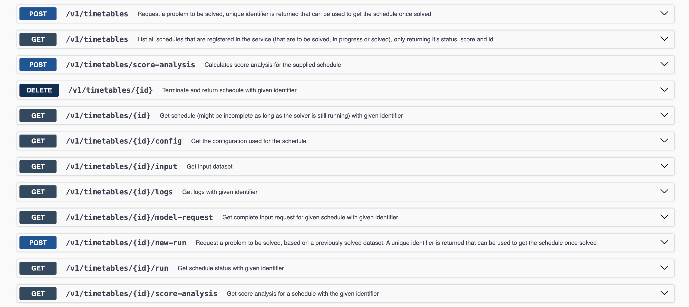

As shown in the image above, just by extending the ModelRest interface, quite a few endpoints were automatically generated. We discuss these in more depth in the [REST API](#pdf-dest-601e0ae9a75a4274) section.

To showcase that the model is now ready for use we only need 2 of those endpoints:

- POST /v1/timetables: To request a problem to be solved. This returns a unique identifier which can be used to request the resulting schedule.
- GET /v1/timetables/{id}: Get the calculated schedule with the given identifier.

<a id="pdf-dest-dab79b759bb5c0ea"></a>

<a id="section-0027"></a>
#### 5.7.1. Sending the problem

```
curl -v -X 'POST' \
    'http://localhost:8080/v1/timetables' \
    -H 'accept: application/json' \
    -H 'Content-Type: application/json' \
    -d '{
    "config": {
    "run": {
        "termination": {
        "spentLimit": "PT10S"
        }
    }
    },
    "modelInput": {
    "timeslots": [
        {
        "dayOfWeek": "MONDAY",
        "startTime": "13:45:30",
        "endTime": "14:45:30"
        }
    ],
    "rooms": [
        {
        "name": "Room1"
        }
    ],
    "lessons": [
        {
        "id": "Lesson1",
        "subject": "English",
        "teacher": "Ann Deans",
        "studentGroup": "1st Grade"
        }
    ]
    }
}'
```

This call should return a response containing the ID of the started run.

```
{
    "id" : "f401a609-403b-48c4-9487-0baf287e4f72",
    "name" : "Dataset-2025-06-10T13:03:50.824454+02:00",
    "submitDateTime" : "2025-06-10T13:03:50.824454+02:00",
    "solverStatus" : "NOT_SOLVING"
}
```

<a id="pdf-dest-729186e9011612bb"></a>

<a id="section-0028"></a>
#### 5.7.2. Getting the solution

Using the ID received in the previous run, the current status of the run can be retrieved.

```
curl -X 'GET' \
    'http://localhost:8080/v1/timetables/{id}' \
    -H 'accept: application/json'
```

This call will return the standard [response structure](#pdf-dest-dc3804776f7a9caa).

```
{
    "metadata": {
    "id": "f401a609-403b-48c4-9487-0baf287e4f72",
    "name": "Dataset-2025-06-10T13:03:50.824454+02:00",
    "submitDateTime": "2025-06-10T13:03:50.824454+02:00",
    "startDateTime": "2025-06-10T13:03:50.832544+02:00",
    "activeDateTime": "2025-06-10T13:03:50.833934+02:00",
    "completeDateTime": "2025-06-10T13:03:50.843229+02:00",
    "shutdownDateTime": "2025-06-10T13:03:50.844522+02:00",
    "solverStatus": "SOLVING_COMPLETED",
    "score": "0hard/0medium/0soft",
    "validationResult": {
        "summary": "VALIDATION_NOT_SUPPORTED"
    }
    },
    "modelOutput": {
    "timeslots": [
        {
        "dayOfWeek": "MONDAY",
        "startTime": "13:45:30.123456789",
        "endTime": "14:45:30.123456789"
        }
    ],
    "rooms": [
        {
        "name": "Room1"
        }
    ],
    "lessons": [
        {
        "id": "Lesson1",
        "subject": "English",
        "teacher": "Ann Deans",
        "studentGroup": "1st Grade",
        "timeslot": {
            "dayOfWeek": "MONDAY",
            "startTime": "13:45:30.123456789",
            "endTime": "14:45:30.123456789"
        },
        "room": {
            "name": "Room1"
        }
        }
    ]
    }
}
```

Important elements to observe in the JSON above:

- The Lesson object now has an assigned Room and Timeslot.
- The solverStatus is SOLVING_COMPLETED, indicating the solver has finished optimizing.
- The score is 0hard/0medium/0soft, signaling that no constraints were broken.

<a id="pdf-dest-f0cb8f6f29583f78"></a>

<a id="section-0029"></a>
### 5.8. Generating the initial OpenAPI specification

Before running a full build with mvn install, you need to generate the initial OpenAPI specification file. The build compares the generated spec against src/build/openapi.json to catch accidental API changes, so the build will fail if that file does not exist yet.

Run the following command once to create it:

```
mvn clean package -Dupdate-api
```

We recommend committing src/build/openapi.json to version control. See [Deliberate API changes](#pdf-dest-98270771f179a265) for more details on how this mechanism works.

<a id="pdf-dest-5a33e823c10a0c31"></a>

<a id="section-0030"></a>
### Next

Since this is a "Getting Started" guide, not everything is covered yet.

- Learn about improvements you can make to your model:
  - How to enrich your model with [model enrichment](running-timefold-solver/service/modeling-changes.pdf).
  - How to configure your [REST API](#pdf-dest-601e0ae9a75a4274) with validations, custom endpoints, etc.
  - How to [deploy this model to Timefold Platform](#pdf-dest-601e0ae9a75a4274).
  - How to [use input and output metrics](#pdf-dest-601e0ae9a75a4274) to make platform features like solve graphs, comparison, and Insights more useful.

<a id="pdf-dest-5baf08976087fced"></a>

<a id="section-0031"></a>
## Chapter 6. Hello World Quick Start Guide

This guide walks you through the process of creating a simple Java or Kotlin application with [Timefold](https://timefold.ai)'s constraint solving Artificial Intelligence (AI).

<a id="pdf-dest-494d399b0aaa0ffe"></a>

<a id="section-0032"></a>
### 6.1. What you will build

You will build a command-line application that optimizes a school timetable for students and teachers:

```
...
INFO Solving ended: time spent (5000), best score (0hard/9soft), ...
INFO
INFO | | Room A | Room B | Room C |
INFO |------------|------------|------------|------------|
INFO | MON 08:30 | English | Math | |
INFO | | I. Jones | A. Turing | |
INFO | | 9th grade | 10th grade | |
INFO |------------|------------|------------|------------|
INFO | MON 09:30 | History | Physics | |
INFO | | I. Jones | M. Curie | |
INFO | | 9th grade | 10th grade | |
INFO |------------|------------|------------|------------|
INFO | MON 10:30 | History | Physics | |
INFO | | I. Jones | M. Curie | |
INFO | | 10th grade | 9th grade | |
INFO |------------|------------|------------|------------|
...
INFO |------------|------------|------------|------------|
```

Your application will assign Lesson instances to Timeslot and Room instances automatically by using AI to adhere to hard and soft scheduling constraints, for example:

- A room can have at most one lesson at the same time.
- A teacher can teach at most one lesson at the same time.
- A student can attend at most one lesson at the same time.
- A teacher prefers to teach all lessons in the same room.
- A teacher prefers to teach sequential lessons and dislikes gaps between lessons.
- A student dislikes sequential lessons on the same subject.

Mathematically speaking, school timetabling is an NP-hard problem. This means it is difficult to scale. Simply brute force iterating through all possible combinations takes millions of years for a non-trivial dataset, even on a supercomputer. Fortunately, AI constraint solvers such as Timefold Solver have advanced algorithms that deliver a near-optimal solution in a reasonable amount of time.

<a id="pdf-dest-25ea4ceaeea982af"></a>

<a id="section-0033"></a>
### 6.2. Solution source code

Follow the instructions in the next sections to create the application step by step (recommended).

Alternatively, review the completed example:

1. Complete one of the following tasks:

a. Clone the Git repository:

```
$ git clone https://github.com/TimefoldAI/timefold-quickstarts
```

b. Download an [archive](https://github.com/TimefoldAI/timefold-quickstarts/archive/refs/heads/stable.tar.gz).

2. Find the solution in

Java [the](https://github.com/TimefoldAI/timefold-quickstarts/tree/stable/getting-started/hello-world) java directory.

3. Follow the instructions in the README file to run the application.

<a id="pdf-dest-4b773f4ff46507e0"></a>

<a id="section-0034"></a>
### 6.3. Prerequisites

To complete this guide, you need:

Java

- [JDK](https://adoptopenjdk.net/) 21+ with JAVA_HOME configured appropriately. For example with Sdkman: ([source](https://sdkman.io))
```
    $ curl -s "https://get.sdkman.io" | bash
    $ sdk install java
```

- [Apache Maven](https://maven.apache.org/download.html) 3.9.11+ or Gradle 7+ ([source](https://gradle.org/install/))
- An IDE, such as [IntelliJ IDEA](https://www.jetbrains.com/idea), VSCode or Eclipse

<a id="pdf-dest-53df388d9db28b11"></a>

<a id="section-0035"></a>
### 6.4. The build file and the dependencies

Create a Maven or Gradle build file and add these dependencies:

- timefold-solver-core (compile scope) to solve the school timetable problem.
- A [logging](#pdf-dest-0a149844a7c9f4cf) implementation, such as logback-classic (runtime scope), to see what Timefold Solver is doing.

Maven Your pom.xml file has the following content:

```
<?xml version="1.0" encoding="UTF-8"?>
<project xmlns="http://maven.apache.org/POM/4.0.0" xmlns:xsi=
"http://www.w3.org/2001/XMLSchema-instance"
        xsi:schemaLocation="http://maven.apache.org/POM/4.0.0
https://maven.apache.org/xsd/maven-4.0.0.xsd">
    <modelVersion>4.0.0</modelVersion>

    <groupId>org.acme</groupId>
    <artifactId>hello-world-school-timetabling</artifactId>
    <version>1.0-SNAPSHOT</version>

    <properties>
    <maven.compiler.release>21</maven.compiler.release>
    <project.build.sourceEncoding>UTF-8</project.build.sourceEncoding>
    </properties>

    <dependencyManagement>
    <dependencies>
        <dependency>
        <groupId>ai.timefold.solver</groupId>
        <artifactId>timefold-solver-bom</artifactId>
        <version>2.7.0</version>
        <type>pom</type>
        <scope>import</scope>
        </dependency>
        <dependency>
        <groupId>ch.qos.logback</groupId>
        <artifactId>logback-classic</artifactId>
        <version>1.6.4</version>
        </dependency>
    </dependencies>
    </dependencyManagement>

    <dependencies>
    <dependency>
        <groupId>ai.timefold.solver</groupId>
        <artifactId>timefold-solver-core</artifactId>
    </dependency>
    <dependency>
        <groupId>ch.qos.logback</groupId>
        <artifactId>logback-classic</artifactId>
        <scope>runtime</scope>
    </dependency>
    </dependencies>

    <build>
    <plugins>
        <plugin>
        <groupId>org.codehaus.mojo</groupId>
        <artifactId>exec-maven-plugin</artifactId>
        <version>3.6.4</version>
        <configuration>
            <mainClass>org.acme.schooltimetabling.TimetableApp</mainClass>
        </configuration>
        </plugin>
    </plugins>
    </build>
</project>
```

Gradle Your build.gradle file has this content:

```
plugins {
    id "java"
    id "application"
}

def timefoldSolverVersion = "2.7.0"
def logbackVersion = "1.6.4"

group = "org.acme"
version = "1.0-SNAPSHOT"

repositories {
    mavenCentral()
}

dependencies {
    implementation platform("ai.timefold.solver:timefold-solver-bom:
${timefoldSolverVersion}")
    implementation "ai.timefold.solver:timefold-solver-core"

    runtimeOnly "ch.qos.logback:logback-classic:${logbackVersion}"
}

java {
    sourceCompatibility = JavaVersion.VERSION_21
    targetCompatibility = JavaVersion.VERSION_21
}

compileJava {
    options.encoding = "UTF-8"
    options.compilerArgs << "-parameters"
}

compileTestJava {
    options.encoding = "UTF-8"
}

application {
    mainClass = "org.acme.schooltimetabling.TimetableApp"
}

test {
    // Log the test execution results.
    testLogging {
        events "passed", "skipped", "failed"
    }
}
```

<a id="pdf-dest-4348f9ccfb478d17"></a>

<a id="section-0036"></a>
### 6.5. Model the domain objects

Your goal is to assign each lesson to a time slot and a room. You will create these classes:


<a id="pdf-dest-e914d40a768bfcb6"></a>

<a id="section-0037"></a>
#### 6.5.1. Timeslot

The Timeslot class represents a time interval when lessons are taught, for example, Monday 10:30 -11:30 or Tuesday 13:30 - 14:30. For simplicity’s sake, all time slots have the same duration and there are no time slots during lunch or other breaks.

A time slot has no date, because in this example, the high school schedule just repeats every week.

Java Create the src/main/java/org/acme/schooltimetabling/domain/Timeslot.java class:

```
package org.acme.schooltimetabling.domain;

import java.time.DayOfWeek;
import java.time.LocalTime;

public class Timeslot {

    private DayOfWeek dayOfWeek;
    private LocalTime startTime;
    private LocalTime endTime;

    public Timeslot() {
    }

    public Timeslot(DayOfWeek dayOfWeek, LocalTime startTime, LocalTime
endTime) {
        this.dayOfWeek = dayOfWeek;
        this.startTime = startTime;
        this.endTime = endTime;
    }

    public DayOfWeek getDayOfWeek() {
        return dayOfWeek;
    }

    public LocalTime getStartTime() {
        return startTime;
    }

    public LocalTime getEndTime() {
        return endTime;
    }

    @Override
    public String toString() {
        return dayOfWeek + " " + startTime;
    }

}
```

Because no Timeslot instances change during solving, a Timeslot is called a problem fact. Such classes do not require any Timefold Solver specific annotations.

Notice the toString() method keeps the output short, so it is easier to read Timefold Solver’s DEBUG or TRACE log, as shown later.

<a id="pdf-dest-5e3bfd2620b4c5da"></a>

<a id="section-0038"></a>
#### 6.5.2. Room

The Room class represents a location where lessons are taught, for example, Room A or Room B. For simplicity’s sake, all rooms are without capacity limits and they can accommodate all lessons.

Java Create the src/main/java/org/acme/schooltimetabling/domain/Room.java class:

```
package org.acme.schooltimetabling.domain;

public record Room(String name) { }
```

Room instances do not change during solving, so Room is also a problem fact.

<a id="pdf-dest-a768339e9b3c5838"></a>

<a id="section-0039"></a>
#### 6.5.3. Lesson

During a lesson, represented by the Lesson class, a teacher teaches a subject to a group of students, for example, Math by A.Turing for 9th grade or Chemistry by M.Curie for 10th grade. If a subject is taught multiple times per week by the same teacher to the same student group, there are multiple Lesson instances that are only distinguishable by id. For example, the 9th grade has six math lessons a week.

During solving, Timefold Solver changes the timeslot and room fields of the Lesson class, to assign each lesson to a time slot and a room. Because Timefold Solver changes these fields, Lesson is a planning entity:


Most of the fields in the previous diagram contain input data, except for the orange fields: A lesson’s timeslot and room fields are unassigned (null) in the input data and assigned (not null) in the output data. Timefold Solver changes these fields during solving. Such fields are called planning variables. In order for Timefold Solver to recognize them, both the timeslot and room fields require an @PlanningVariable annotation. Their containing class, Lesson, requires an @PlanningEntity annotation.

Java Create the src/main/java/org/acme/schooltimetabling/domain/Lesson.java class:

```
package org.acme.schooltimetabling.domain;

import ai.timefold.solver.core.api.domain.entity.PlanningEntity;
import ai.timefold.solver.core.api.domain.common.PlanningId;
import ai.timefold.solver.core.api.domain.variable.PlanningVariable;

@PlanningEntity
public class Lesson {

    @PlanningId
    private String id;

    private String subject;
    private String teacher;
    private String studentGroup;

    @PlanningVariable
    private Timeslot timeslot;
    @PlanningVariable
    private Room room;

    public Lesson() {
    }

    public Lesson(String id, String subject, String teacher, String
studentGroup) {
        this.id = id;
        this.subject = subject;
        this.teacher = teacher;
        this.studentGroup = studentGroup;
    }

    // This constructor is only for tests
    Lesson(String id, String subject, String teacher, String studentGroup,
Timeslot timeslot, Room room) {
        this(id, subject, teacher, studentGroup);
        this.timeslot = timeslot;
        this.room = room;
    }

    public String getId() {
        return id;
    }

    public String getSubject() {
        return subject;
    }

    public String getTeacher() {
        return teacher;
    }

    public String getStudentGroup() {
        return studentGroup;
    }

    public Timeslot getTimeslot() {
        return timeslot;
    }

    public void setTimeslot(Timeslot timeslot) {
        this.timeslot = timeslot;
    }

    public Room getRoom() {
        return room;
    }

    public void setRoom(Room room) {
        this.room = room;
    }

    @Override
    public String toString() {
        return subject + "(" + id + ")";
    }

}
```

The Lesson class has an @PlanningEntity annotation, so Timefold Solver knows that this class changes during solving because it contains one or more planning variables.

The timeslot field has an @PlanningVariable annotation, so Timefold Solver knows that it can change its value. In order to find potential Timeslot instances to assign to this field, Timefold Solver uses the variable type to connect to a [value range provider](#pdf-dest-5f40b7b5c099b69d) that provides a List<Timeslot> to pick from.

The room field also has an @PlanningVariable annotation, for the same reasons.

Determining the @PlanningVariable fields for an arbitrary constraint solving use case is often challenging the first time. Read [the domain modeling guidelines](#pdf-dest-7fe374d78081ce90) to avoid common pitfalls.

<a id="pdf-dest-9cded89439965a24"></a>

<a id="section-0040"></a>
### 6.6. Define the constraints and calculate the score

A score represents the quality of a specific solution. The higher the better. Timefold Solver looks for the best solution, which is the solution with the highest score found in the available time. It might be the optimal solution.

Because this use case has hard and soft constraints, use the HardMediumSoftScore class to represent the score:

- Hard constraints must not be broken. For example: A room can have at most one lesson at the same time.
- Soft constraints should not be broken. For example: A teacher prefers to teach in a single room.

Hard constraints are weighted against other hard constraints. Soft constraints are weighted too, against other soft constraints. Hard constraints always outweigh soft constraints, regardless of their respective weights.

To calculate the score, implement a TimetableConstraintProvider class. It uses Timefold Solver’s [Constraint Streams API](#pdf-dest-601e0ae9a75a4274) which is inspired by Java Streams and SQL:

Java Create a src/main/java/org/acme/schooltimetabling/solver/TimetableConstraintProvider.java class:

```
package org.acme.schooltimetabling.solver;

import org.acme.schooltimetabling.domain.Lesson;
import ai.timefold.solver.core.api.score.HardMediumSoftScore;
import ai.timefold.solver.core.api.score.stream.Constraint;
import ai.timefold.solver.core.api.score.stream.ConstraintFactory;
import ai.timefold.solver.core.api.score.stream.ConstraintProvider;
import ai.timefold.solver.core.api.score.stream.Joiners;

public class TimetableConstraintProvider implements ConstraintProvider {

    @Override
    public Constraint[] defineConstraints(ConstraintFactory constraintFactory)
{
        return new Constraint[] {
                // Hard constraints
                roomConflict(constraintFactory),
                teacherConflict(constraintFactory),
                studentGroupConflict(constraintFactory),
                // Soft constraints are only implemented in the timefold-quickstarts code
        };
    }

    Constraint roomConflict(ConstraintFactory constraintFactory) {
        // A room can accommodate at most one lesson at the same time.
        return constraintFactory
                // Select each pair of 2 different lessons ...
                .forEachUniquePair(Lesson.class,
                        // ... in the same timeslot ...
                        Joiners.equal(Lesson::getTimeslot),
                        // ... in the same room ...
                        Joiners.equal(Lesson::getRoom))
                // ... and penalize each pair with a hard weight.
                .penalize(HardMediumSoftScore.ONE_HARD)
                .asConstraint("Room conflict");
    }

    Constraint teacherConflict(ConstraintFactory constraintFactory) {
        // A teacher can teach at most one lesson at the same time.
        return constraintFactory
                .forEachUniquePair(Lesson.class,
                        Joiners.equal(Lesson::getTimeslot),
                        Joiners.equal(Lesson::getTeacher))
                .penalize(HardMediumSoftScore.ONE_HARD)
                .asConstraint("Teacher conflict");
    }

    Constraint studentGroupConflict(ConstraintFactory constraintFactory) {
        // A student can attend at most one lesson at the same time.
        return constraintFactory
                .forEachUniquePair(Lesson.class,
                        Joiners.equal(Lesson::getTimeslot),
                        Joiners.equal(Lesson::getStudentGroup))
                .penalize(HardMediumSoftScore.ONE_HARD)
                .asConstraint("Student group conflict");
    }

}
```

The ConstraintProvider scales an order of magnitude better than the EasyScoreCalculator: O(n) instead of O(n²).

<a id="pdf-dest-062c0659ba82be36"></a>

<a id="section-0041"></a>
### 6.7. Gather the domain objects in a planning solution

A Timetable wraps all Timeslot, Room, and Lesson instances of a single dataset. Furthermore, because it contains all lessons, each with a specific planning variable state, it is a planning solution and it has a score:

- If lessons are still unassigned, then it is an uninitialized solution,
- If it breaks hard constraints, then it is an infeasible solution, for example, a solution with the score -2hard/-3soft.
- If it adheres to all hard constraints, then it is a feasible solution, for example, a solution with the score 0hard/-7soft.

Java Create the src/main/java/org/acme/schooltimetabling/domain/Timetable.java class:

```
package org.acme.schooltimetabling.domain;

import java.util.List;

import
ai.timefold.solver.core.api.domain.solution.PlanningEntityCollectionProperty;
import ai.timefold.solver.core.api.domain.solution.PlanningScore;
import ai.timefold.solver.core.api.domain.solution.PlanningSolution;
import
ai.timefold.solver.core.api.domain.solution.ProblemFactCollectionProperty;
import ai.timefold.solver.core.api.domain.valuerange.ValueRangeProvider;
import ai.timefold.solver.core.api.score.HardSoftScore;

@PlanningSolution
public class Timetable {

    @ValueRangeProvider
    @ProblemFactCollectionProperty
    private List<Timeslot> timeslots;
    @ValueRangeProvider
    @ProblemFactCollectionProperty
    private List<Room> rooms;
    @PlanningEntityCollectionProperty
    private List<Lesson> lessons;

    @PlanningScore
    private HardSoftScore score;

    public Timetable() {
    }

    public Timetable(List<Timeslot> timeslots, List<Room> rooms, List<Lesson>
lessons) {
        this.timeslots = timeslots;
        this.rooms = rooms;
        this.lessons = lessons;
    }

    public List<Timeslot> getTimeslots() {
        return timeslots;
    }
    public List<Room> getRooms() {
        return rooms;
    }

    public List<Lesson> getLessons() {
        return lessons;
    }

    public HardSoftScore getScore() {
        return score;
    }

}
```

The Timetable class has an @PlanningSolution annotation, so Timefold Solver knows that this class contains all of the input and output data.

Specifically, these classes are the input of the problem:

- The timeslots field with all time slots
  - This is a list of problem facts, because they do not change during solving.
- The rooms field with all rooms
  - This is a list of problem facts, because they do not change during solving.
- The lessons field with all lessons
  - This is a list of planning entities, because they change during solving.
  - Of each Lesson:
  - The values of the timeslot and room fields are typically still null, so unassigned. They are planning variables.
  - The other fields, such as subject, teacher and studentGroup, are filled in. These fields are problem properties.

However, this class is also the output of the solution:

- The lessons field for which each Lesson instance has non-null timeslot and room fields after solving.
- The score field that represents the quality of the output solution, for example, 0hard/-5soft.

<a id="pdf-dest-17278d801d0b23e6"></a>

<a id="section-0042"></a>
#### 6.7.1. The value range providers

The timeslots field is a value range provider. It holds the Timeslot instances which Timefold Solver can pick from to assign to the timeslot field of Lesson instances. The timeslots field has an @ValueRangeProvider annotation to connect the @PlanningVariable with the @ValueRangeProvider, by matching the type of the planning variable with the type returned by the [value range provider](#pdf-dest-5f40b7b5c099b69d). Following the same logic, the rooms field also has an @ValueRangeProvider annotation.

<a id="pdf-dest-6d5cbcbf68368679"></a>

<a id="section-0043"></a>
#### 6.7.2. The problem fact and planning entity properties

Furthermore, Timefold Solver needs to know which Lesson instances it can change as well as how to retrieve the Timeslot and Room instances used for score calculation by your TimetableConstraintProvider.

The timeslots and rooms fields have an @ProblemFactCollectionProperty annotation, so your TimetableConstraintProvider can select from those instances.

The lessons has an @PlanningEntityCollectionProperty annotation, so Timefold Solver can change them during solving and your TimetableConstraintProvider can select from those too.

<a id="pdf-dest-9cdabd087c73e810"></a>

<a id="section-0044"></a>
### 6.8. Create the application

Now you are ready to put everything together and create a Java application. The main() method performs the following tasks:

1. Creates the SolverFactory to build a Solver per dataset.

2. Loads a dataset.

3. Solves it with Solver.solve().

4. Visualizes the solution for that dataset.

Typically, an application has a single SolverFactory to build a new Solver instance for each problem dataset to solve. A SolverFactory is thread-safe, but a Solver is not. In this case, there is only one dataset, so only one Solver instance.

Java Create the src/main/java/org/acme/schooltimetabling/TimetableApp.java class:

```
package org.acme.schooltimetabling;

import java.time.DayOfWeek;
import java.time.Duration;
import java.time.LocalTime;
import java.util.ArrayList;
import java.util.Collections;
import java.util.List;
import java.util.Map;
import java.util.Objects;
import java.util.stream.Collectors;

import ai.timefold.solver.core.api.solver.Solver;
import ai.timefold.solver.core.api.solver.SolverFactory;
import ai.timefold.solver.core.config.solver.SolverConfig;
import org.acme.schooltimetabling.domain.Lesson;
import org.acme.schooltimetabling.domain.Room;
import org.acme.schooltimetabling.domain.Timeslot;
import org.acme.schooltimetabling.domain.Timetable;
import org.acme.schooltimetabling.solver.TimetableConstraintProvider;
import org.slf4j.Logger;
import org.slf4j.LoggerFactory;

public class TimetableApp {

    private static final Logger LOGGER = LoggerFactory.getLogger(TimetableApp
.class);

    public static void main(String[] args) {
        SolverFactory<Timetable> solverFactory = SolverFactory.create(new
SolverConfig()
                .withSolutionClass(Timetable.class)
                .withEntityClasses(Lesson.class)
                .withConstraintProviderClass(TimetableConstraintProvider.class)
                // The solver runs only for 5 seconds on this small dataset.
                // It's recommended to run for at least 5 minutes ("5m")
otherwise.
                .withTerminationSpentLimit(Duration.ofSeconds(5)));

        // Load the problem
        Timetable problem = generateDemoData();

        // Solve the problem
        Solver<Timetable> solver = solverFactory.buildSolver();
        Timetable solution = solver.solve(problem);

        // Visualize the solution
        printTimetable(solution);
    }

    public static Timetable generateDemoData() {
        List<Timeslot> timeslots = new ArrayList<>(10);
        timeslots.add(new Timeslot(DayOfWeek.MONDAY, LocalTime.of(8, 30),
LocalTime.of(9, 30)));
        timeslots.add(new Timeslot(DayOfWeek.MONDAY, LocalTime.of(9, 30),
LocalTime.of(10, 30)));
        timeslots.add(new Timeslot(DayOfWeek.MONDAY, LocalTime.of(10, 30),
LocalTime.of(11, 30)));
        timeslots.add(new Timeslot(DayOfWeek.MONDAY, LocalTime.of(13, 30),
LocalTime.of(14, 30)));
        timeslots.add(new Timeslot(DayOfWeek.MONDAY, LocalTime.of(14, 30),
LocalTime.of(15, 30)));

        timeslots.add(new Timeslot(DayOfWeek.TUESDAY, LocalTime.of(8, 30),
LocalTime.of(9, 30)));
        timeslots.add(new Timeslot(DayOfWeek.TUESDAY, LocalTime.of(9, 30),
LocalTime.of(10, 30)));
        timeslots.add(new Timeslot(DayOfWeek.TUESDAY, LocalTime.of(10, 30),
LocalTime.of(11, 30)));
        timeslots.add(new Timeslot(DayOfWeek.TUESDAY, LocalTime.of(13, 30),
LocalTime.of(14, 30)));
        timeslots.add(new Timeslot(DayOfWeek.TUESDAY, LocalTime.of(14, 30),
LocalTime.of(15, 30)));

        List<Room> rooms = new ArrayList<>(3);
        rooms.add(new Room("Room A"));
        rooms.add(new Room("Room B"));
        rooms.add(new Room("Room C"));

        List<Lesson> lessons = new ArrayList<>();
        long nextLessonId = 0L;
        lessons.add(new Lesson(Long.toString(nextLessonId++), "Math", "A.
Turing", "9th grade"));
        lessons.add(new Lesson(Long.toString(nextLessonId++), "Math", "A.
Turing", "9th grade"));
        lessons.add(new Lesson(Long.toString(nextLessonId++), "Physics", "M.
Curie", "9th grade"));
        lessons.add(new Lesson(Long.toString(nextLessonId++), "Chemistry", "M.
Curie", "9th grade"));
        lessons.add(new Lesson(Long.toString(nextLessonId++), "Biology", "C.
Darwin", "9th grade"));
        lessons.add(new Lesson(Long.toString(nextLessonId++), "History", "I.
Jones", "9th grade"));
        lessons.add(new Lesson(Long.toString(nextLessonId++), "English", "I.
Jones", "9th grade"));
        lessons.add(new Lesson(Long.toString(nextLessonId++), "English", "I.
Jones", "9th grade"));
        lessons.add(new Lesson(Long.toString(nextLessonId++), "Spanish", "P.
Cruz", "9th grade"));
        lessons.add(new Lesson(Long.toString(nextLessonId++), "Spanish", "P.
Cruz", "9th grade"));

        lessons.add(new Lesson(Long.toString(nextLessonId++), "Math", "A.
Turing", "10th grade"));
        lessons.add(new Lesson(Long.toString(nextLessonId++), "Math", "A.
Turing", "10th grade"));
        lessons.add(new Lesson(Long.toString(nextLessonId++), "Math", "A.
Turing", "10th grade"));
        lessons.add(new Lesson(Long.toString(nextLessonId++), "Physics", "M.
Curie", "10th grade"));
        lessons.add(new Lesson(Long.toString(nextLessonId++), "Chemistry", "M.
Curie", "10th grade"));
        lessons.add(new Lesson(Long.toString(nextLessonId++), "French", "M.
Curie", "10th grade"));
        lessons.add(new Lesson(Long.toString(nextLessonId++), "Geography", "C.
Darwin", "10th grade"));
        lessons.add(new Lesson(Long.toString(nextLessonId++), "History", "I.
Jones", "10th grade"));
        lessons.add(new Lesson(Long.toString(nextLessonId++), "English", "P.
Cruz", "10th grade"));
        lessons.add(new Lesson(Long.toString(nextLessonId), "Spanish", "P.
Cruz", "10th grade"));

        return new Timetable(timeslots, rooms, lessons);
    }

    private static void printTimetable(Timetable timetable) {
                LOGGER.info("");
        List<Room> rooms = timetable.getRooms();
        List<Lesson> lessons = timetable.getLessons();
        Map<Timeslot, Map<Room, List<Lesson>>> lessonMap = lessons.stream()
                .filter(lesson -> lesson.getTimeslot() != null && lesson
.getRoom() != null)
                .collect(Collectors.groupingBy(Lesson::getTimeslot, Collectors
.groupingBy(Lesson::getRoom)));
        LOGGER.info("| | " + rooms.stream()
                .map(room -> String.format("%-10s", room.name())).collect
(Collectors.joining(" | ")) + " |");
        LOGGER.info("|" + "------------|".repeat(rooms.size() + 1));
        for (Timeslot timeslot : timetable.getTimeslots()) {
            List<List<Lesson>> cells = rooms.stream()
                    .map(room -> {
                        Map<Room, List<Lesson>> byRoomMap = lessonMap.get
(timeslot);
                        if (byRoomMap == null) {
                            return Collections.<Lesson>emptyList();
                        }
                        List<Lesson> cellLessons = byRoomMap.get(room);
                        return Objects.requireNonNullElse(cellLessons,
Collections.<Lesson>emptyList());
                    }).toList();

            LOGGER.info("| " + String.format("%-10s",
                    timeslot.getDayOfWeek().toString().substring(0, 3) + " " +
timeslot.getStartTime()) + " | "
                    + cells.stream().map(cellLessons -> String.format("%-10s",
                            cellLessons.stream().map(Lesson::getSubject)
.collect(Collectors.joining(", "))))
                            .collect(Collectors.joining(" | "))
                    + " |");
            LOGGER.info("| | "
                    + cells.stream().map(cellLessons -> String.format("%-10s",
                            cellLessons.stream().map(Lesson::getTeacher)
.collect(Collectors.joining(", "))))
                            .collect(Collectors.joining(" | "))
                    + " |");
            LOGGER.info("| | "
                    + cells.stream().map(cellLessons -> String.format("%-10s",
                            cellLessons.stream().map(Lesson::getStudentGroup)
.collect(Collectors.joining(", "))))
                            .collect(Collectors.joining(" | "))
                    + " |");
            LOGGER.info("|" + "------------|".repeat(rooms.size() + 1));
        }
        List<Lesson> unassignedLessons = lessons.stream()
                .filter(lesson -> lesson.getTimeslot() == null || lesson
.getRoom() == null)
                .toList();
        if (!unassignedLessons.isEmpty()) {
            LOGGER.info("");
            LOGGER.info("Unassigned lessons");
            for (Lesson lesson : unassignedLessons) {
                LOGGER.info(" " + lesson.getSubject() + " - " + lesson
.getTeacher() + " - " + lesson.getStudentGroup());
            }
        }
    }

}
```

The main() method first creates the SolverFactory:

Java

```
SolverFactory<Timetable> solverFactory = SolverFactory.create(
    new SolverConfig()
        .withSolutionClass(Timetable.class)
        .withEntityClasses(Lesson.class)
        .withConstraintProviderClass(TimetableConstraintProvider.class)
        // The solver runs only for 5 seconds on this small dataset.
        // It's recommended to run for at least 5 minutes ("5m") otherwise.
        .withTerminationSpentLimit(Duration.ofSeconds(5)));
```

This registers the @PlanningSolution class, the @PlanningEntity classes, and the ConstraintProvider class, all of which you created earlier.

Without a termination setting or a terminationEarly() event, the solver runs forever. To avoid that, the solver limits the solving time to five seconds.

The main() method loads the problem, solves it, and prints the solution after just over five seconds.

Java

```
// Load the problem
Timetable problem = generateDemoData();
// Solve the problem
Solver<Timetable> solver = solverFactory.buildSolver();
Timetable solution = solver.solve(problem);

// Visualize the solution
printTimetable(solution);
```

The solve() method doesn’t return instantly. It runs for five seconds before returning the best solution.

Timefold Solver returns the best solution found in the available termination time. Due to [the nature](#pdf-dest-ae2450e5d591fc8f) [of NP-hard problems](#pdf-dest-ae2450e5d591fc8f), the best solution might not be optimal, especially for larger datasets. Increase the termination time to potentially find a better solution.

The generateDemoData() method generates the school timetable problem to solve.

The printTimetable() method pretty prints the timetable to the console, allowing to determine visually whether it’s a good schedule.

<a id="pdf-dest-c9a36ca038e9d8e6"></a>

<a id="section-0045"></a>
#### 6.8.1. Configure logging

To see any output in the console, logging must be configured properly.

Java Create the src/main/resource/logback.xml file:

```
<?xml version="1.0" encoding="UTF-8"?>
<configuration>

    <appender name="consoleAppender" class="ch.qos.logback.core.ConsoleAppender">
    <encoder>
        <pattern>%d{HH:mm:ss.SSS} [%-12.12t] %-5p %m%n</pattern>
    </encoder>
    </appender>

    <logger name="ai.timefold.solver" level="info"/>

    <root level="info">
    <appender-ref ref="consoleAppender" />
    </root>

</configuration>
```

<a id="pdf-dest-263a546f6898815b"></a>

<a id="section-0046"></a>
### 6.9. Run the application

<a id="pdf-dest-77d5b1bb140cc51f"></a>

<a id="section-0047"></a>
#### 6.9.1. Run the application in IDE

Java Run the TimetableApp class as the main class:

```
...
INFO | | Room A | Room B | Room C |
INFO |------------|------------|------------|------------|
INFO | MON 08:30 | English | Math | |
INFO | | I. Jones | A. Turing | |
INFO | | 9th grade | 10th grade | |
INFO |------------|------------|------------|------------|
INFO | MON 09:30 | History | Physics | |
INFO | | I. Jones | M. Curie | |
INFO | | 9th grade | 10th grade | |
...
```

Verify the console output. Does it conform to all hard constraints? What happens if you comment out the roomConflict constraint in TimetableConstraintProvider?

The info log shows what Timefold Solver did in those five seconds:

```
... Solving started: time spent (33), best score (0hard/0soft), environment mode
(PHASE_ASSERT), random (JDK with seed 0).
... Construction Heuristic phase (0) ended: time spent (73), best score (0hard/0soft),
move evaluation speed (459/sec), step total (4).
... Local Search phase (1) ended: time spent (5000), best score (0hard/0soft), move
evaluation speed (28949/sec), step total (28398).
... Solving ended: time spent (5000), best score (0hard/0soft), move evaluation speed
(28524/sec), phase total (2), environment mode (PHASE_ASSERT).
```

<a id="pdf-dest-894cd3c326a7e68e"></a>

<a id="section-0048"></a>
#### 6.9.2. Test the application

A good application includes test coverage.

<a id="pdf-dest-f866d364804a08ab"></a>

6.9.2.1. Test the constraints

To test each constraint in isolation, use a ConstraintVerifier in unit tests. This tests each constraint’s corner cases in isolation from the other tests, which lowers maintenance when adding a new constraint with proper test coverage.

Java Create the src/test/java/org/acme/schooltimetabling/solver/TimetableConstraintProviderTest.java class:

```
package org.acme.schooltimetabling.solver;

import java.time.DayOfWeek;
import java.time.LocalTime;

import org.acme.schooltimetabling.domain.Lesson;
import org.acme.schooltimetabling.domain.Room;
import org.acme.schooltimetabling.domain.Timetable;
import org.acme.schooltimetabling.domain.Timeslot;
import org.junit.jupiter.api.Test;
import ai.timefold.solver.core.api.score.stream.test.ConstraintVerifier;

class TimetableConstraintProviderTest {

    private static final Room ROOM1 = new Room("Room1");
    private static final Timeslot TIMESLOT1 = new Timeslot(DayOfWeek.MONDAY,
LocalTime.NOON);
    private static final Timeslot TIMESLOT2 = new Timeslot(DayOfWeek.TUESDAY,
LocalTime.NOON);

    ConstraintVerifier<TimetableConstraintProvider, Timetable>
constraintVerifier = ConstraintVerifier.build(
            new TimetableConstraintProvider(), Timetable.class, Lesson.class);

    @Test
    void roomConflict() {
        Lesson firstLesson = new Lesson(1, "Subject1", "Teacher1", "Group1",
TIMESLOT1, ROOM1);
        Lesson conflictingLesson = new Lesson(2, "Subject2", "Teacher2",
"Group2", TIMESLOT1, ROOM1);
        Lesson nonConflictingLesson = new Lesson(3, "Subject3", "Teacher3",
"Group3", TIMESLOT2, ROOM1);
        constraintVerifier.verifyThat(TimetableConstraintProvider::
roomConflict)
                .given(firstLesson, conflictingLesson, nonConflictingLesson)
                .penalizesBy(1);
    }

}
```

This test verifies that the constraint TimetableConstraintProvider::roomConflict penalizes with a match weight of 1 when given three lessons in the same room, where two lessons have the same timeslot. Therefore, a constraint weight of 10hard would reduce the score by -10hard.

Notice how ConstraintVerifier ignores the constraint weight during testing - even if those constraint weights are hard coded in the ConstraintProvider - because constraints weights change regularly before going into production. This way, constraint weight tweaking does not break the unit tests. For more, see [Testing Constraint Streams](#pdf-dest-8a3eace709a88928).

<a id="pdf-dest-2197bdf91a0c0eaa"></a>

<a id="section-0049"></a>
#### 6.9.3. Logging

When adding constraints in your ConstraintProvider, keep an eye on the move evaluation speed in the info log, after solving for the same amount of time, to assess the performance impact:

```
... Solving ended: ..., move evaluation speed (29455/sec), ...
```

To understand how Timefold Solver is solving your problem internally:

Java Change the logging in the logback.xml file:

```
    <logger name="ai.timefold.solver" level="debug"/>
```

Use debug logging to show every step:

```
... Solving started: time spent (67), best score (0hard/0soft), environment mode
(PHASE_ASSERT), random (JDK with seed 0).
... CH step (0), time spent (128), score (0hard/0soft), selected move count (15),
picked move ([Math(101) {null -> Room A}, Math(101) {null -> MONDAY 08:30}]).
... CH step (1), time spent (145), score (0hard/0soft), selected move count (15),
picked move ([Physics(102) {null -> Room A}, Physics(102) {null -> MONDAY 09:30}]).
...
```

Use trace logging to show every step and every move per step.

<a id="pdf-dest-f8db69ef03cbb2bf"></a>

<a id="section-0050"></a>
#### 6.9.4. Make a standalone application

In order to run the application outside an IDE easily, you will need to make some changes to the configuration of your build tool.

Maven In Maven, add the following to your pom.xml:

```
    ...
    <build>
    <plugins>
        <plugin>
        <groupId>org.apache.maven.plugins</groupId>
        <artifactId>maven-assembly-plugin</artifactId>
        <version>${version.assembly.plugin}</version>
        <configuration>
            <finalName>hello-world-run</finalName>
            <appendAssemblyId>false</appendAssemblyId>
            <descriptors>
            <descriptor>src/assembly/jar-with-dependencies-and-
services.xml</descriptor>
            </descriptors>
            <archive>
            <manifestEntries>
                <Main-Class>org.acme.schooltimetabling.TimetableApp</Main-Class>
                <Multi-Release>true</Multi-Release>
            </manifestEntries>
            </archive>
        </configuration>
        <executions>
            <execution>
            <id>make-assembly</id>
            <phase>package</phase>
            <goals>
                <goal>single</goal>
            </goals>
            </execution>
        </executions>
        </plugin>
        ...
    </plugins>
    ...
    </build>
    ...
```

Also, create a new file in src/assembly directory called jar-with-dependencies-and-services.xml with the following contents:

```
    <assembly xmlns="https://maven.apache.org/ASSEMBLY/2.1.0"
            xmlns:xsi="http://www.w3.org/2001/XMLSchema-instance"
            xsi:schemaLocation="https://maven.apache.org/ASSEMBLY/2.1.0
http://maven.apache.org/xsd/assembly-2.1.0.xsd">
    <id>jar-with-dependencies-and-services</id>
    <formats>
        <format>jar</format>
    </formats>
    <containerDescriptorHandlers>
        <containerDescriptorHandler>
        <handlerName>metaInf-services</handlerName>
        </containerDescriptorHandler>
    </containerDescriptorHandlers>
    <includeBaseDirectory>false</includeBaseDirectory>
    <dependencySets>
        <dependencySet>
        <outputDirectory>/</outputDirectory>
        <useProjectArtifact>true</useProjectArtifact>
        <unpack>true</unpack>
        <scope>runtime</scope>
        </dependencySet>
    </dependencySets>
    </assembly>
```

This enables the [Maven Assembly Plugin](https://maven.apache.org/plugins/maven-assembly-plugin/) and tells it to do the following:

- Take all dependencies of your project and put their classes and resources into a new JAR.
  - If any of the dependencies use [Java SPI](https://docs.oracle.com/javase/tutorial/ext/basics/spi.html), it properly bundles all the service descriptors.
  - If any of the dependencies are [multi-release JARs](https://openjdk.org/jeps/238), it takes that into account.
- Set that JAR’s main class to be org.acme.schooltimetabling.TimetableApp.
- Make that JAR available as hello-world-run.jar in your project’s build directory, most likely target/.

This executable JAR can be run like any other JAR:

```
$ mvn clean install
...
$ java -jar target/hello-world-run.jar
```

Gradle In Gradle, add the following to your build.gradle:

```
application {
    mainClass = "org.acme.schooltimetabling.TimetableApp"
}
```

After building the project, you can find an archive with a runnable application inside the build/libs/ directory.

```
$ gradle build
...
$ java -jar build/libs/hello-world-1.0-SNAPSHOT.jar
```

<a id="pdf-dest-56ecf1cb7c92150f"></a>

<a id="section-0051"></a>
### 6.10. Summary

Congratulations! You have just developed a Java or Kotlin application with [Timefold](https://timefold.ai)!

If you ran into any issues, take a look at [the Java quickstart source code](https://github.com/TimefoldAI/timefold-quickstarts/tree/stable/getting-started/hello-world). Read the next guide to build a pretty web application for school timetabling with a REST service and database integration, by leveraging Quarkus.

<a id="pdf-dest-bb88aab21269eb7a"></a>

<a id="section-0052"></a>
## Chapter 7. Quarkus Quick Start Guide

This guide walks you through the process of creating a [Quarkus](https://quarkus.io/) application with Timefold's ([source](https://timefold.ai)) constraint solving Artificial Intelligence (AI).

<a id="pdf-dest-9c5cd1d95fc8b13d"></a>

<a id="section-0053"></a>
### 7.1. What you will build

You will build an optimization service that runs locally on your machine, and optimizes a school timetable for students and teachers.

Your application will assign Lesson instances to Timeslot and Room instances automatically by using AI to adhere to hard and soft scheduling constraints, for example:

- A room can have at most one lesson at the same time.
- A teacher can teach at most one lesson at the same time.
- A student can attend at most one lesson at the same time.
- A teacher prefers to teach all lessons in the same room.
- A teacher prefers to teach sequential lessons and dislikes gaps between lessons.
- A student dislikes sequential lessons on the same subject.

Mathematically speaking, school timetabling is an NP-hard problem. This means it is difficult to scale. Simply brute force iterating through all possible combinations takes millions of years for a non-trivial dataset, even on a supercomputer.

Fortunately, AI constraint solvers such as Timefold Solver have advanced algorithms that deliver a near-optimal solution in a reasonable amount of time.

<a id="pdf-dest-6ff2b8d6dd398252"></a>

<a id="section-0054"></a>
### 7.2. Solution source code

Follow the instructions in the next sections to create the application step by step (recommended).

In case you get stuck during this Getting Started guide, it might be worth checking the solution project [on GitHub](https://github.com/TimefoldAI/timefold-quickstarts/tree/stable/getting-started/school-timetabling).

<a id="pdf-dest-061d4b13a0f8dc7f"></a>

<a id="section-0055"></a>
### 7.3. Prerequisites

To complete this guide, you need:

- [JDK](https://adoptopenjdk.net/) 21+ with JAVA_HOME configured appropriately. For example with Sdkman: ([source](https://sdkman.io))
```
$ curl -s "https://get.sdkman.io" | bash
$ sdk install java
```

- [Apache Maven](https://maven.apache.org/download.html) 3.9.11+ or Gradle 7+ ([source](https://gradle.org/install/))
- An IDE, such as [IntelliJ IDEA](https://www.jetbrains.com/idea), VSCode or Eclipse

<a id="pdf-dest-889ad23e13aaecbf"></a>

<a id="section-0056"></a>
### 7.4. The build file and the dependencies

Use [code.quarkus.io](https://code.quarkus.io/?a=timefold-solver-quickstart&j=21&e=rest&e=rest-jackson&e=ai.timefold.solver%3Atimefold-solver-quarkus-jackson&e=ai.timefold.solver%3Atimefold-solver-quarkus) to generate an application with the following extensions, for Maven or Gradle:

Clicking the link above will automatically select the dependencies for you on

code.quarkus.io.

- Quarkus REST JAX-RS (quarkus-rest)
- Quarkus REST Jackson (quarkus-rest-jackson)
- Timefold Solver (timefold-solver-quarkus)
- Timefold Solver Jackson (timefold-solver-quarkus-jackson)

<a id="pdf-dest-fbaf45d00a8cfdd3"></a>

<a id="section-0057"></a>
### 7.5. Model the domain objects

Your goal is to assign each lesson to a time slot and a room. You will create these classes:


<a id="pdf-dest-e05aefe5a0a08a17"></a>

<a id="section-0058"></a>
#### 7.5.1. Timeslot

The Timeslot class represents a time interval when lessons are taught, for example, Monday 10:30 -11:30 or Tuesday 13:30 - 14:30. For simplicity’s sake, all time slots have the same duration and there are no time slots during lunch or other breaks.

A time slot has no date, because in this example, the high school schedule just repeats every week. Java Create the src/main/java/org/acme/schooltimetabling/domain/Timeslot.java class:

```
package org.acme.schooltimetabling.domain;

import java.time.DayOfWeek;
import java.time.LocalTime;

public class Timeslot {

    private DayOfWeek dayOfWeek;
    private LocalTime startTime;
    private LocalTime endTime;

    public Timeslot() {
    }

    public Timeslot(DayOfWeek dayOfWeek, LocalTime startTime, LocalTime
endTime) {
        this.dayOfWeek = dayOfWeek;
        this.startTime = startTime;
        this.endTime = endTime;
    }

    public DayOfWeek getDayOfWeek() {
        return dayOfWeek;
    }

    public LocalTime getStartTime() {
        return startTime;
    }

    public LocalTime getEndTime() {
        return endTime;
    }

    @Override
    public String toString() {
        return dayOfWeek + " " + startTime;
    }

}
```

Because no Timeslot instances change during solving, a Timeslot is called a problem fact. Such classes do not require any Timefold Solver specific annotations.

Notice the toString() method keeps the output short, so it is easier to read Timefold Solver’s DEBUG or TRACE log, as shown later.

<a id="pdf-dest-c9074e60878d1b60"></a>

<a id="section-0059"></a>
#### 7.5.2. Room

The Room class represents a location where lessons are taught, for example, Room A or Room B. For simplicity’s sake, all rooms are without capacity limits and they can accommodate all lessons.

Java Create the src/main/java/org/acme/schooltimetabling/domain/Room.java class:

```
package org.acme.schooltimetabling.domain;

public record Room(String name) { }
```

Room instances do not change during solving, so Room is also a problem fact.

<a id="pdf-dest-ae94f1a6d5dfffc4"></a>

<a id="section-0060"></a>
#### 7.5.3. Lesson

During a lesson, represented by the Lesson class, a teacher teaches a subject to a group of students, for example, Math by A.Turing for 9th grade or Chemistry by M.Curie for 10th grade. If a subject is taught multiple times per week by the same teacher to the same student group, there are multiple Lesson instances that are only distinguishable by id. For example, the 9th grade has six math lessons a week.

During solving, Timefold Solver changes the timeslot and room fields of the Lesson class, to assign each lesson to a time slot and a room. Because Timefold Solver changes these fields, Lesson is a planning entity:


Most of the fields in the previous diagram contain input data, except for the orange fields: A lesson’s timeslot and room fields are unassigned (null) in the input data and assigned (not null) in the output data. Timefold Solver changes these fields during solving. Such fields are called planning variables. In order for Timefold Solver to recognize them, both the timeslot and room fields require an @PlanningVariable annotation. Their containing class, Lesson, requires an @PlanningEntity annotation.

Java Create the src/main/java/org/acme/schooltimetabling/domain/Lesson.java class:

```
package org.acme.schooltimetabling.domain;

import ai.timefold.solver.core.api.domain.entity.PlanningEntity;
import ai.timefold.solver.core.api.domain.common.PlanningId;
import ai.timefold.solver.core.api.domain.variable.PlanningVariable;

@PlanningEntity
public class Lesson {

    @PlanningId
    private String id;

    private String subject;
    private String teacher;
    private String studentGroup;

    @PlanningVariable
    private Timeslot timeslot;
    @PlanningVariable
    private Room room;

    public Lesson() {
    }

    public Lesson(String id, String subject, String teacher, String
studentGroup) {
        this.id = id;
        this.subject = subject;
        this.teacher = teacher;
        this.studentGroup = studentGroup;
    }

    // This constructor is only for tests
    Lesson(String id, String subject, String teacher, String studentGroup,
Timeslot timeslot, Room room) {
        this(id, subject, teacher, studentGroup);
        this.timeslot = timeslot;
        this.room = room;
    }

    public String getId() {
        return id;
    }

    public String getSubject() {
        return subject;
    }

    public String getTeacher() {
        return teacher;
    }

    public String getStudentGroup() {
        return studentGroup;
    }

    public Timeslot getTimeslot() {
        return timeslot;
    }

    public void setTimeslot(Timeslot timeslot) {
        this.timeslot = timeslot;
    }

    public Room getRoom() {
        return room;
    }

    public void setRoom(Room room) {
        this.room = room;
    }

    @Override
    public String toString() {
        return subject + "(" + id + ")";
    }

}
```

The Lesson class has an @PlanningEntity annotation, so Timefold Solver knows that this class changes during solving because it contains one or more planning variables.

The timeslot field has an @PlanningVariable annotation, so Timefold Solver knows that it can change its value. In order to find potential Timeslot instances to assign to this field, Timefold Solver uses the variable type to connect to a [value range provider](#pdf-dest-5f40b7b5c099b69d) that provides a List<Timeslot> to pick from.

The room field also has an @PlanningVariable annotation, for the same reasons.

Determining the @PlanningVariable fields for an arbitrary constraint solving use case is often challenging the first time. Read [the domain modeling guidelines](#pdf-dest-7fe374d78081ce90) to avoid common pitfalls.

<a id="pdf-dest-a6997bdb1964e1fc"></a>

<a id="section-0061"></a>
### 7.6. Define the constraints and calculate the score

A score represents the quality of a specific solution. The higher the better. Timefold Solver looks for the best solution, which is the solution with the highest score found in the available time. It might be the optimal solution.

Because this use case has hard and soft constraints, use the HardMediumSoftScore class to represent the score:

- Hard constraints must not be broken. For example: A room can have at most one lesson at the same time.
- Soft constraints should not be broken. For example: A teacher prefers to teach in a single room.

Hard constraints are weighted against other hard constraints. Soft constraints are weighted too, against other soft constraints. Hard constraints always outweigh soft constraints, regardless of their respective weights.

To calculate the score, implement a TimetableConstraintProvider class. It uses Timefold Solver’s [Constraint Streams API](#pdf-dest-601e0ae9a75a4274) which is inspired by Java Streams and SQL:

Java Create a src/main/java/org/acme/schooltimetabling/solver/TimetableConstraintProvider.java class:

```
package org.acme.schooltimetabling.solver;

import org.acme.schooltimetabling.domain.Lesson;
import ai.timefold.solver.core.api.score.HardMediumSoftScore;
import ai.timefold.solver.core.api.score.stream.Constraint;
import ai.timefold.solver.core.api.score.stream.ConstraintFactory;
import ai.timefold.solver.core.api.score.stream.ConstraintProvider;
import ai.timefold.solver.core.api.score.stream.Joiners;

public class TimetableConstraintProvider implements ConstraintProvider {

    @Override
    public Constraint[] defineConstraints(ConstraintFactory constraintFactory)
{
        return new Constraint[] {
                // Hard constraints
                roomConflict(constraintFactory),
                teacherConflict(constraintFactory),
                studentGroupConflict(constraintFactory),
                // Soft constraints are only implemented in the timefold-quickstarts code
        };
    }

    Constraint roomConflict(ConstraintFactory constraintFactory) {
        // A room can accommodate at most one lesson at the same time.
        return constraintFactory
                // Select each pair of 2 different lessons ...
                .forEachUniquePair(Lesson.class,
                        // ... in the same timeslot ...
                        Joiners.equal(Lesson::getTimeslot),
                        // ... in the same room ...
                        Joiners.equal(Lesson::getRoom))
                // ... and penalize each pair with a hard weight.
                .penalize(HardMediumSoftScore.ONE_HARD)
                .asConstraint("Room conflict");
    }

    Constraint teacherConflict(ConstraintFactory constraintFactory) {
        // A teacher can teach at most one lesson at the same time.
        return constraintFactory
                .forEachUniquePair(Lesson.class,
                        Joiners.equal(Lesson::getTimeslot),
                        Joiners.equal(Lesson::getTeacher))
                .penalize(HardMediumSoftScore.ONE_HARD)
                .asConstraint("Teacher conflict");
    }

    Constraint studentGroupConflict(ConstraintFactory constraintFactory) {
        // A student can attend at most one lesson at the same time.
        return constraintFactory
                .forEachUniquePair(Lesson.class,
                        Joiners.equal(Lesson::getTimeslot),
                        Joiners.equal(Lesson::getStudentGroup))
                .penalize(HardMediumSoftScore.ONE_HARD)
                .asConstraint("Student group conflict");
    }

}
```

The ConstraintProvider scales an order of magnitude better than the EasyScoreCalculator: O(n) instead of O(n²).

<a id="pdf-dest-e223ef53463a5c58"></a>

<a id="section-0062"></a>
### 7.7. Gather the domain objects in a planning solution

A Timetable wraps all Timeslot, Room, and Lesson instances of a single dataset. Furthermore, because it contains all lessons, each with a specific planning variable state, it is a planning solution and it has a score:

- If lessons are still unassigned, then it is an uninitialized solution,
- If it breaks hard constraints, then it is an infeasible solution, for example, a solution with the score -2hard/-3soft.
- If it adheres to all hard constraints, then it is a feasible solution, for example, a solution with the score 0hard/-7soft.

Java Create the src/main/java/org/acme/schooltimetabling/domain/Timetable.java class:

```
package org.acme.schooltimetabling.domain;

import java.util.List;

import
ai.timefold.solver.core.api.domain.solution.PlanningEntityCollectionProperty;
import ai.timefold.solver.core.api.domain.solution.PlanningScore;
import ai.timefold.solver.core.api.domain.solution.PlanningSolution;
import
ai.timefold.solver.core.api.domain.solution.ProblemFactCollectionProperty;
import ai.timefold.solver.core.api.domain.valuerange.ValueRangeProvider;
import ai.timefold.solver.core.api.score.HardSoftScore;

@PlanningSolution
public class Timetable {

    @ValueRangeProvider
    @ProblemFactCollectionProperty
    private List<Timeslot> timeslots;
    @ValueRangeProvider
    @ProblemFactCollectionProperty
    private List<Room> rooms;
    @PlanningEntityCollectionProperty
    private List<Lesson> lessons;

    @PlanningScore
    private HardSoftScore score;

    public Timetable() {
    }

    public Timetable(List<Timeslot> timeslots, List<Room> rooms, List<Lesson>
lessons) {
        this.timeslots = timeslots;
        this.rooms = rooms;
        this.lessons = lessons;
    }

    public List<Timeslot> getTimeslots() {
        return timeslots;
    }
    public List<Room> getRooms() {
        return rooms;
    }

    public List<Lesson> getLessons() {
        return lessons;
    }

    public HardSoftScore getScore() {
        return score;
    }

}
```

The Timetable class has an @PlanningSolution annotation, so Timefold Solver knows that this class contains all of the input and output data.

Specifically, these classes are the input of the problem:

- The timeslots field with all time slots
  - This is a list of problem facts, because they do not change during solving.
- The rooms field with all rooms
  - This is a list of problem facts, because they do not change during solving.
- The lessons field with all lessons
  - This is a list of planning entities, because they change during solving.
  - Of each Lesson:
  - The values of the timeslot and room fields are typically still null, so unassigned. They are planning variables.
  - The other fields, such as subject, teacher and studentGroup, are filled in. These fields are problem properties.

However, this class is also the output of the solution:

- The lessons field for which each Lesson instance has non-null timeslot and room fields after solving.
- The score field that represents the quality of the output solution, for example, 0hard/-5soft.

<a id="pdf-dest-2dee5254dc470531"></a>

<a id="section-0063"></a>
#### 7.7.1. The value range providers

The timeslots field is a value range provider. It holds the Timeslot instances which Timefold Solver can pick from to assign to the timeslot field of Lesson instances. The timeslots field has an @ValueRangeProvider annotation to connect the @PlanningVariable with the @ValueRangeProvider, by matching the type of the planning variable with the type returned by the [value range provider](#pdf-dest-5f40b7b5c099b69d). Following the same logic, the rooms field also has an @ValueRangeProvider annotation.

<a id="pdf-dest-0688e0ebc9101c93"></a>

<a id="section-0064"></a>
#### 7.7.2. The problem fact and planning entity properties

Furthermore, Timefold Solver needs to know which Lesson instances it can change as well as how to retrieve the Timeslot and Room instances used for score calculation by your TimetableConstraintProvider.

The timeslots and rooms fields have an @ProblemFactCollectionProperty annotation, so your TimetableConstraintProvider can select from those instances.

The lessons has an @PlanningEntityCollectionProperty annotation, so Timefold Solver can change them during solving and your TimetableConstraintProvider can select from those too.

<a id="pdf-dest-182c4a80d4884908"></a>

<a id="section-0065"></a>
### 7.8. Create the solver service

Now you are ready to put everything together and create a REST service. But solving planning problems on REST threads causes HTTP timeout issues. Therefore, the Quarkus extension injects a SolverManager instance, which runs solvers in a separate thread pool and can solve multiple datasets in parallel.

Java Create the src/main/java/org/acme/schooltimetabling/rest/TimetableResource.java class:

```
package org.acme.schooltimetabling.rest;

import java.util.UUID;
import java.util.concurrent.ExecutionException;
import jakarta.inject.Inject;
import jakarta.ws.rs.POST;
import jakarta.ws.rs.Path;

import org.acme.schooltimetabling.domain.Timetable;
import ai.timefold.solver.core.api.solver.SolverJob;
import ai.timefold.solver.core.api.solver.SolverManager;

@Path("/timetables")
public class TimetableResource {

    @Inject
    SolverManager<Timetable, UUID> solverManager;

    @POST
    public Timetable solve(Timetable problem) {
        UUID problemId = UUID.randomUUID();
        // Submit the problem to start solving
        SolverJob<Timetable, UUID> solverJob = solverManager.solve(problemId,
problem);
        Timetable solution;
        try {
            // Wait until the solving ends
            solution = solverJob.getFinalBestSolution();
        } catch (InterruptedException | ExecutionException e) {
            throw new IllegalStateException("Solving failed.", e);
        }
        return solution;
    }

}
```

For simplicity’s sake, this initial implementation waits for the solver to finish, which can still cause an HTTP timeout. The complete implementation avoids HTTP timeouts much more elegantly.

<a id="pdf-dest-288653c9032a65b3"></a>

<a id="section-0066"></a>
### 7.9. Set the termination time

Without a termination setting or a terminationEarly() event, the solver runs forever. To avoid that, limit the solving time to five seconds. That is short enough to avoid the HTTP timeout.

Create the src/main/resources/application.properties file:

```
# The solver runs only for 5 seconds to avoid a HTTP timeout in this simple
implementation.
# It's recommended to run for at least 5 minutes ("5m") otherwise.
quarkus.timefold.solver.termination.spent-limit=5s
```

Timefold Solver returns the best solution found in the available termination time. Due to [the nature](#pdf-dest-ae2450e5d591fc8f) [of NP-hard problems](#pdf-dest-ae2450e5d591fc8f), the best solution might not be optimal, especially for larger datasets. Increase the termination time to potentially find a better solution.

<a id="pdf-dest-03dc83f9ec5ac78b"></a>

<a id="section-0067"></a>
### 7.10. Run the application

First start the application in dev mode:

Maven

```
$ mvn compile quarkus:dev
```

Gradle

```
$ gradle --console=plain quarkusDev
```

<a id="pdf-dest-0efb250e14cb5759"></a>

<a id="section-0068"></a>
#### 7.10.1. Try the application

Now that the application is running, you can test the REST service. You can use any REST client you wish. The following example uses the Linux command curl to send a POST request:

```
$ curl -i -X POST http://localhost:8080/timetables -H "Content-Type:application/json"
-d
'{"timeslots":[{"dayOfWeek":"MONDAY","startTime":"08:30:00","endTime":"09:30:00"},{"da
yOfWeek":"MONDAY","startTime":"09:30:00","endTime":"10:30:00"}],"rooms":[{"name":"Room
A"},{"name":"Room B"}],"lessons":[{"id":1,"subject":"Math","teacher":"A.
Turing","studentGroup":"9th grade"},{"id":2,"subject":"Chemistry","teacher":"M.
Curie","studentGroup":"9th grade"},{"id":3,"subject":"French","teacher":"M.
Curie","studentGroup":"10th grade"},{"id":4,"subject":"History","teacher":"I.
Jones","studentGroup":"10th grade"}]}'
```

After about five seconds, according to the termination spent time defined in your application.properties, the service returns an output similar to the following example:

```
HTTP/1.1 200
Content-Type: application/json
...

{"timeslots":...,"rooms":...,"lessons":[{"id":1,"subject":"Math","teacher":"A.
Turing","studentGroup":"9th
grade","timeslot":{"dayOfWeek":"MONDAY","startTime":"08:30:00","endTime":"09:30:00"},"
room":{"name":"Room A"}},{"id":2,"subject":"Chemistry","teacher":"M.
Curie","studentGroup":"9th
grade","timeslot":{"dayOfWeek":"MONDAY","startTime":"09:30:00","endTime":"10:30:00"},"
room":{"name":"Room A"}},{"id":3,"subject":"French","teacher":"M.
Curie","studentGroup":"10th
grade","timeslot":{"dayOfWeek":"MONDAY","startTime":"08:30:00","endTime":"09:30:00"},"
room":{"name":"Room B"}},{"id":4,"subject":"History","teacher":"I.
Jones","studentGroup":"10th
grade","timeslot":{"dayOfWeek":"MONDAY","startTime":"09:30:00","endTime":"10:30:00"},"
room":{"name":"Room B"}}],"score":"0hard/0soft"}
```

Notice that your application assigned all four lessons to one of the two time slots and one of the two rooms. Also notice that it conforms to all hard constraints. For example, M. Curie’s two lessons are in different time slots.

On the server side, the info log shows what Timefold Solver did in those five seconds:

```
... Solving started: time spent (33), best score (0hard/0soft), environment mode
(PHASE_ASSERT), random (JDK with seed 0).
... Construction Heuristic phase (0) ended: time spent (73), best score (0hard/0soft),
move evaluation speed (459/sec), step total (4).
... Local Search phase (1) ended: time spent (5000), best score (0hard/0soft), move
evaluation speed (28949/sec), step total (28398).
... Solving ended: time spent (5000), best score (0hard/0soft), move evaluation speed
(28524/sec), phase total (2), environment mode (PHASE_ASSERT).
```

The solver runs considerably slower in dev mode since the [JVM C2 compiler](https://www.baeldung.com/jvm-tiered-compilation#2c2---server-complier) is

disabled to decrease live reload times. Do not use dev mode to benchmark the

solver or assess solution quality. See [FAQ: Why is Timefold Solver so much slower](#pdf-dest-f05443fccb75dfef) [in Quarkus Dev mode?](#pdf-dest-f05443fccb75dfef) for details.

<a id="pdf-dest-fe91373cb247df22"></a>

<a id="section-0069"></a>
#### 7.10.2. Test the application

A good application includes test coverage.

<a id="pdf-dest-dab1a101ca5e7abb"></a>

7.10.2.1. Test the constraints

To test each constraint in isolation, use a ConstraintVerifier in unit tests. It tests each constraint’s corner cases in isolation from the other tests, which lowers maintenance when adding a new constraint with proper test coverage.

First update your build tool configuration:

Maven Add the subsequent dependency in your pom.xml:

```
    <dependency>
        <groupId>io.quarkus</groupId>
        <artifactId>quarkus-junit</artifactId>
        <scope>test</scope>
    </dependency>
```

Gradle Add the subsequent dependency to your build.gradle:

```
    testImplementation "io.quarkus:quarkus-junit"
```

Now create the test itself:

Java Create the src/test/java/org/acme/schooltimetabling/solver/TimetableConstraintProviderTest.java class:

```
package org.acme.schooltimetabling.solver;
import java.time.DayOfWeek;
import java.time.LocalTime;

import jakarta.inject.Inject;

import io.quarkus.test.junit.QuarkusTest;
import org.acme.schooltimetabling.domain.Lesson;
import org.acme.schooltimetabling.domain.Room;
import org.acme.schooltimetabling.domain.Timetable;
import org.acme.schooltimetabling.domain.Timeslot;
import org.junit.jupiter.api.Test;
import ai.timefold.solver.core.api.score.stream.test.ConstraintVerifier;

@QuarkusTest
class TimetableConstraintProviderTest {

    private static final Room ROOM1 = new Room("Room1");
    private static final Timeslot TIMESLOT1 = new Timeslot(DayOfWeek.MONDAY,
LocalTime.of(9,0), LocalTime.NOON);
    private static final Timeslot TIMESLOT2 = new Timeslot(DayOfWeek.TUESDAY,
LocalTime.of(9,0), LocalTime.NOON);

    @Inject
    ConstraintVerifier<TimetableConstraintProvider, Timetable>
constraintVerifier;

    @Test
    void roomConflict() {
        Lesson firstLesson = new Lesson("1", "Subject1", "Teacher1", "Group1",
TIMESLOT1, ROOM1);
        Lesson conflictingLesson = new Lesson("2", "Subject2", "Teacher2",
"Group2", TIMESLOT1, ROOM1);
        Lesson nonConflictingLesson = new Lesson("3", "Subject3", "Teacher3",
"Group3", TIMESLOT2, ROOM1);
        constraintVerifier.verifyThat(TimetableConstraintProvider::
roomConflict)
                .given(firstLesson, conflictingLesson, nonConflictingLesson)
                .penalizesBy(1);
    }

}
```

This test verifies that the constraint TimetableConstraintProvider::roomConflict, when given three lessons in the same room, where two lessons have the same timeslot, it penalizes with a match weight of 1. So with a constraint weight of 10hard it would reduce the score by -10hard.

Notice how ConstraintVerifier ignores the constraint weight during testing - even if those constraint weights are hard coded in the ConstraintProvider - because constraints weights change regularly before going into production. This way, constraint weight tweaking does not break the unit tests.

<a id="pdf-dest-b109fcad8b355b22"></a>

7.10.2.2. Test the solver

In a JUnit test, generate a test dataset and send it to the TimetableResource to solve.

Java Create the src/test/java/org/acme/schooltimetabling/rest/TimetableResourceTest.java class:

```
package org.acme.schooltimetabling.rest;

import static io.restassured.RestAssured.get;
import static io.restassured.RestAssured.given;
import static org.junit.jupiter.api.Assertions.assertEquals;
import static org.junit.jupiter.api.Assertions.assertNotNull;
import static org.junit.jupiter.api.Assertions.assertTrue;

import jakarta.inject.Singleton;

import ai.timefold.solver.core.api.score.analysis.ScoreAnalysis;
import ai.timefold.solver.core.api.score.HardSoftScore;
import ai.timefold.solver.core.api.score.constraint.ConstraintRef;
import ai.timefold.solver.core.api.score.stream.ConstraintJustification;
import ai.timefold.solver.core.api.solver.SolverStatus;
import
ai.timefold.solver.jackson.api.score.analysis.AbstractScoreAnalysisJacksonDeser
ializer;

import org.acme.schooltimetabling.domain.Timetable;
import org.junit.jupiter.api.Test;

import com.fasterxml.jackson.databind.ObjectMapper;
import com.fasterxml.jackson.databind.module.SimpleModule;

import io.quarkus.jackson.ObjectMapperCustomizer;
import io.quarkus.test.junit.QuarkusTest;
import io.restassured.http.ContentType;

import java.io.IOException;
import java.io.File;

@QuarkusTest
class TimetableResourceTest {

    @Test
    void solveDemoDataUntilFeasible() throws IOException {
        // Provide the same input data shown in the text above.
        ObjectMapper objectMapper = JsonMapper.builder()
            .findAndAddModules()
            .build();
        Timetable testTimetable = objectMapper
.readValue(
            new File("src/test/resources/testing-timetable.json"),
            Timetable.class);

        Timetable solution = given()
                .contentType(ContentType.JSON)
                .body(testTimetable)
                .expect().contentType(ContentType.JSON)
                .when().post("/timetables")
                .then()
                .statusCode(200)
                .extract()
                .as(Timetable.class);

        assertNotNull(solution.getLessons());
        assertNotNull(solution.getTimeslots());
        assertNotNull(solution.getRooms());
        assertNotNull(solution.getLessons().get(0).getRoom());
        assertNotNull(solution.getLessons().get(0).getTimeslot());
        assertTrue(solution.getScore().isFeasible());
    }

}
```

This test verifies that after solving, all lessons are assigned to a time slot and a room. It also verifies that it found a feasible solution (no hard constraints broken).

Add test properties to the src/main/resources/application.properties file:

```
quarkus.timefold.solver.termination.spent-limit=5s

# Effectively disable spent-time termination in favor of the best-score-limit
%test.quarkus.timefold.solver.termination.spent-limit=1h
%test.quarkus.timefold.solver.termination.best-score-limit=0hard/*soft
```

Normally, the solver finds a feasible solution in less than 200 milliseconds. Notice how the application.properties overwrites the solver termination during tests to terminate as soon as a feasible solution (0hard/*soft) is found. This avoids hard coding a solver time, because the unit test might run on arbitrary hardware. This approach ensures that the test runs long enough to find a feasible solution, even on slow machines. But it does not run a millisecond longer than it strictly must, even on fast machines.

<a id="pdf-dest-d29b565729ac7ca2"></a>

<a id="section-0070"></a>
#### 7.10.3. Logging

When adding constraints in your ConstraintProvider, keep an eye on the move evaluation speed in the info log, after solving for the same amount of time, to assess the performance impact:

```
... Solving ended: ..., move evaluation speed (29455/sec), ...
```

To understand how Timefold Solver is solving your problem internally, change the logging in the application.properties file or with a -D system property:

```
quarkus.log.category."ai.timefold.solver".level=debug
```

Use debug logging to show every step:

```
... Solving started: time spent (67), best score (0hard/0soft), environment mode
(PHASE_ASSERT), random (JDK with seed 0).
... CH step (0), time spent (128), score (0hard/0soft), selected move count (15),
picked move ([Math(101) {null -> Room A}, Math(101) {null -> MONDAY 08:30}]).
... CH step (1), time spent (145), score (0hard/0soft), selected move count (15),
picked move ([Physics(102) {null -> Room A}, Physics(102) {null -> MONDAY 09:30}]).
...
```

Use trace logging to show every step and every move per step.

<a id="pdf-dest-625d2697a0eb7ac1"></a>

<a id="section-0071"></a>
### 7.11. Summary

Congratulations! You have just developed a Quarkus application with [Timefold](https://timefold.ai)!

Next Steps:

- For a full implementation with a web UI and in-memory storage, check out [the Quarkus](https://github.com/TimefoldAI/timefold-quickstarts/tree/stable/getting-started/school-timetabling) [quickstart source code](https://github.com/TimefoldAI/timefold-quickstarts/tree/stable/getting-started/school-timetabling).
- Check out more information about Timefold’s integration with Quarkus in our [Integration](#pdf-dest-1ab8ade1829825d4) [documentation](#pdf-dest-1ab8ade1829825d4).

<a id="pdf-dest-05d7f26a7f15d752"></a>

<a id="section-0072"></a>
## Chapter 8. Spring Boot Quick Start Guide

This guide walks you through the process of creating a Spring Boot application with [Timefold](https://timefold.ai)'s constraint solving Artificial Intelligence (AI).

<a id="pdf-dest-7496237d0422cf0b"></a>

<a id="section-0073"></a>
### 8.1. What you will build

You will build an optimization service that runs locally on your machine, and optimizes a school timetable for students and teachers.

Your application will assign Lesson instances to Timeslot and Room instances automatically by using AI to adhere to hard and soft scheduling constraints, for example:

- A room can have at most one lesson at the same time.
- A teacher can teach at most one lesson at the same time.
- A student can attend at most one lesson at the same time.
- A teacher prefers to teach all lessons in the same room.
- A teacher prefers to teach sequential lessons and dislikes gaps between lessons.
- A student dislikes sequential lessons on the same subject.

Mathematically speaking, school timetabling is an NP-hard problem. This means it is difficult to scale. Simply brute force iterating through all possible combinations takes millions of years for a non-trivial dataset, even on a supercomputer.

Fortunately, AI constraint solvers such as Timefold Solver have advanced algorithms that deliver a near-optimal solution in a reasonable amount of time.

<a id="pdf-dest-ae32af1f19e8ba67"></a>

<a id="section-0074"></a>
### 8.2. Solution source code

Follow the instructions in the next sections to create the application step by step (recommended).

In case you get stuck during this Getting Started guide, it might be worth checking the solution project [on GitHub](https://github.com/TimefoldAI/timefold-quickstarts/tree/stable/getting-started/spring-boot-integration).

<a id="pdf-dest-cb8ebc37bf39c01a"></a>

<a id="section-0075"></a>
### 8.3. Prerequisites

To complete this guide, you need:

- [JDK](https://adoptopenjdk.net/) 21+ with JAVA_HOME configured appropriately. For example with Sdkman: ([source](https://sdkman.io))
```
$ curl -s "https://get.sdkman.io" | bash
$ sdk install java
```

- [Apache Maven](https://maven.apache.org/download.html) 3.9.11+ or Gradle 7+ ([source](https://gradle.org/install/))
- An IDE, such as [IntelliJ IDEA](https://www.jetbrains.com/idea), VSCode or Eclipse

<a id="pdf-dest-19131d45aef1fa9e"></a>

<a id="section-0076"></a>
### 8.4. The build file and the dependencies

Use [start.spring.io](https://start.spring.io/) to generate an application with the following dependencies:

- Spring Web (spring-boot-starter-web)
- Timefold Solver (timefold-solver-spring-boot-starter)

<a id="pdf-dest-ffc3545a43ecb292"></a>

<a id="section-0077"></a>
### 8.5. Model the domain objects

Your goal is to assign each lesson to a time slot and a room. You will create these classes:


<a id="pdf-dest-6215f4001e3d1f1a"></a>

<a id="section-0078"></a>
#### 8.5.1. Timeslot

The Timeslot class represents a time interval when lessons are taught, for example, Monday 10:30 -11:30 or Tuesday 13:30 - 14:30. For simplicity’s sake, all time slots have the same duration and there are no time slots during lunch or other breaks.

A time slot has no date, because in this example, the high school schedule just repeats every week.

Java Create the src/main/java/org/acme/schooltimetabling/domain/Timeslot.java class:

```
package org.acme.schooltimetabling.domain;

import java.time.DayOfWeek;
import java.time.LocalTime;
public class Timeslot {

    private DayOfWeek dayOfWeek;
    private LocalTime startTime;
    private LocalTime endTime;

    public Timeslot() {
    }

    public Timeslot(DayOfWeek dayOfWeek, LocalTime startTime, LocalTime
endTime) {
        this.dayOfWeek = dayOfWeek;
        this.startTime = startTime;
        this.endTime = endTime;
    }

    public DayOfWeek getDayOfWeek() {
        return dayOfWeek;
    }

    public LocalTime getStartTime() {
        return startTime;
    }

    public LocalTime getEndTime() {
        return endTime;
    }

    @Override
    public String toString() {
        return dayOfWeek + " " + startTime;
    }

}
```

Because no Timeslot instances change during solving, a Timeslot is called a problem fact. Such classes do not require any Timefold Solver specific annotations.

Notice the toString() method keeps the output short, so it is easier to read Timefold Solver’s DEBUG or TRACE log, as shown later.

<a id="pdf-dest-4730599d63983dea"></a>

<a id="section-0079"></a>
#### 8.5.2. Room

The Room class represents a location where lessons are taught, for example, Room A or Room B. For simplicity’s sake, all rooms are without capacity limits and they can accommodate all lessons. Java Create the src/main/java/org/acme/schooltimetabling/domain/Room.java class:

```
package org.acme.schooltimetabling.domain;

public record Room(String name) { }
```

Room instances do not change during solving, so Room is also a problem fact.

<a id="pdf-dest-bfee4f9ac65f9e64"></a>

<a id="section-0080"></a>
#### 8.5.3. Lesson

During a lesson, represented by the Lesson class, a teacher teaches a subject to a group of students, for example, Math by A.Turing for 9th grade or Chemistry by M.Curie for 10th grade. If a subject is taught multiple times per week by the same teacher to the same student group, there are multiple Lesson instances that are only distinguishable by id. For example, the 9th grade has six math lessons a week.

During solving, Timefold Solver changes the timeslot and room fields of the Lesson class, to assign each lesson to a time slot and a room. Because Timefold Solver changes these fields, Lesson is a planning entity:


Most of the fields in the previous diagram contain input data, except for the orange fields: A lesson’s timeslot and room fields are unassigned (null) in the input data and assigned (not null) in the output data. Timefold Solver changes these fields during solving. Such fields are called planning variables. In order for Timefold Solver to recognize them, both the timeslot and room fields require an @PlanningVariable annotation. Their containing class, Lesson, requires an @PlanningEntity annotation. Java Create the src/main/java/org/acme/schooltimetabling/domain/Lesson.java class:

```
package org.acme.schooltimetabling.domain;

import ai.timefold.solver.core.api.domain.entity.PlanningEntity;
import ai.timefold.solver.core.api.domain.common.PlanningId;
import ai.timefold.solver.core.api.domain.variable.PlanningVariable;

@PlanningEntity
public class Lesson {

    @PlanningId
    private String id;

    private String subject;
    private String teacher;
    private String studentGroup;

    @PlanningVariable
    private Timeslot timeslot;
    @PlanningVariable
    private Room room;

    public Lesson() {
    }

    public Lesson(String id, String subject, String teacher, String
studentGroup) {
        this.id = id;
        this.subject = subject;
        this.teacher = teacher;
        this.studentGroup = studentGroup;
    }

    // This constructor is only for tests
    Lesson(String id, String subject, String teacher, String studentGroup,
Timeslot timeslot, Room room) {
        this(id, subject, teacher, studentGroup);
        this.timeslot = timeslot;
        this.room = room;
    }

    public String getId() {
        return id;
    }

    public String getSubject() {
        return subject;
    }

    public String getTeacher() {
        return teacher;
    }

    public String getStudentGroup() {
        return studentGroup;
    }

    public Timeslot getTimeslot() {
        return timeslot;
    }

    public void setTimeslot(Timeslot timeslot) {
        this.timeslot = timeslot;
    }

    public Room getRoom() {
        return room;
    }

    public void setRoom(Room room) {
        this.room = room;
    }

    @Override
    public String toString() {
        return subject + "(" + id + ")";
    }

}
```

The Lesson class has an @PlanningEntity annotation, so Timefold Solver knows that this class changes during solving because it contains one or more planning variables.

The timeslot field has an @PlanningVariable annotation, so Timefold Solver knows that it can change its value. In order to find potential Timeslot instances to assign to this field, Timefold Solver uses the variable type to connect to a [value range provider](#pdf-dest-5f40b7b5c099b69d) that provides a List<Timeslot> to pick from.

The room field also has an @PlanningVariable annotation, for the same reasons.

Determining the @PlanningVariable fields for an arbitrary constraint solving use case is often challenging the first time. Read [the domain modeling guidelines](#pdf-dest-7fe374d78081ce90) to avoid common pitfalls.

<a id="pdf-dest-d1d8b3969549ebd7"></a>

<a id="section-0081"></a>
### 8.6. Define the constraints and calculate the score

A score represents the quality of a specific solution. The higher the better. Timefold Solver looks for the best solution, which is the solution with the highest score found in the available time. It might be the optimal solution.

Because this use case has hard and soft constraints, use the HardMediumSoftScore class to represent the score:

- Hard constraints must not be broken. For example: A room can have at most one lesson at the same time.
- Soft constraints should not be broken. For example: A teacher prefers to teach in a single room.

Hard constraints are weighted against other hard constraints. Soft constraints are weighted too, against other soft constraints. Hard constraints always outweigh soft constraints, regardless of their respective weights.

To calculate the score, implement a TimetableConstraintProvider class. It uses Timefold Solver’s [Constraint Streams API](#pdf-dest-601e0ae9a75a4274) which is inspired by Java Streams and SQL:

Java Create a src/main/java/org/acme/schooltimetabling/solver/TimetableConstraintProvider.java class:

```
package org.acme.schooltimetabling.solver;

import org.acme.schooltimetabling.domain.Lesson;
import ai.timefold.solver.core.api.score.HardMediumSoftScore;
import ai.timefold.solver.core.api.score.stream.Constraint;
import ai.timefold.solver.core.api.score.stream.ConstraintFactory;
import ai.timefold.solver.core.api.score.stream.ConstraintProvider;
import ai.timefold.solver.core.api.score.stream.Joiners;

public class TimetableConstraintProvider implements ConstraintProvider {

    @Override
    public Constraint[] defineConstraints(ConstraintFactory constraintFactory)
{
        return new Constraint[] {
                // Hard constraints
                roomConflict(constraintFactory),
                teacherConflict(constraintFactory),
                studentGroupConflict(constraintFactory),
                // Soft constraints are only implemented in the timefold-quickstarts code
        };
    }
    Constraint roomConflict(ConstraintFactory constraintFactory) {
        // A room can accommodate at most one lesson at the same time.
        return constraintFactory
                // Select each pair of 2 different lessons ...
                .forEachUniquePair(Lesson.class,
                        // ... in the same timeslot ...
                        Joiners.equal(Lesson::getTimeslot),
                        // ... in the same room ...
                        Joiners.equal(Lesson::getRoom))
                // ... and penalize each pair with a hard weight.
                .penalize(HardMediumSoftScore.ONE_HARD)
                .asConstraint("Room conflict");
    }

    Constraint teacherConflict(ConstraintFactory constraintFactory) {
        // A teacher can teach at most one lesson at the same time.
        return constraintFactory
                .forEachUniquePair(Lesson.class,
                        Joiners.equal(Lesson::getTimeslot),
                        Joiners.equal(Lesson::getTeacher))
                .penalize(HardMediumSoftScore.ONE_HARD)
                .asConstraint("Teacher conflict");
    }

    Constraint studentGroupConflict(ConstraintFactory constraintFactory) {
        // A student can attend at most one lesson at the same time.
        return constraintFactory
                .forEachUniquePair(Lesson.class,
                        Joiners.equal(Lesson::getTimeslot),
                        Joiners.equal(Lesson::getStudentGroup))
                .penalize(HardMediumSoftScore.ONE_HARD)
                .asConstraint("Student group conflict");
    }

}
```

The ConstraintProvider scales an order of magnitude better than the EasyScoreCalculator: O(n) instead of O(n²).

<a id="pdf-dest-edab7752c1014850"></a>

<a id="section-0082"></a>
### 8.7. Gather the domain objects in a planning solution

A Timetable wraps all Timeslot, Room, and Lesson instances of a single dataset. Furthermore, because it contains all lessons, each with a specific planning variable state, it is a planning solution and it has a score:

- If lessons are still unassigned, then it is an uninitialized solution,
- If it breaks hard constraints, then it is an infeasible solution, for example, a solution with the score -2hard/-3soft.
- If it adheres to all hard constraints, then it is a feasible solution, for example, a solution with the score 0hard/-7soft.

Java Create the src/main/java/org/acme/schooltimetabling/domain/Timetable.java class:

```
package org.acme.schooltimetabling.domain;

import java.util.List;

import
ai.timefold.solver.core.api.domain.solution.PlanningEntityCollectionProperty;
import ai.timefold.solver.core.api.domain.solution.PlanningScore;
import ai.timefold.solver.core.api.domain.solution.PlanningSolution;
import
ai.timefold.solver.core.api.domain.solution.ProblemFactCollectionProperty;
import ai.timefold.solver.core.api.domain.valuerange.ValueRangeProvider;
import ai.timefold.solver.core.api.score.HardSoftScore;

@PlanningSolution
public class Timetable {

    @ValueRangeProvider
    @ProblemFactCollectionProperty
    private List<Timeslot> timeslots;
    @ValueRangeProvider
    @ProblemFactCollectionProperty
    private List<Room> rooms;
    @PlanningEntityCollectionProperty
    private List<Lesson> lessons;

    @PlanningScore
    private HardSoftScore score;

    public Timetable() {
    }

    public Timetable(List<Timeslot> timeslots, List<Room> rooms, List<Lesson>
lessons) {
        this.timeslots = timeslots;
        this.rooms = rooms;
        this.lessons = lessons;
    }

    public List<Timeslot> getTimeslots() {
        return timeslots;
    }

    public List<Room> getRooms() {
        return rooms;
    }

    public List<Lesson> getLessons() {
        return lessons;
    }

    public HardSoftScore getScore() {
        return score;
    }

}
```

The Timetable class has an @PlanningSolution annotation, so Timefold Solver knows that this class contains all of the input and output data.

Specifically, these classes are the input of the problem:

- The timeslots field with all time slots
  - This is a list of problem facts, because they do not change during solving.
- The rooms field with all rooms
  - This is a list of problem facts, because they do not change during solving.
- The lessons field with all lessons
  - This is a list of planning entities, because they change during solving.
  - Of each Lesson:
  - The values of the timeslot and room fields are typically still null, so unassigned. They are planning variables.
  - The other fields, such as subject, teacher and studentGroup, are filled in. These fields are problem properties.

However, this class is also the output of the solution:

- The lessons field for which each Lesson instance has non-null timeslot and room fields after solving.
- The score field that represents the quality of the output solution, for example, 0hard/-5soft.

<a id="pdf-dest-bf48c8c409d61f99"></a>

<a id="section-0083"></a>
#### 8.7.1. The value range providers

The timeslots field is a value range provider. It holds the Timeslot instances which Timefold Solver can pick from to assign to the timeslot field of Lesson instances. The timeslots field has an @ValueRangeProvider annotation to connect the @PlanningVariable with the @ValueRangeProvider, by matching the type of the planning variable with the type returned by the [value range provider](#pdf-dest-5f40b7b5c099b69d).

Following the same logic, the rooms field also has an @ValueRangeProvider annotation.

<a id="pdf-dest-d3814d153b06f16e"></a>

<a id="section-0084"></a>
#### 8.7.2. The problem fact and planning entity properties

Furthermore, Timefold Solver needs to know which Lesson instances it can change as well as how to retrieve the Timeslot and Room instances used for score calculation by your TimetableConstraintProvider.

The timeslots and rooms fields have an @ProblemFactCollectionProperty annotation, so your TimetableConstraintProvider can select from those instances.

The lessons has an @PlanningEntityCollectionProperty annotation, so Timefold Solver can change them during solving and your TimetableConstraintProvider can select from those too.

<a id="pdf-dest-2e13f9f4d055e4ce"></a>

<a id="section-0085"></a>
### 8.8. Create the solver service

Now you are ready to put everything together and create a REST service. But solving planning problems on REST threads causes HTTP timeout issues. Therefore, the Spring Boot starter injects a SolverManager instance, which runs solvers in a separate thread pool and can solve multiple datasets in parallel.

Java Create the src/main/java/org/acme/schooltimetabling/rest/TimetableController.java class:

```
package org.acme.schooltimetabling.rest;

import java.util.UUID;
import java.util.concurrent.ExecutionException;

import org.acme.schooltimetabling.domain.Timetable;
import ai.timefold.solver.core.api.solver.SolverJob;
import ai.timefold.solver.core.api.solver.SolverManager;
import org.springframework.beans.factory.annotation.Autowired;
import org.springframework.web.bind.annotation.PostMapping;
import org.springframework.web.bind.annotation.RequestBody;
import org.springframework.web.bind.annotation.RequestMapping;
import org.springframework.web.bind.annotation.RestController;

@RestController
@RequestMapping("/timetable")
public class TimetableController {

    @Autowired
    private SolverManager<Timetable, UUID> solverManager;

    @PostMapping
    public Timetable solve(@RequestBody Timetable problem) {
        UUID problemId = UUID.randomUUID();
        // Submit the problem to start solving
        SolverJob<Timetable, UUID> solverJob = solverManager.solve(problemId,
problem);
        Timetable solution;
        try {
            // Wait until the solving ends
            solution = solverJob.getFinalBestSolution();
        } catch (InterruptedException | ExecutionException e) {
            throw new IllegalStateException("Solving failed.", e);
        }
        return solution;
    }
}
```

For simplicity’s sake, this initial implementation waits for the solver to finish, which can still cause an HTTP timeout. The complete implementation avoids HTTP timeouts much more elegantly.

<a id="pdf-dest-422912f39a9c9447"></a>

<a id="section-0086"></a>
### 8.9. Set the termination time

Without a termination setting or a terminationEarly() event, the solver runs forever. To avoid that, limit the solving time to five seconds. That is short enough to avoid the HTTP timeout.

Create the src/main/resources/application.properties file:

```
# The solver runs only for 5 seconds to avoid a HTTP timeout in this simple
implementation.
# It's recommended to run for at least 5 minutes ("5m") otherwise.
timefold.solver.termination.spent-limit=5s
```

Timefold Solver returns the best solution found in the available termination time. Due to [the nature](#pdf-dest-ae2450e5d591fc8f) [of NP-hard problems](#pdf-dest-ae2450e5d591fc8f), the best solution might not be optimal, especially for larger datasets. Increase the termination time to potentially find a better solution.

<a id="pdf-dest-b4c936ae47831dd0"></a>

<a id="section-0087"></a>
### 8.10. Make the application executable

Package everything into a single executable JAR file driven by a standard Java main() method, replace the DemoApplication.java class created by Spring Initializr with the following class:

Java

```
package org.acme.schooltimetabling;

import org.springframework.boot.SpringApplication;
import org.springframework.boot.autoconfigure.SpringBootApplication;

@SpringBootApplication
public class TimetableSpringBootApp {

    public static void main(String[] args) {
        SpringApplication.run(TimetableSpringBootApp.class, args);
    }

}
```

Run that TimetableSpringBootApp class as the main class of a normal Java application.

<a id="pdf-dest-b2aae0a9a358240f"></a>

<a id="section-0088"></a>
#### 8.10.1. Try the application

Now that the application is running, you can test the REST service. You can use any REST client you wish. The following example uses the Linux command curl to send a POST request:

```
$ curl -i -X POST http://localhost:8080/timetable -H "Content-Type:application/json"
-d
'{"timeslots":[{"dayOfWeek":"MONDAY","startTime":"08:30:00","endTime":"09:30:00"},{"da
yOfWeek":"MONDAY","startTime":"09:30:00","endTime":"10:30:00"}],"rooms":[{"name":"Room
A"},{"name":"Room B"}],"lessons":[{"id":1,"subject":"Math","teacher":"A.
Turing","studentGroup":"9th grade"},{"id":2,"subject":"Chemistry","teacher":"M.
Curie","studentGroup":"9th grade"},{"id":3,"subject":"French","teacher":"M.
Curie","studentGroup":"10th grade"},{"id":4,"subject":"History","teacher":"I.
Jones","studentGroup":"10th grade"}]}'
```

After about five seconds, according to the termination spent time defined in your application.properties, the service returns an output similar to the following example:

```
HTTP/1.1 200
Content-Type: application/json
...

{"timeslots":...,"rooms":...,"lessons":[{"id":1,"subject":"Math","teacher":"A.
Turing","studentGroup":"9th
grade","timeslot":{"dayOfWeek":"MONDAY","startTime":"08:30:00","endTime":"09:30:00"},"
room":{"name":"Room A"}},{"id":2,"subject":"Chemistry","teacher":"M.
Curie","studentGroup":"9th
grade","timeslot":{"dayOfWeek":"MONDAY","startTime":"09:30:00","endTime":"10:30:00"},"
room":{"name":"Room A"}},{"id":3,"subject":"French","teacher":"M.
Curie","studentGroup":"10th
grade","timeslot":{"dayOfWeek":"MONDAY","startTime":"08:30:00","endTime":"09:30:00"},"
room":{"name":"Room B"}},{"id":4,"subject":"History","teacher":"I.
Jones","studentGroup":"10th
grade","timeslot":{"dayOfWeek":"MONDAY","startTime":"09:30:00","endTime":"10:30:00"},"
room":{"name":"Room B"}}],"score":"0hard/0soft"}
```

Notice that your application assigned all four lessons to one of the two time slots and one of the two rooms. Also notice that it conforms to all hard constraints. For example, M. Curie’s two lessons are in different time slots. On the server side, the info log shows what Timefold Solver did in those five seconds:

```
... Solving started: time spent (33), best score (0hard/0soft), environment mode
(PHASE_ASSERT), random (JDK with seed 0).
... Construction Heuristic phase (0) ended: time spent (73), best score (0hard/0soft),
move evaluation speed (459/sec), step total (4).
... Local Search phase (1) ended: time spent (5000), best score (0hard/0soft), move
evaluation speed (28949/sec), step total (28398).
... Solving ended: time spent (5000), best score (0hard/0soft), move evaluation speed
(28524/sec), phase total (2), environment mode (PHASE_ASSERT).
```

In production, optimized launch should be disabled, since optimized launch

disables the [JVM C2 compiler](https://www.baeldung.com/jvm-tiered-compilation#2c2---server-complier), considerably decreasing the solver’s performance.

<a id="pdf-dest-36917ee4f8cafd6b"></a>

<a id="section-0089"></a>
#### 8.10.2. Test the application

A good application includes test coverage.

<a id="pdf-dest-630ea7b5eea64adc"></a>

8.10.2.1. Test the constraints

To test each constraint in isolation, use a ConstraintVerifier in unit tests. It tests each constraint’s corner cases in isolation from the other tests, which lowers maintenance when adding a new constraint with proper test coverage.

Now create the test itself:

Java Create the src/test/java/org/acme/schooltimetabling/solver/TimetableConstraintProviderTest.java class:

```
package org.acme.schooltimetabling.solver;

import java.time.DayOfWeek;
import java.time.LocalTime;

import org.springframework.beans.factory.annotation.Autowired;

import org.springframework.boot.test.context.SpringBootTest;
import org.acme.schooltimetabling.domain.Lesson;
import org.acme.schooltimetabling.domain.Room;
import org.acme.schooltimetabling.domain.Timetable;
import org.acme.schooltimetabling.domain.Timeslot;
import org.junit.jupiter.api.Test;
import ai.timefold.solver.core.api.score.stream.test.ConstraintVerifier;

@SpringTest
class TimetableConstraintProviderTest {

    private static final Room ROOM1 = new Room("Room1");
    private static final Timeslot TIMESLOT1 = new Timeslot(DayOfWeek.MONDAY,
LocalTime.of(9,0), LocalTime.NOON);
    private static final Timeslot TIMESLOT2 = new Timeslot(DayOfWeek.TUESDAY,
LocalTime.of(9,0), LocalTime.NOON);

    @Autowired
    ConstraintVerifier<TimetableConstraintProvider, Timetable>
constraintVerifier;

    @Test
    void roomConflict() {
        Lesson firstLesson = new Lesson("1", "Subject1", "Teacher1", "Group1",
TIMESLOT1, ROOM1);
        Lesson conflictingLesson = new Lesson("2", "Subject2", "Teacher2",
"Group2", TIMESLOT1, ROOM1);
        Lesson nonConflictingLesson = new Lesson("3", "Subject3", "Teacher3",
"Group3", TIMESLOT2, ROOM1);
        constraintVerifier.verifyThat(TimetableConstraintProvider::
roomConflict)
                .given(firstLesson, conflictingLesson, nonConflictingLesson)
                .penalizesBy(1);
    }

}
```

This test verifies that the constraint TimetableConstraintProvider::roomConflict, when given three lessons in the same room, where two lessons have the same timeslot, it penalizes with a match weight of 1. So with a constraint weight of 10hard it would reduce the score by -10hard.

Notice how ConstraintVerifier ignores the constraint weight during testing - even if those constraint weights are hard coded in the ConstraintProvider - because constraints weights change regularly before going into production. This way, constraint weight tweaking does not break the unit tests.

This test verifies that the constraint TimetableConstraintProvider::roomConflict, when given three lessons in the same room, where two lessons have the same timeslot, it penalizes with a match weight of 1. So with a constraint weight of 10hard it would reduce the score by -10hard.

In order to inject managed ConstraintVerifier<TimetableConstraintProvider, Timetable> instances, we need a bean definition source class.

Java

```
package org.acme.schooltimetabling.config;

import ai.timefold.solver.core.api.score.stream.test.ConstraintVerifier;
import org.acme.schooltimetabling.domain.Lesson;
import org.acme.schooltimetabling.domain.Timetable;
import org.acme.schooltimetabling.solver.TimetableConstraintProvider;
import org.springframework.boot.test.context.TestConfiguration;
import org.springframework.context.annotation.Bean;

@TestConfiguration
public class ConstraintConfig {

    @Bean
    public ConstraintVerifier<TimetableConstraintProvider, Timetable>
buildConstraintVerifier() {
        return ConstraintVerifier.build(new TimetableConstraintProvider(),
Timetable.class, Lesson.class);
    }
}
```

Notice how ConstraintVerifier ignores the constraint weight during testing - even if those constraint weights are hard coded in the ConstraintProvider - because constraints weights change regularly before going into production. This way, constraint weight tweaking does not break the unit tests.

<a id="pdf-dest-c922ff35d93d4b14"></a>

8.10.2.2. Test the solver

In a JUnit test, generate a test dataset and send it to the TimetableController to solve.

Java Create the src/test/java/org/acme/schooltimetabling/rest/TimetableControllerTest.java class:

```
package org.acme.schooltimetabling.rest;

import ai.timefold.solver.core.api.solver.SolverStatus;
import io.restassured.http.ContentType;
import org.acme.schooltimetabling.domain.Timetable;
import org.junit.jupiter.api.Test;
import org.springframework.boot.test.context.SpringBootTest;

import java.time.Duration;

import static io.restassured.RestAssured.get;
import static io.restassured.RestAssured.given;
import static org.junit.jupiter.api.Assertions.*;

@SpringBootTest(properties = {
        // Effectively disable spent-time termination in favor of the best-score-limit
        "timefold.solver.termination.spent-limit=1h",
        "timefold.solver.termination.best-score-limit=0hard/*soft" },
        webEnvironment = SpringBootTest.WebEnvironment.DEFINED_PORT)
class TimetableControllerTest {

    @Test
    void solveDemoDataUntilFeasible() {
        Timetable testTimetable = // setup test data

        Timetable solution = given()
                .contentType(ContentType.JSON)
                .body(testTimetable)
                .expect().contentType(ContentType.TEXT)
                .when().post("/timetables")
                .then()
                .statusCode(201)
                .extract()
                .as(Timetable.class);

        assertNotNull(solution.getLessons());
        assertNotNull(solution.getTimeslots());
        assertNotNull(solution.getRooms());
        assertNotNull(solution.getLessons().get(0).getRoom());
        assertNotNull(solution.getLessons().get(0).getTimeslot());
        assertTrue(solution.getScore().isFeasible());
    }

}
```

This test verifies that after solving, all lessons are assigned to a time slot and a room. It also verifies that it found a feasible solution (no hard constraints broken).

Normally, the solver finds a feasible solution in less than 200 milliseconds. Notice how the @SpringBootTest annotation’s properties property overwrites the solver termination during tests to terminate as soon as a feasible solution (0hard/*soft) is found. This avoids hard coding a solver time, because the unit test might run on arbitrary hardware. This approach ensures that the test runs long enough to find a feasible solution, even on slow machines. But it does not run a millisecond longer than it strictly must, even on fast machines.

<a id="pdf-dest-b185c48c011068ea"></a>

<a id="section-0090"></a>
#### 8.10.3. Logging

When adding constraints in your ConstraintProvider, keep an eye on the move evaluation speed in the info log, after solving for the same amount of time, to assess the performance impact:

```
... Solving ended: ..., move evaluation speed (29455/sec), ...
```

To understand how Timefold Solver is solving your problem internally, change the logging in the application.properties file or with a -D system property:

```
logging.level.ai.timefold.solver=debug
```

Use debug logging to show every step:

```
... Solving started: time spent (67), best score (0hard/0soft), environment mode
(PHASE_ASSERT), random (JDK with seed 0).
... CH step (0), time spent (128), score (0hard/0soft), selected move count (15),
picked move ([Math(101) {null -> Room A}, Math(101) {null -> MONDAY 08:30}]).
... CH step (1), time spent (145), score (0hard/0soft), selected move count (15),
picked move ([Physics(102) {null -> Room A}, Physics(102) {null -> MONDAY 09:30}]).
...
```

Use trace logging to show every step and every move per step.

<a id="pdf-dest-90497e69b49c9f1c"></a>

<a id="section-0091"></a>
### 8.11. Summary

Congratulations! You have just developed a Spring application with [Timefold](https://timefold.ai)!

Next Steps:

- For a full implementation with a web UI, check out [the Spring-boot quickstart source code](https://github.com/TimefoldAI/timefold-quickstarts/tree/stable/getting-started/spring-boot-integration).
- Check out more information about Timefold’s integration with Spring in our [Integration](#pdf-dest-bd8f299169ad8ea1) [documentation](#pdf-dest-bd8f299169ad8ea1).

<a id="pdf-dest-13a0384d98615220"></a>

<a id="section-0092"></a>
# Domain modeling

<a id="pdf-dest-7fe374d78081ce90"></a>

<a id="section-0093"></a>
## Chapter 9. Domain modeling guide

Before writing any code, it helps to think through your domain model on paper. This guide walks you through the process of translating a real-world planning problem into a model that Timefold Solver can work with: identifying which parts of your domain change during planning, which relationships become planning variables, and how to structure entities to keep the search space manageable.

The structure of your model directly affects the size of the search space. Poor choices can make even small problems slow to solve.

This guide builds on concepts introduced in the Getting Started guides. If you

haven’t completed one yet,

1. Draw a class diagram of your domain model.

a. Make sure there are no duplications in your data model and that relationships between objects are clearly defined.

b. Create sample instances for each class. For example, in the employee rostering Employee class, create Ann, Bert, and Carl.

2. Determine which relationships (or fields) change during planning and color them orange. One side of these relationships will become a planning variable later on. For example, in employee rostering, the Shift to Employee relationship changes during planning, so it is orange. However, other relationships, such as from Employee to Skill, are immutable during planning.

While reviewing your orange relationships, also check for the following:

  - Shadow variables: If an orange field can always be derived from other genuine planning variables without ambiguity, it is a shadow variable rather than a genuine planning variable. Color it purple instead. For example, the arrival time at a delivery stop can be calculated from the vehicle’s route and known travel times. See [shadow variables](#pdf-dest-e83ce444356988fd) for implementation details.
  - Ordered sequences: If the goal is to find an optimal order of elements rather than assigning each to a specific value, use the [Chained Through Time pattern](#pdf-dest-9caffb354b601fcd).
  - If any of those relationships involve time or date, see [Assigning time to planning entities](#pdf-dest-52174f2699a9287f) before continuing.

Only one side of a bi-directional relationship can be a genuine planning variable. The other side will become an [inverse relation shadow variable](#pdf-dest-7c8d44346415387a) later on. Keep bi-directional relationships orange.

3. If there is an orange many-to-many relationship, replace it with a one-to-many and a many-to-one relationship to a new intermediate class.

The following figure illustrates introducing a ShiftAssignment class to represent the many-to-many relationship between Shift and Employee. Shift contains every shift time that needs to be filled with an employee.

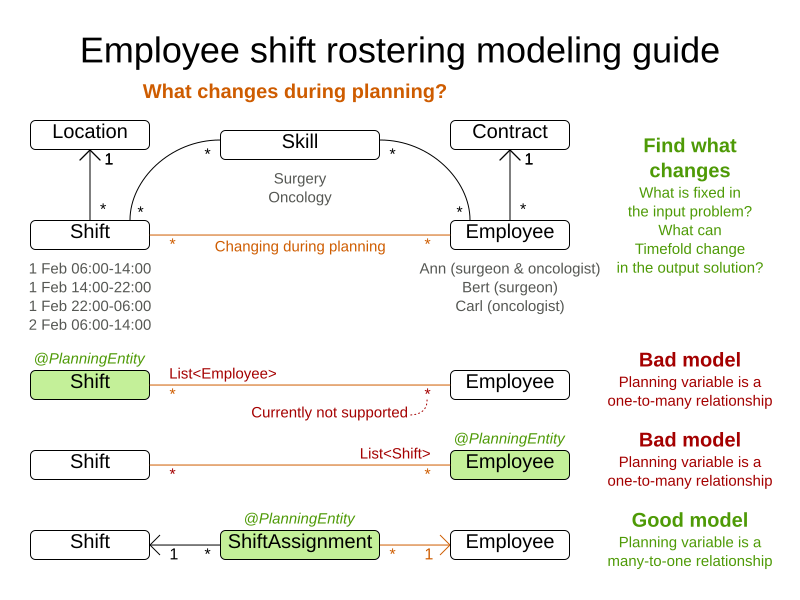

Timefold Solver does not currently support a @PlanningVariable annotation on

a collection. Planning list variable is not a means of achieving a many-to-one

relationship; it serves to indicate that these values happen in a sequence one after another.

4. Annotate a many-to-one relationship with a @PlanningEntity annotation. Usually the many side of the relationship is the planning entity class that contains the planning variable. If the relationship is bi-directional, both sides are a planning entity class but usually the many side has the planning variable and the one side has the shadow variable. For example, in employee rostering, the ShiftAssignment class has an @PlanningEntity annotation.

5. Make sure each planning entity is meaningful without its planning variables. When all planning variables are null, a business person should still be able to describe what the entity represents. A planning entity class cannot consist of only planning variables or an ID and only planning variables.

a. Remove any surplus @PlanningVariable annotations so that they become problem properties. Doing this significantly decreases [the search space size](#pdf-dest-9fb07ae9f08d2d1c) and significantly increases solving efficiency. For example, in employee rostering, the ShiftAssignment class should not annotate both the Shift and Employee relationship with @PlanningVariable.

b. A surrogate ID alone does not count as a problem property. The entity needs at least one meaningful, identifying field beyond its ID and planning variables.

c. In some cases, multiple planning entity instances have the same set of problem properties. In such cases, add an extra problem property to distinguish them. For example, in employee rostering, the ShiftAssignment class has the problem property Shift as well as the problem property indexInShift to tell apart multiple assignments to the same shift.

There is no need to add a hard constraint to ensure that two planning entities are different. Two entities which .equals(…) each other are strictly forbidden and fail fast.

6. Choose the model in which the number of planning entities is fixed during planning. If the count of planning entities can vary depending on the solution, the solver cannot establish a fixed search space to explore. This is a common first-timer mistake: modeling from the perspective of the resource rather than the work item.

For example, in employee rostering, it is impossible to know in advance how many shifts each employee will have before Timefold Solver solves the model and the results can differ for each solution found. On the other hand, the number of employees per shift is known in advance, so it is better to make the Shift relationship a problem property and the Employee relationship a planning variable as shown in the following examples.

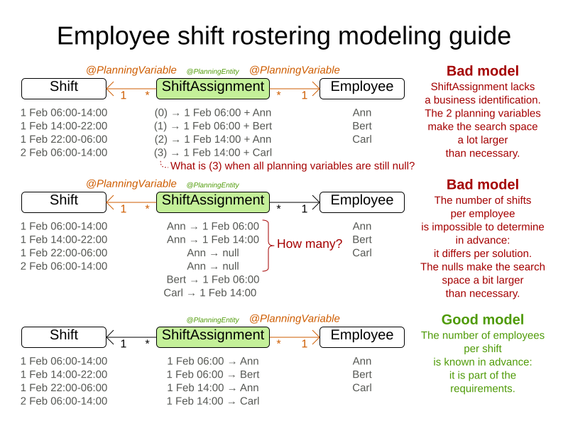

Once you have completed these steps, implement your model using the [building blocks reference](#pdf-dest-601e0ae9a75a4274).

<a id="pdf-dest-26e62456a7f0f4eb"></a>

<a id="section-0094"></a>
## Chapter 10. Modeling building blocks

While we’ve simplified model creation with our constraint solver, it can still be complex and time-consuming. If rapid deployment is crucial, consider our pre-

built models. Designed to tackle common optimization challenges, they integrate

seamlessly through our REST API, enabling faster time-to-market.

Explore our documentation and available models [here](https://docs.timefold.ai/).

<a id="pdf-dest-9ca38a65a389a9b9"></a>

<a id="section-0095"></a>
### 10.1. Introduction

Timefold Solver gives you access to a range of building blocks to model the domain of your planning problem. This page describes those building blocks in more detail.

If instead you are looking for guidance on how to create a good [domain](#pdf-dest-601e0ae9a75a4274) model, read the domain [modeling guide](#pdf-dest-601e0ae9a75a4274).

If you have never tried Timefold Solver before, we recommend following our

[Getting Started guides](#pdf-dest-601e0ae9a75a4274) for a practical introduction.

A planning domain model typically consist of the following elements:

- [Planning entities](#pdf-dest-bc2c57849b666a46) are classes whose instances change during planning.
- The properties of a planning entity that change during planning are called [planning variables](#pdf-dest-31d6d7e9985dd271). The different types of planning variables are described below.
- [Genuine planning variables](#pdf-dest-41231a9ea7e82789) are assigned available planning values during solving. ([source](#pdf-dest-7575d0cc5580334c))
- [Problem facts](#pdf-dest-a8eb7ad2e33a281c) are classes that do not change during planning, but are used to validate constraints. Problem facts are often also used as planning values.
- A [planning solution](#pdf-dest-377ca6bdb81ab0f0) class contains all the planning entities and problem facts, and often also provides the planning values that the solver can use during planning. It also contains the status of the solving process and the score of the planning problem.

Example 1. School Timetabling example

In a school timetabling scenario, where lessons need to be assigned rooms and timeslots, we get this class diagram.

timeslots Timeslot

String id

@PlanningEntity Lesson DayOfWeek dayOfWeek

@PlanningSolution Timetable timeslot

1..* LocalTime startTime

String id

List<Timeslot> timeslots LocalTime endTime

String subject

List<Room> rooms lessons

String teacher

List<Lesson> lessons 1..*

String studentGroup room

SolverStatus solverStatus Room

@PlanningVariable Timeslot timeslot

HardSoftScore score String id

@PlanningVariable Room room

1..* String name

rooms

For this planning problem:

- Timeslot and Room are problem facts.
- Lesson is the planning entity, which has 2 planning variables: timeslot and room.
- Timetable is the planning solution. It contains all the Lesson planning entity instances, and all possible planning values, which are instances of Room and Timeslot which can be assigned to the planning variables in Lesson.

In Timefold Solver, all elements of the planning domain model are plain objects. Load them from a database, an XML file, a data repository, a REST service, a noSQL cloud, … (see [integration](running-timefold-solver/library/integration.pdf#integration)): it doesn’t matter.

<a id="pdf-dest-31d6d7e9985dd271"></a>

<a id="section-0096"></a>
#### 10.1.1. Types of planning variables

Planning variables are the properties of planning entities which the solver will change in its effort to find better solutions. There are 2 different types of planning variables we can distinguish: genuine and shadow planning variables.

<a id="pdf-dest-41231a9ea7e82789"></a>

10.1.1.1. Genuine planning variables

Genuine planning variables are variables to which the solver will assign planning values. There are 3 variants of genuine planning variables. The variants you use depends on the problem you are solving. For more detailed guidance on when to use which variant, read the [domain modeling](#pdf-dest-7fe374d78081ce90) [guide](#pdf-dest-7fe374d78081ce90).

- [@PlanningVariable](#pdf-dest-6961175c48fffeac): contains a single planning value. Planning values can be assigned to multiple planning entities.
- [@PlanningListVariable](#pdf-dest-fbc665f240838a05): contains multiple planning values in a specific order. Planning values can only be assigned to a single planning entity.

|  | @PlanningVariable | @PlanningListVariable |
| --- | --- | --- |
| Assignment<br>model | One value per entity | Ordered list of values per entity |

|  | @PlanningVariable | @PlanningListVariable |
| --- | --- | --- |
| Values shared<br>across entities | Yes, the same value can be assigned to<br>multiple entities | No, each value belongs to exactly one<br>entity |
| Order of values<br>matters | No | Yes |
| Typical use case | Assign a room to a lesson, assign an<br>employee to a shift | Route customers for a vehicle,<br>sequence tasks for a worker |
| Limitations |  | One per solution |

A planning entity can contain [a mix](#pdf-dest-fc7eb953f94cc686) of these genuine variables, with some limitations.

<a id="pdf-dest-b5d02287bce8bcd2"></a>

10.1.1.2. Shadow planning variables

A shadow variable is a planning variable whose correct value can be deduced from the state of the [genuine planning variables](#pdf-dest-41231a9ea7e82789). From an optimization perspective, Timefold Solver effectively only optimizes genuine variables. Whenever a genuine variable is modified, the solver ensures that all dependent shadow variables are updated accordingly to maintain consistency.

Even though shadow variables violate the principle of normalization by definition, in some use cases it can be very practical to use a shadow variable, especially to express the constraints more naturally.

Example 2. Shadow variables in Vehicle Routing Problems

For example, in vehicle routing with time windows, the arrival time at a customer for a vehicle can be calculated based on the previously visited customers of that vehicle (and the known travel times between two locations). When the customers for a vehicle change, the arrival time for each customer is automatically adjusted. For more information, see the [vehicle routing domain model](#pdf-dest-1145288c46e99342).

Depending on your use of [@PlanningVariable](#pdf-dest-6961175c48fffeac) or the @PlanningListVariable several built-in shadow ([source](#pdf-dest-fbc665f240838a05)) variables are provided. These are documented in the details section of the respective genuine planning variables.

In addition, Timefold Solver also provides a way to [implement shadow variables yourself](#pdf-dest-e83ce444356988fd).

<a id="pdf-dest-a8eb7ad2e33a281c"></a>

<a id="section-0097"></a>
### 10.2. Problem fact

A problem fact is any object with getters that does not change during planning. In school timetabling, the timeslots and rooms are problem facts:

Java

```
public class Timeslot {

    DayOfWeek dayOfWeek;
    LocalTime startTime;
    LocalTime endTime;

    ...
}
```

Java

```
public class Room {

    String name;

    ...
}
```

A problem fact can reference other problem facts:

Java

```
public class Course {

    private String code;

    private Teacher teacher; // Other problem fact
    private int lectureSize;
    private int minWorkingDaySize;

    private List<Curriculum> curriculumList; // Other problem facts
    private int studentSize;

    // ... getters
}
```

A problem fact class does not require any Timefold Solver specific code. For example, you can reuse your domain classes, which might have JPA or Jackson annotations.

Generally, better designed domain classes lead to simpler and more efficient score constraints. Therefore, when dealing with a messy (denormalized) legacy system, it can sometimes be worthwhile to convert the messy domain model into a Timefold Solver specific model first. For example: if your domain model has two

Teacher instances for the same teacher that teaches at two different departments, it

is harder to write a correct score constraint that constrains a teacher’s spare time on the original model than on an adjusted model.

Alternatively, you can sometimes also introduce [a cached problem fact](#pdf-dest-fba57cf5d4489941) to enrich the domain model for planning only.

<a id="pdf-dest-8513a20fd2df1867"></a>

<a id="section-0098"></a>
#### 10.2.1. @PlanningId

For some functionality (such as [multi-threaded incremental solving](running-timefold-solver/multithreaded-solving.pdf#multithreadedIncrementalSolving) and real-time planning), ([source](#pdf-dest-601e0ae9a75a4274)) Timefold Solver needs to map problem facts and planning entities to a unique ID. Timefold Solver uses that ID to rebase a move from one thread’s solution state to another’s.

To enable such functionality, specify the @PlanningId annotation on the identification field or getter method, for example on the database ID:

Java

```
public class Visit {

    @PlanningId
    private String username;

    ...
}
```

A @PlanningId property must be:

- Unique for that specific class
  - It does not need to be unique across different problem fact classes (unless in that rare case that those classes are mixed in the same value range or planning entity collection).
- Of a type that implements [Comparable](https://docs.oracle.com/en/java/javase/21/docs/api/java.base/java/lang/Comparable.html), or of a primitive type whose boxed type implements Comparable (for example long, which boxes to Long).
  - The type must also provide a stable equals()/hashCode() contract.
  - It’s recommended to use immutable identifier types such as Long, String or UUID and primitive alternatives such as long where appropriate.
- Never null by the time Solver.solve() is called.

<a id="pdf-dest-bc2c57849b666a46"></a>

<a id="section-0099"></a>
### 10.3. Planning entity

<a id="pdf-dest-c5be4d1c91d51022"></a>

<a id="section-0100"></a>
#### 10.3.1. Planning entity definition

A planning entity is a JavaBean (POJO) whose properties change during solving, for example a Lesson which has a Timeslot property.

A planning problem usually only has one planning entity class, for example the Lesson class. A planning entity class needs to be annotated with the @PlanningEntity annotation. The problem usually consists of multiple planning entities, which are instances of the planning entity class. In school timetabling for example, each Lesson instance is a planning entity.

Each planning entity class has one or more planning variables (which can be [genuine](#pdf-dest-6961175c48fffeac) or shadows). ([source](#pdf-dest-e83ce444356988fd)) It should also have one or more defining properties. Java

```
@PlanningEntity
public class Lesson {

    private String subject;
    private String teacher;
    private String studentGroup;

    // Planning variables: changes during planning, between score calculations.
    @PlanningVariable
    private Timeslot timeslot;
    @PlanningVariable
    private Room room;

    // ... getters and setters
}
```

In the school timetabling example above, a Lesson is defined by its subject, teacher and a student group, and has planning variables for its timeslot and room. This means that `Lesson’s subject, teacher and student group never changes during solving, while its timeslot and room do.

Planning entities need to be declared through the @PlanningEntity annotation on the class and in the solver configuration XML.

Java

```
@PlanningEntity
public class Lesson {
    // Planning variables, getters, setters and fields excluded
}
```

The solver configuration needs to declare each planning entity class:

```
<solver xmlns="https://timefold.ai/xsd/solver" xmlns:xsi=
"http://www.w3.org/2001/XMLSchema-instance"
xsi:schemaLocation="https://timefold.ai/xsd/solver
https://timefold.ai/xsd/solver/solver.xsd">
...
<entityClass>org.acme.schooltimetabling.domain.Lesson</entityClass>
...
</solver>
```

When Timefold Solver is [integrated in Quarkus or Spring](running-timefold-solver/library/integration.pdf#integration), the XML file is optional.

Some uses cases have multiple planning entity classes. For example: route freight and trains into railway network arcs, where each freight can use multiple trains over its journey and each train can carry multiple freights per arc.

<a id="pdf-dest-c606fffa272b52bd"></a>

<a id="section-0101"></a>
#### 10.3.2. Planning entity considerations

When implementing planning entities, take the following into account.

<a id="pdf-dest-b7c74863100f848d"></a>

10.3.2.1. Do not create unnecessary planning entity classes

Having multiple planning entity classes directly raises the implementation complexity of your use case. Consequently, this will also increase the time it takes Timefold Solver to find optimized solutions. If possible, avoid creating planning entity classes and use one of the other available mechanisms instead.

For example, do not create a planning entity class to hold the total free time of a teacher, which needs to be kept up to date as the Lecture planning entities change. Instead, calculate the free time in the score constraints (or as a [shadow variable](#pdf-dest-e83ce444356988fd)).

If historic data needs to be considered too, then create a problem fact to hold the total of the historic assignments up to, but not including, the planning window (so that it does not change when a planning entity changes) and let the score constraints take it into account.

<a id="pdf-dest-21421b9b0194f73d"></a>

10.3.2.2. Keep planning entity equals() and hashCode() implementations constant

Planning entity equality implementations must remain constant:

- If two entities are equal at the start of solving, they must remain equal during solving.
- If two entities are not equal at the start of solving, they must remain not equal during solving.
- If two entities are equal, they are considered to be the same entity.

From this, it follows that entity equals() and hashCode() implementations must not depend on any planning variables, as these change during solving. You can use a [@PlanningId](#pdf-dest-8513a20fd2df1867) to distinguish planning entities from each other.

Pay special attention when using data structures with auto-generated equals() and hashCode(), such as Kotlin data classes or Lombok’s @EqualsAndHashCode.

<a id="pdf-dest-a7b8c2ed9155e3e1"></a>

10.3.2.3. Planning entity implementations must be mutable

As Timefold Solver will mutate the [genuine](#pdf-dest-6961175c48fffeac) or shadow planning variables of the planning entity, the ([source](#pdf-dest-e83ce444356988fd)) planning entity must be mutable.

As Java’s enum and record types are immutable by design, these can not be used as planning entities.

<a id="pdf-dest-079a1ff77d0c06ee"></a>

<a id="pdf-dest-ea9b779d4766b44f"></a>

<a id="section-0102"></a>
#### 10.3.3. Planning entity sorting

Some optimization algorithms are more efficient when planning entities are sorted based on a specific metric, which helps estimate the relative difficulty of each planning entity. For example: in bin packing bigger items are harder to fit.

Do not try to use planning entity order to implement a business constraint. It will not affect the score function: if we have infinite solving time, the returned solution will be the same.

To attain a schedule in which certain entities are scheduled earlier in the schedule, [add a score constraint](#pdf-dest-597baea417f1ba6e) to change the score function so it prefers such solutions. Only consider adding planning entity sort order if it can make the solver more efficient.

To allow the heuristics to take advantage of that domain specific information, set a comparatorClass to the @PlanningEntity annotation:

```
@PlanningEntity(comparatorClass = VisitComparator.class)
public class Visit {
    // ...
}

public class VisitComparator implements Comparator<Visit> {

    public int compare(Visit a, Visit b) {
        return new CompareToBuilder()
                .append(a.getServiceDuration(), b.getServiceDuration())
                .append(a.getId(), b.getId())
                .toComparison();
    }

}
```

Alternatively, you can also set a comparatorFactoryClass to the @PlanningEntity annotation, so that you have access to the rest of the problem facts from the solution too.

See [sorted selection](#pdf-dest-636879f0dfd222e5) for more information.

Entities should be sorted in ascending order: "easy" entities are lower, "difficult" entities are higher. For example, in bin packing: small item < medium item < big

item.

Although most algorithms start in descending order, they just reverse the ordering.

None of the current planning variable states should be used to compare planning entities. During Construction Heuristics, those variables are likely to be null anyway. For example, a Lesson's timeslot variable should not be used.

<a id="pdf-dest-71202f57b75c5a44"></a>

<a id="section-0103"></a>
#### 10.3.4. When is a planning entity considered initialized

A planning entity is considered initialized in either of the following cases:

- No [genuine planning variable](#pdf-dest-41231a9ea7e82789) is set to null.
- Genuine planning variable is set to null, but it [allows unassigned values](#pdf-dest-47baf2a354e19c3d).
- No possible value for a list variable is left unassigned to any one of the genuine entities, unless it [allows unassigned values](#pdf-dest-679dffc14e52aa6e).

It follows that, if unassigned values are allowed, a planning entity is always

considered initialized.

[Local Search](#pdf-dest-96a02767a9ec6bd5) will refuse to start when it encounters an uninitialized entity in your planning solution. Run [Construction Heuristics](#pdf-dest-dd0c99ffb478bf02) before Local Search to get a good starting solution.

<a id="pdf-dest-6961175c48fffeac"></a>

<a id="section-0104"></a>
### 10.4. Basic planning variable (@PlanningVariable)

A basic variable is a JavaBean property (so a getter and setter) on a planning entity. It is a [genuine](#pdf-dest-41231a9ea7e82789) [planning variable](#pdf-dest-41231a9ea7e82789), so it points to a planning value, which changes during planning.

In the example below, a Lesson's timeslot property is a basic planning variable. Note that even though a Lesson's timeslot property changes to another Timeslot during planning, no Timeslot instance itself is changed. Normally planning variables are genuine, but advanced cases can also have [shadows](#pdf-dest-e83ce444356988fd).

A basic planning variable getter needs to be annotated with the @PlanningVariable annotation, optionally with a non-empty valueRangeProviderRefs property.

```
@PlanningEntity
public class Lesson {
    ...

    private Timeslot timeslot;

    @PlanningVariable
    public Timeslot getTimeslot() {
        return timestlot;
    }

    public void setTimeslot(Timeslot timeslot) {
        this.timestlot = timeslot;
    }

    ...

}
```

The optional valueRangeProviderRefs property defines what are the possible planning values for this planning variable. It references one or more @ValueRangeProvider id's. If none are provided, Timefold Solver will attempt to auto-detect matching @ValueRangeProviders.

A @PlanningVariable annotation needs to be on a member in a class with a @PlanningEntity annotation. It is ignored on parent classes or subclasses without that annotation.

[Annotating the field](#pdf-dest-1a0a29e434787cac) instead of the property works too:

Java

```
@PlanningEntity
public class Lesson {
    ...

    @PlanningVariable
    private Timeslot timeslot;

    ...

}
```

For more advanced planning variables used to model precedence relationships,

see [planning list variable](#pdf-dest-fbc665f240838a05).

<a id="pdf-dest-47baf2a354e19c3d"></a>

<a id="section-0105"></a>
#### 10.4.1. Allowing unassigned values

By default, an initialized planning variable cannot be null, so an initialized solution will never use null for any of its planning variables. In an over-constrained use case, this can be counterproductive. For example: in task assignment with too many tasks for the workforce, we would rather leave low priority tasks unassigned instead of assigning them to an overloaded worker.

To allow an initialized planning variable to be null, set allowsUnassigned to true:

Java

```
    @PlanningVariable(..., allowsUnassigned = true)
    public Worker getWorker() {
        return worker;
    }
```

Constraint Streams filter out planning entities with a null planning variable by

default. Use [forEachIncludingUnassigned()](#pdf-dest-9369638902b37ea9) to avoid such unwanted behaviour.

Timefold Solver will automatically add the value null to the value range. There is no need to add null in a collection provided by a ValueRangeProvider.

Using a planning variable with unassigned values implies that your score calculation is responsible for punishing (or even rewarding) variables with a null value.

Failure to penalize unassigned variables can cause a solution with all variables unassigned to be the best solution. See the [overconstrained planning](#pdf-dest-a1f449063d6e03a2) guide for more information.

Repeated planning (especially [real-time planning](#pdf-dest-601e0ae9a75a4274)) does not mix well with a planning variable that allows unassigned values. Every time the Solver starts or a problem fact change is made, the [Construction Heuristics](#pdf-dest-68e6e1c4a99df0a3) will try to initialize all the null variables again, which can be a huge waste of time. One way to deal with this is to filter the entity selector of the placer in the construction heuristic.

```
<solver xmlns="https://timefold.ai/xsd/solver" xmlns:xsi=
"http://www.w3.org/2001/XMLSchema-instance"
    xsi:schemaLocation="https://timefold.ai/xsd/solver
https://timefold.ai/xsd/solver/solver.xsd">
    ...
    <constructionHeuristic>
    <queuedEntityPlacer>
        <entitySelector id="entitySelector1">
        <filterClass>...</filterClass>
        </entitySelector>
    </queuedEntityPlacer>
    ...
    <changeMoveSelector>
        <entitySelector mimicSelectorRef="entitySelector1" />
    </changeMoveSelector>
    ...
    </constructionHeuristic>
...
</solver>
```

<a id="pdf-dest-38e5379c38e59b3c"></a>

<a id="section-0106"></a>
#### 10.4.2. Basic variable shadow variables

When a planning entity uses [basic planning variables](#pdf-dest-6961175c48fffeac), you can use the following built-in annotation to derive shadow variables from that genuine planning variable.

- @InverseRelationShadowVariable: for mapping bidirectional relationships.

If the built-in shadow variable annotations are insufficient, [@ShadowVariable](#pdf-dest-e7bfb6725717aac8) can be used to create custom handlers.

<a id="pdf-dest-7c8d44346415387a"></a>

10.4.2.1. Inverse relation shadow variable

Two variables are bi-directional if their instances always point to each other, unless one side points to null and the other side does not exist. So if A references B, then B references A. For basic planning variables, the bi-directional relationship must be a many-to-one relationship. To map a bi-directional relationship between two planning variables, annotate the source side (which is the genuine side) as a normal planning variable:

Java

```
@PlanningEntity
public class Lesson {

    @PlanningVariable(...)
    public Timeslot timeslot;

    ...

}
```

And then annotate the other side (which is the shadow side) with a @InverseRelationShadowVariable annotation on a Collection (usually a Set or List) property:

Java

```
@PlanningEntity
public class Timeslot {

    @InverseRelationShadowVariable(sourceVariableName = "timeslot")
    public List<Lesson> lessons;

    ...

}
```

The sourceVariableName property is the name of the genuine planning variable on the return type of the getter (so the name of the genuine planning variable on the other side).

The shadow property, which is Collection (usually List, Set or SortedSet), can never be null. If no genuine variable references that shadow entity, then it is an

empty collection. Furthermore, it must be a mutable Collection because once

Timefold Solver starts initializing or changing genuine planning variables, it will add and remove elements to the Collections of those shadow variables accordingly.

<a id="pdf-dest-34e2763eb1a760ec"></a>

<a id="section-0107"></a>
#### 10.4.3. Pinning a planning variable (@PlanningPin)

A pinned planning entity doesn’t change during solving. This is commonly used by users to pin down one or more specific assignments and force Timefold Solver to schedule around those fixed assignments.

To pin some planning entities down, add an @PlanningPin annotation on a boolean getter or field of the planning entity class. That boolean is true if the entity is pinned down to its current planning values and false otherwise.

Java

```
@PlanningEntity
public class Lecture {

    private boolean pinned;
    ...

    @PlanningPin
    public boolean isPinned() {
        return pinned;
    }

    ...
}
```

In the example above, if pinned is true, the lecture will not be assigned to another period or room (even if the current period and rooms fields are null).

Planning pin value must never change during planning. To change whether an

entity is pinned or not, use [ProblemChange](#pdf-dest-35cafd0605efc0c5).

<a id="pdf-dest-fbc665f240838a05"></a>

<a id="section-0108"></a>
### 10.5. Planning list variable (VRP, Task assigning, …)

Use the planning list variable to model problems where the goal is to distribute a number of workload elements among limited resources in a specific order. This includes, for example, vehicle routing, traveling salesman, task assigning, and similar problems.

For example, the vehicle routing problem can be modeled as follows:

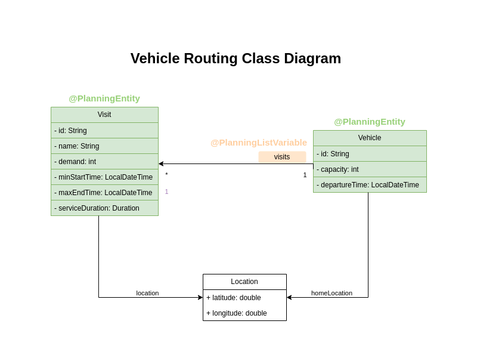

The object model matches the natural language description of the problem:

Java

```
@PlanningEntity
class Vehicle {

    int capacity;
    Depot depot;

    @PlanningListVariable
    List<Customer> customers = new ArrayList<>();
}
```

Planning list variable can be used if the domain meets the following criteria:

1. There is a one-to-many relationship between the planning entity and the planning value.

2. The order in which planning values are assigned to an entity’s list variable is significant.

3. Each planning value is assigned to exactly one planning entity. No planning value may appear in multiple entities.

Only a single [@PlanningListVariable](#pdf-dest-fbc665f240838a05) is supported per solution.

<a id="pdf-dest-679dffc14e52aa6e"></a>

<a id="section-0109"></a>
#### 10.5.1. Allowing unassigned values

By default, all planning values have to be assigned to exactly one list variable across the entire planning model. In an [over-constrained use case](#pdf-dest-a1f449063d6e03a2), this can be counterproductive. For example: in task assignment with too many tasks for the workforce, we would rather leave low priority tasks unassigned instead of assigning them to an overloaded worker.

To allow a planning value to be unassigned, set allowsUnassignedValues to true:

Java

```
@PlanningListVariable(allowsUnassignedValues = true)
public List<Customer> getCustomers() {
    return customers;
}
```

Constraint Streams filter out unassigned planning values by default. Use [forEachIncludingUnassigned()](#pdf-dest-9369638902b37ea9) to avoid such unwanted behaviour. Using a planning list variable with unassigned values implies that your score calculation is

responsible for punishing (or even rewarding) these unassigned values.

Failure to penalize unassigned values can cause a solution with all values unassigned to be the best solution. See the [overconstrained planning](#pdf-dest-a1f449063d6e03a2) guide for more information.

Repeated planning (especially [real-time planning](#pdf-dest-601e0ae9a75a4274)) does not mix well with a planning list variable that allows unassigned values. Every time the Solver starts or a problem fact change is made, the [Construction Heuristics](#pdf-dest-68e6e1c4a99df0a3) will try to initialize all the null variables again, which can be a huge waste of time. One way to deal with this is to filter the entity selector of the placer in the construction heuristic.

```
<solver xmlns="https://timefold.ai/xsd/solver" xmlns:xsi=
"http://www.w3.org/2001/XMLSchema-instance"
    xsi:schemaLocation="https://timefold.ai/xsd/solver
https://timefold.ai/xsd/solver/solver.xsd">
    ...
    <constructionHeuristic>
    <queuedValuePlacer>
        <valueSelector id="selector1">
        <filterClass>...</filterClass>
        </valueSelector>
    </queuedValuePlacer>
    ...
    <listChangeMoveSelector>
        <valueSelector mimicSelectorRef="selector1" />
    </listChangeMoveSelector>
    ...
    </constructionHeuristic>
...
</solver>
```

<a id="pdf-dest-5801eae82a417ae0"></a>

<a id="section-0110"></a>
#### 10.5.2. List variable shadow variables

When the planning entity uses a [list variable](#pdf-dest-fbc665f240838a05), you can use the following built-in annotations to derive shadow variables from that genuine planning variable.

- [@InverseRelationShadowVariable](#pdf-dest-a779afde7c04367f): Used to get the planning entity containing the planning variable list to which a planning value is assigned;
- [@IndexShadowVariable](#pdf-dest-652b9a5d6e8745ae): Used to get the index of a planning value’s position it’s assigned planning variable list;
- [@PreviousElementShadowVariable](#pdf-dest-d71c54bebe22e23e): Used to get a planning value’s predecessor in its assigned planning variable list;
- [@NextElementShadowVariable](#pdf-dest-d71c54bebe22e23e): Used to get a planning value’s successor in its assigned planning variable list;
- [@CascadingUpdateShadowVariable](#pdf-dest-6266df8af127fc0a): Used to update a set of connected elements;

If the built-in shadow variable annotations are insufficient, [@ShadowVariable](#pdf-dest-e7bfb6725717aac8) can be used to create custom handlers.

<a id="pdf-dest-a779afde7c04367f"></a>

10.5.2.1. Inverse relation shadow variable

Use the @InverseRelationShadowVariable annotation to establish bi-directional relationship between the entity and the elements assigned to its list variable. The type of the inverse shadow variable is the planning entity itself because there is a one-to-many relationship between the entity and the element classes.

The planning entity side has a genuine list variable:

Java

```
@PlanningEntity
public class Vehicle {

    @PlanningListVariable
    public List<Customer> getCustomers() {
        return customers;
    }

    public void setCustomers(List<Customer> customers) {...}
}
```

On the element side:

- Annotate the class with @PlanningEntity to make it a shadow planning entity.
- [Register this class as a planning entity](#pdf-dest-e83ce444356988fd), otherwise Timefold Solver won’t detect it and the shadow variable won’t update.
- Create a property with the genuine planning entity type.
- Annotate it with @InverseRelationShadowVariable and set sourceVariableName to the name of the genuine planning list variable.

Java

```
@PlanningEntity
public class Customer {

    @InverseRelationShadowVariable(sourceVariableName = "customers")
    public Vehicle getVehicle() {
        return vehicle;
    }

    public void setVehicle(Vehicle vehicle) {...}
}
```

<a id="pdf-dest-652b9a5d6e8745ae"></a>

10.5.2.2. Index shadow variable

While the @InverseRelationShadowVariable allows to establish the bi-directional relationship between the entity and the elements assigned to its list variable, @IndexShadowVariable provides a pointer into the entity’s list variable where the element is assigned.

The planning entity side has a genuine list variable:

Java

```
@PlanningEntity
public class Vehicle {

    @PlanningListVariable
    public List<Customer> getCustomers() {
        return customers;
    }

    public void setCustomers(List<Customer> customers) {...}
}
```

On the element side:

- Annotate the class with @PlanningEntity to make it a shadow planning entity.
- [Register this class as a planning entity](#pdf-dest-e83ce444356988fd), otherwise Timefold Solver won’t detect it and the shadow variable won’t update.
- Create a property which returns an Integer. Integer is required instead of int, as the index may be null if the element is not yet assigned to the list variable.
- Annotate it with @IndexShadowVariable and set sourceVariableName to the name of the genuine planning list variable.

Java

```
@PlanningEntity
public class Customer {

    @IndexShadowVariable(sourceVariableName = "customers")
    public Integer getIndexInVehicle() {
        return indexInVehicle;
    }

}
```

<a id="pdf-dest-d71c54bebe22e23e"></a>

10.5.2.3. Previous and next element shadow variable

Use @PreviousElementShadowVariable or @NextElementShadowVariable to get a reference to an element that is assigned to the same entity’s list variable one index lower (previous element) or one index higher (next element).

The previous and next element shadow variables may be null even in a fully initialized solution. The first element’s previous shadow variable is null and the last element’s next shadow variable is null.

The planning entity side has a genuine list variable:

Java

```
@PlanningEntity
public class Vehicle {

    @PlanningListVariable
    public List<Customer> getCustomers() {
        return customers;
    }

    public void setCustomers(List<Customer> customers) {...}
}
```

On the element side:

Java

```
@PlanningEntity
public class Customer {

    @PreviousElementShadowVariable(sourceVariableName = "customers")
    public Customer getPreviousCustomer() {
        return previousCustomer;
    }

    public void setPreviousCustomer(Customer previousCustomer) {...}

    @NextElementShadowVariable(sourceVariableName = "customers")
    public Customer getNextCustomer() {
        return nextCustomer;
    }

    public void setNextCustomer(Customer nextCustomer) {...}
```

<a id="pdf-dest-53c0ec12bdb13443"></a>

<a id="section-0111"></a>
#### 10.5.3. Pinning a list variable (@PlanningPinToIndex)

There are cases where pinning only a part of a planning list variable is necessary. For example, if some customer visits have already happened but are still in the list, it makes sense to pin them down.

To achieve that, use a @PlanningPinToIndex annotation instead:

Java

```
@PlanningEntity
public class Vehicle {

    ...

    @PlanningListVariable
    protected List<Customer> customers = ...; // Includes some customers.
    @PlanningPinToIndex
    protected int firstUnpinnedIndex = 1;

    ...

}
```

When @PlanningPinToIndex is used, the list is split in two parts.

- The first part, with indexes less than firstUnpinnedIndex, is pinned. In the example above, it means that the first element of the list can not be moved from its position. Nothing will be added before it, and it will not be removed from the list. It will forever stay as the first element of the list.
- The second part, starting with firstUnpinnedIndex and ending where the list ends, is movable. Items can be freely added, removed and reordered in this part of the list.

This means that, if the @PlanningPinToIndex is zero (0), the list is fully modifiable. Consequently, if the @PlanningPinToIndex is equal to the size of the list, all the contents of the list are pinned, but the list can still be extended by adding to the end of the list.

To pin the entire list, preventing any modifications to the list whatsoever, [@PlanningPin](#pdf-dest-34e2763eb1a760ec) needs to be used on the entity itself. In that case, the value of @PlanningPinToIndex must be zero (0).

Value of the index must never change during planning. To change how far the list

is pinned, use [ProblemChange](#pdf-dest-35cafd0605efc0c5).

<a id="pdf-dest-6266df8af127fc0a"></a>

<a id="section-0112"></a>
#### 10.5.4. Updating tail chains

The annotation @CascadingUpdateShadowVariable enables updates a set of connected elements. Timefold Solver triggers a user-defined logic after all events are processed. Hence, the related listener is the final one executed during the event lifecycle. Moreover, it automatically propagates changes to the subsequent elements in the list when the value of the related shadow variable changes.

The planning entity side has a genuine list variable:

Java

```
@PlanningEntity
public class Vehicle {

    @PlanningListVariable
    public List<Customer> getCustomers() {
        return customers;
    }

    public void setCustomers(List<Customer> customers) {...}
}
```

On the element side:

Java

```
@PlanningEntity
public class Customer {
    @InverseRelationShadowVariable(sourceVariableName = "customers")
    private Vehicle vehicle;
    @PreviousElementShadowVariable(sourceVariableName = "customers")
    private Customer previousCustomer;
    @CascadingUpdateShadowVariable(targetMethodName = "updateArrivalTime")
    private LocalDateTime arrivalTime;

    ...

    public void updateArrivalTime() {...}
```

The targetMethodName refers to the user-defined logic that updates the annotated shadow variable. The method must be implemented in the defining entity class, be non-static, and not include any parameters.

In the previous example, the cascade update listener calls updateArrivalTime after all shadow variables have been updated, including vehicle and previousCustomer. It then automatically calls updateArrivalTime for the subsequent customers and stops when the arrivalTime value does not change after running target method or when it reaches the end.

A user-defined logic can only change shadow variables. Changing a genuine

planning variable or a problem fact will result in score corruption.

When distinct target methods are used by separate @CascadingUpdateShadowVariable

variables in the same model, the order of their execution is undefined.

<a id="pdf-dest-bef2749502684400"></a>

10.5.4.1. Multiple sources

If the user-defined logic requires updating multiple shadow variables, apply the @CascadingUpdateShadowVariable to all shadow variables.

Java

```
@PlanningEntity
public class Customer {

    @PreviousElementShadowVariable(sourceVariableName = "customers")
    private Customer previousCustomer;
    @NextElementShadowVariable(sourceVariableName = "customers")
    private Customer nextCustomer;
    @CascadingUpdateShadowVariable(targetMethodName =
"updateWeightAndArrivalTime")
    private LocalDateTime arrivalTime;
    @CascadingUpdateShadowVariable(targetMethodName =
"updateWeightAndArrivalTime")
    private Integer weightAtVisit;
    ...
    public void updateWeightAndArrivalTime() {...}
```

Timefold Solver triggers the user-defined logic in updateWeightAndArrivalTime at the end of the event lifecycle. It stops when both arrivalTime and weightAtVisit values do not change or when it reaches the end.

<a id="pdf-dest-042f65959f89e0ba"></a>

<a id="section-0113"></a>
### 10.6. Planning value and planning value range

<a id="pdf-dest-7575d0cc5580334c"></a>

<a id="section-0114"></a>
#### 10.6.1. Planning value

A planning value is a possible value for a genuine planning variable. Usually, a planning value is a problem fact, but it can also be any object, for example an Integer. It can even be another planning entity or even an interface implemented by both a planning entity and a problem fact.

Primitive types (such as int) are not allowed.

A planning value range is the set of possible planning values for a planning variable. Planning value ranges need to come from a finite collection. It must never contain duplicate values, as defined by the equals() method of the value’s type. It must also not contain the value null, not even for a [planning variable allowing unassigned values](#pdf-dest-47baf2a354e19c3d).

<a id="pdf-dest-5f40b7b5c099b69d"></a>

<a id="section-0115"></a>
#### 10.6.2. Planning value range provider

<a id="pdf-dest-e2ad347169deb7b2"></a>

10.6.2.1. Overview

The value range of a planning variable is defined with the @ValueRangeProvider annotation. A @ValueRangeProvider may carry a property id, which is referenced by the @PlanningVariable's property valueRangeProviderRefs.

This annotation can be located on two types of methods:

- On the Solution: All planning entities share the same value range.
- On the planning entity: The value range differs per planning entity. This is less common.

A @ValueRangeProvider annotation needs to be on a member in a class with a @PlanningSolution or a @PlanningEntity annotation. It is ignored on parent classes or subclasses without those annotations.

The return type of that method can be three types:

- Collection: The value range is defined by a Collection (usually a List) of its possible values.
- Array: The value range is defined by an array of its possible values.
- ValueRange: The value range is defined by its bounds. This is less common.

<a id="pdf-dest-dfefce89477581b2"></a>

10.6.2.2. ValueRangeProvider on the solution

All instances of the same planning entity class share the same set of possible planning values for that planning variable. This is the most common way to configure a value range.

The @PlanningSolution implementation has a method that returns a Collection (or a ValueRange). Any value from that Collection is a possible planning value for this planning variable.

Java

```
@PlanningVariable
public Timeslot getTimeslot() {
    return timeslot;
}

@PlanningSolution
public class Timetable {
    ...

    @ValueRangeProvider
    public List<Timeslot> getTimeslots() {
        return timeslots;
    }

}
```

[Annotating the field](#pdf-dest-1a0a29e434787cac) instead of the property works too:

Java

```
@PlanningSolution
public class Timetable {
    ...

    @ValueRangeProvider
    private List<Timeslot> timeslots;

}
```

<a id="pdf-dest-43601136f091829f"></a>

10.6.2.3. ValueRangeProvider on the Planning Entity

Each planning entity has its own value range (a set of possible planning values) for the planning variable. For example, if a teacher can never teach in a room that does not belong to their department, lectures of that teacher can limit their room value range to the rooms of their department. Java

```
    @PlanningVariable
    public Room getRoom() {
        return room;
    }

    @ValueRangeProvider
    public List<Room> getPossibleRoomList() {
        return getCourse().getTeacher().getDepartment().getRoomList();
    }
```

Never use this to enforce a soft constraint (or even a hard constraint when the problem might not have a feasible solution). For example: Unless there is no other way, a teacher cannot teach in a room that does not belong to their department. In this case, the teacher should not be limited in their room value range (because sometimes there is no other way).

By limiting the value range specifically of one planning entity, you are effectively creating a built-in hard constraint. This can have the benefit of severely lowering the number of possible solutions; however, it can also take away the freedom of the optimization algorithms to temporarily break that constraint in order to escape from a local optimum.

A planning entity should not use other planning entities to determine its value range. That would only try to make the planning entity solve the planning problem itself and interfere with the optimization algorithms.

Every entity has its own List instance, unless multiple entities have the same value range. For example, if teacher A and B belong to the same department, they use the same List<Room> instance. Furthermore, each List contains a subset of the same set of planning value instances. For example, if department A and B can both use room X, then their List<Room> instances contain the same Room instance.

A ValueRangeProvider on the planning entity consumes more memory than ValueRangeProvider on the Solution and disables certain automatic performance optimizations.

The value range annotated method can also be defined with a single parameter, which must be of the same type as the solution class. The method will have access to the current solution and allow for the dynamic generation of a list of values.

Java

```
    @PlanningVariable
    public Room getRoom() {
        return room;
    }

    @ValueRangeProvider
    public List<Room> getPossibleRoomListWithSolution(Timetable timetable) {
        return timetable.getRoomListFor(this);
    }
```

A ValueRangeProvider that uses the solution as a parameter for the planning entity

consumes less memory compared to the previous approach, as it does not require

storing information at the entity level. This also helps reduce the overhead of the [solution cloning](#pdf-dest-565fb1d17532a1e8), which can become significant for huge data sets.

<a id="pdf-dest-f3fdae4f500c4b99"></a>

10.6.2.4. Referencing ValueRangeProviders

There are two ways how to match a planning variable to a value range provider. The simplest way is to have value range provider auto-detected. Another way is to explicitly reference the value range provider.

<a id="pdf-dest-f423af4ddf83a83b"></a>

10.6.2.4.1. Anonymous ValueRangeProviders

We already described the first approach. By not providing any valueRangeProviderRefs on the @PlanningVariable annotation, Timefold Solver will go over every @ValueRangeProvider-annotated method or field which does not have an id property set, and will match planning variables with value ranges where their types match.

In the following example, the planning variable car will be matched to the value range returned by getCompanyCarList(), as they both use the Car type. It will not match getPersonalCarList(), because that value range provider is not anonymous; it specifies an id.

Java

```
    @PlanningVariable
    public Car getCar() {
        return car;
    }

    @ValueRangeProvider
    public List<Car> getCompanyCarList() {
        return companyCarList;
    }

    @ValueRangeProvider(id = "personalCarRange")
    public List<Car> getPersonalCarList() {
        return personalCarList;
    }
```

Automatic matching also accounts for polymorphism. In the following example, the planning variable car will be matched to getCompanyCarList() and getPersonalCarList(), as both CompanyCar and PersonalCar are Cars. It will not match getAirplanes(), as an Airplane is not a Car.

Java

```
    @PlanningVariable
    public Car getCar() {
        return car;
    }

    @ValueRangeProvider
    public List<CompanyCar> getCompanyCarList() {
        return companyCarList;
    }

    @ValueRangeProvider
    public List<PersonalCar> getPersonalCarList() {
        return personalCarList;
    }

    @ValueRangeProvider
    public List<Airplane> getAirplanes() {
        return airplaneList;
    }
```

<a id="pdf-dest-663b3a87b78a37e5"></a>

10.6.2.4.2. Explicitly referenced ValueRangeProviders

In more complicated cases where auto-detection is not sufficient or where clarity is preferred over simplicity, value range providers can also be referenced explicitly.

In the following example, the car planning variable will only be matched to value range provided by methods getCompanyCarList().

Java

```
    @PlanningVariable(valueRangeProviderRefs = {"companyCarRange"})
    public Car getCar() {
        return car;
    }

    @ValueRangeProvider(id = "companyCarRange")
    public List<CompanyCar> getCompanyCarList() {
        return companyCarList;
    }

    @ValueRangeProvider(id = "personalCarRange")
    public List<PersonalCar> getPersonalCarList() {
        return personalCarList;
    }
```

Explicitly referenced value range providers can also be combined, for example:

Java

```
    @PlanningVariable(valueRangeProviderRefs = { "companyCarRange",
"personalCarRange" })
    public Car getCar() {
        return car;
    }

    @ValueRangeProvider(id = "companyCarRange")
    public List<CompanyCar> getCompanyCarList() {
        return companyCarList;
    }

    @ValueRangeProvider(id = "personalCarRange")
    public List<PersonalCar> getPersonalCarList() {
        return personalCarList;
    }
```

<a id="pdf-dest-df6ad64f3ba5288d"></a>

10.6.2.5. ValueRangeFactory

Instead of a Collection, you can also return ValueRange, built by the ValueRangeFactory:

Java

```
    @ValueRangeProvider
    public ValueRange<Integer> getDelayRange() {
        return ValueRangeFactory.createIntValueRange(0, 5000);
    }
```

A ValueRange uses far less memory, because it only holds the bounds. In the example above, a Collection would need to hold all 5000 ints, instead of just the two bounds.

Furthermore, an incrementUnit can be specified, for example if you have to buy stocks in units of 200 pieces:

Java

```
    @ValueRangeProvider
    public ValueRange<Integer> getStockAmountRange() {
        // Range: 0, 200, 400, 600, ..., 9999600, 9999800, 10000000
        return ValueRangeFactory.createIntValueRange(0, 10000000, 200);
    }
```

The ValueRangeFactory has creation methods for several value class types:

- boolean: A boolean range.
- int: A 32bit integer range.
- long: A 64bit integer range.
- BigInteger: An arbitrary-precision integer range.
- BigDecimal: A decimal point range. By default, the increment unit is the lowest non-zero value in the scale of the bounds.
- Temporal (such as LocalDate, LocalDateTime, …): A time range.

<a id="pdf-dest-67c289716d37513f"></a>

<a id="pdf-dest-fd36a68e36c2ae48"></a>

<a id="section-0116"></a>
#### 10.6.3. Planning value sorting

Some optimization algorithms work a bit more efficiently if the planning values are sorted according to a given metric, which means they are more likely to satisfy a planning entity requirement. For example: in bin packing bigger containers are more likely to fit an item.

Do not try to use planning value order to implement a business constraint. It will not affect the score function: if we have infinite solving time, the returned

solution will be the same.

To affect the score function, [add a score constraint](#pdf-dest-597baea417f1ba6e). Only consider adding planning value sort order if it can make the solver more efficient.

To allow the heuristics to take advantage of that domain specific information, set a comparatorClass to the @PlanningVariable annotation:

```
@PlanningVariable(..., comparatorClass = VehicleComparator.class)
public Vehicle getVehicle() {
    return vehicle;
}

public class VehicleComparator implements Comparator<Vehicle> {

public int compare(Vehicle a, Vehicle b) {
    return new CompareToBuilder()
            .append(a.getCapacity(), b.getCapacity())
            .append(a.getId(), b.getId())
            .toComparison();
}

}
```

If you have multiple planning value classes in the same value range, the

comparatorClass needs to implement a Comparator of a common superclass (for

example Comparator<Object>) and be able to handle comparing instances of those different classes.

If the model uses a [list variable](#pdf-dest-fbc665f240838a05), the setting process is similar, and the property comparatorClass must be specified in the @PlanningListVariable annotation:

```
@PlanningListVariable(..., comparatorClass = CustomerComparator.class)
List<Customer> customers = new ArrayList<>();

public class CustomerComparator implements Comparator<Customer> {

public int compare(Customer a, Customer b) {
    return new CompareToBuilder()
            .append(a.getPriority(), b.getPriority())
            .append(a.getId(), b.getId())
            .toComparison();
}

}
```

Alternatively, you can also set a comparatorFactoryClass to the @PlanningVariable or @PlanningListVariable annotations, so you have access to the rest of the problem facts from the solution too.

See [sorted selection](#pdf-dest-636879f0dfd222e5) for more information.

Values should be sorted in ascending order: "weaker" values are lower, and "stronger" values are higher. In bin packing, small container < medium container < big container.

None of the current planning variable state in any of the planning entities should be used to compare planning values. During construction heuristics, those variables are likely to be null. For example, none of the timeslot variables of any Lesson may be used to determine the order of a Timeslot.

<a id="pdf-dest-fc7eb953f94cc686"></a>

<a id="section-0117"></a>
### 10.7. Mixed models

Real-world planning problems often involve multiple types of decisions simultaneously. A production line must both assign an operator (a single value) and sequence a list of jobs (an ordered collection). A vehicle route must both plan the sequence of visits and, for each visit, independently select a fallback delivery point.

When a solution model combines [basic](#pdf-dest-6961175c48fffeac) and list planning variables, it is referred to as a mixed ([source](#pdf-dest-fbc665f240838a05)) model.

Only a single [@PlanningListVariable](#pdf-dest-fbc665f240838a05) is supported per solution.

Mixed models support three distinct patterns.

<a id="pdf-dest-953f7e340fc969bf"></a>

<a id="section-0118"></a>
#### 10.7.1. Both variable types on a single entity

A single planning entity can declare both a basic variable and a list variable. This is appropriate when a resource requires both a single-value assignment and an ordered workload.

In the following example, each production Line must be assigned an Operator (basic variable) and must also maintain an ordered list of Job objects to process (list variable). The operator assignment drives skill-based constraints, while the job list drives throughput and scheduling constraints.

Java

```
@PlanningEntity
public class Line {
    @PlanningVariable
    private Operator operator;

    @PlanningListVariable
    private List<Job> jobs;

    ...
}
```

With both variables on the same entity, you can pin the entire entity (using @PlanningPin) or partially pin the list (using @PlanningPinToIndex), but you cannot pin the basic assignment independently; if you need that, use [multiple entities](#pdf-dest-e35b9d0174ef4894).

<a id="pdf-dest-e35b9d0174ef4894"></a>

<a id="section-0119"></a>
#### 10.7.2. Multiple entities with independent variable types

Different planning entities can each define their own variable type. This is appropriate when decisions have different lifecycles or ownership, and need to be re-solved independently.

In the following example, each Line manages its own job sequence (list variable), while LineOperation records the assigned operator (basic variable). Separating these into distinct entities allows staff assignments to be re-solved without disturbing the existing job schedules, and vice versa.

Java

```
@PlanningEntity
public class Line {
    @PlanningListVariable
    private List<Job> jobs;
    ...
}

@PlanningEntity
public class LineOperation {
    @PlanningVariable
    private Operator operator;

    ...
}
```

<a id="pdf-dest-0dcb975e4058350a"></a>

<a id="section-0120"></a>
#### 10.7.3. Entities inside a list variable with their own basic variables

Items within a list variable can themselves be planning entities that carry additional basic variables. This handles decisions that are scoped to individual list elements rather than to the list as a whole.

In the following example, each Vehicle maintains an ordered list of Delivery objects (list variable). Each Delivery is also a planning entity that independently selects a DropoffPoint location (basic variable). The vehicle route will optimize both the order of the visits and switch out the different potential drop-off locations.

Java

```
@PlanningEntity
public class Vehicle {
    @PlanningListVariable
    private List<Delivery> deliveries;

    ...
}

@PlanningEntity
public class Delivery {
    @PlanningVariable
    private DropoffPoint dropOff;

    ...
}
```

<a id="pdf-dest-e83ce444356988fd"></a>

<a id="section-0121"></a>
### 10.8. Shadow variables

A shadow variable is a [planning variable](#pdf-dest-31d6d7e9985dd271) whose correct value can be deduced from the state of the [genuine planning variables](#pdf-dest-41231a9ea7e82789). Timefold Solver effectively only optimizes the genuine variables, and it assures that when a genuine variable changes, any dependent shadow variables are changed accordingly. Shadow variables can be defined by:

- Using one of the [built-in](#pdf-dest-0876577525b52007) shadow variable annotations;
- Defining them yourselves using [custom shadow variables](#pdf-dest-e7bfb6725717aac8).

<a id="pdf-dest-0876577525b52007"></a>

<a id="section-0122"></a>
#### 10.8.1. Built-in shadow variables

Timefold Solver provides various built-in shadow variable annotation that make configuring common shadow variables trivial. Their applicability and usage varies depending on your use of [@PlanningVariable](#pdf-dest-38e5379c38e59b3c) or the @PlanningListVariable. ([source](#pdf-dest-5801eae82a417ae0))

Detailed information on these built-in shadow variables can be found in the section on shadow variables of each of the genuine variable variants:

- [Built-in shadow variables for @PlanningVariable](#pdf-dest-38e5379c38e59b3c),
- [Built-in shadow variables for @PlanningListVariable](#pdf-dest-5801eae82a417ae0)

<a id="pdf-dest-e7bfb6725717aac8"></a>

<a id="section-0123"></a>
#### 10.8.2. Custom Shadow Variables

Custom shadow variables can be used to derive values of shadow variables from genuine variables or other shadow variables. This approach allows access to all the fields and methods of the declaring class.

To define a declarative shadow variable: Annotate the field with @ShadowVariable and specify the name of a supplier method. Annotate the supplier method with @ShadowSources, listing all the planning variables (genuine or shadow) it depends on.

Whenever any of the declared sources change, the supplier method is invoked, and its return value is set on all fields that reference it via @ShadowVariable.

Java

```
@PlanningEntity
public class Job {

    @PlanningVariable
    private LocalDate startDate;

    private int durationInDays;

    @ShadowVariable(supplierName="endDateSupplier")
    private LocalDate endDate;

    @ShadowSources("startDate")
    public LocalDate endDateSupplier() {
        if (startDate == null) {
            return null;
        } else {
            return startDate.plusDays(durationInDays);
        }
    }
}
```

In the example above, whenever the solver changes the startDate planning variable, the endDateSupplier() method is called. Its return value is assigned to the endDate field, as declared by the @ShadowVariable(supplierName="endDateSupplier") annotation.

Some key considerations:

- Type consistency: The return type of the supplier method must match the type of the field it is assigned to.
- Explicit dependencies: All planning variables used in the supplier logic must be explicitly listed in @ShadowSources. Undeclared dependencies will not trigger updates, leading to stale or incorrect shadow values.
- The supplier method may optionally accept a single parameter of the solution class type, which allows access to the solution state without the need of propagating it to the genuine or shadow entities.

<a id="pdf-dest-0951ddc187f48505"></a>

10.8.2.1. @ShadowSources paths

When using @ShadowSources, you must specify the paths to the variables that the supplier method depends on to compute its value. These paths must follow 1 of 4 syntactic forms:

| Form | Syntax Example | Description |
| --- | --- | --- |
| Simple Variable<br>Name | "variableName" | Refers to a variable (genuine or shadow) on the same<br>planning entity. A planning list variable cannot be used<br>directly; use List Variable Element Access instead. |
| Chained Property<br>Path | "a.b.c" | Refers to a variable reachable via chained properties.<br>Intermediate elements must be facts or variables; the final<br>one must be a variable. |
| Collection Element<br>Access | "collectionVar[].va<br>rName" | Refers to a variable (varName) on each element in a<br>collection (collectionVar) on the entity. The collection<br>must not change during solving. |
| List Variable<br>Element Access | "listVar[].shadowV<br>arName" | Refers to a declarative shadow variable (shadowVarName) on<br>each element currently assigned to a<br>@PlanningListVariable (listVar) on the entity. The supplier<br>is recomputed when the list variable or any element’s<br>shadowVarName changes. |

Let’s illustrate this with a specific example.

Java

```
@PlanningEntity
public class Job {

    @PreviousElementShadowVariable
    Job previous;

    private int durationInDays;

    private Collection<Job> dependencies;

    @ShadowVariable(supplierName="startDateSupplier")
    private LocalDateTime startDate;

    @ShadowVariable(supplierName="endDateSupplier")
    private LocalDate endDate;

    @ShadowSources({"previous.endDate", "dependencies[].endDate"})
    public LocalDate startDateSupplier() {
        LocalDate readyDate = null;
        if (previous != null) {
            readyDate = previous.endDate;
        } else {
            return null;
        }
        if (dependencies != null) {
            for (var dependency : dependencies) {
                if (dependency.endDate == null) {
                    return null;
                }
                if (readyDate.isBefore(dependency.endDate)) {
                    readyDate = dependency.endDate;
                }
            }
        }
        return readyDate;
    }

    @ShadowSources("startDate")
    public LocalDate endDateSupplier() {
        if (startDate == null) {
            return null;
        } else {
            return startDate.plusDays(durationInDays);
        }
    }

}
```

| Reference | Form | Meaning |
| --- | --- | --- |
| "startDate" | Simple Variable Name | Direct reference to the startDate field. |

| Reference | Form | Meaning |
| --- | --- | --- |
| "previous.endDate" | Chained Property Path | Accesses endDate from the previous variable. |
| "dependencies[].endDat<br>e" | Collection Element<br>Access | Accesses endDate of each element in the<br>dependencies collection. |

The supplier method may include only one optional parameter, the solution class. Here’s an example to show this.

Java

```
@PlanningSolution
public class PackagingSchedule {
    ...
}

@PlanningEntity
public class Job {

    ...

    private LocalDateTime startDate;

    @ShadowVariable(supplierName="processStartDate")
    private boolean startDateOnHoliday;

    @ShadowSources("startDate")
    public boolean processStartDate(PackagingSchedule schedule) {
        if (startDate == null) {
            return false;
        } else {
            return schedule.isHoliday(startDate);
        }
    }

}
```

<a id="pdf-dest-74e2c7348e027244"></a>

10.8.2.2. Updating multiple fields at once

A supplier method can only update the single field it is declared on via @ShadowVariable(supplierName = …). There is no way for one supplier method to directly update several independent shadow variable fields.

If the fields don’t need to be recomputed together, chain them instead: let one shadow variable’s supplier declare another shadow variable as one of its @ShadowSources, the way endDate sources from startDate in the earlier example on this page. Each supplier still only ever sets its own field, but Timefold reruns only the suppliers whose declared sources actually changed, so unrelated downstream fields aren’t recomputed unnecessarily. However, when several pieces of shadow state are always computed together and change at the same time, it’s often simpler, and cheaper, since the underlying calculation only has to run once, to group them into a single wrapper object, such as a record, and make that wrapper itself the shadow variable. The supplier method then returns a new instance of the wrapper every time it runs, and the individual pieces of state are read off that wrapper through its accessor methods. This avoids repeating the same calculation in multiple supplier methods and keeps a set of related fields consistent with one another.

Java

```
public record JobState(LocalDate readyDate, LocalDate startDate, LocalDate
endDate, int totalDurationInDays) {
}

@PlanningEntity
public class Job {

    @PreviousElementShadowVariable(sourceVariableName = "jobs")
    private Job previous;

    private LocalDate earliestStartDate;

    private int durationInDays;

    @ShadowVariable(supplierName = "jobStateSupplier")
    private JobState jobState;

    @ShadowSources("previous.jobState")
    public JobState jobStateSupplier() {
        // 1. Ready date: the previous job's end date, or null if this job is
first in the chain.
        LocalDate readyDate = previous == null ? null : previous.jobState
.endDate();

        // 2. Start date: can't start before the previous job ends, nor before
this job's earliest start date.
        LocalDate startDate = readyDate == null || readyDate.isBefore
(earliestStartDate) ? earliestStartDate : readyDate;

        // 3. End date
        LocalDate endDate = startDate == null ? null : startDate.plusDays
(durationInDays);

        // 4. Total duration in days, accumulated along the chain of previous
jobs
        int totalDurationInDays = (previous == null ? 0 : previous.jobState
.totalDurationInDays()) + durationInDays;

        return new JobState(readyDate, startDate, endDate, totalDurationInDays
);
    }
}
```

Here, readyDate, startDate, endDate and totalDurationInDays are all recomputed together in jobStateSupplier() and packaged into a single JobState instance. Any code that needs one of these values reads it off the jobState field, for example job.getJobState().endDate().

<a id="pdf-dest-e6e8d2d328abc0d5"></a>

10.8.2.3. Detecting inconsistencies in shadow variables

In certain cases, shadow variables may form an infinite loop. There are three ways a loop can form:

- Source-induced, when two custom shadow variables' sources refer to each other:

Java

```
    @PlanningEntity
    public class Entity {
        @ShadowVariable(supplierName="variable1Supplier")
        String variable1;

        @ShadowVariable(supplierName="variable2Supplier")
        String variable2;

        // ...

        @ShadowSources("variable2")
        String variable1Supplier() { /* ... */ }

        @ShadowSources("variable1")
        String variable2Supplier() { /* ... */ }
    }
```

- Fact-induced, when a shadow variable has itself as a direct or transitive dependency via a fact:

Java

```
    @PlanningEntity
    public class Entity {
    Entity dependency;

    @ShadowVariable(supplierName="variableSupplier")
    String variable;

    @ShadowSources("dependency.variable")
    String variableSupplier() { /* ... */ }
    // ...
    }
    Entity a = new Entity();
    Entity b = new Entity();
    a.setDependency(b);
    b.setDependency(a);
    // a depends on b, and b depends on a, which is invalid.
```

- Variable-induced, when a shadow variable has itself as a direct or transitive dependency via a variable:

Java

```
    @PlanningEntity
    public class Entity {
    Entity dependency;

    @PreviousElementShadowVariable(/* ... */)
    Entity previous;

    @ShadowVariable(supplierName="variableSupplier")
    String variable;

    @ShadowSources({"previous.variable", "dependency.variable"})
    String variable1Supplier() { /* ... */ }
    // ...
    }

    Entity a = new Entity();
    Entity b = new Entity();
    b.setDependency(a);
    a.setPrevious(b);
    // b depends on a via a fact, and a depends on b via a variable
    // The solver can break this loop by moving a after b.
```

Source-induced and fact-induced loops cannot be broken by the solver, and represents an issue in either the input problem or the domain model. The solver will fail-fast if it detects a source-induced or fact-induced loop.

A declarative shadow variable is considered inconsistent if:

- It is part of a loop. For example, if variable a depends on b and b depends on a, both are in a loop.
- It depends on another variable that is inconsistent. For example, if c depends on a, and a is in a loop with b, then c is also considered part of the loop.

When a declarative shadow variable is inconsistent, the solver’s reaction depends on whether any entity in the model declares a deprecated @ShadowVariablesInconsistent field:

- If at least one entity declares such a field, the inconsistent shadow variables are set to null and the @ShadowVariablesInconsistent field of every involved entity is set to true.
- If no entity declares such a field, the shadow variable update is canceled and the solution’s score will have a negative [structural score](#pdf-dest-7331bc9bbf44c3bc), which marks the solution as structurally flawed.

Models that relied on inconsistent shadow variables being silently set to null must therefore declare a @ShadowVariablesInconsistent field to keep that behavior.

The [structural score](#pdf-dest-7331bc9bbf44c3bc) is a component of every Score that is 0 for structurally sound solutions and negative for structurally flawed ones. A structurally flawed score is worse than any structurally sound score, so a structurally flawed solution is never accepted during solving.

When a structurally flawed solution is passed to SolutionManager.update(…), the method fails fast and throws an InconsistentSolutionException, which exposes the solution and the entities involved in the inconsistency. When passed to SolutionManager.analyze(…), the returned [Score analysis](#pdf-dest-601e0ae9a75a4274) has a structural flaw analysis that can be used to get the inconsistent entities.

When a structurally flawed solution is passed to Solver.solve, the Solver logs a warning and unassigns the involved planning entities before solving. If the inconsistency cannot be resolved this way, for example because an involved entity is [pinned](#pdf-dest-34e2763eb1a760ec), the Solver throws an Exception.

If no entity have a @ShadowVariablesInconsistent property, you do not need to handle inconsistencies in any constraints, since the Solver will not calculate the score for any structurally flawed solutions.

see [how to migrate from](#pdf-dest-601e0ae9a75a4274) @ShadowVariablesInconsistent to structural scores for a guide on how to update your domain model to remove the deprecated @ShadowVariablesInconsistent fields.

<a id="pdf-dest-166da7da76198d10"></a>

10.8.2.4. Aligning shadow variables

@ShadowSources has an optional alignmentKey parameter that can be used to reuse calculation results to increase performance.

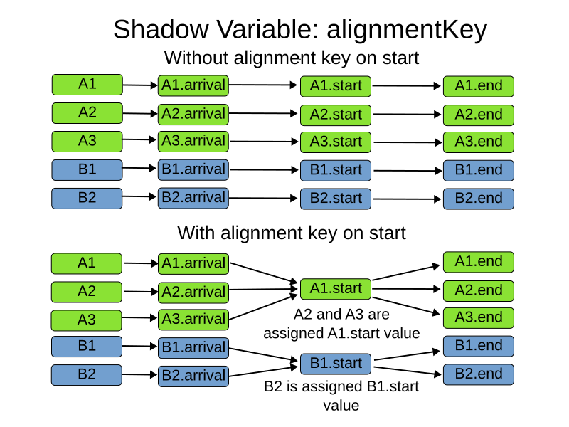

To be used, a few requirements must be met:

- alignmentKey must reference a property that remains constant during solving. It may point to a problem fact, planning entity or a regular property of the planning entity, but it cannot reference any planning variables.
- For all entities with the same, non-null alignmentKey value, calling the supplier method must result in the same value regardless of what entity is called.

Only use alignment keys when you can guarantee the two requirements above are

met. Since the calculation will only be performed on a single entity, if the supplier

method can return a different value depending on what aligned entity is chosen, you will get inconsistent and incorrect results.

The code below meets the requirements, since the leader field is not a variable, and entities with the same leader will get the same value.

Java

```
@PlanningEntity
public class Leader {
    @PlanningVariable
    Integer value;
    // ...
}

@PlanningEntity
public class Follower {
    Leader leader;

    @ShadowVariable(supplierName="valueSupplier")
    Integer value;

    @ShadowSources(value = {"leader.value"}, alignmentKey = "leader")
    public Integer valueSupplier() {
        return leader.value;
    }
}
```

However, the code below does not meet the requirements, since Follower entities with the same leader but a different minValue may calculate different values.

Java

```
@PlanningEntity
public class Leader {
    @PlanningVariable
    Integer value;
    // ...
}

@PlanningEntity
public class Follower {
    Leader leader;
    int minValue;

    @ShadowVariable(supplierName="valueSupplier")
    Integer value;

    @ShadowSources(value = {"leader.value"}, alignmentKey = "leader")
    public Integer valueSupplier() {
        if (leader.value == null || leader.value < minValue) {
            return minValue;
        }
        return leader.value;
    }
}
```

Entities where the alignmentKey is evaluated to null are each calculated separately and won’t share calculations for that shadow variable with other entities. This feature is particularly useful when you have a group of entities that must be aligned to the same value. For example:

Java

```
@PlanningEntity
public class Job {

    @PreviousElementShadowVariable
    Job previous;

    private Collection<Job> alignedJobs;

    @ShadowVariable(supplierName="readyDateSupplier")
    private LocalDateTime readyDate;

    @ShadowVariable(supplierName="startDateSupplier")
    private LocalDateTime startDate;

    @ShadowSources(/* ... */)
    public LocalDate readyDateSupplier() {
        // ...
    }

    @ShadowSources(value = {"readyDate", "alignedJobs[].readyDate"},
alignmentKey="alignedJobs")
    public LocalDate startDateSupplier() {
        if (alignedJobs == null) {
            // All entities with a null alignmentKey (in this case,
"alignedJobs")
            // are calculated separately.
            return readyDate;
        }
        var lastReadyDate = readyDate;
        for (var job : alignedJobs) {
            if (job.readyDate.isAfter(lastReadyDate)) {
                lastReadyDate = job.readyDate;
            }
        }
        return lastReadyDate;
    }
}
```

<a id="pdf-dest-439e955dc2f16f62"></a>

10.8.2.5. Optimizing shadow variables

Each custom Shadow Variable on each planning entity constitutes one node of a reference graph. The Solver analyzes this graph to decide what is the most optimal strategy for updating these variables. In general, the less variables and the less dependencies between them, the faster the processing. For the best performance, follow these guidelines:

- Keep all custom Shadow Variables on the same entity class. If one entity is grouping another entity, you might be able to use [custom Shadow Variable alignment](#pdf-dest-166da7da76198d10) to keep custom Shadow Variables on the same entity class.
- Do not use both @PreviousElementShadowVariable and @NextElementShadowVariable in your sources. This includes using @PreviousElementShadowVariable as a source in one custom Shadow Variable while using @NextElementShadowVariable as a source in another custom Shadow Variable.
- Compute as much as possible within a single custom Shadow Variable supplier method. Do not create intermediate custom Shadow Variables when it is possible to compute the value directly from another custom Shadow Variable.

These are tips and tricks for optimal performance and needn’t be followed to the letter. The solver will work correctly even if you decide not to follow any of the advice, albeit with slightly lesser performance.

<a id="pdf-dest-a33730da862dcc54"></a>

<a id="section-0124"></a>
#### 10.8.3. Shadow variable cloning

A shadow variable’s value (just like a genuine variable’s value) isn’t [planning cloned](#pdf-dest-565fb1d17532a1e8) by the default solution cloner, unless it can easily prove that it must be planning cloned (for example the property type is a planning entity class). Specifically shadow variables of type List, Set, Collection or Map usually need to be planning cloned to avoid corrupting the best solution when the working solution changes. To planning clone a shadow variable, add @DeepPlanningClone annotation:

Java

```
    @DeepPlanningClone
    @ShadowVariable(...)
    private Map<LocalDateTime, Integer> usedManHoursPerDayMap;
```

<a id="pdf-dest-1bc4b12e5cb6017d"></a>

<a id="section-0125"></a>
#### 10.8.4. Testing a shadow variable

Testing the logic of shadow variables is crucial for maintaining consistency and preventing issues such as [score corruption](#pdf-dest-d16f56861c51fe35). The Timefold Solver API includes a facility method that automatically updates shadow variables from a given model, allowing you to create unit tests easily. Consider the following solution class:

Java

```
public class Schedule {

    @PlanningEntityCollectionProperty
    private List<Job> jobs;
    ...
}
```

Next, let’s reuse the following model from previous section.

Java

```
public class Job {

    public Job(LocalDate startDate, int durationInDays) {
        ...
    }

    @PlanningVariable
    private LocalDate startDate;

    private int durationInDays;

    @ShadowVariable(supplierName="endDateSupplier")
    private LocalDate endDate;

    @ShadowSources("startDate")
    public LocalDate endDateSupplier() {
        if (startDate == null) {
            return null;
        } else {
            return startDate.plusDays(durationInDays);
        }
    }
}
```

Finally, let’s create a unit test that will validate the defined shadow variable endDate. The utility method SolutionManager::updateShadowVariables reads the entity and updates its shadow variables. Notably, the method updateShadowVariables simplifies the logic and does not require proper solver configuration to update the shadow variables.

Java

```
    @Test
    void updateShadowVariables() {
        var job = new Job(LocalDate.now(), 10);
        SolutionManager.updateShadowVariables(Schedule.class, job);
        assertThat(job.getEndDate()).isEqualTo(LocalDate.now().plusDays(10));
    }
```

It is also possible to pass a solution instance rather than the solution class along with the related planning entities.

Java

```
    @Test
    void updateShadowVariables() {
        var solution = new Schedule();
        var job = new Job(LocalDate.now(), 10);
        solution.setJobs(List.of(job));
        SolutionManager.updateShadowVariables(solution);
        assertThat(job.getEndDate()).isEqualTo(LocalDate.now().plusDays(10));
    }
```

In the following example, a model that uses a planning list variable is employed to demonstrate the test feature.

Java

```
public class VehicleRoutePlan {

    @PlanningEntityCollectionProperty
    private List<Vehicle> vehicles;
    ...
}
```

The planning entity:

Java

```
@PlanningEntity
public class Vehicle {

    @PlanningListVariable
    List<Customer> customers;
    ...
}
```

On the element side:

Java

```
@PlanningEntity
public class Customer {
    @PreviousElementShadowVariable(sourceVariableName = "customers")
    Customer previousCustomer;

    @NextElementShadowVariable(sourceVariableName = "customers")
    Customer nextCustomer;

    ...
}
```

The test is defined as follows:

Java

```
    void updateShadowVariables() {
        var vehicle = new Vehicle();
        var customer1 = new Customer();
        var customer2 = new Customer();
        vehicle.setCustomers(List.of(customer1, customer2));

        SolutionManager.updateShadowVariables(VehicleRoutePlan.class, vehicle,
customer1, customer2);
        assertThat(customer1.previousCustomer).isNull();
        assertThat(customer1.nextCustomer).isSameAs(customer2);
        assertThat(customer2.previousCustomer).isSameAs(customer1);
        assertThat(customer2.nextCustomer).isNull();
    }
```

In the example above, only two types of shadow variables are used, but it is not

limited to these variable types. The method

SolutionManager::updateShadowVariables is also capable of automatically updating the [inverse relationship](#pdf-dest-a779afde7c04367f), index position, and tail chains. ([source](#pdf-dest-652b9a5d6e8745ae)) ([source](#pdf-dest-6266df8af127fc0a))

<a id="pdf-dest-377ca6bdb81ab0f0"></a>

<a id="section-0126"></a>
### 10.9. Planning problem and planning solution

<a id="pdf-dest-c839e868524664b6"></a>

<a id="section-0127"></a>
#### 10.9.1. Planning problem instance

A dataset for a planning problem needs to be wrapped in a class for the Solver to solve. That solution class represents both the planning problem and (if solved) a solution. It is annotated with a @PlanningSolution annotation. In school timetabling, the solution class is the Timetable class, which contains a Timeslot list, a Room list, and a Lesson list.

A planning problem is actually an unsolved planning solution or - stated differently - an uninitialized solution. In school timetabling, that Timetable class has the @PlanningSolution annotation, yet every Lesson in an unsolved Timetable class is not yet assigned to a Timeslot (their timeslot property is null). That’s not a feasible solution. It’s not even a possible solution. It’s an uninitialized solution.

<a id="pdf-dest-24ce6d38ffa09e17"></a>

<a id="section-0128"></a>
#### 10.9.2. Solution class

A solution class is annotated with @PlanningSolution and implements the SolverModel interface. It holds all problem facts, planning entities and a score. For example, a Timetable class holds a list of all timeslots, all rooms and all Lesson instances:

Java

```
@PlanningSolution
public class Timetable implements SolverModel<HardSoftScore> {

    @ProblemFactCollectionProperty
    @ValueRangeProvider
    private List<Timeslot> timeslots;

    @ProblemFactCollectionProperty
    private List<Room> rooms;

    @PlanningEntityCollectionProperty
    private List<Lesson> lessons;

    @PlanningScore
    private HardSoftScore score;

    @Override
    public HardSoftScore getScore() {
        return score;
    }

    // other Getters/Setters/Constructors
}
```

If you don’t need to control the score type, extend AbstractSimpleModel instead. It implements SolverModel<HardMediumSoftScore> and includes the @PlanningScore field, so you only need to define your problem facts and planning entities:

Java

```
            @PlanningSolution
            public class Timetable extends AbstractSimpleModel {

                @ProblemFactCollectionProperty
                @ValueRangeProvider
                private List<Timeslot> timeslots;
                @ProblemFactCollectionProperty
                private List<Room> rooms;

                @PlanningEntityCollectionProperty
                private List<Lesson> lessons;

                // Getters, Setters, Constructors
            }
```

When [using Timefold Solver as a library](#pdf-dest-601e0ae9a75a4274), the SolverModel interface is not available. Your @PlanningSolution class is a plain Java class with no framework interface to implement.

Solution class must not be of Java’s enum or record types. Those are immutable by design and therefore cannot change during planning, whereas a planning solution will.

<a id="pdf-dest-1b22a5cac1014edb"></a>

<a id="section-0129"></a>
#### 10.9.3. Planning entities of a solution (@PlanningEntityCollectionProperty)

Timefold Solver needs to extract the entity instances from the solution instance. It gets those collection(s) by calling every getter (or field) that is annotated with @PlanningEntityCollectionProperty:

Java

```
@PlanningSolution
public class Timetable {
    ...

    private List<Lesson> lessons;

    @PlanningEntityCollectionProperty
    public List<Lesson> getLessons() {
        return lessons;
    }

}
```

There can be multiple @PlanningEntityCollectionProperty annotated members. Those can even return a Collection with the same entity class type. Instead of Collection, it can also return an array. In rare cases, a planning entity might be a singleton: use @PlanningEntityProperty on its getter (or field) instead.

Both annotations need to be on a member in a class with a @PlanningSolution annotation, and are ignored on parent classes or subclasses without that annotation.

A planning solution must not contain duplicate entities, as defined by the equals() method of the entity class. If there are duplicate entities, the solver will fail-fast at startup.

<a id="pdf-dest-157fb7fd019a721f"></a>

<a id="section-0130"></a>
#### 10.9.4. Score of a Solution (@PlanningScore)

A @PlanningSolution class requires a score property (or field), which is annotated with a @PlanningScore annotation. The score property is null if the score hasn’t been calculated yet. The score property is typed to the specific Score implementation of your use case. Most use cases use a [HardSoftScore](#pdf-dest-9fb009e8d1e16dcb):

Java

```
@PlanningSolution
public class Timetable {

    ...

    @PlanningScore
    private HardSoftScore score;

    @PlanningScore
    public HardSoftScore getScore() {
        return score;
    }

    public void setScore(HardSoftScore score) {
        this.score = score;
    }

    ...

}
```

Some use cases use [other score types](#pdf-dest-58137ea86011e483).

<a id="pdf-dest-8009ea799c9392b9"></a>

<a id="section-0131"></a>
#### 10.9.5. Problem facts of a solution (@ProblemFactCollectionProperty)

For [Constraint Streams](#pdf-dest-601e0ae9a75a4274), Timefold Solver needs to extract the problem fact instances from the solution instance. It gets those collection(s) by calling every method (or field) that is annotated with @ProblemFactCollectionProperty. All objects returned by those methods are available to use by Constraint Streams. For example, in Timetable all Timeslot and Room instances are problem facts.

Java

```
@PlanningSolution
public class Timetable {
    ...

    @ProblemFactCollectionProperty
    @ValueRangeProvider
    private List<Timeslot> timeslots;

    @ProblemFactCollectionProperty
    @ValueRangeProvider
    private List<Room> rooms;

    ...

}
```

All planning entities are automatically inserted into the working memory. Do not add an annotation on their properties.

The problem facts methods are not called often: at most only once per solver phase

per solver thread.

There can be multiple @ProblemFactCollectionProperty annotated members. Those can even return a Collection with the same class type, but they shouldn’t return the same instance twice. Instead of Collection, it can also return an array.

A @ProblemFactCollectionProperty annotation needs to be on a member in a class with a @PlanningSolution annotation. It is ignored on parent classes or subclasses without that annotation.

In rare cases, a problem fact might be a singleton: use @ProblemFactProperty on its method (or field) instead.

<a id="pdf-dest-fba57cf5d4489941"></a>

10.9.5.1. Cached problem fact

A cached problem fact is a problem fact that does not exist in the real domain model, but is calculated before the Solver really starts solving. The problem facts methods have the opportunity to enrich the domain model with such cached problem facts, which can lead to simpler and faster score constraints.

For example, in examination, a cached problem fact TopicConflict is created for every two Topics which share at least one Student.

Java

```
    @ProblemFactCollectionProperty
    private List<TopicConflict> calculateTopicConflictList() {
        List<TopicConflict> topicConflictList = new ArrayList<TopicConflict>();
        for (Topic leftTopic : topicList) {
            for (Topic rightTopic : topicList) {
                if (leftTopic.getId() < rightTopic.getId()) {
                    int studentSize = 0;
                    for (Student student : leftTopic.getStudentList()) {
                        if (rightTopic.getStudentList().contains(student)) {
                            studentSize++;
                        }
                    }
                    if (studentSize > 0) {
                        topicConflictList.add(new TopicConflict(leftTopic,
rightTopic, studentSize));
                    }
                }
            }
        }
        return topicConflictList;
    }
```

Where a score constraint needs to check that no two exams with a topic that shares a student are scheduled close together (depending on the constraint: at the same time, in a row, or in the same day), the TopicConflict instance can be used as a problem fact, rather than having to combine every two Student instances.

<a id="pdf-dest-565fb1d17532a1e8"></a>

<a id="section-0132"></a>
#### 10.9.6. Cloning a solution

Most (if not all) optimization algorithms clone the solution each time they encounter a new best solution (so they can recall it later) or to work with multiple solutions in parallel.

There are many ways to clone, such as a shallow clone, deep clone, … This context

focuses on a planning clone.

A planning clone of a solution must fulfill these requirements:

- The clone must represent the same planning problem. Usually it reuses the same instances of the problem facts and problem fact collections as the original.
- The clone must use different, cloned instances of the entities and entity collections. Changes to an original solution entity’s variables must not affect its clone.

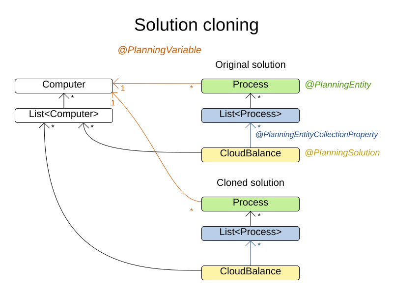

Implementing a planning clone method is hard, therefore you do not need to implement it.

<a id="pdf-dest-e0f55306bbf41d45"></a>

10.9.6.1. FieldAccessingSolutionCloner

This SolutionCloner is used by default. It works well for most use cases.

When the FieldAccessingSolutionCloner clones one of your collections or maps, it

may not recognize the implementation and replace it with ArrayList,

LinkedHashSet, TreeSet, LinkedHashMap or TreeMap (whichever is more applicable) . It recognizes most of the common JDK collection and map implementations.

The FieldAccessingSolutionCloner does not clone problem facts by default. If any of your problem facts needs to be deep cloned for a planning clone, for example if the problem fact references a planning entity or the planning solution, mark its class with a @DeepPlanningClone annotation:

Java

```
@DeepPlanningClone
public class SeatDesignationDependency {
    private SeatDesignation leftSeatDesignation; // planning entity
    private SeatDesignation rightSeatDesignation; // planning entity
    ...
}
```

In the example above, because SeatDesignationDependency references the planning entity SeatDesignation (which is deep planning cloned automatically), it should also be deep planning cloned.

Alternatively, the @DeepPlanningClone annotation also works on a getter method or a field to planning clone it. If that property is a Collection or a Map, it will shallow clone it and deep planning clone any element thereof that is an instance of a class that has a @DeepPlanningClone annotation.

Java

```
    @DeepPlanningClone
    private SeatDesignationDependency seatDesignationDependency;
```

Values of Java’s enum and record types are never deep-cloned. They are immutable

by design and shouldn’t be used to store mutable state, such as planning entities.

<a id="pdf-dest-1a94318a59548e48"></a>

10.9.6.2. Custom cloning with a SolutionCloner

To use a custom cloner, configure it on the planning solution:

```
@PlanningSolution(solutionCloner = TimetableSolutionCloner.class)
public class Timetable {
    ...
}
```

For example, a Timetable planning clone only deep clones all Timetable instances. So when the original solution changes (later on during planning) and one or more Timetable instances change, the planning clone isn’t affected.

The cloneSolution() method should only deep clone the planning entities. The problem facts, such as Timeslot and Room are normally not cloned: even their List instances are not cloned. If the problem facts were cloned too, then you would have to make sure that the new planning entity clones also refer to the new problem facts clones used by the cloned solution. For example, if you were to clone all Timeslot instances, then each Lesson clone and the Timetable clone itself should refer to those new Timeslot clones.

<a id="pdf-dest-0bda9402cd183857"></a>

<a id="section-0133"></a>
#### 10.9.7. Create an uninitialized solution

Create a @PlanningSolution instance to represent your planning problem’s dataset, so it can be set on the Solver as the planning problem to solve.

In school timetabling, a Timetable instance is created with the required Room and Timeslot instances and every Lesson has its planning variables set to null: Java

```
    public static Timetable generateDemoData(DemoData demoData) {
        List<Timeslot> timeslots = new ArrayList<>(10);
        long nextTimeslotId = 0L;
        timeslots.add(new Timeslot(Long.toString(nextTimeslotId++), DayOfWeek
.MONDAY, LocalTime.of(8, 30), LocalTime.of(9, 30)));
        timeslots.add(new Timeslot(Long.toString(nextTimeslotId++), DayOfWeek
.MONDAY, LocalTime.of(9, 30), LocalTime.of(10, 30)));
        timeslots.add(new Timeslot(Long.toString(nextTimeslotId++), DayOfWeek
.MONDAY, LocalTime.of(10, 30), LocalTime.of(11, 30)));
        timeslots.add(new Timeslot(Long.toString(nextTimeslotId++), DayOfWeek
.MONDAY, LocalTime.of(13, 30), LocalTime.of(14, 30)));
        timeslots.add(new Timeslot(Long.toString(nextTimeslotId++), DayOfWeek
.MONDAY, LocalTime.of(14, 30), LocalTime.of(15, 30)));
        ...

        List<Room> rooms = new ArrayList<>(3);
        long nextRoomId = 0L;
        rooms.add(new Room(Long.toString(nextRoomId++), "Room A"));
        rooms.add(new Room(Long.toString(nextRoomId++), "Room B"));
        rooms.add(new Room(Long.toString(nextRoomId++), "Room C"));

        List<Lesson> lessons = new ArrayList<>();
        long nextLessonId = 0L;
        lessons.add(new Lesson(Long.toString(nextLessonId++), "Math", "A.
Turing", "9th grade"));
        lessons.add(new Lesson(Long.toString(nextLessonId++), "Math", "A.
Turing", "9th grade"));
        lessons.add(new Lesson(Long.toString(nextLessonId++), "Physics", "M.
Curie", "9th grade"));
        lessons.add(new Lesson(Long.toString(nextLessonId++), "Chemistry", "M.
Curie", "9th grade"));
        lessons.add(new Lesson(Long.toString(nextLessonId++), "Biology", "C.
Darwin", "9th grade"));
        ...

        return new Timetable(demoData.name(), timeslots, rooms, lessons);
    }
```

Usually, most of this data comes from your data layer, and your solution implementation just aggregates that data and creates the uninitialized planning entity instances for the solver to plan.

<a id="pdf-dest-e5046f4f66bd7f83"></a>

<a id="section-0134"></a>
### 10.10. Inheritance for Planning Solutions

You can use Java’s type system naturally to model your problem. The solver however enforces some additional restrictions on how inheritance can be used when it comes planning solutions: 1. If both the child and parent solution classes are annotated, the solver must identify and accept all the defined annotated members from each class.

2. If a child class is not annotated yet inherits from a solution class, it should be considered a solution, and the previous statement continues to apply to it.

3. If a class declares any annotated members, it must be annotated as a solution, even if a supertype already has the annotation.

4. A child solution class must not redefine any existing annotated member, but it can add new ones.

5. Inheriting annotated members from more than one parent solution class, also known as multiple inheritance, is not allowed. Therefore, only one parent solution class or one level of inheritance is allowed.

<a id="pdf-dest-03dd0cf125e00346"></a>

<a id="section-0135"></a>
#### 10.10.1. Defining multiple annotated members

According to the first rule, you can define multiple annotated members through the use of inheritance. The following example illustrates two planning solutions, where the child class ExtendedSolution inherits from BaseSolution. Additionally, multiple annotated members, valueList, entityList, score, and secondEntityList, are accessed.

Java

```
@PlanningSolution
public class BaseSolution {
    @ProblemFactCollectionProperty
    private List<String> valueList;
    @PlanningEntityCollectionProperty
    private List<? extends TestdataBothAnnotatedBaseEntity> entityList;
    @PlanningScore
    private SimpleScore score;
    ...
}

@PlanningSolution
public class ExtendedSolution extends BaseSolution {
    @PlanningEntityCollectionProperty
    private List<TestdataBothAnnotatedChildEntity> secondEntityList;
    ...
}
```

<a id="pdf-dest-2f03a58beda63fb4"></a>

<a id="section-0136"></a>
#### 10.10.2. Inheriting annotated members

Non-annotated solution classes can inherit annotated members from annotated solutions, as stated by the second rule. In the code snippet below, we can see that the class ExtendedSolution does not have the @PlanningSolution annotation. However, it is still recognized as an solution class because its direct parent class is annotated. Java

```
@PlanningSolution
public class BaseSolution {
    @ProblemFactCollectionProperty
    private List<String> valueList;
    ...
}

public class ExtendedSolution extends BaseSolution {
    ...
}
```

<a id="pdf-dest-f7694818b46e8171"></a>

<a id="section-0137"></a>
#### 10.10.3. Non-solution classes cannot define annotated members

Non-solution classes cannot define any annotated members. The model BaseSolution includes an annotated member but lacks the @PlanningSolution annotation.

Java

```
public class BaseSolution {
    @ProblemFactCollectionProperty
    private List<String> valueList;
    ...
}

@PlanningSolution
public class ExtendedSolution extends BaseSolution {
    ...
}
```

<a id="pdf-dest-32631aadff83972b"></a>

<a id="section-0138"></a>
#### 10.10.4. Redefining annotated members

The redefinition of annotated members through inheritance is not allowed (fourth rule). The subsequent example illustrates that the member valueList is redefined in the child class, which violates this rule.

Java

```
public class BaseSolution {
    @ProblemFactCollectionProperty
    private List<String> valueList;
    ...
}
@PlanningSolution
public class ExtendedSolution extends BaseSolution {
    @ProblemFactCollectionProperty
    private List<String> valueList;
    ...
}
```

<a id="pdf-dest-355155f350b43ac3"></a>

<a id="section-0139"></a>
#### 10.10.5. Multiple inheritance

Multiple inheritance, or inheriting properties from more than one parent solution, is not permitted. The following model demonstrates an inheritance chain with three solution classes, but it only supports a maximum of two.

Java

```
@PlanningSolution
public class BaseSolution {
    ...
}

@PlanningSolution
public class ChildSolution extends BaseSolution {
    ...
}

@PlanningSolution
public class ExtendedSolution extends ChildSolution {
    ...
}
```

<a id="pdf-dest-8053d8204760b32d"></a>

<a id="section-0140"></a>
### 10.11. Inheritance for Planning Entities

Similar to [planning solutions](#pdf-dest-e5046f4f66bd7f83), there are also restrictions on the use of inheritance and modeling planning entities:

1. If both the child and parent entities are annotated, the solver must identify and accept all defined variables from each class, ensuring the solving process fills in these planning variables.

2. If a child class is not annotated yet inherits from an entity class or implements an entity interface, it should be considered an entity, and the previous statement continues to apply to it.

3. If a class declares any variable (genuine or shadow), it must be annotated as an entity, even if a supertype already has the annotation.

4. A child entity must not redefine any existing planning variable, but it can add new variables (genuine or shadow). 5. Inheriting properties from more than one parent entity, also known as multiple inheritance, is not allowed. Therefore, only one parent entity or one level of inheritance is allowed.

6. Mixing inheritance models with classes and interfaces is prohibited. Therefore, inheriting exclusively from classes or only from interfaces is acceptable.

<a id="pdf-dest-0fe1311e8d37e828"></a>

<a id="section-0141"></a>
#### 10.11.1. Defining multiple planning variables

The first rule defines that multiple planning variables can be effectively modeled using inheritance. The following example models two planning entities, where the child class ChildEntity inherits from BaseEntity. Additionally, two distinct planning variables, value and value2, are read.

Java

```
@PlanningEntity
public class ChildEntity extends BaseEntity {
    @PlanningVariable(valueRangeProviderRefs = "valueRange2")
    private String value2;
    ...
}

@PlanningEntity
public class BaseEntity {
    @PlanningVariable(valueRangeProviderRefs = "valueRange")
    private String value;
    ...
}
```

The previous example can also be modeled using interfaces.

Java

```
@PlanningEntity
public class ChildEntity implements BaseEntity {
    @PlanningVariable(valueRangeProviderRefs = "valueRange2")
    private String value2;
    ...
}

@PlanningEntity
public interface BaseEntity {
    @PlanningVariable(valueRangeProviderRefs = "valueRange")
    String getValue();
    ...
}
```

<a id="pdf-dest-2a316a9e1875c1b0"></a>

<a id="section-0142"></a>
#### 10.11.2. Inheriting planning variables

Non-annotated entities can inherit planning variables from annotated entities (second rule). In the next code snippet, it can be observed that ChildEntity does not have the @PlanningEntity annotation, but it is accepted as an entity because its direct parent is an annotated entity. Additionally, the planning variable value will be linked with ChildEntity.

Java

```
public class ChildEntity extends BaseEntity {
    ...
}

@PlanningEntity
public class BaseEntity {
    @PlanningVariable(valueRangeProviderRefs = "valueRange")
    private String value;
    ...
}
```

The use of the interface is illustrated in the following manner.

Java

```
public class ChildEntity implements BaseEntity {
    ...
}

@PlanningEntity
public interface BaseEntity {
    @PlanningVariable(valueRangeProviderRefs = "valueRange")
    String getValue();
    ...
}
```

<a id="pdf-dest-f61ecce4909434bb"></a>

<a id="section-0143"></a>
#### 10.11.3. Non-entities cannot define planning variables

The third rule states that non-entities are not permitted to define planning variables. The model BaseEntity defines a planning variable. However, it is not marked with the @PlanningEntity annotation.

Java

```
@PlanningEntity
public class ChildEntity extends BaseEntity {
    ...
}

public class BaseEntity {
    @PlanningVariable(valueRangeProviderRefs = "valueRange")
    private String value;
    ...
}
```

The rule also applies when the model uses interface.

<a id="pdf-dest-a995420f7b3825c4"></a>

<a id="section-0144"></a>
#### 10.11.4. Redefining planning variables

It is not permitted to redefine planning variables when using inheritance to model your problem (fourth rule). The following example demonstrates that the planning variable value is redefined by the child class, which is not allowed.

Java

```
@PlanningEntity
public class ChildEntity extends BaseEntity {
    @PlanningVariable(valueRangeProviderRefs = "valueRange")
    private String value;
    ...
}

public class BaseEntity {
    @PlanningVariable(valueRangeProviderRefs = "valueRange")
    private String value;
    ...
}
```

The rule also applies when the model uses interface.

<a id="pdf-dest-078a052224ba28ff"></a>

<a id="section-0145"></a>
#### 10.11.5. Multiple inheritance

Multiple inheritance, or inheriting properties from more than one parent entity, is not permitted. The following model illustrates an inheritance chain comprising three planning entities, but only a maximum of two are supported.

Java

```
@PlanningEntity
public class MultipleChildEntity extends ChildEntity {
    ...
}
@PlanningEntity
public class ChildEntity extends BaseEntity {
    ...
}

@PlanningEntity
public class BaseEntity {
    ...
}
```

The rule also applies when the model uses interface.

<a id="pdf-dest-82520ebf774155a5"></a>

<a id="section-0146"></a>
#### 10.11.6. Mixed inheritance

It is not permitted to model inheritance using both classes and interfaces. Therefore, you can only inherit from either classes or interfaces.

Java

```
@PlanningEntity
public class MultipleChildEntity extends ChildEntity
    implements BaseEntity {
    ...
}

@PlanningEntity
public class ChildEntity {
    ...
}

@PlanningEntity
public interface BaseEntity {
    ...
}
```

<a id="pdf-dest-9b2ef4bae1adafc6"></a>

<a id="section-0147"></a>
## Chapter 11. Common patterns

This page covers patterns you will encounter while designing your domain model. It is best read alongside the [domain modeling guide](#pdf-dest-601e0ae9a75a4274), not after, especially the time assignment section if your problem involves scheduling tasks in time.

<a id="pdf-dest-c55c9bad7319edb3"></a>

<a id="section-0148"></a>
### 11.1. Choosing a time representation

Dealing with time and dates in planning problems may be problematic because it is dependent on the needs of your use case.

There are several representations of timestamps, dates, durations and periods in Java and Kotlin. Choose the right representation type for your use case:

- DayOfWeek with or without LocalTime if no date is involved.
- LocalDate if no time is involved.
- LocalDateTime if your model only works in a single timezone without DST (Daylight Saving Time).
- OffsetDateTime if your model supports timezones or DST (Daylight Saving Time).
  - Avoid ZonedDateTime, it is error-prone.
- Never use java.util.Date: it is a slow, error-prone way to represent timestamps.

<a id="pdf-dest-52174f2699a9287f"></a>

<a id="section-0149"></a>
### 11.2. Assigning time to planning entities

There are several designs for assigning a planning entity to a starting time (or date):

- If the starting time is fixed beforehand, it is not a planning variable (in that solver).
  - For example: in Bed Allocation Scheduling, the arrival day of each patient is fixed beforehand.
  - This is common in multi-stage planning, when the starting time has been decided already in an earlier planning stage.
- If the starting time is not fixed, it is a planning variable (genuine or shadow).
  - If all planning entities have the same duration, use the [Timeslot pattern](#pdf-dest-25bce53bd491b78c).
  - For example, in school timetabling, all lectures take one hour. Therefore, each timeslot is one hour.
  - Even if the planning entities have different durations, but the same duration per type, it’s often appropriate.
  - For example, in conference scheduling, breakout talks take one hour and lab talks take 2 hours. But there’s an enumeration of the timeslots and each timeslot only accepts one talk type.
  - If the duration differs and time is rounded to a specific time granularity (for example 5 minutes) use the [TimeGrain pattern](#pdf-dest-bd6aaf1b0340642e).
  - If the duration differs and one task starts immediately after the previous task (assigned to the same executor) finishes, use the [Chained Through Time pattern](#pdf-dest-9caffb354b601fcd).
  - For example, in time windowed vehicle routing, each vehicle departs immediately to the next customer when the delivery for the previous customer finishes.
  - Even if the next task does not always start immediately, but the gap is deterministic, it applies.
  - For example, in vehicle routing, each driver departs immediately to the next customer, unless it’s the first departure after noon, in which case there’s first a 1 hour lunch.
  - If the employees need to decide the order of theirs tasks per day, week or SCRUM sprint themselves, use the [Time Bucket pattern](#pdf-dest-e152681284e06f18).
  - For example, in elevator maintenance scheduling, a mechanic gets up to 40 hours worth of tasks per week, but there’s no point in ordering them within 1 week because there’s likely to be disruption from entrapments or other elevator outages.

Choose the right pattern depending on the use case:

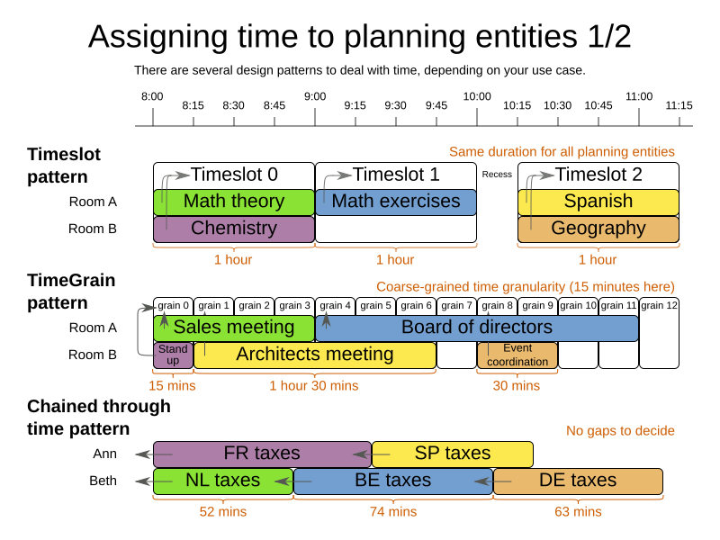

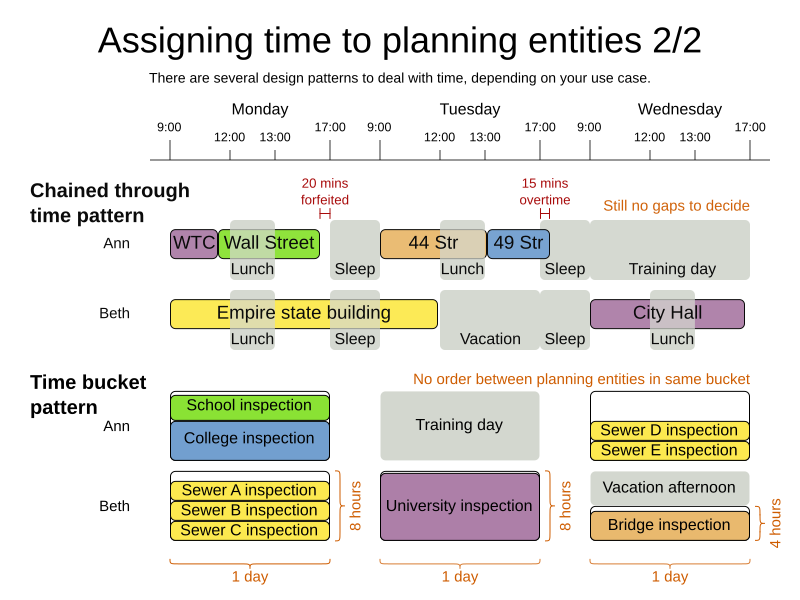

<a id="pdf-dest-25bce53bd491b78c"></a>

<a id="section-0150"></a>
#### 11.2.1. Timeslot pattern: assign to a fixed-length timeslot

If all planning entities have the same duration (or can be inflated to the same duration), the Timeslot pattern is useful. The planning entities are assigned to a timeslot rather than time. For example, in school timetabling, all lectures take one hour.

The timeslots can start at any time. For example, the timeslots start at 8:00, 9:00, 10:15 (after a 15-minute break), 11:15, … They can even overlap, but that is unusual.

It is also usable if all planning entities can be inflated to the same duration. For example, in Examination Timetabling, some exams take 90 minutes and others 120 minutes, but all timeslots are 120 minutes. When an exam of 90 minutes is assigned to a timeslot, for the remaining 30 minutes, its seats are occupied too and cannot be used by another exam.

Usually there is a second planning variable, for example the room. In course timetabling, two lectures are in conflict if they share the same room at the same timeslot. However, in exam timetabling, that is allowed, if there is enough seating capacity in the room (although mixed exam durations in the same room do inflict a soft score penalty).

<a id="pdf-dest-bd6aaf1b0340642e"></a>

<a id="section-0151"></a>
#### 11.2.2. TimeGrain pattern: assign to a starting TimeGrain

Assigning humans to start a meeting at four seconds after 9 o’clock is pointless because most human activities have a time granularity of five minutes or 15 minutes. Therefore it is not necessary to allow a planning entity to be assigned subsecond, second or even one minute accuracy. A granularity of 15 minutes, 1 hour or 1 day accuracy suffices for most use cases. The TimeGrain pattern models such time accuracy by partitioning time as time grains. For example, in Meeting Scheduling, all meetings start/end in hour, half hour, or 15-minute intervals before or after each hour, therefore the optimal settings for time grains is 15 minutes.

Each planning entity is assigned to a start time grain. The end time grain is calculated by adding the duration in grains to the starting time grain. Overlap of two entities is determined by comparing their start and end time grains.

The TimeGrain pattern doesn’t scale well. Especially with a finer time granularity (such as 1 minute) and a long planning window, the value range (and therefore [the search space](#pdf-dest-9fb07ae9f08d2d1c)) is too big to scale well. It’s recommended to use a coarse time granularity (such as 1 week, 1 day, 1 half day, …) or shorten the planning window size to scale. To resolve scaling issues, the [Time Bucket pattern](#pdf-dest-e152681284e06f18) is often a good alternative.

<a id="pdf-dest-9caffb354b601fcd"></a>

<a id="section-0152"></a>
#### 11.2.3. Chained through time pattern: assign in a chain that determines starting time

If a person or a machine continuously works on one task at a time in sequence, which means starting a task when the previous is finished (or with a deterministic delay), the Chained Through Time pattern is useful. For example, in [Vehicle routing with time windows](#pdf-dest-601e0ae9a75a4274), a vehicle drives from customer to customer (thus it handles one customer at a time).

The focus in this pattern is on deciding the order of a set of elements instead of assigning them to a specific date and time. However, the time coordinate of each element can be deduced from its position in the sequence. If the elements' position on time axis affects the score, use a [shadow](#pdf-dest-e83ce444356988fd) [variable](#pdf-dest-e83ce444356988fd) to calculate the time.

This pattern is implemented using the [planning list variable](#pdf-dest-fbc665f240838a05). The planning entity determines the starting time of the first element in its planning list variable. The second element’s starting time is calculated based on the starting time and duration of the first element. For example, in task assignment, Beth (the entity) starts working at 8:00, thus her first task starts at 8:00. It lasts 52 minutes, therefore her second task starts at 8:52. The starting time of an element is usually a [shadow variable](#pdf-dest-e83ce444356988fd).

<a id="pdf-dest-976a843e6cb6d799"></a>

11.2.3.1. Chained through time pattern: creating gaps

Between planning entities, there are three ways to create gaps:

- No gaps: This is common when the anchor is a machine. For example, a build server always starts the next job when the previous finishes, without a break.
- Only deterministic gaps: This is common for humans. For example, any task that crosses the 10:00 barrier gets an extra 15 minutes duration so the human can take a break.
  - A deterministic gap can be subjected to complex business logic. For example, a cross-continent truck driver needs to rest 15 minutes after two hours of driving (which may also occur during loading or unloading time at a customer location) and also needs to rest 10 hours after 14 hours of work.
- Planning variable gaps: This is uncommon, because that extra planning variable reduces

efficiency and scalability, (besides impacting the [search space](#pdf-dest-9fb07ae9f08d2d1c) too).

<a id="pdf-dest-ed6314809a91c722"></a>

11.2.3.2. Chained through time: automatic collapse

In some use case there is an overhead time for certain tasks, which can be shared by multiple tasks, if those are consecutively scheduled. Basically, the solver receives a discount if it combines those tasks.

For example when delivering pizza to two different customers, a food delivery service combines both deliveries into a single trip, if those two customers ordered from the same restaurant around the same time and live in the same part of the city.

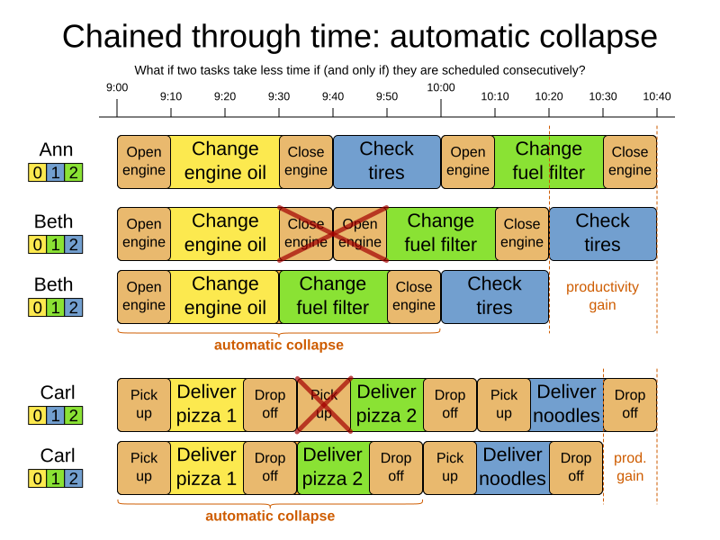

Implement the automatic collapse in the [shadow variables](#pdf-dest-e83ce444356988fd) that calculate the start and end times of each task.

<a id="pdf-dest-e50300f5a1d51544"></a>

11.2.3.3. Chained through time: automatic delay until last

Some tasks require more than one person to execute. In such cases, both employees need to be there at the same time, before the work can start.

For example when assembling furniture, assembling a bed is a two-person job.

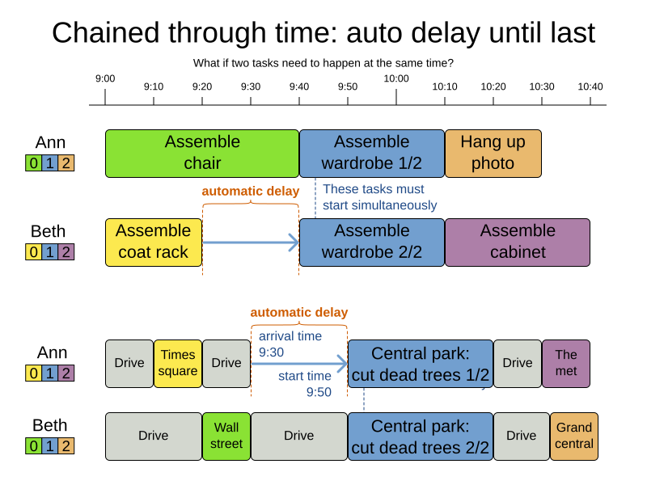

Implement the automatic delay in the [shadow variables](#pdf-dest-e83ce444356988fd) that calculates the arrival, start and end times of each task. Separate the arrival time from the start time. Additionally, add loop detection to avoid an infinite loop:

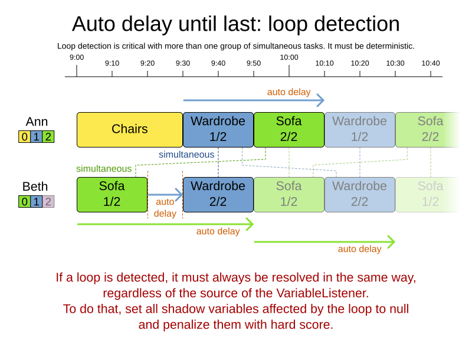

<a id="pdf-dest-e152681284e06f18"></a>

<a id="section-0153"></a>
#### 11.2.4. Time bucket pattern: assign to a capacitated bucket per time period

In this pattern, the time of each employee is divided into buckets. For example 1 bucket per week. Each bucket has a capacity, depending on the FTE (Full Time Equivalent), holidays and the approved vacation of the employee. For example, a bucket usually has 40 hours for a full time employee and 20 hours for a half time employee but only 8 hours on a specific week if the employee takes vacation the rest of that week.

Each task is assigned to a bucket, which determines the employee and the coarse-grained time period for working on it. The tasks within one bucket are not ordered: it’s up to the employee to decide the order. This gives the employee more autonomy, but makes it harder to do certain optimization, such as minimize travel time between task locations.

<a id="pdf-dest-a1f449063d6e03a2"></a>

<a id="section-0154"></a>
### 11.3. Overconstrained planning

Sometimes there are not enough resources to assign all planning entities. For example, there may be more shifts than available employees, or more deliveries than vehicles can handle in a day. This is called an overconstrained problem.

By default, Timefold Solver assigns every planning entity to a value, which means it will overload resources and break hard constraints rather than leave anything unassigned. The correct approach is to explicitly model the possibility of leaving entities unassigned.

<a id="pdf-dest-4c1278bd0e83049b"></a>

<a id="section-0155"></a>
#### 11.3.1. The recommended approach

There are two steps to handle overconstrained planning correctly:

1. Allow the planning variable to be unassigned.

2. Add a score constraint to penalize unassigned entities.

<a id="pdf-dest-9b0cbf39088e99bb"></a>

11.3.1.1. Step 1: Allow unassigned values

Set allowsUnassigned = true on the planning variable:

Java

```
@PlanningEntity
public class Shift {

    @PlanningVariable(allowsUnassigned = true)
    private Employee employee;

    ...
}
```

Timefold Solver automatically adds null to the value range. There is no need to add null to any ValueRangeProvider.

<a id="pdf-dest-da5dac155adc87e1"></a>

11.3.1.2. Step 2: Penalize unassigned entities

Add a score constraint at the appropriate level (usually medium, between hard and soft) to penalize each unassigned entity. Use [forEachIncludingUnassigned()](#pdf-dest-9369638902b37ea9) to include entities with a null planning variable, which are otherwise filtered out by default:

Java

```
private Constraint penalizeUnassignedShifts(ConstraintFactory factory) {
    return factory.forEachIncludingUnassigned(Shift.class)
            .filter(shift -> shift.getEmployee() == null)
            .penalize(HardMediumSoftScore.ONE_MEDIUM)
            .asConstraint("Unassigned shift");
}
```

Without this constraint, a solution with all entities unassigned scores better than

one with any hard constraint violations - because no assignments means no hard

constraint violations. Always penalize unassigned entities when using allowsUnassigned = true.

The solver will now only leave a shift unassigned when every possible assignment would cost more in hard or medium score than leaving it empty.

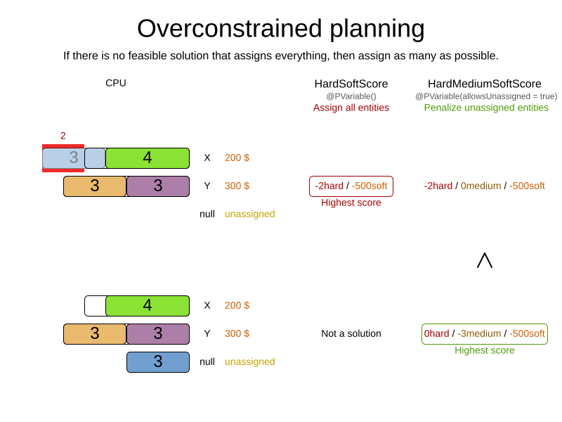

<a id="pdf-dest-78a0c5c48f8d3ab9"></a>

<a id="section-0156"></a>
#### 11.3.2. The dummy values antipattern

A common alternative is to introduce a "dummy" resource (e.g. a dummy employee or a dummy vehicle) to absorb the unassigned entities. The idea is that entities assigned to the dummy are effectively unassigned.

This approach appears to work at first, but causes a range of problems.

<a id="pdf-dest-2d1b474b4c977674"></a>

11.3.2.1. Hard constraints bleed onto the dummy

Real constraints (e.g. skill requirements, capacity limits, or working hour rules) now also apply to the dummy resource. Either the dummy violates them (corrupting the score), or you add != dummyEmployee guards to every constraint that touches that relationship. As the constraint set grows, these guards are easy to forget and hard to test.

<a id="pdf-dest-a90ddcb601b15f91"></a>

11.3.2.2. The search space grows unnecessarily

The solver treats the dummy resource as a valid assignment target like any other value. Entities are considered for assignment to the dummy even when a real assignment is available, which inflates the search space and slows down solving.

<a id="pdf-dest-3ec02c7e4326ce50"></a>

11.3.2.3. Solutions are harder to reason about

From the solver’s perspective, an entity assigned to the dummy is fully assigned. It takes extra application logic to distinguish "assigned to dummy" from "genuinely assigned", both in constraints and in the output of the solver.

<a id="pdf-dest-39e9d654a219f610"></a>

11.3.2.4. Use allowsUnassigned instead

The allowsUnassigned = true approach avoids all of these problems:

- null is treated as a first-class outcome, not a workaround.
- Constraints do not need to be aware of a dummy value.
- The search space is not inflated.
- Unassigned entities are unambiguous in the solution output.

<a id="pdf-dest-81c86ef2221e3377"></a>

<a id="section-0157"></a>
# Constraints and score

<a id="pdf-dest-a3d3e8a5607603eb"></a>

<a id="section-0158"></a>
## Chapter 12. Constraints and Score: Overview

<a id="pdf-dest-937b2401c20fa175"></a>

<a id="section-0159"></a>
### 12.1. Score terminology

<a id="pdf-dest-ad22e4f145089b60"></a>

<a id="section-0160"></a>
#### 12.1.1. What is a score?

Every @PlanningSolution class has a score. The score is an objective way to compare two solutions. The solution with the higher score is better. The Solver aims to find the solution with the highest Score of all possible solutions. The best solution is the solution with the highest Score that Solver has encountered during solving, which might be the optimal solution.

Timefold Solver cannot automatically know which solution is best for your business, so you need to tell it how to calculate the score of a given @PlanningSolution instance according to your business needs. If you forget or are unable to implement an important business constraint, the solution is probably useless:

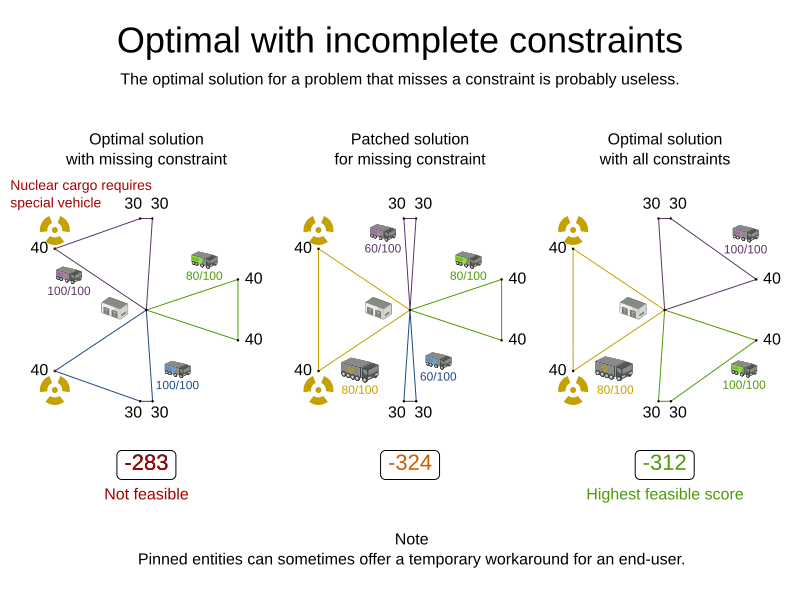

<a id="pdf-dest-597baea417f1ba6e"></a>

<a id="section-0161"></a>
#### 12.1.2. Formalize the business constraints

To implement a verbal business constraint, it needs to be formalized as a score constraint. Luckily, defining constraints in Timefold Solver is very flexible through the following score techniques: Score signum (positive or negative) Maximize or minimize a constraint type.

Score weight Put a cost/profit on a constraint type.

Score level (hard, soft, …) Prioritize a group of constraint types.

Pareto scoring (rarely used) Optimize multiple objectives without weighting them against each other.

Take the time to acquaint yourself with the first three techniques. Once you understand them, formalizing most business constraints becomes straightforward.

Do not presume that your business knows all its score constraints in advance.

Expect score constraints to be added, changed or removed after the first releases.

<a id="pdf-dest-519e4147431d036c"></a>

<a id="section-0162"></a>
#### 12.1.3. Score constraint signum (positive or negative)

All score techniques are based on constraints. A constraint can be a simple pattern (such as Maximize the apple harvest in the solution) or a more complex pattern. A positive constraint is a constraint you want to maximize. A negative constraint is a constraint you want to minimize

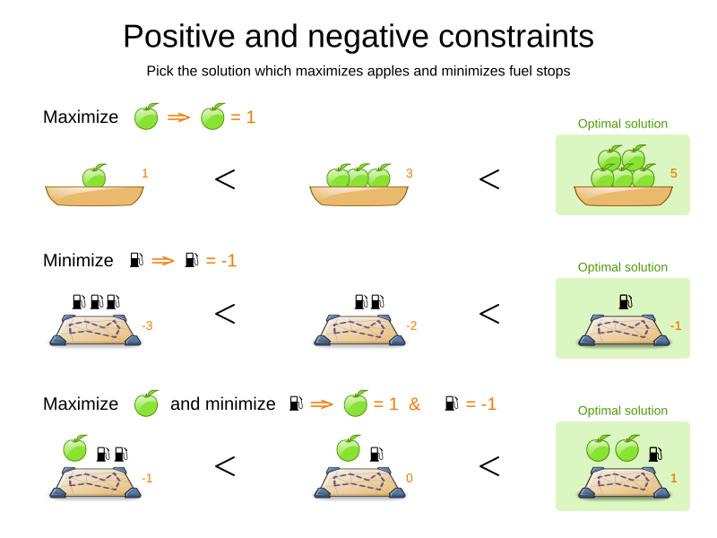

The image above illustrates that the optimal solution always has the highest score, regardless if the constraints are positive or negative.

Most planning problems have only negative constraints and therefore have a negative score. In that case, the score is the sum of the weight of the negative constraints being broken, with a perfect score of 0. For example, in vehicle routing, the score is the negative of the total distance driven by all vehicles.

Negative and positive constraints can be combined, even in the same score level.

When a constraint activates (because the negative constraint is broken or the positive constraint is fulfilled) on a certain planning entity set, it is called a constraint match.

<a id="pdf-dest-263ceb428fe9c7b6"></a>

<a id="section-0163"></a>
#### 12.1.4. Score constraint weight

Not all score constraints are equally important. If breaking one constraint is equally bad as breaking another constraint x times, then those two constraints have a different weight (but they are in the same score level). For example, in vehicle routing, you can make one unhappy driver constraint match count as much as two fuel tank usage constraint matches:

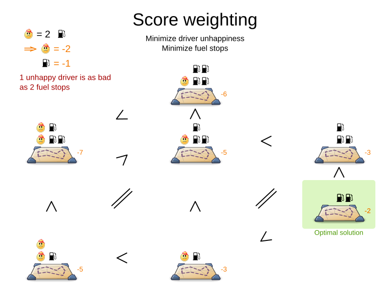

Score weighting is easy in use cases where you can put a price tag on everything. In that case, the positive constraints maximize revenue and the negative constraints minimize expenses, so together they maximize profit. Alternatively, score weighting is also often used to create social [fairness](#pdf-dest-cd47e2bb0d4a6f84). The weight of a constraint match can depend on the planning entities involved. For example, in vehicle routing, a weight of using an 18-wheeler truck to make the delivery will be higher than a weight of a delivery van, as the latter will be cheaper to run.

Putting a good weight on a constraint is often a difficult analytical decision, because it is about making choices and trade-offs against other constraints. Different stakeholders have different priorities. Don’t waste time with constraint weight discussions at the start of an implementation, instead add a [constraint configuration](#pdf-dest-601e0ae9a75a4274) and allow users to change them through a UI. A non-accurate weight is less damaging than mediocre algorithms:

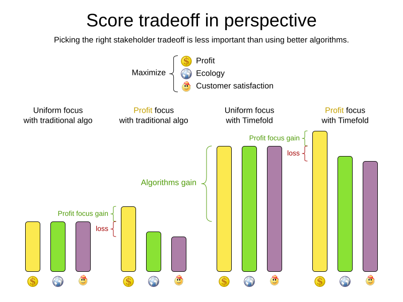

Most use cases use a Score with int weights, such as [HardSoftScore](#pdf-dest-9fb009e8d1e16dcb).

<a id="pdf-dest-219abeecbbbc28d1"></a>

<a id="section-0164"></a>
#### 12.1.5. Score constraint level (hard, soft, …)

Sometimes a score constraint outranks another score constraint, no matter how many times the latter is broken. In that case, those score constraints are in different levels. For example, an employee cannot do two shifts at the same time (due to the constraints of physical reality), so this outranks all employee happiness constraints.

Most use cases have only two score levels, hard and soft. The levels of two scores are compared lexicographically. The first score level gets compared first. If those differ, the remaining score levels are ignored. For example, a score that breaks 0 hard constraints and 1000000 soft constraints is better than a score that breaks 1 hard constraint and 0 soft constraints.

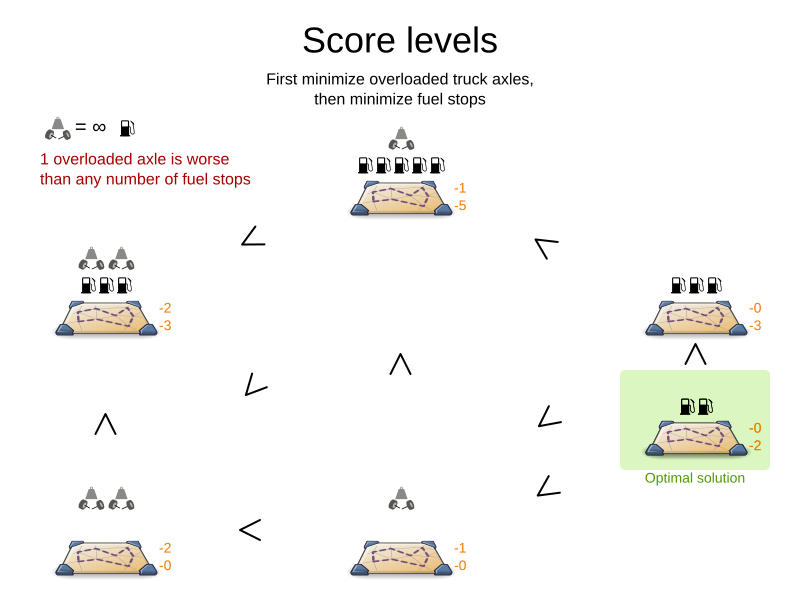

If there are two (or more) score levels, for example [HardSoftScore](#pdf-dest-9fb009e8d1e16dcb), then a score is feasible if no hard constraints are broken.

By default, Timefold Solver will always assign all planning variables a planning

value. If there is no feasible solution, this means the best solution will be

infeasible. To instead leave some of the planning entities unassigned, apply [overconstrained planning](#pdf-dest-a1f449063d6e03a2).

For each constraint, you need to pick a score level, a score weight and a score signum. For example: -1soft which has score level of soft, a weight of 1 and a negative signum. Do not use a big constraint weight when your business actually wants different score levels. That hack, known as score folding, is broken:

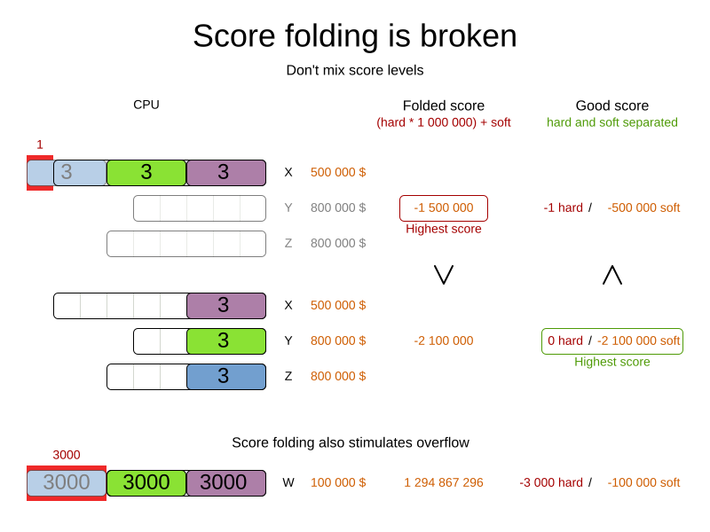

Your business might tell you that your hard constraints all have the same weight, because they cannot be broken (so the weight does not matter). This is not true because if no feasible solution exists for a specific dataset, the least infeasible solution allows the business to estimate how many business resources they are

lacking.

Furthermore, it will likely create a [score trap](#pdf-dest-7995da7c3d75ca6c). For example, in vehicle routing if a vehicle exceeds its capacity by 15 tons, it must be penalized three times as much as if it had only exceeded its capacity by five tons. (Possibly even exponentially weighted.)

Three or more score levels are also supported. For example: a company might decide that profit outranks employee satisfaction (or vice versa), while both are outranked by the constraints of physical reality.

To model fairness or load balancing, there is no need to use lots of score levels,

even though Timefold Solver can handle many score levels.

Most use cases use a Score with two or three weights, such as [HardSoftScore](#pdf-dest-9fb009e8d1e16dcb) and [HardMediumSoftScore](#pdf-dest-9c877a0505c029fe).

<a id="pdf-dest-7331bc9bbf44c3bc"></a>

<a id="section-0165"></a>
#### 12.1.6. Structural score

All Score implementations have an implicit [structural](#pdf-dest-7331bc9bbf44c3bc) component that outranks every score level. It is 0 if the solution is structurally sound and negative if the solution is structurally flawed. A solution is structurally flawed when some of its [shadow variables](#pdf-dest-e83ce444356988fd) form a dependency loop and cannot be calculated (see [Detecting Inconsistencies in Shadow Variables](#pdf-dest-e6e8d2d328abc0d5)).

Because the structural component is compared before every other level, a score with a negative structural component is worse than any score with a 0 structural component, no matter how many score constraints are broken. It therefore behaves like a super hard score level, and a score with a negative structural component is not [feasible](#pdf-dest-219abeecbbbc28d1).

During solving, the structural component is always 0, because Timefold Solver never accepts a structurally flawed solution. A negative structural component only appears on solutions that were modified outside of a solver step, such as a solution modified by a [custom phase](#pdf-dest-e58afaee859d157b) or a solution passed to Solver.solve(…).

When it is not 0, the structural component is printed as the leading structural level of the score string, for example -1structural/0hard/-5soft. When it is 0, it is omitted, so a structurally sound score is printed as usual, for example 0hard/-5soft.

<a id="pdf-dest-964d34e3649103ed"></a>

<a id="section-0166"></a>
#### 12.1.7. Pareto scoring (AKA multi-objective optimization scoring)

Far less common is the use case of pareto optimization, which is also known as multi-objective optimization. In pareto scoring, score constraints are in the same score level, yet they are not weighted against each other. When two scores are compared, each of the score constraints are compared individually and the score with the most dominating score constraints wins. Pareto scoring can even be combined with score levels and score constraint weighting.

Consider this example with positive constraints, where we want to get the most apples and oranges. Since it is impossible to compare apples and oranges, we cannot weigh them against each other. Yet, despite that we cannot compare them, we can state that two apples are better than one apple. Similarly, we can state that two apples and one orange are better than just one orange. So despite our inability to compare some Scores conclusively (at which point we declare them equal), we can find a set of optimal scores. Those are called pareto optimal.

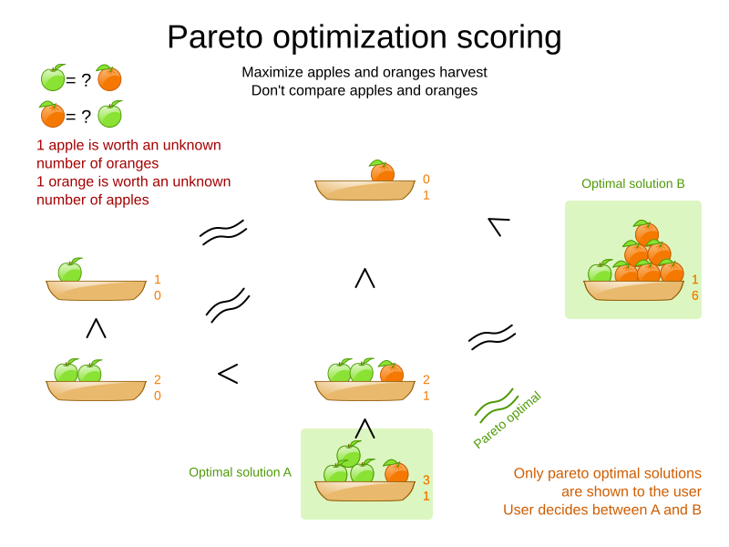

Scores are considered equal far more often. It is left up to a human to choose the better out of a set of best solutions (with equal scores) found by Timefold Solver. In the example above, the user must choose between solution A (three apples and one orange) and solution B (one apple and six oranges). It is guaranteed that Timefold Solver has not found another solution which has more apples or more oranges or even a better combination of both (such as two apples and three oranges).

Pareto scoring is currently not supported in Timefold Solver.

A pareto Score's compareTo method is not transitive because it does a pareto comparison. For example: having two apples is greater than one apple. One apple

is equal to One orange. Yet, two apples are not greater than one orange (but

actually equal). Pareto comparison violates the contract of the interface java.lang.Comparable's compareTo method, but Timefold Solver’s systems are pareto comparison safe, unless explicitly stated otherwise in this documentation.

<a id="pdf-dest-af12bb39e2677bea"></a>

<a id="section-0167"></a>
#### 12.1.8. Combining score techniques

All the score techniques mentioned above, can be combined seamlessly:

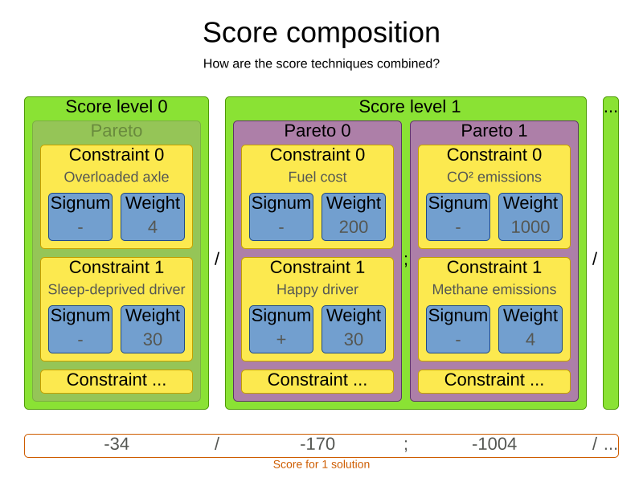

<a id="pdf-dest-adcd7ae617194d66"></a>

<a id="section-0168"></a>
#### 12.1.9. Score interface

A score is represented by the Score interface, which naturally extends Comparable:

Java

```
public interface Score<...> extends Comparable<...> {
    ...
}
```

The Score implementation to use depends on your use case. Your score might not efficiently fit in a single long value. Timefold Solver has several built-in Score implementations. Most use cases tend to use HardSoftScore.

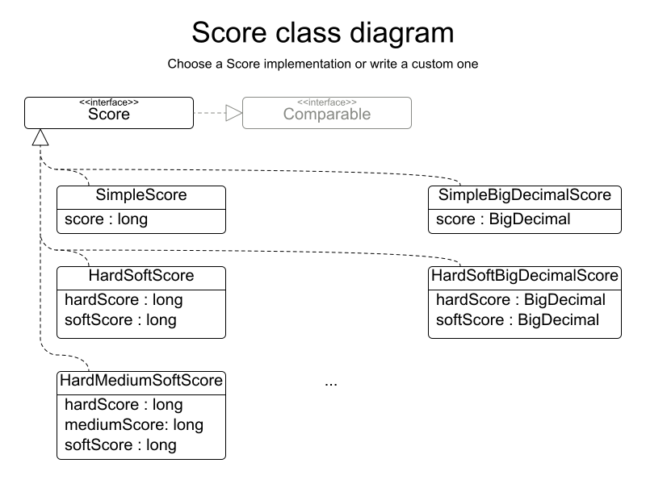

The Score implementation (for example HardSoftScore) must be the same throughout a Solver runtime. The Score implementation is configured in the solution domain class:

Java

```
@PlanningSolution
public class VehicleRoutePlan {
    ...

    @PlanningScore
    private HardSoftScore score;

}
```

<a id="pdf-dest-9c955ecac98f0af0"></a>

<a id="section-0169"></a>
#### 12.1.10. Avoid floating point numbers in score calculation

Avoid the use of float or double in score calculation. Use BigDecimal or scaled long instead.

Floating point numbers (float and double) cannot represent a decimal number correctly. For example: a double cannot hold the value 0.05 correctly. Instead, it holds the nearest representable value. Arithmetic (including addition and subtraction) with floating point numbers, especially for planning problems, leads to incorrect decisions:

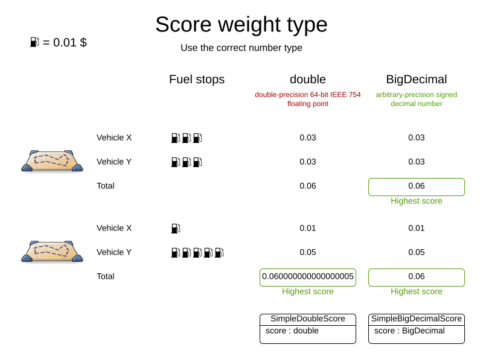

Additionally, floating point number addition is not associative:

Java

```
System.out.println( ((0.01 + 0.02) + 0.03) == (0.01 + (0.02 + 0.03)) ); //
returns false
```

This leads to score corruption.

Decimal numbers (BigDecimal) have none of these problems, but their arithmetic operations are slower than with int or long. In some cases, it can be worthwhile multiplying all constraint weights by the same power of ten, so the score fits in a scaled int or long. For example, if we multiply all weights by 1000, fuelCost of 0.07 becomes fuelCostMillis of 70 and no longer uses a decimal score weight.

<a id="pdf-dest-58137ea86011e483"></a>

<a id="section-0170"></a>
### 12.2. Choose a score type

Depending on the number of score levels and type of score weights you need, choose a Score type. Most use cases use a HardSoftScore.

To properly write a Score to a database (with JPA/Hibernate) or to XML/JSON (with

JAXB/Jackson), see [the integration chapter](running-timefold-solver/library/integration.pdf#integration).

<a id="pdf-dest-cc9c01243df9d61a"></a>

<a id="section-0171"></a>
#### 12.2.1. SimpleScore

A SimpleScore has a single long value, for example -123. It has a single score level.

Java

```
    @PlanningScore
    private SimpleScore score;
```

A variant score type SimpleBigDecimalScore uses a BigDecimal value instead of an long value.

<a id="pdf-dest-9fb009e8d1e16dcb"></a>

<a id="section-0172"></a>
#### 12.2.2. HardSoftScore (Recommended)

A HardSoftScore has a hard long value and a soft long value, for example -123hard/-456soft. It has two score levels (hard and soft).

Java

```
    @PlanningScore
    private HardSoftScore score;
```

A variant score type HardSoftBigDecimalScore uses BigDecimal values instead of long values.

<a id="pdf-dest-9c877a0505c029fe"></a>

<a id="section-0173"></a>
#### 12.2.3. HardMediumSoftScore

A HardMediumSoftScore which has a hard long value, a medium long value and a soft long value, for example -123hard/-456medium/-789soft. It has three score levels (hard, medium and soft). The hard level determines if the solution is feasible, and the medium level and soft level score values determine how well the solution meets business goals. Higher medium values take precedence over soft values irrespective of the soft value.

Java

```
    @PlanningScore
    private HardMediumSoftScore score;
```

A variant score type HardMediumSoftBigDecimalScore uses BigDecimal values instead of long values.

<a id="pdf-dest-5f50fe8ef6399f43"></a>

<a id="section-0174"></a>
#### 12.2.4. BendableScore

A BendableScore has a configurable number of score levels. It has an array of hard long values and an array of soft long values, for example with two hard levels and three soft levels, the score can be [-123/-456]hard/[-789/-012/-345]soft. In that case, it has five score levels. A solution is feasible if all hard levels are at least zero.

A BendableScore with one hard level and one soft level is equivalent to a HardSoftScore, while a BendableScore with one hard level and two soft levels is equivalent to a HardMediumSoftScore.

Java

```
    @PlanningScore(bendableHardLevelsSize = 2, bendableSoftLevelsSize = 3)
    private BendableScore score;
```

The number of hard and soft score levels need to be set at compilation time. It is not flexible to change during solving.

Do not use a BendableScore with seven levels just because you have seven constraints. It is extremely rare to use a different score level for each constraint, because that means one constraint match on soft 0 outweighs even a million

constraint matches of soft 1.

Usually, multiple constraints share the same level and are weighted against each other. Use [score explanations](#pdf-dest-601e0ae9a75a4274) to get the weight of individual constraints in the same level.

A variant score type BendableBigDecimalScore uses BigDecimal values instead of long values.

<a id="pdf-dest-6a72e974e9d60f5e"></a>

<a id="section-0175"></a>
### 12.3. Calculate the Score

<a id="pdf-dest-b41fce5dc638daa2"></a>

<a id="section-0176"></a>
#### 12.3.1. Score calculation types

There are several ways to calculate the Score of a solution:

[Constraint Streams API](#pdf-dest-601e0ae9a75a4274) Implement each constraint as a separate Constraint Stream. Fast and scalable.

[Incremental score calculator](#pdf-dest-d8e7743e38ee4cd8) Implement multiple low-level methods. Fast and scalable. Very difficult to implement and maintain. Supports [score explanations](#pdf-dest-601e0ae9a75a4274) with extra effort.

[Easy score calculator](#pdf-dest-e40119d43d01561c) (not recommended) Implement all constraints together in a single method. Does not scale. Does not support [score](#pdf-dest-601e0ae9a75a4274) [explanations](#pdf-dest-601e0ae9a75a4274).

Every score calculation type can work with any Score definition (such as HardSoftScore or HardMediumSoftScore). All score calculation types are object-oriented and can reuse existing Java code.

The score calculation must be deterministic and free of side-effects. It must not change the planning entities or the problem facts in any way. For example, it must not call a setter method on a planning entity in the score calculation.

Timefold Solver does not recalculate the score of a solution if it can predict it

(unless an environmentMode assertion is enabled). For example, after a winning

step is done, there is no need to calculate the score because that move was done and undone earlier. As a result, there is no guarantee that changes applied during score calculation actually happen.

To update planning entities when the planning variable change, use [shadow](#pdf-dest-e83ce444356988fd) [variables](#pdf-dest-e83ce444356988fd) instead.

<a id="pdf-dest-4d25901f9469bdae"></a>

<a id="section-0177"></a>
#### 12.3.2. InitializingScoreTrend

The InitializingScoreTrend specifies how the Score will change as more and more variables are initialized (while the already initialized variables do not change). Some optimization algorithms (such Construction Heuristics and Exhaustive Search) run faster if they have such information.

For the score (or each [score level](#pdf-dest-219abeecbbbc28d1) separately), specify a trend:

- ANY (default): Initializing an extra variable can change the score positively or negatively. Gives no performance gain.
- ONLY_UP (rare): Initializing an extra variable can only change the score positively. Implies that:
  - There are only positive constraints
  - And initializing the next variable cannot unmatch a positive constraint that was matched by a previous initialized variable.
- ONLY_DOWN: Initializing an extra variable can only change the score negatively. Implies that:
  - There are only negative constraints
  - And initializing the next variable cannot unmatch a negative constraint that was matched by a previous initialized variable.

Most use cases only have negative constraints. Many of those have an InitializingScoreTrend that only goes down:

```
<scoreDirectorFactory>
    <constraintProviderClass>...MyConstraintProvider</constraintProviderClass>
    <initializingScoreTrend>ONLY_DOWN</initializingScoreTrend>
</scoreDirectorFactory>
```

Alternatively, you can also specify the trend for each score level separately:

```
<scoreDirectorFactory>
    <constraintProviderClass>...MyConstraintProvider</constraintProviderClass>
    <initializingScoreTrend>ONLY_DOWN/ONLY_DOWN</initializingScoreTrend>
</scoreDirectorFactory>
```

<a id="pdf-dest-d16f56861c51fe35"></a>

<a id="section-0178"></a>
#### 12.3.3. Invalid score detection

When you put the [environmentMode](#pdf-dest-8c3966531f8dd74d) in FULL_ASSERT (or STEP_ASSERT), it will detect score corruption in the [incremental score calculation](#pdf-dest-061d4ebe0597a32e). However, that will not verify that your score calculator actually implements your score constraints as your business desires. For example, one constraint might consistently match the wrong pattern. To verify the constraints against an independent implementation, configure a assertionScoreDirectorFactory:

```
<environmentMode>STEP_ASSERT</environmentMode>
...
<scoreDirectorFactory>
    <constraintProviderClass>...ConstraintProvider</constraintProviderClass>
    <assertionScoreDirectorFactory>
    <easyScoreCalculatorClass>...EasyScoreCalculator</easyScoreCalculatorClass>
    </assertionScoreDirectorFactory>
</scoreDirectorFactory>
```

This way, the ConstraintProvider implementation is validated by the EasyScoreCalculator.

This works well to isolate score corruption, but to verify that the constraint implement the real business needs, [a unit test with a ConstraintVerifier](#pdf-dest-8a3eace709a88928) is usually better.

<a id="pdf-dest-ed877c5027f3dc19"></a>

<a id="section-0179"></a>
## Chapter 13. Score calculation

We could implement an [easy score calculator](#pdf-dest-e40119d43d01561c) that uses a functional approach:

Java

```
    private int doNotAssignAnn() {
        return schedule.getShifts().stream()
                .filter(Shift::isEmployeeAnn)
                .mapToInt(shift -> -1)
                .sum();
    }
```

However, that scales poorly because it doesn’t do an [incremental calculation](#pdf-dest-061d4ebe0597a32e): When the planning variable of a single Shift changes, to recalculate the score, the normal Streams API has to execute the entire stream from scratch.

<a id="pdf-dest-90641d67d73d7e7b"></a>

<a id="section-0180"></a>
### 13.1. Introducing Constraint Streams

Constraint streams are a functional programming form of incremental score calculation that is easy to read, write and debug. The API should feel familiar if you’re familiar with Java Streams or SQL.

The Constraint Streams API enables you to write similar code in a language of your choice, while reaping the performance benefits of incremental score calculation. This is an example of the same code we’ve shown above, only using the Constraint Streams API:

Java

```
    private Constraint doNotAssignAnn(ConstraintFactory factory) {
        return factory.forEach(Shift.class)
                .filter(Shift::isEmployeeAnn)
                .penalize(HardSoftScore.ONE_SOFT)
                .asConstraint("Don't assign Ann");
    }
```

This constraint stream iterates over all instances of class Shift in the [problem facts](#pdf-dest-8009ea799c9392b9) and planning ([source](#pdf-dest-bc2c57849b666a46)) [entities](#pdf-dest-bc2c57849b666a46) in the planning problem. It finds every Shift which is assigned to employee Ann and for ([source](#pdf-dest-377ca6bdb81ab0f0)) every such instance (also called a match), it adds a soft penalty of 1 to the overall [score](#pdf-dest-6a72e974e9d60f5e). The following figure illustrates this process on a problem with 4 different shifts:

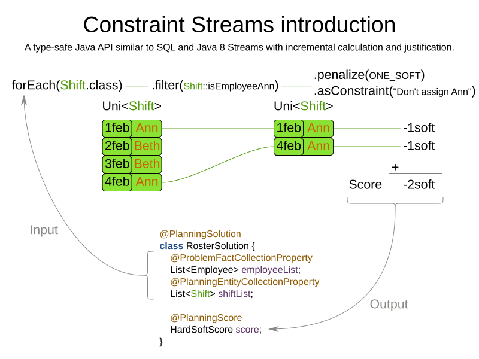

If any of the instances change during solving, the constraint stream automatically detects the change and only recalculates the minimum necessary portion of the problem that is affected by the change. The following figure illustrates this [incremental score calculation](#pdf-dest-061d4ebe0597a32e):

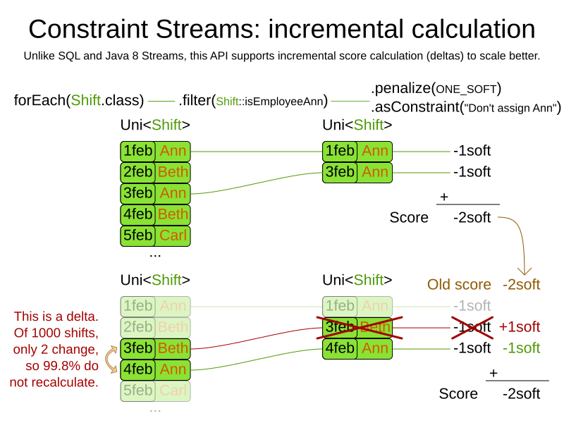

Constraint Streams API also has advanced support for [score explanation](#pdf-dest-601e0ae9a75a4274) through custom ([source](#pdf-dest-cfd80e084d6ed27c)) [justifications](#pdf-dest-cfd80e084d6ed27c).

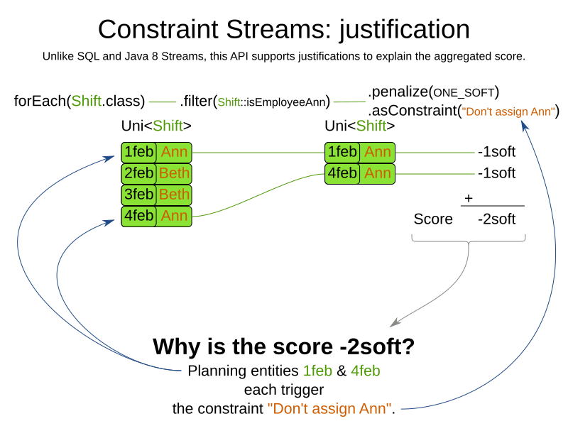

<a id="pdf-dest-4437db96bc1b68ec"></a>

<a id="section-0181"></a>
### 13.2. Creating a constraint stream

To use the Constraint Streams API in your project, first write a ConstraintProvider implementation similar to the following example.

Java

```
    public class MyConstraintProvider implements ConstraintProvider {

        @Override
        public Constraint[] defineConstraints(ConstraintFactory factory) {
            return new Constraint[] {
                    penalizeEveryShift(factory)
            };
        }

        private Constraint penalizeEveryShift(ConstraintFactory factory) {
            return factory.forEach(Shift.class)
                .penalize(HardSoftScore.ONE_SOFT)
                .asConstraint("Penalize a shift");
        }

    }
```

This example contains one constraint, penalizeEveryShift(…). However, you can

include as many as you require.

Add the following code to your solver configuration:

```
<solver xmlns="https://timefold.ai/xsd/solver" xmlns:xsi=
"http://www.w3.org/2001/XMLSchema-instance"
xsi:schemaLocation="https://timefold.ai/xsd/solver
https://timefold.ai/xsd/solver/solver.xsd">
    <scoreDirectorFactory>

<constraintProviderClass>org.acme.schooltimetabling.solver.TimetableConstraintProvider
</constraintProviderClass>
    </scoreDirectorFactory>
    ...
</solver>
```

<a id="pdf-dest-9e59ffae92dae01d"></a>

<a id="section-0182"></a>
### 13.3. Constraint stream cardinality

Constraint stream cardinality is a measure of how many objects a single constraint match consists of. The simplest constraint stream has a cardinality of 1, meaning each constraint match only consists of 1 object. Therefore, it is called a UniConstraintStream:

Java

```
    private Constraint doNotAssignAnn(ConstraintFactory factory) {
        return factory.forEach(Shift.class) // Returns UniStream<Shift>.
                ...
    }
```

Some constraint stream [building blocks](#pdf-dest-688ae56f1364f4b6) can increase stream cardinality, such as join or groupBy: ([source](#pdf-dest-63b21455ba6a01f8)) ([source](#pdf-dest-37387ba5be45b0b1))

Java

```
    private Constraint doNotAssignAnn(ConstraintFactory factory) {
        return factory.forEach(Shift.class) // Returns Uni<Shift>.
                .join(Employee.class) // Returns Bi<Shift, Employee>.
                .join(DayOff.class) // Returns Tri<Shift, Employee,
DayOff>.
                .join(Country.class) // Returns Quad<Shift, Employee,
DayOff, Country>.
                ...
    }
```

The latter can also decrease stream cardinality:

Java

```
    private Constraint doNotAssignAnn(ConstraintFactory factory) {
        return factory.forEach(Shift.class) // Returns
UniStream<Shift>.
                .join(Employee.class) // Returns
BiStream<Shift, Employee>.
                .groupBy((shift, employee) -> employee) // Returns
UniStream<Employee>.
                ...
    }
```

The following constraint stream cardinalities are currently supported:

| Cardinality | Prefix | Defining interface |
| --- | --- | --- |
| 1 | Uni | UniConstraintStream<A> |
| 2 | Bi | BiConstraintStream<A, B> |
| 3 | Tri | TriConstraintStream<A, B, C> |
| 4 | Quad | QuadConstraintStream<A, B, C, D> |

<a id="pdf-dest-87bad473e90e48a2"></a>

<a id="section-0183"></a>
#### 13.3.1. Achieving higher cardinalities

Timefold Solver currently does not support constraint stream cardinalities higher than 4. However, with [tuple mapping](#pdf-dest-e7cc619a87282f8c) effectively infinite cardinality is possible:

Java

```
    private Constraint pentaStreamExample(ConstraintFactory factory) {
        return factory.forEach(Shift.class) // UniConstraintStream<Shift>
                .join(Shift.class) // BiConstraintStream<Shift, Shift>
                .join(Shift.class) // TriConstraintStream<Shift,
Shift, Shift>
                .join(Shift.class) // QuadConstraintStream<Shift,
Shift, Shift, Shift>
                .map(MyTuple::of) //
UniConstraintStream<MyTuple<Shift, Shift, Shift, Shift>>
                .join(Shift.class) //
BiConstraintStream<MyTuple<Shift, Shift, Shift, Shift>, Shift>
                ... // This BiConstraintStream carries
5 Shift elements.
    }
```

Timefold Solver does not provide any tuple implementations out of the box. It’s

recommended to use one of the freely available 3rd party implementations.

Should a custom implementation be necessary, see [guidelines for mapping](#pdf-dest-a114c47429dfb8aa) [functions](#pdf-dest-a114c47429dfb8aa).

<a id="pdf-dest-688ae56f1364f4b6"></a>

<a id="section-0184"></a>
### 13.4. Building blocks

Constraint streams are chains of different operations, called building blocks. Each constraint stream starts with a forEach(…) building block and is terminated by either a penalty or a reward. The following example shows the simplest possible constraint stream:

Java

```
    private Constraint penalizeInitializedShifts(ConstraintFactory factory) {
        return factory.forEach(Shift.class)
                .penalize(HardSoftScore.ONE_SOFT)
                .asConstraint("Initialized shift");
    }
```

This constraint stream penalizes each known and initialized instance of Shift.

<a id="pdf-dest-9369638902b37ea9"></a>

<a id="section-0185"></a>
#### 13.4.1. ForEach

The .forEach(T) building block selects every T instance that is in a [problem fact collection](#pdf-dest-8009ea799c9392b9) or a [planning entity collection](#pdf-dest-1b22a5cac1014edb) that is consistent and has no null genuine planning variables. ([source](#pdf-dest-e6e8d2d328abc0d5))

To include instances with a null [genuine planning variable](#pdf-dest-6961175c48fffeac), or planning values not assigned to any [planning list variable](#pdf-dest-fbc665f240838a05), replace the forEach() building block by forEachIncludingUnassigned():

Java

```
    private Constraint penalizeAllConsistentShifts(ConstraintFactory factory) {
        return factory.forEachIncludingUnassigned(Shift.class)
                .penalize(HardSoftScore.ONE_SOFT)
                .asConstraint("A shift");
    }
```

To include inconsistent and unassigned instances, replace the forEach() building block by forEachUnfiltered():

Java

```
    private Constraint penalizeAllShifts(ConstraintFactory factory) {
        return factory.forEachUnfiltered(Shift.class)
                .penalize(HardSoftScore.ONE_SOFT)
                .asConstraint("A shift");
    }
```

In cases utilizing the [planning list variable](#pdf-dest-fbc665f240838a05), you may want to include an inverse relation shadow ([source](#pdf-dest-a779afde7c04367f)) [variable](#pdf-dest-a779afde7c04367f) to maximize performance of your constraints.

<a id="pdf-dest-5954bb07e8283641"></a>

<a id="section-0186"></a>
#### 13.4.2. Penalties and rewards

The purpose of constraint streams is to build up a [score](#pdf-dest-ad22e4f145089b60) for a solution. To do this, every constraint ([source](#pdf-dest-377ca6bdb81ab0f0)) stream must contain a call to either a penalize() or a reward() building block. The penalize() building block makes the score worse and the reward() building block improves the score. Each constraint stream is then terminated by calling asConstraint() method, which finally builds the constraint.

The Constraint Streams API supports many different types of penalties. Browse the API in your IDE for the full list of method overloads. Here are some examples:

- Simple penalty (penalize(SimpleScore.ONE)) makes the score worse by 1 per every match in the constraint stream. The score type must be the same type as used on the @PlanningScore annotated member on the planning solution.
- Dynamic penalty (penalize(SimpleScore.ONE, Shift::getHours)) makes the score worse by the number of hours in every matching Shift in the constraint stream. This is an example of using a constraint match weight.

By replacing the keyword penalize by reward in the name of these building blocks, you get operations that affect score in the opposite direction.

<a id="pdf-dest-f712b9364970c894"></a>

13.4.2.1. Anatomy of a constraint

Constraints have several components:

- Constraint ID is a short(ish) name for the constraint, which must be unique within the entire ConstraintProvider implementation. It is validated to not include most special characters.
- Constraint weight is a constant score value indicating how much every breach of the constraint affects the score. Valid examples include SimpleScore.ONE, HardSoftScore.ONE_HARD and HardMediumSoftScore.of(1, 2, 3). The penalty or reward score impact is the constraint weight multiplied by the match weight. The default value is 1.

Constraints with zero weight are automatically disabled and do not impose any

performance penalty.

<a id="pdf-dest-514012ed992499a5"></a>

13.4.2.1.1. Attaching metadata to constraints

asConstraint(String id) is a shorthand that creates a simple ConstraintMetadata carrying only the constraint ID. For richer metadata, implement the ConstraintMetadata interface and pass it to asConstraint(ConstraintMetadata): Java

```
    public record MyConstraintMetadata(String id, String displayName)
implements ConstraintMetadata {
    }

    private Constraint penalizeEveryShift(ConstraintFactory factory) {
        return factory.forEach(Shift.class)
                .penalize(HardSoftScore.ONE_SOFT)
                .asConstraint(new MyConstraintMetadata("penalizeEveryShift",
"Penalize every shift"));
    }
```

The ID is snapshotted at build time via ConstraintMetadata#id(); any subsequent mutation of the ID does not affect the constraint’s identity. The full metadata are accessible at runtime via Constraint#getConstraintMetadata().

<a id="pdf-dest-cfd80e084d6ed27c"></a>

13.4.2.2. Customizing justifications

One of important Timefold Solver features is its ability to [explain the score](#pdf-dest-601e0ae9a75a4274) of solutions it produced through the use of justifications. By default, each constraint is justified with ai.timefold.solver.core.api.score.stream.DefaultConstraintJustification, and the final tuple makes up the indicted objects. For example, in the following constraint, the indicted objects will be of type Vehicle and an Integer:

Java

```
    protected Constraint vehicleCapacity(ConstraintFactory factory) {
        return factory.forEach(Customer.class)
                .filter(customer -> customer.getVehicle() != null)
                .groupBy(Customer::getVehicle, sum(Customer::getDemand))
                .filter((vehicle, demand) -> demand > vehicle.getCapacity())
                .penalizeLong(HardSoftScore.ONE_HARD,
                        (vehicle, demand) -> demand - vehicle.getCapacity())
                .asConstraint("vehicleCapacity");
    }
```

To present the constraint matches to the user or to send them over the wire where they can be further processed, use the justifyWith(…) method to provide a custom constraint justification:

Java

```
    protected Constraint vehicleCapacity(ConstraintFactory factory) {
        return factory.forEach(Customer.class)
                .filter(customer -> customer.getVehicle() != null)
                .groupBy(Customer::getVehicle, sum(Customer::getDemand))
                .filter((vehicle, demand) -> demand > vehicle.getCapacity())
                .penalizeLong(HardSoftScore.ONE_HARD,
                        (vehicle, demand) -> demand - vehicle.getCapacity())
                .justifyWith((vehicle, demand, score) ->
                    new VehicleDemandOveruse(vehicle, demand, score))
                .asConstraint("vehicleCapacity");
    }
```

VehicleDemandOveruse is a custom type you have to implement. You have complete control over the type, its name or methods exposed. If you choose to decorate it with the proper annotations, you will be able to send it over HTTP or store it in a database. The only limitation is that it must implement the ai.timefold.solver.core.api.score.stream.ConstraintJustification marker interface.

<a id="pdf-dest-9021b5644271e7fe"></a>

<a id="section-0187"></a>
#### 13.4.3. Filtering

Filtering enables you to reduce the number of constraint matches in your stream. It first enumerates all constraint matches and then applies a predicate to filter some matches out. The predicate is a function that only returns true if the match is to continue in the stream. The following constraint stream removes all of Beth’s shifts from all Shift matches:

Java

```
    private Constraint penalizeAnnShifts(ConstraintFactory factory) {
        return factory.forEach(Shift.class)
                .filter(shift -> shift.getEmployeeName().equals("Ann"))
                .penalize(SimpleScore.ONE)
                .asConstraint("Ann's shift");
    }
```

The following example retrieves a list of shifts where an employee has asked for a day off from a bi-constraint match of Shift and DayOff:

Java

```
    private Constraint penalizeShiftsOnOffDays(ConstraintFactory factory) {
        return factory.forEach(Shift.class)
                .join(DayOff.class)
                .filter((shift, dayOff) -> shift.date == dayOff.date && shift
.employee == dayOff.employee)
                .penalize(SimpleScore.ONE)
                .asConstraint("Shift on an off-day");
    }
```

The following figure illustrates both these examples:

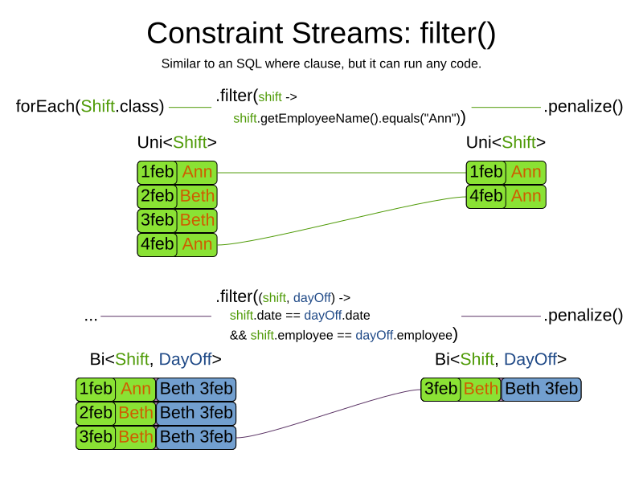

For performance reasons, using the [join](#pdf-dest-63b21455ba6a01f8) building block with the appropriate Joiner

is preferrable when possible. Using a Joiner creates only the constraint matches

that are necessary, while filtered join creates all possible constraint matches and only then filters some of them out.

The following functions are required for filtering constraint streams of different cardinality:

| Cardinality | Filtering Predicate |
| --- | --- |
| 1 | java.util.function.Predicate<A> |
| 2 | java.util.function.BiPredicate<A, B> |
| 3 | ai.timefold.solver.core.api.function.TriPredicate<A, B, C> |
| 4 | ai.timefold.solver.core.api.function.QuadPredicate<A, B, C, D> |

<a id="pdf-dest-63b21455ba6a01f8"></a>

<a id="section-0188"></a>
#### 13.4.4. Joining

Joining is a way to increase [stream cardinality](#pdf-dest-9e59ffae92dae01d) and it is similar to the inner join operation in SQL. As the following figure illustrates, a join() creates a cartesian product of the streams being joined:

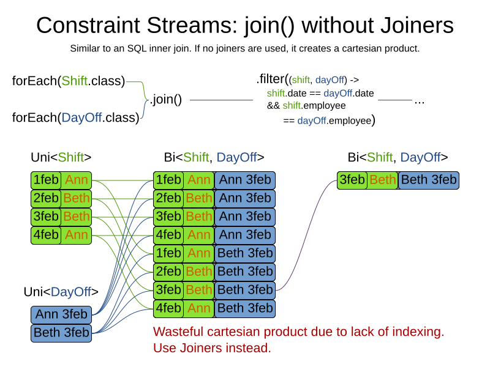

Doing this is inefficient if the resulting stream contains a lot of constraint matches that need to be filtered out immediately.

Instead, use a Joiner condition to restrict the joined matches only to those that are interesting:

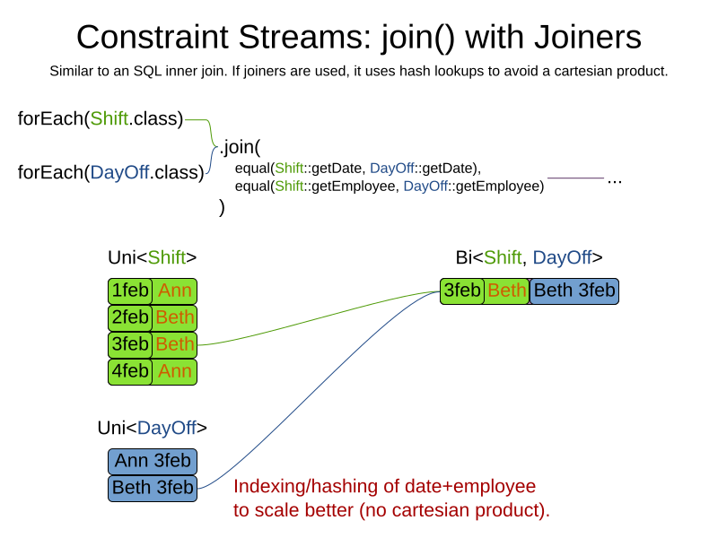

For example:

Java

```
    import static ai.timefold.solver.core.api.score.stream.Joiners.*;

    ...

    private Constraint shiftOnDayOff(ConstraintFactory constraintFactory) {
        return constraintFactory.forEach(Shift.class)
                .join(DayOff.class,
                    equal(Shift::getDate, DayOff::getDate),
                    equal(Shift::getEmployee, DayOff::getEmployee))
                .penalize(HardSoftScore.ONE_HARD)
                .asConstraint("Shift on an off-day");
    }
```

Through the Joiners class, the following Joiner conditions are supported to join two streams, pairing a match from each side:

- equal(): the paired matches have a property that are equals(). This relies on hashCode().
- greaterThan(), greaterThanOrEqual(), lessThan() and lessThanOrEqual(): the paired matches have

a Comparable property following the prescribed ordering.

- overlapping(): the paired matches have two properties (a start and an end property) of the same Comparable type that both represent an interval which overlap.
- containing(): the match on the left is a collection containing the match on the right.
- containedIn(): the match on the right is a collection containing the match on the left.
- containingAnyOf(): the collections on both sides have at least one element in common.

All Joiners methods have an overloaded method to use the same property of the same class on both stream sides. For example, calling equal(Shift::getEmployee) is the same as calling equal(Shift::getEmployee, Shift::getEmployee).

If the other stream might match multiple times, but it must only impact the score once (for each element of the original stream), use [ifExists](#pdf-dest-ba6f21a3948a0385) instead. It does not create cartesian products and therefore generally performs better.

<a id="pdf-dest-ee57893a11929c6d"></a>

13.4.4.1. Evaluation of multiple joiners

When using multiple joiners, there are some important considerations to keep in mind. Consider the following example:

Java

```
    factory.forEach(VehicleShift.class)
        .join(Visit.class,
            Joiners.equal(Function.identity(), Visit::getVehicleShift), //
Visit's VehicleShift is not null...
            Joiners.lessThan(
                    vehicleShift -> vehicleShift.getMaxTravelTime(),
                    visit -> visit.getVehicleShift().getMaxTravelTime() // ...
yet NPE may be thrown here.
            ))
```

When indexing joiners (such as equal() and lessThan()) check their indexes, they take the input tuple and create a set of keys that will enter the index. These keys are different for the left and right side of the joiner.

In the above example, from the left side, the key is [VehicleShift instance && result of calling VehicleShift.getMaxTravelTime()]. (Using the first mapping function of each joiner.) From the right side, the key is [the result of calling Visit.getVehicleShift() && result of calling Visit.getVehicleShift().getMaxTravelTime()]. (Using the second mapping function of each joiner.)

However, both of the key mapping functions are calculated independently of the other, and therefore the lessThan() joiner’s mapping functions will be executed even in cases when the equal() joiner would not match. This leads to a NullPointerException being thrown in the example above, where the lessThan() joiner’s mapping functions are executed on a Visit instance that has a null vehicleShift property which wasn’t (yet) filtered out by the equal() joiner. The filtering only happens inside the joiner’s indexes and to access them, we need these keys to be generated first.

To avoid these issues, do not assume that subsequent joiners' mapping functions only apply after the previous joiners have matched. Alternatively (and possibly at the cost of reduced performance) use the filtering joiner, which is processed differently and does not suffer from this issue:

Java

```
    factory.forEach(VehicleShift.class)
        .join(Visit.class,
            Joiners.equal(Function.identity(), Visit::getVehicleShift), //
Visit's VehicleShift is not null...
            Joiners.filtering((vehicleShift, visit) ->
                vehicleShift.getMaxTravelTime() < visit.getVehicleShift()
.getMaxTravelTime()
        ))
```

<a id="pdf-dest-0619d4f8eb42104e"></a>

13.4.4.2. Performance considerations

It is tempting to replace filters with joiners where applicable, expecting better performance. However, that is not always the case. Joiners bring overhead of maintaining indexes, and if the joiner does not significantly reduce the number of matches, this overhead will outweigh the benefits.

For small datasets, filters are often faster than joiners. Some of the more advanced joiners may require very large datasets to outperform filters.

When it comes to performance, we recommend you follow these guidelines:

- Do not optimize prematurely. First implement the constraint in the most readable way.
- Do not make assumptions about performance, measure it instead. Performance characteristics of any API may not be what you expect, and they may change between Timefold Solver versions as we constantly improve our technology.
- Use [constraint profiling](#pdf-dest-7e174e93607c8474) to find the most expensive constraint, and optimize it first. Then repeat until you reach satisfactory performance.

In order to maximize performance, the order of evaluation of indexes will not be

the same as the order of joiners in the code. Typically, all equal() joiners are

combined into one key and evaluated first, followed by the rest of the indexing joiners and finally the filtering joiners.

<a id="pdf-dest-37387ba5be45b0b1"></a>

<a id="section-0189"></a>
#### 13.4.5. Grouping and collectors

Grouping collects items in a stream according to user-provider criteria (also called "group key"), similar to what a GROUP BY SQL clause does. Additionally, some grouping operations also accept one or more Collector instances, which provide various aggregation functions. The following figure illustrates a simple groupBy() operation:

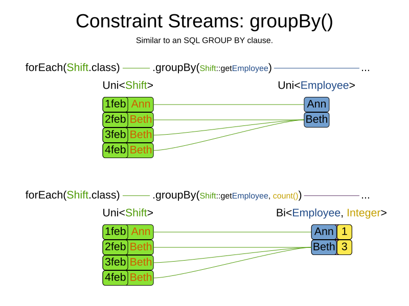

Objects used as group key must obey the [general contract of](https://docs.oracle.com/en/java/javase/21/docs/api/java.base/java/lang/Object.html#hashCode()) hashCode. Most importantly, "whenever it is invoked on the same object more than once during an execution of a Java application, the hashCode method must consistently return the same integer."

For this reason, it is not recommended to use mutable objects (especially mutable collections) as group keys. If planning entities are used as group keys, their hashCode must not be computed off of planning variables. Failure to follow this recommendation may result in runtime exceptions being thrown.

For example, the following code snippet first groups all visits by the vehicle that will be used, counts them using the ConstraintCollectors.count(…) collector, and finally penalizes every vehicle which makes more than 10 visits:

Java

```
import static ai.timefold.solver.core.api.score.stream.ConstraintCollectors.*;

...

private Constraint tooManyVisits(ConstraintFactory constraintFactory) {
    return constraintFactory.forEach(Visit.class)
            .groupBy(Visit::getVehicle, count())
            .filter((vehicle, visitCount) -> visitCount > 10)
            .penalize(HardSoftScore.ONE_HARD,
                    (vehicle, visitCount) -> visitCount - 10)
            .asConstraint("tooManyVisits");
}
```

Information might be lost during grouping. In the previous example, filter() and

all later operations no longer have direct access to the original Visit instance.

There are many collectors available out of the box. You can also provide your own collectors by implementing the ai.timefold.solver.core.api.score.stream.uni.UniConstraintCollector interface, or its Bi…, Tri… and Quad… counterparts.

<a id="pdf-dest-da75cecdf8650c4e"></a>

13.4.5.1. count() collector

The ConstraintCollectors.count(…) counts all elements per group. For example, the following use of the collector gives a number of items for two separate groups - one where the talks have unavailable speakers, and one where they don’t.

Java

```
private Constraint speakerAvailability(ConstraintFactory factory) {
    return factory.forEach(Talk.class)
            .groupBy(Talk::hasAnyUnavailableSpeaker, count())
            .penalize(HardSoftScore.ONE_HARD,
                    (hasUnavailableSpeaker, count) -> ...)
            .asConstraint("speakerAvailability");
}
```

The count is collected in a long. To count a bi, tri or quad stream, use countBi(), countTri() or countQuad() respectively, because - unlike the other built-in collectors - they aren’t overloaded methods due to Java’s generics erasure.

<a id="pdf-dest-8aefa2cfb4231286"></a>

13.4.5.2. countDistinct() collector

The ConstraintCollectors.countDistinct(…) counts any element per group once, regardless of how many times it occurs. For example, the following use of the collector gives a number of talks in each unique room.

Java

```
private Constraint roomCount(ConstraintFactory factory) {
    return factory.forEach(Talk.class)
            .groupBy(Talk::getRoom, countDistinct())
            .penalize(HardSoftScore.ONE_SOFT,
                    (room, count) -> ...)
            .asConstraint("roomCount");
}
```

The distinct count is collected in a long.

<a id="pdf-dest-3d6a3718957fa6ea"></a>

13.4.5.3. sum() collector

To sum the values of a particular property of all elements per group, use the ConstraintCollectors.sum(…) collector. The following code snippet first groups all visits by the vehicle that will be used, and sums up all the service durations using the ConstraintCollectors.sum(…) collector.

Java

```
private Constraint totalServiceDuration(ConstraintFactory constraintFactory) {
    return constraintFactory.forEach(Visit.class)
            .groupBy(Visit::getVehicle, sum(Visit::getServiceDuration))
            .penalize(HardSoftScore.ONE_SOFT,
                    (vehicle, totalServiceDuration) -> totalServiceDuration)
            .asConstraint("totalServiceDuration");
}
```

The sum is collected in a long. Other variants of this collector:

- sumBigDecimal() collects a java.math.BigDecimal value.
- sumBigInteger() collects a java.math.BigInteger value.
- sumDuration() collects a java.time.Duration value.
- sumPeriod() collects a java.time.Period value.
- a generic sum() variant for summing up custom types

<a id="pdf-dest-dfa96b75c7375fd1"></a>

13.4.5.4. average() collector

To calculate the average of a particular property of all elements per group, use the ConstraintCollectors.average(…) collector. The following code snippet first groups all visits by the vehicle that will be used, and averages all the service durations using the ConstraintCollectors.average(…) collector.

Java

```
private Constraint averageServiceDuration(ConstraintFactory constraintFactory)
{
    return constraintFactory.forEach(Visit.class)
            .groupBy(Visit::getVehicle, average(Visit::getServiceDuration))
            .penalize(HardSoftScore.ONE_SOFT,
                    (vehicle, averageServiceDuration) -> (int)
averageServiceDuration)
            .asConstraint("averageServiceDuration");
}
```

The average is collected as a double, and the average of no elements is null. Other variants of this collector:

- averageBigDecimal() collects a java.math.BigDecimal value, resulting in a BigDecimal average.
- averageBigInteger() collects a java.math.BigInteger value, resulting in a BigDecimal average.
- averageDuration() collects a java.time.Duration value, resulting in a Duration average.

<a id="pdf-dest-e8735fe86156ff0b"></a>

13.4.5.5. min() and max() collectors

To extract the minimum or maximum per group, use the ConstraintCollectors.min(…) and ConstraintCollectors.max(…) collectors respectively.

These collectors operate on values of properties which are Comparable (such as Integer, String or Duration), although there are also variants of these collectors which allow you to provide your own Comparator.

The following code snippet first groups all visits by the vehicle that will be used, and finds the maximum in the group using the ConstraintCollectors.max(…) collector.

Java

```
private Constraint maxServiceDuration(ConstraintFactory constraintFactory) {
    return constraintFactory.forEach(Visit.class)
            .groupBy(Visit::getVehicle, max(Visit::getServiceDuration))
            .penalize(HardSoftScore.ONE_SOFT,
                    (vehicle, maxServiceDuration) -> maxServiceDuration)
            .asConstraint("maxServiceDuration");
}
```

Comparator and Comparable implementations used with min(…) and max(…) constraint collectors are expected to be consistent with equals(…). See [Javadoc for](https://docs.oracle.com/en/java/javase/11/docs/api/java.base/java/lang/Comparable.html) [Comparable](https://docs.oracle.com/en/java/javase/11/docs/api/java.base/java/lang/Comparable.html) to learn more.

<a id="pdf-dest-70d118cadf085edf"></a>

13.4.5.6. toList(), toSet() and toMap() collectors

To extract all elements per group into a collection, use the ConstraintCollectors.toList(…).

The following example retrieves all visits for a given vehicle in a List:

Java

```
private Constraint vehicleAndItsVisits(ConstraintFactory constraintFactory) {
    return constraintFactory.forEach(Visit.class)
            .groupBy(Visit::getVehicle, toList())
            .penalize(HardSoftScore.ONE_HARD,
                    (vehicle, visitList) -> ...)
            .asConstraint("vehicleAndItsVisits");
}
```

Variants of this collector:

- toList() collects a List value.
- toSet() collects a Set value.
- toSortedSet() collects a SortedSet value.
- toMap() collects a Map value.
- toSortedMap() collects a SortedMap value.

The iteration order of elements in the resulting collection is not guaranteed to be

stable, unless it is a sorted collector such as toSortedSet or toSortedMap.

Collecting elements into a Collection negates benefits of [incremental score](#pdf-dest-061d4ebe0597a32e) [calculation](#pdf-dest-061d4ebe0597a32e), as all operations on the resulting Collection will no longer be incremental. If performance is a concern, avoid these collectors.

<a id="pdf-dest-b5e8d619c714557f"></a>

13.4.5.7. Consecutive collectors

Certain constraints, such as maximum consecutive working days for an employee or the number of matches played at home in a sports league, require ordering those shifts or matches in sequences and penalizing sequences exceeding a certain threshold. If those sequences can be of arbitrary length unknown at the time of writing the constraints, you can implement this pattern using the ConstraintCollectors.toConsecutiveSequences(…) collector:

Java

```
Constraint multipleConsecutiveHomeMatches(ConstraintFactory constraintFactory)
{
        return constraintFactory.forEach(Match.class)
                .groupBy(match -> Match::getHomeTeam,
                        ConstraintCollectors.toConsecutiveSequences(Match:
:getRoundId))
                .flattenLast(SequenceChain::getConsecutiveSequences)
                .filter((team, matches) -> matches.getCount() >=
MAX_CONSECUTIVE_MATCHES)
                .penalize(HardSoftScore.ONE_HARD, (team, matches) -> matches
.getCount())
                .asConstraint("4 or more consecutive home matches");
}
```

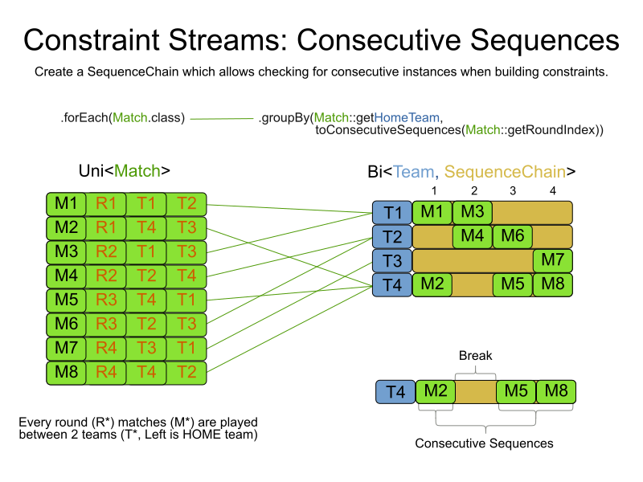

Let’s take a closer look at the crucial part of this constraint:

Java

```
.groupBy(match -> Match::getHomeTeam,
        ConstraintCollectors.toConsecutiveSequences(Match::getRoundId))
.flattenLast(SequenceChain::getConsecutiveSequences)
.filter((team, matches) -> matches.getCount() >= MAX_CONSECUTIVE_MATCHES)
```

The groupBy() building block groups all matches by team, and for every such pair it creates a SequenceChain instance. The matches will be put into sequence by round date, and the round index will be used to identify consecutive sequences and breaks between them. Imagine the collector putting each match on a number line, where the number is the round day index of the match.

The SequenceChain then has several useful methods to not only get the list of matches, but also to get any and all breaks between those matches. In this case, we are only interested in the sequences of matches themselves, and we use [flattening](#pdf-dest-6117b738a9c519d3) to convert each to its own tuple.

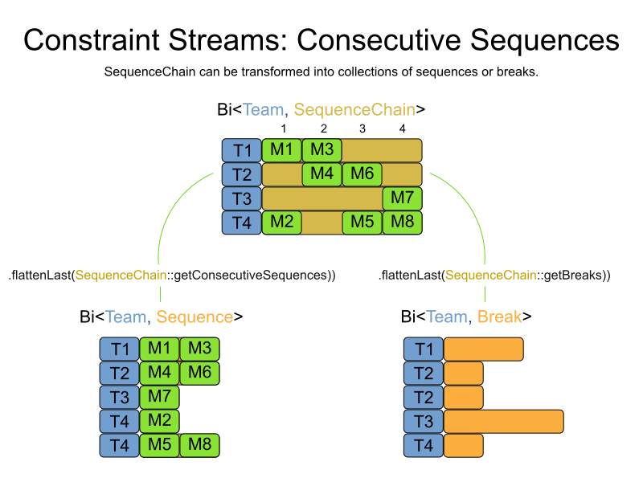

Finally, if a league requires that a team can play at most 5 consecutive matches (MAX_CONSECUTIVE_MATCHES) in home, and matches contains 6 matches, then the weight penalty will be 6. If the number of consecutive matches is 4, then the sequence is not violating the league requirement, and we can filter it out.

<a id="pdf-dest-83778e702c41127e"></a>

13.4.5.8. Connected ranges collectors

Certain constraints require tracking properties of connected ranges. For instance, to ensure equipment allocated to several timeslots across the same connected range is not allocated over its capacity. This can be achieved using the ConstraintCollectors.toConnectedTemporalRanges(…) or ConstraintCollectors.toConnectedRanges(…) (for non-temporal cases) collectors:

Java

```
Constraint doNotOverAssignEquipment(ConstraintFactory constraintFactory) {
    return constraintFactory.forEach(Job.class)
        .groupBy(Job::getEquipment,
            ConstraintCollectors.toConnectedTemporalRanges(
                            Job::getStartTime,
                            Job::getEndTime)
            )
        .flattenLast(ConnectedRangeChain::getConnectedRanges)
        .filter((equipment, connectedRange) -> connectedRange.
getMaximumOverlap() > equipment.getCapacity())
        .penalize(HardSoftScore.ONE_HARD, (equipment, connectedRange) ->
connectedRange.getMaximumOverlap() - equipment.getCapacity())
        .asConstraint("Concurrent equipment usage over capacity");
}
```

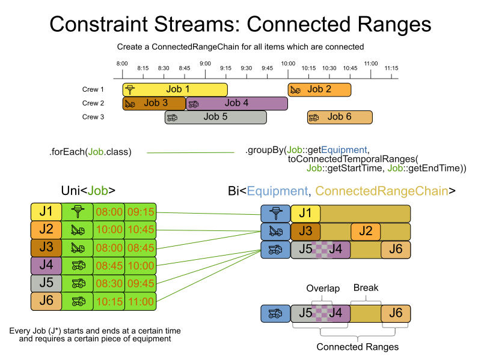

Let’s take a closer look at the crucial part of this constraint:

Java

```
.groupBy(Job::getEquipment,
        ConstraintCollectors.toConnectedTemporalRanges(
                    Job::getStartTime,
                    Job::getEndTime
        )
)
.flattenLast(ConnectedRangeChain::getConnectedRanges)
.filter((equipment, connectedRange) -> connectedRange.getMaximumOverlap() >
equipment.getCapacity())
```

The groupBy() building block groups all jobs by required equipment, and for every such pair it creates a ConnectedRangeChain instance. Any overlapping jobs will be put into the same ConnectedRange cluster.

The ConnectedRangeChain then has several useful methods to not only get the list of resource usage, but also to get any and all gaps between resource usage. In this case, we are only interested in the resource usage, and we use [flattening](#pdf-dest-6117b738a9c519d3) to convert each to its own tuple.

Finally, we use [mapping](#pdf-dest-e7cc619a87282f8c) to calculate the violation amount for each concurrent usage. For example, if the equipment has a capacity of 3, and the maximumOverlap of the resource is 5, then violationAmount will be 2. If the amount is 0, then the equipment is not being used over its capacity and we can filter the tuple out.

In case no temporal data is available, it’s still possible to create connected ranges using the ConstraintCollectors.toConnectedRanges(…) collector. In this case the start and end of a range needs to be provided as well as a function to calculate the difference between the two.

Java

```
.groupBy(Job::getEquipment,
    ConstraintCollectors.toConnectedRanges(
                            Job::getStart,
                            Job::getEnd,
                            (a, b) -> b - a // difference calculator
    )
)
```

<a id="pdf-dest-eeda97038aab4a3a"></a>

13.4.5.9. Load balancing collectors

Certain constraints require resource usage to be balanced across the solution. For example, employees should have a similar number of shifts. This can be achieved using the ConstraintCollectors.loadBalance(…) collector.

For more, see [Load balancing and fairness](#pdf-dest-cd47e2bb0d4a6f84).

<a id="pdf-dest-219f3992347dbbb1"></a>

13.4.5.10. Conditional collectors

The constraint collector framework enables you to create constraint collectors which will only collect in certain circumstances. This is achieved using the ConstraintCollectors.conditionally(…) constraint collector.

This collector accepts a predicate, and another collector to which it will delegate if the predicate is true. The following example returns a count of long-running visits with assigned to a given vehicle, where the customer asked for evening delivery:

Java

```
private Constraint visitWithEveningDelivery(ConstraintFactory
constraintFactory) {
    return constraintFactory.forEach(Visit.class)
            .groupBy(Visit::getVehicle, conditionally(
                    Visit::isEveningDelivery,
                    count()
            ))
            .penalize(HardSoftScore.ONE_HARD,
                    (vehicle, eveningDeliveryCount) -> ...)
            .asConstraint("visitWithEveningDelivery");
}
```

This is useful in situations where multiple collectors are used and only some of them need to be restricted. If all of them needed to be restricted in the same way, then applying a [filter()](#pdf-dest-9021b5644271e7fe) before the grouping is preferable.

<a id="pdf-dest-7d44c83afc017618"></a>

13.4.5.11. Composing collectors

The constraint collector framework enables you to create complex collectors utilizing simpler ones. This is achieved using the ConstraintCollectors.compose(…) constraint collector.

This collector accepts 2 to 4 other constraint collectors, and a function to merge their results into one. The following example builds an [average()](#pdf-dest-dfa96b75c7375fd1) constraint collector using the count constraint ([source](#pdf-dest-da75cecdf8650c4e)) [collector](#pdf-dest-da75cecdf8650c4e) and sum() constraint collector: ([source](#pdf-dest-3d6a3718957fa6ea))

Java

```
<A> UniConstraintCollector<A, ?, Double>
    average(ToIntFunction<A> groupValueMapping) {
        return compose(count(), sum(groupValueMapping), (count, sum) -> {
            if (count == 0) {
                return null;
            } else {
                return sum / (double) count;
            }
        });
    }
```

Similarly, the compose() collector enables you to work around the limitation of [Constraint Stream](#pdf-dest-9e59ffae92dae01d) [cardinality](#pdf-dest-9e59ffae92dae01d) and use as many as 4 collectors in your groupBy() statements: ([source](#pdf-dest-37387ba5be45b0b1))

Java

```
UniConstraintCollector<A, ?, Triple<Integer, Integer, Integer>> collector =
    compose(count(),
            min(),
            max(),
            (count, min, max) -> Triple.of(count, min, max));
```

Such a composite collector returns a Triple instance which allows you to access each of the sub collectors individually.

Timefold Solver does not provide any Pair, Triple or Quadruple implementation out

of the box.

<a id="pdf-dest-0b0a57ccdffe410d"></a>

13.4.5.12. Adjusting results

In some cases, you may want to adjust the result that a constraint collector produces. Consider the [average()](#pdf-dest-dfa96b75c7375fd1) constraint collector:

```
ConstraintCollectors.average(...)
```

This collector returns double values, which may not be suitable for your use case. For example, you may want to round the result to the nearest integer. To do this, you can use the ConstraintCollectors.collectAndThen(…) collector:

Java

```
ConstraintCollectors.collectAndThen(
    ConstraintCollectors.average(...),
    doubleValue -> (int) Math.round(doubleValue))
```

<a id="pdf-dest-3f887a902bb23c07"></a>

13.4.5.13. Implementing a custom collector

When no built-in collector covers the required aggregation, implement UniConstraintCollector<A, ResultContainer_, Result_> directly (or its Bi…, Tri…, Quad… counterparts for higher-arity streams). The interface has three methods:

| Method | Purpose |
| --- | --- |
| supplier() | Creates a fresh mutable result container for each group. |
| accumulator() | Called when a fact enters a group; returns a<br>UniConstraintCollectorValueHandle whose add(), replaceWith(), and<br>remove() methods maintain the container. |
| finisher() | Converts the container into the immutable group result. |

The following example shows a simplified version of the built-in toList() collector:

Java

```
public class SimpleToListCollector<A>
        implements UniConstraintCollector<A, List<A>, List<A>> {

    @Override
    public Supplier<List<A>> supplier() {
        return ArrayList::new;
    }

    @Override
    public UniConstraintCollectorAccumulator<List<A>, A> accumulator() {
        return list -> new UniConstraintCollectorValueHandle<>() {
            private A current;

            @Override
            public void add(A element) {
                current = element;
                list.add(element);
            }

            @Override
            public void remove() {
                list.remove(current);
                current = null;
            }
        };
    }

    @Override
    public Function<List<A>, List<A>> finisher() {
        return Collections::unmodifiableList;
    }
}
```

accumulator() returns a factory: for each fact that enters a group, the solver calls intoGroup(container) to obtain a fresh handle, then calls add() exactly once, zero or more replaceWith() calls as the fact changes, and remove() at most once when the fact leaves the group.

list.remove(current) removes by value (runs in linear time). You might consider storing the insertion index instead and removing by index (runs in constant time), but that would be risky -any removal can shift subsequent indices at any time, making stored positions unreliable. Thankfully, there is a better way, using an incremental update.

When a planning variable changes, the solver calls replaceWith() on the affected handle. The default implementation (inherited from UniConstraintCollectorValueHandle) does remove() followed by add(). For ArrayList, this means scanning to find the element in linear time, then shifting all subsequent elements to close the gap, and finally appending the new value at the end.

Overriding replaceWith() with list.set() avoids the shift entirely: set() replaces the element in-place at its current position - no elements are moved, and the element’s position in the list is preserved. Java

```
public class IncrementalToListCollector<A>
        implements UniConstraintCollector<A, List<A>, List<A>> {

    @Override
    public Supplier<List<A>> supplier() {
        return ArrayList::new;
    }

    @Override
    public UniConstraintCollectorAccumulator<List<A>, A> accumulator() {
        return list -> new UniConstraintCollectorValueHandle<>() {
            private A current;

            @Override
            public void add(A element) {
                current = element;
                list.add(element);
            }

            @Override
            public void replaceWith(A element) {
                list.set(list.indexOf(current), element);
                current = element;
            }

            @Override
            public void remove() {
                list.remove(current);
                current = null;
            }
        };
    }

    @Override
    public Function<List<A>, List<A>> finisher() {
        return Collections::unmodifiableList;
    }
}
```

The above implementation of replaceWith() is still not ideal, as it requires a linear

scan to find the element. This will cause constraint scaling issues in larger lists,

and is the main reason why we do not recommend using toList() in performance-sensitive constraints.

<a id="pdf-dest-ba6f21a3948a0385"></a>

<a id="section-0190"></a>
#### 13.4.6. Conditional propagation

Conditional propagation enables you to exclude constraint matches from the constraint stream based on the presence or absence of some other object.

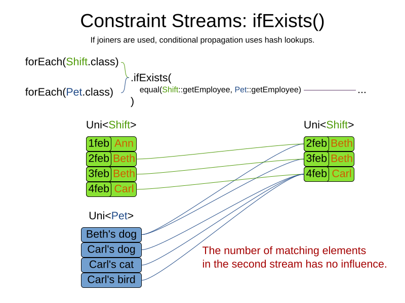

The following example penalizes vehicles which have at least one visit:

Java

```
    private Constraint deployedVehicle(ConstraintFactory constraintFactory) {
        return constraintFactory.forEach(Vehicle.class)
                .ifExists(Visit.class, Joiners.equal(Function.identity(),
Visit::getVehicle))
                .penalize(HardSoftScore.ONE_SOFT,
                        vehicle -> ...)
                .asConstraint("deployedVehicle");
    }
```

Note the use of the ifExists() building block. On UniConstraintStream, the ifExistsOther() building block is also available which is useful in situations where the forEach() constraint match type is the same as the ifExists() type.

Conversely, if the ifNotExists() building block is used (as well as the ifNotExistsOther() building block on UniConstraintStream) you can achieve the opposite effect:

Java

```
    private Constraint idleVehicle(ConstraintFactory constraintFactory) {
        return constraintFactory.forEach(Vehicle.class)
                .ifNotExists(Visit.class, Joiners.equal(Function.identity(),
Visit::getVehicle))
                .penalize(HardSoftScore.ONE_SOFT,
                        vehicle -> ...)
                .asConstraint("idleVehicle");
    }
```

Here, only the vehicles without any visits are penalized.

Also note the use of the Joiner class to limit the constraint matches. For a description of available joiners, see [joining](#pdf-dest-63b21455ba6a01f8). Conditional propagation operates much like joining, but it does not increase [stream cardinality](#pdf-dest-9e59ffae92dae01d). Matches from these building blocks are not available further down the stream.

For performance reasons, using conditional propagation with the appropriate Joiner instance is preferable to joining. While using join() creates a cartesian

product of the facts being joined, with conditional propagation, the resulting

stream only has at most the original number of constraint matches in it. Joining should only be used in cases where the other fact is actually required for another operation further down the stream.

<a id="pdf-dest-e7cc619a87282f8c"></a>

<a id="section-0191"></a>
#### 13.4.7. Mapping tuples

Mapping enables you to transform each tuple in a constraint stream by applying a mapping function to it. The result of such mapping is another constraint stream of the mapped tuples.

Java

```
    private Constraint visits(ConstraintFactory constraintFactory) {
        return constraintFactory.forEach(Visit.class) //
UniConstraintStream<Visit>
                .map(Visit::getName) //
UniConstraintStream<String>
                ...
    }
```

In the example above, the mapping function produces duplicate tuples if two different Visits share a name. That is, such visit name appears in the resulting constraint stream twice. See [distinct()](#pdf-dest-487ba701bc36d536) for how to deal with duplicate tuples.

Mapping can be used to transform streams of all cardinalities, and even between cardinalities. The following example maps a pair of Visit instances to a pair of their names:

Java

```
    private Constraint visits(ConstraintFactory constraintFactory) {
        return constraintFactory.forEachUniquePair(Visit.class)
// BiConstraintStream<Visit, Visit>
                .map((visit1, visit2) -> Pair.of(visit1.getName(), visit2
.getName())) // UniConstraintStream<Pair<String, String>>
                ...
    }
```

<a id="pdf-dest-a114c47429dfb8aa"></a>

13.4.7.1. Designing the mapping function

When designing the mapping function, follow these guidelines for optimal performance:

- Keep the function pure. The mapping function should only depend on its input. That is, given the same input, it always returns the same output.
- Keep the function bijective. No two input tuples should map to the same output tuple, or to tuples that are equal. Not following this recommendation creates a constraint stream with duplicate tuples, and may force you to use [distinct()](#pdf-dest-487ba701bc36d536) later.
- Use immutable data carriers. The tuples returned by the mapping function should be immutable and identified by their contents and nothing else. If two tuples carry objects which equal one another, those two tuples should likewise equal and preferably be the same instance.

<a id="pdf-dest-487ba701bc36d536"></a>

13.4.7.2. Dealing with duplicate tuples using distinct()

As a general rule, tuples in constraint streams are distinct. That is, no two tuples that equal one another. However, certain operations such as [tuple mapping](#pdf-dest-e7cc619a87282f8c) may produce constraint streams where that is not true.

If a constraint stream produces duplicate tuples, you can use the distinct() building block to have the duplicate copies eliminated.

Java

```
    private Constraint visits(ConstraintFactory constraintFactory) {
        return constraintFactory.forEach(Visit.class) //
UniConstraintStream<Visit>
                .map(Visit::getName) //
UniConstraintStream<String>
                .distinct() // The same, each name
just once.
                ...
    }
```

There is a performance cost to distinct(). For optimal performance, don’t use constraint stream operations that produce duplicate tuples, to avoid the need to call distinct().

<a id="pdf-dest-951969e4a2b77e62"></a>

13.4.7.3. Expanding tuples

Tuple expansion is a special case of [tuple mapping](#pdf-dest-e7cc619a87282f8c) which only increases stream cardinality and can not introduce duplicate tuples. It enables you to add extra facts to each tuple in a constraint stream by applying a mapping function to it. This is useful in situations where an expensive computations needs to be cached for use later in the stream.

In the following example, the method Talk.prevailingSpeakerUndesiredTimeslotTagCount() internally iterates over collections to find overlapping tags and returns the number of such tags. It is expensive and it is called for each Talk in the stream, possibly being called many thousands of times per second. Importantly, it is first called to filter out talks that have zero overlap, and then again to penalize overlap on talks which suffer from it.

Java

```
    Constraint speakerUndesiredTimeslotTags(ConstraintFactory factory) {
        return factory.forEach(Talk.class)
                .filter(talk -> talk.
prevailingSpeakerUndesiredTimeslotTagCount() > 0)
                .penalize(HardSoftScore.ONE_SOFT, talk -> talk
.prevailingSpeakerUndesiredTimeslotTagCount() * talk.getDurationInMinutes())
                .asConstraint(SPEAKER_UNDESIRED_TIMESLOT_TAGS);
    }
```

We can improve this by using tuple expansion to cache the result of the expensive computation, possibly significantly reducing the number of times it is called.

Java

```
    Constraint speakerUndesiredTimeslotTags(ConstraintFactory factory) {
        return factory.forEach(Talk.class)
                .expand(Talk::prevailingSpeakerUndesiredTimeslotTagCount)
                .filter((talk, undesiredTagCount) -> undesiredTagCount > 0)
                .penalize(HardSoftScore.ONE_SOFT, (talk, undesiredTagCount) ->
undesiredTagCount * talk.getDurationInMinutes())
                .asConstraint(SPEAKER_UNDESIRED_TIMESLOT_TAGS);
    }
```

Once the tuple for a Talk has been created and passed through the filter, the expensive computation will not be reevaluated again unless the Talk itself changes. There is a performance cost to expand(). Always check your solver’s move

evaluation speed to see if the cost is offset by the gains.

<a id="pdf-dest-6117b738a9c519d3"></a>

<a id="section-0192"></a>
#### 13.4.8. Flattening

Flattening enables you to transform any Java Iterable (such as List or Set) into a set of tuples, which are sent downstream. (Similar to Java Stream’s flatMap(…)) This is done by applying a mapping function to the source tuple.

Java

```
    private Constraint requiredJobRoles(ConstraintFactory constraintFactory) {
        return constraintFactory.forEach(Person.class) //
UniConstraintStream<Person>
                .join(Job.class,
                    equal(Function.identity(), Job::getAssignee)) //
BiConstraintStream<Person, Job>
                .flatten((person, job) -> job.getRequiredRoles()) //
TriConstraintStream<Person, Job, Role>
                .filter((person, job, requiredRole) -> ...)
                ...
    }
```

In the previous example, the mapping function produces duplicate tuples if

Job.getRequiredRoles() contains duplicate values. Assuming that the function

returns [USER, USER, ADMIN], the tuple (SomePerson, SomeJob, USER) is sent downstream twice. See [distinct()](#pdf-dest-487ba701bc36d536) for how to deal with duplicate tuples.

There is also a simplified version of flatten called flattenLast, which flattens the last element of the tuple, replacing it in the process:

Java

```
    private Constraint requiredJobRoles(ConstraintFactory constraintFactory) {
        return constraintFactory.forEach(Person.class) //
UniConstraintStream<Person>
                .join(Job.class,
                    equal(Function.identity(), Job::getAssignee)) //
BiConstraintStream<Person, Job>
                .flattenLast(Job::getRequiredRoles) //
BiConstraintStream<Person, Role>
                .filter((person, requiredRole) -> ...)
                ...
    }
```

<a id="pdf-dest-e586545e271ee596"></a>

<a id="section-0193"></a>
#### 13.4.9. Concatenation

The concat building block allows you to create a constraint stream containing tuples of two other constraint streams. If [join](#pdf-dest-63b21455ba6a01f8) acts like a cartesian product of two lists, concat acts like a concatenation of two lists. Unlike union of sets, concatenation of lists repeats duplicated elements. If the two constraint concatenating streams share tuples, which happens eg. when they come from the same source of data, the tuples will be repeated downstream. If this is undesired, use the [distinct](#pdf-dest-487ba701bc36d536) [building block](#pdf-dest-487ba701bc36d536).

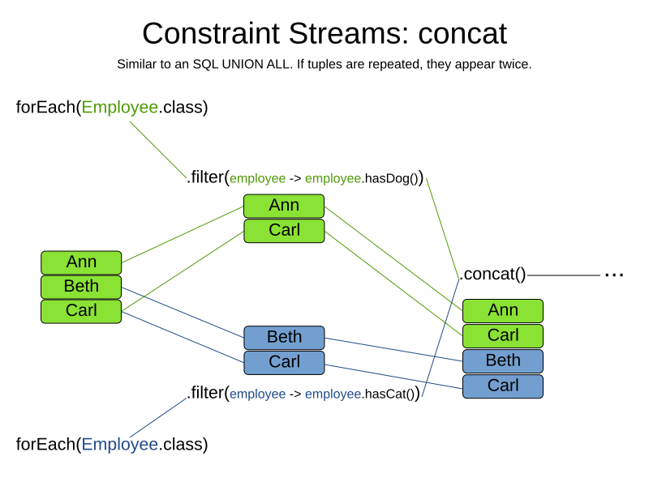

For example, to ensure each employee has a minimum number of assigned shifts:

Java

```
    private Constraint ensureEachEmployeeHasAtLeastTwoShifts(ConstraintFactory
constraintFactory) {
        return constraintFactory.forEach(Employee.class)
        .join(Shift.class, equal(Function.identity(), Shift::getEmployee))
        .concat(
            constraintFactory.forEach(Employee.class)
                .ifNotExists(Shift.class, equal(Function.identity(), Shift:
:getEmployee))
        )
        .groupBy((employee, shift) -> employee,
                    conditionally((employee, shift) -> shift != null,
                                countBi())
        )
        .filter((employee, shiftCount) -> shiftCount < employee
.minimumAssignedShifts)
        .penalize(HardSoftScore.ONE_SOFT, (employee, shiftCount) -> employee
.minimumAssignedShifts - shiftCount)
        .asConstraint("Minimum number of assigned shifts");
    }
```

This correctly counts the number of shifts each Employee has, even when the Employee has no shifts.

Complementing a stream shares many of the same use cases as concat, including

the one above.

Consider the following naive implementation without concat:

Java

```
    private Constraint incorrectEnsureEachEmployeeHasAtLeastTwoShifts
(ConstraintFactory constraintFactory) {
        return constraintFactory.forEach(Employee.class)
        .join(Shift.class, equal(Function.identity(), Shift::getEmployee))
        .groupBy((employee, shift) -> employee,
                    countBi())
        )
        .filter((employee, shiftCount) -> shiftCount < employee
.minimumAssignedShifts)
        .penalize(HardSoftScore.ONE_SOFT, (employee, shiftCount) -> employee
.minimumAssignedShifts - shiftCount)
        .asConstraint("Minimum number of assigned shifts (incorrect)");
    }
```

An employee with no assigned shifts wouldn’t have been penalized because no tuples were passed to the groupBy building block.

<a id="pdf-dest-084da2fd196a57fd"></a>

13.4.9.1. Padding values

Consider two constraint streams of different cardinalities, for instance:

Java

```
// All employees.
UniConstraintStream<Employee> uniStream = constraintFactory.forEach(Employee
.class);
// Employees with a count of their shifts; some employees may have no shifts,
therefore are not included.
BiConstraintStream<Employee, Integer> biStream = constraintFactory.forEach
(Employee.class)
    .join(Shift.class, equal(Function.identity(), Shift::getEmployee))
    .groupBy((employee, shift) -> employee, countBi());
```

By default, when concatenating these streams, the stream of lower cardinality will be padded with null values:

Java

```
// Employees from uniStream will have null as their shift count.
BiConstraintStream<Employee, Integer> concatStream = uniStream.concat(biStream
);
```

Instead of using null default, you can specify a padding value to use when padding the lower cardinality stream:

Java

```
// Employees from uniStream will have a zero as their shift count.
BiConstraintStream<Employee, Integer> concatStream = uniStream.concat(biStream,
employee -> 0);
```

<a id="pdf-dest-8d1301b0bd2bcc3e"></a>

<a id="section-0194"></a>
#### 13.4.10. Complementing a stream

The [join building block](#pdf-dest-63b21455ba6a01f8) provided by Constraint Streams is technically an inner join. This means only the matches that are present in both streams are considered. For example, if you have a stream of Employee instances and a stream of Shift instances, joining Shift instances with Employee instances will only return shifts that are assigned to an employee. Employees without shifts will not be considered.

In cases such as [load balancing](#pdf-dest-cd47e2bb0d4a6f84), a similar situation happens where the Shift instances only reference the Employee instances assigned to them. For a properly balanced solution, you also need to include Employee instances that are not assigned to any shifts.

This is where you can use the complement block as shown in the following example:

Java

```
    factory.forEach(Shift.class)
        .groupBy(Shift::getEmployee, count())
        .complement(Employee.class, employee -> 0)
        .groupBy(loadBalance(...))
```

After the [groupBy](#pdf-dest-37387ba5be45b0b1) building block, the stream contains only employees with at least one shift assigned, and each carries a count of shifts assigned. The type of the stream is BiConstraintStream<Employee, Integer>.

To add all the Employee instances that do not have any shifts assigned, the complement building block is used. It looks at all the Employee instances already in the stream, and adds all known Employee instances that are not present to the stream. For each of them, it assigns a value of 0 as the number of shifts assigned to that employee. The type of the stream is still BiConstraintStream<Employee, Integer>.

This stream now contains all Employee instances, both with and without shifts assigned, and can be passed to the [load balancing constraint collector](#pdf-dest-eeda97038aab4a3a), which will compute the unfairness metric.

<a id="pdf-dest-cf9b42c2711f5bcd"></a>

<a id="section-0195"></a>
#### 13.4.11. Precomputing a stream

When a stream depends only on properties of problem facts or entities, and not on any planning variables (genuine or shadow), that stream can be precomputed to improve performance. Consider the following No overlapping shifts constraint:

Java

```
Constraint noOverlappingShifts(ConstraintFactory constraintFactory) {
    return constraintFactory.forEachUniquePair(Shift.class,
            Joiners.overlapping(Shift::getStart, Shift::getEnd),
            Joiners.equal(Shift::getEmployee))
        .penalize(HardSoftScore.ONE_HARD, (shift1, shift2) -> shift1.
getOverlap(shift2))
        .asConstraint("No overlapping shifts");
}
```

Whenever any variable changes, this constraint will recalculate what shifts overlap and their overlap amount. Since start and end are not variables (genuine or shadow) and getOverlap() does not depend on any variables, some parts of the constraint can be precomputed to improve performance:

Java

```
TriConstraintStream<Shift, Shift, Integer> overlappingShifts(PrecomputeFactory
precomputeFactory) {
    return precomputeFactory.forEachUnfilteredUniquePair(Shift.class,
            Joiners.overlapping(Shift::getStart, Shift::getEnd))
        .expand((shift1, shift2) -> shift1.getOverlap(shift2));
}
Constraint noOverlappingShifts(ConstraintFactory constraintFactory) {
    return constraintFactory.precompute(this::overlappingShifts)
        .filter((shift1, shift2, overlap) ->
            shift1.getEmployee() != null &&
            shift1.getEmployee() == shift2.getEmployee())
        .penalize(HardSoftScore.ONE_HARD, (shift1, shift2, overlap) -> overlap)
        .asConstraint("No overlapping shifts");
}
```

This will precompute and store the overlapping shifts, and their amount of overlap. When any of the overlapping shifts' variables change, only the filter will be re-evaluated. That filter also won’t be evaluated for non-overlapping shifts, since they were already eliminated by the precomputed stream.

<a id="pdf-dest-4b9982ea69009232"></a>

13.4.11.1. Precomputing and planning variables

Precomputed streams are unfiltered and will include both unassigned and inconsistent planning entities. If only assigned entities are desired, add a filter after the precompute call to check if the entities' variables are assigned.

A score corruption will occur if a precomputed stream depends on variables (genuine or shadow). For example, if employee is a planning variable, then the following constraint will cause a score corruption:

Java

```
            TriConstraintStream<Shift, Shift, Integer> overlappingShifts
            (PrecomputeFactory precomputeFactory) {
                // This references Shift::getEmployee, which depends
                // on a planning variable and thus is not valid to
                // use in a precomputed stream
                return precomputeFactory.forEachUnfilteredUniquePair(Shift
```

.class,

```
                        Joiners.overlapping(Shift::getStart, Shift::getEnd),
                        Joiners.equal(Shift::getEmployee))
                    .expand((shift1, shift2) -> shift1.getOverlap(shift2));
            }

            Constraint noOverlappingShifts(ConstraintFactory
            constraintFactory) {
                return constraintFactory.precompute(this::overlappingShifts)
                    .penalize(HardSoftScore.ONE_HARD, (shift1, shift2,
            overlap) -> overlap)
                    .asConstraint("No overlapping shifts");
            }
```

<a id="pdf-dest-6d85fcc3b0bd9b0a"></a>

13.4.11.2. When to use precomputing

Constraint streams are already very efficient, so precomputing them may result in little change. It can be useful in cases where the constraint stream needs to execute expensive operations, such as filters which look up data in large collections or which compute complex calculations. It also helps with large joins where the join condition doesn’t depend on any variables.

However, only the biggest of datasets typically struggle with these issues. Always measure move evaluation speed before and after implementing precomputing to determine if using it brings benefits for your use case.

<a id="pdf-dest-8a3eace709a88928"></a>

<a id="section-0196"></a>
### 13.5. Testing a constraint stream

We recommend that you test your constraints to ensure that they behave as expected. Constraint streams include the Constraint Verifier unit testing harness.

<a id="pdf-dest-9c6c62a643416105"></a>

<a id="section-0197"></a>
#### 13.5.1. Testing constraints in isolation

Consider the following constraint stream:

Java

```
    Constraint vehicleCapacity(ConstraintFactory factory) {
        return factory.forEach(Vehicle.class)
                .filter(vehicle -> vehicle.getTotalDemand() > vehicle
.getCapacity())
                .penalizeLong(HardSoftScore.ONE_HARD,
                        vehicle -> vehicle.getTotalDemand() - vehicle
.getCapacity())
                .asConstraint(VEHICLE_CAPACITY);
    }
```

The following example uses the Constraint Verifier API to create a simple unit test for the preceding constraint stream:

Java

```
    private ConstraintVerifier<VehicleRoutingConstraintProvider,
VehicleRoutePlan> constraintVerifier
            = ConstraintVerifier.build(new VehicleRoutingConstraintProvider(),
VehicleRoutePlan.class, Vehicle.class, Visit.class);

    @Test
    void vehicleCapacity() {
        LocalDateTime tomorrow_07_00 = LocalDateTime.of(TOMORROW, LocalTime.of
(7, 0));
        LocalDateTime tomorrow_08_00 = LocalDateTime.of(TOMORROW, LocalTime.of
(8, 0));
        LocalDateTime tomorrow_10_00 = LocalDateTime.of(TOMORROW, LocalTime.of
(10, 0));
        Vehicle vehicleA = new Vehicle("1", 100, LOCATION_1, tomorrow_07_00);
        Visit visit1 = new Visit("2", "John", LOCATION_2, 80, tomorrow_08_00,
tomorrow_10_00, Duration.ofMinutes(30L));
        vehicleA.getVisits().add(visit1);
        Visit visit2 = new Visit("3", "Paul", LOCATION_3, 40, tomorrow_08_00,
tomorrow_10_00, Duration.ofMinutes(30L));
        vehicleA.getVisits().add(visit2);

        constraintVerifier.verifyThat(VehicleRoutingConstraintProvider:
:vehicleCapacity)
                .given(vehicleA, visit1, visit2)
                .penalizesBy(20);
    }
```

This test ensures that, if a vehicle capacity is exceeded, that the constraint penalizes accordingly. The following line creates a shared ConstraintVerifier instance and initializes the instance with the VehicleRoutingConstraintProvider:

Java

```
    private ConstraintVerifier<VehicleRoutingConstraintProvider,
VehicleRoutePlan> constraintVerifier
            = ConstraintVerifier.build(new VehicleRoutingConstraintProvider(),
VehicleRoutePlan.class, Vehicle.class, Visit.class);
```

The @Test annotation indicates that the method is a unit test in a testing framework of your choice. Constraint Verifier works with testing frameworks popular in your ecosystem, including JUnit.

The first part of the test prepares the test data. In this case, the test data includes a vehicle and a visit:

Java

```
        Vehicle vehicleA = new Vehicle("1", 100, LOCATION_1, tomorrow_07_00);
        Visit visit1 = new Visit("2", "John", LOCATION_2, 80, tomorrow_08_00,
tomorrow_10_00, Duration.ofMinutes(30L));
        vehicleA.getVisits().add(visit1);
        Visit visit2 = new Visit("3", "Paul", LOCATION_3, 40, tomorrow_08_00,
tomorrow_10_00, Duration.ofMinutes(30L));
        vehicleA.getVisits().add(visit2);
```

Further down, the following code tests the constraint: Java

```
        constraintVerifier.verifyThat(VehicleRoutingConstraintProvider:
:vehicleCapacity)
                .given(vehicleA, visit1, visit2)
                .penalizesBy(20);
```

The verifyThat(…) call is used to specify a method on the VehicleRoutingConstraintProvider class which is under test. This method must be visible to the test class, which the Java compiler enforces.

The given(…) call is used to enumerate all the facts that the constraint stream operates on. In this case, the given(…) call takes the vehicleA, visit1 and visit2 instances previously created. Alternatively, you can use a givenSolution(…) method here and provide a planning solution instead.

It’s important to understand that calling givenSolution(…) does not update any [shadow variables](#pdf-dest-e83ce444356988fd). This is the default behavior and can be modified by invoking settingAllShadowVariables().

Java

```
        constraintVerifier.verifyThat(VehicleRoutingConstraintProvider:
:vehicleCapacity)
                .givenSolution(solution)
                .settingAllShadowVariables()
                .penalizesBy(20);
```

You can also use methods justifiesWith(…) and justifiesWithExactly(…) to

validate the expected constraint justifications mapped by the constraint definition.

Finally, the penalizesBy(…) call completes the test, making sure that the given constraint under the given conditions penalizes by the 20. This number is a product of multiplying the match weight, as defined in the constraint stream, by the number of matches.

Alternatively, you can use a rewardsWith(…) call to check for rewards instead of penalties. The method to use here depends on whether the constraint stream in question is terminated with a penalize or a reward building block.

ConstraintVerifier will neither set nor update shadow variables. If the tested

constraints depend on shadow variables, it is your responsibility to either assign

the correct values beforehand, or to call settingAllShadowVariables() to have them automatically updated.

When executing justifiesWith(…) and justifiesWithExactly(…), comparisons are made using the standard method equals on the fact problem instances.

<a id="pdf-dest-96d2755056fae33d"></a>

<a id="section-0198"></a>
#### 13.5.2. Employing custom assertions

The score() and impact() methods allow you to extract the raw score or constraint match weight total produced by a constraint, enabling you to use custom assertions using third-party assertion libraries such as AssertJ.

Java

```
        HardSoftScore scoreA = constraintVerifier.verifyThat(MyConstraints:
:roomConflict)
                .given(entity1, entity2)
                .score();
        HardSoftScore scoreB = constraintVerifier.verifyThat(MyConstraints:
:roomConflict)
                .given(entity3, entity4)
                .score();
        assertThat(scoreA).isLessThan(scoreB);
```

This is especially useful when you want to compare the severity of a constraint across different scenarios.

<a id="pdf-dest-93a5a0852587d88f"></a>

<a id="section-0199"></a>
#### 13.5.3. Testing all constraints together

In addition to testing individual constraints, you can test the entire ConstraintProvider instance. Consider the following test:

Java

```
    @Test
    public void givenFactsMultipleConstraints() {
        LocalDateTime tomorrow_07_00 = LocalDateTime.of(TOMORROW, LocalTime.of
(7, 0));
        LocalDateTime tomorrow_08_00 = LocalDateTime.of(TOMORROW, LocalTime.of
(8, 0));
        LocalDateTime tomorrow_10_00 = LocalDateTime.of(TOMORROW, LocalTime.of
(10, 0));
        Vehicle vehicleA = new Vehicle("1", 100, LOCATION_1, tomorrow_07_00);
        Visit visit1 = new Visit("2", "John", LOCATION_2, 80, tomorrow_08_00,
tomorrow_10_00, Duration.ofMinutes(30L));
        vehicleA.getVisits().add(visit1);
        Visit visit2 = new Visit("3", "Paul", LOCATION_3, 40, tomorrow_08_00,
tomorrow_10_00, Duration.ofMinutes(30L));
        vehicleA.getVisits().add(visit2);

        constraintVerifier.verifyThat()
                .given(vehicleA, visit1, visit2)
                .scores(HardSoftScore.ofSoft(20));
    }
```

There are only two notable differences to the previous example.

- The verifyThat() call takes no argument here, signifying that the entire ConstraintProvider instance is being tested. (But for the sake of simplicity, we will assume it still only contains the one constraint we’ve seen previously.)
- Instead of either a penalizesBy() or rewardsWith() call, the scores(…) method is used. This runs the ConstraintProvider on the given facts and returns a sum of Scores of all constraint matches resulting from the given facts.

Using this method, you ensure that the constraint provider does not miss any constraints and that the scoring function remains consistent as your code base evolves. It is therefore necessary for the given(…) method to list all planning entities and problem facts, or provide the entire planning solution instead.

To test all constraints while updating all [shadow variables](#pdf-dest-e83ce444356988fd), call giveSolution(…) and settingAllShadowVariables(). This approach ensures that constraints which depend on the related variables are evaluated accordingly.

Java

```
        constraintVerifier.verifyThat()
                .givenSolution(solution)
                .settingAllShadowVariables()
                .scores(HardSoftScore.ofSoft(20));
```

ConstraintVerifier will neither set nor update shadow variables. If the tested

constraints depend on shadow variables, it is your responsibility to either assign

the correct values beforehand, or to call settingAllShadowVariables() to have them automatically updated.

<a id="pdf-dest-ad490638b3bc65b3"></a>

<a id="section-0200"></a>
#### 13.5.4. Testing in Quarkus

If you are using the timefold-solver-quarkus extension, inject the ConstraintVerifier in your tests:

```
@QuarkusTest
public class MyConstraintProviderTest {
    @Inject
    ConstraintVerifier<MyConstraintProvider, MyPlanningSolution> constraintProvider;
}
```

<a id="pdf-dest-d223d80fa29189c3"></a>

<a id="section-0201"></a>
#### 13.5.5. Testing in Spring Boot

If you are using the timefold-solver-spring-boot-starter module, autowire the ConstraintVerifier in your tests:

```
@SpringBootTest
public class MyConstraintProviderTest {
    @Autowired
    ConstraintVerifier<MyConstraintProvider, MyPlanningSolution> constraintProvider;
}
```

<a id="pdf-dest-809f65897cb6d5d7"></a>

<a id="section-0202"></a>
### 13.6. Other types of score calculation

Timefold Solver supports two other types of score calculation.

<a id="pdf-dest-e40119d43d01561c"></a>

<a id="section-0203"></a>
#### 13.6.1. Easy score calculation

An easy way to implement your score calculation as imperative code:

- Advantages:
  - No learning curve; use the language you’re already familiar with.
  - Opportunity to delegate score calculation to an existing code base or legacy system.
  - Useful for prototyping.
- Disadvantages:
  - Slower, typically not suitable for production.
  - Does not scale because there is no [incremental score calculation](#pdf-dest-061d4ebe0597a32e).
  - Can not [explain the score](#pdf-dest-601e0ae9a75a4274).

To start using an Easy score calculator, implement the one method of the interface EasyScoreCalculator:

Java

```
public interface EasyScoreCalculator<Solution_, Score_ extends Score<Score_>> {

    Score_ calculateScore(Solution_ solution);

}
```

Configure it in the solver configuration:

```
<scoreDirectorFactory>
    <easyScoreCalculatorClass>...MyEasyScoreCalculator</easyScoreCalculatorClass>
</scoreDirectorFactory>
```

To configure values of an EasyScoreCalculator dynamically in the solver configuration (so the [Benchmarker](#pdf-dest-e921478f36b99095) can tweak those parameters), add the easyScoreCalculatorCustomProperties element and use [custom properties](#pdf-dest-b13106eb78a3ed8c):

```
<scoreDirectorFactory>
    <easyScoreCalculatorClass>...MyEasyScoreCalculator</easyScoreCalculatorClass>
    <easyScoreCalculatorCustomProperties>
    <property name="myCacheSize" value="1000" />
    </easyScoreCalculatorCustomProperties>
</scoreDirectorFactory>
```

<a id="pdf-dest-d8e7743e38ee4cd8"></a>

<a id="section-0204"></a>
#### 13.6.2. Incremental score calculation

A way to implement your score calculation incrementally in Java.

Advantages

- Very fast and scalable; possibly an order of magnitude faster than [Constraint Streams](#pdf-dest-90641d67d73d7e7b),if implemented correctly.

Disadvantages

- Difficult to write; a scalable implementation heavily uses maps, indexes etc. You have to learn, design, write and improve all these performance optimizations yourself.
- Difficult to maintain; regular constraint changes can lead to high maintenance costs.

Considering the significant development and maintenance effort required to implement an incremental score calculator, we recommend using [Constraint Streams](#pdf-dest-90641d67d73d7e7b) unless its incremental performance characteristics doesn’t match your needs. This is unlikely for any but the biggest of problems.

To start using an Incremental score calculator, implement all the methods of the interface IncrementalScoreCalculator:

Java

```
public interface IncrementalScoreCalculator<Solution_, Score_ extends Score
<Score_>> {

    void resetWorkingSolution(Solution_ workingSolution);

    void beforeEntityAdded(Object entity);

    void afterEntityAdded(Object entity);

    void beforeVariableChanged(Object entity, String variableName);

    void afterVariableChanged(Object entity, String variableName);
    void beforeEntityRemoved(Object entity);

    void afterEntityRemoved(Object entity);

    Score_ calculateScore();

}
```

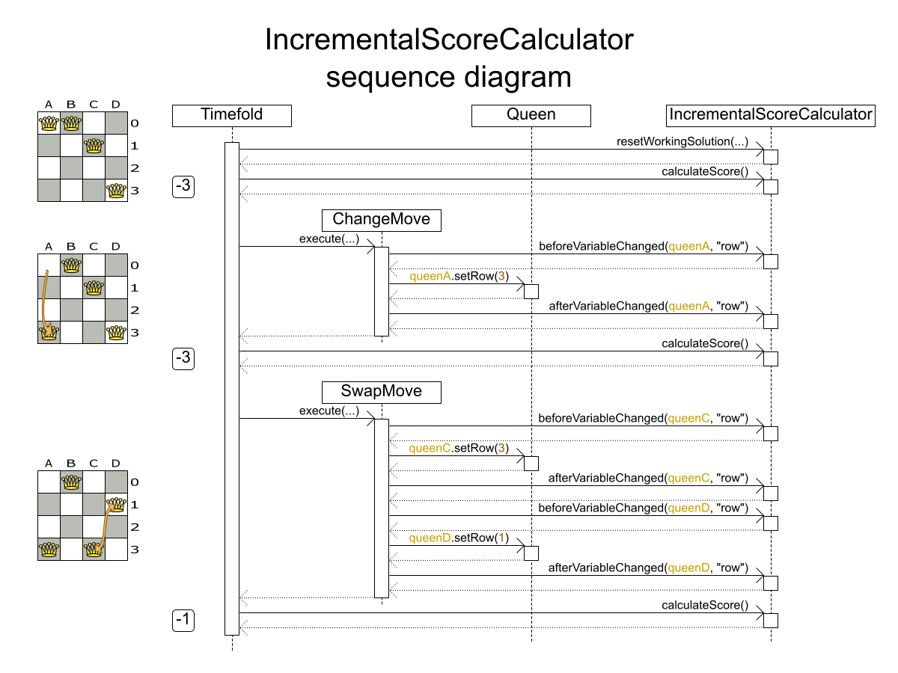

Configure it in the solver configuration:

```
<scoreDirectorFactory>
    <incrementalScoreCalculatorClass>
...MyIncrementalScoreCalculator</incrementalScoreCalculatorClass>
</scoreDirectorFactory>
```

Incremental score calculator code can be difficult to write and to review. [Assert its](#pdf-dest-d16f56861c51fe35) [correctness](#pdf-dest-d16f56861c51fe35) by using Constraint Streams to fulfill the assertions triggered by the ([source](#pdf-dest-90641d67d73d7e7b)) environmentMode.

To configure values of an IncrementalScoreCalculator dynamically in the solver configuration (so the [Benchmarker](#pdf-dest-e921478f36b99095) can tweak those parameters), add the incrementalScoreCalculatorCustomProperties element and use [custom properties](#pdf-dest-b13106eb78a3ed8c):

```
<scoreDirectorFactory>
    <incrementalScoreCalculatorClass>
...MyIncrementalScoreCalculator</incrementalScoreCalculatorClass>
    <incrementalScoreCalculatorCustomProperties>
    <property name="myCacheSize" value="1000"/>
    </incrementalScoreCalculatorCustomProperties>
</scoreDirectorFactory>
```

<a id="pdf-dest-aaca8269d8447719"></a>

13.6.2.1. Incremental score calculator and score analysis

This feature is exclusive to [Timefold Solver Enterprise Edition](#pdf-dest-601e0ae9a75a4274).

To add support for [score analysis](#pdf-dest-601e0ae9a75a4274), implement the AnalyzableIncrementalScoreCalculator interface instead of IncrementalScoreCalculator:

```
public interface AnalyzableIncrementalScoreCalculator<Solution_, Score_ extends Score
<Score_>>
    extends IncrementalScoreCalculator<Solution_, Score_> {

    void enableConstraintMatch(ConstraintMatchRegistry<Score_>
constraintMatchRegistry);

}
```

The solver will call this method exactly once, letting your implementation know that it should start tracking constraint matches. The ConstraintMatchRegistry instance passed to this method provides the API for tracking constraint matches:

```
public interface ConstraintMatchRegistry<Score_ extends Score<Score_>> {

    ConstraintMatchRegistration<Score_> registerConstraintMatch(ConstraintRef
constraintRef, Score_ score,
            ConstraintJustification justification);

    ...

}
```

You can notify the solver of a new constraint match by calling registerConstraintMatch(). This method takes three parameters: - constraintRef is a reference to the constraint which is being matched. - score is the score impact of the match. - justification is an object which explains the reason for the match. It is an optional argument. The method will return a ConstraintMatchRegistration instance, which provides the API for updating and retracting the match:

```
public interface ConstraintMatchRegistration<Score_ extends Score<Score_>> {

    void cancel();

    ...
}
```

By calling cancel(), you can notify the solver that a previously registered match is no longer valid. Once resetWorkingSolution() is called on the incremental score calculator, all registered matches are automatically canceled.

<a id="pdf-dest-84640214fbd21bd8"></a>

<a id="section-0205"></a>
## Chapter 14. Understanding the score (Score Analysis)

The score in its pure form is just a number, and does not help us understand the make-up of the solution it represents. It doesn’t say which constraints are broken, or what caused them to break. To understand the score, it needs to be broken down.

This feature is exclusive to [Timefold Solver Enterprise Edition](#pdf-dest-601e0ae9a75a4274).

The easiest way to break down the score during development is to print the score summary:

Java

```
SolutionManager<VehicleRoutePlan, HardSoftScore> solutionManager =
SolutionManager.create(solverFactory);
ScoreAnalysis<HardSoftScore> scoreAnalysis = solutionManager.analyze
(vehicleRoutePlan);
System.out.println(scoreAnalysis.summarize());
```

For example, in vehicle routing, this prints that vehicle vehicle '1' matched the soft constraint minimizeTravelTime:

```
Explanation of score (0hard/-10343soft):
    Constraint matches:
        -10343soft: constraint (minimizeTravelTime) has 6 matches:
            -2335soft: justified with (MinimizeTravelTimeJustification[vehicleName=1,
totalDrivingTimeSeconds=2335, description=Vehicle '1' total travel time is 0 hours 39
minutes.])
            ... [2 more displayed constraint matches]
            ... and 3 more matches
        ...
```

The number of matches shown per constraint can be controlled by calling analyze(vehicleRoutePlan).summarize(topLimit), where topLimit is the maximum number of matches to display for each constraint. For example, summarize(5) will show up to 5 matches per constraint. To show all matches use Integer.MAX_VALUE as parameter.

Do not attempt to parse this string or expose it in services. It serves for debugging

purposes only. Use [score analysis](#pdf-dest-6621208fa1cfdedb) instead.

In the string above, there are some previously unexplained concepts.

- A Constraint match is created every time a constraint causes a change to the score.
- Justifications are user-defined objects that implement the

ai.timefold.solver.core.api.score.stream.ConstraintJustification interface, which carry meaningful information about a constraint match, such as its name and any metadata that the user chooses to expose. Justifications are most easily available via [score analysis](#pdf-dest-6621208fa1cfdedb).

[Constraint Streams API](#pdf-dest-601e0ae9a75a4274) can analyze the score natively. Incremental Java score ([source](#pdf-dest-d8e7743e38ee4cd8)) [calculation](#pdf-dest-d8e7743e38ee4cd8) requires implementing an extra interface. Easy Java score calculation ([source](#pdf-dest-aaca8269d8447719)) ([source](#pdf-dest-e40119d43d01561c)) does not support score explanation.

<a id="pdf-dest-6621208fa1cfdedb"></a>

<a id="section-0206"></a>
### 14.1. Score Analysis: Which constraints are broken?

If other parts of your application, such as your web interface, need to describe the solution to the user, use the SolutionManager API:

Java

```
SolutionManager<VehicleRoutePlan, HardSoftScore> solutionManager =
SolutionManager.create(solverFactory);
ScoreAnalysis<HardSoftScore> scoreAnalysis = solutionManager.analyze
(vehicleRoutePlan);
```

ScoreAnalysis is a JSON-friendly representation of the score, breaking down the score into individual constraints. Using score analysis, you can find out:

- What’s the total score.
- Which constraints are broken, and how many times.
- Which planning entities and problem facts are responsible for breaking which constraints.

For performance reasons and especially with large datasets that you’ll later need to serialize, you may choose to use ScoreAnalysis without justifications, while still maintaining the count of constraint matches. In that case, use ScoreAnalysisFetchPolicy.FETCH_MATCH_COUNT instead of the default ScoreAnalysisFetchPolicy.FETCH_ALL when calling SolutionManager.analyze(…).

The score analysis of structurally flawed solutions has a structural flaw analysis,

which can be used to get inconsistent entities. Constraint analyses are still

available for structurally flawed solutions, but will exclude any matches sourced from an inconsistent entity.

It is also possible to print the score summary:

Java

```
SolutionManager<VehicleRoutePlan, HardSoftScore> solutionManager =
SolutionManager.create(solverFactory);
ScoreAnalysis<HardSoftScore> scoreAnalysis = solutionManager.analyze
(vehicleRoutePlan);
System.out.println(scoreAnalysis.summarize());
```

For example, this prints that vehicle vehicle '1' matched the soft constraint minimizeTravelTime:

```
Explanation of score (0hard/-10343soft):
    Constraint matches:
        -10343soft: constraint (minimizeTravelTime) has 6 matches:
            -2335soft: justified with (MinimizeTravelTimeJustification[vehicleName=1,
totalDrivingTimeSeconds=2335, description=Vehicle '1' total travel time is 0 hours 39
minutes.])
            ...
        ...
```

Do not attempt to parse this string or expose it in services. It serves for debugging

purposes only.

<a id="pdf-dest-0411beb2c2f05e58"></a>

<a id="section-0207"></a>
#### 14.1.1. Finding the broken constraints

When you have the ScoreAnalysis instance, you can find out which constraints are broken:

Java

```
scoreAnalysis.constraintMap().forEach((constraintRef, constraintAnalysis) -> {
    String constraintId = constraintRef.constraintId();
    HardSoftScore scorePerConstraint = constraintAnalysis.score();
    ...
});
```

If you wish to go further and find out which planning entities and problem facts are responsible for breaking the constraint, you can further explore the ConstraintAnalysis instance you received from ScoreAnalysis.constraintMap():

Java

```
int matchCount = constraintAnalysis.matchCount();
constraintAnalysis.matches().forEach(matchAnalysis -> {
    HardSoftScore scorePerMatch = matchAnalysis.score();
    Object justification = matchAnalysis.justification();
    ...
});
```

Each match is accompanied by the score difference it caused, and a justification object (see above). Typically, the scoring engine creates justification objects automatically by using the results of [Constraint Streams'](#pdf-dest-cfd80e084d6ed27c) justifyWith(…) call.

<a id="pdf-dest-bca385ce7958a257"></a>

<a id="section-0208"></a>
#### 14.1.2. Identifying changes between two solutions

If you have two different solutions from the Solver, you can compare them using ScoreAnalysis and find out what changed between them:

Java

```
ScoreAnalysis<HardSoftScore> firstAnalysis = solutionManager.analyze
(firstSolution);
ScoreAnalysis<HardSoftScore> secondAnalysis = solutionManager.analyze
(secondSolution);
ScoreAnalysis<HardSoftScore> diff = firstAnalysis.diff(
secondAnalysis);

// Score difference only carries the constraints whose matches changed from
first to second solution.
diff.constraintMap().forEach((constraintRef, constraintAnalysis) -> {
    String constraintId = constraintRef.constraintId();
    HardSoftScore scoreDiff = constraintAnalysis.score();
    // Matches only include constraint matches that:
    // - the second solution either added to or removed from the first
solution.
    // - had their score changed.
    // Two matches are considered equal if their justification objects are
equal.
    constraintAnalysis.matches().forEach(matchAnalysis -> {
        ...
    });
});
```

Think of diff(…) as a subtraction operation, where the second solution is subtracted from the first solution. For example, if the first solution has score of 2hard/3soft and the second solution has score of 1hard/2soft, then the score difference will be 1hard/1soft, indicating that the second solution is better than the first solution.

The same applies to constraints and constraint matches. If a constraint did not match in the first solution but did match in the second, then the constraint match will be included in the diff as negative. If instead the constraint did match in the first solution but did not match in the second, then the constraint match will be included in the diff as positive.

<a id="pdf-dest-3bf1bf5beb5d6d89"></a>

<a id="section-0209"></a>
#### 14.1.3. Sending score analysis over the wire

The purpose of ScoreAnalysis is to break down the score so that the end user can understand it. To succeed at this, ScoreAnalysis is JSON-friendly and can be easily sent over the wire from the backend to the frontend. ScoreAnalysis instances will serialize into JSON automatically (using Jackson):

- If you use Timefold Solver’s [Quarkus integration](#pdf-dest-1ab8ade1829825d4),
- or if you use Timefold Solver’s [Spring Boot integration](#pdf-dest-bd8f299169ad8ea1),
- or if you directly included the timefold-solver-jackson module in your project.

If you implemented ConstraintJustication to provide custom justification objects, you are responsible for making them JSON-friendly yourself.

ScoreAnalysis doesn’t natively deserialize from JSON back to Java objects. This is because we have no way of knowing which Score or ConstraintJustification implementations you may be using. However, deserialization is easy to implement yourself by extending AbstractScoreAnalysisJacksonDeserializer and registering it with Jackson’s ObjectMapper.

With large datasets, you may choose to use ScoreAnalysis without justifications, while still maintaining the count of constraint matches. In that case, use ScoreAnalysisFetchPolicy.FETCH_MATCH_COUNT instead of the default ScoreAnalysisFetchPolicy.FETCH_ALL when calling SolutionManager.analyze(…).

<a id="pdf-dest-682edda9d8cd728d"></a>

<a id="section-0210"></a>
### 14.2. Solution Diff: What changed between now and then?

The solution diff is exclusive to Timefold Solver Enterprise Edition. It is also only

available as a [preview feature](#pdf-dest-0ba2746c7caf33f0). It may be subject to change and must be enabled in

the solver configuration by setting: <enablePreviewFeature>PLANNING_SOLUTION_DIFF</enablePreviewFeature>

Using the SolutionManager API, you can compare two solutions provided by the solver, and find out what changed between them:

Java

```
SolutionManager<VehicleRoutePlan, HardSoftScore> solutionManager =
SolutionManager.create(solverFactory);
...
PlanningSolutionDiff<VehicleRoutePlan> solutionDiff = solutionManager.diff
(oldSolution, newSolution);
```

The PlanningSolutionDiff instance contains the following information:

- A full list of entities whose planning variables (genuine or shadow) changed between the two solutions. Each entity is represented by a PlanningEntityDiff instance, which contains the entity itself, as well as the old and new values of the changed variables.
- Set of planning entities not present in the new solution (removed entities).
- Set of planning entities not present in the old solution (added entities).
- The oldSolution and newSolution planning solutions.

It also has a useful toString() for a quick overview of the changes. Do not attempt to parse this string or expose it in services, its format is not stable and is subject to change.

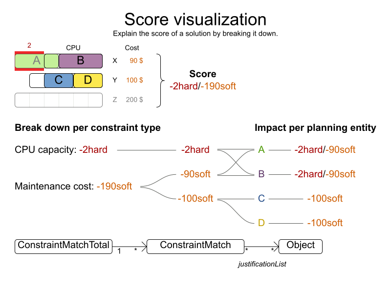

<a id="pdf-dest-cd47e2bb0d4a6f84"></a>

<a id="section-0211"></a>
## Chapter 15. Load balancing and fairness

Load balancing is a common constraint for many Timefold Solver use cases. Especially when scheduling employees, the workload needs to be spread out fairly; there may even be legal requirements to that effect.

<a id="pdf-dest-52d9f9fa5a9414a0"></a>

<a id="section-0212"></a>
### 15.1. What is fair?

Fairness is a complex concept, and it is not always clear what is fair. For example, let’s assign 15 undesirable tasks to five employees. Each task takes a day, but the tasks have different skill requirements. In a perfectly fair schedule, each employee will get three tasks, because the average is 15 / 5 = 3.

Unfortunately, this doesn’t solve the entire problem, because there are other constraints. For example, there are seven tasks that require a skill which only two of the employees possess. One of them will have to do at least four tasks.

From the above, we can see that our schedule cannot be perfectly fair, but we can make it as fair as possible.

<a id="pdf-dest-b5d0492f2471c5fd"></a>

<a id="section-0213"></a>
#### 15.1.1. Which is fairer?

We can define fairness in two opposing ways:

- A schedule is fair if most users think it is fair to them.
- A schedule is fair if the employee with most tasks has as few tasks as possible.

Since we want to treat all employees equally, the second definition is correct. Besides, if we make almost everyone happy by letting one employee do all the work, that employee would probably quit and that doesn’t help.

Let’s look at a few different solutions of the same dataset, sorted from most to least fair. Each one has 15 tasks:

|  | Ann | Beth | Carl | Dan | Ed | Solution<br>Quality |
| --- | --- | --- | --- | --- | --- | --- |
| Schedule A | 3 | 3 | 3 | 3 | 3 | Most fair |
| Schedule B | 4 | 4 | 3 | 2 | 2 |  |
| Schedule C | 5 | 3 | 3 | 2 | 2 |  |
| Schedule D | 5 | 5 | 2 | 2 | 1 |  |
| Schedule E | 6 | 3 | 3 | 2 | 1 |  |
| Schedule F | 5 | 6 | 2 | 1 | 1 |  |
| Schedule G | 11 | 1 | 1 | 1 | 1 | Most unfair |

Ann has the most tasks each time. How do we compare schedules in which Ann has the same number of tasks?

|  | Ann | Beth | Carl | Dan | Ed | Solution<br>Quality |
| --- | --- | --- | --- | --- | --- | --- |
| Schedule C | 5 | 3 | 3 | 2 | 2 | More fair |
| Schedule D | 5 | 5 | 2 | 2 | 1 | Less fair |

We take a look at the second most loaded employee, Beth. In schedule D, she has five tasks, while in schedule C, she has less. This makes schedule C fairer overall.

This is the definition of fairness we use in the remainder of this section.

<a id="pdf-dest-23e678e7cf82ded7"></a>

<a id="section-0214"></a>
### 15.2. Fairness constraints

Timefold Solver supports fairness constraints out of the box through the use of [grouping](#pdf-dest-37387ba5be45b0b1) and the [load balancing constraint collector](#pdf-dest-eeda97038aab4a3a). In your ConstraintProvider implementation, a load-balancing constraint may look like this:

Java

```
Constraint fairAssignments(ConstraintFactory constraintFactory) {
    return constraintFactory.forEach(ShiftAssignment.class)
            .groupBy(ConstraintCollectors.loadBalance(ShiftAssignment:
:getEmployee))
            .penalizeBigDecimal(HardSoftBigDecimalScore.ONE_SOFT, LoadBalance:
:unfairness)
            .asConstraint("fairAssignments");
}
```

When using fairness constraints, we recommend that you use one of the [score](#pdf-dest-58137ea86011e483) [types](#pdf-dest-58137ea86011e483) based on BigDecimal, such as HardSoftBigDecimalScore. See below for a [detailed rationale](#pdf-dest-4acbad0c33b90731).

This constraint will penalize the solution based on its unfairness, defined in this case by how many ShiftAssignment are allocated to any particular Employee.

Unfairness is a dimensionless number that measures how fair the solution is. A lower value indicates a fairer solution. The smallest possible value is 0, indicating that the solution is perfectly fair. There is no upper limit to the value, and it is expected to scale linearly with the size of your dataset. The value is rounded to six decimal places.

Different unfairness values may only be compared for solutions coming from the same dataset. Unfairness values computed from different datasets are incomparable.

<a id="pdf-dest-4acbad0c33b90731"></a>

<a id="section-0215"></a>
#### 15.2.1. Why BigDecimal?

When using fairness constraints, we recommend that you use one of the [score types](#pdf-dest-58137ea86011e483) based on BigDecimal. We base our recommendation on the following reasons:

- The unfairness value is a rational number. The corresponding floating-point type (double) is [not](#pdf-dest-9c955ecac98f0af0) [suitable for score calculations](#pdf-dest-9c955ecac98f0af0).
- Rounding the unfairness value to the nearest integer would lose precision, causing a [score trap](#pdf-dest-7995da7c3d75ca6c). Even a small difference in unfairness (such as between 1.000001 and 1.000002) gives the solver crucial information to distinguish different solutions from each other.

If the somewhat worsened performance of a BigDecimal-based score calculation is a concern, instead, you may decide to multiply the unfairness value by some power of ten to preserve precision, and only then round it to the nearest integer. This allows you to use the simple integer-based score types.

Unfortunately, this also requires you to re-balance your constraint weights, multiplying them by the same power of ten as used for unfairness. Otherwise, the unfairness constraint will dominate the score, effectively becoming the most important constraint.

If you take this approach, we recommend that you preserve all six decimal places of the unfairness value to avoid the most severe score traps. This will leave considerably less space in the selected data type for actual values, which go from x to x × 1_000_000. This may entirely preclude you from using the 32-bit int, and reduce the usefulness of the 64-bit long.

We default to BigDecimal to help users avoid the pitfalls described above, while still allowing advanced users to choose other score types once they understand the risks.

<a id="pdf-dest-955dcaefc8cef6bf"></a>

<a id="section-0216"></a>
## Chapter 16. Performance tips and tricks

<a id="pdf-dest-301339fe33f11016"></a>

<a id="section-0217"></a>
### 16.1. Overview

The Solver will normally spend most of its execution time evaluating moves and running score calculation, which is called in its deepest loops. Faster score calculation will return the same solution in less time with the same algorithm, which normally means a better solution in equal time.

<a id="pdf-dest-d4ed04478743c7ed"></a>

<a id="section-0218"></a>
### 16.2. Move evaluation and score calculation speed

After solving a problem, the Solver will log the move evaluation speed per second. This is a good measurement of Move evaluation performance, despite that it is affected by non-score calculation execution time. It depends on the problem scale of the problem dataset. Normally, even for large scale problems, it is higher than 1000, except if you are using [EasyScoreCalculator](#pdf-dest-e40119d43d01561c).

When improving your solver’s performance, focus on maximizing the score calculation speed while keeping the existing moves, instead of maximizing the best score. A big improvement in score calculation can sometimes yield little or no best score improvement, for example when the algorithm is stuck in a local or global optimum. If you are watching the calculation speed instead, score calculation improvements are far more visible.

Furthermore, watching the calculation speed allows you to remove or add score constraints, and still compare it with the original’s calculation speed. Comparing the best score with the original’s best score is pointless: it’s comparing apples and oranges.

The solver usually calculates the score for each move it evaluates. This means a direct relationship exists between the score calculation and the evaluated move, typically a 1:1 ratio. However, some moves, such as [Ruin and Recreate](#pdf-dest-74050161a6ed7657), involve processing the score multiple times within the same move.

The use of moves like Ruin and Recreate may increase the number of score calculations, making this ratio N:1.

<a id="pdf-dest-061d4ebe0597a32e"></a>

<a id="section-0219"></a>
### 16.3. Incremental score calculation (with deltas)

When a solution changes, incremental score calculation (AKA delta based score calculation) calculates the delta with the previous state to find the new Score, instead of recalculating the entire score on every solution evaluation.

For example, when a shift in employee rostering is reassigned from Ann to Beth, it will not bother to check any other employees, since neither of them changed:

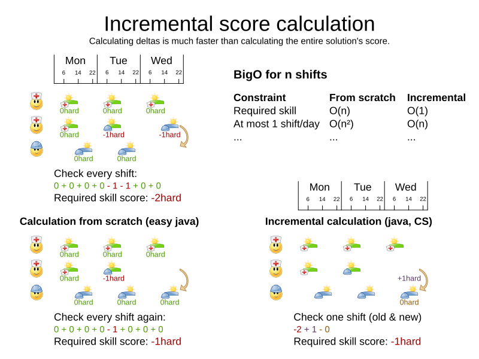

This is a huge performance and scalability gain. [Constraint Streams API](#pdf-dest-601e0ae9a75a4274) gives you this huge scalability gain without forcing you to write a complicated incremental score calculation algorithm.

Note that the speedup is relative to the size of your planning problem (your n), making incremental score calculation far more scalable.

<a id="pdf-dest-b34a6b29b666c57b"></a>

<a id="section-0220"></a>
### 16.4. Enterprise performance improvements

The [Enterprise Edition](#pdf-dest-601e0ae9a75a4274) of Timefold Solver has a number of performance improvements that can further speed up score calculation. The Enterprise Edition also allows for [Constraint Profiling](#pdf-dest-7e174e93607c8474), making it easy to identify constraint performance bottlenecks.

<a id="pdf-dest-2444c4e69f45af4f"></a>

<a id="section-0221"></a>
### 16.5. Avoid calling remote services during score calculation

Do not call remote services in your score calculation, except if you are bridging EasyScoreCalculator to a legacy system. The network latency will kill your move evaluation performance. Cache the results of those remote services if possible.

If some parts of a constraint can be calculated once, when the Solver starts, and never change during solving, then turn them into [cached problem facts](#pdf-dest-fba57cf5d4489941).

<a id="pdf-dest-1ce990417a104a71"></a>

<a id="section-0222"></a>
### 16.6. Unused constraints

If a constraint is only relevant when certain data is present on the input (for example, if you want a capacity [constraint](#pdf-dest-f912b076aec80358) to only be evaluated when capacity information is present), set the constraint [weight](#pdf-dest-f912b076aec80358) to zero. In Constraint Streams, this will result in the constraint not being added to the node ([source](#pdf-dest-90641d67d73d7e7b)) network and therefore have no performance impact at all.

Should you forget to set the constraint weight to zero, the constraint may still be deactivated at runtime, if the engine can prove that it will never contribute to the score. For example, a constraint using forEach(Visit.class) will be deactivated if there are no Visit instances in the solution.

This is inferior to manually setting the constraint weight to zero, as the engine can only perform optimizations it can guarantee are safe based on the limited information it has. With full understanding of the domain, you are in a much better position to know which constraints are relevant and which are not, and you can set the weights accordingly.

<a id="pdf-dest-cd201d76e6ca923b"></a>

<a id="section-0223"></a>
### 16.7. Built-in hard constraint

Instead of implementing a hard constraint, it can sometimes be built in. For example, if Lecture A should never be assigned to Room X, but it uses ValueRangeProvider on Solution, so the Solver will often try to [assign](#pdf-dest-43601136f091829f) it to Room X too (only to find out that it breaks a hard constraint). Use a [ValueRangeProvider on the planning entity](#pdf-dest-43601136f091829f) or filtered selection to define that Course A should only ([source](#pdf-dest-c52cb4a39082ea49)) be assigned a Room different than X.

This can give a good performance gain in some use cases, not just because the move evaluation is faster, but mainly because most optimization algorithms will spend less time evaluating infeasible solutions. However, there is a real risk of trading short-term benefits for long-term harm:

- Many optimization algorithms rely on the freedom to break hard constraints when changing planning entities, to get out of local optima.
- Both implementation approaches have limitations (feature compatibility, disabling automatic performance optimizations), as explained in their documentation.

<a id="pdf-dest-c81acdfd0d75929b"></a>

<a id="section-0224"></a>
### 16.8. Large cross-products

In order for constraints to scale well, it is necessary to limit the amount of data that flows through them. In Constraint Streams, it starts with [joins](#pdf-dest-63b21455ba6a01f8). Consider a school timetabling problem, where a teacher must not have two overlapping lessons. This is how the lesson could look:

Java

```
    @PlanningEntity
    class Lesson {

        ...

        Teacher getTeacher() { ... }
        boolean overlaps(Lesson anotherLesson) { ... }

        boolean isCancelled() { ... }

        ...

    }
```

The simplest possible Constraint Stream we could write to penalize all overlapping lessons would then look like:

Java

```
    constraintFactory.forEach(Lesson.class)
        .join(Lesson.class)
        .filter((leftLesson, rightLesson) ->
            !leftLesson.isCancelled()
            && !rightLesson.isCancelled()
            && leftLesson.getTeacher()
                .equals(rightLesson.getTeacher())
            && leftLesson.overlaps(rightLesson))
        .penalize(HardSoftScore.ONE_HARD)
        .asConstraint("Teacher lesson overlap")
```

The join creates a cross-product between lessons, producing a match (also called a tuple) for every possible combination of two lessons, even though we know that many of these matches will not be penalized. This shows the problem in numbers:

Table 2. Fast growth of cross-product

| Number of lessons | Number of possible pairs |
| --- | --- |
| 10 | 100 |
| 100 | 10 000 |
| 1 000 | 1 000 000 |

To process a thousand lessons, the constraint first creates a cross-product of one million pairs, only to throw away pretty much all of them before penalizing. Reducing the size of the cross-product by half will therefore double the move evaluation speed.

<a id="pdf-dest-72d58ab3e31b9147"></a>

<a id="section-0225"></a>
#### 16.8.1. Filters before joins

As the example shows, canceled lessons are eventually filtered out after the join. Let’s instead remove them from the cross-product entirely. For the first lesson in the join, also called “left,” we put the cancellation check before the join like so: Java

```
    constraintFactory.forEach(Lesson.class)
        .filter(lesson -> !lesson.isCancelled())
        .join(Lesson.class)
        .filter((leftLesson, rightLesson) ->
            !rightLesson.isCancelled()
            && leftLesson.getTeacher().equals(rightLesson.getTeacher())
            && leftLesson.overlaps(rightLesson))
        ...
```

The canceled lessons are no longer coming in from the left, which reduces the cross-product. However, some canceled lessons are still coming in from the right through the join. They can be eliminated using a filtered nested stream:

Java

```
    constraintFactory.forEach(Lesson.class)
        .filter(lesson -> !lesson.isCancelled())
        .join(
            constraintFactory.forEach(Lesson.class)
                .filter(lesson -> !lesson.isCancelled()))
        .filter((leftLesson, rightLesson) ->
            leftLesson.getTeacher().equals(rightLesson.getTeacher())
            && leftLesson.overlaps(rightLesson))
        ...
```

We’ve created a new Constraint Stream from Lesson, filtering before it entered our join. We have now applied the same improvement on both the left and right sides of the join, making sure it only creates a cross-product of lessons which we care about.

<a id="pdf-dest-e1c375f0375d13bd"></a>

<a id="section-0226"></a>
#### 16.8.2. Joiners over filters

Filters are just a simple check if a tuple matches a predicate. If it does, it is propagated downstream, otherwise it is no longer evaluated. Each tuple needs to go through this check, and that means every pair of lessons will be evaluated. When a Lesson changes, all pairs with that Lesson will be wastefully re-evaluated. Let’s move the Teacher equality check from the final filter above to a Joiner:

Java

```
    constraintFactory.forEach(Lesson.class)
        .filter(lesson -> !lesson.isCancelled())
        .join(
            constraintFactory.forEach(Lesson.class)
                .filter(lesson -> !lesson.isCancelled()),
            Joiners.equal(Lesson::getTeacher))
        .filter(Lesson::overlaps)
        ...
```

The constraint still says the same thing: a Lesson pair will only be sent downstream if they share the same Teacher. Unlike the filter, this brings the performance benefit of indexing. Now when a Lesson changes, only the pairs with the matching Teacher will be re-evaluated. So even though the cross-product remains the same, we are doing much less work processing it.

The final filter(Lesson::overlaps) now only performs one operation on the final cross product, and the number of Lesson pairs that get this far is already reduced as much as possible.

<a id="pdf-dest-3ed0ac9a5c067916"></a>

<a id="section-0227"></a>
#### 16.8.3. Removing more and earlier

If at all possible, the Joiner that will remove more tuples than the others should be put first. The size of cross-products will be the same, but the processing will happen more quickly.

Consider a new situation, where lessons also have rooms in which they happen. Although there are possibly dozens of teachers, there are only three rooms. Therefore, the join should look like this:

Java

```
    constraintFactory.forEach(Lesson.class)
        .join(Lesson.class,
            Joiners.equal(Lesson::getTeacher),
            Joiners.equal(Lesson::getRoom))
    ...
```

This way, we first create “buckets” for each of the many teachers, and these buckets will only contain a relatively small number of lessons per room. If done the other way around, there would be a small number of large buckets, leading to much more iteration every time a lesson changes.

For that reason, it is generally recommended putting Joiners based on enum fields or boolean fields last.

<a id="pdf-dest-0d0a73949fa148be"></a>

<a id="section-0228"></a>
### 16.9. Indexing, Hashing, Looping

The code on the hot path of your application needs to be as fast as possible.

- When you use [Shadow Variables](#pdf-dest-e83ce444356988fd), you will provide a supplier method that computes the value of the shadow variable.
- This method will be called very often during score calculation, so it needs to be fast.
- If you need to do a lookup in a collection to find an element, ideally you are indexing into an array.
- The second best option is to use a HashMap or HashSet.
- Avoid using java.util.Stream or any other form of explicit iteration in constraints, as that is much slower.

<a id="pdf-dest-0e89820860c342f2"></a>

<a id="section-0229"></a>
### 16.10. Benchmark

Whatever you do, benchmark on a large and diverse set of inputs.

JVM performance may differ by as much as 20% between runs. To decide whether your changes helped or made things worse, make sure to always average the move evaluation speed from multiple runs on the same machine with the same solver configuration. We provide a [Benchmarker](#pdf-dest-e921478f36b99095) to help you with that.

<a id="pdf-dest-7e174e93607c8474"></a>

<a id="section-0230"></a>
### 16.11. Constraint Profiling

This feature is exclusive to [Timefold Solver Enterprise Edition](#pdf-dest-601e0ae9a75a4274).

Profiling allows you to identify which constraints are taking the majority of time spent in score calculation and thus are worth optimizing. Unfortunately, traditional profiling tools only report the internal classes used to calculate constraints instead of the constraints themselves. [Constraint](./score-calculation.pdf#constraintStreams) [streams](./score-calculation.pdf#constraintStreams) have builtin support for profiling constraints directly.

<a id="pdf-dest-fba03d0fff839fd3"></a>

<a id="section-0231"></a>
#### 16.11.1. Configuration

XML

- Add <constraintStreamProfilingEnabled>true</constraintStreamProfilingEnabled> in your solverConfig.xml:
```
    <scoreDirectorFactory>
        <constraintProviderClass>...ConstraintProvider</constraintProviderClass>
        <constraintStreamProfilingEnabled>
    true</constraintStreamProfilingEnabled>
    </scoreDirectorFactory>
```

Spring Boot Set the property timefold.solver.constraint-stream-profiling-enabled to true in application.properties:

```
timefold.solver.constraint-stream-profiling-enabled=true
```

Quarkus Set the property quarkus.timefold.solver.constraint-stream-profiling-enabled to true in application.properties:

```
quarkus.timefold.solver.constraint-stream-profiling-enabled=true
```

Constraint profiling will log its results to the ai.timefold.solver.enterprise.core.api.ConstraintProfiler class at the end of solving. For the report to be generated, [the particular logging levels must be configured and enabled](#pdf-dest-0a149844a7c9f4cf).

Constraint profiling is only supported for constraint stream score calculation when

[multi-threaded solving](running-timefold-solver/multithreaded-solving.pdf#multithreadedSolving) is disabled.

<a id="pdf-dest-9276b67cd6fb2eb4"></a>

<a id="section-0232"></a>
#### 16.11.2. Understanding the report

When constraint stream profiling is enabled, a breakdown of time spent in each constraint is logged at the end of solving.

```
INFO: # Constraint Profiling Summary
| | Time Spent | Of Total |
| :------------------------------------------------- | ---------: | -------: |
| 2: Teacher time efficiency | 6.19 s | 23.15 % |
| 6: Room conflict | 4.17 s | 15.61 % |
| 4: Student group conflict | 3.76 s | 14.07 % |
| 5: Teacher conflict | 3.41 s | 12.76 % |
| 1: Student group subject variety | 3.25 s | 12.14 % |
| 3: Teacher room stability | 3.25 s | 12.14 % |
| Work shared by 1, 2, 3, 4, 5, 6 | 2.71 s | 10.12 % |

DEBUG: ## Constraint Profiling Node Breakdown
| 2: Teacher time efficiency | Time Spent | Of Total |
| :------------------------------------------------- | ---------: | -------: |
| JOIN Node 26 | 1.56 s | 25.20 % |
| JOIN Left Input 6 | 1.28 s | 20.69 % |
| JOIN Right Input 7 | 1.09 s | 17.55 % |
| FILTER 5 | 1.83 s | 29.49 % |
| SCORING 4 | 0.44 s | 7.06 % |

- JOIN Node 26 defined at location
org.acme.schooltimetabling.solver.TimetableConstraintProvider#teacherTimeEfficiency:77
- JOIN Left Input 6 defined at location
org.acme.schooltimetabling.solver.TimetableConstraintProvider#teacherTimeEfficiency:77
- JOIN Right Input 7 defined at location
org.acme.schooltimetabling.solver.TimetableConstraintProvider#teacherTimeEfficiency:77
- FILTER 5 defined at location
org.acme.schooltimetabling.solver.TimetableConstraintProvider#teacherTimeEfficiency:79
- SCORING 4 defined at location
org.acme.schooltimetabling.solver.TimetableConstraintProvider#teacherTimeEfficiency:84

...
TRACE: ## Constraint Profiling Lifecycle Breakdown
| 2: Teacher time efficiency | INSERT | UPDATE | RETRACT |
| :--------------------------------------- | -------: | -------: | --------: |
| JOIN | 13.12 % | 75.64 % | 11.23 % |
| FILTER | 23.69 % | 50.45 % | 25.86 % |
| SCORING | 13.10 % | 16.12 % | 70.78 % |

...
```

The data is printed as a Markdown table. Any Markdown-enabled text editor will

show a well-formatted table.

Add different logging levels, different information is reported:

INFO How much time spent in score calculation is spent by each constraint (total and relative percentage) in descending order.

```
| 2: Teacher time efficiency | 6.19 s | 23.15 % |
```

[When node sharing](#pdf-dest-d0b8072bb9cc4519) is used, the time spent will be reported with "Work shared by", with the numbers identifying constraints that shared the work. In the example below, work was shared by constraints 1 to 6:

```
| Work shared by 1, 2, 3, 4, 5, 6 | 2.71 s | 10.12 % |
```

DEBUG

A breakdown for each constraint of time spent (total and relative percentage) by each constraint stream building block (e.g., join, filter).

```
| 2: Teacher time efficiency | Time Spent | Of Total |
| :------------------------------------------------- | ---------: | -------: |
| JOIN Node 26 | 1.56 s | 25.20 % |
| JOIN Left Input 6 | 1.28 s | 20.69 % |
| JOIN Right Input 7 | 1.09 s | 17.55 % |
| FILTER 5 | 1.83 s | 29.49 % |
| SCORING 4 | 0.44 s | 7.06 % |
```

To make it easier to map the building blocks to your ConstraintProvider code, the location(s) where each building block was defined is also reported:

```
- JOIN Node 26 defined at location
org.acme.schooltimetabling.solver.TimetableConstraintProvider#teacherTimeEfficiency
:77
```

TRACE

A breakdown for each constraint of time spent by each building block, shown as percentage of time spent in each of the lifecycle phases.

```
| 2: Teacher time efficiency | INSERT | UPDATE | RETRACT |
| :--------------------------------------- | -------: | -------: | --------: |
| JOIN | 13.12 % | 75.64 % | 11.23 % |
| FILTER | 23.69 % | 50.45 % | 25.86 % |
| SCORING | 13.10 % | 16.12 % | 70.78 % |
```

This is only relevant to people intimately familiar with the underlying implementation of Constraint Streams and can be safely ignored by everyday users.

<a id="pdf-dest-bfe8a50c15115435"></a>

<a id="section-0233"></a>
#### 16.11.3. Interpreting the results

Constraint profiling measures wall clock time, not CPU time, and as such includes any garbage collection pauses that may occur during score calculation. These numbers should be used as a guide to identify which constraints are the most expensive, not as an exact measurement.

Due to the nature of the JVM, the results may vary between runs. The solver needs to run for a sufficient amount of time to allow the JVM to warm up and stabilize. We recommend running the solver for minutes rather than seconds, but more than that is unlikely to bring any additional benefit. For increased confidence in the results, you can run the solver multiple times in different JVM processes and average the results.

Traditional profiling tools such as Java Mission Control will report the internal

classes used to calculate constraints instead of the constraints themselves.

<a id="pdf-dest-a55c25bd712671d1"></a>

<a id="section-0234"></a>
### 16.12. Validate the implementation using FULL_ASSERT

When you are done optimizing your score calculation, make sure to validate it using [FULL_ASSERT](#pdf-dest-a908d91ea2c6d089) mode. Make sure not to run with this mode in production.

<a id="pdf-dest-f0e9432ae7663503"></a>

<a id="section-0235"></a>
### 16.13. Other score calculation performance tricks

- Verify that your score calculation happens in the correct Number type. If you are making the sum of int values, do not sum it in a double which takes longer.
- For optimal performance, use the latest Java version. We often see significant performance improvements by switching to new Java versions.
- Always remember that premature optimization is the root of all evil. Make sure your design is flexible enough to allow configuration-based tweaking.

<a id="pdf-dest-7995da7c3d75ca6c"></a>

<a id="section-0236"></a>
### 16.14. Score trap

Make sure that none of your score constraints cause a score trap. A trapped score constraint uses the same weight for different constraint matches, when it could just as easily use a different weight. It effectively lumps its constraint matches together, which creates a flatlined score function for that constraint. This can cause a solution state in which several moves need to be done to resolve or lower the weight of that single constraint. Some examples of score traps:

- You need two doctors at each table, but you are only moving one doctor at a time. So the solver has no incentive to move a doctor to a table with no doctors. Punish a table with no doctors more than a table with only one doctor in that score constraint in the score function.
- Two exams need to be conducted at the same time, but you are only moving one exam at a time. So the solver has to move one of those exams to another timeslot without moving the other in the same move. Add a coarse-grained move that moves both exams at the same time.

For example, consider this score trap. If the blue process moves from an overloaded computer to an empty computer, the hard score should improve. The trapped score implementation fails to do that:

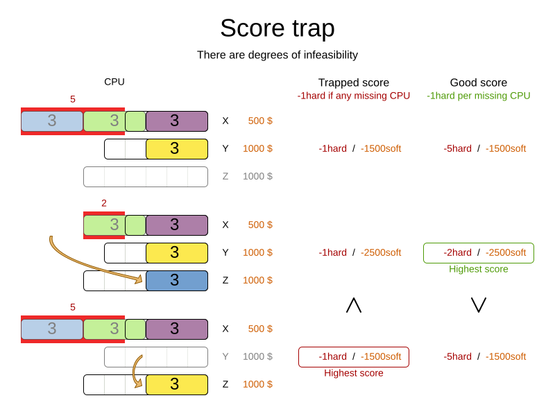

The Solver should eventually get out of this trap, but it will take a lot of effort (especially if there are even more processes on the overloaded computer). Before they do that, they might actually start moving more processes into that overloaded computer, as there is no penalty for doing so.

Avoiding score traps does not mean that your score function should be smart enough to avoid local optima. Leave it to the optimization algorithms to deal with the local optima. Avoiding score traps means to avoid, for each score constraint individually, a flatlined score function.

Always specify the degree of infeasibility. The business will often say "if the solution is infeasible, it does not matter how infeasible it is." While that is true for the business, it is not true for score calculation as it benefits from knowing how infeasible it is. In practice, soft constraints usually do this naturally and it is just a matter of doing it for the hard constraints too.

There are several ways to deal with a score trap:

- Improve the score constraint to make a distinction in the score weight. For example, penalize -1hard for every missing CPU, instead of just -1hard if any CPU is missing.
- If changing the score constraint is not allowed from the business perspective, add a lower score level with a score constraint that makes such a distinction. For example, penalize -1subsoft for every missing CPU, on top of -1hard if any CPU is missing. The business ignores the subsoft score level.
- Add coarse-grained moves and union select them with the existing fine-grained moves. A coarse-grained move effectively does multiple moves to directly get out of a score trap with a single move. For example, move multiple items from the same container to another container.

<a id="pdf-dest-55e9cd84586fcf5d"></a>

<a id="section-0237"></a>
### 16.15. stepLimit benchmark

Not all score constraints have the same performance cost. Sometimes one score constraint can ruin performance outright. Use the [Benchmarker](#pdf-dest-e921478f36b99095) to do a one minute run and check what happens to the move evaluation speed if you comment out all but one of the score constraints.

<a id="pdf-dest-973aacb01d5e777d"></a>

<a id="section-0238"></a>
# Running the Solver

<a id="pdf-dest-eae63eac98cd9083"></a>

<a id="section-0239"></a>
## Chapter 17. Using Timefold Solver: Overview

Timefold Solver can be used in two modes. Both build on the same modeling and constraint concepts, but differ in how you deploy and interact with the solver.

<a id="pdf-dest-b0cf9433387dd842"></a>

<a id="section-0240"></a>
### 17.1. Run as a Service (recommended)

Deploy Timefold Solver as a standalone optimization service. This mode handles the REST API, solver lifecycle, and more.

Submit a planning problem via REST and receive optimized results asynchronously. Configuration is done via application.properties.

This is the recommended approach for most teams: it lets you focus on modeling the problem and writing constraints rather than on plumbing. This is the approach we use ourselves at Timefold for [models on our platform](https://app.timefold.ai).

[→ Run as a Service](#pdf-dest-601e0ae9a75a4274)

<a id="pdf-dest-5dc939b770e6acb7"></a>

<a id="section-0241"></a>
### 17.2. Use as a Library (advanced)

Embed Timefold Solver directly in your application for full control over the solving lifecycle. Use this approach when you need deep integration with existing infrastructure or have a use case or architecture where the recommended approach above doesn’t apply to you.

[→ Use as a Library](#pdf-dest-601e0ae9a75a4274)

<a id="pdf-dest-89d22be647816581"></a>

<a id="section-0242"></a>
### 17.3. Common foundation

Regardless of mode, the following steps and concepts apply:

1. Model your planning problem as a class annotated with @PlanningSolution, for example Timetable.

2. Define constraints using a ConstraintProvider that expresses hard and soft rules.

3. Submit your problem - via REST API (service) or Solver.solve() / SolverManager (library).

4. Receive the best solution found within the configured time limit.

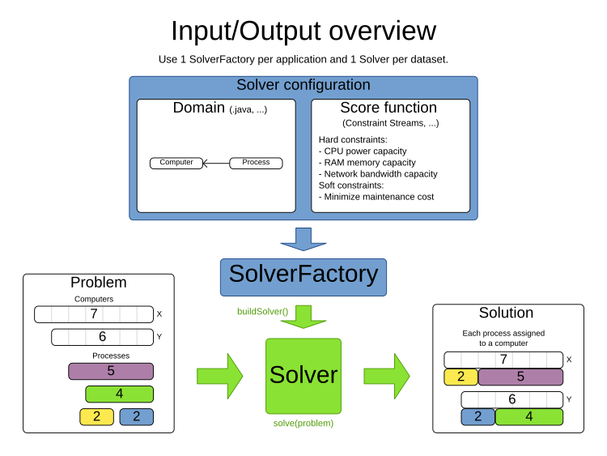

<a id="pdf-dest-044a8dbba736b69a"></a>

<a id="section-0243"></a>
## Chapter 18. Building a service

Run dataset optimization as a fully isolated service. This opinionated approach eliminates the boilerplate typically needed to expose a solver over a REST API.

If you haven’t done so yet, start with the [Getting started: building a service](../quickstart/service/getting-started.pdf) guide.

<a id="pdf-dest-78ffb8a3d6b069dc"></a>

<a id="section-0244"></a>
### 18.1. How solving works

Once your service is running, solving is driven entirely through the REST API - no solver management code required.

1. Submit a problem - POST /<root> with your planning problem as a JSON body. The service registers the dataset, starts optimizing asynchronously, and returns an ID immediately.

2. Poll for results - GET /<root>/{id} returns the best solution found so far, along with the current score. Call this repeatedly to show progress to the end-user, or once after a known time limit.

3. Terminate early - DELETE /<root>/{id} stops solving and returns the best solution reached.

4. Inspect score analysis - GET /<root>/{id}/score-analysis breaks down which constraints are violated and by how much.

See [REST API](#pdf-dest-601e0ae9a75a4274) for the full endpoint reference and request/response formats.

<a id="pdf-dest-e9103711e40474f7"></a>

<a id="section-0245"></a>
### 18.2. Built on Timefold Solver (the library)

The service module is not a separate product, it is Timefold Solver with an opinionated runtime on top. Under the hood, the same Solver, SolverManager, constraint streams, and optimization algorithms are running. Everything you know about modeling planning problems and writing constraints transfers directly.

If you are coming from the library, think of the service as the infrastructure layer you no longer have to write yourself: instead of wiring up a SolverManager, a REST endpoint, or thinking about good model ergonomics, the service module provides all of that out of the box.

Your modeling and constraint knowledge is the same, only the plumbing changes.

The following areas of the documentation apply equally to both service and library mode:

[Modeling planning problems](#pdf-dest-601e0ae9a75a4274) How to annotate your domain with @PlanningSolution, @PlanningEntity, @PlanningVariable, and related annotations. This is largely the same in both modes; service-specific interfaces are covered in the service section.

[Constraints and Score](../constraints-and-score/overview.pdf#constraintsAndScoreOverview) How to define hard and soft constraints, choose a score type, and analyze solution quality. Constraint streams and score calculation work identically in both modes. [Tuning and diagnostics](../running-timefold-solver/multithreaded-solving.pdf) Environment modes, logging, monitoring, multi-threaded solving, and random seed configuration. These concepts and most configuration options apply regardless of how you run the solver.

The pages in this section cover only what is specific to the service module: the REST API contract, model enrichment, constraint weight overrides, demo data, and metrics.

<a id="pdf-dest-7c8f2854e77d5428"></a>

<a id="section-0246"></a>
## Chapter 19. REST API

The REST API module will automatically generate REST API endpoints so you can interact with the optimization service.

<a id="pdf-dest-95924c4a5857c29a"></a>

<a id="section-0247"></a>
### 19.1. Setup

In order for the API to be automatically generated, Timefold Solver will look for implementations of a couple of interfaces. The following are expected.

- An implementation of ModelInput to define the class which will be mapped from JSON to Java on API requests.
- An implementation of ModelOutput to define the class which will be mapped from Java to JSON on API responses.
- An interface which extends ModelRest to define the root path of the REST API.

For example, in the case of School Timetabling, those classes could look as follows.

Java

```
// TimetableDto.java
public class TimetableDto implements ModelInput, ModelOutput {

    @Schema(required = true, description = "The unique identifier of timetable
")
    private String name;
    @Schema(required = true, description = "List of timeslots")
    private List<Timeslot> timeslots;
    @Schema(required = true, description = "List of lessons")
    private List<Lesson> lessons;

    // Getters, Setters and constructor excluded.
}

// TimetableSchedulingResource.java
@Tag(name = "School Timetabling",
        description = "School timetabling service assigning lessons to
timeslots.") // OpenAPI documentation annotation
@Path("/timetables") //sets the root path
public interface TimetableSchedulingResource extends ModelRest {
}
```

Note how the ModelInput and ModelOutput interface can be placed on the same class.

Since an [OpenAPI specification](#pdf-dest-62640be88a8c55e7) will also be automatically generated, it’s important to properly document your ModelInput and ModelOutput classes with OpenAPI annotations.

<a id="pdf-dest-bd4064200cf1bc54"></a>

<a id="section-0248"></a>
### 19.2. Generated endpoints

The REST module generates several endpoints; the following are the core endpoints. The <root> is the full served path, which is the model API version prefix followed by the value of the @Path annotation. The SDK default configuration sets quarkus.rest.path=${timefold.model.version}, which Quarkus prepends to every @Path at runtime. So for timefold.model.version=v1 and @Path("/timetables"), <root> is /v1/timetables.

Do not include the version in your @Path annotation. The SDK handles it automatically via quarkus.rest.path. Including it (e.g. @Path("/v1/timetables")) results in a doubled prefix (/v1/v1/timetables) at runtime.

To change the API version, override the timefold.model.version Maven property in the pom.xml. The Quarkus property of the same name gets configured automatically from the Maven property.

- GET /<root>: Retrieve all registered optimization datasets
- POST /<root>: Create a new optimization dataset
- GET /<root>/{id}: Retrieve the (intermediate) result of a dataset optimization run
- GET /<root>/{id}/score-analysis: Retrieve score analysis of an optimization dataset
- DELETE /<root>/{id}: Terminate a dataset optimization run

If your model provides [demo data](./demo-data.pdf), the following endpoints are also created. These are not nested under <root>: the path is /{timefold.model.version}/demo-data, not /<root>/demo-data. For example, with timefold.model.version=v1 this is /v1/demo-data.

- GET /v<version>/demo-data: Retrieve all available demo dataset ids.
- GET /v<version>/demo-data/{demoDataId}: Retrieve the demo dataset with the given identifier, as the full Solving Request (config and modelInput, see [Request and response structure](#pdf-dest-22e5c9cc2abe5591)). This response is ready to POST directly to <root>.
- GET /v<version>/demo-data/{demoDataId}/input: Retrieve the demo dataset’s modelInput only, without the config envelope.

See the [service consumer guide](#pdf-dest-601e0ae9a75a4274) for information on how consumers of the service should interact with these API endpoints.

<a id="pdf-dest-22e5c9cc2abe5591"></a>

<a id="section-0249"></a>
### 19.3. Request and response structure

The generated endpoints do not accept/return the pure ModelInput/ModelOutput objects as JSON. Instead, a fixed envelope is used for both the requests and responses of solver actions.

<a id="pdf-dest-74641a98a6b76fa5"></a>

<a id="section-0250"></a>
#### 19.3.1. Structured solving request

A Solving Request always contains at least 2 major parts, the modelInput object and a config object.

- The modelInput object contains the JSON formatted ModelInput object defined in Java.
- The config object has two fields: the run and the model.

Additionally, more fields might be added for specific model implementations.

Example Request

```
{
    "config": {
        "run": {
        "name": "dataset name",
        "termination": {
            "spentLimit": "PT5M",
            "unimprovedSpentLimit": "PT10S"
        },
        "maxThreadCount": 1,
        "tags": []
        },
        "model": {
        "overrides": "<model-specific configurations>"
        }
    },
    "modelInput" : "<ModelInput class as JSON>"
}
```

The run configuration has four fields:

- name: The run name (if empty, it will be generated).
- maxThreadCount: The maximum thread count, which indicates the maximum number of threads to be used for solving. If not provided, 1 will be used.
- tags: The tags, which are a set of optional tags to be assigned to the run.
- termination: The termination properties determining how long the solver should run:
  - spentLimit: The maximum duration to keep the solver running (ISO 8601 Duration). If omitted, no maximum duration will be set (platform limits will apply).
  - unimprovedSpentLimit: The maximum unimproved score duration, that is, if the score has not improved during this period, the solver will terminate (ISO 8601 Duration). If omitted, the [diminished returns termination](https://docs.timefold.ai/timefold-solver/latest/optimization-algorithms/overview#diminishedReturnsTermination) applies. If set, stepCountLimit must be empty. Using this option disables the default diminished returns termination, which is recommended for most use cases.
  - stepCountLimit: The maximum solver step count. The solver stops after a predetermined number of steps. Because step count is independent of hardware performance, use this option to benchmark your models. It is not recommended for production use. If set, unimprovedSpentLimit must be empty. Using this option disables the default diminished returns termination, which is recommended for most use cases.
  - slidingWindowDuration: The sliding window (ISO 8601 Duration) over which the diminished returns termination measures score improvement. Defaults to PT30S when omitted. This option only takes effect when the diminished returns termination is active, that is, when

both unimprovedSpentLimit and stepCountLimit are empty.

  - minimumImprovementRatio: The minimum ratio between current and initial improvement before the diminished returns termination triggers. This value must be strictly positive, and defaults to 0.0001 when omitted. This option only takes effect when the diminished returns termination is active, that is, when both unimprovedSpentLimit and stepCountLimit are empty.

The diminished returns termination is the recommended default setting. This

termination is desirable since it terminates based on the relative rate of

improvement, and behaves similarly on different hardware and different problem instances. Set unimprovedSpentLimit or stepCountLimit only when necessary.

The model configuration is a model-specific field that contains additional global model configuration attributes. See [constraint weights](#pdf-dest-9924d437d1d55f7f) for more information.

<a id="pdf-dest-dc3804776f7a9caa"></a>

<a id="section-0251"></a>
#### 19.3.2. Structured solving response

A Solving Response always contains at least 2 major elements, the modelOutput object and a metadata object.

- The modelOutput object contains the JSON formatted ModelOutput object defined in Java.
- The metadata object provides more details about the optimization run.

Additionally, more fields might be added for specific model implementations:

- inputMetrics: metrics about the input of the planning problem. See: [Input Metrics](./exposing-metrics.pdf#modelInputMetrics)
- kpis: metrics about the output of the planning problem. See: [Output Metrics](./exposing-metrics.pdf#modelOutputMetrics)

This envelope is represented in Java/Kotlin by the ModelResponse record (ai.timefold.solver.service.definition.api.domain.ModelResponse). Its accessor is named outputMetrics(), not kpis(); only the JSON serialization uses the kpis key (via @JsonProperty("kpis")). The score itself is not a top-level field: it’s nested inside metadata.score, not metadata.run.score or a top-level score.

Example Response

```
{
    "metadata": {
    "id": "dataset-id",
    "name": "dataset-name",
    "submitDateTime": "2022-03-10T12:15:50-04:00",
    "startDateTime": "2022-03-10T12:15:50-04:00",
    "activeDateTime": "2022-03-10T12:15:50-04:00",
    "completeDateTime": "2022-03-10T12:15:50-04:00",
    "shutdownDateTime": "2022-03-10T12:15:50-04:00",
    "solverStatus": "NOT_SOLVING",
    "score": "string",
    "tags": [],
    "validationResult": {
        "summary": "VALIDATION_NOT_SUPPORTED",
        "errors": [],
        "warnings": []
    }
    },
    "modelOutput": "<ModelOutput class as JSON>",
    "inputMetrics": {
    "lessons": 200,
    "timeslots": 50
    },
    "kpis": {
    "unassignedLessons": 0,
    "maxConsecutiveLessons": 3,
    "earliestTimeslotStart": "2027-02-02T09:00:00Z",
    "latestTimeslotStart": "2027-02-05T17:00:00Z"
    }
}
```

The metadata object contains a couple of fields:

- id - The dataset id, as generated by the Solver.
- name - The dataset name.
- solverStatus - The status of the optimization.
- score - The score of the solution.
- tags - The assigned tags of the dataset.
- [validationResult](#pdf-dest-26822ce90dae0360) - The result of the validation. This might signal errors in the original input.

The remaining fields are timestamps for each step in the optimization lifecycle.

The metadata object contains five key timestamps, each marking a distinct phase in the process:

- submitDateTime: The moment the dataset is submitted. At this stage, the dataset is queued and has not yet begun solving. The dataset status is SOLVING_SCHEDULED.
- startDateTime: The moment the run begins initializing. During this phase, the dataset is not solving yet, but the model is being built and enriched with external data (e.g., incorporating map information for models involving geographical locations). The dataset status is SOLVING_STARTED.
- activeDateTime: The moment the solving phase begins. At this stage, the actual problem-solving process starts. The dataset status is SOLVING_ACTIVE.
- completeDateTime: The moment the solving phase concludes. At this point, the dataset has finished solving but has not yet undergone any post-processing (e.g., score analysis or waypoint enrichment for geographical models). The dataset status is either SOLVING_COMPLETED or SOLVING_FAILED.
- shutdownDateTime: The moment the post-processing phase finishes. All tasks, including post-processing, are completed, and the dataset optimization is fully finalized.

<a id="pdf-dest-a168991a8ac1e03e"></a>

<a id="section-0252"></a>
### 19.4. Decoupling API interaction from the solver domain

While it is possible to add the ModelInput and ModelOutput directly on the SolverModel (the @PlanningSolution class used by the solver), it’s often beneficial to decouple the classes used for the REST API interactions and the classes used for the optimization.

To convert between ModelInput / ModelOutput and the SolverModel, a ModelConvertor implementation can be provided.

Java

```
@ApplicationScoped
public class TimetableConvertor implements ModelConvertor<HardMediumSoftScore,
TimetableDto, EmptyModelConfigOverrides, Timetable, TimetableDto> {

    @Override
    public Timetable toSolverModel(TimetableDto modelInput, ModelConfig
<EmptyModelConfigOverrides> modelConfig,
            Optional<TimetableDto> lastModelOutput) {
        return // Mapping logic
    }

    @Override
    public TimetableDto toModelOutput(Timetable solverModel) {
        return // Mapping logic
    }

    @Override
    public TimetableDto applyOutputToInput(TimetableDto modelInput,
TimetableDto modelOutput) {
        return // Mapping logic
    }
}
```

This mechanism should only be used for ModelInput → SolverModel → ModelOutput mapping. For enhancing the SolverModel, use the [Model Enrichment](./model-enrichment.pdf#solverModelEnrichment) mechanism instead.

<a id="pdf-dest-26822ce90dae0360"></a>

<a id="section-0253"></a>
### 19.5. Validating REST input

By default, validation on the input is based on the [OpenAPI Specification annotations](./rest-api.pdf#openAPISpecification). Additional validations can be added by implementing the ModelValidator interface.

<a id="pdf-dest-0ad25d38197cae41"></a>

Java

```
@ApplicationScoped
public class TimetableValidator implements ModelValidator<TimetableDto,
TimetableConfigOverrides> {

    @Override
    public void validate(ValidationBuilder validationBuilder, TimetableDto
input, ModelConfig<TimetableConfigOverrides> modelConfig) {

        //validation logic here, simplified example here.
        if(hasDuplicateTeacherNames(input)) {
            validationBuilder.addIssue(TimetableValidationIssue
.DUPLICATE_TEACHER.asIssueType(), new DuplicateTeacherDetail("Ann"));
        }
    }
}

public enum TimetableValidationIssue {

    DUPLICATE_TEACHER(IssueCode.of("DUPLICATE_TEACHER"), IssueSeverity.ERROR,
            "Duplicate teacher names found.");

    private final IssueType issueType;

    TimetableValidationIssue(IssueCode code, IssueSeverity severity, String
message) {
        this.issueType = new IssueType(code, severity, message);
    }

    public IssueType asIssueType() {
        return issueType;
    }

    public record DuplicateTeacherDetail(String teacherName) implements
IssueDetail {
    }
}
```

The ValidationBuilder supports issue types of different severity: - IssueSeverity.ERROR: error level: processing cannot continue. Results in a BAD_REQUEST (400) HTTP error. - IssueSeverity.WARNING: warning level: processing will continue.

All validation information can be accessed either in a simple textual form, or as structured machine-readable objects.

<a id="pdf-dest-00765ff74e4731c1"></a>

<a id="section-0254"></a>
#### 19.5.1. Simple validation result in metadata object

The metadata object is a part of the model response json and contains the validation result in a textual form to provide an immediate feedback on the input json.

Validation result in response json.

```
{
    "metadata": {
    "id": "dataset-id",
    "name": "dataset-name",
    "submitDateTime": "2022-03-10T12:15:50-04:00",
    "startDateTime": "2022-03-10T12:15:50-04:00",
    "activeDateTime": "2022-03-10T12:15:50-04:00",
    "completeDateTime": "2022-03-10T12:15:50-04:00",
    "shutdownDateTime": "2022-03-10T12:15:50-04:00",
    "solverStatus": "NOT_SOLVING",
    "score": "string",
    "tags": [],
    "validationResult": {
        "summary": "ERRORS",
        "errors": ["Duplicate teacher names found."],
        "warnings": []
    }
    },
    "modelOutput": "<ModelOutput class as JSON>"
}
```

<a id="pdf-dest-a48c105c5d38f66b"></a>

<a id="section-0255"></a>
#### 19.5.2. Machine-readable validation result

Additionally, a richer validation result can be obtained by a dedicated REST endpoint:

GET /v1/timetables/{id}/validation-result

Assuming the [example TimetableValidator](#pdf-dest-0ad25d38197cae41), the endpoint provides the following response: .Validation result available via GET /v1/timetables/{id}/validation-result.

```
{
    "status" : "ERRORS",
    "issues" : [ {
    "id" : 1,
    "code" : "DUPLICATE_TEACHER",
    "severity" : "ERROR",
    "detail" : {
        "teacherName" : "Ann"
    }
    } ]
}
```

The machine-readable validation result enables for corrective actions. In this example, the timetable can be corrected by removing the duplicate teacher Ann.

<a id="pdf-dest-07b6dfb5bb5f90b1"></a>

<a id="section-0256"></a>
### 19.6. Adding custom endpoints

You can add custom endpoints in the ModelRest implementation. For example, if you want to extend the Timetable REST API, you can add custom [Jakarta REST endpoints](https://jakarta.ee/learn/docs/jakartaee-tutorial/current/websvcs/rest/rest.html). These endpoints should also be documented appropriately for the automatically generated [OpenAPI specification](#pdf-dest-62640be88a8c55e7).

Java

```
@Tag(name = "School Timetabling",
        description = "School timetabling service assigning lessons to
timeslots.") //OpenAPI documentation annotation
@Path("/timetables") //sets the root path
public interface TimetableSchedulingResource extends ModelRest {

    @APIResponses(value = {
        @APIResponse(responseCode = "500", description = "In case of processing
errors",
                content = @Content(mediaType = MediaType.APPLICATION_JSON,
                        schema = @Schema(implementation = ErrorInfo.class))),
        @APIResponse(responseCode = "200", description = "List of all teachers
in all optimization runs.",
                content = @Content(mediaType = MediaType.APPLICATION_JSON,
                        schema = @Schema(implementation =
ListTeachersResponseDto.class))) })
    @Operation(operationId = "list-teachers-in-solver-model",
            summary = "Lists all teachers in the solver model.")
    @GET
    @Path("/insights/teachers")
    @Produces(MediaType.APPLICATION_JSON)
    default Response insightsTeachers() {
        var teachers = //get the list of teachers
        return Response.ok(teachers).build();
    }
}
```

<a id="pdf-dest-62640be88a8c55e7"></a>

<a id="section-0257"></a>
### 19.7. OpenAPI specification

The OpenAPI specification is a machine-readable document that defines the structure, endpoints, request/response formats, and authentication of a RESTful API. A specification file is automatically generated from the [MicroProfile OpenAPI annotations](https://download.eclipse.org/microprofile/microprofile-open-api-1.0/microprofile-openapi-spec.html) on the Java classes.

For more info on which annotations are available and how they relate to the generated OpenAPI specification, check out the official [MicroProfile OpenAPI](https://download.eclipse.org/microprofile/microprofile-open-api-1.0/microprofile-openapi-spec.html) [specification here](https://download.eclipse.org/microprofile/microprofile-open-api-1.0/microprofile-openapi-spec.html).

After building the model with mvn verify, the generated API spec can be found in the target folder: target/openapi-schema/openapi.json.

<a id="pdf-dest-98270771f179a265"></a>

<a id="section-0258"></a>
#### 19.7.1. Deliberate API changes

As with any API, breaking the REST API in newer versions of your model should be avoided to ensure backward compatibility and prevent disruptions for existing consumers. Because Timefold Solver takes care of a lot of boilerplate code, it might be harder to see when an API change was accidentally introduced.

Timefold Solver supports comparing a pre-existing OpenAPI specification file in your project src/build/openapi.json with the one generated during the build. If there is any difference between the 2 files, the build will fail.

If the API changes are intentional, run the following command which will copy the generated target/openapi-schema/openapi.json to src/build/openapi.json file.

```
mvn clean package -Dupdate-api
```

This approach ensures that any change to the API has to be reflected in the src/build/openapi.json file.

We recommend to keep this file in Version Control, this makes sure the changes

made are deliberate (committed and pushed) rather than accidental.

<a id="pdf-dest-97a9e5b8d2100456"></a>

<a id="section-0259"></a>
#### 19.7.2. Customize summary of solver methods

As mentioned before, the REST endpoints for solver methods are automatically generated. This means users do not have the option to set the OpenAPI Annotations for those methods.

Timefold Solver does support setting a custom summary through the use of properties in the application.properties file. This uses the following format:

```
timefold.model.rest.<operationname>.summary=Your custom summary here
```

The <operationname> is the name of the method in the API Spec (operationId field).

For example, if you want to override the OpenAPI summary for the schedule operation, add the following entry in your properties file:

```
timefold.model.rest.schedule.summary=Request a timetable to be solved asynchronously.
```

<a id="pdf-dest-ddbdb5d95c2cdb90"></a>

<a id="section-0260"></a>
## Chapter 20. Model configuration overrides

Model configuration overrides allow callers to tune the solver’s objective function per request -adjusting how much weight is given to individual constraints, and passing constraint-specific parameters - without modifying the solver model itself.

Three components work together to deliver this:

| Component | Role |
| --- | --- |
| ModelConfigOverrides | Marker interface. Your implementing class carries the tunable fields<br>callers can set per request. |
| @ConstraintReference | Links a constraint weight multiplier field to a specific constraint. |
| ModelConfig<T> | Runtime container. Carries the caller’s overrides instance into<br>ModelConvertor.toSolverModel(). |

Deciding the correct [weight](#pdf-dest-263ceb428fe9c7b6) and level for each constraint is not easy. It often involves negotiating ([source](#pdf-dest-219abeecbbbc28d1)) with different stakeholders and their priorities. Furthermore, quantifying the impact of soft constraints is often a new experience for business managers, so they’ll need a number of iterations to get it right.

Don’t get stuck between a rock and a hard place. Provide a UI to adjust the constraint weights and visualize the resulting solution, so the business managers can tweak the constraint weights themselves:

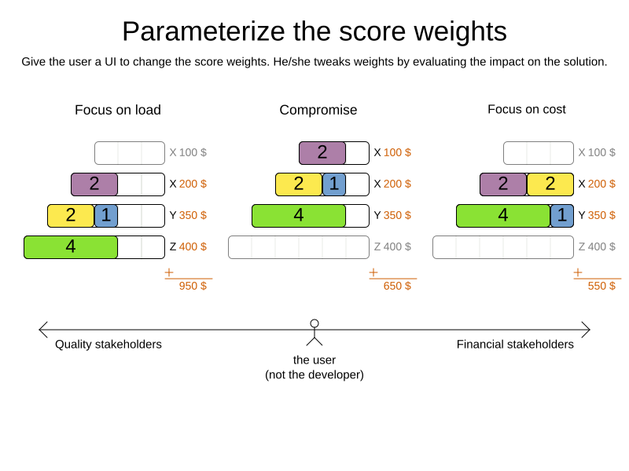

<a id="pdf-dest-f912b076aec80358"></a>

<a id="section-0261"></a>
### 20.1. Defining constraint weights

Let’s define three constraints:

- Constraint with a name of Vehicle capacity and a weight of 1hard.
- Constraint with a name of Service finished after max end time, also with a weight of 1hard.
- Constraint with a name of Minimize travel time and a weight of 1soft.

Using [the Constraint Streams API](#pdf-dest-90641d67d73d7e7b), this is done as follows:

Java

```
public class VehicleRoutingConstraintProvider implements ConstraintProvider {

    public static final String VEHICLE_CAPACITY = "Vehicle capacity";
    public static final String SERVICE_FINISHED_AFTER_MAX_END_TIME = "Service
finished after max end time";
    public static final String MINIMIZE_TRAVEL_TIME = "Minimize travel time";

    ...

    @Override
    public Constraint[] defineConstraints(ConstraintFactory factory) {
        return new Constraint[] {
                vehicleCapacity(factory),
                serviceFinishedAfterMaxEndTime(factory),
                minimizeTravelTime(factory)
        };
    }

    Constraint vehicleCapacity(ConstraintFactory factory) {
        return factory.forEach(Vehicle.class)
                ...
                .penalize(HardSoftScore.ONE_HARD, ...)
                .asConstraint(VEHICLE_CAPACITY);
    }

    Constraint serviceFinishedAfterMaxEndTime(ConstraintFactory factory) {
        return factory.forEach(Visit.class)
                ...
                .penalize(HardSoftScore.ONE_HARD, ...)
                .asConstraint(SERVICE_FINISHED_AFTER_MAX_END_TIME);
    }

    Constraint minimizeTravelTime(ConstraintFactory factory) {
        return factory.forEach(Vehicle.class)
                ...
                .penalize(HardSoftScore.ONE_SOFT, ...)
                .asConstraint(MINIMIZE_TRAVEL_TIME);
    }
}
```

Using static string constants for constraint names is recommended. It prevents

typos and ensures the constraint name is consistent across the ConstraintProvider

and any code that references constraints by name, such as when applying overrides.

<a id="pdf-dest-61a2428e1ccb3e1d"></a>

<a id="section-0262"></a>
### 20.2. Enabling weight overrides

Without anything else, the constraint weights are fixed to the values specified in the ConstraintProvider. To be able to override these weights at runtime, add a ConstraintWeightOverrides field to the planning solution class:

Java

```
@PlanningSolution
public class VehicleRoutePlan {

    ...
    ConstraintWeightOverrides<HardSoftScore> constraintWeightOverrides;

    void setConstraintWeightOverrides(ConstraintWeightOverrides<HardSoftScore>
constraintWeightOverrides) {
        this.constraintWeightOverrides = constraintWeightOverrides;
    }

    ConstraintWeightOverrides<HardSoftScore> getConstraintWeightOverrides() {
        return constraintWeightOverrides;
    }

    ...
}
```

The field will be automatically exposed as a [problem fact](#pdf-dest-8009ea799c9392b9), there is no need to add a @ProblemFactProperty annotation.

<a id="pdf-dest-59688ab3d6e71947"></a>

<a id="section-0263"></a>
### 20.3. ModelConfigOverrides

ModelConfigOverrides is a marker interface from ai.timefold.solver.service.definition.api. Implement it with a plain class that declares all fields a caller can override per request.

Fields linked to a specific constraint are annotated with @ConstraintReference. Fields that represent global configuration, not tied to any single constraint, require no annotation.

Java

```
public final class MyPlanConfigOverrides implements ModelConfigOverrides {

    // Constraint weight fields
    @ConstraintReference(MyConstraints.MINIMIZE_TRAVEL_TIME)
    private long minimizeTravelTimeWeight = 1L;

    @ConstraintReference(MyConstraints.PREFER_EARLY_COMPLETION)
    private long preferEarlyCompletionWeight = 0L;

    // Global config - not constraint-specific, no annotation required
    private double travelTimeAdjustment;

    // Standard getters, setters, and optional fluent "with" builders ...
}
```

Non-constraint global configuration that needs to vary per request can also live in

this class.

Be careful not to make your model overly configurable as that impacts usability. Usually, it doesn’t make sense to allow weight overrides for hard constraints.

<a id="pdf-dest-b0185f5b6dfaeb44"></a>

<a id="section-0264"></a>
### 20.4. @ConstraintReference

@ConstraintReference wires a field in your ModelConfigOverrides implementation to a named constraint.

| Attribute | Type | Default | Purpose |
| --- | --- | --- | --- |
| value | String | (required) | The constraint name. Must match the identifier<br>used in your ConstraintProvider. |

<a id="pdf-dest-54d179678b7c7853"></a>

<a id="section-0265"></a>
#### 20.4.1. Weight multipliers

Annotate a long field to make it a weight multiplier for that constraint. The value scales the constraint’s score contribution relative to other soft constraints.

A value of 0 effectively disables the constraint for that request. Higher values increase the constraint’s priority relative to others. Do keep the value significantly below Long.MAX_VALUE, since multiple constraints keep adding to the score impact across all their matches.

```
// Active by default
@ConstraintReference(MyConstraints.MINIMIZE_TRAVEL_TIME)
private long minimizeTravelTimeWeight = 1L;

// Disabled by default; callers can enable it by setting the weight above 0
@ConstraintReference(MyConstraints.PREFER_GROUPING_CO_LOCATED_VISITS)
private long preferGroupingCoLocatedVisitsWeight = 0L;
```

<a id="pdf-dest-9924d437d1d55f7f"></a>

<a id="section-0266"></a>
### 20.5. Applying overrides in ModelConvertor

The ModelConvertor implementation translates the caller’s overrides into the data structures the solver engine expects. It receives a ModelConfig<T> in toSolverModel() and must handle the case where the caller provided no overrides at all - modelConfig.overrides() may be null.

This requires a custom ModelConvertor. If your SolverModel also serves as ModelInput and ModelOutput, for example because you extend AbstractSimpleModel, the framework uses a trivial ModelConvertor by default, which ignores modelConfig entirely. With only the trivial convertor in place, constraint weight overrides submitted in a request are silently dropped: the request succeeds, but the override never reaches the solver. Provide your own ModelConvertor implementation, as shown below, to actually apply them.

<a id="pdf-dest-327b9b68dc24be96"></a>

<a id="section-0267"></a>
#### 20.5.1. Reading constraint weights

Build a Map<String, Score> from constraint names to score values, then pass it to ConstraintWeightOverrides.of(…) when constructing the solver model. When no overrides are provided, fall back to a default-constructed instance of your overrides class so that all defaults are centralised in one place.

Java

```
private static Map<String, HardMediumSoftScore>
        getConstraintWeightOverrides(ModelConfig<MyPlanConfigOverrides>
modelConfig) {

    MyPlanConfigOverrides overrides =
            modelConfig.overrides() != null
                    ? modelConfig.overrides()
                    : new MyPlanConfigOverrides(); // defaults come from field
initialisers

    return Map.ofEntries(
            Map.entry(MyConstraints.MINIMIZE_TRAVEL_TIME,
                    HardMediumSoftScore.ofSoft(overrides
.getMinimizeTravelTimeWeight())),
            Map.entry(MyConstraints.PREFER_EARLY_COMPLETION,
                    HardMediumSoftScore.ofSoft(overrides
.getPreferEarlyCompletionWeight())),
            Map.entry(MyConstraints.MINIMIZE_COMPLETION_RISK,
                    HardMediumSoftScore.ofSoft(overrides
.getMinimizeCompletionRiskWeight()))
    );
}
```

<a id="pdf-dest-95b41414b792617e"></a>

<a id="section-0268"></a>
#### 20.5.2. Reading constraint parameters

Extract parameter fields individually into a value object, or pass them directly to the solver model. Guard against null the same way as for weights.

```
private static ConstraintParameters
        getConstraintParameters(ModelConfig<MyPlanConfigOverrides> modelConfig) {

    if (modelConfig.overrides() == null) {
        return null;
    }
    MyPlanConfigOverrides overrides = modelConfig.overrides();
    return new ConstraintParameters(
            overrides.getBufferBeforeShiftEnd(),
            overrides.getMinimumPriorityLevel()
    );
}
```

Apply both in toSolverModel():

```
@Override
public MySolverModel toSolverModel(
        MyPlanInput input,
        ModelConfig<MyPlanConfigOverrides> modelConfig,
        Optional<MyPlanOutput> previousSolution) {

    Map<String, HardMediumSoftScore> weightOverrides = getConstraintWeightOverrides
(modelConfig);
    ConstraintParameters constraintParams = getConstraintParameters(modelConfig);

    return new MySolverModel(...)
            .withConstraintWeightOverrides(ConstraintWeightOverrides.of
(weightOverrides))
            .withConstraintParameters(constraintParams);
}
```

<a id="pdf-dest-40e01134c525d1db"></a>

<a id="section-0269"></a>
#### 20.5.3. ConstraintParameters in the solver model

The ConstraintParameters object is stored on the planning solution class and annotated with @ProblemFactProperty, which makes it visible to the constraint engine.

```
@ProblemFactProperty
private ConstraintParameters constraintParameters;
```

Because it is a problem fact and not a planning entity, the constraint engine does not iterate over it automatically. Constraints that need the parameter values must explicitly join against ConstraintParameters.class in their constraint stream.

```
protected Constraint minimizeCompletionRisk(ConstraintFactory factory) {
    return factory.forEach(MyVisit.class)
            .join(MyShift.class,
                    Joiners.equal(MyVisit::getShift, Function.identity()))
            .join(ConstraintParameters.class) ①
            .filter((visit, shift, params) ->
                    visit.getDepartureTime().isAfter(
                            shift.getEndTime().minus(params.bufferBeforeShiftEnd())))
            .penalize(HardMediumSoftScore.ONE_SOFT, ...)
            .asConstraint(MyConstraints.MINIMIZE_COMPLETION_RISK);
}
```

①The join has no Joiners condition because there is exactly one ConstraintParameters instance. Every tuple from the preceding stream is paired with it unconditionally.

Constraints that do not use any parameter values do not need this join. Only add it

where the constraint logic actually reads from ConstraintParameters.

<a id="pdf-dest-46f0fc48ae67e5f7"></a>

<a id="section-0270"></a>
### 20.6. Conventions

- Weight fields are long with a positive default. Use 0L to disable a constraint by default; use 1L or higher to enable it. Weight values must be non-negative.
- Parameter fields carry a sensible domain default. Use null only when the absence of a value is meaningful to the constraint. Otherwise initialise to a safe zero-value. e.g. Duration.ZERO, 0.0, the lowest tier string, and so on.
- Constraint names are constants. Define every constraint name as a public static final String in your ConstraintProvider. Never use inline string literals in @ConstraintReference.
- Global configuration is separate from constraints. Fields not linked to a specific constraint require no @ConstraintReference annotation. Extract and apply them independently in the convertor.
- Fluent builders are optional but encouraged. Providing withX() methods on your overrides class makes test setup and programmatic request construction significantly more readable.

<a id="pdf-dest-8ef2c09162a9774b"></a>

<a id="section-0271"></a>
## Chapter 21. Model enrichment

<a id="pdf-dest-a13e3840e27989cf"></a>

<a id="section-0272"></a>
### 21.1. What is model enrichment?

Model enrichment is the process of adding extra information to the SolverModel before solving starts. The service receives the planning problem as submitted through the REST API, but sometimes that raw model is incomplete: it may be missing derived fields, external lookups, or pre-computed values that are too expensive or impractical to calculate during solving.

Enrichers run once, just before the solver begins, and produce an augmented model that constraints can use directly.

Common use cases include:

- Looking up data from an external service or database (e.g. travel times, holiday calendars, price lists).
- Pinning entities that represent work already completed or committed.
- Pre-computing expensive derived values (e.g. distance matrices, compatibility scores) so constraints stay fast.

<a id="pdf-dest-0a71123d86280d7d"></a>

<a id="section-0273"></a>
### 21.2. Why enrich the model instead of computing inside constraints?

Constraint streams execute many times per second during solving. Any computation that can be done once before solving starts should be moved into model enrichment.

Never do computations that involve remote calls, database queries, or complex algorithms while the solver is running (e.g. inside constraint streams or shadow variables). This is an antipattern and will make the solver unusably slow.

<a id="pdf-dest-953c0ad1837e8854"></a>

<a id="section-0274"></a>
### 21.3. Best practices

Do

- Make enrichers idempotent: calling enrich() twice should produce the same result.
- Fail fast: if a required external resource is unavailable, throw an exception rather than silently returning an incomplete model.
- Use the SolverModelEnrichmentDirector to control ordering when one enricher depends on another.

Don’t

- Do not perform heavy computation inside constraint streams. Move it to an enricher instead.
- Do not keep mutable state in enrichers; they may be invoked concurrently from multiple threads.
- Do not use enrichment for validation that should happen at input time; reject bad input at

the API boundary, not here.

<a id="pdf-dest-194b8b0705b8fc85"></a>

<a id="section-0275"></a>
### 21.4. Implementing an enricher

To enrich the model, implement SolverModelEnricher and annotate it so it is picked up by your Dependency Injection (DI) container.

In this example, the Timetable planning solution contains Timeslot objects. Each Timeslot has an isHoliday field that must be populated by consulting an external calendar service.

Example 3. Timeslot class with the field to be enriched

Java

```
public class Timeslot {

    private LocalDateTime startTime;
    private LocalDateTime endTime;

    private boolean isHoliday; ①

    public void setHoliday(boolean isHoliday) {
        this.isHoliday = isHoliday;
    }

    // other Getters/Setters/Constructors excluded
}
```

①This field is not provided by the caller - it is populated by the enricher.

Example 4. Enricher implementation

Java

```
@ApplicationScoped
public class TimeslotHolidayEnricher implements SolverModelEnricher<Timetable>
{

    @Override
    public Timetable enrich(Timetable solverModel) {
        for (Timeslot timeslot : solverModel.getTimeslots()) {
            boolean isHoliday = overlapsWithKnownHoliday(timeslot.getStartTime
(), timeslot.getEndTime());
            timeslot.setHoliday(isHoliday);
        }
        return solverModel;
    }

    private boolean overlapsWithKnownHoliday(LocalDateTime start, LocalDateTime
end) {
        // Call an external service or database here.
        return false;
    }
}
```

<a id="pdf-dest-385c318d14f6b4d3"></a>

<a id="section-0276"></a>
### 21.5. Controlling enrichment order

When you have multiple enrichers, register a SolverModelEnrichmentDirector to control the order in which they run. This matters when one enricher builds on the output of another.

Example 5. Enrichment director that sequences enrichers explicitly

Java

```
@ApplicationScoped
public class TimetableEnrichmentDirector implements
SolverModelEnrichmentDirector<Timetable> {

    private final TimeslotHolidayEnricher timeslotEnricher;

    @Inject
    public TimetableEnrichmentDirector(TimeslotHolidayEnricher
timeslotEnricher) {
        this.timeslotEnricher = timeslotEnricher;
    }

    @Override
    public Timetable enrich(Timetable solverModel) {
        var enrichedModel = timeslotEnricher.enrich(solverModel);
        // Chain additional enrichers here, in dependency order.
        return enrichedModel;
    }
}
```

<a id="pdf-dest-b3818ffd094e3432"></a>

<a id="section-0277"></a>
## Chapter 22. Demo data

Providing example datasets is a good way to help consumers understand the expected input of your model. This page describes how to provide dedicated support for exposing demo data.

This page describes features which are only relevant when running [Timefold](#pdf-dest-b0cf9433387dd842)

Solver as a service.

The information on these pages may describe functionality which may be changed or even removed in a future release.

<a id="pdf-dest-97e336313dd35aaf"></a>

<a id="section-0278"></a>
### 22.1. Generating demo data

To provide consumers of your model with example datasets, implement the DemoDataGenerator interface. This interface requires you to implement 2 methods:

- demoMetaData(): returns a list of metadata, listing all the different datasets available.
- generateDemoData(String demoDataId): generates the dataset with the given id, usually retrieved from the metadata. This method returns a DemoData object wrapping a ModelRequest, whose ModelInput_ type parameter must match the ModelInput implementation used by your REST API (see [REST API](./rest-api.pdf)).

Implementations of this interface must be dependency free meaning simple

instantiation (even with reflection) of this class is enough to generate demo data.

Java

```
@ApplicationScoped
public class TimetableDemoDataGenerator implements DemoDataGenerator {

    public enum DemoDataKind {
        BASIC(
            new DemoMetaData("BASIC", "SHORT_DESCRIPTION", "LONG_DESCRIPTION",
List.of("TAGS"),
                List.of()),
            DemoDataKind::generateBasicDemoData // could also delegate to
another class instead
        ),
        COMPLEX_SET(
            new DemoMetaData("COMPLEX_SET", "SHORT_DESCRIPTION",
"LONG_DESCRIPTION", List.of("TAGS"),
                List.of()),
            DemoDataKind::generateComplexSet
        );

        private final DemoMetaData metaData;
        private final Function<DemoDataKind, ModelRequest<TimetableInput,
TimetableConfigOverrides>> requestFunction;
        DemoDataKind(DemoMetaData metaData,
                Function<DemoDataKind, ModelRequest<TimetableInput,
TimetableConfigOverrides>> requestFunction) {
            this.metaData = metaData;
            this.requestFunction = requestFunction;
        }

        public DemoMetaData getMetaData() {
            return metaData;
        }

        public DemoData getDemoData() {
            return new DemoData(metaData, requestFunction.apply(this));
        }

        public ModelRequest<TimetableInput, TimetableConfigOverrides>
generateBasicDemoData() {
            // Generate basic request.
        }

        public ModelRequest<TimetableInput, TimetableConfigOverrides>
generateComplexSet() {
            // Generate complex request.
        }
    }

    @Override
    public List<DemoMetaData> demoMetaData() {
        return Stream.of(DemoDataKind.values())
                .map(demoDataKind -> demoDataKind.getMetaData())
                .toList();
    }

    @Override
    public DemoData generateDemoData(String demoDataId) {
        return DemoDataKind.fromString(demoDataId).getDemoData();
    }
}
```

When implementing these generator methods, construct a ModelRequest to wrap the input. ModelRequest has two constructors: ModelRequest(ModelInput_ modelInput), which defaults the configuration to null, and ModelRequest(Configuration<ModelConfigurationOverrides_> configuration, ModelInput_ modelInput), if you also want to set a non-default configuration. There is no constructor that takes the model config overrides directly; overrides are wrapped in a Configuration object first.

If you decouple your REST API classes from your solver domain using a

ModelConvertor, ModelRequest must wrap your ModelInput implementation, not the SolverModel (the @PlanningSolution class). Pay extra attention to returning the correct class here, since both may look similar but only the ModelInput implementation is valid.

With this interface implemented, Timefold Solver will automatically expose these methods as REST endpoints. These endpoints are not nested under your ModelRest resource path: they only share its version prefix. See [Generated endpoints](./rest-api.pdf#generatedEndpoints) for the exact path.

Two GET endpoints are generated for retrieving a demo dataset, differing in response shape:

- GET /demo-data/{demoDataId} returns the full Solving Request, wrapping your ModelInput in the config/modelInput envelope described in [Request and response structure](./rest-api.pdf#requestResponseStructure). POST it straight to your ModelRest resource to start solving.
- GET /demo-data/{demoDataId}/input returns just the ModelInput object, without the envelope. Use this if you already have your own config and only need the model input.

<a id="pdf-dest-7928990c73cd613e"></a>

<a id="section-0279"></a>
## Chapter 23. Exposing metrics

Timefold Solver provides a mechanism to collect metrics about both the input submitted to the solver and the output it produces. These metrics are automatically exposed through the [REST API](./rest-api.pdf) alongside the optimization result, making it straightforward to build dashboards, monitoring screens, and insights views on top of them, without any additional endpoints or custom logic.

This page describes features which are only relevant when running [Timefold](#pdf-dest-b0cf9433387dd842)

Solver as a service.

The information on these pages may describe functionality which may be changed or even removed in a future release.

<a id="pdf-dest-1062e384846d699a"></a>

<a id="section-0280"></a>
### 23.1. Input metrics

Input metrics provide more information about the data provided to the solver. The metrics should be contained in a class or record which implements the ModelInputMetrics interface.

The input metrics will be exposed through the [REST API](./rest-api.pdf), for which an OpenAPI spec will be generated. It is therefore necessary to add [OpenAPI Specification](./rest-api.pdf#openAPISpecification) annotations to the fields.

Example 6. Example for School Timetabling

Java

```
public record TimetableInputMetrics(
    @JsonFormat(shape = JsonFormat.Shape.NUMBER_INT) @Schema(name = "lessons",
title = "Lessons",
            format = DataFormat.Values.NUMBER, description = "The number of
lessons submitted in the input dataset.",
            type = SchemaType.NUMBER, example = "10", readOnly = true) int
lessons,
    @JsonFormat(shape = JsonFormat.Shape.NUMBER_INT) @Schema(name = "timeslots
", title = "Timeslots",
            format = DataFormat.Values.NUMBER, description = "The number of
timeslots submitted in the input dataset.",
            type = SchemaType.NUMBER, example = "30", readOnly = true) int
timeslots
    ) implements ModelInputMetrics {}
```

Next, the SolverModel should implement the InputMetricsAware interface and construct the defined ModelInputMetrics object. Example 7. Example for School Timetabling

Java

```
@PlanningSolution
public class Timetable implements SolverModel<HardMediumSoftScore>,
InputMetricsAware<TimetableInputMetrics> {

    @ProblemFactCollectionProperty
    @ValueRangeProvider
    private List<Timeslot> timeslots;

    @PlanningEntityCollectionProperty
    private List<Lesson> lessons;

    @PlanningScore
    private HardMediumSoftScore score;

    @Override
    public HardMediumSoftScore getScore() {
        return score;
    }

    @Override
    public TimetableInputMetrics getInputMetrics() {
        return new TimetableInputMetrics(lessons.size(), timeslots.size());
    }

    // other Getters/Setters/Constructors excluded
}
```

<a id="pdf-dest-bfcf4e6d8ddcefeb"></a>

<a id="section-0281"></a>
### 23.2. Output metrics

Output metrics provide more information about the result produced by the solver, such as solution quality indicators or key performance indicators (KPIs).

Output metrics are calculated after solving completes. They should be derived from the solved SolverModel, not from the input.

Like input metrics, they are exposed through the [REST API](./rest-api.pdf) under the kpis field of the response. It is therefore necessary to add [OpenAPI Specification](./rest-api.pdf#openAPISpecification) annotations to the fields.

If a metric is a timestamp, use java.time.OffsetDateTime or java.time.Instant, not

java.time.LocalDateTime. The platform’s date-time format validation expects a

timezone offset (for example 2027-02-02T09:00:00Z); LocalDateTime serializes without one and fails validation.

Example 8. Example for School Timetabling

Java

```
public record TimetableOutputMetrics(
    @JsonFormat(shape = JsonFormat.Shape.NUMBER_INT) @Schema(name =
"unassignedLessons", title = "Unassigned lessons",
            format = DataFormat.Values.NUMBER, description = "The number of
lessons that could not be assigned a timeslot or room.",
            type = SchemaType.NUMBER, example = "0", readOnly = true) int
unassignedLessons,
    @JsonFormat(shape = JsonFormat.Shape.NUMBER_INT) @Schema(name =
"maxConsecutiveLessons", title = "Max consecutive lessons",
            format = DataFormat.Values.NUMBER, description = "The maximum
number of consecutive lessons assigned to any single teacher.",
            type = SchemaType.NUMBER, example = "3", readOnly = true) int
maxConsecutiveLessons
    ) implements ModelOutputMetrics {}
```

Next, the SolverModel should implement the OutputMetricsAware interface and construct the defined ModelOutputMetrics object from the solved state.

Example 9. Example for School Timetabling

Java

```
@PlanningSolution
public class Timetable implements SolverModel<HardMediumSoftScore>,
OutputMetricsAware<TimetableOutputMetrics> {

    @ProblemFactCollectionProperty
    @ValueRangeProvider
    private List<Timeslot> timeslots;

    @PlanningEntityCollectionProperty
    private List<Lesson> lessons;

    @PlanningScore
    private HardMediumSoftScore score;

    @Override
    public HardMediumSoftScore getScore() {
        return score;
    }

    @Override
    public TimetableOutputMetrics getOutputMetrics() {
        int unassigned = (int) lessons.stream()
                .filter(l -> l.getTimeslot() == null || l.getRoom() == null)
                .count();
        int maxConsecutive = computeMaxConsecutiveLessons(lessons);
        return new TimetableOutputMetrics(unassigned, maxConsecutive);
    }

    // other Getters/Setters/Constructors excluded
}
```

<a id="pdf-dest-457759c07a100154"></a>

<a id="section-0282"></a>
### 23.3. Combining input and output metrics

A SolverModel can implement both InputMetricsAware and OutputMetricsAware at the same time.

Java

```
@PlanningSolution
public class Timetable implements SolverModel<HardMediumSoftScore>,
        InputMetricsAware<TimetableInputMetrics>,
        OutputMetricsAware<TimetableOutputMetrics> {

    // fields, getInputMetrics(), getOutputMetrics() excluded

}
```

<a id="pdf-dest-32686ca75305e9da"></a>

<a id="section-0283"></a>
## Chapter 24. Service consumer guide

This guide is for developers who want to consume a service built with Timefold Solver using the service module.

A Timefold Solver service exposes a REST API with a predictable structure. Every service follows the same lifecycle: submit a problem, wait for the result, and optionally terminate early or inspect the score. The exact endpoint paths and request/response shapes vary per model, but the patterns described here apply to any service built with the service module.

If you are integrating with a service deployed on the Timefold Platform, see the [platform documentation on receiving model API results](https://docs.timefold.ai/timefold-platform/latest/api/receiving-model-api-results/receiving-model-api-results) for platform-specific callback and webhook mechanisms.

<a id="pdf-dest-2fee0982b9a04419"></a>

<a id="section-0284"></a>
### 24.1. Discover the API

Every Timefold Solver service publishes an OpenAPI specification when run with mvn quarkus:dev. Use it to discover the exact endpoint paths, request and response schemas, and available operations for the specific model you are integrating with.

You can also explore the specification interactively through the Swagger UI at /q/swagger-ui when the service is running locally.

<a id="pdf-dest-2b243e33c12cbbec"></a>

<a id="section-0285"></a>
### 24.2. Try it out with demo data

If the service exposes demo data, you can use it to get a realistic request body without constructing one yourself. This is the fastest way to test connectivity with the service.

<a id="pdf-dest-cbf3baaee245c244"></a>

<a id="section-0286"></a>
#### 24.2.1. List available demo datasets

```
GET /v<version>/demo-data
```

Returns a list of available demo dataset identifiers and their descriptions.

Example response

```
[
    {
    "id": "BASIC",
    "shortDescription": "A small dataset suitable for quick tests.",
    "longDescription": "10 lessons, 5 timeslots, 2 rooms.",
    "tags": ["small"]
    },
    {
    "id": "COMPLEX_SET",
    "shortDescription": "A larger, more realistic dataset.",
    "longDescription": "200 lessons across multiple rooms and days.",
    "tags": ["large", "realistic"]
    }
]
```

<a id="pdf-dest-dd5250a300bd2cd8"></a>

<a id="section-0287"></a>
#### 24.2.2. Retrieve a demo dataset

```
GET /v<version>/demo-data/{demoDataId}
```

Returns a fully formed solving request body, the same structure expected by POST /<root>. You can submit it directly or use it as a template to understand the expected input format.

Example

```
# Retrieve the demo dataset
curl http://localhost:8080/v1/demo-data/BASIC

# Pipe it directly into a solve request
curl -X POST http://localhost:8080/v1/timetables \
    -H "Content-Type: application/json" \
    -d "$(curl -s http://localhost:8080/v1/demo-data/BASIC)"
```

<a id="pdf-dest-1d8cb68f6e12ad77"></a>

<a id="section-0288"></a>
### 24.3. Submit a run

```
POST /<root>
```

Submits a planning problem for optimization and (by default) requests solving immediately. The service returns a dataset ID right away and processes validation/output computation/solving asynchronously; pass ?operation=NONE to store/validate/compute without solving.

<a id="pdf-dest-fe1d147a312cf471"></a>

<a id="section-0289"></a>
#### 24.3.1. Request structure

The request body is a JSON envelope with one required top-level field (modelInput) and one optional field (config).

```
{
    "config": {
    "run": {
        "name": "my-run",
        "termination": {
        "spentLimit": "PT5M",
        "unimprovedSpentLimit": "PT30S"
        },
        "maxThreadCount": 1,
        "tags": ["production", "monday"]
    }
    },
    "modelInput": { ①
    }
}
```

①The modelInput field contains your planning problem data. Its structure is specific to the model - consult the OpenAPI specification for the exact schema.

The run configuration controls how long the solver runs:

| Field | Description |
| --- | --- |
| name | A human-readable name for the run. Auto-generated if omitted. |
| maxThreadCount | Number of solver threads. Defaults to 1. |
| tags | Optional labels for filtering or grouping runs. |

Termination settings can be specified per dataset to override the hardcoded termination settings.

- spentLimit sets the maximum duration (in ISO 8601 duration format) for solving a dataset.
- unimprovedSpentLimit sets the maximum duration (in ISO 8601 duration format) for solving a dataset since the dataset score improved. If no value is provided, the default diminished returns termination will apply. If set, stepCountLimit and moveCountLimit must be empty. Warning: using this option will disable the default diminished returns termination which is recommended for most use cases
- stepCountLimit sets the maximum solver step count for solving a dataset. The solver will stop solving after a pre-determined amount of steps. Use when you require results independently of the hardware resources performance. Use this termination if you want to benchmark your models, not recommended for production use. If set, unimprovedSpentLimit must be empty. Warning: using this option will disable the default diminished returns termination which is recommended for most use cases.
- moveCountLimit sets the maximum number of moves evaluated by the solver for solving a dataset. The solver will stop solving after a pre-determined amount of moves have been evaluated. Use when you require results independently of the hardware resources performance. Use this termination if you want to benchmark your models, not recommended for production use. If set, unimprovedSpentLimit must be empty. Warning: using this option will disable the default diminished returns termination which is recommended for most use cases. Can be combined with stepCountLimit: the solver stops as soon as either limit is reached.
- slidingWindowDuration sets the sliding window (in ISO 8601 duration format) over which score improvement is measured by the diminished returns termination. Defaults to PT30S when omitted. Only takes effect when diminished returns termination is active (i.e. unimprovedSpentLimit, stepCountLimit and moveCountLimit are all empty).
- minimumImprovementRatio sets the minimum ratio between current and initial improvement before the diminished returns termination kicks in. Must be strictly positive. Defaults to 0.0001 when omitted. Only takes effect when diminished returns termination is active (i.e. unimprovedSpentLimit, stepCountLimit and moveCountLimit are all empty).

<a id="pdf-dest-3ead691afa049e35"></a>

<a id="section-0290"></a>
#### 24.3.2. Response

The service responds with HTTP 202 (Accepted) and a Metadata object. The key field to capture is id, you will need it to poll for results.

```
{
    "id": "7f3a91bc-4e2d-4c1a-b8f6-1234567890ab", ①
    "name": "my-run",
    "solverStatus": "DATASET_CREATED", ②
    "submitDateTime": "2025-06-01T09:00:00Z",
    "tags": ["production", "monday"]
}
```

①Store this id to poll for results.

②The dataset was accepted and will be processed asynchronously (validation, output computation, and solving if requested).

<a id="pdf-dest-5b856867be2ce7e3"></a>

<a id="section-0291"></a>
### 24.4. Poll for results

```
GET /<root>/{id}
```

Returns the current state of a submitted run, including the best solution found so far. Unlike the submit response (which returns Metadata only), this endpoint returns the full response envelope (metadata, modelOutput, inputMetrics, kpis).

<a id="pdf-dest-8b35ff370ca920a3"></a>

<a id="section-0292"></a>
#### 24.4.1. Solver status lifecycle

The metadata.solverStatus field follows the dataset lifecycle and may include DATASET_CREATED, DATASET_VALIDATED, DATASET_COMPUTED, or DATASET_INVALID before/around the solving statuses below:

| Status | Meaning |
| --- | --- |
| SOLVING_SCHEDULED | Solving was requested for an existing dataset (for example POST<br>/<root>/{id}) and is waiting to start; submit requests typically transition<br>from DATASET_COMPUTED directly to SOLVING_STARTED. |
| SOLVING_STARTED | The run is initializing: the model is being built and enriched (e.g. loading<br>external data). Solving has not started yet. |
| SOLVING_ACTIVE | The solver is actively optimizing. The score field and modelOutput reflect<br>the best solution found so far. Poll repeatedly to show progress. |
| SOLVING_COMPLETED | Solving finished normally (termination condition was met). The result is<br>final. |
| SOLVING_FAILED | Solving terminated due to an error. |
| SOLVING_INCOMPLETE | Solving finished without producing a complete solution (for example,<br>terminated before a first score was produced). |

The run is complete once solverStatus is SOLVING_COMPLETED, SOLVING_FAILED, SOLVING_INCOMPLETE, or DATASET_INVALID.

<a id="pdf-dest-eaa6d96c4294efec"></a>

<a id="section-0293"></a>
#### 24.4.2. Polling vs Server-Sent Events

The service supports two ways to track a run in progress. Choose the one that fits your integration style:

|  | Polling | Server-Sent Events (SSE) |
| --- | --- | --- |
| How it works | You call GET /<root>/{id} repeatedly<br>on a timer. | You open a long-lived GET<br>/<root>/{id}/events connection; the<br>service pushes updates to you. |
| Response content | GET /<root>/{id} returns the full<br>envelope (metadata, modelOutput,<br>inputMetrics, kpis). Use GET<br>/<root>/{id}/metadata for a<br>lightweight status check when<br>intermediate results are not needed. | Metadata only. Fetch the full result<br>with GET /<root>/{id} once the stream<br>ends. |
| Best for | Simple integrations, batch backends,<br>or when you only need the final result. | Live progress UIs, dashboards, or any<br>case where you want immediate<br>notification of status changes. |
| Connection | Stateless - each request is<br>independent. | Stateful - holds an open HTTP<br>connection until the run completes. |
| Terminal state<br>handling | Detect by checking solverStatus on<br>each response. | Stop reading after the terminal<br>solverStatus event and close the<br>connection client-side. |

<a id="pdf-dest-20b27696af21b023"></a>

<a id="section-0294"></a>
#### 24.4.3. Polling

The service exposes two endpoints for polling:

- GET /<root>/{id} - returns the full response envelope including modelOutput, inputMetrics, and kpis. Use this when you want to show intermediate results as solving progresses.
- GET /<root>/{id}/metadata - returns only the Metadata object (status, score, timestamps). Use this when you only care about completion and want to avoid the cost of transferring the full solution on every poll.

A 2-5 second interval is a reasonable default for displaying live progress. If you only need the final result, poll less frequently or wait until the spentLimit has elapsed before making your first request.

Example: poll metadata until complete, then fetch the full result

```
ID="7f3a91bc-4e2d-4c1a-b8f6-1234567890ab"

while true; do
    STATUS=$(curl -s http://localhost:8080/v1/timetables/$ID/metadata | jq -r
'.solverStatus')
    echo "Status: $STATUS"

    case $STATUS in
    SOLVING_COMPLETED|SOLVING_FAILED|SOLVING_INCOMPLETE|DATASET_INVALID)
        echo "Done. Fetching full result..."
        curl -s http://localhost:8080/v1/timetables/$ID | jq '.metadata.score'
        break
        ;;
    esac

    sleep 3
done
```

<a id="pdf-dest-0db7dce922cb35c6"></a>

<a id="section-0295"></a>
#### 24.4.4. Server-Sent Events

```
GET /<root>/{id}/events
```

Opens an SSE stream for a submitted run. The service sends a Metadata JSON event whenever the run’s metadata is updated (typically on status changes and when a new best solution is found). The service stops emitting events once the run reaches a terminal state (SOLVING_COMPLETED, SOLVING_FAILED, SOLVING_INCOMPLETE, or DATASET_INVALID); close the connection client-side after receiving the terminal event. If the run is already in a terminal state when you connect, the service returns HTTP 410 Gone. In that case, retrieve the final result with a regular GET /<root>/{id} call.

The endpoint accepts an optional, repeatable status query parameter (for example, ?status=SOLVING_COMPLETED&status=SOLVING_FAILED) to receive events only for the specified statuses. Omit it to receive all transitions.

Example: stream status events until complete

```
curl -N -H "Accept: text/event-stream" \
    "http://localhost:8080/v1/timetables/7f3a91bc-4e2d-4c1a-b8f6-1234567890ab/events"
```

Example SSE event stream

```
data: {"id":"7f3a91bc-4e2d-4c1a-b8f6-
1234567890ab","solverStatus":"SOLVING_STARTED","score":null,...}

data: {"id":"7f3a91bc-4e2d-4c1a-b8f6-
1234567890ab","solverStatus":"SOLVING_ACTIVE","score":"-5hard/-20soft",...}

data: {"id":"7f3a91bc-4e2d-4c1a-b8f6-
1234567890ab","solverStatus":"SOLVING_COMPLETED","score":"0hard/-3soft",...}
```

After receiving the terminal event, fetch the full result (including modelOutput and metrics) with a single GET /<root>/{id} call. Example: filter to receive only the completion event

```
curl -N -H "Accept: text/event-stream" \
    "http://localhost:8080/v1/timetables/7f3a91bc-4e2d-4c1a-b8f6-
1234567890ab/events?status=SOLVING_COMPLETED&status=SOLVING_FAILED"
```

If you are integrating with the Timefold Platform, use the webhook mechanism to

receive a callback when solving completes, instead of polling or SSE.

<a id="pdf-dest-e4076f0fe3222d58"></a>

<a id="section-0296"></a>
### 24.5. Interpret the response

The response envelope always contains metadata and modelOutput. Depending on the model, it may also contain inputMetrics and kpis.

<a id="pdf-dest-83b3aeab071d1278"></a>

<a id="section-0297"></a>
#### 24.5.1. Metadata

```
{
    "metadata": {
    "id": "7f3a91bc-4e2d-4c1a-b8f6-1234567890ab",
    "name": "my-run",
    "solverStatus": "SOLVING_COMPLETED",
    "score": "0hard/-3soft",
    "submitDateTime": "2025-06-01T09:00:00Z",
    "startDateTime": "2025-06-01T09:00:01Z",
    "activeDateTime": "2025-06-01T09:00:02Z",
    "completeDateTime": "2025-06-01T09:05:00Z",
    "shutdownDateTime": "2025-06-01T09:05:01Z",
    "tags": ["production", "monday"],
    "validationResult": {
        "summary": "OK",
        "errors": [],
        "warnings": []
    }
    }
}
```

The score field encodes solution quality. A score with 0hard means all hard constraints are satisfied and the solution is feasible. Negative soft scores indicate soft constraint violations; closer to zero is better.

See [score documentation](#pdf-dest-ad22e4f145089b60) for more details.

The timestamps track each phase of the optimization lifecycle:

| Timestamp | Meaning |
| --- | --- |
| submitDateTime | When the dataset was received. Status: SOLVING_SCHEDULED. |

| Timestamp | Meaning |
| --- | --- |
| startDateTime | When model initialization began (loading external data, enrichment).<br>Status: SOLVING_STARTED. |
| activeDateTime | When the solver began optimizing. Status: SOLVING_ACTIVE. |
| completeDateTime | When solving finished. Status: SOLVING_COMPLETED or SOLVING_FAILED. |
| shutdownDateTime | When post-processing finished (e.g. score analysis, output enrichment).<br>All work is done. |

<a id="pdf-dest-e0d6ea75f4833c9f"></a>

<a id="section-0298"></a>
#### 24.5.2. Solution output

The modelOutput field contains the solved planning problem in the model’s output format. Its structure is model-specific - consult the OpenAPI specification.

<a id="pdf-dest-be75e299f4dacf0c"></a>

<a id="section-0299"></a>
#### 24.5.3. Metrics

If the model exposes [input and output metrics](./exposing-metrics.pdf), they appear as top-level fields:

```
{
    "inputMetrics": {
    "lessons": 200,
    "timeslots": 50
    },
    "kpis": {
    "unassignedLessons": 0,
    "maxConsecutiveLessons": 3
    }
}
```

Use inputMetrics to confirm the solver received the expected problem size, and kpis to assess solution quality without parsing the full modelOutput.

<a id="section-0300"></a>
### 24.6. Inspect score analysis

This feature is exclusive to [Timefold Solver Enterprise Edition](#pdf-dest-601e0ae9a75a4274).

```
GET /<root>/{id}/score-analysis
```

Returns a breakdown of which constraints are satisfied or violated, and by how much. This is useful for debugging infeasible solutions or explaining results to end users.

```
{
    "score": "0hard/-3soft",
    "constraints": [
    {
        "name": "Room conflict",
        "score": "0hard",
        "matchCount": 0
    },
    {
        "name": "Teacher time preference",
        "score": "-3soft",
        "matchCount": 3
    }
    ]
}
```

<a id="pdf-dest-14c134c9e2521acd"></a>

<a id="section-0301"></a>
### 24.7. Terminate a run early

```
DELETE /<root>/{id}
```

After termination, the solverStatus is final (typically SOLVING_COMPLETED, or SOLVING_INCOMPLETE if no score was produced).

Use this when the user no longer needs a result, or when a better input is available and you want to start a fresh run.

```
curl -X DELETE http://localhost:8080/v1/timetables/7f3a91bc-4e2d-4c1a-b8f6-
1234567890ab
```

<a id="pdf-dest-e3cbea9f57a08e96"></a>

<a id="section-0302"></a>
### 24.8. Handle validation errors

If the input fails validation, the response includes error details in metadata.validationResult.

Simple validation result (always present in the response)

```
{
    "metadata": {
    "solverStatus": "DATASET_INVALID",
    "validationResult": {
        "summary": "ERRORS",
        "errors": ["Duplicate teacher names found."],
        "warnings": []
    }
    }
}
```

For structured, machine-readable validation errors, use the dedicated endpoint:

```
GET /<root>/{id}/validation-result
{
    "status": "ERRORS",
    "issues": [
    {
        "id": 1,
        "code": "DUPLICATE_TEACHER",
        "severity": "ERROR",
        "detail": {
        "teacherName": "Ann"
        }
    }
    ]
}
```

See [Validating REST input](./rest-api.pdf#validatingRestInput) for details on how services implement validation.

<a id="pdf-dest-d9e0e0d130c7b72d"></a>

<a id="section-0303"></a>
## Chapter 25. Using Timefold Solver as a Library

When [running as a service](#pdf-dest-601e0ae9a75a4274), the framework manages the Solver and SolverManager on your behalf, you interact only through the REST API. When embedding Timefold Solver as a library, your code drives the entire solving lifecycle. This page covers what that means in practice.

<a id="pdf-dest-6ccbee1266ab7c95"></a>

<a id="section-0304"></a>
### 25.1. Solver basics

At its core, a Solver takes a planning problem and returns the best solution it finds within the configured time limit:

Java

```
Timetable problem = ...;
Timetable bestSolution = solver.solve(problem);
```

The Solver wades through [the search space](#pdf-dest-9fb07ae9f08d2d1c) of possible solutions and remembers the best it encounters. Depending on the problem size, time budget, and configuration, [that solution may or](#pdf-dest-ae2450e5d591fc8f) [may not be optimal](#pdf-dest-ae2450e5d591fc8f).

The instance passed to solve(solution) is cloned by the Solver. Do not treat it as the best solution. Use the returned [instance](#pdf-dest-565fb1d17532a1e8) instead, which is most likely a [planning clone](#pdf-dest-565fb1d17532a1e8) of the input.

The input may be partially or fully initialized, which is common in repeated

[planning](#pdf-dest-601e0ae9a75a4274).

However, Solver.solve() blocks the calling thread for the entire duration of solving. This makes it unsuitable for use in REST endpoints or anywhere you need to handle multiple problems concurrently. SolverManager solves both problems.

<a id="pdf-dest-4e8ab949c96cdd9e"></a>

<a id="section-0305"></a>
### 25.2. SolverManager

A SolverManager is a facade for one or more Solver instances to simplify solving planning problems in REST and other enterprise services. Unlike the Solver.solve(…) method:

- SolverManager.solve(…) returns immediately: it schedules a problem for asynchronous solving without blocking the calling thread. This avoids timeout issues of HTTP and other technologies.
- SolverManager.solve(…) solves multiple planning problems of the same domain, in parallel.

Internally a SolverManager manages a thread pool of solver threads, which call Solver.solve(…), and a thread pool of consumer threads, which handle best solution changed events. In [Quarkus](#pdf-dest-1ab8ade1829825d4) and Spring Boot, the SolverManager instance is automatically injected in your code. ([source](#pdf-dest-bd8f299169ad8ea1)) Otherwise, build a SolverManager instance with the create(…) method:

Java

```
SolverConfig solverConfig = SolverConfig.createFromXmlResource(
".../solverConfig.xml");
SolverManager<VehicleRoutePlan, String> solverManager = SolverManager.create
(solverConfig, new SolverManagerConfig());
```

Each problem submitted to the SolverManager.solve(…) methods needs a unique problem ID. Later calls to getSolverStatus(problemId) or terminateEarly(problemId) use that problem ID to distinguish between the planning problems. The problem ID must be an immutable class, such as Long, String or java.util.UUID.

The SolverManagerConfig class has a parallelSolverCount property, that controls how many solvers are run in parallel. For example, if set to 4, submitting five problems has four problems solving immediately, and the fifth one starts when another one ends. If those problems solve for 5 minutes each, the fifth problem takes 10 minutes to finish. By default, parallelSolverCount is set to AUTO, which resolves to half the CPU cores, regardless of the [moveThreadCount](running-timefold-solver/multithreaded-solving.pdf#multithreadedIncrementalSolving) of the solvers.

To retrieve the best solution, after solving terminates normally, use SolverJob.getFinalBestSolution():

Java

```
VehicleRoutePlan problem1 = ...;
String problemId = UUID.randomUUID().toString();
// Returns immediately
SolverJob<VehicleRoutePlan, String> solverJob = solverManager.solve(problemId,
problem1);
...

try {
    // Returns only after solving terminates
    VehicleRoutePlan solution1 = solverJob.getFinalBestSolution();
} catch (InterruptedException | ExecutionException e) {
    throw ...;
}
```

However, there are better approaches, both for solving batch problems before an end-user needs the solution as well as for live solving while an end-user is actively waiting for the solution, as explained below.

The current SolverManager implementation runs on a single computer node, but future work aims to distribute solver loads across a cloud.

<a id="pdf-dest-dc8cc52964fd8d20"></a>

<a id="section-0306"></a>
### 25.3. The SolverManager Builder

The SolverManager also enables the creation of a builder to customize and submit a planning problem for solving.

Java

```
public interface SolverManager<Solution_> {

    SolverJobBuilder<Solution_, ProblemId_> solveBuilder();

    ...
}
```

<a id="pdf-dest-cba90f8d3b469eaf"></a>

<a id="section-0307"></a>
#### 25.3.1. Required settings

The SolverJobBuilder contract includes many optional methods, but only two are required: withProblemId(…) and withProblem(…).

Java

```
solverManager.solveBuilder()
        .withProblemId(problemId)
        .withProblem(problem)
...
```

The job’s unique ID is specified using withProblemId(problemId). The provided ID allows for the identification of a specific problem, enabling actions such as checking the solving status or terminating its execution. In addition to the unique ID, we must specify the problem to solve using withProblem(problem).

<a id="pdf-dest-49efb8972afa956a"></a>

<a id="section-0308"></a>
#### 25.3.2. Optional settings

Additional optional methods are also included in the SolverJobBuilder contract:

Java

```
solverManager.solveBuilder()
        .withProblemId(problemId)
        .withProblem(problem)
        .withFirstInitializedSolutionEventConsumer
(firstInitializedSolutionEventConsumer)
        .withBestSolutionEventConsumer(bestSolutionEventConsumer)
        .withFinalBestSolutionEventConsumer(finalBestSolutionEventConsumer)
        .withExceptionHandler(exceptionHandler)
        .withConfigOverride(configOverride)
...
```

A consumer for the first initialized solution can be configured with withFirstInitializedSolutionEventConsumer(…). The solution is returned by the last phase that immediately precedes the first local search phase.

Whenever a new best solution is generated by the solver, it can be consumed by configuring it with withBestSolutionEventConsumer(…). The final best solution consumer, which is called at the end of the solving process, can be set using withFinalBestSolutionEventConsumer(…). Additionally, an improved solution consumer capable of throttling events is available in the [Enterprise Edition](#pdf-dest-24afffa957a4858c) of the Timefold Solver.

Do not modify the solutions returned by the events in

withFirstInitializedSolutionEventConsumer(…) and

withBestSolutionEventConsumer(…). These instances are still utilized during the solving process, and any modifications may lead to solver corruption.

<a id="pdf-dest-24afffa957a4858c"></a>

25.3.2.1. Throttling best solution events in SolverManager

This feature is exclusive to [Timefold Solver Enterprise Edition](#pdf-dest-601e0ae9a75a4274).

This feature helps you avoid overloading your system with best solution events, especially in the early phase of the solving process when the solver is typically improving the solution very rapidly.

To enable event throttling, use ThrottlingBestSolutionEventConsumer when starting a new SolverJob using SolverManager:

```
...
import ai.timefold.solver.enterprise.core.api.ThrottlingBestSolutionEventConsumer;
import java.time.Duration;
...

public class TimetableService {

    private SolverManager<Timetable, Long> solverManager;

    public String solve(Timetable problem) {
        var bestSolutionEventConsumer = ThrottlingBestSolutionEventConsumer.of(
            event -> {
                // Your custom event handling code goes here.
            },
            Duration.ofSeconds(1)); // Throttle to 1 event per second.

        String jobId = ...;
        solverManager.solveBuilder()
                .withProblemId(jobId)
                .withProblem(problem)
                .withBestSolutionEventConsumer(bestSolutionEventConsumer)
                .run(); // Start the solver job and listen to best solutions, with
throttling.
        return jobId;
    }

}
```

This will ensure that your system will never receive more than one best solution event per second. Some other important points to note:

- If multiple events arrive during the pre-defined 1-second interval, only the last event will be delivered.
- When the SolverJob terminates, the last event received will be delivered regardless of the throttle, unless it was already delivered before.
- If your consumer throws an exception, we will still count the event as delivered.
- If the system is too occupied to start and execute new threads, event delivery will be delayed until a thread can be started.

If you are using the ThrottlingBestSolutionEventConsumer for intermediate best solutions together with a final best solution consumer, both these consumers will receive the final best solution.

To handle errors that may arise during the solving process, set up the handling logic by defining withExceptionHandler(…).

Finally, to build an instance of the solver, [a configuration step](#pdf-dest-601e0ae9a75a4274) is necessary. These settings are static and applied to any related solving execution. If you want to override certain settings for a particular job, such as the termination configuration, you can use the withConfigOverride(…) method.

The solver also permits the configuration of multiple solver managers with distinct

settings in [Quarkus](#pdf-dest-c11a8df707f2e292) or Spring Boot. ([source](#pdf-dest-2dec32096695fdf8))

<a id="pdf-dest-f607d58f5e21f704"></a>

<a id="section-0309"></a>
#### 25.3.3. Solve batch problems

At night, batch solving is a great approach to deliver solid plans by breakfast, because:

- There are typically few or no problem changes in the middle of the night. Some organizations even enforce a deadline, for example, submit all day off requests before midnight.
- The solvers can run for much longer, often hours, because nobody’s waiting for it and CPU resources are often cheaper.

To solve a multiple datasets in parallel (limited by parallelSolverCount), call solve(…) for each dataset: Java

```
public class TimetableService {

    private SolverManager<Timetable, Long> solverManager;

    // Returns immediately, call it for every dataset
    public void solveBatch(Long timetableId) {
        solverManager.solve(timetableId,
                // Called once, when solving starts
                this::findById,
                // Called once, when solving ends
                this::save);
    }

    public Timetable findById(Long timetableId) {...}

    public void save(Timetable timetable) {...}

}
```

A solid plan delivered by breakfast is great, even if you need to react on problem changes during the day.

<a id="pdf-dest-a9c46da5274bbe04"></a>

<a id="section-0310"></a>
#### 25.3.4. Solve and listen to show progress to the end-user

When a solver is running while an end-user is waiting for that solution, the user might need to wait for several minutes or hours before receiving a result. To assure the user that everything is going well, show progress by displaying the best solution and best score attained so far.

To handle intermediate best solutions, use solveAndListen(…):

Java

```
public class TimetableService {

    private SolverManager<Timetable, Long> solverManager;

    // Returns immediately
    public void solveLive(Long timetableId) {
        solverManager.solveAndListen(timetableId,
                // Called once, when solving starts
                this::findById,
                // Called multiple times, for every best solution change
                this::save);
    }

    public Timetable findById(Long timetableId) {...}
    public void save(Timetable timetable) {...}

    public void stopSolving(Long timetableId) {
        solverManager.terminateEarly(timetableId);
    }

}
```

This implementation is using the database to communicate with the UI, which polls the database. More advanced implementations push the best solutions directly to the UI or a messaging queue.

If the user is satisfied with the intermediate best solution and does not want to wait any longer for a better one, call SolverManager.terminateEarly(problemId).

Best solution events may be triggered in a rapid succession, especially at the start of solving.

Users of our Enterprise Edition may use the throttling feature to limit the number

of best solution events fired over any period of time.

Open-source users may implement their own throttling mechanism within the Consumer itself.

<a id="pdf-dest-640a8ee3d2569df8"></a>

<a id="section-0311"></a>
### 25.4. Java Platform Module System (JPMS)

Starting in version 2.0, Timefold Solver has official support for the [Java Platform Module System](https://openjdk.org/projects/jigsaw/spec/) [(JPMS)](https://openjdk.org/projects/jigsaw/spec/).

When using Timefold Solver from code on the modulepath, export the packages that contain your domain objects, constraints and solver configuration, and open them to the Timefold Solver module(s) in your module-info.java file:

```
module org.acme.vehiclerouting {
    requires ai.timefold.solver.core;
    ...

    exports org.acme.vehiclerouting.domain; // Domain classes
    exports org.acme.vehiclerouting.solver; // Constraints

    opens org.acme.vehiclerouting.domain to ai.timefold.solver.core; // Domain classes
    opens org.acme.vehiclerouting.solver to ai.timefold.solver.core; // Constraints
    ...
}
```

If this is not set up correctly, you will get errors. Usually, these mention the unnamed module and give detailed information of what needs to be changed.

```
class
org.acme.schooltimetabling.domain.Timetable$Timefold$MemberAccessor$Field$lessons (in
unnamed module @0x273444fe)
cannot access class org.acme.schooltimetabling.domain.Timetable (in module
hello.world.school.timetabling)
because module hello.world.school.timetabling does not export
org.acme.schooltimetabling.domain to unnamed module @0x273444fe
```

Only JPMS exported packages are part of the supported public API.

If you access non-exported classes (for example by running on the classpath), and we later change or remove them, we will not treat that as a breaking change. Those classes are not covered by compatibility guarantees.

You can opt-out of JPMS by running all JAR files on the classpath instead of using the module path (for example, by not configuring a module path in your build or runtime setup).

<a id="pdf-dest-e01266c80449072f"></a>

<a id="section-0312"></a>
## Chapter 26. Configuring Timefold Solver

<a id="pdf-dest-d777bbfdf53b0554"></a>

<a id="section-0313"></a>
### 26.1. Solver configuration by XML

Build a Solver instance with the SolverFactory. Configure the SolverFactory with a solver configuration XML file, provided as a classpath resource (as defined by ClassLoader.getResource()):

Java

```
        SolverFactory<Timetable> solverFactory = SolverFactory
.createFromXmlResource(
                "org/acme/schooltimetabling/solverConfig.xml");
        Solver<Timetable> solver = solverFactory.buildSolver();
```

In a typical project (following the Maven directory structure), that solverConfig XML file would be located at $PROJECT_DIR/src/main/resources/org/acme/schooltimetabling/solverConfig.xml. Alternatively, a SolverFactory can be created from a File with SolverFactory.createFromXmlFile(). However, for portability reasons, a classpath resource is recommended.

Both a Solver and a SolverFactory have a generic type called Solution_, which is the class representing a [planning problem and solution](#pdf-dest-377ca6bdb81ab0f0).

A solver configuration XML file looks like this:

```
<?xml version="1.0" encoding="UTF-8"?>
<solver xmlns="https://timefold.ai/xsd/solver" xmlns:xsi=
"http://www.w3.org/2001/XMLSchema-instance"
    xsi:schemaLocation="https://timefold.ai/xsd/solver
https://timefold.ai/xsd/solver/solver.xsd">
    <!-- Define the model -->
    <solutionClass>org.acme.schooltimetabling.domain.Timetable</solutionClass>
    <entityClass>org.acme.schooltimetabling.domain.Lesson</entityClass>

    <!-- Define the score function -->
    <scoreDirectorFactory>

<constraintProviderClass>org.acme.schooltimetabling.solver.TimetableConstraintProvider
</constraintProviderClass>
    </scoreDirectorFactory>

    <!-- Configure the optimization algorithms (optional) -->
    <termination>
    ...
    </termination>
    <constructionHeuristic>
    ...
    </constructionHeuristic>
    <localSearch>
    ...
    </localSearch>
</solver>
```

Notice the three parts in it:

- Define the model.
- Define the score function.
- Optionally configure the optimization algorithm(s).

These various parts of a configuration are explained further in this manual.

Timefold Solver makes it relatively easy to switch optimization algorithm(s) just by changing the configuration. There is even a [Benchmarker](#pdf-dest-e921478f36b99095) which allows you to play out different configurations against each other and report the most appropriate configuration for your use case.

<a id="pdf-dest-b10a7724e23766ea"></a>

<a id="section-0314"></a>
### 26.2. Solver configuration as code

A solver configuration can also be configured with the SolverConfig API. This is especially useful to change some values dynamically at runtime. For example, to change the running time based on system property, before building the Solver:

Java

```
        SolverConfig solverConfig = SolverConfig.createFromXmlResource(
"org/acme/schooltimetabling/solverConfig.xml");
        solverConfig.withTerminationConfig(new TerminationConfig()
                        .withMinutesSpentLimit(userInput));

        SolverFactory<Timetable> solverFactory = SolverFactory.create
(solverConfig);
        Solver<Timetable> solver = solverFactory.buildSolver();
```

Every element in the solver configuration XML is available as a *Config class or a property on a *Config class in the package namespace ai.timefold.solver.core.config. These *Config classes are the Java representation of the XML format. They build the runtime components (of the package namespace ai.timefold.solver.core.impl) and assemble them into an efficient Solver.

To configure a SolverFactory dynamically for each user request, build a template SolverConfig during initialization and copy it with the copy constructor for each user request:

Java

```
                private SolverConfig template;
                public void init() {
                    template = SolverConfig.createFromXmlResource(
            "org/acme/schooltimetabling/solverConfig.xml");
                    template.setTerminationConfig(new TerminationConfig());
                }

                // Called concurrently from different threads
                public void userRequest(..., long userInput) {
                    SolverConfig solverConfig = new SolverConfig(template);
            // Copy it
                    solverConfig.getTerminationConfig().
            setMinutesSpentLimit(userInput);
                    SolverFactory<Timetable> solverFactory = SolverFactory
            .create(solverConfig);
                    Solver<Timetable> solver = solverFactory.buildSolver();
                    ...
                }
```

<a id="pdf-dest-1a0a29e434787cac"></a>

<a id="section-0315"></a>
### 26.3. Annotation alternatives

Timefold Solver needs to be told which classes in your domain model are planning entities, which properties are planning variables, etc. There are several ways to deliver this information:

Java

- Add class annotations and JavaBean property annotations on the domain model (recommended). The property annotations must be on the getter method, not on the setter method. Such a getter does not need to be public.
- Add class annotations and field annotations on the domain model. Such a field does not need to be public.

This manual focuses on the first manner, but every feature supports both, even if it’s not explicitly mentioned.

<a id="pdf-dest-b13106eb78a3ed8c"></a>

<a id="section-0316"></a>
### 26.4. Custom properties configuration

Solver configuration elements, that instantiate classes and explicitly mention it, support custom properties. Custom properties are useful to tweak dynamic values through the [Benchmarker](#pdf-dest-e921478f36b99095). For example, presume your EasyScoreCalculator has heavy calculations (which are cached) and you want to increase the cache size in one benchmark:

```
<scoreDirectorFactory>
    <easyScoreCalculatorClass>...MyEasyScoreCalculator</easyScoreCalculatorClass>
    <easyScoreCalculatorCustomProperties>
    <property name="myCacheSize" value="1000"/><!-- Override value -->
    </easyScoreCalculatorCustomProperties>
</scoreDirectorFactory>
```

Add a public setter for each custom property, which is called when a Solver is built.

```
public class MyEasyScoreCalculator extends EasyScoreCalculator<MySolution,
SimpleScore> {

        private int myCacheSize = 500; // Default value

        @SuppressWarnings("unused")
        public void setMyCacheSize(int myCacheSize) {
            this.myCacheSize = myCacheSize;
        }

    ...
}
```

Most value types are supported (including boolean, int, double, BigDecimal, String and enums).

<a id="pdf-dest-25c7f68f4d4168da"></a>

<a id="section-0317"></a>
## Chapter 27. Adjusting constraints at runtime

Deciding the correct [weight](#pdf-dest-263ceb428fe9c7b6) and level for each constraint is not easy. It often involves negotiating ([source](#pdf-dest-219abeecbbbc28d1)) with different stakeholders and their priorities. Furthermore, quantifying the impact of soft constraints is often a new experience for business managers, so they’ll need a number of iterations to get it right.

Don’t get stuck between a rock and a hard place. Provide a UI to adjust the constraint weights and visualize the resulting solution, so the business managers can tweak the constraint weights themselves:


<a id="section-0318"></a>
### 27.1. Defining constraint weights

Let’s define three constraints:

- Constraint with a name of Vehicle capacity and a weight of 1hard.
- Constraint with a name of Service finished after max end time, also with a weight of 1hard.
- Constraint with a name of Minimize travel time and a weight of 1soft.

Using [the Constraint Streams API](#pdf-dest-90641d67d73d7e7b), this is done as follows: Java

```
public class VehicleRoutingConstraintProvider implements ConstraintProvider {

    public static final String VEHICLE_CAPACITY = "Vehicle capacity";
    public static final String SERVICE_FINISHED_AFTER_MAX_END_TIME = "Service
finished after max end time";
    public static final String MINIMIZE_TRAVEL_TIME = "Minimize travel time";

    ...

    @Override
    public Constraint[] defineConstraints(ConstraintFactory factory) {
        return new Constraint[] {
                vehicleCapacity(factory),
                serviceFinishedAfterMaxEndTime(factory),
                minimizeTravelTime(factory)
        };
    }

    Constraint vehicleCapacity(ConstraintFactory factory) {
        return factory.forEach(Vehicle.class)
                ...
                .penalize(HardSoftScore.ONE_HARD, ...)
                .asConstraint(VEHICLE_CAPACITY);
    }

    Constraint serviceFinishedAfterMaxEndTime(ConstraintFactory factory) {
        return factory.forEach(Visit.class)
                ...
                .penalize(HardSoftScore.ONE_HARD, ...)
                .asConstraint(SERVICE_FINISHED_AFTER_MAX_END_TIME);
    }

    Constraint minimizeTravelTime(ConstraintFactory factory) {
        return factory.forEach(Vehicle.class)
                ...
                .penalize(HardSoftScore.ONE_SOFT, ...)
                .asConstraint(MINIMIZE_TRAVEL_TIME);
    }
}
```

Using static string constants for constraint names is recommended. It prevents

typos and ensures the constraint name is consistent across the ConstraintProvider

and any code that references constraints by name, such as when applying overrides.

<a id="section-0319"></a>
### 27.2. Enabling weight overrides

Without anything else, the constraint weights are fixed to the values specified in the ConstraintProvider. To be able to override these weights at runtime, add a ConstraintWeightOverrides field to the planning solution class:

Java

```
@PlanningSolution
public class VehicleRoutePlan {

    ...

    ConstraintWeightOverrides<HardSoftScore> constraintWeightOverrides;

    void setConstraintWeightOverrides(ConstraintWeightOverrides<HardSoftScore>
constraintWeightOverrides) {
        this.constraintWeightOverrides = constraintWeightOverrides;
    }

    ConstraintWeightOverrides<HardSoftScore> getConstraintWeightOverrides() {
        return constraintWeightOverrides;
    }

    ...
}
```

The field will be automatically exposed as a [problem fact](#pdf-dest-8009ea799c9392b9), there is no need to add a @ProblemFactProperty annotation.

<a id="pdf-dest-6e5dce5d37385c01"></a>

<a id="section-0320"></a>
### 27.3. Applying overrides

Populate ConstraintWeightOverrides with the desired weights and set it on the solution before solving:

Java

```
...

var constraintWeightOverrides = ConstraintWeightOverrides.of(
    Map.of(
        VehicleRoutingConstraintProvider.VEHICLE_CAPACITY, HardSoftScore.
ofHard(2),
        VehicleRoutingConstraintProvider.SERVICE_FINISHED_AFTER_MAX_END_TIME,
HardSoftScore.ZERO
    )
);
var solution = new VehicleRoutePlan();
solution.setConstraintWeightOverrides(constraintWeightOverrides);

...
```

The Vehicle capacity constraint in this planning solution has a weight of 2hard, as opposed to its original 1hard. The Service finished after max end time constraint has a weight of 0hard, and therefore will be disabled entirely.

The string keys passed to ConstraintWeightOverrides.of(…) must match the

constraint ID, which is the value given to asConstraint(…) when building your

constraints. Using the static string constants defined in the ConstraintProvider eliminates this risk.

In this way, you can solve the same problem by applying different constraint weights to each instance. Once solved, you can compare the results and decide which set of weights is the most suitable for your use case.

<a id="pdf-dest-6e9d14926cbc13bf"></a>

<a id="section-0321"></a>
#### 27.3.1. Sending overrides over the wire

Overrides are part of the planning solution, and as such they are automatically serialized into JSON using Jackson, assuming either of the following conditions are met:

- You use Timefold Solver’s [Quarkus integration](#pdf-dest-1ab8ade1829825d4),
- you use Timefold Solver’s [Spring Boot integration](#pdf-dest-bd8f299169ad8ea1),
- or you directly included the timefold-solver-jackson module in your project.

Overrides don’t natively deserialize from JSON back to Java objects. This is because we have no way of knowing which Score implementation you may be using. However, deserialization is easy to implement yourself by extending AbstractConstraintWeightOverridesDeserializer and registering it with Jackson’s ObjectMapper.

<a id="pdf-dest-4126d607bff61f78"></a>

<a id="section-0322"></a>
### 27.4. Passing parameters to constraints

In some cases, constraints need to be parameterized as different data sets may have different requirements for the same constraint. For example, a constraint may have to switch the minimum required pause length between two shifts, based on the laws of the country that the data set is dealing with.

To achieve this, you could have many variants of the same constraint in ConstraintProvider and disable some of them using [overrides](#pdf-dest-6e5dce5d37385c01). To avoid the code duplication that this would have caused, it is arguably better to have a single constraint that can be parameterized. This section shows how to achieve this using the [Constraint Streams API](#pdf-dest-90641d67d73d7e7b).

First, create a new class to hold the parameters for the constraint. For this document, we call it ConstraintParameters, but you’re free to choose any name you like: Java

```
public record ConstraintParameters(int minimumPauseInMinutes) {
}
```

Then, add a field of type ConstraintParameters to your planning solution and annotate it with @ProblemFactProperty:

Java

```
@PlanningSolution
public class MyPlanningSolution {

    ...

    @ProblemFactProperty
    ConstraintParameters constraintParameters;

    ...

}
```

This will expose the ConstraintParameters as a [problem fact](#pdf-dest-8009ea799c9392b9), making it available to the constraints. Finally, use the [join building block](#pdf-dest-63b21455ba6a01f8) to adjust the constraint implementation to use the parameters:

Java

```
public class MyConstraintProvider implements ConstraintProvider {

    ...

    Constraint minimumPauseBetweenShifts(ConstraintFactory factory) {
        return factory.forEach(Shift.class)
                .join(ConstraintParameters.class)
                .penalize(HardSoftScore.ONE_HARD, (shift, parameters) -> {
                    var pauseInMinutes = shift.getPauseInMinutes();
                    return Math.max(0, pauseInMinutes - constraintParameters
.minimumPauseInMinutes());
                })
                .asConstraint("Minimum pause between shifts");
    }

    ...

}
```

<a id="pdf-dest-1ab8ade1829825d4"></a>

<a id="section-0323"></a>
## Chapter 28. Quarkus integration

To use Timefold Solver with Quarkus, read the [Quarkus Java quick start](#pdf-dest-bb88aab21269eb7a). If you are starting a new project, visit the [code.quarkus.io](https://code.quarkus.io/) and select the Timefold AI constraint solver extension before generating your application.

<a id="pdf-dest-7fa4ea624461aaa7"></a>

<a id="section-0324"></a>
### 28.1. Supported Quarkus versions

The following version policy applies:

- On the solver main line: Timefold Solver targets the latest Quarkus release and the latest Quarkus LTS release. Support for the latest LTS is provided on a best-effort basis. When Quarkus releases a new major version (v4), Timefold Solver will follow.
- On the solver 1.x line: Timefold Solver 1.x targets the latest Quarkus LTS release. When a new LTS is released for Quarkus v3, Timefold Solver 1.x will upgrade to it. Quarkus v4 will not be supported on the 1.x line.

<a id="pdf-dest-9e53d7750c1f7c00"></a>

<a id="section-0325"></a>
### 28.2. Available configuration properties

Following properties are supported in the Quarkus application.properties:

quarkus.timefold.solver-manager.parallel-solver-count The number of solvers that run in parallel. This directly influences CPU consumption. Defaults to AUTO.

quarkus.timefold.solver.solver-config-xml A classpath resource to read the [solver configuration XML](#pdf-dest-e01266c80449072f). Defaults to solverConfig.xml. If a resource is specified, it must be located in the classpath, or the configuration will fail. If the property is not specified, the file solverConfig.xml is used when found on the classpath. Otherwise, the configuration continues without using any configuration file. The specified resources take precedence over the default file solverConfig.xml, even if both files' resources are located in the classpath.

quarkus.timefold.solver.random-seed The random seed to be used in the solving process.

quarkus.timefold.solver.environment-mode Enable [runtime assertions](#pdf-dest-8c3966531f8dd74d) to detect common bugs in your implementation during development.

quarkus.timefold.solver.constraint-stream-profiling-enabled Enable [constraint profiling](#pdf-dest-7e174e93607c8474) to identify the constraints taking the most time in score calculation and thus might be worth optimizing.

quarkus.timefold.solver.daemon Enable [daemon mode](#pdf-dest-f77b12a53ece5f6b). In daemon mode, non-early termination pauses the solver instead of stopping it, until the next problem fact change arrives. This is often useful for [real-time](#pdf-dest-601e0ae9a75a4274) [planning](#pdf-dest-601e0ae9a75a4274). Defaults to false. quarkus.timefold.solver.move-thread-count Enable [multithreaded incremental solving](running-timefold-solver/multithreaded-solving.pdf#multithreadedIncrementalSolving) for a single problem, which increases CPU consumption. Defaults to NONE.

quarkus.timefold.solver.nearby-distance-meter-class Enable the [Nearby Selection](#pdf-dest-047dbc59d03e12f1) quick configuration. If the Nearby Selection distance meter class is specified, the solver evaluates the available move selectors and automatically enables Nearby Selection for the compatible move selectors.

quarkus.timefold.solver.termination.spent-limit How long the solver can run. For example: 30s is 30 seconds. 5m is 5 minutes. 2h is 2 hours. 1d is 1 day. The [ISO8601 format](https://en.wikipedia.org/wiki/ISO_8601#Durations) is also supported, e.g., PT30S is 30 seconds. PT5M is 5 minutes. PT2H is 2 hours. P1D is 1 day.

quarkus.timefold.solver.termination.unimproved-spent-limit How long the solver can run without finding a new best solution after finding a new best solution. For example: 30s is 30 seconds. 5m is 5 minutes. 2h is 2 hours. 1d is 1 day. The [ISO8601](https://en.wikipedia.org/wiki/ISO_8601#Durations) [format](https://en.wikipedia.org/wiki/ISO_8601#Durations) is also supported, e.g., PT30S is 30 seconds. PT5M is 5 minutes. PT2H is 2 hours. P1D is 1 day.

quarkus.timefold.solver.termination.best-score-limit Terminates the solver when a specific score (or better) has been reached. For example: 0hard/-1000soft terminates when the best score changes from 0hard/-1200soft to 0hard/-900soft. Wildcards are supported to replace numbers. For example: 0hard/*soft to terminate when any feasible score is reached.

quarkus.timefold.solver.termination.diminished-returns.enabled If set to true, adds a termination to the local search phase that records the initial improvement after a duration, and terminates when the ratio new improvement/initial improvement is below a specified ratio. If left unspecified, it is enabled only if any quarkus.timefold.solver.termination.diminished-returns properties are defined.

quarkus.timefold.solver.termination.diminished-returns.sliding-window-duration Specify the best score from how long ago should the current best score be compared to. For 30s, the current best score is compared against the best score from 30 seconds ago to calculate the improvement. 5m is 5 minutes. 2h is 2 hours. 1d is 1 day. The [ISO8601 format](https://en.wikipedia.org/wiki/ISO_8601#Durations) is also supported, e.g., PT30S is 30 seconds. PT5M is 5 minutes. PT2H is 2 hours. P1D is 1 day.

Default to 30s.

quarkus.timefold.solver.termination.diminished-returns.minimum-improvement-ratio Specify the minimum ratio between the current improvement and the initial improvement. Must be positive.

For example, if the quarkus.timefold.solver.termination.diminished-returns.sliding-window-duration is "30s", the quarkus.timefold.solver.termination.diminished-returns.minimum-improvement-ratio is 0.25, and the score improves by 100soft during the first 30 seconds of local search, then the local search phase will terminate when the difference between the current best score and the best score from 30 seconds ago is less than 25soft (= 0.25 100soft). Defaults to 0.0001.

quarkus.timefold.benchmark.solver-benchmark-config-xml A classpath resource to read the benchmark configuration XML. Defaults to solverBenchmarkConfig.xml. If this property isn’t specified, that solverBenchmarkConfig.xml is optional.

quarkus.timefold.benchmark.result-directory Where the benchmark results are written to. Defaults to target/benchmarks.

quarkus.timefold.benchmark.solver.termination.spent-limit How long solver should be run in a benchmark run. For example: 30s is 30 seconds. 5m is 5 minutes. 2h is 2 hours. 1d is 1 day. Also supports ISO-8601 format, see [Duration](https://docs.oracle.com/javase/8/docs/api/java/time/Duration.html).

<a id="pdf-dest-278084f96e6d808f"></a>

<a id="section-0326"></a>
### 28.3. Injecting managed resources

The Quarkus integration allows the injection of several managed resources, including SolverConfig, SolverFactory, SolverManager, SolutionManager, ConstraintVerifier and ConstraintMetaModel.

The SolverConfig resource is constructed by reading the application.properties file and classpath. Therefore, Domain entities (solution, entities, and constraint classes) and customized properties (spent-limit, etc.) for the planning problem are identified and loaded into the solver configuration.

The available resources can be injected as follows:

Java

```
@Path("/path")
public class Resource {

    @Inject
    SolverConfig solverConfig;

    @Inject
    SolverFactory<Timetable> solverFactory;

    @Inject
    SolverManager<Timetable, String> solverManager;

    @Inject
    SolutionManager<Timetable, SimpleScore> simpleSolutionManager; ①

    @Inject
    ConstraintMetaModel constraintMetaModel;

    @Inject
    ConstraintVerifier<TimetableConstraintProvider, Timetable>
constraintVerifier;
    ...
}
```

①You can find all the available score types in the [Constraints and Score](#pdf-dest-58137ea86011e483) page.

Timefold provides all the necessary resources for problem-solving and analysis. However, it is still possible to manually create and override the default managed resources. To create a custom SolverManager, use the SolverFactory resource.

Java

```
package org.acme.employeescheduling.rest;

import jakarta.enterprise.context.ApplicationScoped;
import jakarta.enterprise.inject.Default;
import jakarta.ws.rs.Produces;

import ai.timefold.solver.core.api.solver.SolverFactory;
import ai.timefold.solver.core.api.solver.SolverManager;
import ai.timefold.solver.core.config.solver.SolverManagerConfig;

import org.acme.employeescheduling.domain.EmployeeSchedule;

@ApplicationScoped
public class BeanProducer {

    @Produces
    @Default
    public SolverManager<EmployeeSchedule, String> overrideSolverManager
(SolverFactory<EmployeeSchedule> solverFactory) {
        SolverManagerConfig solverManagerConfig = new SolverManagerConfig();
        return SolverManager.create(solverFactory, solverManagerConfig);
    }
}
```

Consider using multiple solver configurations instead of manually creating

resources.

<a id="pdf-dest-c11a8df707f2e292"></a>

<a id="section-0327"></a>
### 28.4. Injecting multiple instances of SolverManager

Quarkus extension allows for defining different solver settings or even wholly distinct planning problems in the same application. Timefold identifies each setting and provides a specific managed resource, SolverManager.

<a id="pdf-dest-e191f10fd0f65650"></a>

<a id="section-0328"></a>
#### 28.4.1. Solver configuration properties

The configuration properties for multiple solvers are defined using the namespace quarkus.timefold.solver.<solverName>, where <solverName> is the name of the related solver. The <solverName> property is only necessary when using multiple solvers. For defining a single solver, refer to the [Timefold configuration properties section](#pdf-dest-9e53d7750c1f7c00). Following properties are supported:

quarkus.timefold.solver.<solverName>.solver-config-xml A classpath resource to read the [solver configuration XML](#pdf-dest-e01266c80449072f). Defaults to solverConfig.xml. If a resource is specified, it must be located in the classpath, or the configuration will fail. If the property is not specified, the file solverConfig.xml is used when found on the classpath. Otherwise, the configuration continues without using any configuration file. The specified resources take precedence over the default file solverConfig.xml, even if both files' resources are located in the classpath.

quarkus.timefold.solver.<solverName>.random-seed The random seed to be used in the solving process.

quarkus.timefold.solver.<solverName>.environment-mode Enable [runtime assertions](#pdf-dest-8c3966531f8dd74d) to detect common bugs in your implementation during development.

quarkus.timefold.solver.<solverName>.constraint-stream-profiling-enabled Enable [constraint profiling](#pdf-dest-7e174e93607c8474) to identify the constraints taking the most time in score calculation and thus might be worth optimizing.

quarkus.timefold.solver.<solverName>.daemon Enable [daemon mode](#pdf-dest-f77b12a53ece5f6b). In daemon mode, non-early termination pauses the solver instead of stopping it, until the next problem fact change arrives. This is often useful for [real-time](#pdf-dest-601e0ae9a75a4274) [planning](#pdf-dest-601e0ae9a75a4274). Defaults to false.

quarkus.timefold.solver.<solverName>.move-thread-count Enable [multithreaded incremental solving](running-timefold-solver/multithreaded-solving.pdf#multithreadedIncrementalSolving) for a single problem, which increases CPU consumption. Defaults to NONE.

quarkus.timefold.solver.<solverName>.nearby-distance-meter-class Enable the [Nearby Selection](#pdf-dest-047dbc59d03e12f1) quick configuration. If the Nearby Selection distance meter class is specified, the solver evaluates the available move selectors and automatically enables Nearby Selection for the compatible move selectors.

quarkus.timefold.solver.<solverName>.termination.spent-limit How long the solver can run. For example: 30s is 30 seconds. 5m is 5 minutes. 2h is 2 hours. 1d is 1 day. The [ISO8601 format](https://en.wikipedia.org/wiki/ISO_8601#Durations) is also supported, e.g., PT30S is 30 seconds. PT5M is 5 minutes. PT2H is 2 hours. P1D is 1 day.

quarkus.timefold.solver.<solverName>.termination.unimproved-spent-limit How long the solver can run without finding a new best solution after finding a new best solution. For example: 30s is 30 seconds. 5m is 5 minutes. 2h is 2 hours. 1d is 1 day. The [ISO8601](https://en.wikipedia.org/wiki/ISO_8601#Durations) [format](https://en.wikipedia.org/wiki/ISO_8601#Durations) is also supported, e.g., PT30S is 30 seconds. PT5M is 5 minutes. PT2H is 2 hours. P1D is 1 day. quarkus.timefold.solver.<solverName>.termination.best-score-limit Terminates the solver when a specific score (or better) has been reached. For example: 0hard/-1000soft terminates when the best score changes from 0hard/-1200soft to 0hard/-900soft. Wildcards are supported to replace numbers. For example: 0hard/*soft to terminate when any feasible score is reached.

quarkus.timefold.solver.<solverName>.termination.diminished-returns.enabled If set to true, adds a termination to the local search phase that records the initial improvement after a duration, and terminates when the ratio new improvement/initial improvement is below a specified ratio. If left unspecified, it is enabled only if any quarkus.timefold.solver.<solverName>.termination.diminished-returns properties are defined.

quarkus.timefold.solver.<solverName>.termination.diminished-returns.sliding-window-duration Specify the best score from how long ago should the current best score be compared to. For 30s, the current best score is compared against the best score from 30 seconds ago to calculate the improvement. 5m is 5 minutes. 2h is 2 hours. 1d is 1 day. The [ISO8601 format](https://en.wikipedia.org/wiki/ISO_8601#Durations) is also supported, e.g., PT30S is 30 seconds. PT5M is 5 minutes. PT2H is 2 hours. P1D is 1 day.

Default to 30s.

quarkus.timefold.solver.<solverName>.termination.diminished-returns.minimum-improvement-ratio Specify the minimum ratio between the current improvement and the initial improvement. Must be positive.

For example, if the quarkus.timefold.solver.<solverName>.termination.diminished-returns.sliding-window-duration is "30s", the quarkus.timefold.solver.<solverName>.termination.diminished-returns.minimum-improvement-ratio is 0.25, and the score improves by 100soft during the first 30 seconds of local search, then the local search phase will terminate when the difference between the current best score and the best score from 30 seconds ago is less than 25soft (= 0.25 100soft).

Defaults to 0.0001.

<a id="pdf-dest-ac6b5518ac9ec0c7"></a>

<a id="section-0329"></a>
#### 28.4.2. Working with multiple Solvers

The different solver settings are configured in the application.properties file. For example, two different time settings for spent-limit are defined as follows:

```
# The solver "fastSolver" runs only for 5 seconds, and "regularSolver" runs for 10s
quarkus.timefold.solver."fastSolver".termination.spent-limit=5s ①
quarkus.timefold.solver."regularSolver".termination.spent-limit=10s ②
```

①Define a solver config named fastSolver.

②Define a solver config named regularSolver.

To inject a specific SolverManager, use the @Named annotation along with the solver configuration name, e.g., fastSolver.

Java

```
@Path("/path")
public class Resource {

    @Named("fastSolver")
    SolverManager<...> fastSolver;

    @Named("regularSolver")
    SolverManager<...> regularSolver;

    ...
}
```

For a more advanced example, let’s imagine two different steps for optimizing the school timetabling problem:

1. Initially, a specific group of teachers is designated to teach the available lessons.

2. The next step involves assigning lessons to the rooms.

To configure two different problems, add two XML files containing related planning configurations.

teachersSolverConfig.xml

```
<solver xmlns="https://timefold.ai/xsd/solver" xmlns:xsi=
"http://www.w3.org/2001/XMLSchema-instance"
        xsi:schemaLocation="https://timefold.ai/xsd/solver
https://timefold.ai/xsd/solver/solver.xsd">
    <solutionClass>
org.acme.schooltimetabling.domain.TeacherToLessonSchedule</solutionClass>
    <entityClass>org.acme.schooltimetabling.domain.Teacher</entityClass>
</solver>
```

roomsSolverConfig.xml

```
<solver xmlns="https://timefold.ai/xsd/solver" xmlns:xsi=
"http://www.w3.org/2001/XMLSchema-instance"
        xsi:schemaLocation="https://timefold.ai/xsd/solver
https://timefold.ai/xsd/solver/solver.xsd">
    <solutionClass>org.acme.schooltimetabling.domain.Timetable</solutionClass>
    <entityClass>org.acme.schooltimetabling.domain.Lesson</entityClass>
</solver>
```

Set the solvers with the specific XML files in the application.properties file:

```
quarkus.timefold.solver."teacherSolver".solver-config-xml=teachersSolverConfig.xml ①
quarkus.timefold.solver."roomSolver".solver-config-xml=roomsSolverConfig.xml ②
```

①Define a solver config named teacherSolver.

②Define a solver config named roomSolver.

Now let’s inject both solvers.

Java

```
@PlanningSolution
public class TeacherToLessonSchedule {
    ...
}

@PlanningEntity
public class Teacher {
    ...
}

@Path("/path")
public class Resource {

    @Named("teacherSolver")
    SolverManager<TeacherToLessonSchedule, String>
teacherToLessonScheduleSolverManager;

    @Named("roomSolver")
    SolverManager<Timetable, String> lessonToRoomTimeslotSolverManager;

    ...
}
```

Multi-stage planning can also be accomplished by using a separate solver configuration for each optimization stage.

<a id="pdf-dest-bd8f299169ad8ea1"></a>

<a id="section-0330"></a>
## Chapter 29. Spring Boot integration

To use Timefold Solver on Spring Boot, add the timefold-solver-spring-boot-starter dependency and read the [Spring Boot Java quick start](#pdf-dest-05d7f26a7f15d752).

Timefold Solver Spring Boot Starter only supports Spring Boot version 4.x.

<a id="pdf-dest-ab90b2c5865b0d43"></a>

<a id="section-0331"></a>
### 29.1. Available configuration properties

These properties are supported in Spring’s application.properties:

timefold.solver-manager.parallel-solver-count The number of solvers that run in parallel. This directly influences CPU consumption. Defaults to AUTO.

timefold.solver.solver-config-xml A classpath resource to read the [solver configuration XML](#pdf-dest-e01266c80449072f). Defaults to solverConfig.xml. If a resource is specified, it must be located in the classpath, or the configuration will fail. If the property is not specified, the file solverConfig.xml is used when found on the classpath. Otherwise, the configuration continues without using any configuration file. The specified resources take precedence over the default file solverConfig.xml, even if both files' resources are located in the classpath.

timefold.solver.random-seed The random seed to be used in the solving process.

timefold.solver.environment-mode Enable [runtime assertions](#pdf-dest-8c3966531f8dd74d) to detect common bugs in your implementation during development.

timefold.solver.constraint-stream-profiling-enabled Enable [constraint profiling](#pdf-dest-7e174e93607c8474) to identify the constraints taking the most time in score calculation and thus might be worth optimizing.

timefold.solver.daemon Enable [daemon mode](#pdf-dest-f77b12a53ece5f6b). In daemon mode, non-early termination pauses the solver instead of stopping it, until the next problem fact change arrives. This is often useful for [real-time](#pdf-dest-601e0ae9a75a4274) [planning](#pdf-dest-601e0ae9a75a4274). Defaults to false.

timefold.solver.move-thread-count Enable [multithreaded incremental solving](running-timefold-solver/multithreaded-solving.pdf#multithreadedIncrementalSolving) for a single problem, which increases CPU consumption. Defaults to NONE.

timefold.solver.nearby-distance-meter-class Enable the [Nearby Selection](#pdf-dest-047dbc59d03e12f1) quick configuration. If the Nearby Selection distance meter class is specified, the solver evaluates the available move selectors and automatically enables Nearby Selection for the compatible move selectors. timefold.solver.termination.spent-limit How long the solver can run. For example: 30s is 30 seconds. 5m is 5 minutes. 2h is 2 hours. 1d is 1 day. The [ISO8601 format](https://en.wikipedia.org/wiki/ISO_8601#Durations) is also supported, e.g., PT30S is 30 seconds. PT5M is 5 minutes. PT2H is 2 hours. P1D is 1 day.

timefold.solver.termination.unimproved-spent-limit How long the solver can run without finding a new best solution after finding a new best solution. For example: 30s is 30 seconds. 5m is 5 minutes. 2h is 2 hours. 1d is 1 day. The [ISO8601](https://en.wikipedia.org/wiki/ISO_8601#Durations) [format](https://en.wikipedia.org/wiki/ISO_8601#Durations) is also supported, e.g., PT30S is 30 seconds. PT5M is 5 minutes. PT2H is 2 hours. P1D is 1 day.

timefold.solver.termination.best-score-limit Terminates the solver when a specific score (or better) has been reached. For example: 0hard/-1000soft terminates when the best score changes from 0hard/-1200soft to 0hard/-900soft. Wildcards are supported to replace numbers. For example: 0hard/*soft to terminate when any feasible score is reached.

timefold.solver.termination.diminished-returns.enabled If set to true, adds a termination to the local search phase that records the initial improvement after a duration, and terminates when the ratio new improvement/initial improvement is below a specified ratio. If left unspecified, it is enabled only if any timefold.solver.termination.diminished-returns properties are defined.

timefold.solver.termination.diminished-returns.sliding-window-duration Specify the best score from how long ago should the current best score be compared to. For 30s, the current best score is compared against the best score from 30 seconds ago to calculate the improvement. 5m is 5 minutes. 2h is 2 hours. 1d is 1 day. The [ISO8601 format](https://en.wikipedia.org/wiki/ISO_8601#Durations) is also supported, e.g., PT30S is 30 seconds. PT5M is 5 minutes. PT2H is 2 hours. P1D is 1 day.

Default to 30s.

timefold.solver.termination.diminished-returns.minimum-improvement-ratio Specify the minimum ratio between the current improvement and the initial improvement. Must be positive.

For example, if the timefold.solver.termination.diminished-returns.sliding-window-duration is "30s", the timefold.solver.termination.diminished-returns.minimum-improvement-ratio is 0.25, and the score improves by 100soft during the first 30 seconds of local search, then the local search phase will terminate when the difference between the current best score and the best score from 30 seconds ago is less than 25soft (= 0.25 100soft).

Defaults to 0.0001.

timefold.benchmark.solver-benchmark-config-xml A classpath resource to read the benchmark configuration XML. Defaults to solverBenchmarkConfig.xml. If this property isn’t specified, that solverBenchmarkConfig.xml is optional. timefold.benchmark.result-directory Where the benchmark results are written to. Defaults to target/benchmarks.

timefold.benchmark.solver.termination.spent-limit How long solver should be run in a benchmark run. For example: 30s is 30 seconds. 5m is 5 minutes. 2h is 2 hours. 1d is 1 day. Also supports ISO-8601 format, see [Duration](https://docs.oracle.com/javase/8/docs/api/java/time/Duration.html).

<a id="pdf-dest-8db1b8f821a9d6de"></a>

<a id="section-0332"></a>
### 29.2. Injecting managed resources

The Spring Boot integration allows the injection of several managed resources, including SolverConfig, SolverFactory, SolverManager, SolutionManager, ConstraintMetaModel and ConstraintVerifier.

The SolverConfig resource is constructed by reading the application.properties file and classpath. Therefore, Domain entities (solution, entities, and constraint classes) and customized properties (spent-limit, etc.) for the planning problem are identified and loaded into the solver configuration.

The available resources can be injected as follows:

Java

```
@RestController
@RequestMapping("/path")
public class Resource {

    @Autowired
    SolverConfig solverConfig;

    @Autowired
    SolverFactory<Timetable> solverFactory;

    @Autowired
    SolverManager<Timetable, String> solverManager;

    @Autowired
    SolutionManager<Timetable, SimpleScore> simpleSolutionManager; ①

    @Autowired
    ConstraintMetaModel constraintMetaModel;

    @Autowired
    ConstraintVerifier<TimetableConstraintProvider, Timetable>
constraintVerifier;

    ...
}
```

①You can find all the available score types in the [Constraints and Score](#pdf-dest-58137ea86011e483) page.

Timefold provides all the necessary resources for problem-solving and analysis. However, it is still possible to manually create and override the default managed resources. To create a custom SolverManager, use the SolverFactory resource.

Java

```
package org.acme.schooltimetabling.rest;

import ai.timefold.solver.core.api.solver.SolverFactory;
import ai.timefold.solver.core.api.solver.SolverManager;
import ai.timefold.solver.core.config.solver.SolverManagerConfig;
import ai.timefold.solver.spring.boot.autoconfigure.TimefoldAutoConfiguration;

import org.acme.schooltimetabling.domain.Timetable;
import org.springframework.context.annotation.Bean;
import org.springframework.context.annotation.Configuration;
import org.springframework.context.annotation.Import;
import org.springframework.context.annotation.Primary;

@Configuration
@Import(TimefoldAutoConfiguration.class)
public class BeanProducer {

    @Bean
    @Primary
    public SolverManager<Timetable, String> overrideSolverManager(
SolverFactory<Timetable> solverFactory) {
        SolverManagerConfig solverManagerConfig = new SolverManagerConfig();
        return SolverManager.create(solverFactory, solverManagerConfig);
    }
}
```

Consider using multiple solver configurations instead of manually creating

resources.

<a id="pdf-dest-2dec32096695fdf8"></a>

<a id="section-0333"></a>
### 29.3. Injecting multiple instances of SolverManager

Spring Boot auto-configuration module allows for defining different solver settings or even wholly distinct planning problems in the same application. Timefold identifies each setting and provides a specific managed resource, SolverManager.

<a id="pdf-dest-c7df413ad0c18a67"></a>

<a id="section-0334"></a>
#### 29.3.1. Solver configuration properties

The configuration properties for multiple solvers are defined using the namespace timefold.solver.<solverName>, where <solverName> is the name of the related solver. The <solverName> property is only necessary when using multiple solvers. For defining a single solver, refer to the [Timefold configuration properties section](#pdf-dest-ab90b2c5865b0d43). Following properties are supported: timefold.solver.<solverName>.solver-config-xml A classpath resource to read the [solver configuration XML](#pdf-dest-e01266c80449072f). Defaults to solverConfig.xml. If a resource is specified, it must be located in the classpath, or the configuration will fail. If the property is not specified, the file solverConfig.xml is used when found on the classpath. Otherwise, the configuration continues without using any configuration file. The specified resources take precedence over the default file solverConfig.xml, even if both files' resources are located in the classpath.

timefold.solver.<solverName>.random-seed The random seed to be used in the solving process.

timefold.solver.<solverName>.environment-mode Enable [runtime assertions](#pdf-dest-8c3966531f8dd74d) to detect common bugs in your implementation during development.

timefold.solver.<solverName>.constraint-stream-profiling-enabled Enable [constraint profiling](#pdf-dest-7e174e93607c8474) to identify the constraints taking the most time in score calculation and thus might be worth optimizing.

timefold.solver.<solverName>.daemon Enable [daemon mode](#pdf-dest-f77b12a53ece5f6b). In daemon mode, non-early termination pauses the solver instead of stopping it, until the next problem fact change arrives. This is often useful for [real-time](#pdf-dest-601e0ae9a75a4274) [planning](#pdf-dest-601e0ae9a75a4274). Defaults to false.

timefold.solver.<solverName>.move-thread-count Enable [multithreaded incremental solving](running-timefold-solver/multithreaded-solving.pdf#multithreadedIncrementalSolving) for a single problem, which increases CPU consumption. Defaults to NONE.

timefold.solver.<solverName>.nearby-distance-meter-class Enable the [Nearby Selection](#pdf-dest-047dbc59d03e12f1) quick configuration. If the Nearby Selection distance meter class is specified, the solver evaluates the available move selectors and automatically enables Nearby Selection for the compatible move selectors.

timefold.solver.<solverName>.termination.spent-limit How long the solver can run. For example: 30s is 30 seconds. 5m is 5 minutes. 2h is 2 hours. 1d is 1 day. The [ISO8601 format](https://en.wikipedia.org/wiki/ISO_8601#Durations) is also supported, e.g., PT30S is 30 seconds. PT5M is 5 minutes. PT2H is 2 hours. P1D is 1 day.

timefold.solver.<solverName>.termination.unimproved-spent-limit How long the solver can run without finding a new best solution after finding a new best solution. For example: 30s is 30 seconds. 5m is 5 minutes. 2h is 2 hours. 1d is 1 day. The [ISO8601](https://en.wikipedia.org/wiki/ISO_8601#Durations) [format](https://en.wikipedia.org/wiki/ISO_8601#Durations) is also supported, e.g., PT30S is 30 seconds. PT5M is 5 minutes. PT2H is 2 hours. P1D is 1 day.

timefold.solver.<solverName>.termination.best-score-limit Terminates the solver when a specific score (or better) has been reached. For example: 0hard/-1000soft terminates when the best score changes from 0hard/-1200soft to 0hard/-900soft. Wildcards are supported to replace numbers. For example: 0hard/*soft to terminate when any feasible score is reached. timefold.solver.<solverName>.termination.diminished-returns.enabled If set to true, adds a termination to the local search phase that records the initial improvement after a duration, and terminates when the ratio new improvement/initial improvement is below a specified ratio. If left unspecified, it is enabled only if any timefold.solver.<solverName>.termination.diminished-returns properties are defined.

timefold.solver.<solverName>.termination.diminished-returns.sliding-window-duration Specify the best score from how long ago should the current best score be compared to. For 30s, the current best score is compared against the best score from 30 seconds ago to calculate the improvement. 5m is 5 minutes. 2h is 2 hours. 1d is 1 day. The [ISO8601 format](https://en.wikipedia.org/wiki/ISO_8601#Durations) is also supported, e.g., PT30S is 30 seconds. PT5M is 5 minutes. PT2H is 2 hours. P1D is 1 day.

Default to 30s.

timefold.solver.<solverName>.termination.diminished-returns.minimum-improvement-ratio Specify the minimum ratio between the current improvement and the initial improvement. Must be positive.

For example, if the timefold.solver.<solverName>.termination.diminished-returns.sliding-window-duration is "30s", the timefold.solver.<solverName>.termination.diminished-returns.minimum-improvement-ratio is 0.25, and the score improves by 100soft during the first 30 seconds of local search, then the local search phase will terminate when the difference between the current best score and the best score from 30 seconds ago is less than 25soft (= 0.25 100soft).

Defaults to 0.0001.

<a id="pdf-dest-9ad4ac8ace5999b3"></a>

<a id="section-0335"></a>
#### 29.3.2. Working with multiple Solvers

The different solver settings are configured in the application.properties file. For example, two different time settings for spent-limit are defined as follows:

```
# The solver "fastSolver" runs only for 5 seconds, and "regularSolver" runs for 10s
timefold.solver.fastSolver.termination.spent-limit=5s ①
timefold.solver.regularSolver.termination.spent-limit=10s ②
```

①Define a solver config named fastSolver.

②Define a solver config named regularSolver.

To inject a specific SolverManager, use the @Qualifier annotation along with the solver configuration name, e.g., fastSolver.

Java

```
@RestController
@RequestMapping("/path")
public class Resource {
    @Autowired
    @Qualifier("fastSolver")
    SolverManager<...> fastSolver;

    @Autowired
    @Qualifier("regularSolver")
    SolverManager<...> regularSolver;

    ...
}
```

For a more advanced example, let’s imagine two different steps for optimizing the school timetabling problem:

1. Initially, a specific group of teachers is designated to teach the available lessons.

2. The next step involves assigning lessons to the rooms.

To configure two different problems, add two XML files containing related planning configurations.

teachersSolverConfig.xml

```
<solver xmlns="https://timefold.ai/xsd/solver" xmlns:xsi=
"http://www.w3.org/2001/XMLSchema-instance"
        xsi:schemaLocation="https://timefold.ai/xsd/solver
https://timefold.ai/xsd/solver/solver.xsd">
    <solutionClass>
org.acme.schooltimetabling.domain.TeacherToLessonSchedule</solutionClass>
    <entityClass>org.acme.schooltimetabling.domain.Teacher</entityClass>
</solver>
```

roomsSolverConfig.xml

```
<solver xmlns="https://timefold.ai/xsd/solver" xmlns:xsi=
"http://www.w3.org/2001/XMLSchema-instance"
        xsi:schemaLocation="https://timefold.ai/xsd/solver
https://timefold.ai/xsd/solver/solver.xsd">
    <solutionClass>org.acme.schooltimetabling.domain.Timetable</solutionClass>
    <entityClass>org.acme.schooltimetabling.domain.Lesson</entityClass>
</solver>
```

Set the solvers with the specific XML files in the application.properties file:

```
timefold.solver.teacherSolver.solver-config-xml=teachersSolverConfig.xml ①
timefold.solver.roomSolver.solver-config-xml=roomsSolverConfig.xml ②
```

①Define a solver config named teacherSolver.

②Define a solver config named roomSolver.

Now let’s inject both solvers.

Java

```
@PlanningSolution
public class TeacherToLessonSchedule {
    ...
}

@PlanningEntity
public class Teacher {
    ...
}

@RestController
@RequestMapping("/path")
public class Resource {

    @Autowired
    @Qualifier("teacherSolver")
    SolverManager<TeacherToLessonSchedule, String>
teacherToLessonScheduleSolverManager;

    @Autowired
    @Qualifier("roomSolver")
    SolverManager<Timetable, String> lessonToRoomTimeslotSolverManager;

    ...
}
```

Multi-stage planning can also be accomplished by using a separate solver configuration for each optimization stage.

<a id="pdf-dest-a4d1bb9ea3fd221c"></a>

<a id="section-0336"></a>
## Chapter 30. JPA/JAXB/JSON integration

<a id="pdf-dest-7d053f5c4aa3a944"></a>

<a id="section-0337"></a>
### 30.1. Database: JPA and Hibernate

Enrich domain POJOs (solution, entities and problem facts) with JPA annotations to store them in a database by calling EntityManager.persist().

Do not confuse JPA’s @Entity annotation with Timefold Solver’s @PlanningEntity annotation. They can appear both on the same class:

```
        @PlanningEntity // Timefold Solver annotation
        @Entity // JPA annotation
        public class Talk {...}
```

<a id="pdf-dest-5d48e8f23ea77613"></a>

<a id="section-0338"></a>
#### 30.1.1. JPA and Hibernate: persisting a Score

The timefold-solver-jpa jar provides a JPA score converter for every built-in score type.

```
@PlanningSolution
@Entity
public class VehicleRoutePlan {

    @PlanningScore
    @Convert(converter = HardSoftScoreConverter.class)
    protected HardSoftScore score;

    ...
}
```

Please note that the converters make JPA and Hibernate serialize the score in a single VARCHAR column. This has the disadvantage that the score cannot be used in a SQL or JPA-QL query to efficiently filter the results, for example to query all infeasible schedules.

To avoid this limitation, [implement the](https://docs.jboss.org/hibernate/orm/current/userguide/html_single/Hibernate_User_Guide.html#embeddable-mapping-custom) CompositeUserType to persist each score level into a separate database table column.

<a id="pdf-dest-50243a0cee1b2009"></a>

<a id="section-0339"></a>
#### 30.1.2. JPA and Hibernate: planning cloning

In JPA and Hibernate, there is usually a @ManyToOne relationship from most problem fact classes to the planning solution class. Therefore, the problem fact classes reference the planning solution class, which implies that when the solution is [planning cloned](#pdf-dest-565fb1d17532a1e8), they need to be cloned too. Use an @DeepPlanningClone on each such problem fact class to enforce that:

```
@PlanningSolution // Timefold Solver annotation
@Entity // JPA annotation
public class Conference {

    @OneToMany(mappedBy="conference")
    private List<Room> roomList;

    ...
}

@DeepPlanningClone // Timefold Solver annotation: Force the default planning cloner to
planning clone this class too
@Entity // JPA annotation
public class Room {

    @ManyToOne
    private Conference conference; // Because of this reference, this problem fact
needs to be planning cloned too

}
```

Neglecting to do this can lead to persisting duplicate solutions, JPA exceptions or other side effects.

<a id="pdf-dest-217a7bcdf6c2aa1a"></a>

<a id="section-0340"></a>
### 30.2. XML or JSON: JAXB

Enrich domain POJOs (solution, entities and problem facts) with JAXB annotations to serialize them to/from XML or JSON.

Add a dependency to the timefold-solver-jaxb jar to take advantage of these extra integration features:

<a id="pdf-dest-200a0626393e65d2"></a>

<a id="section-0341"></a>
#### 30.2.1. JAXB: marshalling a Score

When a Score is marshalled to XML or JSON by the default JAXB configuration, it’s corrupted. To fix that, configure the appropriate ScoreJaxbAdapter:

```
@PlanningSolution
@XmlRootElement @XmlAccessorType(XmlAccessType.FIELD)
public class VehicleRoutePlan {

    @PlanningScore
    @XmlJavaTypeAdapter(HardSoftScoreJaxbAdapter.class)
    private HardSoftScore score;

    ...
}
```

For example, this generates pretty XML:

```
<vehicleRoutePlan>
    ...
    <score>0hard/-200soft</score>
</vehicleRoutePlan>
```

The same applies for a bendable score:

```
@PlanningSolution
@XmlRootElement @XmlAccessorType(XmlAccessType.FIELD)
public class Schedule {

    @PlanningScore
    @XmlJavaTypeAdapter(BendableScoreJaxbAdapter.class)
    private BendableScore score;

    ...
}
```

For example, with a hardLevelsSize of 2 and a softLevelsSize of 3, that will generate:

```
<schedule>
    ...
    <score>[0/0]hard/[-100/-20/-3]soft</score>
</schedule>
```

The hardLevelsSize and softLevelsSize implied, when reading a bendable score from an XML element, must always be in sync with those in the solver.

<a id="pdf-dest-404f2a00ea99356d"></a>

<a id="section-0342"></a>
### 30.3. JSON: Jackson

Enrich domain POJOs (solution, entities and problem facts) with Jackson annotations to serialize them to/from JSON.

Add a dependency to the timefold-solver-jackson jar and register TimefoldJacksonModule:

```
var objectMapper = JsonMapper.builder()
            .addModule(TimefoldJacksonModule.createModule())
            .build();
```

<a id="pdf-dest-15f881afc00f8fa1"></a>

<a id="section-0343"></a>
#### 30.3.1. Jackson: marshalling a Score

When a Score is marshalled to/from JSON by the default Jackson configuration, it fails. The TimefoldJacksonModule fixes that, by using HardSoftScoreJacksonSerializer, HardSoftScoreJacksonDeserializer, etc.

```
@PlanningSolution
public class VehicleRoutePlan {

    @PlanningScore
    private HardSoftScore score;

    ...
}
```

For example, this generates:

```
{
    "score":"0hard/-200soft"
    ...
}
```

When reading a BendableScore, the hardLevelsSize and softLevelsSize implied in the JSON element, must always be in sync with those defined in the @PlanningScore annotation in the solution class. For example:

```
        {
            "score":"[0/0]hard/[-100/-20/-3]soft"
            ...
        }
```

This JSON implies the hardLevelsSize is 2 and the softLevelsSize is 3, which must be in sync with the @PlanningScore annotation:

```
        @PlanningSolution
        public class Schedule {

            @PlanningScore(bendableHardLevelsSize = 2, bendableSoftLevelsSize =
        3)
            private BendableScore score;

            ...
        }
```

When a field is the Score supertype (instead of a specific type such as HardSoftScore), it uses PolymorphicScoreJacksonSerializer and PolymorphicScoreJacksonDeserializer to record the score type in JSON too, otherwise it would be impossible to deserialize it:

```
@PlanningSolution
public class VehicleRoutePlan {
    @PlanningScore
    private Score score;

    ...
}
```

For example, this generates:

```
{
    "score":{"HardSoftScore":"0hard/-200soft"}
    ...
}
```

<a id="pdf-dest-643131abcc8bbe64"></a>

<a id="section-0344"></a>
# Diagnosing the Solver

<a id="pdf-dest-e921478f36b99095"></a>

<a id="section-0345"></a>
## Chapter 31. Benchmarking

<a id="pdf-dest-61fe473a6780aebc"></a>

<a id="section-0346"></a>
### 31.1. Find the best solver configuration

Timefold Solver supports several optimization algorithms, so you’re probably wondering which is the best one? Although some optimization algorithms generally perform better than others, it really depends on your problem domain. Most solver phases have parameters which can be tweaked. Those parameters can influence the results a lot, even though most solver phases work pretty well out-of-the-box.

Luckily, Timefold Solver includes a benchmarker, which allows you to play out different solver phases with different settings against each other in development, so you can use the best configuration for your planning problem in production.

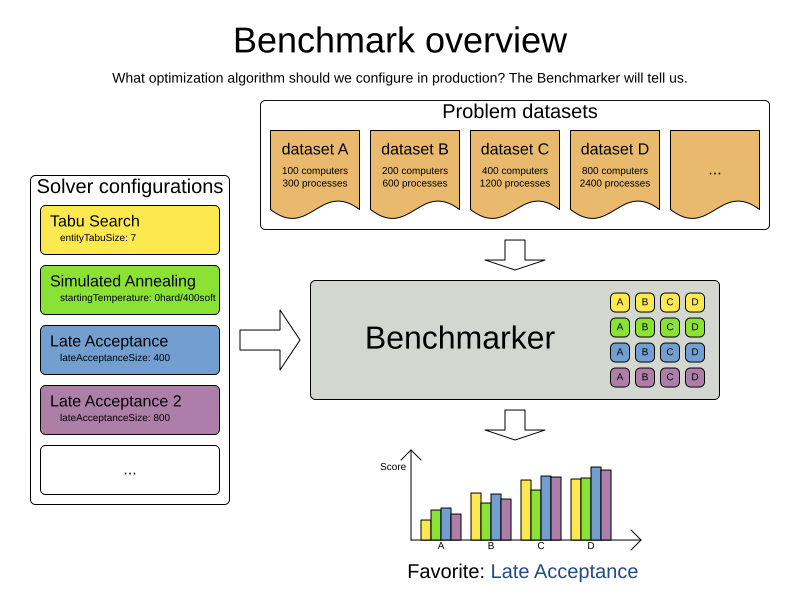

<a id="pdf-dest-84d56f5da6ed9122"></a>

<a id="section-0347"></a>
### 31.2. Benchmark configuration

<a id="pdf-dest-60945c0e6218c481"></a>

<a id="section-0348"></a>
#### 31.2.1. Add a dependency on timefold-solver-benchmark

The benchmarker is in a separate artifact called timefold-solver-benchmark.

If you use Maven, add a dependency in your pom.xml file:

```
<dependency>
    <groupId>ai.timefold.solver</groupId>
    <artifactId>timefold-solver-benchmark</artifactId>
</dependency>
```

This is similar for Gradle, Ivy and Buildr. The version must be exactly the same as the timefold-solver-core version used (which is automatically the case if you import timefold-solver-bom).

If you use ANT, you’ve probably already copied the required jars from the download zip’s binaries directory.

<a id="pdf-dest-5a3b9ab1088bdddf"></a>

<a id="section-0349"></a>
#### 31.2.2. Run a simple benchmark

To quickly setup a benchmark, create a PlannerBenchmarkFactory from your solver configuration XML, load a few datasets and benchmark them. For example, with 3 datasets:

```
PlannerBenchmarkFactory benchmarkFactory = PlannerBenchmarkFactory
.createFromSolverConfigXmlResource(
        "org/acme/vehiclerouting/solverConfig.xml");

VehicleRoutePlan dataset1 = ...;
VehicleRoutePlan dataset2 = ...;
VehicleRoutePlan dataset3 = ...;
PlannerBenchmark benchmark = benchmarkFactory.buildPlannerBenchmark(dataset1,
dataset2, dataset3);
benchmark.benchmark();
```

This generates a benchmark report in local/benchmarkReport when it’s finished. The SolverFactory's solver configuration needs a termination to limit how long each dataset runs. To configure a different benchmark directory, pass a File parameter to createFromSolverConfigXmlResource().

The generated benchmark report already contains interesting information, but it doesn’t compare solver configurations to find the best algorithm. To do that, set up an explicit benchmark configuration:

<a id="pdf-dest-26455b4aa8095711"></a>

<a id="section-0350"></a>
#### 31.2.3. Configure and run an advanced benchmark

Build a PlannerBenchmark instance with a PlannerBenchmarkFactory. Configure it with a benchmark configuration XML file, provided as a classpath resource:

```
PlannerBenchmarkFactory benchmarkFactory = PlannerBenchmarkFactory
.createFromXmlResource(
        "org/acme/vehiclerouting/benchmarkConfig.xml");
PlannerBenchmark benchmark = benchmarkFactory.buildPlannerBenchmark();
benchmark.benchmark();
```

Alternatively, create a PlannerBenchmarkFactory programmatically from a PlannerBenchmarkConfig. A benchmark configuration XML file looks like this:

```
<?xml version="1.0" encoding="UTF-8"?>
<plannerBenchmark xmlns="https://timefold.ai/xsd/benchmark" xmlns:xsi=
"http://www.w3.org/2001/XMLSchema-instance"
    xsi:schemaLocation="https://timefold.ai/xsd/benchmark
https://timefold.ai/xsd/benchmark/benchmark.xsd">
    <benchmarkDirectory>local/data/</benchmarkDirectory>

    <inheritedSolverBenchmark>
    <solver>
        ...<!-- Common solver configuration -->
    </solver>
    <problemBenchmarks>
        ...
        <inputSolutionFile>dataset1.json</inputSolutionFile>
        <inputSolutionFile>dataset2.json</inputSolutionFile>
    </problemBenchmarks>
    </inheritedSolverBenchmark>

    <solverBenchmark>
    <name>Tabu Search</name>
    <solver>
        ...<!-- Tabu Search specific solver configuration -->
    </solver>
    </solverBenchmark>
    <solverBenchmark>
    <name>Simulated Annealing</name>
    <solver>
        ...<!-- Simulated Annealing specific solver configuration -->
    </solver>
    </solverBenchmark>
    <solverBenchmark>
    <name>Late Acceptance</name>
    <solver>
        ...<!-- Late Acceptance specific solver configuration -->
    </solver>
    </solverBenchmark>
</plannerBenchmark>
```

This PlannerBenchmark tries three configurations (Tabu Search, Simulated Annealing and Late Acceptance) on two data sets (dataset1 and dataset2), so it runs six solvers.

Every <solverBenchmark> element contains a solver configuration and one or more <inputSolutionFile> elements. It runs the solver configuration on each of those unsolved solution files. The element name is optional, because it is generated if absent. The inputSolutionFile is read by a [SolutionFileIO](#pdf-dest-06479370909ea8d1), relative to the working directory.

A solver configuration in a benchmark must not override environmentMode in any of its phases.

Use a forward slash (/) as the file separator (such as in the element <inputSolutionFile>). That will work on any platform (including Windows).

Do not use backslash (\) as the file separator: that breaks portability because it does not work on Linux and Mac.

The benchmark report is written in the directory specified by the <benchmarkDirectory> element (relative to the working directory).

It’s recommended that the benchmarkDirectory is a directory that is ignored for

source control and not cleaned by your build system. This way the generated files

are not bloating your source control and they aren’t lost when doing a clean build. In git, it should be added to .gitignore. Usually that directory is called local.

If an Exception or Error occurs in a single benchmark, the entire Benchmarker does not fail-fast (unlike everything else in Timefold Solver). Instead, the Benchmarker continues to run all other benchmarks, write the benchmark report and then fail (if there is at least one failing single benchmark). The failing benchmarks are clearly marked as such in the benchmark report.

<a id="pdf-dest-1756a26c0c3c04b9"></a>

31.2.3.1. Inherited solver benchmark

To lower verbosity, the common parts of multiple <solverBenchmark> elements are extracted to the <inheritedSolverBenchmark> element. Every property can still be overwritten per <solverBenchmark> element. Note that inherited solver phases such as <constructionHeuristic> or <localSearch> are not overwritten but instead are added to the tail of the solver phases list.

<a id="pdf-dest-06479370909ea8d1"></a>

<a id="section-0351"></a>
#### 31.2.4. SolutionFileIO: input and output of solution files

<a id="pdf-dest-bd0d21de9cd22de3"></a>

31.2.4.1. SolutionFileIO interface

The benchmarker needs to be able to read the input files to load a problem. Also, it optionally writes the best solution of each benchmark to an output file. It does that through the SolutionFileIO interface which has a read and write method:

```
public interface SolutionFileIO<Solution_> {
    ...

    Solution_ read(File inputSolutionFile);
    void write(Solution_ solution, File outputSolutionFile);

}
```

There are several ways to serialize a solution.

<a id="pdf-dest-7699569f1f3f967e"></a>

31.2.4.2. JacksonSolutionFileIO: serialize to and from an JSON format

To read and write solutions in JSON format via Jackson, extend the JacksonSolutionFileIO:

```
public class VehicleRoutingSolutionFileIO extends JacksonSolutionFileIO
<VehicleRoutePlan> {
    public VehicleRoutingSolutionFileIO() {
        // VehicleRoutePlan is the @PlanningSolution class.
        super(VehicleRoutePlan.class);
    }
}
```

If the JSON file requires specific Jackson modules and features to be enabled/disabled. You could create your desired object mapper as a dependency to the JacksonSolutionFileIO as follows:

```
public class VehicleRoutePlanJsonSolutionFileIO extends JacksonSolutionFileIO
<VehicleRoutePlan> {
    public VehicleRoutePlanJsonSolutionFileIO() {
        // VehicleRoutePlan is the @PlanningSolution class.
        super(VehicleRoutePlan.class,
                new JsonMapper.builder()
                    ...
                    .build());
    }

}
```

Then use it in the benchmark configuration like so:

```
<problemBenchmarks>
    <solutionFileIOClass>...VehicleRoutePlanJsonSolutionFileIO</solutionFileIOClass>
    <inputSolutionFile>dataset01.json</inputSolutionFile>
    ...
</problemBenchmarks>
```

<a id="pdf-dest-f84d557deb3363fb"></a>

31.2.4.3. JaxbSolutionFileIO: serialize to and from an XML format

To read and write solutions in the XML format via Java Architecture for XML Binding (JAXB), extend the JaxbSolutionFileIO:

```
public class VehicleRoutePlanXmlSolutionFileIO extends JaxbSolutionFileIO
<VehicleRoutePlan> {
    public VehicleRoutePlanXmlSolutionFileIO() {
        // VehicleRoutePlan is the @PlanningSolution class.
        super(VehicleRoutePlan.class);
    }
}
```

and use it in the benchmark configuration:

```
<problemBenchmarks>
    <solutionFileIOClass>...VehicleRoutePlanSolutionFileIO</solutionFileIOClass>
    <inputSolutionFile>dataset01.xml</inputSolutionFile>
    ...
</problemBenchmarks>
```

Add JAXB annotations (such as @XmlElement) on your domain classes to use a less verbose XML format. Regardless, XML is still a very verbose format. Reading or writing large datasets in this format can cause an OutOfMemoryError, StackOverflowError or large performance degradation.

<a id="pdf-dest-2c6999aa290d23d8"></a>

31.2.4.4. Custom SolutionFileIO: serialize to and from a custom format

Implement your own SolutionFileIO implementation and configure it with the solutionFileIOClass element to write to a custom format (such as a txt or a binary format):

```
<problemBenchmarks>
    <solutionFileIOClass>...MyXlsxSolutionFileIO</solutionFileIOClass>
    <inputSolutionFile>dataset01.xslx</inputSolutionFile>
    ...
</problemBenchmarks>
```

It’s recommended that output files can be read as input files, which implies that getInputFileExtension() and getOutputFileExtension() return the same value.

A SolutionFileIO implementation must be thread-safe.

<a id="pdf-dest-fc1f5e0600591d82"></a>

31.2.4.5. Reading an input solution from a database or other storage

There are two options if your dataset is in a relational database or another type of repository:

- Extract the datasets from the database and serialize them to a local file, for example as JSON with JacksonSolutionFileIO. Then use those files in <inputSolutionFile> elements.
  - The benchmarks are now more reliable because they run offline.
  - Each dataset is only loaded just in time.
- Load all the datasets in advance and pass them to the buildPlannerBenchmark() method:
```
        PlannerBenchmark plannerBenchmark = benchmarkFactory.buildPlannerBenchmark
(dataset1, dataset2, dataset3);
```

<a id="pdf-dest-b4aa28869f8f8531"></a>

<a id="section-0352"></a>
#### 31.2.5. Warming up the HotSpot compiler

Without a warm up, the results of the first (or first few) benchmarks are not reliable because they lose CPU time on HotSpot JIT compilation.

To avoid that distortion, the benchmarker runs some of the benchmarks for 30 seconds, before running the real benchmarks. That default warm up of 30 seconds usually suffices. Change it, for example to give it 60 seconds:

```
<plannerBenchmark xmlns="https://timefold.ai/xsd/benchmark" xmlns:xsi=
"http://www.w3.org/2001/XMLSchema-instance"
    xsi:schemaLocation="https://timefold.ai/xsd/benchmark
https://timefold.ai/xsd/benchmark/benchmark.xsd">
    ...
    <warmUpSecondsSpentLimit>60</warmUpSecondsSpentLimit>
    ...
</plannerBenchmark>
```

Turn off the warm up phase altogether by setting it to zero:

```
<plannerBenchmark xmlns="https://timefold.ai/xsd/benchmark" xmlns:xsi=
"http://www.w3.org/2001/XMLSchema-instance"
    xsi:schemaLocation="https://timefold.ai/xsd/benchmark
https://timefold.ai/xsd/benchmark/benchmark.xsd">
    ...
    <warmUpSecondsSpentLimit>0</warmUpSecondsSpentLimit>
    ...
</plannerBenchmark>
```

The warm up time budget does not include the time it takes to load the datasets. With large datasets, this can cause the warm up to run considerably longer than specified in the configuration.

<a id="pdf-dest-5041fa0c884f523d"></a>

<a id="section-0353"></a>
#### 31.2.6. Benchmark blueprint: a predefined configuration

To quickly configure and run a benchmark for typical solver configs, use a solverBenchmarkBluePrint instead of solverBenchmarks:

```
<?xml version="1.0" encoding="UTF-8"?>
<plannerBenchmark xmlns="https://timefold.ai/xsd/benchmark" xmlns:xsi=
"http://www.w3.org/2001/XMLSchema-instance"
    xsi:schemaLocation="https://timefold.ai/xsd/benchmark
https://timefold.ai/xsd/benchmark/benchmark.xsd">
    <benchmarkDirectory>local/</benchmarkDirectory>

    <inheritedSolverBenchmark>
    <solver>
        <solutionClass>org.acme.vehiclerouting.domain.VehicleRoutePlan</solutionClass>
        <entityClass>org.acme.vehiclerouting.domain.Vehicle</entityClass>
        <entityClass>org.acme.vehiclerouting.domain.Visit</entityClass>
        <scoreDirectorFactory>

<constraintProviderClass>org.acme.vehiclerouting.solver.VehicleRoutingConstraintProvid
er</constraintProviderClass>
        </scoreDirectorFactory>
        <termination>
        <minutesSpentLimit>1</minutesSpentLimit>
        </termination>
    </solver>
    <problemBenchmarks>

<solutionFileIOClass>org.acme.vehiclerouting.persistence.VehicleRoutePlanSolutionFileI
O</solutionFileIOClass>
        <inputSolutionFile>data/dataset01.json</inputSolutionFile>
        <inputSolutionFile>data/dataset02.json</inputSolutionFile>
    </problemBenchmarks>
    </inheritedSolverBenchmark>

    <solverBenchmarkBluePrint>

<solverBenchmarkBluePrintType>EVERY_CONSTRUCTION_HEURISTIC_TYPE_WITH_EVERY_LOCAL_SEARC
H_TYPE</solverBenchmarkBluePrintType>
    </solverBenchmarkBluePrint>
</plannerBenchmark>
```

The following SolverBenchmarkBluePrintTypes are supported:

- CONSTRUCTION_HEURISTIC_WITH_AND_WITHOUT_LOCAL_SEARCH: Run the default Construction Heuristic type with and without the default Local Search type.
- EVERY_CONSTRUCTION_HEURISTIC_TYPE: Run every Construction Heuristic type (First Fit, First Fit Decreasing, Cheapest Insertion, …).
- EVERY_LOCAL_SEARCH_TYPE: Run every Local Search type (Tabu Search, Late Acceptance, …) with the default Construction Heuristic.
- EVERY_CONSTRUCTION_HEURISTIC_TYPE_WITH_EVERY_LOCAL_SEARCH_TYPE: Run every Construction Heuristic type with every Local Search type.

<a id="pdf-dest-4ebee5dfb22b4026"></a>

<a id="section-0354"></a>
#### 31.2.7. Write the output solution of benchmark runs

The best solution of each benchmark run can be written in the benchmarkDirectory. By default, this is disabled, because the files are rarely used and considered bloat. Also, on large datasets, writing the best solution of each single benchmark can take quite some time and memory (causing an OutOfMemoryError), especially in a verbose format like XML.

To write those solutions in the benchmarkDirectory, enable writeOutputSolutionEnabled:

```
<problemBenchmarks>
    ...
    <writeOutputSolutionEnabled>true</writeOutputSolutionEnabled>
    ...
</problemBenchmarks>
```

<a id="pdf-dest-205e041ac8e3e60c"></a>

<a id="section-0355"></a>
#### 31.2.8. Benchmark logging

Benchmark logging is configured like [solver logging](#pdf-dest-0a149844a7c9f4cf).

To separate the log messages of each single benchmark run into a separate file, use the [MDC](http://logback.qos.ch/manual/mdc.html) with key subSingleBenchmark.name in a sifting appender. For example with Logback in logback.xml:

```
<appender name="fileAppender" class="ch.qos.logback.classic.sift.SiftingAppender">
    <discriminator>
    <key>subSingleBenchmark.name</key>
    <defaultValue>app</defaultValue>
    </discriminator>
    <sift>
    <appender name="fileAppender.${subSingleBenchmark.name}" class="...FileAppender
">
        <file>local/log/timefoldBenchmark-${subSingleBenchmark.name}.log</file>
        ...
    </appender>
    </sift>
</appender>
```

<a id="pdf-dest-800cd22e25e1a23a"></a>

<a id="section-0356"></a>
### 31.3. Benchmark report

<a id="pdf-dest-ee6ab2e1525e2cdf"></a>

<a id="section-0357"></a>
#### 31.3.1. HTML report

After running a benchmark, an HTML report will be written in the benchmarkDirectory with the index.html filename. Open it in your browser. It has a nice overview of your benchmark including:

- Summary statistics: graphs and tables
- Problem statistics per inputSolutionFile: graphs and CSV
- Each solver configuration (ranked): Handy to copy and paste
- Benchmark information: settings, hardware, …

The HTML report will use your default locale to format numbers. If you share the benchmark report with people from another country, consider overwriting the locale accordingly:

```
<plannerBenchmark xmlns="https://timefold.ai/xsd/benchmark" xmlns:xsi=
"http://www.w3.org/2001/XMLSchema-instance"
    xsi:schemaLocation="https://timefold.ai/xsd/benchmark
https://timefold.ai/xsd/benchmark/benchmark.xsd">
    ...
    <benchmarkReport>
    <locale>en_US</locale>
    </benchmarkReport>
    ...
</plannerBenchmark>
```

<a id="pdf-dest-cc77d8ca31e230e3"></a>

<a id="section-0358"></a>
#### 31.3.2. Ranking the solvers

The benchmark report automatically ranks the solvers. The Solver with rank 0 is called the favorite Solver: it performs best overall, but it might not be the best on every problem. It’s recommended to use that favorite Solver in production.

However, there are different ways of ranking the solvers. Configure it like this:

```
<plannerBenchmark xmlns="https://timefold.ai/xsd/benchmark" xmlns:xsi=
"http://www.w3.org/2001/XMLSchema-instance"
    xsi:schemaLocation="https://timefold.ai/xsd/benchmark
https://timefold.ai/xsd/benchmark/benchmark.xsd">
    ...
    <benchmarkReport>
    <solverRankingType>TOTAL_SCORE</solverRankingType>
    </benchmarkReport>
    ...
</plannerBenchmark>
```

The following solverRankingTypes are supported:

- TOTAL_SCORE (default): Maximize the overall score, so minimize the overall cost if all solutions would be executed.
- WORST_SCORE: Minimize the worst case scenario.
- TOTAL_RANKING: Maximize the overall ranking. Use this if your datasets differ greatly in size or difficulty, producing a difference in Score magnitude.

Solvers with at least one failed single benchmark do not get a ranking. Solvers with not fully initialized solutions are ranked worse.

To use a custom ranking, implement a Comparator:

```
<benchmarkReport>
    <solverRankingComparatorClass>
...TotalScoreSolverRankingComparator</solverRankingComparatorClass>
</benchmarkReport>
```

Or by implementing a weight factory:

```
<benchmarkReport>
    <solverRankingWeightFactoryClass>
...TotalRankSolverRankingWeightFactory</solverRankingWeightFactoryClass>
</benchmarkReport>
```

<a id="pdf-dest-3d310c3a6d15dc61"></a>

<a id="section-0359"></a>
### 31.4. Summary statistics

<a id="pdf-dest-55515e78d9ccfcef"></a>

<a id="section-0360"></a>
#### 31.4.1. Best score summary (graph and table)

Shows the best score per inputSolutionFile for each solver configuration.

Useful for visualizing the best solver configuration.

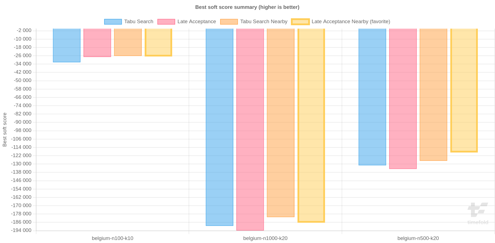

Figure 2. Best score summary statistic

<a id="pdf-dest-225e2cafe6c710d5"></a>

<a id="section-0361"></a>
#### 31.4.2. Best score scalability summary (graph)

Shows the best score per problem scale for each solver configuration.

Useful for visualizing the scalability of each solver configuration.

<a id="pdf-dest-552d1a64f8306a84"></a>

<a id="section-0362"></a>
#### 31.4.3. Best score distribution summary (graph)

Shows the best score distribution per inputSolutionFile for each solver configuration.

Useful for visualizing the reliability of each solver configuration.

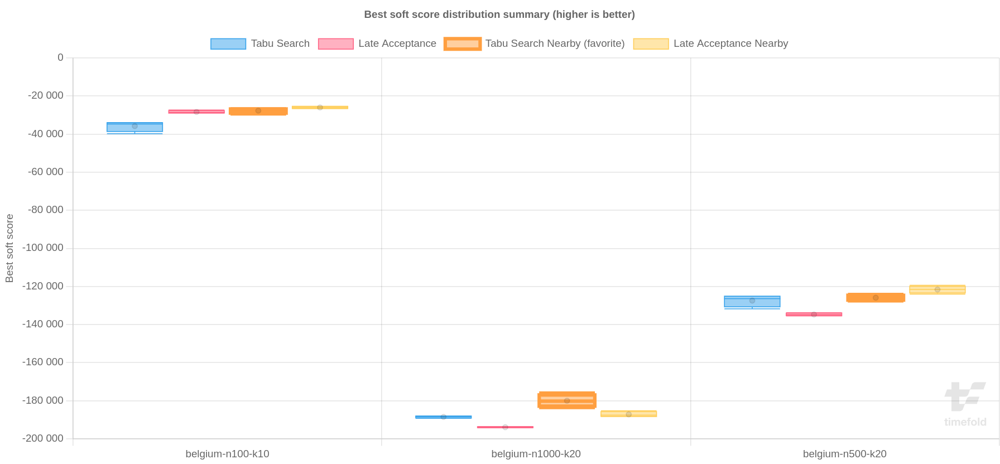

Figure 3. Best Score Distribution Summary Statistic

Enable [statistical benchmarking](#pdf-dest-e2625cf1b263749b) to use this summary.

<a id="pdf-dest-145ebc6ec7676f17"></a>

<a id="section-0363"></a>
#### 31.4.4. Winning score difference summary (graph And table)

Shows the winning score difference per inputSolutionFile for each solver configuration. The winning score difference is the score difference with the score of the winning solver configuration for that particular inputSolutionFile.

Useful for zooming in on the results of the best score summary.

<a id="pdf-dest-3be900f36818fee0"></a>

<a id="section-0364"></a>
#### 31.4.5. Worst score difference percentage (ROI) summary (graph And table)

Shows the return on investment (ROI) per inputSolutionFile for each solver configuration if you’d upgrade from the worst solver configuration for that particular inputSolutionFile.

Useful for visualizing the return on investment (ROI) to decision makers.

<a id="pdf-dest-4329e39390ac5a37"></a>

<a id="section-0365"></a>
#### 31.4.6. Score calculation speed summary (graph And table)

Shows the score calculation speed: a count per second per problem scale for each solver configuration.

Useful for comparing different score calculators and/or constraint implementations (presuming that the solver configurations do not differ otherwise). Also useful to measure the scalability cost of an extra constraint.

When improving your score calculation speed, comparing a configuration that uses [Ruin and Recreate](#pdf-dest-74050161a6ed7657) moves with one that doesn’t may not be realistic. This is

because the configuration using "Ruin and Recreate" will likely execute more score

calculations than without, but it doesn’t mean it will evaluate more moves. The Ruin and Recreate recreate step runs a construction heuristic, which uses greedy logic to find a better location to assign each one of the entities removed with the ruin step.

<a id="pdf-dest-e5469f9614bb05e1"></a>

<a id="section-0366"></a>
#### 31.4.7. Move evaluation speed summary (graph and table)

Shows the move evaluation speed: a count per move, per second and per problem scale for each solver configuration.

Useful for comparing different solver algorithms, score calculators and/or constraint implementations (presuming that the solver configurations do not differ otherwise, including the move selector configuration). Also useful to measure the scalability cost of an extra constraint.

<a id="pdf-dest-484c16874fe29798"></a>

<a id="section-0367"></a>
#### 31.4.8. Time spent summary (graph And table)

Shows the time spent per inputSolutionFile for each solver configuration. This is pointless if it’s benchmarking against a fixed time limit.

Useful for visualizing the performance of construction heuristics (presuming that no other solver phases are configured).

<a id="pdf-dest-8836e4c31f776392"></a>

<a id="section-0368"></a>
#### 31.4.9. Time spent scalability summary (graph)

Shows the time spent per problem scale for each solver configuration. This is pointless if it’s benchmarking against a fixed time limit.

Useful for extrapolating the scalability of construction heuristics (presuming that no other solver phases are configured).

<a id="pdf-dest-dd9733ea736a99aa"></a>

<a id="section-0369"></a>
#### 31.4.10. Best score per time spent summary (graph)

Shows the best score per time spent for each solver configuration. This is pointless if it’s benchmarking against a fixed time limit.

Useful for visualizing trade-off between the best score versus the time spent for construction heuristics (presuming that no other solver phases are configured).

<a id="pdf-dest-01efd95e0e7369f5"></a>

<a id="section-0370"></a>
### 31.5. Statistic per dataset (graph and CSV)

<a id="pdf-dest-c075d63735962313"></a>

<a id="section-0371"></a>
#### 31.5.1. Enable a problem statistic

The benchmarker supports outputting problem statistics as graphs and CSV (comma separated values) files to the benchmarkDirectory. To configure one or more, add a problemStatisticType line for each one:

```
<plannerBenchmark xmlns="https://timefold.ai/xsd/benchmark" xmlns:xsi=
"http://www.w3.org/2001/XMLSchema-instance"
    xsi:schemaLocation="https://timefold.ai/xsd/benchmark
https://timefold.ai/xsd/benchmark/benchmark.xsd">
    <benchmarkDirectory>local/</benchmarkDirectory>
    <inheritedSolverBenchmark>
    <problemBenchmarks>
        ...
        <problemStatisticType>BEST_SCORE</problemStatisticType>
        <problemStatisticType>SCORE_CALCULATION_SPEED</problemStatisticType>
    </problemBenchmarks>
    ...
    </inheritedSolverBenchmark>
    ...
</plannerBenchmark>
```

These problem statistics can slow down the solvers noticeably, which affects the benchmark results. That’s why they are optional and only BEST_SCORE is enabled by default. To disable that one too, use problemStatisticEnabled:

```
<problemBenchmarks>
                    ...
                    <problemStatisticEnabled>false</problemStatisticEnabled>
                </problemBenchmarks>
```

The summary statistics do not slow down the solver and are always generated.

The following types are supported:

<a id="pdf-dest-312d02aac39cf989"></a>

<a id="section-0372"></a>
#### 31.5.2. Best score over time statistic (graph and CSV)

Shows how the best score evolves over time. It is run by default. To run it when other statistics are configured, also add:

```
<problemBenchmarks>
    ...
    <problemStatisticType>BEST_SCORE</problemStatisticType>
</problemBenchmarks>
```

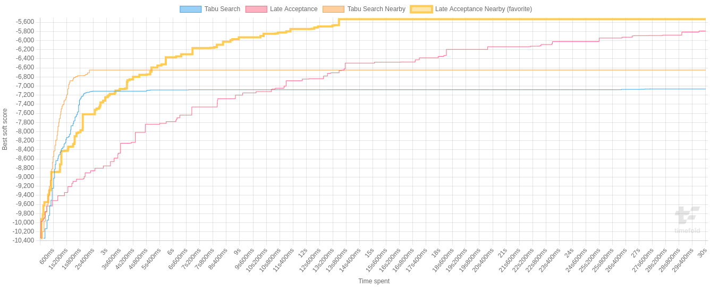

Figure 4. Best Score Over Time Statistic

A time gradient based algorithm (such as Simulated Annealing) will have a different statistic if it’s run with a different time limit configuration. That’s because this Simulated Annealing implementation automatically determines its velocity based on the amount of time that can be spent. On the other hand, for the Tabu Search and Late Acceptance, what you see is what you’d get.

The best score over time statistic is very useful to detect abnormalities, such as a potential [score trap](#pdf-dest-7995da7c3d75ca6c) which gets the solver temporarily stuck in a local optima.

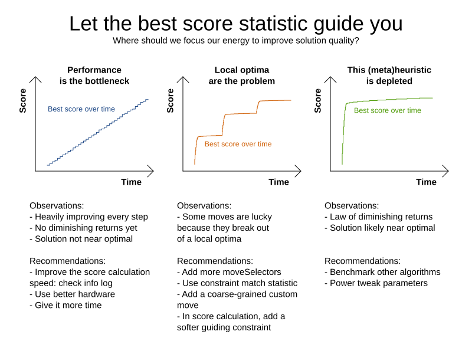

<a id="pdf-dest-08e949723adb091a"></a>

<a id="section-0373"></a>
#### 31.5.3. Step score over time statistic (graph and CSV)

To see how the step score evolves over time, add:

```
<problemBenchmarks>
    ...
    <problemStatisticType>STEP_SCORE</problemStatisticType>
</problemBenchmarks>
```

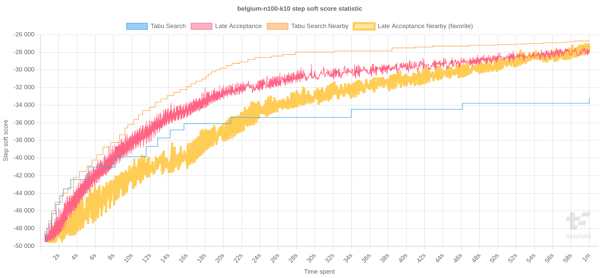

Figure 5. Step Score Over Time Statistic

Compare the step score statistic with the best score statistic (especially on parts for which the best score flatlines). If it hits a local optima, the solver should take deteriorating steps to escape it. But it shouldn’t deteriorate too much either.

The step score statistic has been seen to slow down the solver noticeably due to GC stress, especially for fast stepping algorithms, such as [Simulated Annealing](#pdf-dest-853f2706a664c7ea) and [Late Acceptance](#pdf-dest-b3962aeb6c3ed004).

<a id="pdf-dest-9fc04df2660282e1"></a>

<a id="section-0374"></a>
#### 31.5.4. Score calculation speed over time statistic (graph and CSV)

To see how fast the scores are calculated, add:

```
<problemBenchmarks>
    ...
    <problemStatisticType>SCORE_CALCULATION_SPEED</problemStatisticType>
</problemBenchmarks>
```

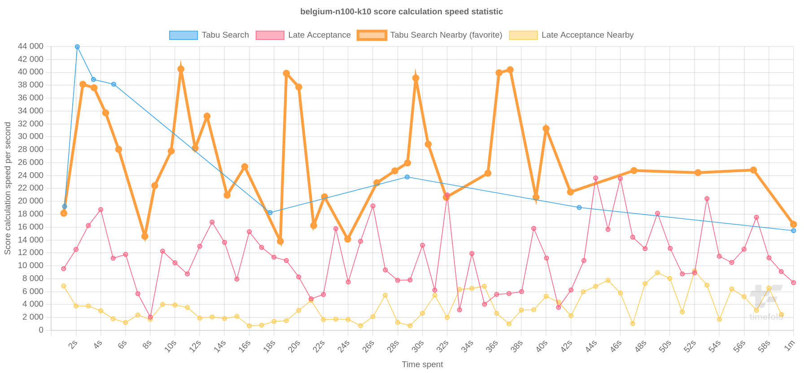

Figure 6. Score Calculation Speed Statistic

The initial high calculation speed is typical during solution initialization: it’s far easier to calculate the score of a solution if only a handful planning entities have been initialized, than when all the planning entities are initialized. After those few seconds of initialization, the calculation speed is relatively stable, apart from an occasional stop-the-world garbage collector disruption.

<a id="pdf-dest-9bc64292ced23f75"></a>

<a id="section-0375"></a>
#### 31.5.5. Move evaluation speed over time statistic (graph and CSV)

To see how fast the moves are evaluated, add:

```
<problemBenchmarks>
    ...
    <problemStatisticType>MOVE_EVALUATION_SPEED</problemStatisticType>
</problemBenchmarks>
```

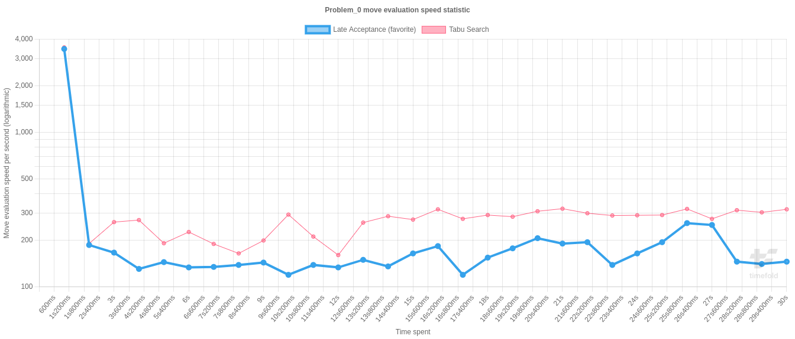

Figure 7. Move Evaluation Speed Statistic

The initial high evaluation speed is typical during solution initialization: it’s far easier to calculate the score of a solution if only a handful planning entities have been initialized, than when all the planning entities are initialized. After the construction heuristic phase, the evaluation speed is relatively stable, apart from an occasional stop-the-world garbage collector disruption.

<a id="pdf-dest-8e03119ab885a171"></a>

<a id="section-0376"></a>
#### 31.5.6. Move evaluation count per move type statistic (graph and CSV)

To see how many moves are evaluated per move type, add:

```
<problemBenchmarks>
    ...
    <problemStatisticType>MOVE_COUNT_PER_TYPE</problemStatisticType>
</problemBenchmarks>
```

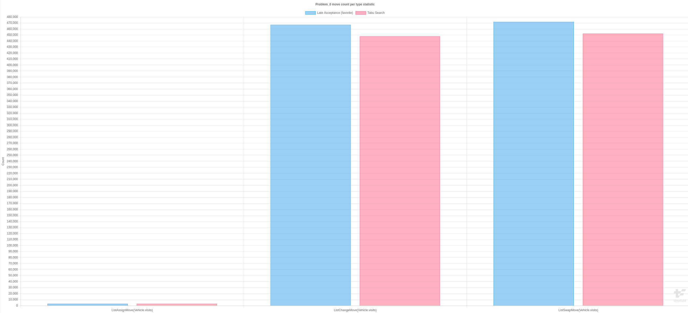

Figure 8. Evaluation Count per Move Type Summary Statistic

<a id="pdf-dest-e585a3839064de54"></a>

<a id="section-0377"></a>
#### 31.5.7. Best solution mutation over time statistic (graph and CSV)

To see how much each new best solution differs from the previous best solution, by counting the number of planning variables which have a different value (not including the variables that have changed multiple times but still end up with the same value), add:

```
<problemBenchmarks>
    ...
    <problemStatisticType>BEST_SOLUTION_MUTATION</problemStatisticType>
</problemBenchmarks>
```

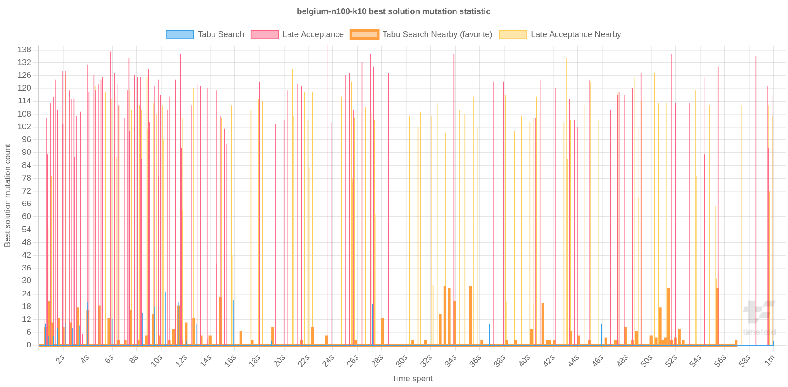

Figure 9. Best Solution Mutation Over Time Statistic

Use Tabu Search - an algorithm that behaves like a human - to get an estimation on how difficult it would be for a human to improve the previous best solution to that new best solution.

This statistic can slow down the solver noticeably, which affects the benchmark

results. That’s why it is optional and not enabled by default.

<a id="pdf-dest-a36c3e19b4195204"></a>

<a id="section-0378"></a>
#### 31.5.8. Move count per step statistic (graph and CSV)

To see how the selected and accepted move count per step evolves over time, add:

```
<problemBenchmarks>
    ...
    <problemStatisticType>MOVE_COUNT_PER_STEP</problemStatisticType>
</problemBenchmarks>
```

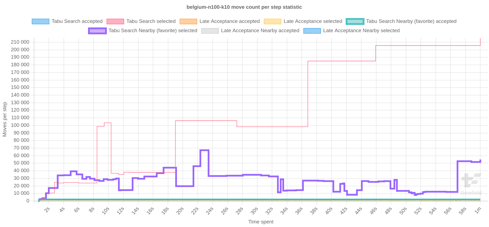

Figure 10. Move Count Per Step Statistic

This statistic has been seen to slow down the solver noticeably due to GC stress, especially for fast stepping algorithms (such as Simulated Annealing and Late Acceptance).

<a id="pdf-dest-fcf9a354cedcdc37"></a>

<a id="section-0379"></a>
#### 31.5.9. Memory use statistic (graph and CSV)

To see how much memory is used, add:

```
<problemBenchmarks>
    ...
    <problemStatisticType>MEMORY_USE</problemStatisticType>
</problemBenchmarks>
```

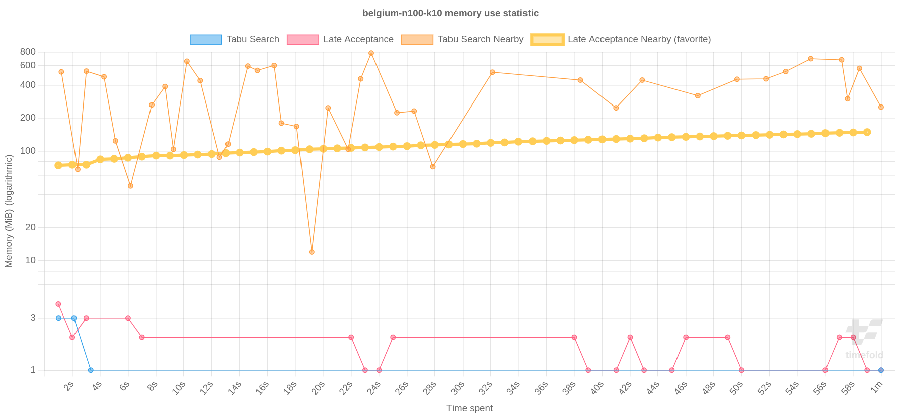

Figure 11. Memory Use Statistic

== The memory use statistic has been seen to affect the solver noticeably. ==

<a id="pdf-dest-7d5004878d0b682c"></a>

<a id="section-0380"></a>
### 31.6. Statistic per single benchmark (graph and CSV)

<a id="pdf-dest-34fbf236e69a5565"></a>

<a id="section-0381"></a>
#### 31.6.1. Enable a single statistic

A single statistic is static for one dataset for one solver configuration. Unlike a problem statistic, it does not aggregate over solver configurations.

The benchmarker supports outputting single statistics as graphs and CSV (comma separated values) files to the benchmarkDirectory. To configure one, add a singleStatisticType line:

```
<plannerBenchmark xmlns="https://timefold.ai/xsd/benchmark" xmlns:xsi=
"http://www.w3.org/2001/XMLSchema-instance"
    xsi:schemaLocation="https://timefold.ai/xsd/benchmark
https://timefold.ai/xsd/benchmark/benchmark.xsd">
    ...
    <inheritedSolverBenchmark>
    <problemBenchmarks>
        ...
        <problemStatisticType>...</problemStatisticType>
        <singleStatisticType>PICKED_MOVE_TYPE_BEST_SCORE_DIFF</singleStatisticType>
        ...
    </problemBenchmarks>
    ...
    </inheritedSolverBenchmark>
    ...
</plannerBenchmark>
```

Multiple singleStatisticType elements are allowed.

This statistic per single benchmark can slow down the solver noticeably, which affects the benchmark results. That’s why they are optional and not enabled by default.

The following types are supported:

<a id="pdf-dest-f1abae33d304d7af"></a>

<a id="section-0382"></a>
#### 31.6.2. Constraint match total best score over time statistic (graph and CSV)

To see which constraints are matched in the best score (and how much) over time, add:

```
<problemBenchmarks>
    ...
    <singleStatisticType>CONSTRAINT_MATCH_TOTAL_BEST_SCORE</singleStatisticType>
</problemBenchmarks>
```

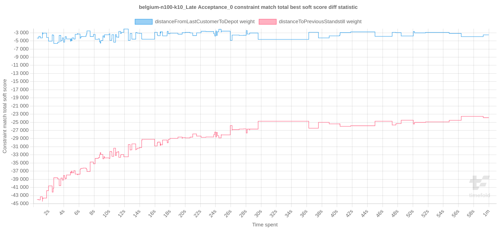

Figure 12. Constraint Match Total Best Score Diff Over Time Statistic

Requires the score calculation to support [score explanation](#pdf-dest-601e0ae9a75a4274). Constraint Streams supports constraint matches automatically, but [incremental Java score calculation](#pdf-dest-d8e7743e38ee4cd8) requires more work.

The constraint match total statistics affect the solver noticeably.

<a id="pdf-dest-ef6bd6655355d33c"></a>

<a id="section-0383"></a>
#### 31.6.3. Constraint match total step score over time statistic (graph and CSV)

To see which constraints are matched in the step score (and how much) over time, add:

```
<problemBenchmarks>
    ...
    <singleStatisticType>CONSTRAINT_MATCH_TOTAL_STEP_SCORE</singleStatisticType>
</problemBenchmarks>
```

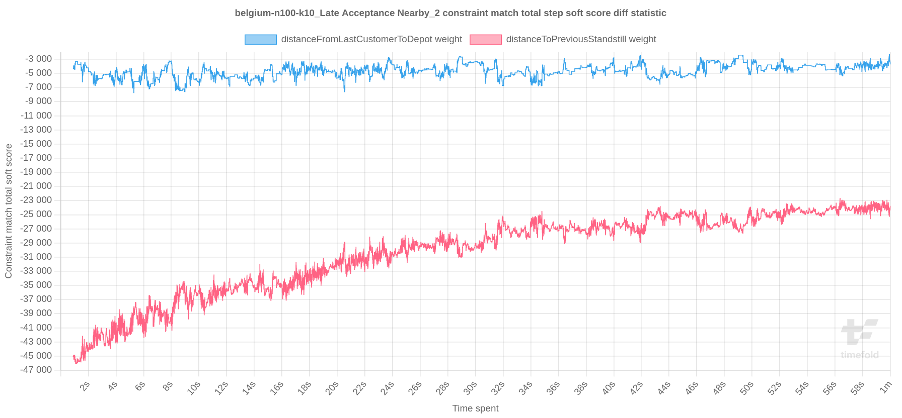

Figure 13. Constraint Match Total Step Score Diff Over Time Statistic Also requires the score calculation to support [score explanation](#pdf-dest-601e0ae9a75a4274).

The constraint match total statistics affect the solver noticeably.

<a id="pdf-dest-b353cfcfdef52485"></a>

<a id="section-0384"></a>
#### 31.6.4. Picked move type best score diff over time statistic (graph and CSV)

To see which move types improve the best score (and how much) over time, add:

```
<problemBenchmarks>
    ...
    <singleStatisticType>PICKED_MOVE_TYPE_BEST_SCORE_DIFF</singleStatisticType>
</problemBenchmarks>
```

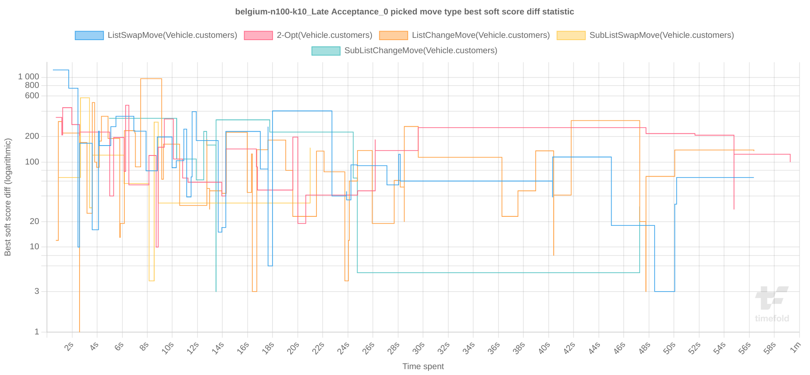

Figure 14. Picked Move Type Best Score Diff Over Time Statistic

<a id="pdf-dest-9da7abeb5f8e3e4b"></a>

<a id="section-0385"></a>
#### 31.6.5. Picked move type step score diff over time statistic (graph and CSV)

To see how much each winning step affects the step score over time, add:

```
<problemBenchmarks>
    ...
    <singleStatisticType>PICKED_MOVE_TYPE_STEP_SCORE_DIFF</singleStatisticType>
</problemBenchmarks>
```

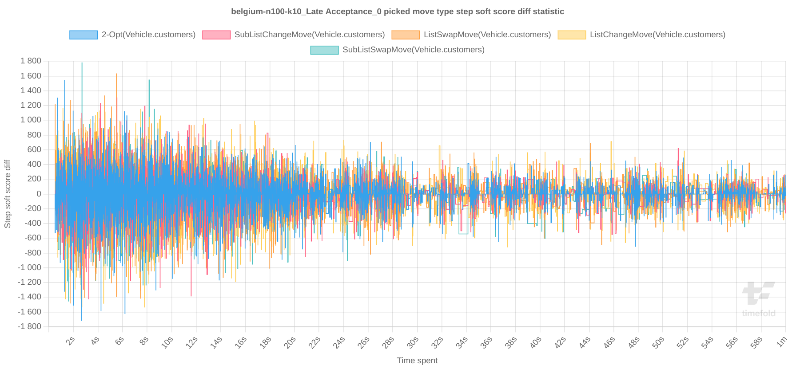

Figure 15. Picked Move Type Step Score Diff Over Time Statistic

<a id="pdf-dest-4b7acba29506a506"></a>

<a id="section-0386"></a>
### 31.7. Advanced benchmarking

<a id="pdf-dest-c89635f76c21e646"></a>

<a id="section-0387"></a>
#### 31.7.1. Benchmarking performance tricks

<a id="pdf-dest-ff2a998b7001fa7f"></a>

31.7.1.1. Parallel benchmarking on multiple threads

If you have multiple CPU cores available on your device, you can run multiple benchmarks in parallel on multiple threads to get your benchmarks results faster:

```
<plannerBenchmark xmlns="https://timefold.ai/xsd/benchmark" xmlns:xsi=
"http://www.w3.org/2001/XMLSchema-instance"
    xsi:schemaLocation="https://timefold.ai/xsd/benchmark
https://timefold.ai/xsd/benchmark/benchmark.xsd">
    ...
    <parallelBenchmarkCount>AUTO</parallelBenchmarkCount>
    ...
</plannerBenchmark>
```

Running too many benchmarks in parallel will affect the results of benchmarks negatively. Leave some processors unused for garbage collection and other processes.

The following parallelBenchmarkCounts are supported:

- 1 (default): Run all benchmarks sequentially.
- AUTO: Let Timefold Solver decide how many benchmarks to run in parallel. This formula is based on experience. It’s recommended to prefer this over the other parallel enabling options.
- Static number: The number of benchmarks to run in parallel.
```
<parallelBenchmarkCount>2</parallelBenchmarkCount>
```

The parallelBenchmarkCount is always limited to the number of available

processors. If it’s higher, it will be automatically decreased.

If you have a computer with slow or unreliable cooling, increasing the parallelBenchmarkCount above one (even on AUTO) may overheat your CPU.

The sensors command can help you detect if this is the case. It is available in the package lm_sensors or lm-sensors in most Linux distributions. There are several freeware tools available for Windows too.

The benchmarker uses a thread pool internally, but you can optionally plug in a custom ThreadFactory, for example when running benchmarks on an application server or a cloud platform:

```
<plannerBenchmark xmlns="https://timefold.ai/xsd/benchmark" xmlns:xsi=
"http://www.w3.org/2001/XMLSchema-instance"
    xsi:schemaLocation="https://timefold.ai/xsd/benchmark
https://timefold.ai/xsd/benchmark/benchmark.xsd">
    ...
    <threadFactoryClass>...MyCustomThreadFactory</threadFactoryClass>
    ...
</plannerBenchmark>
```

This feature is independent of multi-threaded incremental solving and can be used

in the open source version of Timefold Solver.

<a id="pdf-dest-e2625cf1b263749b"></a>

<a id="section-0388"></a>
#### 31.7.2. Statistical benchmarking

To minimize the influence of your environment and the Random Number Generator on the benchmark results, configure the number of times each single benchmark run is repeated. The results of those runs are statistically aggregated. Each individual result is also visible in the report, as well as plotted in [the best score distribution summary](#pdf-dest-552d1a64f8306a84).

Just add a <subSingleCount> element to an [<inheritedSolverBenchmark>](#pdf-dest-1756a26c0c3c04b9) element or in a <solverBenchmark> element:

```
<?xml version="1.0" encoding="UTF-8"?>
<plannerBenchmark xmlns="https://timefold.ai/xsd/benchmark" xmlns:xsi=
"http://www.w3.org/2001/XMLSchema-instance"
    xsi:schemaLocation="https://timefold.ai/xsd/benchmark
https://timefold.ai/xsd/benchmark/benchmark.xsd">
    ...
    <inheritedSolverBenchmark>
    ...
    <solver>
        ...
    </solver>
    <subSingleCount>10</subSingleCount>
    </inheritedSolverBenchmark>
    ...
</plannerBenchmark>
```

The subSingleCount defaults to 1 (so no statistical benchmarking).

If subSingleCount is higher than 1, the benchmarker will automatically use a different [Random](#pdf-dest-62b7bd5e7351b4d9) seed for every sub single run, without losing reproducibility (for each sub single index) in [EnvironmentMode](#pdf-dest-8c3966531f8dd74d) NO_ASSERT and lower.

<a id="pdf-dest-2a6ce35623afde5f"></a>

<a id="section-0389"></a>
#### 31.7.3. Template-based benchmarking and matrix benchmarking

Matrix benchmarking is benchmarking a combination of value sets. For example: benchmark four entityTabuSize values (5, 7, 11 and 13) combined with three acceptedCountLimit values (500, 1000 and 2000), resulting in 12 solver configurations.

To reduce the verbosity of such a benchmark configuration, you can use a [Freemarker](http://freemarker.org/) template for the benchmark configuration instead:

```
<plannerBenchmark xmlns="https://timefold.ai/xsd/benchmark" xmlns:xsi=
"http://www.w3.org/2001/XMLSchema-instance"
    xsi:schemaLocation="https://timefold.ai/xsd/benchmark
https://timefold.ai/xsd/benchmark/benchmark.xsd">
    ...
    <inheritedSolverBenchmark>
    ...
    </inheritedSolverBenchmark>

<#list [5, 7, 11, 13] as entityTabuSize>
<#list [500, 1000, 2000] as acceptedCountLimit>
    <solverBenchmark>
    <name>Tabu Search entityTabuSize ${entityTabuSize} acceptedCountLimit
${acceptedCountLimit}</name>
    <solver>
        <localSearch>
        <unionMoveSelector>
            <changeMoveSelector/>
            <swapMoveSelector/>
        </unionMoveSelector>
        <acceptor>
            <entityTabuSize>${entityTabuSize}</entityTabuSize>
        </acceptor>
        <forager>
            <acceptedCountLimit>${acceptedCountLimit}</acceptedCountLimit>
        </forager>
        </localSearch>
    </solver>
    </solverBenchmark>
</#list>
</#list>
</plannerBenchmark>
```

To configure Matrix Benchmarking for Simulated Annealing (or any other configuration that involves a Score template variable), use the replace() method in the solver benchmark name element:

```
<plannerBenchmark xmlns="https://timefold.ai/xsd/benchmark" xmlns:xsi=
"http://www.w3.org/2001/XMLSchema-instance"
    xsi:schemaLocation="https://timefold.ai/xsd/benchmark
https://timefold.ai/xsd/benchmark/benchmark.xsd">
    ...
    <inheritedSolverBenchmark>
    ...
    </inheritedSolverBenchmark>

<#list ["1hard/10soft", "1hard/20soft", "1hard/50soft", "1hard/70soft"] as
startingTemperature>
    <solverBenchmark>
    <name>Simulated Annealing startingTemperature ${startingTemperature?replace("/",
"_")}</name>
    <solver>
        <localSearch>
        <acceptor>
            <simulatedAnnealingStartingTemperature>
${startingTemperature}</simulatedAnnealingStartingTemperature>
        </acceptor>
        </localSearch>
    </solver>
    </solverBenchmark>
</#list>
</plannerBenchmark>
```

A solver benchmark name doesn’t allow some characters (such a /) because the

name is also used a file name.

And build it with the class PlannerBenchmarkFactory:

```
    PlannerBenchmarkFactory benchmarkFactory = PlannerBenchmarkFactory
.createFromFreemarkerXmlResource(
            "org/acme/vehiclerouting/solverConfig.xml");
    PlannerBenchmark benchmark = benchmarkFactory.buildPlannerBenchmark();
```

<a id="pdf-dest-df8f6aad7d0c7f78"></a>

<a id="section-0390"></a>
#### 31.7.4. Benchmark report aggregation

The BenchmarkAggregator takes one or more existing benchmarks and merges them into new benchmark report, without actually running the benchmarks again.

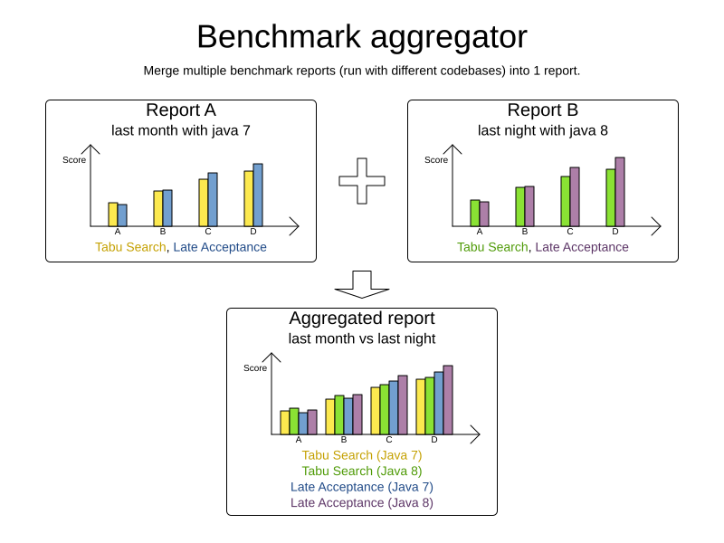

This is useful to:

Report on the impact of code changes Run the same benchmark configuration before and after the code changes, then aggregate a report.

Report on the impact of dependency upgrades Run the same benchmark configuration before and after upgrading the dependency, then aggregate a report.

Summarize a too verbose report Select only the interesting solver benchmarks from the existing report. This is especially useful on template reports to make the graphs readable.

Partially rerun a benchmark Rerun part of an existing report (for example only the failed or invalid solvers), then recreate the original intended report with the new values.

Compose the aggregated report in the Benchmark aggregator UI:

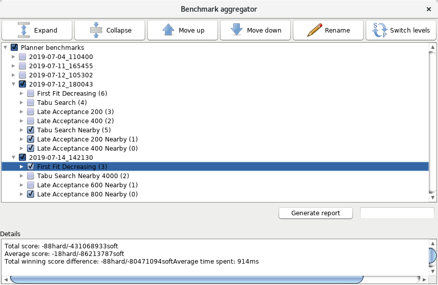

To display that UI, provide a benchmark config to the BenchmarkAggregatorFrame:

```
public static void main(String[] args) {
    BenchmarkAggregatorFrame.createAndDisplayFromXmlResource(
            "org/acme/vehiclerouting/solverConfig.xml");
}
```

Despite that it uses a benchmark configuration as input, it ignores all elements of that configuration, except for the elements <benchmarkDirectory> and <benchmarkReport>.

In the GUI, select the interesting benchmarks and click the button to generate the aggregated report.

All the input reports which are being merged should have been generated with the same Timefold Solver version (excluding hotfix differences) as the BenchmarkAggregator. Using reports from different Timefold Solver major or minor versions are not guaranteed to succeed and deliver correct information, because the benchmark report data structure often changes.

<a id="pdf-dest-c4ffe0f1ba5302ab"></a>

31.7.4.1. Using the Benchmark Aggregator programmatically

For automated or integrated workflows, you can use the BenchmarkAggregator methods to create aggregated reports programmatically. This approach is particularly useful in CI/CD pipelines, data science analytics, research studies, or when you need a comprehensive view of multiple benchmark runs as part of a larger application workflow.

<a id="pdf-dest-75a6555326591eb3"></a>

31.7.4.1.1. Aggregating All Benchmark Results

The simplest approach is to aggregate all benchmark results found in the configured benchmark directory:

```
public File aggregateAllBenchmarks() {
    // Load benchmark configuration
    PlannerBenchmarkConfig benchmarkConfig = PlannerBenchmarkConfig
.createFromXmlResource("benchmarkConfig.xml");

    // Create and use the benchmark aggregator
    BenchmarkAggregator aggregator = new BenchmarkAggregator();

    // Aggregate all benchmark results - returns HTML report file
    return aggregator.aggregateBenchmarks(benchmarkConfig);
}
```

<a id="pdf-dest-1b525017c324923e"></a>

31.7.4.1.2. Discovering Available Benchmark Directories

To see what benchmark results are available for aggregation:

```
public List<String> getAvailableBenchmarks() {
    PlannerBenchmarkConfig benchmarkConfig = PlannerBenchmarkConfig
.createFromXmlResource("benchmarkConfig.xml");
    BenchmarkAggregator aggregator = new BenchmarkAggregator();
    // Returns list of directory names that contain valid benchmark results
    return aggregator.getAvailableBenchmarkDirectories(benchmarkConfig);
}
```

<a id="pdf-dest-1fd937407fff8273"></a>

31.7.4.1.3. Aggregating Selected Benchmark Results

For more control, you can aggregate specific benchmark results by selecting particular subdirectories:

```
public File aggregateSelectedBenchmarks() {
    PlannerBenchmarkConfig benchmarkConfig = PlannerBenchmarkConfig
.createFromXmlResource("benchmarkConfig.xml");
    BenchmarkAggregator aggregator = new BenchmarkAggregator();

    // Get available benchmark directories
    List<String> availableDirectories =
            aggregator.getAvailableBenchmarkDirectories(benchmarkConfig);

    // Select specific directories to aggregate (example: latest two benchmarks)
    List<String> selectedDirectories = availableDirectories.stream()
            .sorted(Collections.reverseOrder())
            .limit(2)
            .collect(Collectors.toList());

    // Aggregate only selected benchmark results
    return aggregator.aggregateSelectedBenchmarks(benchmarkConfig,
selectedDirectories);
}
```

<a id="pdf-dest-4e89608eafb40efa"></a>

31.7.4.1.4. Aggregating and Opening in Browser

For interactive analysis, you can aggregate benchmarks and automatically open the report in the default browser:

```
public File aggregateAndView() {
    PlannerBenchmarkConfig benchmarkConfig = PlannerBenchmarkConfig
.createFromXmlResource("benchmarkConfig.xml");
    BenchmarkAggregator aggregator = new BenchmarkAggregator();

    // Aggregate all benchmarks and open HTML report in browser
    return aggregator.aggregateAndShowReportInBrowser(benchmarkConfig);
}
```

<a id="pdf-dest-95ed8f813201f77b"></a>

31.7.4.1.5. Method Overview

The BenchmarkAggregator provides the following public methods:

aggregateBenchmarks(PlannerBenchmarkConfig)

Aggregates all benchmark results found in the configured directory.

aggregateSelectedBenchmarks(PlannerBenchmarkConfig, List<String>)

Aggregates benchmark results from specific subdirectories by name.

getAvailableBenchmarkDirectories(PlannerBenchmarkConfig)

Returns list of available benchmark subdirectories with valid results.

aggregateAndShowReportInBrowser(PlannerBenchmarkConfig)

Aggregates all benchmarks and opens the HTML report in the default browser.

All aggregation methods return a File pointing to the generated HTML overview report that contains the aggregated benchmark results.

All the input reports which are being merged should have been generated with the same Timefold Solver version as the BenchmarkAggregator. Using reports from different Timefold Solver major or minor versions are not guaranteed to succeed and deliver correct information, because the benchmark report data structure might change.

<a id="pdf-dest-3a0e279be8443e61"></a>

<a id="section-0391"></a>
## Chapter 32. Solver diagnostics

<a id="pdf-dest-8c3966531f8dd74d"></a>

<a id="section-0392"></a>
### 32.1. Environment mode: are there bugs in my code?

The environment mode allows you to detect common bugs in your implementation. It does not affect the [logging level](#pdf-dest-0a149844a7c9f4cf).

You can set the environment mode:

Service / Quarkus Add the following to your application.properties:

```
quarkus.timefold.solver.environment-mode=STEP_ASSERT
```

Spring Boot Add the following to your application.properties:

```
timefold.solver.environment-mode=STEP_ASSERT
```

Java

```
SolverConfig solverConfig = new SolverConfig()
    ...
    .withEnvironmentMode(EnvironmentMode.STEP_ASSERT);
```

XML

```
<solver xmlns="https://timefold.ai/xsd/solver" xmlns:xsi=
"http://www.w3.org/2001/XMLSchema-instance"
    xsi:schemaLocation="https://timefold.ai/xsd/solver
https://timefold.ai/xsd/solver/solver.xsd">
    <environmentMode>STEP_ASSERT</environmentMode>
    ...
</solver>
```

A solver has a single RandomGenerator instance. Some solver configurations use the RandomGenerator instance a lot more than others. For example, Simulated Annealing depends highly on random numbers, while Tabu Search only depends on it to deal with score ties. The environment mode influences the seed of that RandomGenerator instance.

<a id="pdf-dest-11793644f9618a52"></a>

<a id="section-0393"></a>
#### 32.1.1. Reproducibility

For the environment mode to be reproducible, any two runs of the same dataset with the same solver configuration must have the same result at every step. Choosing a reproducible environment mode enables you to reproduce bugs consistently. It also allows you to benchmark certain refactorings (such as a score constraint performance optimization) fairly across runs.

Regardless of whether the chosen environment mode itself is reproducible, your application might still not be fully reproducible because of:

- Use of HashSet (or another Collection which has an undefined iteration order between JVM runs) for collections of planning entities or planning values (but not normal problem facts), especially in the solution implementation. Replace it with a SequencedSet or SequencedCollection implementation respectively, such as LinkedHashSet or ArrayList.
  - This also applies to HashMap, which can be replaced by a SequencedMap implementation such as LinkedHashMap.
- Combining a time gradient-dependent algorithm (most notably [Simulated Annealing](#pdf-dest-853f2706a664c7ea)) together with [time spent termination](#pdf-dest-12dcb388934336b3). A large enough difference in allocated CPU time will influence the time gradient values. Replace Simulated Annealing with Late Acceptance, or replace time spent termination with step count termination.

<a id="pdf-dest-6eb61b6e43cdbd66"></a>

<a id="section-0394"></a>
#### 32.1.2. Available environment modes

The following environment modes are available, in the order from least strict to most strict:

- [NON_REPRODUCIBLE](#pdf-dest-e30fe4db86aff506)
- [NO_ASSERT](#pdf-dest-296ce1f1f6079796)
- [PHASE_ASSERT](#pdf-dest-a070fb61e6424987) (default)
- [STEP_ASSERT](#pdf-dest-281de29e7faf2fe9)
- [NON_INTRUSIVE_FULL_ASSERT](#pdf-dest-f86e09f0ad13ca53)
- [FULL_ASSERT](#pdf-dest-a908d91ea2c6d089)
- [TRACKED_FULL_ASSERT](#pdf-dest-67b84693542828a1)

As the environment mode becomes stricter, the solver becomes slower, but gains more error-detection capabilities. STEP_ASSERT is already slow enough to prevent its use in production.

All modes other than NON_REPRODUCIBLE are [reproducible](#pdf-dest-11793644f9618a52).

<a id="pdf-dest-67b84693542828a1"></a>

32.1.2.1. TRACKED_FULL_ASSERT

The TRACKED_[FULL_ASSERT](#pdf-dest-a908d91ea2c6d089) mode turns on all the FULL_ASSERT assertions and additionally tracks changes to the working solution. This allows the solver to report exactly what variables were corrupted.

In particular, the solver will recalculate all shadow variables from scratch on the solution after the undo and then report:

- Genuine and shadow variables that are different between "before" and "undo". After an undo move is evaluated, it is expected to exactly match the original working solution.
- Variables that are different between "from scratch" and "before". This is to detect if the solution was corrupted before the move was evaluated due to shadow variable corruption.
- Variables that are different between "from scratch" and "undo". This is to detect if recalculating the shadow variables from scratch is different from the incremental shadow variable calculation.
- Missing variable events for the actual move. Any variable that changed between the "before move" solution and the "after move" solution without the solver being notified of the change.
- Missing events for undo move. Any variable that changed between the "after move" solution and "after undo move" solution without the solver being notified of the change.

This mode is [reproducible](#pdf-dest-11793644f9618a52) (see the reproducible mode). It is also intrusive because it calls the method calculateScore() more frequently than a non-assert mode.

The TRACKED_FULL_ASSERT mode is by far the slowest mode, because it clones solutions before and after each move.

<a id="pdf-dest-a908d91ea2c6d089"></a>

32.1.2.2. FULL_ASSERT

The FULL_ASSERT mode turns on all assertions and will fail-fast on a bug in a Move implementation, a constraint, the engine itself, … It is also intrusive because it calls the method calculateScore() more frequently than a [NO_ASSERT](#pdf-dest-296ce1f1f6079796) mode, making the FULL_ASSERT mode very slow.

This mode is [reproducible](#pdf-dest-11793644f9618a52).

This mode is neither better nor worse than [NON_INTRUSIVE_FULL_ASSERT](#pdf-dest-f86e09f0ad13ca53) - each can catch different types of errors, on account of performing score calculations at different times.

<a id="pdf-dest-f86e09f0ad13ca53"></a>

32.1.2.3. NON_INTRUSIVE_FULL_ASSERT

The NON_INTRUSIVE_FULL_ASSERT mode turns on most assertions and will fail-fast on a bug in a Move implementation, a constraint, the engine itself, … It is not intrusive, as it does not call the method calculateScore() more frequently than a [NO_ASSERT](#pdf-dest-296ce1f1f6079796) mode.

This mode is [reproducible](#pdf-dest-11793644f9618a52). This mode is also very slow, on account of all the additional checks performed.

This mode is neither better nor worse than FULL_ASSERT - each can catch different

types of errors, on account of performing score calculations at different times.

<a id="pdf-dest-281de29e7faf2fe9"></a>

32.1.2.4. STEP_ASSERT

The STEP_ASSERT mode turns on most assertions (such as assert that an undoMove’s score is the same as before the Move) to fail-fast on a bug in a Move implementation, a constraint, the engine itself, … This makes it slow.

This mode is [reproducible](#pdf-dest-11793644f9618a52). It is also intrusive because it calls the method calculateScore() more frequently than a non-assert mode. We recommend that you write a test case that does a short run of your planning

problem with the STEP_ASSERT mode on.

<a id="pdf-dest-a070fb61e6424987"></a>

32.1.2.5. PHASE_ASSERT (default)

The PHASE_ASSERT is the default mode because it is recommended during development. This mode is [reproducible](#pdf-dest-11793644f9618a52) and it gives you the benefit of quickly checking for score corruptions. If you can guarantee that your code is and will remain bug-free, you can switch to the NO_ASSERT mode for a marginal performance gain.

In practice, this mode disables certain concurrency optimizations, such as work stealing.

<a id="pdf-dest-296ce1f1f6079796"></a>

32.1.2.6. NO_ASSERT

The NO_ASSERT environment mode behaves in all aspects like the default [PHASE_ASSERT](#pdf-dest-a070fb61e6424987) mode, except that it does not give you any protection against score corruption bugs. As such, it can be negligibly faster.

<a id="pdf-dest-e30fe4db86aff506"></a>

32.1.2.7. NON_REPRODUCIBLE

This mode can be slightly faster than any of the other modes, but it is not [reproducible](#pdf-dest-11793644f9618a52). Avoid using it during development as it makes debugging and bug fixing painful. If your production environment doesn’t care about reproducibility, use this mode in production.

Unlike all the other modes, this mode doesn’t use any fixed [random seed](#pdf-dest-62b7bd5e7351b4d9) unless one is provided.

<a id="pdf-dest-a5a6b724e21cf5a5"></a>

<a id="section-0395"></a>
#### 32.1.3. Using different environment modes per phase

By default, every phase of the solver - such as [Construction Heuristic](#pdf-dest-dd0c99ffb478bf02) and Local Search - runs in the ([source](#pdf-dest-96a02767a9ec6bd5)) solver’s environment mode. If the solver’s environment mode is not explicitly configured, that is the default [PHASE_ASSERT](#pdf-dest-a070fb61e6424987) mode.

Each phase can override the solver’s environment mode with a stricter mode of its own. This is useful when you suspect that a bug is introduced during a specific phase: instead of paying the performance cost of a stricter mode (such as [FULL_ASSERT](#pdf-dest-a908d91ea2c6d089)) for the entire solver, you enable it for only the phase under suspicion, while the other phases keep running at a faster mode.

A phase’s environment mode must be at least as strict as the solver’s environment mode; it can never be less strict. Any number of phases can override it while the solver’s global environment mode still applies outside these phases. If the solver’s global environment mode is [NON_REPRODUCIBLE](#pdf-dest-e30fe4db86aff506), no phase can override it, because every other mode is [reproducible](#pdf-dest-11793644f9618a52) and therefore stricter.

A phase that runs in a different environment mode than the solver gets its own

score director. With the Constraint Streams API, that means a second constraint

network is built for that mode. It is built once and reused, but it is not free: only override the phases you actually want to inspect.

```
SolverConfig solverConfig = new SolverConfig()
    ...
    .withEnvironmentMode(EnvironmentMode.PHASE_ASSERT)
    .withPhases(
        new ConstructionHeuristicPhaseConfig(),
        new LocalSearchPhaseConfig()
            .withEnvironmentMode(EnvironmentMode.FULL_ASSERT));
```

In this example, the solver’s environment mode is PHASE_ASSERT. The Construction Heuristic phase has no environment mode of its own, so it uses that default. The Local Search phase overrides it and runs in the stricter FULL_ASSERT mode instead.

<a id="pdf-dest-783b60f53caa6ed7"></a>

<a id="section-0396"></a>
#### 32.1.4. Best practices

There are several best practices to follow throughout the lifecycle of your application:

In production Use the PHASE_ASSERT mode if you need [reproducibility](#pdf-dest-11793644f9618a52), otherwise use NON_REPRODUCIBLE.

In development

- Use the PHASE_ASSERT mode to catch bugs early.
- Write a test case that does a short run of your planning problem in STEP_ASSERT mode.
- Have nightly builds that run for several minutes in FULL_ASSERT and NON_INTRUSIVE_FULL_ASSERT modes.

<a id="pdf-dest-62b7bd5e7351b4d9"></a>

<a id="section-0397"></a>
### 32.2. Random number generator

Many heuristics and metaheuristics depend on a pseudorandom number generator for move selection, to resolve score ties, probability based move acceptance, … During solving, the same RandomGenerator instance is reused to improve reproducibility, performance and uniform distribution of random values.

To change the random seed of that RandomGenerator instance, specify a randomSeed:

Service / Quarkus

```
quarkus.timefold.solver.random-seed=0
```

Spring Boot

```
timefold.solver.random-seed=0
```

XML

```
<solver xmlns="https://timefold.ai/xsd/solver" xmlns:xsi=
"http://www.w3.org/2001/XMLSchema-instance"
    xsi:schemaLocation="https://timefold.ai/xsd/solver
https://timefold.ai/xsd/solver/solver.xsd">
    <randomSeed>0</randomSeed>
    ...
</solver>
```

<a id="pdf-dest-0a149844a7c9f4cf"></a>

<a id="section-0398"></a>
### 32.3. Logging level: what is the Solver doing?

The best way to illuminate the black box that is a Solver, is to play with the logging level:

error Log errors, except those that are thrown to the calling code as a RuntimeException.

If an error happens, Timefold Solver normally fails fast: it throws a subclass of RuntimeException with a detailed message to the calling code. It does not log it

as an error itself to avoid duplicate log messages. Except if the calling code

explicitly catches and eats that RuntimeException, a Thread's default ExceptionHandler will log it as an error anyway. Meanwhile, the code is disrupted from doing further harm or obfuscating the error.

warn

Log suspicious circumstances.

info

Log every phase and the solver itself. See [scope overview](#pdf-dest-7b1b379a66ae245b).

debug

Log every step of every phase. See [scope overview](#pdf-dest-7b1b379a66ae245b).

trace

Log every move of every step of every phase. See [scope overview](#pdf-dest-7b1b379a66ae245b).

Turning on trace logging, will slow down performance considerably: it is often four times slower. However, it is invaluable during development to discover a bottleneck.

Even debug logging can slow down performance considerably for fast stepping algorithms (such as Late Acceptance and Simulated Annealing), but not for slow

stepping algorithms (such as Tabu Search).

Both trace logging and debug logging cause congestion in [multi-threaded solving](running-timefold-solver/multithreaded-solving.pdf#multithreadedSolving) with most appenders, see below.

In Eclipse, debug logging to the console tends to cause congestion with move evaluation speeds above 10 000 per second. Nor IntelliJ, nor the Maven command line suffer from this problem.

For example, set it to debug logging, to see when the phases end and how fast steps are taken:

```
INFO Solving started: time spent (31), best score (0hard/0soft), environment mode
(PHASE_ASSERT), move thread count (NONE), random (JDK with seed 0).
INFO Problem scale: entity count (4), variable count (8), approximate value count
(4), approximate problem scale (256).
DEBUG CH step (0), time spent (47), score (0hard/0soft), selected move count (4),
picked move ([Math(0) {null -> Room A}, Math(0) {null -> MONDAY 08:30}]).
DEBUG CH step (1), time spent (50), score (0hard/0soft), selected move count (4),
picked move ([Physics(1) {null -> Room A}, Physics(1) {null -> MONDAY 09:30}]).
DEBUG CH step (2), time spent (51), score (-1hard/-1soft), selected move count
(4), picked move ([Chemistry(2) {null -> Room B}, Chemistry(2) {null -> MONDAY
08:30}]).
DEBUG CH step (3), time spent (52), score (-2hard/-1soft), selected move count
(4), picked move ([Biology(3) {null -> Room A}, Biology(3) {null -> MONDAY 08:30}]).
INFO Construction Heuristic phase (0) ended: time spent (53), best score (-2hard/-
1soft), move evaluation speed (1066/sec), step total (4).
DEBUG LS step (0), time spent (56), score (-2hard/0soft), new best score (-
2hard/0soft), accepted/selected move count (1/1), picked move (Chemistry(2) {Room B,
MONDAY 08:30} <-> Physics(1) {Room A, MONDAY 09:30}).
DEBUG LS step (1), time spent (60), score (-2hard/1soft), new best score (-
2hard/1soft), accepted/selected move count (1/2), picked move (Math(0) {Room A, MONDAY
08:30} <-> Physics(1) {Room B, MONDAY 08:30}).
DEBUG LS step (2), time spent (60), score (-2hard/0soft), best score (-
2hard/1soft), accepted/selected move count (1/1), picked move (Math(0) {Room B, MONDAY
08:30} <-> Physics(1) {Room A, MONDAY 08:30}).
...
INFO Local Search phase (1) ended: time spent (100), best score (0hard/1soft), move
evaluation speed (2021/sec), step total (59).
INFO Solving ended: time spent (100), best score (0hard/1soft), move evaluation speed
(1100/sec), phase total (2), environment mode (PHASE_ASSERT), move thread count
(NONE).
```

All time spent values are in milliseconds.

Java Everything is logged to [SLF4J](http://www.slf4j.org/), which is a simple logging facade which delegates every log message to Logback, Apache Commons Logging, Log4j or java.util.logging. Add a dependency to the logging adaptor for your logging framework of choice.

If you are not using any logging framework yet, use Logback by adding this Maven dependency (there is no need to add an extra bridge dependency):

```
    <dependency>
        <groupId>ch.qos.logback</groupId>
        <artifactId>logback-classic</artifactId>
        <version>1.x</version>
    </dependency>
```

Configure the logging level on the ai.timefold.solver package in your logback.xml file:

```
<configuration>

    <logger name="ai.timefold.solver" level="debug"/>

    ...

</configuration>
```

If it isn’t picked up, temporarily add the system property -Dlogback.debug=true to figure out why.

When running multiple solvers or a [multi-threaded solver](running-timefold-solver/multithreaded-solving.pdf#multithreadedSolving), most appenders (including the console) cause congestion with debug and trace logging. Switch to an async appender to avoid this problem or turn off debug logging.

In a multitenant application, multiple Solver instances might be running at the same time. To separate their logging into distinct files, surround the solve() call with an [MDC](http://logback.qos.ch/manual/mdc.html):

```
                MDC.put("tenant.name", tenantName);
                MySolution bestSolution = solver.solve(problem);
                MDC.remove("tenant.name");
```

Then configure your logger to use different files for each ${tenant.name}. In Logback, use a SiftingAppender in logback.xml:

```
<appender name="fileAppender" class=
            "ch.qos.logback.classic.sift.SiftingAppender">
                <discriminator>
                    <key>tenant.name</key>
                    <defaultValue>unknown</defaultValue>
                </discriminator>
                <sift>
                    <appender name="fileAppender.${tenant.name}" class=
            "...FileAppender">
                    <file>local/log/timefold-solver-${tenant.name}.log</file>
                    ...
                    </appender>
                </sift>
                </appender>
```

<a id="pdf-dest-14a2326b6bb54f40"></a>

<a id="section-0399"></a>
### 32.4. Monitoring the solver

Timefold Solver exposes metrics through [Micrometer](https://micrometer.io/) which you can use to monitor the solver.

Service Micrometer is automatically configured in the service module. See [Exposing Metrics](#pdf-dest-601e0ae9a75a4274) for setup instructions and the list of available metrics.

Quarkus / Spring Boot Timefold automatically connects to configured Micrometer registries in Quarkus and Spring Boot. Add the appropriate Micrometer registry dependency for your monitoring system.

Java When using plain Java, you must add the metrics registry to the global registry manually.

Prerequisites

- You have configured a Micrometer registry. For information about configuring [Micrometer](https://micrometer.io) registries, see the Micrometer web site.

Procedure 1. Add configuration information for the Micrometer registry for your desired monitoring system to the global registry.

2. Add the following line below the configuration information, where <REGISTRY> is the name of the registry that you configured:

```
        Metrics.addRegistry(<REGISTRY>);
```

The following example shows how to add the Prometheus registry:

```
        PrometheusMeterRegistry prometheusRegistry = new PrometheusMeterRegistry
        (PrometheusConfig.DEFAULT);

        try {
            HttpServer server = HttpServer.create(new InetSocketAddress(8080), 0
        );
            server.createContext("/prometheus", httpExchange -> {
                String response = prometheusRegistry.scrape(); (1)
                httpExchange.sendResponseHeaders(200, response.getBytes().length
        );
                try (OutputStream os = httpExchange.getResponseBody()) {
                    os.write(response.getBytes());
                }
            });

            new Thread(server::start).start();
        } catch (IOException e) {
            throw new RuntimeException(e);
        }

        Metrics.addRegistry(prometheusRegistry);
```

The following metrics are exposed:

The names and format of the metrics vary depending on the registry.

timefold.solver.errors.total

The total number of errors that occurred while solving since the start of the measuring.

timefold.solver.solve.duration.active-count

The number of solvers currently solving.

timefold.solver.solve.duration.seconds-max

Run time of the longest-running currently active solver.

timefold.solver.solve.duration.seconds-duration-sum

The sum of each active solver’s solve duration. For example, if there are two active solvers, one running for three minutes and the other for one minute, the total solve time is four minutes.

<a id="pdf-dest-2110134f3716185f"></a>

<a id="section-0400"></a>
#### 32.4.1. Additional metrics

For more detailed monitoring, Timefold Solver can be configured to monitor additional metrics at a performance cost.

```
<solver xmlns="https://timefold.ai/xsd/solver" xmlns:xsi=
"http://www.w3.org/2001/XMLSchema-instance"
    xsi:schemaLocation="https://timefold.ai/xsd/solver
https://timefold.ai/xsd/solver/solver.xsd">
    <monitoring>
    <metric>BEST_SCORE</metric>
    <metric>SCORE_CALCULATION_COUNT</metric>
    ...
    </monitoring>
    ...
</solver>
```

The following metrics are available:

- SOLVE_DURATION (default, Micrometer meter id: "timefold.solver.solve.duration"): Measures the duration of solving for the longest active solver, the number of active solvers and the cumulative duration of all active solvers.
- ERROR_COUNT (default, Micrometer meter id: "timefold.solver.errors"): Measures the number of errors that occur while solving.
- SCORE_CALCULATION_COUNT (default, Micrometer meter id:

"timefold.solver.score.calculation.count"): Measures the number of score calculations Timefold Solver performed.

- MOVE_EVALUATION_COUNT (default, Micrometer meter id: "timefold.solver.move.evaluation.count"): Measures the number of move evaluations Timefold Solver performed.
- PROBLEM_ENTITY_COUNT (default, Micrometer meter id: "timefold.solver.problem.entities"): Measures the number of entities in the problem submitted to Timefold Solver.
- PROBLEM_VARIABLE_COUNT (default, Micrometer meter id: "timefold.solver.problem.variables"): Measures the number of genuine variables in the problem submitted to Timefold Solver.
- PROBLEM_VALUE_COUNT (default, Micrometer meter id: "timefold.solver.problem.values"): Measures the approximate number of planning values in the problem submitted to Timefold Solver.
- PROBLEM_SIZE_LOG (default, Micrometer meter id: "timefold.solver.problem.size.log"): Measures the approximate log 10 of the search space size for the problem submitted to Timefold Solver.
- BEST_SCORE (Micrometer meter id: "timefold.solver.best.score.*"): Measures the score of the best solution Timefold Solver found so far. There are separate meters for each level of the score. For instance, for a HardSoftScore, there are timefold.solver.best.score.hard.score and timefold.solver.best.score.soft.score meters.
- STEP_SCORE (Micrometer meter id: "timefold.solver.step.score.*"): Measures the score of each step Timefold Solver takes. There are separate meters for each level of the score. For instance, for a HardSoftScore, there are timefold.solver.step.score.hard.score and timefold.solver.step.score.soft.score meters.
- BEST_SOLUTION_MUTATION (Micrometer meter id: "timefold.solver.best.solution.mutation"): Measures the number of changed planning variables between consecutive best solutions.
- MOVE_COUNT_PER_STEP (Micrometer meter id: "timefold.solver.step.move.count"): Measures the number of moves evaluated in a step.
- MOVE_COUNT_PER_TYPE (Micrometer meter id: "timefold.solver.move.type.count"): Measures the number of moves evaluated per move type.
- MEMORY_USE (Micrometer meter id: "jvm.memory.used"): Measures the amount of memory used across the JVM. This does not measure the amount of memory used by a solver; two solvers on the same JVM will report the same value for this metric.
- CONSTRAINT_MATCH_TOTAL_BEST_SCORE (Micrometer meter id: "timefold.solver.constraint.match.best.score.*"): Measures the score impact of each constraint on the best solution Timefold Solver found so far. There are separate meters for each level of the score, with tags for each constraint. For instance, for a HardSoftScore for a constraint "Minimize Cost", there are timefold.solver.constraint.match.best.score.hard.score and timefold.solver.constraint.match.best.score.soft.score meters with a tag "constraint.id=Minimize Cost".
- CONSTRAINT_MATCH_TOTAL_STEP_SCORE (Micrometer meter id: "timefold.solver.constraint.match.step.score.*"): Measures the score impact of each constraint on the current step. There are separate meters for each level of the score, with tags for each constraint. For instance, for a HardSoftScore for a constraint "Minimize Cost", there are timefold.solver.constraint.match.step.score.hard.score and timefold.solver.constraint.match.step.score.soft.score meters with a tag "constraint.id=Minimize Cost".
- PICKED_MOVE_TYPE_BEST_SCORE_DIFF (Micrometer meter id: "timefold.solver.move.type.best.score.diff.*"): Measures how much a particular move type improves the best solution. There are separate meters for each level of the score, with a tag for the move type. For instance, for a HardSoftScore and a ChangeMove for the room of a lesson, there are timefold.solver.move.type.best.score.diff.hard.score and timefold.solver.move.type.best.score.diff.soft.score meters with the tag move.type=ChangeMove(Lesson.room).
- PICKED_MOVE_TYPE_STEP_SCORE_DIFF (Micrometer meter id: "timefold.solver.move.type.step.score.diff.*"): Measures how much a particular move type improves the best solution. There are separate meters for each level of the score, with a tag for the move type. For instance, for a HardSoftScore and a ChangeMove for the room of a lesson, there are timefold.solver.move.type.step.score.diff.hard.score and timefold.solver.move.type.step.score.diff.soft.score meters with the tag move.type=ChangeMove(Lesson.room).

<a id="pdf-dest-9ed77a3757cc0e34"></a>

<a id="section-0401"></a>
# Deploying to the Timefold Platform

<a id="pdf-dest-b7ab9f765cfb5cb5"></a>

<a id="section-0402"></a>
## Chapter 33. Deploying to the Timefold Platform (Preview)

Building a model is only half of getting a planning problem solved in production. The other half is operational: hosting it, scaling it, exposing it to consumers through an API, and making its decisions explainable.

Timefold Platform takes care of that other half, which is why deploying your model there is the natural next step once it’s built.

Deploying custom models to the platform is in preview.

This is currently only available to a limited set of partners. If you’re interested in joining this preview program, [get in touch with the Timefold team](mailto:info@timefold.ai) to discuss access.

Using Timefold Platform, including deploying and running your own custom

model, is subject to usage fees.

<a id="pdf-dest-19aa08000f40f4dd"></a>

<a id="section-0403"></a>
### 33.1. Platform layers

The platform is organized in layers, each building on the one beneath it, per the platform’s own [introduction](https://docs.timefold.ai/timefold-platform/latest/introduction). From a model developer’s perspective, each layer is plumbing you’d otherwise have to build yourself.

<a id="pdf-dest-0920de46bd8588b8"></a>

<a id="section-0404"></a>
#### 33.1.1. Enterprise Edition features

These Timefold Solver Enterprise Edition capabilities are especially valuable once your model is deployed, since consumers interact with them directly through the platform UI and API. Since deploying to the platform requires building your model with the Enterprise Edition, as described in [Build with the Enterprise Edition](#pdf-dest-4fbb924edb0f4c26), you get these for free.

- Explainability: [Score analysis](#pdf-dest-601e0ae9a75a4274) breaks a solution down constraint-by-constraint, so consumers can see why the solver made the decisions it did, and what the impact would be of overriding one.
- Recommendations: the [Recommendation API](#pdf-dest-566964ff09d04489) suggests the best fit for a new assignment without a full re-solve.
- Performance: [multithreaded solving](running-timefold-solver/multithreaded-solving.pdf#multithreadedIncrementalSolving), nearby selection, and constraint profiling let the solver ([source](#pdf-dest-047dbc59d03e12f1)) ([source](#pdf-dest-7e174e93607c8474)) scale to larger datasets.

<a id="pdf-dest-28f958baf6c8268a"></a>

<a id="section-0405"></a>
#### 33.1.2. Hosting and orchestration

- Hosting and scaling: the platform builds, stores, and runs the container image, scaling it to the number of concurrent solve requests, so you’re not managing a Kubernetes deployment or a fleet of containers.
- Compliance: the platform is ISO and SOC certified, so you don’t have to pursue and maintain those certifications yourself for your model’s hosting. See [trust.timefold.ai](https://trust.timefold.ai/) for details.
- A multi-tenant REST gateway: consumers of your model authenticate with API keys scoped to a tenant, so authentication, rate limiting, and per-customer isolation come built in.
- Role-based access control: [member management and roles](https://docs.timefold.ai/timefold-platform/latest/how-tos/member-management-and-roles) gives tenants a built-in User/Administrator permission model, distinguishing who can view datasets from who can manage your model’s configuration profiles, API keys, and members, so you don’t have to build your own authorization layer.
- Solve queue: when concurrent solve requests exceed provisioned resources, the [solve queue](https://docs.timefold.ai/timefold-platform/latest/how-tos/solve-queue) automatically queues and runs them as capacity frees up, so you don’t have to implement your own request throttling or backpressure.
- Audit logging: configuration changes to your model, such as updates to a configuration profile, are automatically recorded in the [audit log](https://docs.timefold.ai/timefold-platform/latest/how-tos/audit-log), with who made the change and when, without you building your own change-tracking system.

<a id="pdf-dest-04195d77a00e2c65"></a>

<a id="section-0406"></a>
#### 33.1.3. Integrations

- Result delivery: consumers receive results via [webhooks, server-sent events, or polling](https://docs.timefold.ai/timefold-platform/latest/api/receiving-model-api-results/receiving-model-api-results), so you don’t have to design your own asynchronous job-notification mechanism.
- Self-service configuration profiles: consumers can add their own configuration profiles (termination limits, thread counts, constraint weight overrides) without opening a pull request against your model.
- Parallel versions and staggered releases: because a model’s identifier includes its API version, you can run multiple major versions of your model side by side and let consumers migrate at their own pace. Within a version, you can stagger a release the same way [Timefold](https://docs.timefold.ai/timefold-platform/latest/models/versioning-and-maturity#_staggered_model_releases) [does for its own models](https://docs.timefold.ai/timefold-platform/latest/models/versioning-and-maturity#_staggered_model_releases): register a new implementation under its own registration key, restricted to a subset of tenants (for example a staging tenant), while other tenants keep running the previous implementation. See [Registration key](#pdf-dest-640576bd5836ad8f) for how registration keys make this possible.
- Incremental replanning: the [/from-patch](https://docs.timefold.ai/timefold-platform/latest/how-tos/from-patch-endpoint) endpoint lets consumers apply small, targeted changes to an existing dataset instead of resubmitting the full input, with built-in traceability and versioning between revisions, so you don’t have to design your own patch protocol or dataset lineage tracking.
- Secrets management: if your model calls out to external systems, for example through webhooks, [secrets management](https://docs.timefold.ai/timefold-platform/latest/how-tos/secrets-management) lets consumers store credentials encrypted and write-only, instead of you building your own credential storage.
- Maps service: for routing models, the [maps service](https://docs.timefold.ai/timefold-platform/latest/how-tos/maps-service) calculates and caches distance and travel matrices for you, with incremental updates, throttling, and concurrency guarding against the map provider, instead of you integrating and managing a map provider yourself. It supports multiple providers out of the box, and consumers can configure which one to use through your model’s [configuration profile](#pdf-dest-fbe4527e83f0da72).

<a id="pdf-dest-8f30938fe120741d"></a>

<a id="section-0407"></a>
#### 33.1.4. Explainability and trust

- A UI for your Model API consumers: the platform UI lets consumers submit datasets, inspect the resulting plan, and read a constraint-by-constraint score analysis, without you building any of that tooling yourself.
- Dataset organization: consumers can name, tag, search, and filter their datasets out of the box, as described in [categorizing datasets](https://docs.timefold.ai/timefold-platform/latest/how-tos/categorizing-runs), instead of you building dataset management UI.
- Dataset comparison: [comparing datasets](https://docs.timefold.ai/timefold-platform/latest/how-tos/comparing-runs) lets consumers compare metrics, scores, and constraint breakdowns across multiple datasets side by side, including radar charts and saved comparisons, without you building any comparison tooling.

<a id="pdf-dest-82bf880c9fcc648c"></a>

<a id="section-0408"></a>
#### 33.1.5. Intelligence

- [Insights](https://docs.timefold.ai/timefold-platform/latest/how-tos/insights): Insights tracks metric trends across datasets over time, so consumers can spot whether operational planning is improving or degrading, without you building your own analytics dashboard.
- Experiments: [experiments](https://docs.timefold.ai/timefold-platform/latest/how-tos/experiments) let consumers run many dataset and configuration-profile combinations in one batch and compare the results, including benchmarking different model versions against each other, instead of you building your own scenario-testing or benchmarking harness.

In short, deploying to the platform turns your model from "a service I have to run" into "a product other people can safely self-serve."

<a id="pdf-dest-23a93bf6d03fde12"></a>

<a id="section-0409"></a>
### 33.2. Platform concepts

A few terms come up throughout this section of the documentation:

Custom model The model you build and deploy yourself, as opposed to one of Timefold’s [pre-built, off-the-shelf](https://docs.timefold.ai/) [models](https://docs.timefold.ai/). This is what this section of the documentation is about.

Model registration The act of publishing your model’s descriptor and container image to the platform under a registration key, using timefold:deploy. See [Deploying to the platform guide](#pdf-dest-601e0ae9a75a4274) for the full walkthrough.

<a id="pdf-dest-bc7db0dd2f30d173"></a>

Model identifier Made up of your model’s bare ID and its API version, combined as <model>_<version> (for example schooltimetabling_v1). This is what appears in the consumer-facing API path (/api/models/<model>/<version>). The version comes from timefold.model.version.

<a id="pdf-dest-640576bd5836ad8f"></a>

Registration key The key you set through the Maven plugin, as described in [Add the Maven plugin](#pdf-dest-abfed6cb123c7d64). This is an administrative identifier, used only for managing the deployment itself (updating, overwriting, or undeploying it) and isn’t part of the consumer-facing API. Keeping it distinct from the model identifier matters once you deploy more than one implementation of the same model, for example a stable version and a private beta of the next version: both can share the same model identifier and API path, while each has its own registration key for independent management.

<a id="pdf-dest-6f41c65aa9995679"></a>

Model privacy Every registered model has a visibility scope that determines which tenants can see and use it: Private (a single tenant) or Shared (a selected set of tenants). The Maven plugin’s deploy goal infers one of these automatically from how many tenants you list, as described in [Add the](#pdf-dest-abfed6cb123c7d64) [Maven plugin](#pdf-dest-abfed6cb123c7d64). A third scope, Public (visible to every tenant on the platform), also exists, but registering a model as Public is restricted to global admins of the platform, so it isn’t a self-service option for model developers.

Model consumers The tenant users, and the systems they build, that call your model’s REST API: submitting datasets, reading results and score analysis, and managing configuration profiles. As the model developer, you typically aren’t the consumer yourself; you’re building something others on your tenant (or on tenants you share the model with) will use.

Model subscription Tenants subscribe to a model by its model identifier (not its registration key) to get access to it. The Maven plugin can automate this for you: its handleSubscription setting subscribes your tenant when you register the model, and unsubscribes it when you undeploy.

To get started, see [Deploying to the platform guide](#pdf-dest-601e0ae9a75a4274).

<a id="pdf-dest-87e5220c084ecb7e"></a>

<a id="section-0410"></a>
## Chapter 34. Deploying to the platform guide (Preview)

This guide continues from [Getting started: building a service](#pdf-dest-601e0ae9a75a4274), where you built the School Timetabling model as a service. It walks you through deploying that same model to Timefold Platform, so it can be reached through a managed, multi-tenant REST API instead of mvn quarkus:dev on your own machine.

Learn more about [Deploying to the Timefold Platform](#pdf-dest-601e0ae9a75a4274).

Deploying custom models to the platform is in preview.

This is currently only available to a limited set of partners. If you’re interested in joining this preview program, [get in touch with the Timefold team](mailto:info@timefold.ai) to discuss access.

<a id="pdf-dest-acc53d25e99fd678"></a>

<a id="section-0411"></a>
### Prerequisites

To complete this guide, you need:

- The School Timetabling service built in [Getting started: building a service](#pdf-dest-601e0ae9a75a4274). A finished version of this service is available in the [getting-started/service](https://github.com/TimefoldAI/timefold-quickstarts/tree/stable/getting-started/service) quickstart.
- A Timefold Platform account with tenant-admin access to the tenant you want to register the model in.
- A Personal Access Token (PAT), scoped to the tenant you want to register the model in, with Create, Read, Update, and Delete permissions on the Registered Model resource. See [Generate](#pdf-dest-989ddb8fa934ea0c) [a Personal Access Token](#pdf-dest-989ddb8fa934ea0c) below.
- Push access to Timefold’s container registry, since the configure goal builds and pushes your model’s container image there. This access needs to be requested; [get in touch with the Timefold](mailto:info@timefold.ai) [team](mailto:info@timefold.ai) before you try to deploy.
- A container runtime (like Docker) installed and running locally. During deployment, a container image is built, which requires one even if you don’t interact with it directly.

Timefold Platform requires your model to be built with the Enterprise Edition of

Timefold Solver, but building doesn’t require a license, only running it does, and

the platform provides that license when your model runs there. See [Build with the](#pdf-dest-4fbb924edb0f4c26) [Enterprise Edition](#pdf-dest-4fbb924edb0f4c26) below.

<a id="pdf-dest-abfed6cb123c7d64"></a>

<a id="section-0412"></a>
### 34.1. Add the Maven plugin

The timefold-maven-plugin connects your build to the platform’s container registry and handles registering your model. Add it to your pom.xml, and configure it with your platformUrl, a registration key for your model, and the tenant(s) to register it under. Your platformUrl will typically be [https://app.timefold.ai](https://app.timefold.ai). (See Integration scenarios if you’re ([source](https://docs.timefold.ai/timefold-platform/latest/api/integration-scenarios/integration-scenarios#_our_recommendation)) deploying to a different installation, for example a self-hosted platform or a different data residency region.)

Also set handleSubscription to true, so your tenant gets subscribed to the model when you deploy it; see [What happens on deploy](#pdf-dest-414f6255669b47c4) below.

Follow the setup instructions in the [Maven plugin documentation](https://github.com/TimefoldAI/timefold-solver/blob/main/service/tools/maven-plugin/README.adoc) to add and configure it.

<a id="pdf-dest-4fbb924edb0f4c26"></a>

<a id="section-0413"></a>
### 34.2. Build with the Enterprise Edition

Timefold Platform requires your model to be built with the Enterprise Edition of Timefold Solver; a Community Edition build cannot be deployed. By default, your build uses the Community Edition, so you need to opt in explicitly. This also gets you the [Enterprise Edition features](#pdf-dest-0920de46bd8588b8) surfaced by the platform, such as score analysis.

Build with -Denterprise=true to activate the enterprise Maven profile defined in timefold-solver-service-parent, which pulls in the Enterprise Edition dependencies:

```
mvn clean package -Denterprise=true
```

If you forget, the timefold:configure goal fails the build during the initialize phase, before the container image is built and pushed. It checks that an ai.timefold.solver.enterprise artifact is actually on the classpath, and that your model inherits from timefold-solver-service-parent.

Building with the Enterprise Edition does not itself require a license; a license is only checked when the model actually runs. However, if your build runs tests that exercise Enterprise Edition features, those tests run the solver, so the build fails without a valid license. See [License management](#pdf-dest-601e0ae9a75a4274) to register for a free trial license. When you deploy to Timefold Platform, the platform provides that license for you, so you don’t need one of your own just to follow this guide.

You may still want a license if you want to run your Enterprise Edition build locally, for example to test the model with mvn quarkus:dev before deploying it. Every new account on the [Timefold License](#pdf-dest-601e0ae9a75a4274) [Manager](#pdf-dest-601e0ae9a75a4274) starts with a free, time-limited Enterprise trial, so you can create and download fully functional Enterprise Edition license files without talking to sales first. We also offer free licenses to non-profit organizations and for academic research.

<a id="pdf-dest-ba4c499cc1c09e8c"></a>

<a id="section-0414"></a>
### 34.3. Authenticate

<a id="pdf-dest-989ddb8fa934ea0c"></a>

<a id="section-0415"></a>
#### 34.3.1. Generate a Personal Access Token

Generate a PAT from your user menu on the platform (User menu → Access tokens → Generate new token). When selecting its permissions, scope the token to the tenant you want to register the model in, and grant Create, Read, Update, and Delete on the Registered Model resource, since the plugin needs all 4 to register, update, and later undeploy your model.

See [Authentication with Personal Access Tokens](https://docs.timefold.ai/timefold-platform/latest/api/platform-api#_authentication_with_personal_access_tokens) for the full walkthrough, including screenshots of the token generation dialog.

<a id="pdf-dest-7d3e760d0e4d4595"></a>

<a id="section-0416"></a>
#### 34.3.2. Provide the token

The plugin takes the PAT from the TIMEFOLD_PAT environment variable, and falls back to your Maven settings when that variable is not set.

Export the variable when you deploy from CI, where the token comes from the pipeline’s secret store, or for a one-off deploy from your own shell:

```
export TIMEFOLD_PAT=<your-personal-access-token>
```

On your own machine, prefer storing the token in your Maven settings instead, so that you configure it once rather than in every shell. Maven encrypts server passwords with a master password of your own, so the token is not written to disk in clear text. Create that master password once, and put the result in ~/.m2/settings-security.xml:

```
mvn --encrypt-master-password

<settingsSecurity>
    <master>{jSMOWnoPFgsHVpMvz5VrIt5kRbzGpI8u+9EF1iFQyJQ=}</master>
</settingsSecurity>
```

Then encrypt the PAT, and add it as a timefold-platform server in ~/.m2/settings.xml:

```
mvn --encrypt-password

<settings>
    <servers>
    <server>
        <id>timefold-platform</id>
        <password>{COQLCE6DU6GtcS5P=}</password>
    </server>
    </servers>
</settings>
```

Both commands prompt for the value, so it never reaches your shell history. If you keep tokens for several platform environments, point the build at another entry with -Dtimefold.serverId=<id>. See [Maven Password Encryption](https://maven.apache.org/guides/mini/guide-encryption.html) for the full details.

Maven 3 encrypts the master password itself with a hardcoded key, so settings-

security.xml protects your token against casual reading rather than against

someone who can read both files. Maven 4 lifts that limitation: its mvnenc tool can take the master password from a GPG agent, a pinentry prompt, an environment variable or 1Password, and the plugin reads those tokens too.

TIMEFOLD_PAT wins when both are configured, so unset it if a stale value in your

shell shadows the token in your settings.

<a id="pdf-dest-01414ef3e7334632"></a>

<a id="section-0417"></a>
### 34.4. Build and deploy

Build and deploy your model in a single command. -Denterprise=true is required, since the platform only accepts models built with the Enterprise Edition; see [Build with the Enterprise](#pdf-dest-4fbb924edb0f4c26) [Edition](#pdf-dest-4fbb924edb0f4c26) above.

```
mvn clean package -Denterprise=true timefold:deploy
```

<a id="pdf-dest-f68e736b752d160c"></a>

<a id="section-0418"></a>
#### 34.4.1. Preview without pushing the container

To preview what would happen without actually pushing the container image or registering the model, add -Dtimefold.dryRun=true. This logs the requests that would have been made instead of sending them.

<a id="pdf-dest-414f6255669b47c4"></a>

<a id="section-0419"></a>
#### 34.4.2. What happens on deploy

During package, the build generates a model descriptor (target/timefold/timefold-model-descriptor.json) and packages it together with the OpenAPI specification, JSON schemas, and default configuration profile into target/model-descriptor.zip.

The timefold:deploy goal uploads that archive and registers it against the platform’s model registration endpoint (POST /api/platform/v1/models), using the key and tenants from the plugin configuration.

If a model with the same key is already registered, the deploy fails with a conflict (HTTP 409) unless overwrite is enabled, in which case the existing registration is updated instead (PATCH /api/platform/v1/models/<key>). You can also set this from the command line with -Dtimefold.model.overwrite=true.

The platform reports the kind of conflict as an error code in the response, and overwrite only applies to a conflict on the registration key itself (TFP-14001) or on the version already registered under that key (TFP-14005). Every other conflict fails the deploy regardless of overwrite, as there is no registration under your key to update. That is most commonly the same model already being registered under a different registration key (TFP-14002, TFP-14003 or TFP-14004); either unregister the existing registration, or deploy with the registration key it was registered under.

Registering a model does not automatically subscribe your tenant to it; with handleSubscription set to true, the plugin also subscribes your tenant when it registers the model. Without it, your tenant won’t see the model on the platform after you deploy it.

<a id="pdf-dest-ec473c6dcdb6a63c"></a>

<a id="section-0420"></a>
### 34.5. Verify on the platform

Log in to the platform UI at your platformUrl and find the model under your tenant. Before considering the model ready for review, confirm the following:

- The model shows up in your tenant: go to Manage tenant → Models and confirm your model is listed, with the version details (major API version, and the current minor version’s build time, commit, and solver version) matching what you just deployed. If it’s missing, double check that handleSubscription is set to true in the Maven plugin configuration.
- It solves: submit your [demo dataset](#pdf-dest-601e0ae9a75a4274) and confirm the solve completes with a reasonable score.
- The output looks right: inspect the resulting schedule and check that lessons are assigned sensible timeslots and rooms.
- Constraints show up by name in score analysis: the score analysis breakdown should show your constraints under human-readable names, not raw identifiers. This requires the richer constraint metadata described in [Constraint descriptions and groups](#pdf-dest-5dc1c4599d2b22a5).
- Input and output metrics show up: the dataset view should display the metrics you exposed, as described in [Using metrics](#pdf-dest-601e0ae9a75a4274).
- You can add a configuration profile: add a new configuration profile in the UI and override one of your [constraint weights](#pdf-dest-601e0ae9a75a4274), then confirm a re-solve picks up the new weight. See [Configuration profiles](#pdf-dest-fbe4527e83f0da72) for the properties that define the default profile shipped with your model.

<a id="pdf-dest-86d839a846d13ec1"></a>

<a id="section-0421"></a>
### Next

- Learn about the platform-specific metadata that shapes your model’s UI experience: [Platform](#pdf-dest-601e0ae9a75a4274) [model metadata](#pdf-dest-601e0ae9a75a4274).
- Make solve graphs, comparison, and Insights more useful by adding [input and output metrics](#pdf-dest-601e0ae9a75a4274).
- Read more about [Building a service](#pdf-dest-601e0ae9a75a4274).
- See the [Maven plugin documentation](https://github.com/TimefoldAI/timefold-solver/blob/main/service/tools/maven-plugin/README.adoc) for the full set of goals and parameters, including how to undeploy a model.

<a id="pdf-dest-9e43feb53d3d3b40"></a>

<a id="section-0422"></a>
## Chapter 35. Platform model metadata

Once your model is [deployed to Timefold Platform](#pdf-dest-601e0ae9a75a4274), the platform UI surfaces several pieces of your model’s code and configuration directly.

This page documents that platform-specific metadata: which identity properties describe your model on the platform, how to give your constraints human-readable names and groups, and how to ship a default configuration profile.

See [Deploying to the Timefold Platform](#pdf-dest-601e0ae9a75a4274) for why you’d want to do this, and Platform concepts for ([source](#pdf-dest-23a93bf6d03fde12)) how this metadata relates to your model’s identifier, registration key, and visibility on the platform.

Deploying custom models to the platform is in preview.

This is currently only available to a limited set of partners. If you’re interested in joining this preview program, [get in touch with the Timefold team](mailto:info@timefold.ai) to discuss access.

<a id="pdf-dest-c1dcb28da0995db2"></a>

<a id="section-0423"></a>
### 35.1. Model identity properties

The following application.properties describe your model’s identity on the platform. timefold.model.name, timefold.model.version, and the timefold.model.contact.* properties are covered in [Getting started: building a service](#pdf-dest-601e0ae9a75a4274), since they are required for every model, service or not.

| Property | Purpose |
| --- | --- |
| timefold.model.description | Description of the model, included in the generated<br>OpenAPI specification and shown on the platform. |
| timefold.model.maturity-level | Maturity level of the model. Defaults to Experimental if not<br>set. |

Use timefold.model.maturity-level to tell consumers how stable a given model is, using the same [maturity levels](https://docs.timefold.ai/timefold-platform/latest/models/versioning-and-maturity) Timefold uses for its own models (Template, Experimental, Preview, Stable, Deprecated). This is especially useful once you’re [running multiple versions of your model in](#pdf-dest-04195d77a00e2c65) [parallel](#pdf-dest-04195d77a00e2c65): consumers can tell at a glance which version is safe to build on and which is still being validated, instead of having to ask you.

<a id="pdf-dest-9446f0caa5d2dc14"></a>

<a id="section-0424"></a>
#### 35.1.1. Logo

To give your model a custom logo on the platform, add a square logo.png file to a model-images folder at the root of your project, next to pom.xml:

```
my-model/
├── model-images/
│ └── logo.png
├── src/
└── pom.xml
```

The build picks up any file in model-images automatically; logo.png specifically is used as the model’s logo, and any other file is added as an additional model image.

<a id="pdf-dest-5dc1c4599d2b22a5"></a>

<a id="section-0425"></a>
### 35.2. Constraint descriptions and groups

By default, a constraint is identified only by the string you pass to asConstraint(String id), which is also used as its display name. To give consumers a better score analysis and configuration profile experience, attach a ConstraintInfo to the constraint instead.

ConstraintInfo and ConstraintGroupInfo live in ai.timefold.solver.service.definition.api.description:

- ConstraintInfo(id, name, description, constraintGroup): id is the stable identifier of the constraint, name is the human-readable name shown in the UI, description explains the constraint’s goal, and constraintGroup optionally assigns the constraint to a ConstraintGroupInfo.
- ConstraintGroupInfo(id, name, description, icon, tags): groups related constraints under a shared category. icon accepts any icon name from [Tabler Icons](https://tabler.io/icons), and tags are optional labels you can use to classify or filter groups.

Extending the TimetableConstraintProvider from [Adjusting constraint weights](#pdf-dest-601e0ae9a75a4274) with names, descriptions, and a group:

Example 10. The ConstraintProvider class, with ConstraintInfo attached.

Java

```
public class TimetableConstraintProvider implements ConstraintProvider {

    public static final String TEACHER_CONFLICT = "Teacher conflict";
    public static final String ROOM_CONFLICT = "Room conflict";

    private static final ConstraintGroupInfo CONFLICT_GROUP = new
ConstraintGroupInfo(
            "conflicts",
            "Conflicts",
            "Constraints that prevent double-booking of teachers and rooms.",
            "alert-triangle",
            new String[] { "hard-constraints" });

    Constraint roomConflict(ConstraintFactory constraintFactory) {
        return constraintFactory
                // constraint implementation excluded
                .asConstraint(new ConstraintInfo(ROOM_CONFLICT, "Room conflict
",
                        "A room can be used for at most one lesson at the same
time.", CONFLICT_GROUP));
    }
    Constraint teacherConflict(ConstraintFactory constraintFactory) {
        return constraintFactory
                // constraint implementation excluded
                .asConstraint(new ConstraintInfo(TEACHER_CONFLICT, "Teacher
conflict",
                        "A teacher can teach at most one lesson at the same
time.", CONFLICT_GROUP));
    }

    // other constraints excluded
}
```

The id you pass into ConstraintInfo is still the identifier used by @ConstraintReference in your ModelConfigOverrides, as described in [Adjusting constraint weights](#pdf-dest-601e0ae9a75a4274). The name, description, and constraintGroup are purely presentational: they are what the platform’s score analysis view and configuration profile editor use to show your constraints to consumers, instead of falling back to the raw ID.

The UI groups constraints that don’t specify a constraintGroup under a default group.

<a id="pdf-dest-fbe4527e83f0da72"></a>

<a id="section-0426"></a>
### 35.3. Configuration profiles

Every model ships with a default configuration profile, defined through timefold.model.default-config.* properties in application.properties. This profile is what consumers get out of the box, before they add any profile of their own.

| Property | Purpose |
| --- | --- |
| timefold.model.default-config.name | Name of the default configuration profile. |
| timefold.model.default-<br>config.description | Description of the default configuration profile. |
| timefold.model.default-config.max-<br>thread-count | Default number of threads used for solving. |
| timefold.model.default-<br>config.map.provider | Default map provider, for models that require map data. |
| timefold.model.default-<br>config.map.location | Default map location, for models that require map data. |
| timefold.model.default-<br>config.map.max-distance-from-road | Default maximum distance from a road, for models that<br>require map data. |
| timefold.model.default-<br>config.map.transport-type | Default transport type used when computing distances, for<br>models that require map data. |
| timefold.model.default-<br>config.map.use-traffic | Whether the default profile takes live traffic into account.<br>Defaults to false. |
| timefold.model.default-<br>config.termination.spent-limit | The default maximum solving time, in the ISO 8601<br>duration format. This property is required. |

| Property | Purpose |
| --- | --- |
| timefold.model.default-<br>config.termination.unimproved-spent-<br>limit | The default unimproved time limit. If not set, Diminished<br>Returns termination is used instead. |

Once your model is deployed, tenant users can add additional configuration profiles on top of this default directly in the platform UI, without you making any code changes. A configuration profile is where per-request [constraint weight overrides](#pdf-dest-601e0ae9a75a4274), thread count, memory, and termination limits are set for a specific use case. See [Configuration parameters and profiles](https://docs.timefold.ai/timefold-platform/latest/how-tos/configuration-parameters-and-profiles) for how tenant users manage profiles from the platform side.

<a id="pdf-dest-3499aa93b53a168d"></a>

<a id="section-0427"></a>
### 35.4. Visualization

There is currently no dedicated mechanism for adding a custom visualization UI for your model’s solution on the platform. Consumers see the raw solution data and the generic score analysis view. This is an open area of the platform, so expect it to evolve in future releases.

<a id="pdf-dest-ec19b1a7d90cc7bd"></a>

<a id="section-0428"></a>
## Chapter 36. Using metrics

Deploying custom models to the platform is in preview.

This is currently only available to a limited set of partners. If you’re interested in joining this preview program, [get in touch with the Timefold team](mailto:info@timefold.ai) to discuss access.

Metrics aren’t just extra fields in the API response. Once your model is [deployed to Timefold](#pdf-dest-601e0ae9a75a4274) [Platform](#pdf-dest-601e0ae9a75a4274), input and output metrics feed several platform features that would otherwise only show consumers a raw score and a solved dataset:

- Solve graphs: output metrics can be plotted alongside the hard, medium, and soft score as the solver runs, so consumers see how a metric evolves over time, not just its final value. See [Solve](https://docs.timefold.ai/timefold-platform/latest/how-tos/interpreting-model-run-results#_solve_graphs) [graphs](https://docs.timefold.ai/timefold-platform/latest/how-tos/interpreting-model-run-results#_solve_graphs) for details.
- Dataset comparison: input and output metrics are available as columns when comparing multiple datasets side by side, making it possible to spot how problem size or solution quality differs between them. See [Comparing datasets](https://docs.timefold.ai/timefold-platform/latest/how-tos/comparing-runs) for details.
- Insights: both metric types can be tracked over time across many datasets, so consumers can tell whether operational planning is improving or degrading. See [Insights](https://docs.timefold.ai/timefold-platform/latest/how-tos/insights) for details.

Without input and output metrics, none of these views have anything model-specific to show beyond the score.

See [Exposing metrics](#pdf-dest-601e0ae9a75a4274) for how to define and implement input and output metrics on your model.

You should also give each metric an OpenAPI title, description, and format in its @Schema annotation. These surface directly in the platform UI: in solve graphs, the comparison view, and Insights, consumers see the title as the metric’s label and the description as its explanation, not the raw field name. A metric without a clear title and description is much harder for a consumer to interpret at a glance.

Redeploy your model, as described in [Deploying to the platform guide](#pdf-dest-601e0ae9a75a4274), then submit a dataset and check that your metrics show up in the solve graphs, comparison view, and Insights.

<a id="pdf-dest-f34bf6f11de51538"></a>

<a id="section-0429"></a>
# Optimization algorithms

<a id="pdf-dest-0aa616b88e968742"></a>

<a id="section-0430"></a>
## Chapter 37. Optimization Algorithms: Overview

<a id="pdf-dest-3b10a9733cd09381"></a>

<a id="section-0431"></a>
### 37.1. The basics

<a id="pdf-dest-9fb07ae9f08d2d1c"></a>

<a id="section-0432"></a>
#### 37.1.1. Search space size in the real world

The number of possible solutions for a planning problem can be mind blowing. For example:

- Four queens has 256 possible solutions (4^4) and two optimal solutions.
- Five queens has 3125 possible solutions (5^5) and one optimal solution.
- Eight queens has 16777216 possible solutions (8^8) and 92 optimal solutions.
- 64 queens has more than 10^115 possible solutions (64^64).
- Most real-life planning problems have an incredible number of possible solutions and only one or a few optimal solutions.

For comparison: the minimal number of atoms in the known universe (10^80). As a planning problem gets bigger, the search space tends to blow up really fast. Adding only one extra planning entity or planning value can heavily multiply the running time of some algorithms. Calculating the number of possible solutions depends on the design of the domain model:

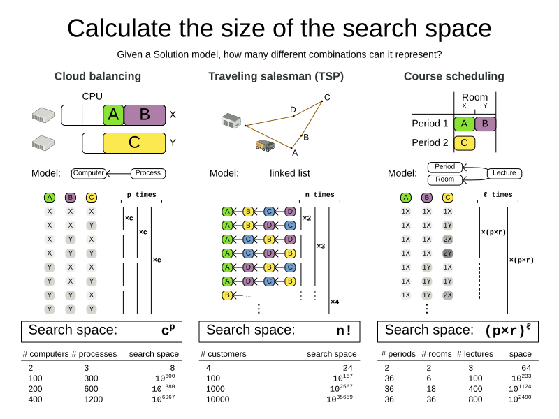

This search space size calculation includes infeasible solutions (if they can be represented by the model), because:

- The optimal solution might be infeasible.
- There are many types of hard constraints that cannot be incorporated in the formula practically.

Even in cases where adding some of the hard constraints in the formula is practical, the resulting search space is still huge.

An algorithm that checks every possible solution (even with pruning, such as in [Branch And Bound](#pdf-dest-66bcaa308e0828c4)) can easily run for billions of years on a single real-life planning problem. The aim is to find the best solution in the available timeframe. Planning competitions (such as the International Timetabling Competition) show that [Local Search](#pdf-dest-e84f741fdc5e9d5c) usually performs best for real-world problems given real-world time limitations.

<a id="pdf-dest-ae2450e5d591fc8f"></a>

<a id="section-0433"></a>
#### 37.1.2. Does Timefold Solver find the optimal solution?

The business wants the optimal solution, but they also have other requirements:

- Scale out: Large production data sets must not crash and have also good results.
- Optimize the right problem: The constraints must match the actual business needs.
- Available time: The solution must be found in time, before it becomes useless to execute.
- Reliability: Every data set must have at least a decent result (better than a human planner).

Given these requirements, and despite the promises of some salesmen, it is usually impossible for anyone or anything to find the optimal solution. Therefore, Timefold Solver focuses on finding the best solution in available time.

The nature of NP-complete problems make scaling a prime concern.

The quality of a result from a small data set is no indication of the quality of a

result from a large data set.

Scaling issues cannot be mitigated by hardware purchases later on. Start testing with a production sized data set as soon as possible. Do not assess quality on small data sets (unless production encounters only such data sets). Instead, solve a production sized data set and compare the results of longer executions, different algorithms and - if available - the human planner.

<a id="pdf-dest-b9cfd8f8a88824a3"></a>

<a id="section-0434"></a>
#### 37.1.3. Supported optimization algorithms

Timefold Solver supports three families of optimization algorithms: Exhaustive Search, Construction Heuristics and Metaheuristics. In practice, Metaheuristics (in combination with Construction Heuristics to initialize) are the recommended choice:

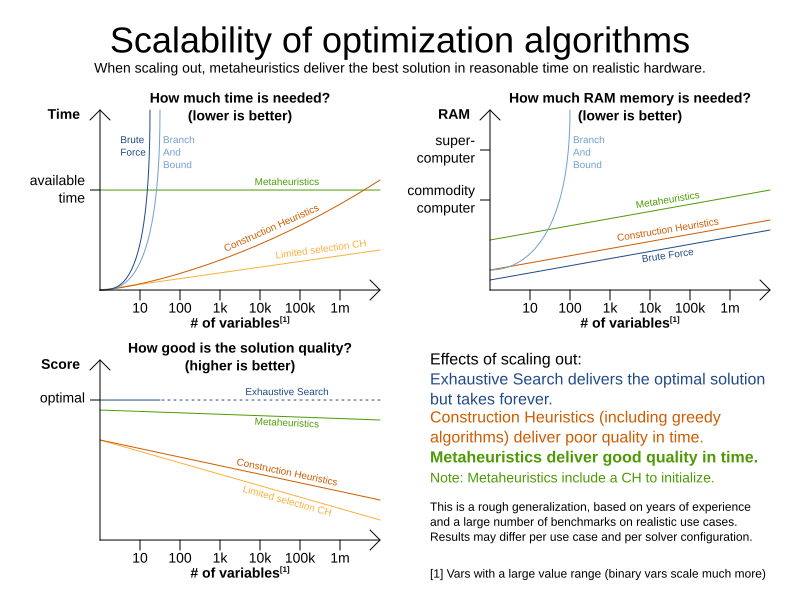

Each of these algorithm families have multiple optimization algorithms:

Table 3. Optimization Algorithms Overview

| Algorithm | Scalable? | Optimal? | Easy to<br>use? | Tweakable? | Requires CH? |
| --- | --- | --- | --- | --- | --- |
| Exhaustive Search (ES) |  |  |  |  |  |
| Brute Force | 0/5 | 5/5 | 5/5 | 0/5 | No |
| Branch And Bound | 0/5 | 5/5 | 4/5 | 2/5 | No |
| Construction heuristics (CH) |  |  |  |  |  |
| First Fit | 5/5 | 1/5 | 5/5 | 1/5 | No |
| First Fit Decreasing | 5/5 | 2/5 | 4/5 | 2/5 | No |
| Weakest Fit | 5/5 | 2/5 | 4/5 | 2/5 | No |
| Weakest Fit Decreasing | 5/5 | 2/5 | 4/5 | 2/5 | No |
| Strongest Fit | 5/5 | 2/5 | 4/5 | 2/5 | No |
| Strongest Fit Decreasing | 5/5 | 2/5 | 4/5 | 2/5 | No |
| Cheapest Insertion | 3/5 | 2/5 | 5/5 | 2/5 | No |
| Regret Insertion | 3/5 | 2/5 | 5/5 | 2/5 | No |
| Metaheuristics (MH) |  |  |  |  |  |

| Algorithm | Scalable? | Optimal? | Easy to<br>use? | Tweakable? | Requires CH? |
| --- | --- | --- | --- | --- | --- |
| Local Search (LS) |  |  |  |  |  |
| Hill Climbing | 5/5 | 2/5 | 4/5 | 3/5 | Yes |
| Tabu Search | 5/5 | 4/5 | 3/5 | 5/5 | Yes |
| Simulated Annealing | 5/5 | 4/5 | 2/5 | 5/5 | Yes |
| Late Acceptance | 5/5 | 4/5 | 3/5 | 5/5 | Yes |
| Great Deluge | 5/5 | 4/5 | 3/5 | 5/5 | Yes |
| Step Counting Hill<br>Climbing | 5/5 | 4/5 | 3/5 | 5/5 | Yes |
| Variable Neighborhood<br>Descent | 3/5 | 3/5 | 2/5 | 5/5 | Yes |

To learn more about metaheuristics, see [Essentials of Metaheuristics](http://www.cs.gmu.edu/~sean/book/metaheuristics/) or Clever Algorithms. ([source](http://www.cleveralgorithms.com/))

<a id="pdf-dest-d4e0db4e0985af5d"></a>

<a id="section-0435"></a>
#### 37.1.4. Which optimization algorithms should I use?

The best optimization algorithm configuration to use depends heavily on your use case. However, this basic procedure provides a good starting configuration that will produce better than average results.

1. Start with a quick configuration that involves little or no configuration and optimization code: See [First Fit](#pdf-dest-d4897728b8bfbf6b).

2. Next, implement [planning entity sorting](#pdf-dest-079a1ff77d0c06ee) and turn it into First Fit Decreasing. ([source](#pdf-dest-8deb00f7b61fa64c))

3. Next, add Late Acceptance behind it:

a. First Fit Decreasing.

b. [Late Acceptance](#pdf-dest-b3962aeb6c3ed004).

At this point, the return on invested time lowers and the result is likely to be sufficient.

However, this can be improved at a lower return on invested time. Use the [Benchmarker](#pdf-dest-e921478f36b99095) and try a couple of different Tabu Search, Simulated Annealing and Late Acceptance configurations, for example:

1. First Fit Decreasing

2. [Tabu Search](#pdf-dest-2786eebffee016f0).

Use the [Benchmarker](#pdf-dest-e921478f36b99095) to improve the values for the size parameters.

Other experiments can also be run. For example, the following multiple algorithms can be combined together:

1. First Fit Decreasing

2. Late Acceptance (relatively long time) 3. Tabu Search (relatively short time)

<a id="pdf-dest-179cb2473987a2a9"></a>

<a id="section-0436"></a>
### 37.2. Architecture

Timefold Solver combines optimization algorithms (metaheuristics, …) with score calculation by a score calculation engine. This combination is very efficient, because:

- A score calculation engine is great for calculating the score of a solution of a planning problem. It makes it easy and scalable to add additional soft or hard constraints. It does [incremental score calculation (deltas)](#pdf-dest-d8e7743e38ee4cd8) without any extra code. However it tends to be not suitable to actually find new solutions.
- An optimization algorithm is great at finding new improving solutions for a planning problem, without necessarily brute-forcing every possibility. However, it needs to know the score of a solution and offers no support in calculating that score efficiently.

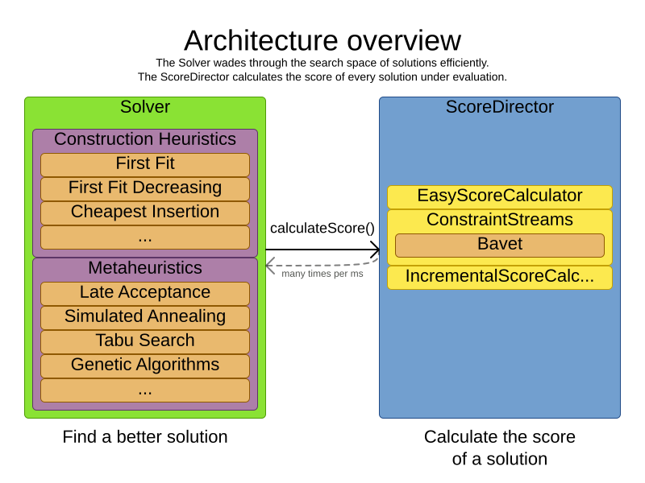

<a id="pdf-dest-f2ca36bd8d489282"></a>

<a id="section-0437"></a>
#### 37.2.1. Power tweaking or default parameter values

Many optimization algorithms have parameters that affect results and scalability. Timefold Solver applies configuration by exception, so all optimization algorithms have default parameter values. This is very similar to the Garbage Collection parameters in a JVM: most users have no need to tweak them, but power users often do.

The default parameter values are sufficient for many cases (and especially for prototypes), but if development time allows, it may be beneficial to power tweak them with the [benchmarker](#pdf-dest-e921478f36b99095) for better results and scalability on a specific use case. The documentation for each optimization algorithm also declares the advanced configuration for power tweaking.

The default value of parameters will change between minor versions, to improve them for most users. The advanced configuration can be used to prevent unwanted changes, however, this is not recommended.

<a id="pdf-dest-1d7731b7bc15e8fa"></a>

<a id="section-0438"></a>
#### 37.2.2. Solver phase

A Solver can use multiple optimization algorithms in sequence. Each optimization algorithm is represented by one solver Phase. There is never more than one Phase solving at the same time.

Some Phase implementations can combine techniques from multiple optimization algorithms, but it is still just one Phase. For example: a Local Search Phase can do Simulated Annealing with entity Tabu.

Here is a configuration that runs three phases in sequence:

```
<solver xmlns="https://timefold.ai/xsd/solver" xmlns:xsi=
"http://www.w3.org/2001/XMLSchema-instance"
    xsi:schemaLocation="https://timefold.ai/xsd/solver
https://timefold.ai/xsd/solver/solver.xsd">
    ...
    <constructionHeuristic>
    ... <!-- First phase: First Fit Decreasing -->
    </constructionHeuristic>
    <localSearch>
    ... <!-- Second phase: Late Acceptance -->
    </localSearch>
    <localSearch>
    ... <!-- Third phase: Tabu Search -->
    </localSearch>
</solver>
```

The solver phases are run in the order defined by solver configuration.

- When the first Phase terminates, the second Phase starts, and so on.
- When the last Phase terminates, the Solver terminates.

Usually, a Solver will first run a construction heuristic and then run one or multiple metaheuristics:

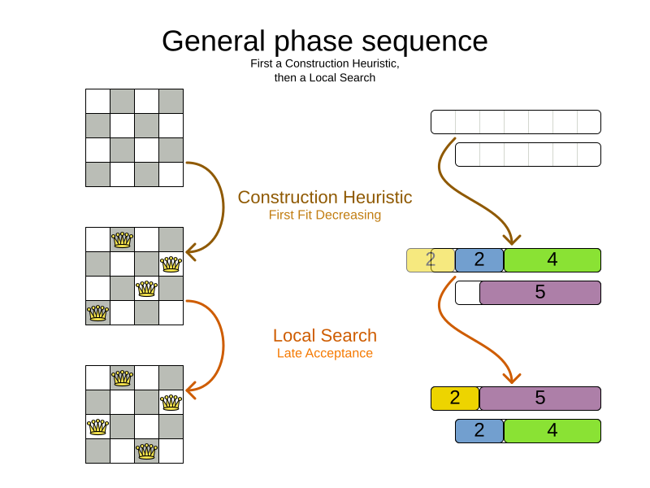

If no phases are configured, Timefold Solver will default to a Construction Heuristic phase followed by a Local Search phase.

Some phases (especially construction heuristics) will terminate automatically. Other phases (especially metaheuristics) will only terminate if the Phase is configured to terminate:

```
<solver xmlns="https://timefold.ai/xsd/solver" xmlns:xsi=
"http://www.w3.org/2001/XMLSchema-instance"
    xsi:schemaLocation="https://timefold.ai/xsd/solver
https://timefold.ai/xsd/solver/solver.xsd">
    ...
    <termination><!-- Solver termination -->
    <secondsSpentLimit>90</secondsSpentLimit>
    </termination>
    <localSearch>
    <termination><!-- Phase termination -->
        <secondsSpentLimit>60</secondsSpentLimit><!-- Give the next phase a chance to
run too, before the Solver terminates -->
    </termination>
    ...
    </localSearch>
    <localSearch>
    ...
    </localSearch>
</solver>
```

If the Solver terminates (before the last Phase terminates itself), the current phase is terminated and all subsequent phases will not run.

<a id="pdf-dest-7b1b379a66ae245b"></a>

<a id="section-0439"></a>
#### 37.2.3. Scope overview

A solver will iteratively run phases. Each phase will usually iteratively run steps. Each step, in turn, usually iteratively runs moves. These form four nested scopes:

1. Solver

2. Phase

3. Step

4. Move

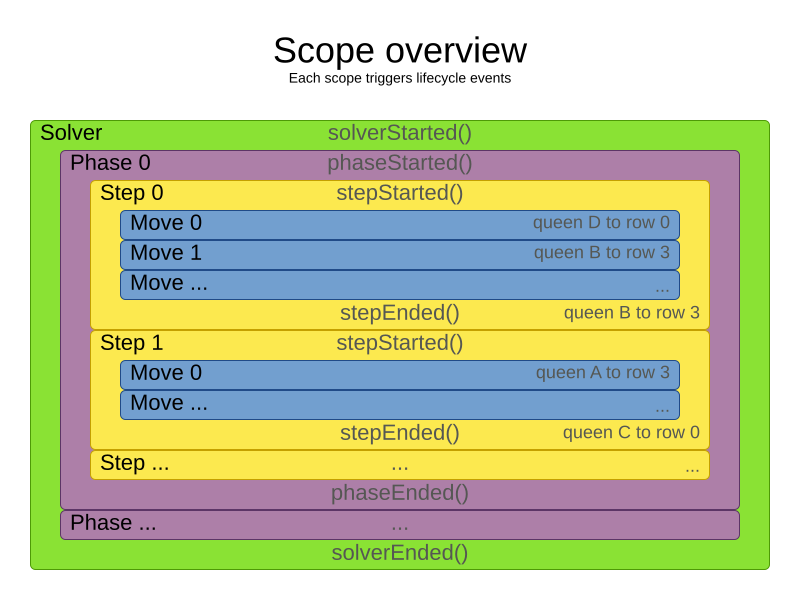

Configure [logging](#pdf-dest-0a149844a7c9f4cf) to display the log messages of each scope.

<a id="pdf-dest-bf632b0c64c01081"></a>

<a id="section-0440"></a>
#### 37.2.4. Termination

Not all phases terminate automatically and may take a significant amount of time. A Solver can be terminated synchronously by up-front configuration, or asynchronously from another thread.

Metaheuristic phases in particular need to be instructed to stop solving. This can be because of a number of reasons, for example, if the time is up, or the perfect score has been reached just before its solution is used. Finding the optimal solution cannot be relied on (unless you know the optimal score), because a metaheuristic algorithm is generally unaware of the optimal solution.

This is not an issue for real-life problems, as finding the optimal solution may take more time than is available. Finding the best solution in the available time is the most important outcome.

If no termination is configured (and a metaheuristic algorithm is used), the Solver will run forever unless [terminateEarly()](#pdf-dest-928814b5610e676f) is called from another thread. This is especially common during [real-time planning](#pdf-dest-601e0ae9a75a4274).

For synchronous termination, configure a Termination on a Solver or a Phase when it needs to stop. Every Termination can calculate a time gradient (needed for some optimization algorithms), which is a ratio between the time already spent solving and the estimated entire solving time of the Solver or Phase.

<a id="pdf-dest-dd0f19a2c357fd49"></a>

37.2.4.1. Choosing the right termination

There are several aspects to consider when choosing a termination, such as the problem size, the hardware used, and the desired quality of the solution. In general:

- Time-based terminations (such as [unimproved time spent](#pdf-dest-6527952883dc2234)) are hardware-specific. Running the solver for 5 minutes on a laptop will yield very different results, compared to running the same solver for the same 5 minutes on a supercomputer.
- Counting terminations (such as [step count](#pdf-dest-586483548a23201a)) are useful for debugging, but in the real world they do not scale well with the problem size. The solver will need many more steps to solve a large problem than it needs to solve a small problem.
- Score-based terminations (such as [best score](#pdf-dest-1e7f09ebde7ea3cb)) assume you know the target score ahead of time, which is typically not the case. And even when you do, this score is dependent on the dataset and on the constraint weights configured.

For the best experience overall, we recommend using the [Diminished Returns termination](#pdf-dest-fa5deae3da5a4eac). It is based on the rate of improvement of the solver, and should therefore be mostly independent of the factors listed above.

<a id="pdf-dest-0db042c5559e2fc8"></a>

37.2.4.2. Combining multiple terminations

Terminations can be combined. The following example will terminate the solver when the [rate of](#pdf-dest-fa5deae3da5a4eac) [improvement drops off](#pdf-dest-fa5deae3da5a4eac) or after the solver has already run for 5 minutes, whichever comes first:

```
<termination>
    <terminationCompositionStyle>OR</terminationCompositionStyle>
    <diminishedReturns />
    <minutesSpentLimit>5</minutesSpentLimit>
</termination>
```

Alternatively you can use AND. The following example will terminate after reaching a feasible score of at least -100 and no improvements in 5 steps:

```
<termination>
    <terminationCompositionStyle>AND</terminationCompositionStyle>
    <bestScoreLimit>-100</bestScoreLimit>
    <unimprovedStepCountLimit>5</unimprovedStepCountLimit>
</termination>
```

This example ensures it does not just terminate after finding a feasible solution, but also completes any obvious improvements on that solution before terminating.

<a id="pdf-dest-928814b5610e676f"></a>

37.2.4.3. Asynchronous termination from another thread

Asynchronous termination cannot be configured by a Termination as it is impossible to predict when and if it will occur. For example, a user action or a server restart could require a solver to terminate earlier than predicted.

To terminate a solver from another thread asynchronously call the terminateEarly() method from another thread:

Java

```
solver.terminateEarly();
```

The solver then terminates at its earliest convenience. After termination, the Solver.solve(Solution) method returns in the solver thread (which is the original thread that called it).

When an ExecutorService shuts down, it interrupts all threads in its thread pool.

To guarantee a graceful shutdown of a thread pool that contains solver threads, an interrupt of a solver thread has the same effect as calling Solver.terminateEarly() explicitly.

<a id="pdf-dest-94e8f179f7588eba"></a>

37.2.4.4. Available terminations

<a id="pdf-dest-12dcb388934336b3"></a>

37.2.4.4.1. Time spent termination

Terminates when an amount of time has been used.

```
<termination>
    <!-- 2 minutes and 30 seconds in ISO 8601 format P[n]Y[n]M[n]DT[n]H[n]M[n]S -->
    <spentLimit>PT2M30S</spentLimit>
</termination>
```

Alternatively to a java.util.Duration in ISO 8601 format, you can also use:

- Milliseconds
```
<termination>
    <millisecondsSpentLimit>500</millisecondsSpentLimit>
</termination>
```

- Seconds
```
<termination>
    <secondsSpentLimit>10</secondsSpentLimit>
</termination>
```

- Minutes
```
<termination>
    <minutesSpentLimit>5</minutesSpentLimit>
</termination>
```

- Hours
```
<termination>
    <hoursSpentLimit>1</hoursSpentLimit>
</termination>
```

- Days
```
<termination>
    <daysSpentLimit>2</daysSpentLimit>
</termination>
```

Multiple time types can be used together, for example to configure 150 minutes, either configure it directly:

```
<termination>
    <minutesSpentLimit>150</minutesSpentLimit>
</termination>
```

Or use a combination that sums up to 150 minutes:

```
<termination>
    <hoursSpentLimit>2</hoursSpentLimit>
    <minutesSpentLimit>30</minutesSpentLimit>
</termination>
```

This Termination will most likely sacrifice perfect reproducibility (even with environmentMode NO_ASSERT) because the available CPU time differs frequently between runs:

- The available CPU time influences the number of steps that can be taken, which might be a few more or less.
- The Termination might produce slightly different time gradient values, which will send time gradient-based algorithms (such as Simulated Annealing) on a radically different path.

<a id="pdf-dest-6527952883dc2234"></a>

37.2.4.4.2. Unimproved time spent termination

Terminates when the best score has not improved in a specified amount of time. Each time a new best solution is found, the timer basically resets.

```
<localSearch>
    <termination>
    <!-- 2 minutes and 30 seconds in ISO 8601 format P[n]Y[n]M[n]DT[n]H[n]M[n]S -->
    <unimprovedSpentLimit>PT2M30S</unimprovedSpentLimit>
    </termination>
</localSearch>
```

Alternatively to a java.util.Duration in ISO 8601 format, you can also use:

- Milliseconds
```
<localSearch>
    <termination>
    <unimprovedMillisecondsSpentLimit>500</unimprovedMillisecondsSpentLimit>
    </termination>
</localSearch>
```

- Seconds
```
<localSearch>
    <termination>
    <unimprovedSecondsSpentLimit>10</unimprovedSecondsSpentLimit>
    </termination>
</localSearch>
```

- Minutes
```
<localSearch>
    <termination>
    <unimprovedMinutesSpentLimit>5</unimprovedMinutesSpentLimit>
    </termination>
</localSearch>
```

- Hours
```
<localSearch>
    <termination>
    <unimprovedHoursSpentLimit>1</unimprovedHoursSpentLimit>
    </termination>
</localSearch>
```

- Days
```
<localSearch>
    <termination>
    <unimprovedDaysSpentLimit>1</unimprovedDaysSpentLimit>
    </termination>
</localSearch>
```

Just like [time spent termination](#pdf-dest-12dcb388934336b3), combinations are summed up.

It is preffered to configure this termination on a specific Phase (such as <localSearch>) instead of on the Solver itself.

Several phases, such as construction heuristics, do not count towards this termination because they only trigger new best solution events when they are done. If such a phase is encountered, the termination is disabled and when the next phase is started, the termination is enabled again and the timer resets back to zero. In the most typical case, where a local search phase follows a construction heuristic phase, the termination will only trigger if the local search phase does not improve the best solution for the specified time.

This Termination will most likely sacrifice perfect reproducibility (even with environmentMode NO_ASSERT) as the available CPU time differs frequently between runs:

- The available CPU time influences the number of steps that can be taken, which might be a few more or less.
- The Termination might produce slightly different time gradient values, which will send time gradient based algorithms (such as Simulated Annealing) on a radically different path.

Optionally, configure a score difference threshold by which the best score must improve in the specified time. For example, if the score doesn’t improve by at least 100 soft points every 30 seconds or less, it terminates:

```
<localSearch>
    <termination>
    <unimprovedSecondsSpentLimit>30</unimprovedSecondsSpentLimit>
    <unimprovedScoreDifferenceThreshold>
0hard/100soft</unimprovedScoreDifferenceThreshold>
    </termination>
</localSearch>
```

If the score improves by 1 hard point and drops 900 soft points, it’s still meets the threshold, because 1hard/-900soft is larger than the threshold 0hard/100soft.

On the other hand, a threshold of 1hard/0soft is not met by any new best solution that improves 1 hard point at the expense of 1 or more soft points, because 1hard/-100soft is smaller than the threshold 1hard/0soft.

To require a feasibility improvement every 30 seconds while avoiding the pitfall above, use a wildcard * for lower score levels that are allowed to deteriorate if a higher score level improves:

```
<localSearch>
    <termination>
    <unimprovedSecondsSpentLimit>30</unimprovedSecondsSpentLimit>
    <unimprovedScoreDifferenceThreshold>
1hard/*soft</unimprovedScoreDifferenceThreshold>
    </termination>
</localSearch>
```

This effectively implies a threshold of 1hard/-2147483648soft, because it relies on Integer.MIN_VALUE.

<a id="pdf-dest-1e7f09ebde7ea3cb"></a>

37.2.4.4.3. BestScoreTermination

BestScoreTermination terminates when a certain score has been reached. Use this Termination where the perfect score is known, for example for four queens (which uses a [SimpleScore](#pdf-dest-cc9c01243df9d61a)):

```
<termination>
    <bestScoreLimit>0</bestScoreLimit>
</termination>
```

A planning problem with a [HardSoftScore](#pdf-dest-9fb009e8d1e16dcb) may look like this:

```
<termination>
    <bestScoreLimit>0hard/-5000soft</bestScoreLimit>
</termination>
```

A planning problem with a [BendableScore](#pdf-dest-5f50fe8ef6399f43) with three hard levels and one soft level may look like this:

```
<termination>
    <bestScoreLimit>[0/0/0]hard/[-5000]soft</bestScoreLimit>
</termination>
```

In this instance, Termination once a feasible solution has been reached is not practical because it requires a bestScoreLimit such as 0hard/-2147483648soft. Use the next termination instead.

<a id="pdf-dest-3264659fc890f845"></a>

37.2.4.4.4. BestScoreFeasibleTermination

Terminates as soon as a feasible solution has been discovered.

```
<termination>
    <bestScoreFeasible>true</bestScoreFeasible>
</termination>
```

This Termination is usually combined with other terminations.

<a id="pdf-dest-586483548a23201a"></a>

37.2.4.4.5. StepCountTermination

Terminates when a number of steps has been reached. This is useful for hardware performance independent runs.

```
<localSearch>
    <termination>
    <stepCountLimit>100</stepCountLimit>
    </termination>
</localSearch>
```

This Termination can only be used for a Phase (such as <localSearch>), not for the Solver itself.

<a id="pdf-dest-baa97a4def617db0"></a>

37.2.4.4.6. UnimprovedStepCountTermination

Terminates when the best score has not improved in a number of steps. This is useful for hardware performance independent runs.

```
<localSearch>
    <termination>
    <unimprovedStepCountLimit>100</unimprovedStepCountLimit>
    </termination>
</localSearch>
```

If the score has not improved recently, it is unlikely to improve in a reasonable timeframe. It has been observed that once a new best solution is found (even after a long time without improvement on the best solution), the next few steps tend to improve the best solution.

This Termination can only be used for a Phase (such as <localSearch>), not for the Solver itself.

<a id="pdf-dest-c348ac498409f644"></a>

37.2.4.4.7. ScoreCalculationCountTermination

ScoreCalculationCountTermination terminates when a number of score calculations have been reached. This is often the sum of the number of moves and the number of steps. This is useful for benchmarking.

```
<termination>
    <scoreCalculationCountLimit>100000</scoreCalculationCountLimit>
</termination>
```

Switching [EnvironmentMode](#pdf-dest-8c3966531f8dd74d) can heavily impact when this termination ends.

<a id="pdf-dest-c5ab21f365e6650b"></a>

37.2.4.4.8. MoveCountTermination

MoveCountTermination terminates when a number of evaluated moves have been reached. This is useful for benchmarking.

```
<termination>
    <moveCountLimit>100000</moveCountLimit>
</termination>
```

Switching [EnvironmentMode](#pdf-dest-8c3966531f8dd74d) can heavily impact when this termination ends.

<a id="pdf-dest-fa5deae3da5a4eac"></a>

37.2.4.4.9. DiminishedReturnsTermination

To save on CPU costs, you might want to terminate the solver early if expected improvements are minimal. This is hard to configure with absolute terminations since:

- For time-based absolute terminations, they depend on the hardware used for solving. A computer that is twice as powerful should be given half the time.
- For score-based absolute terminations, they depend on the problem. A problem with many entities will have larger score improvements than a problem with few entities.

For these situations, the diminished returns termination is desirable since it terminates based on the relative rate of improvement, and behaves similarly on different hardware and different problem instances.

The diminished returns termination terminates when the rate of improvement is below a percentage of the initial rate of improvement. The rate of improvement is the softest score difference between the final best score and the initial best score in a window, divided by the duration of the window. The first window is called a grace period, which cannot trigger a termination. If the hard score improves, the grace period is reset and the initial rate of improvement is recalculated.

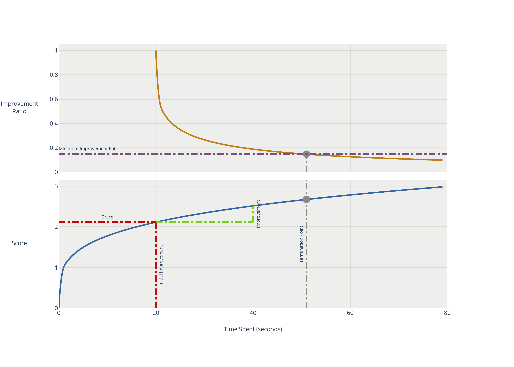

```
<localSearch>
    <termination>
    <diminishedReturns />
    </termination>
</localSearch>
```

There are two properties that can optionally be configured:

- slidingWindowDuration, which is the initial grace period and is the length of the window that is used for the rate of improvement calculation.
```
<localSearch>
    <termination>
    <diminishedReturns>
        <slidingWindowDuration>PT2M30S</slidingWindowDuration>
    </diminishedReturns>
    </termination>
</localSearch>
```

Alternatively to a java.util.Duration in ISO 8601 format, you can also use milliseconds, seconds, minutes, hours or days:

```
<localSearch>
    <termination>
    <diminishedReturns>
        <slidingWindowSeconds>500</slidingWindowSeconds>
    </diminishedReturns>
    </termination>
</localSearch>
```

- minimumImprovementRatio, which is the minimum value that the ratio between the current and the initial rate of change can be to prevent termination. For instance, if minimumImprovementRatio is 0.2, then the current rate of change must be 20% of the initial rate of change to prevent termination.
```
<localSearch>
    <termination>
    <diminishedReturns>
        <minimumImprovementRatio>0.2</minimumImprovementRatio>
    </diminishedReturns>
    </termination>
</localSearch>
```

<a id="pdf-dest-820fe464c018fa9c"></a>

<a id="section-0441"></a>
#### 37.2.5. SolverEventListener

Each time a new best solution is found, a new BestSolutionChangedEvent is fired in the Solver thread.

To listen to such events, add a SolverEventListener to the Solver:

Java

```
public interface Solver<Solution_> {
    ...

    void addEventListener(SolverEventListener<S> eventListener);
    void removeEventListener(SolverEventListener<S> eventListener);

}
```

The BestSolutionChangedEvent's newBestSolution may not be initialized or feasible. Use the isFeasible() method on BestSolutionChangedEvent's new best Score to detect such cases. Use the event’s isNewBestSolutionInitialized() method to only ignore uninitialized solutions, but also accept infeasible solutions.

The bestSolutionChanged() method is called in the solver’s thread, as part of

Solver.solve(). So it should return quickly to avoid slowing down the solving.

<a id="pdf-dest-e58afaee859d157b"></a>

<a id="section-0442"></a>
#### 37.2.6. Custom solver phase

Run a custom optimization algorithm between phases or before the first phase to initialize the solution, or to get a better score quickly. You will still want to reuse the score calculation. For example, to implement a custom Construction Heuristic without implementing an entire Phase.

Most of the time, a custom solver phase is not worth the investment of development time. [Construction Heuristics](#pdf-dest-68e6e1c4a99df0a3) are configurable and support partially initialized solutions too. You can use the [Benchmarker](#pdf-dest-e921478f36b99095) to tweak them.

The PhaseCommand interface appears as follows:

```
public interface PhaseCommand<Solution_> {

    void changeWorkingSolution(PhaseCommandContext<Solution_> commandContext);

}
```

The PhaseCommandContext interface offers the following methods:

Object getWorkingSolution() Returns the working solution of the Solver that is being solved. This must not be directly modified, as that would corrupt the Solver.

void execute(Move) Executes a Move on the working solution. This is the only way to change the working solution without corrupting the Solver. Users can either provide a custom Move implementation, or build one using the [built-in](#pdf-dest-b34e34bdbbb2b0cd) Moves factory. getSolutionMetaModel() method of PhaseCommandContext can be used to get the SolutionMetaModel of the working solution, which will help with creating these Move instances.

Object executeTemporarily(Move, Function) As defined above, but the executed move is immediately undone. The provided Function is executed while the move is still applied, so that the user can perform arbitrary calculations on the working solution with the move applied. The return value of the provided Function is returned by this method.

Object executeTemporarilyHandlingStructurallyFlawedSolutions(Move, Function, Function) As executeTemporarily(Move, Function), but the executed move is allowed to result in a [structurally flawed](#pdf-dest-7331bc9bbf44c3bc) solution. If the temporarily modified solution is structurally flawed, the second provided Function is executed with it instead of the first one. executeTemporarilyAndCalculateScoreHandlingStructurallyFlawedSolutions(Move, Function, Function) is the counterpart that guarantees a fresh score at the end of the method’s invocation.

boolean isPhaseTerminated() Returns true if the PhaseCommand should terminate. Object lookUpWorkingObject(Object externalObject)

Returns the working object that corresponds to the given external object. This is useful when the PhaseCommand remembers an object from some previous working solution, and needs to find the corresponding object in the current working solution, which may have been [planning-cloned](#pdf-dest-565fb1d17532a1e8) since.

Any change on the planning entities in a PhaseCommand must be done through the execute or executeTemporarily methods, to avoid corrupting the Solver. For performance reasons, these methods will not compute a fresh score before it finishes. If you want a fresh score computed, these methods have counterparts, executeAndCalculateScore and executeTemporarilyAndCalculateScore.

If a Move causes the working solution to become [structurally flawed](#pdf-dest-7331bc9bbf44c3bc), the execute, executeAndCalculateScore, executeTemporarily and executeTemporarilyAndCalculateScore methods fail fast and throw an IllegalArgumentException. If a PhaseCommand leaves the working solution structurally flawed when it returns, the Solver throws an IllegalStateException. To inspect a structurally flawed solution instead of failing fast, use the executeTemporarilyHandlingStructurallyFlawedSolutions or executeTemporarilyAndCalculateScoreHandlingStructurallyFlawedSolutions methods described above.

Long-running commands may want to periodically check isPhaseTerminated and when it returns true, terminate the command by returning. The solver will only terminate after the command returns.

Do not change any of the problem facts in a PhaseCommand or add or remove entities,

it will corrupt the Solver because any previous score or solution was for a different

problem. To change problem facts or to add or remove entities, read about [repeated planning](#pdf-dest-601e0ae9a75a4274) and use ProblemChange instead. ([source](#pdf-dest-35cafd0605efc0c5))

Configure the PhaseCommand in the solver configuration:

```
<solver xmlns="https://timefold.ai/xsd/solver" xmlns:xsi=
"http://www.w3.org/2001/XMLSchema-instance"
    xsi:schemaLocation="https://timefold.ai/xsd/solver
https://timefold.ai/xsd/solver/solver.xsd">
    ...
    <customPhase>
    <customPhaseCommandClass>...MyCustomPhase</customPhaseCommandClass>
    </customPhase>
    ... <!-- Other phases -->
</solver>
```

Configure multiple customPhaseCommandClass instances to run them in sequence.

If the changes performed in a PhaseCommand do not result in a better score, the best solution will not be changed. Effectively nothing will have changed for the next Phase or PhaseCommand.

To configure values of a PhaseCommand dynamically in the solver configuration (so the [Benchmarker](#pdf-dest-e921478f36b99095) can tweak those parameters), add the customProperties element and use [custom properties](#pdf-dest-b13106eb78a3ed8c):

```
<customPhase>
    <customPhaseCommandClass>...MyCustomPhase</customPhaseCommandClass>
    <customProperties>
    <property name="mySelectionSize" value="5"/>
    </customProperties>
</customPhase>
```

<a id="pdf-dest-ae3201b6a213f787"></a>

<a id="section-0443"></a>
### 37.3. Move and neighborhood selection

<a id="pdf-dest-d4e1205fc0e9b173"></a>

<a id="section-0444"></a>
#### 37.3.1. What is a Move?

A Move is a change (or set of changes) from a solution A to a solution B. For example, the move below changes queen C from row 0 to row 2:

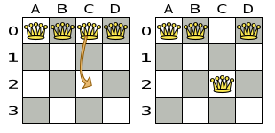

The new solution is called a neighbor of the original solution, because it can be reached in a single Move. Although a single move can change multiple queens, the neighbors of a solution should always be a tiny subset of all possible solutions. For example, on that original solution, these are all possible changeMoves:

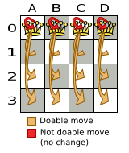

If we ignore the four changeMoves that have no impact and are therefore not doable, we can see that the number of moves is n * (n - 1) = 12. This is far less than the number of possible solutions, which is n ^ n = 256. As the problem scales out, the number of possible moves increases far less than the number of possible solutions.

Yet, in four changeMoves or less we can reach any solution. For example we can reach a very different solution in three changeMoves:

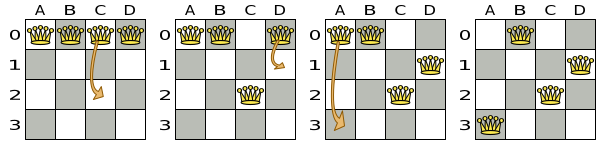

There are many other types of moves besides changeMoves. Many move types are

included out-of-the-box, but you can also implement custom moves. A Move can

affect multiple entities, but it must not change the problem facts, add or remove entities.

All optimization algorithms use Moves to transition from one solution to a neighbor solution. Therefore, all the optimization algorithms are confronted with Move selection: the craft of creating and iterating moves efficiently and the art of finding the most promising subset of random moves to evaluate first.

<a id="pdf-dest-27e696416c229e3c"></a>

<a id="section-0445"></a>
#### 37.3.2. Custom moves

<a id="pdf-dest-60d50e715d9c0672"></a>

37.3.2.1. Which move types might be missing in my implementation?

To determine which move types might be missing in your implementation, run a [Benchmarker](#pdf-dest-e921478f36b99095) for a short amount of time and [configure it to write the best solutions to disk](#pdf-dest-4ebee5dfb22b4026). Take a look at such a best solution: it will likely be a local optima. Try to figure out if there’s a move that could get out of that local optima faster.

If you find one, implement that coarse-grained move, mix it with the existing moves and benchmark it against the previous configurations to see if you want to keep it.

<a id="pdf-dest-9d3d330c599a6652"></a>

37.3.2.2. How to implement custom moves

At the moment, Timefold Solver offers two ways to implement custom moves.

Neighborhoods API The [Neighborhoods API](#pdf-dest-601e0ae9a75a4274) is a simple and intuitive way to implement custom moves. It is currently a preview feature and is expected to be the main way to implement custom moves in the near future. However, it is possible that some advanced features are not yet supported. We encourage you to try it out and give feedback on the features you need.

Move Selector API The [Move Selector API](#pdf-dest-601e0ae9a75a4274) is the original way of implementing custom moves. It is complex and very difficult to implement correctly and test, but it supports all possible features. It is expected to be deprecated in the near future, but it is still available for use.

Neither of these are part of our public API backwards compatibility guarantees, although Neighborhoods will eventually become a fully supported API.

<a id="pdf-dest-68e6e1c4a99df0a3"></a>

<a id="section-0446"></a>
## Chapter 38. Construction heuristics

<a id="pdf-dest-dd0c99ffb478bf02"></a>

<a id="section-0447"></a>
### 38.1. Overview

A construction heuristic builds a pretty good initial solution in a finite length of time. Its solution isn’t always feasible, but it finds it fast so metaheuristics can finish the job.

Construction heuristics terminate automatically, so there’s usually no need to configure a Termination on the construction heuristic phase specifically.

<a id="pdf-dest-d4897728b8bfbf6b"></a>

<a id="section-0448"></a>
### 38.2. First fit

<a id="pdf-dest-2ace45250e630f2d"></a>

<a id="section-0449"></a>
#### 38.2.1. Algorithm description

The First Fit algorithm cycles through all the planning entities (in default order), initializing one planning entity at a time. It assigns the planning entity to the best available planning value, taking the already initialized planning entities into account. It terminates when all planning entities have been initialized. It never changes a planning entity after it has been assigned.

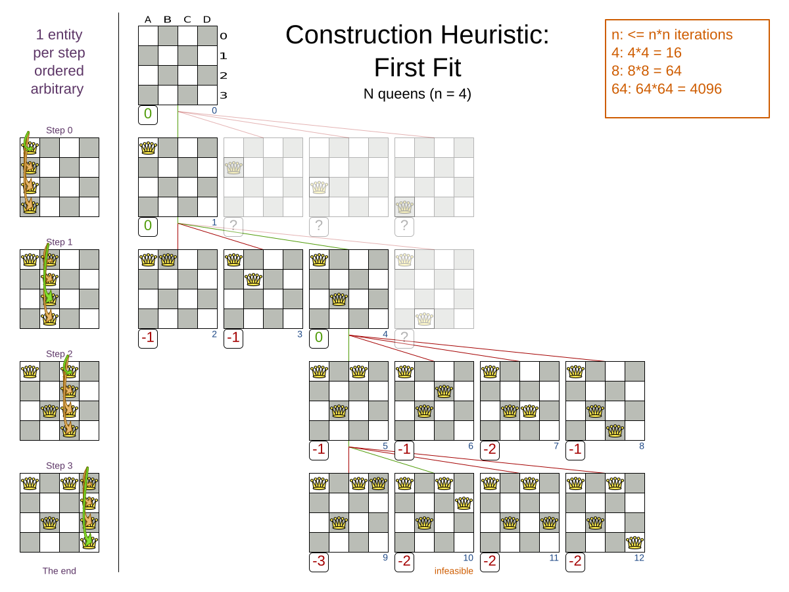

Notice that it starts with putting Queen A into row 0 (and never moving it later), which makes it impossible to reach the optimal solution. Suffixing this construction heuristic with metaheuristics can remedy that.

<a id="pdf-dest-3bfe10cc3e58ec2f"></a>

<a id="section-0450"></a>
#### 38.2.2. Configuration

Simple configuration:

```
<constructionHeuristic>
    <constructionHeuristicType>FIRST_FIT</constructionHeuristicType>
</constructionHeuristic>
```

Advanced configuration:

```
<constructionHeuristic>
    <constructionHeuristicType>FIRST_FIT</constructionHeuristicType>
    <...MoveSelector/>
    <...MoveSelector/>
    ...
</constructionHeuristic>
```

For scaling out, see [scaling construction heuristics](#pdf-dest-cbadcb5e65d3f9a3). For a very advanced configuration, see Allocate ([source](#pdf-dest-77b6d47b1fec42d0)) [Entity From Queue](#pdf-dest-77b6d47b1fec42d0).

<a id="pdf-dest-8deb00f7b61fa64c"></a>

<a id="section-0451"></a>
### 38.3. First fit decreasing

<a id="pdf-dest-b93d48c228703348"></a>

<a id="section-0452"></a>
#### 38.3.1. Algorithm description

Like [First Fit](#pdf-dest-d4897728b8bfbf6b), but analyzes the "more difficult" planning entities first, because they are less likely to fit in the leftovers. It sorts the planning entities in descending order by any given metric, meaning that "more difficult" planning entities are added earlier in the list while "less difficult" values are included later.

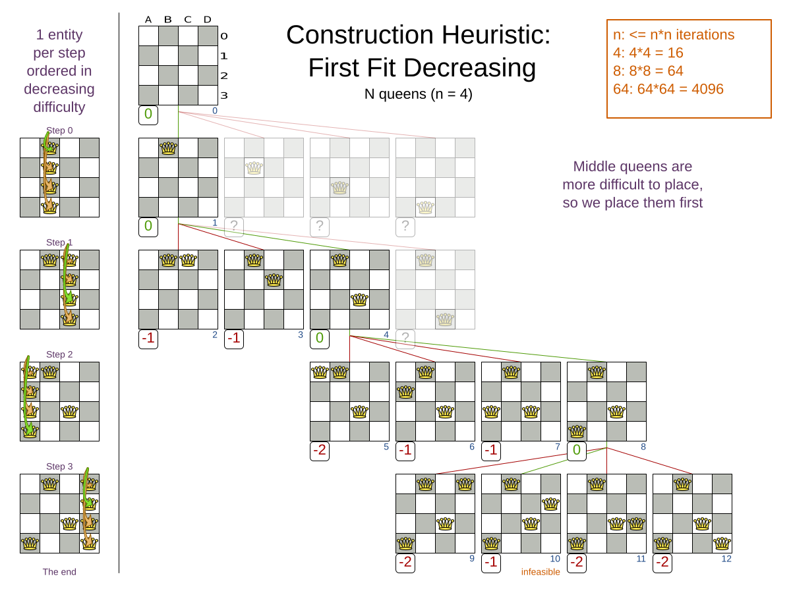

Requires the model to support [planning entity sorting](#pdf-dest-079a1ff77d0c06ee).

One would expect that this algorithm has better results than First Fit. That’s

usually the case, but not always.

<a id="pdf-dest-b2f3a1936838645e"></a>

<a id="section-0453"></a>
#### 38.3.2. Configuration

Simple configuration:

```
<constructionHeuristic>
    <constructionHeuristicType>FIRST_FIT_DECREASING</constructionHeuristicType>
</constructionHeuristic>
```

Advanced configuration:

```
<constructionHeuristic>
    <constructionHeuristicType>FIRST_FIT_DECREASING</constructionHeuristicType>
    <...MoveSelector/>
    <...MoveSelector/>
    ...
</constructionHeuristic>
```

For scaling out, see [scaling construction heuristics](#pdf-dest-cbadcb5e65d3f9a3). For a very advanced configuration, see Allocate ([source](#pdf-dest-77b6d47b1fec42d0)) [Entity From Queue](#pdf-dest-77b6d47b1fec42d0).

<a id="pdf-dest-d387a5bbd7262985"></a>

<a id="section-0454"></a>
### 38.4. Weakest fit

<a id="pdf-dest-0b144317ec873b02"></a>

<a id="section-0455"></a>
#### 38.4.1. Algorithm description

Like [First Fit](#pdf-dest-d4897728b8bfbf6b), but it analyzes the "weaker" planning values first, because the "stronger" planning values are more likely to be able to accommodate later planning entities. It sorts the planning values in ascending order by any given metric, meaning that "weaker" planning values are added earlier in the list while "stronger" values are included later.

Requires the model to support [planning value sorting](#pdf-dest-67c289716d37513f).

Do not presume that this algorithm has better results than First Fit. That’s often

not the case.

<a id="pdf-dest-4e05b53bdfb342a2"></a>

<a id="section-0456"></a>
#### 38.4.2. Configuration

Simple configuration:

```
<constructionHeuristic>
    <constructionHeuristicType>WEAKEST_FIT</constructionHeuristicType>
</constructionHeuristic>
```

Advanced configuration:

```
<constructionHeuristic>
    <constructionHeuristicType>WEAKEST_FIT</constructionHeuristicType>
    <...MoveSelector/>
    <...MoveSelector/>
    ...
</constructionHeuristic>
```

For scaling out, see [scaling construction heuristics](#pdf-dest-cbadcb5e65d3f9a3). For a very advanced configuration, see Allocate ([source](#pdf-dest-77b6d47b1fec42d0)) [Entity From Queue](#pdf-dest-77b6d47b1fec42d0).

<a id="pdf-dest-a7b2ce093a965c2f"></a>

<a id="section-0457"></a>
### 38.5. Weakest fit decreasing

<a id="pdf-dest-1e6130e476ddd73c"></a>

<a id="section-0458"></a>
#### 38.5.1. Algorithm description

Combines [First Fit Decreasing](#pdf-dest-8deb00f7b61fa64c) and Weakest Fit. It sorts the planning entities in descending order ([source](#pdf-dest-d387a5bbd7262985)) and the planning values in ascending order based on defined metrics.

Requires the model to support [planning entity sorting](#pdf-dest-079a1ff77d0c06ee) and planning value sorting. ([source](#pdf-dest-67c289716d37513f)) Do not presume that this algorithm has better results than First Fit Decreasing.

That’s often not the case. However, it is usually better than Weakest Fit.

<a id="pdf-dest-569796726ac8a43d"></a>

<a id="section-0459"></a>
#### 38.5.2. Configuration

Simple configuration:

```
<constructionHeuristic>
    <constructionHeuristicType>WEAKEST_FIT_DECREASING</constructionHeuristicType>
</constructionHeuristic>
```

Advanced configuration:

```
<constructionHeuristic>
    <constructionHeuristicType>WEAKEST_FIT_DECREASING</constructionHeuristicType>
    <...MoveSelector/>
    <...MoveSelector/>
    ...
</constructionHeuristic>
```

For scaling out, see [scaling construction heuristics](#pdf-dest-cbadcb5e65d3f9a3). For a very advanced configuration, see Allocate ([source](#pdf-dest-77b6d47b1fec42d0)) [Entity From Queue](#pdf-dest-77b6d47b1fec42d0).

<a id="pdf-dest-98e5d6c93a10e511"></a>

<a id="section-0460"></a>
### 38.6. Strongest fit

<a id="pdf-dest-963bcd3401161068"></a>

<a id="section-0461"></a>
#### 38.6.1. Algorithm description

Like [First Fit](#pdf-dest-d4897728b8bfbf6b), but it analyzes the "stronger" planning values first, because the "stronger" planning values are more likely to have a lower soft cost to use. So it sorts the planning values in descending order by any given metric, meaning that "stronger" planning values are added earlier in the list.

Requires the model to support [planning value sorting](#pdf-dest-67c289716d37513f).

Do not presume that this algorithm has better results than First Fit or Weakest Fit.

That’s often not the case.

<a id="pdf-dest-798aff0da28b56f8"></a>

<a id="section-0462"></a>
#### 38.6.2. Configuration

Simple configuration:

```
<constructionHeuristic>
    <constructionHeuristicType>STRONGEST_FIT</constructionHeuristicType>
</constructionHeuristic>
```

Advanced configuration:

```
<constructionHeuristic>
    <constructionHeuristicType>STRONGEST_FIT</constructionHeuristicType>
    <...MoveSelector/>
    <...MoveSelector/>
    ...
</constructionHeuristic>
```

For scaling out, see [scaling construction heuristics](#pdf-dest-cbadcb5e65d3f9a3). For a very advanced configuration, see Allocate ([source](#pdf-dest-77b6d47b1fec42d0)) [Entity From Queue](#pdf-dest-77b6d47b1fec42d0).

<a id="pdf-dest-a0dbecd2e9b1b6d7"></a>

<a id="section-0463"></a>
### 38.7. Strongest fit decreasing

<a id="pdf-dest-5bb6365c1dfa34d4"></a>

<a id="section-0464"></a>
#### 38.7.1. Algorithm description

Combines [First Fit Decreasing](#pdf-dest-8deb00f7b61fa64c) and Strongest Fit. It sorts the planning entities and the planning ([source](#pdf-dest-98e5d6c93a10e511)) values in descending order based on defined metrics.

Requires the model to support [planning entity sorting](#pdf-dest-079a1ff77d0c06ee) and planning value sorting. ([source](#pdf-dest-67c289716d37513f))

Do not presume that this algorithm has better results than First Fit Decreasing or Weakest Fit Decreasing. That’s often not the case. However, it is usually better than Strongest Fit.

<a id="pdf-dest-cb846a4b7d92a65b"></a>

<a id="section-0465"></a>
#### 38.7.2. Configuration

Simple configuration:

```
<constructionHeuristic>
    <constructionHeuristicType>STRONGEST_FIT_DECREASING</constructionHeuristicType>
</constructionHeuristic>
```

Advanced configuration:

```
<constructionHeuristic>
    <constructionHeuristicType>STRONGEST_FIT_DECREASING</constructionHeuristicType>
    <...MoveSelector/>
    <...MoveSelector/>
    ...
</constructionHeuristic>
```

For scaling out, see [scaling construction heuristics](#pdf-dest-cbadcb5e65d3f9a3). For a very advanced configuration, see Allocate ([source](#pdf-dest-77b6d47b1fec42d0)) [Entity From Queue](#pdf-dest-77b6d47b1fec42d0).

<a id="pdf-dest-77b6d47b1fec42d0"></a>

<a id="section-0466"></a>
### 38.8. Allocate entity from queue

<a id="pdf-dest-b6ba88ce2bafe709"></a>

<a id="section-0467"></a>
#### 38.8.1. Algorithm description

Allocate Entity From Queue is a versatile generic form of [First Fit](#pdf-dest-d4897728b8bfbf6b), First Fit Decreasing, Weakest Fit, ([source](#pdf-dest-8deb00f7b61fa64c)) ([source](#pdf-dest-d387a5bbd7262985)) [Weakest Fit Decreasing](#pdf-dest-a7b2ce093a965c2f), Strongest Fit and Strongest Fit Decreasing. It works like this: ([source](#pdf-dest-98e5d6c93a10e511)) ([source](#pdf-dest-a0dbecd2e9b1b6d7))

1. Put all entities in a queue.

2. Assign the first entity (from that queue) to the best value.

3. Repeat until all entities are assigned.

<a id="pdf-dest-543bbf307da314b2"></a>

<a id="section-0468"></a>
#### 38.8.2. Configuration

Simple configuration:

```
<constructionHeuristic>
    <constructionHeuristicType>ALLOCATE_ENTITY_FROM_QUEUE</constructionHeuristicType>
</constructionHeuristic>
```

Verbose simple configuration:

```
<constructionHeuristic>
    <constructionHeuristicType>ALLOCATE_ENTITY_FROM_QUEUE</constructionHeuristicType>
    <entitySorterManner>DESCENDING_IF_AVAILABLE</entitySorterManner>
    <valueSorterManner>ASCENDING_IF_AVAILABLE</valueSorterManner>
</constructionHeuristic>
```

The entitySorterManner options are:

- DESCENDING: Evaluate the planning entities in descending order based on a given metric. This usually increases pruning (and therefore improves scalability). Requires the model to support [planning entity sorting](#pdf-dest-079a1ff77d0c06ee).
- DESCENDING_IF_AVAILABLE (default): If the model supports [planning entity sorting](#pdf-dest-079a1ff77d0c06ee), behave like DESCENDING, else like NONE.
- NONE: Initialize the planning entities in original order.

The valueSorterManner options are:

- ASCENDING: Evaluate the planning values in ascending order based on a given metric. Requires the model to support [planning value sorting](#pdf-dest-67c289716d37513f).
- ASCENDING_IF_AVAILABLE (default): If the model supports [planning value sorting](#pdf-dest-67c289716d37513f), behave like ASCENDING, else like NONE.
- DESCENDING: Evaluate the planning values in descending order based on a given metric. Requires the model to support [planning value sorting](#pdf-dest-67c289716d37513f).
- DESCENDING_IF_AVAILABLE: If the model supports [planning value sorting](#pdf-dest-67c289716d37513f), behave like DESCENDING, else like NONE.
- NONE: Try the planning values in original order.

Advanced configuration with [Weakest Fit Decreasing](#pdf-dest-a7b2ce093a965c2f) for a single entity class with one variable:

```
<constructionHeuristic>
    <queuedEntityPlacer>
    <entitySelector id="placerEntitySelector">
        <cacheType>PHASE</cacheType>
        <selectionOrder>SORTED</selectionOrder>
        <sorterManner>DESCENDING</sorterManner>
    </entitySelector>
    <changeMoveSelector>
        <entitySelector mimicSelectorRef="placerEntitySelector"/>
        <valueSelector>
        <cacheType>PHASE</cacheType>
        <selectionOrder>SORTED</selectionOrder>
        <sorterManner>ASCENDING</sorterManner>
        </valueSelector>
    </changeMoveSelector>
    </queuedEntityPlacer>
</constructionHeuristic>
```

Per step, the QueuedEntityPlacer selects one uninitialized entity from the EntitySelector and applies the winning Move (out of all the moves for that entity generated by the MoveSelector). The [mimic](#pdf-dest-ea5272da85e01e82) [selection](#pdf-dest-ea5272da85e01e82) ensures that the winning Move changes only the selected entity.

To customize the entity or value sorting, see [sorted selection](#pdf-dest-636879f0dfd222e5). For scaling out, see scaling ([source](#pdf-dest-cbadcb5e65d3f9a3)) [construction heuristics](#pdf-dest-cbadcb5e65d3f9a3).

If there are multiple planning variables, there’s one ChangeMoveSelector per planning variable, which are either in a cartesian product or in sequential steps, similar to [the less verbose](#pdf-dest-0ea34fcdbb6ce5cc) [configuration](#pdf-dest-0ea34fcdbb6ce5cc).

<a id="pdf-dest-b097e79ca832a3d0"></a>

<a id="section-0469"></a>
#### 38.8.3. Multiple entity classes

The easiest way to deal with multiple entity classes is to run a separate Construction Heuristic for each entity class:

```
<constructionHeuristic>
    <queuedEntityPlacer>
    <entitySelector id="placerEntitySelector">
        <entityClass>...DogEntity</entityClass>
        <cacheType>PHASE</cacheType>
    </entitySelector>
    <changeMoveSelector>
        <entitySelector mimicSelectorRef="placerEntitySelector"/>
    </changeMoveSelector>
    </queuedEntityPlacer>
    ...
</constructionHeuristic>
<constructionHeuristic>
    <queuedEntityPlacer>
    <entitySelector id="placerEntitySelector">
        <entityClass>...CatEntity</entityClass>
        <cacheType>PHASE</cacheType>
    </entitySelector>
    <changeMoveSelector>
        <entitySelector mimicSelectorRef="placerEntitySelector"/>
    </changeMoveSelector>
    </queuedEntityPlacer>
    ...
</constructionHeuristic>
```

<a id="pdf-dest-1837f320410db8a0"></a>

<a id="section-0470"></a>
#### 38.8.4. Pick early type

There are several pick early types for Construction Heuristics:

- NEVER: Evaluate all the selected moves to initialize the variable(s). This is the default if the [InitializingScoreTrend](#pdf-dest-4d25901f9469bdae) is not ONLY_DOWN.
```
<constructionHeuristic>
    ...
    <forager>
    <pickEarlyType>NEVER</pickEarlyType>
    </forager>
</constructionHeuristic>
```

- FIRST_NON_DETERIORATING_SCORE: Initialize the variable(s) with the first move that doesn’t deteriorate the score, ignore the remaining selected moves. This is the default if the [InitializingScoreTrend](#pdf-dest-4d25901f9469bdae) is ONLY_DOWN.
```
<constructionHeuristic>
    ...
    <forager>
    <pickEarlyType>FIRST_NON_DETERIORATING_SCORE</pickEarlyType>
    </forager>
</constructionHeuristic>
```

If there are only negative constraints, but the [InitializingScoreTrend](#pdf-dest-4d25901f9469bdae) is strictly

not ONLY_DOWN, it can sometimes make sense to apply

FIRST_NON_DETERIORATING_SCORE. Use the [Benchmarker](#pdf-dest-e921478f36b99095) to decide if the score quality loss is worth the time gain.

- FIRST_FEASIBLE_SCORE: Initialize the variable(s) with the first move that has a feasible score.
```
<constructionHeuristic>
    ...
    <forager>
    <pickEarlyType>FIRST_FEASIBLE_SCORE</pickEarlyType>
    </forager>
</constructionHeuristic>
```

If the [InitializingScoreTrend](#pdf-dest-4d25901f9469bdae) is ONLY_DOWN, use FIRST_FEASIBLE_SCORE_OR_NON_DETERIORATING_HARD instead, because that’s faster without any disadvantages.

- FIRST_FEASIBLE_SCORE_OR_NON_DETERIORATING_HARD: Initialize the variable(s) with the first move that doesn’t deteriorate the feasibility of the score any further.
```
<constructionHeuristic>
    ...
    <forager>
    <pickEarlyType>FIRST_FEASIBLE_SCORE_OR_NON_DETERIORATING_HARD</pickEarlyType>
    </forager>
</constructionHeuristic>
```

<a id="pdf-dest-dcc21a7969ecbc52"></a>

<a id="section-0471"></a>
### 38.9. Allocate to value from queue

<a id="pdf-dest-07c25fc47528d742"></a>

<a id="section-0472"></a>
#### 38.9.1. Algorithm description

Allocate To Value From Queue works like this:

1. Put all values in a round-robin queue.

2. Assign the best entity to the first value (from that queue).

3. Repeat until all entities are assigned.

<a id="pdf-dest-a8fa279df078ec3b"></a>

<a id="section-0473"></a>
#### 38.9.2. Configuration

Simple configuration:

```
<constructionHeuristic>
    <constructionHeuristicType>
ALLOCATE_TO_VALUE_FROM_QUEUE</constructionHeuristicType>
</constructionHeuristic>
```

Verbose simple configuration:

```
<constructionHeuristic>
    <constructionHeuristicType>
ALLOCATE_TO_VALUE_FROM_QUEUE</constructionHeuristicType>
    <entitySorterManner>DESCENDING_IF_AVAILABLE</entitySorterManner>
    <valueSorterManner>ASCENDING_IF_AVAILABLE</valueSorterManner>
</constructionHeuristic>
```

Advanced configuration for a single entity class with a single variable:

```
<constructionHeuristic>
    <queuedValuePlacer>
    <valueSelector id="placerValueSelector">
        <cacheType>PHASE</cacheType>
        <selectionOrder>SORTED</selectionOrder>
        <sorterManner>ASCENDING</sorterManner>
    </valueSelector>
    <listChangeMoveSelector>
        <valueSelector mimicSelectorRef="placerValueSelector">
        </valueSelector>
        <destinationSelector>
            <entitySelector>
            <cacheType>PHASE</cacheType>
            <selectionOrder>SORTED</selectionOrder>
            <sorterManner>DESCENDING</sorterManner>
            </entitySelector>
            <valueSelector mimicSelectorRef="placerValueSelector"/>
        </destinationSelector>
    </listChangeMoveSelector>
    </queuedValuePlacer>
</constructionHeuristic>
```

For scaling out, see [scaling construction heuristics](#pdf-dest-cbadcb5e65d3f9a3).

<a id="pdf-dest-141f2cc4e33dbb8f"></a>

<a id="section-0474"></a>
### 38.10. Cheapest insertion

<a id="pdf-dest-bc0f468dcd851dce"></a>

<a id="section-0475"></a>
#### 38.10.1. Algorithm description

The Cheapest Insertion algorithm cycles through all the planning values for all the planning entities, initializing one planning entity at a time. It assigns a planning entity to the best available planning value (out of all the planning entities and values), taking the already initialized planning entities into account. It terminates when all planning entities have been initialized. It never changes a planning entity after it has been assigned.

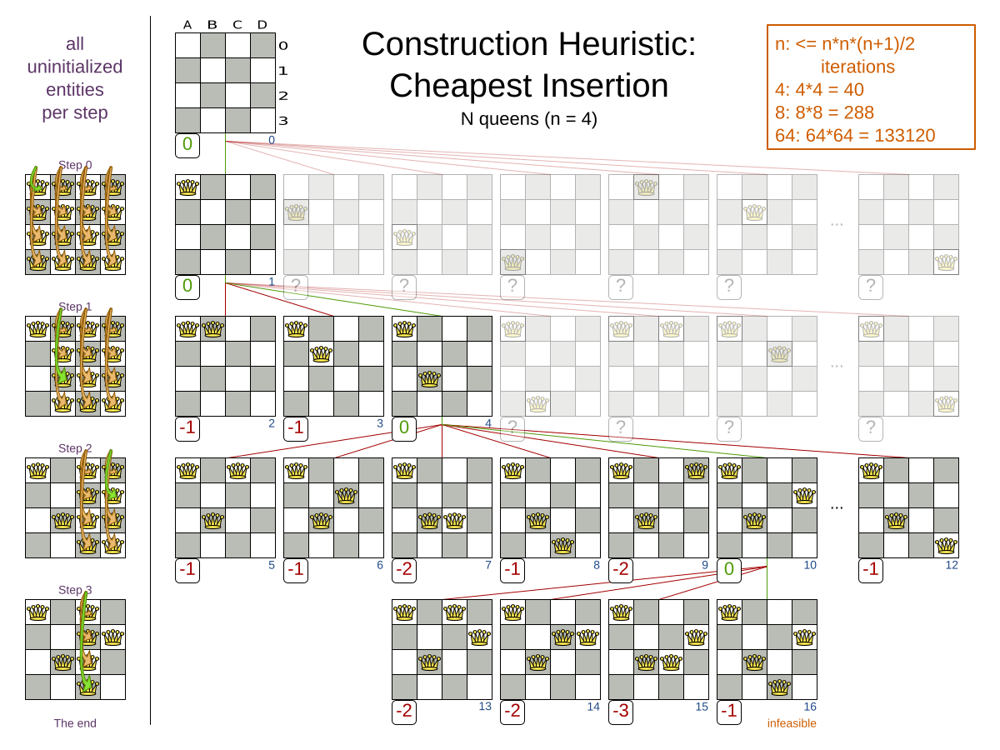

Cheapest Insertion scales considerably worse than First Fit, etc.

<a id="pdf-dest-9671152ae79daf6d"></a>

<a id="section-0476"></a>
#### 38.10.2. Configuration

Simple configuration:

```
<constructionHeuristic>
    <constructionHeuristicType>CHEAPEST_INSERTION</constructionHeuristicType>
</constructionHeuristic>
```

Advanced configuration:

```
<constructionHeuristic>
    <constructionHeuristicType>CHEAPEST_INSERTION</constructionHeuristicType>
    <...MoveSelector/>
    <...MoveSelector/>
    ...
</constructionHeuristic>
```

For scaling out, see [scaling construction heuristics](#pdf-dest-cbadcb5e65d3f9a3). For a very advanced configuration, see Allocate ([source](#pdf-dest-ab3cf88ef669e582)) [from pool](#pdf-dest-ab3cf88ef669e582).

<a id="pdf-dest-32a701f9d311343f"></a>

<a id="section-0477"></a>
### 38.11. Regret insertion

<a id="pdf-dest-cd14e874caa01011"></a>

<a id="section-0478"></a>
#### 38.11.1. Algorithm description

The Regret Insertion algorithm behaves like the Cheapest Insertion algorithm. It also cycles through all the planning values for all the planning entities, initializing one planning entity at a time. But instead of picking the entity-value combination with the best score, it picks the entity which has the largest score loss between its best and second best value assignment. It then assigns that entity to its best value, to avoid regretting not having done that.

<a id="pdf-dest-7a012c2d5b1b8604"></a>

<a id="section-0479"></a>
#### 38.11.2. Configuration

This algorithm has not been implemented yet.

<a id="pdf-dest-ab3cf88ef669e582"></a>

<a id="section-0480"></a>
### 38.12. Allocate from pool

<a id="pdf-dest-99e1cc9ad8940215"></a>

<a id="section-0481"></a>
#### 38.12.1. Algorithm description

Allocate From Pool is a versatile generic form of [Cheapest Insertion](#pdf-dest-141f2cc4e33dbb8f) and Regret Insertion. It works ([source](#pdf-dest-32a701f9d311343f)) like this:

1. Put all entity-value combinations in a pool.

2. Assign the best entity to best value.

3. Repeat until all entities are assigned.

<a id="pdf-dest-349ec1fa9c94f3fc"></a>

<a id="section-0482"></a>
#### 38.12.2. Configuration

Simple configuration:

```
<constructionHeuristic>
    <constructionHeuristicType>ALLOCATE_FROM_POOL</constructionHeuristicType>
</constructionHeuristic>
```

Verbose simple configuration:

```
<constructionHeuristic>
    <constructionHeuristicType>ALLOCATE_FROM_POOL</constructionHeuristicType>
    <entitySorterManner>DESCENDING_IF_AVAILABLE</entitySorterManner>
    <valueSorterManner>ASCENDING_IF_AVAILABLE</valueSorterManner>
</constructionHeuristic>
```

The entitySorterManner and valueSorterManner options are described in [Allocate Entity From Queue](#pdf-dest-77b6d47b1fec42d0).

Advanced configuration with [Cheapest Insertion](#pdf-dest-141f2cc4e33dbb8f) for a single entity class with a single variable:

```
<constructionHeuristic>
    <pooledEntityPlacer>
    <changeMoveSelector>
        <entitySelector id="placerEntitySelector">
        <cacheType>PHASE</cacheType>
        <selectionOrder>SORTED</selectionOrder>
        <sorterManner>DESCENDING</sorterManner>
        </entitySelector>
        <valueSelector>
        <cacheType>PHASE</cacheType>
        <selectionOrder>SORTED</selectionOrder>
        <sorterManner>ASCENDING</sorterManner>
        </valueSelector>
    </changeMoveSelector>
    </pooledEntityPlacer>
</constructionHeuristic>
```

Per step, the PooledEntityPlacer applies the winning Move (out of all the moves for that entity generated by the MoveSelector).

To customize the entity or value sorting, see [sorted selection](#pdf-dest-636879f0dfd222e5). Other Selector customization (such as [filtering](#pdf-dest-c52cb4a39082ea49) and limiting) is supported too. ([source](#pdf-dest-093504348176d064))

For scaling out, see [scaling construction heuristics](#pdf-dest-cbadcb5e65d3f9a3).

<a id="pdf-dest-b7090cd02c2283ca"></a>

<a id="section-0483"></a>
### 38.13. Mixed modeling and construction heuristics

The default behavior of the construction heuristic for [mixed models](#pdf-dest-fc7eb953f94cc686) is to use strategies based on the allocation of [entities](#pdf-dest-77b6d47b1fec42d0) and values for solving all related variables. ([source](#pdf-dest-dcc21a7969ecbc52))

<a id="pdf-dest-3366ddece866b2fb"></a>

<a id="section-0484"></a>
#### 38.13.1. Algorithm description

The allocations work like this:

1. Put all entities in a queue.

2. Assign the first entity (from that queue) to the best value.

3. Repeat until all entities are assigned.

4. Put all values in a round-robin queue.

5. Assign the best entity to the first value (from that queue).

6. Repeat until all entities are assigned.

<a id="pdf-dest-28546b08e7df4bce"></a>

<a id="section-0485"></a>
#### 38.13.2. Configuration

Simple configuration:

```
<!-- Basic Variable -->
<constructionHeuristic>
    <queuedEntityPlacer/>
</constructionHeuristic>
<!-- List Variable -->
<constructionHeuristic>
    <queuedValuePlacer>
        <!-- The variableName property identifies the related list variable -->
        <valueSelector variableName="variableName"/>
    </queuedValuePlacer>
</constructionHeuristic>
```

Advanced configuration for a single entity class with a list variable and a single basic variable:

```
<!-- Basic Variable -->
<constructionHeuristic>
    <queuedEntityPlacer>
    <entitySelector id="placerEntitySelector">
        <cacheType>PHASE</cacheType>
        <selectionOrder>SORTED</selectionOrder>
        <sorterManner>DESCENDING</sorterManner>
    </entitySelector>
    <changeMoveSelector>
        <entitySelector mimicSelectorRef="placerEntitySelector"/>
        <valueSelector>
        <cacheType>PHASE</cacheType>
        <selectionOrder>SORTED</selectionOrder>
        <sorterManner>ASCENDING</sorterManner>
        </valueSelector>
    </changeMoveSelector>
    </queuedEntityPlacer>
</constructionHeuristic>
<!-- List Variable -->
<constructionHeuristic>
    <queuedValuePlacer>
    <!-- The variableName property identifies the related list variable -->
    <valueSelector variableName="variableName">
        <cacheType>PHASE</cacheType>
        <selectionOrder>SORTED</selectionOrder>
        <sorterManner>ASCENDING</sorterManner>
    </valueSelector>
    </queuedValuePlacer>
</constructionHeuristic>
```

<a id="pdf-dest-cbadcb5e65d3f9a3"></a>

<a id="section-0486"></a>
### 38.14. Scaling construction heuristics

If the Construction Heuristic takes a long time to solve and create an initial solution, there is too little time left for [Local Search](#pdf-dest-e84f741fdc5e9d5c) to reach a near optimal solution. Ideally, a Construction Heuristic should take less than 20 seconds from scratch and less than 50 milliseconds in [real-time planning](#pdf-dest-601e0ae9a75a4274), so there is plenty of time left for Local Search. If the ([source](#pdf-dest-e84f741fdc5e9d5c)) [Benchmarker](#pdf-dest-e921478f36b99095) proves that this is not the case, there’s a number of improvements that can be done:

<a id="pdf-dest-4b5e6dc73838db5e"></a>

<a id="section-0487"></a>
#### 38.14.1. InitializingScoreTrend shortcuts

If the [InitializingScoreTrend](#pdf-dest-4d25901f9469bdae) is ONLY_DOWN, a Construction Heuristic algorithm (such as First Fit) is faster: for an entity, it picks the first move for which the score does not deteriorate the last step score, ignoring all subsequent moves in that step.

It can take that shortcut without reducing solution quality, because a down trend guarantees that initializing any additional planning variable can only make the score the same or worse. So if a move has the same score as before the planning variable was initialized, then no other move can have a better score.

<a id="pdf-dest-0ea34fcdbb6ce5cc"></a>

<a id="section-0488"></a>
#### 38.14.2. Scaling multiple planning variables in construction heuristics

There are two ways to deal with multiple planning variables, depending on how their ChangeMoves are combined:

- Cartesian product (default): All variables of the selected entity are assigned together. This usually results in a better solution quality, but it scales poorly because it tries every combination of variables. For example:
```
<constructionHeuristic>
    <constructionHeuristicType>FIRST_FIT_DECREASING</constructionHeuristicType>
    <cartesianProductMoveSelector>
    <changeMoveSelector>
        <valueSelector variableName="period"/>
    </changeMoveSelector>
    <changeMoveSelector>
        <valueSelector variableName="room"/>
    </changeMoveSelector>
    </cartesianProductMoveSelector>
</constructionHeuristic>
```

- Sequential: One variable is assigned at a time. Scales better, at the cost of solution quality. The order of the planning variables matters. For example:
```
<constructionHeuristic>
    <constructionHeuristicType>FIRST_FIT_DECREASING</constructionHeuristicType>
    <changeMoveSelector>
    <valueSelector variableName="period"/>
    </changeMoveSelector>
    <changeMoveSelector>
    <valueSelector variableName="room"/>
    </changeMoveSelector>
</constructionHeuristic>
```

The second way scales better, so it can be worth to switch to it. Especially for three or more planning variables, the scaling difference is huge. For example, with three variables of 1 000 values each, a cartesian product selects 1 000 000 000 moves per entity (1 step per entity). A sequential approach only selects 3 000 moves per entity (3 steps per entity), ending the Construction Heuristic 300 000 times faster.

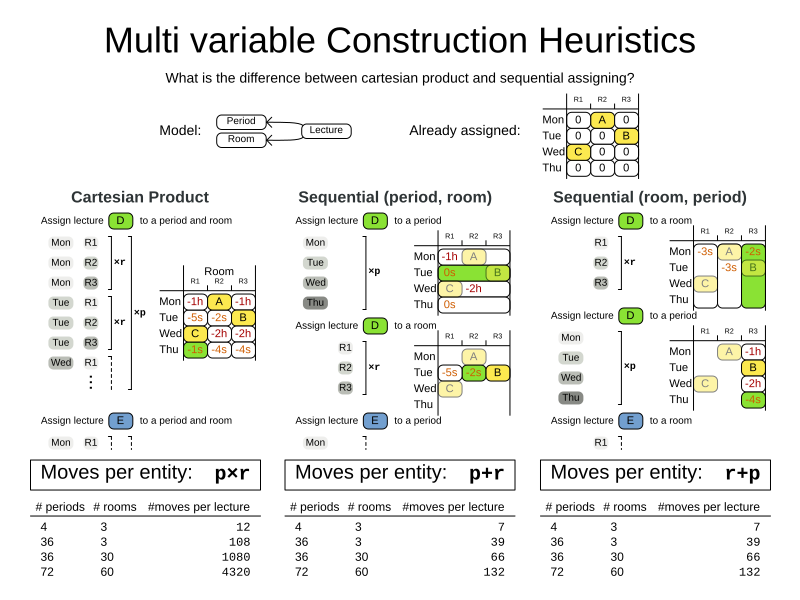

The order of the variables is important, especially in the sequential technique. In the sequential example above, it’s better to select the period first and the room second (instead of the other way around), because there are more hard constraints that do not involve the room, such as no teacher should teach two lectures at the same time.

Let the [Benchmarker](#pdf-dest-e921478f36b99095) guide you.

With three or more variables, it’s possible to combine the cartesian product and sequential techniques:

```
<constructionHeuristic>
    <constructionHeuristicType>FIRST_FIT_DECREASING</constructionHeuristicType>
    <cartesianProductMoveSelector>
    <changeMoveSelector>
        <valueSelector variableName="period"/>
    </changeMoveSelector>
    <changeMoveSelector>
        <valueSelector variableName="room"/>
    </changeMoveSelector>
    </cartesianProductMoveSelector>
    <changeMoveSelector>
    <valueSelector variableName="teacher"/>
    </changeMoveSelector>
</constructionHeuristic>
```

<a id="pdf-dest-acb84263e340b82c"></a>

<a id="section-0489"></a>
#### 38.14.3. Other scaling techniques in construction heuristics

[Partitioned Search](running-timefold-solver/multithreaded-solving.pdf#partitionedSearch) reduces the number of moves per step. On top of that, it runs the Construction Heuristic on the partitions in parallel. It is supported to only partition the Construction Heuristic phase.

Other Selector customizations can also reduce the number of moves generated by step:

- [Filtered selection](#pdf-dest-c52cb4a39082ea49)
- [Limited selection](#pdf-dest-093504348176d064)

<a id="pdf-dest-e84f741fdc5e9d5c"></a>

<a id="section-0490"></a>
## Chapter 39. Local search

<a id="pdf-dest-96a02767a9ec6bd5"></a>

<a id="section-0491"></a>
### 39.1. Overview

Local Search starts from an initial solution and evolves that single solution into a mostly better and better solution. It uses a single search path of solutions, not a search tree. At each solution in this path it evaluates a number of moves on the solution and applies the most suitable move to take the step to the next solution. It does that for a high number of iterations until it’s terminated (usually because its time has run out).

Local Search acts a lot like a human planner: it uses a single search path and moves facts around to find a good feasible solution. Therefore it’s pretty natural to implement.

Local Search needs to start from an initialized solution, therefore it’s usually required to configure a Construction Heuristic phase before it.

<a id="pdf-dest-de13aac35a50af38"></a>

<a id="section-0492"></a>
### 39.2. Local search concepts

<a id="pdf-dest-c5a5336f234351d6"></a>

<a id="section-0493"></a>
#### 39.2.1. Step by step

A step is the winning Move. Local Search tries a number of moves on the current solution and picks the best accepted move as the step:

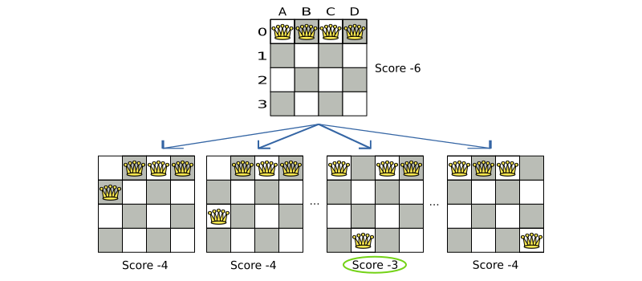

Figure 16. Decide the next step at step 0 (four queens example)

Because the move B0 to B3 has the highest score (-3), it is picked as the next step. If multiple moves have the same highest score, one is picked randomly, in this case B0 to B3. Note that C0 to C3 (not shown) could also have been picked because it also has the score -3.

The step is applied on the solution. From that new solution, Local Search tries every move again, to decide the next step after that. It continually does this in a loop, and we get something like this:

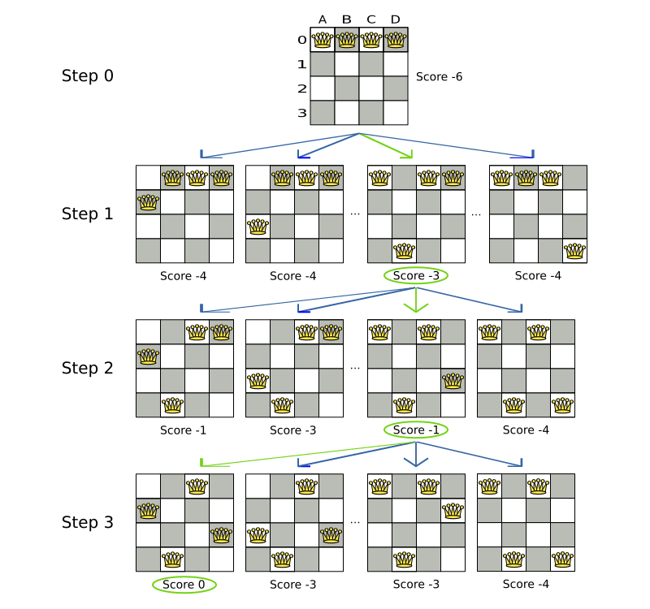

Figure 17. All steps (four queens example)

Notice that Local Search doesn’t use a search tree, but a search path. The search path is highlighted by the green arrows. At each step it tries all selected moves, but unless it’s the step, it doesn’t investigate that solution further. This is one of the reasons why Local Search is very scalable.

Local Search solves the four queens problem by starting with the starting solution and make the following steps sequentially:

1. B0 to B3

2. D0 to D2

3. A0 to A1

A naive Local Search configuration solves the four queens problem in three steps, by evaluating only 37 possible solutions (three steps with 12 moves each + one starting solution), which is only a fraction of all 256 possible solutions. It solves 16 queens in 31 steps, by evaluating only 7441 out of 18446744073709551616 possible solutions. By using a [Construction Heuristics](#pdf-dest-68e6e1c4a99df0a3) phase first, it’s even a lot more efficient.

<a id="pdf-dest-b049d92544f572ed"></a>

<a id="section-0494"></a>
#### 39.2.2. Decide the next step

Local Search decides the next step with the aid of three configurable components:

- A MoveSelector which selects the possible moves of the current solution. See [move and](#pdf-dest-601e0ae9a75a4274) [neighborhood selection](#pdf-dest-601e0ae9a75a4274).
- An Acceptor which filters out unacceptable moves.
- A Forager which gathers accepted moves and picks the next step from them.

The solver phase configuration looks like this:

```
<localSearch>
    <unionMoveSelector>
    ...
    </unionMoveSelector>
    <acceptor>
    ...
    </acceptor>
    <forager>
    ...
    </forager>
</localSearch>
```

In the example below, the MoveSelector generated the moves shown with the blue lines, the Acceptor accepted all of them and the Forager picked the move B0 to B3.


[Turn on](#pdf-dest-0a149844a7c9f4cf) trace logging to show the decision making in the log.

Because the last solution can degrade (such as in Tabu Search), the Solver remembers the best solution it has encountered through the entire search path. Each time the current solution is better than the last best solution, the current solution is [cloned](#pdf-dest-565fb1d17532a1e8) and referenced as the new best solution.

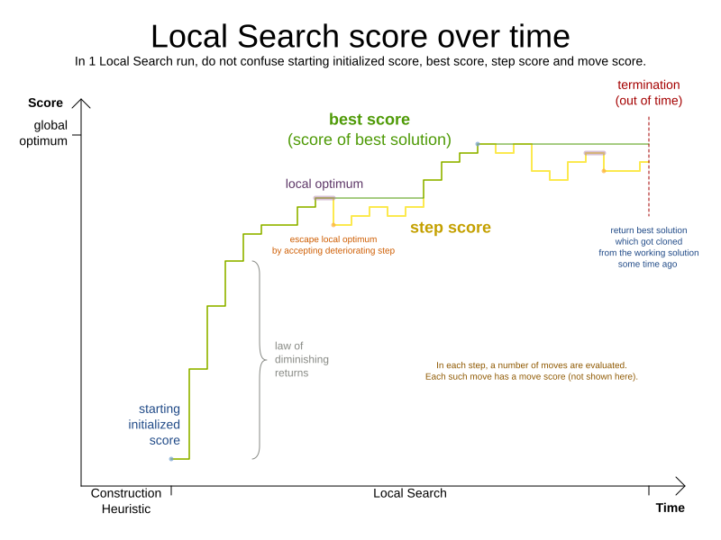

<a id="pdf-dest-7f479f590ad6c917"></a>

<a id="section-0495"></a>
#### 39.2.3. Acceptor

Use an Acceptor (together with a Forager) to activate Tabu Search, Simulated Annealing, Late Acceptance, … For each move it checks whether it is accepted or not.

By changing a few lines of configuration, you can easily switch from Tabu Search to Simulated Annealing or Late Acceptance and back.

You can implement your own Acceptor, but the built-in acceptors should suffice for most needs. You can also combine multiple acceptors.

<a id="pdf-dest-6c6e213ac4c8ce97"></a>

<a id="section-0496"></a>
#### 39.2.4. Forager

A Forager gathers all accepted moves and picks the move which is the next step. Normally it picks the accepted move with the highest score. If several accepted moves have the highest score, one is picked randomly to break the tie. Breaking ties randomly leads to better results.

It is possible to disable breaking ties randomly by explicitly setting breakTieRandomly to false, but that’s almost never a good idea:

- If an earlier move is better than a later move with the same score, the score calculator should add an extra softer [score level](#pdf-dest-219abeecbbbc28d1) to score the first move as slightly better. Don’t rely on move selection order to enforce that.
- Random tie breaking does not affect [reproducibility](#pdf-dest-8c3966531f8dd74d).

<a id="pdf-dest-8d1e0d5f1fbd1783"></a>

39.2.4.1. Accepted count limit

When there are many possible moves, it becomes inefficient to evaluate all of them at every step. To evaluate only a random subset of all the moves, use:

- An acceptedCountLimit integer, which specifies how many accepted moves should be evaluated during each step. By default, all accepted moves are evaluated at every step.
```
<forager>
    <acceptedCountLimit>1000</acceptedCountLimit>
</forager>
```

Unlike the N-queens problem, real world problems require the use of acceptedCountLimit. Start from an acceptedCountLimit that takes a step in less than two seconds. [Turn on INFO logging](#pdf-dest-0a149844a7c9f4cf) to see the step times. Use the [Benchmarker](#pdf-dest-e921478f36b99095) to tweak the value.

With a low acceptedCountLimit (so a fast stepping algorithm), it is recommended to

avoid using selectionOrder SHUFFLED because the shuffling generates a random

number for every element in the selector, taking up a lot of time, but only a few elements are actually selected.

<a id="pdf-dest-629adc4434ca4c55"></a>

39.2.4.2. Pick early type

A forager can pick a move early during a step, ignoring subsequent selected moves. There are three pick early types for Local Search:

- NEVER: A move is never picked early: all accepted moves are evaluated that the selection allows. This is the default.
```
    <forager>
    <pickEarlyType>NEVER</pickEarlyType>
    </forager>
```

- FIRST_BEST_SCORE_IMPROVING: Pick the first accepted move that improves the best score. If none improve the best score, it behaves exactly like the pickEarlyType NEVER.
```
    <forager>
    <pickEarlyType>FIRST_BEST_SCORE_IMPROVING</pickEarlyType>
    </forager>
```

- FIRST_LAST_STEP_SCORE_IMPROVING: Pick the first accepted move that improves the last step score. If none improve the last step score, it behaves exactly like the pickEarlyType NEVER.
```
    <forager>
    <pickEarlyType>FIRST_LAST_STEP_SCORE_IMPROVING</pickEarlyType>
    </forager>
```

<a id="pdf-dest-e13d262955c7a2f1"></a>

<a id="section-0497"></a>
### 39.3. Hill climbing (simple local search)

<a id="pdf-dest-efc6225f9e59d2ef"></a>

<a id="section-0498"></a>
#### 39.3.1. Algorithm description

Hill Climbing tries all selected moves and then takes the best move, which is the move which leads to the solution with the highest score. That best move is called the step move. From that new solution, it again tries all selected moves and takes the best move and continues like that iteratively. If multiple selected moves tie for the best move, one of them is randomly chosen as the best move.

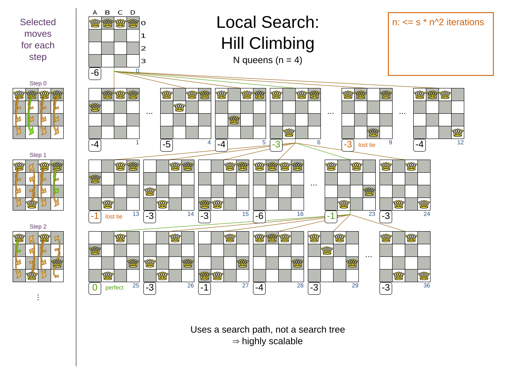

Notice that once a queen has moved, it can be moved again later. This is a good thing, because in an NP-complete problem it’s impossible to predict what will be the optimal final value for a planning variable.

<a id="pdf-dest-4877b3d3ff245991"></a>

<a id="section-0499"></a>
#### 39.3.2. Stuck in local optima

Hill climbing always takes improving moves. This may seem like a good thing, but it’s not: Hill Climbing can easily get stuck in a local optimum. This happens when it reaches a solution for which all the moves deteriorate the score. Even if it picks one of those moves, the next step might go back to the original solution and which case chasing its own tail:

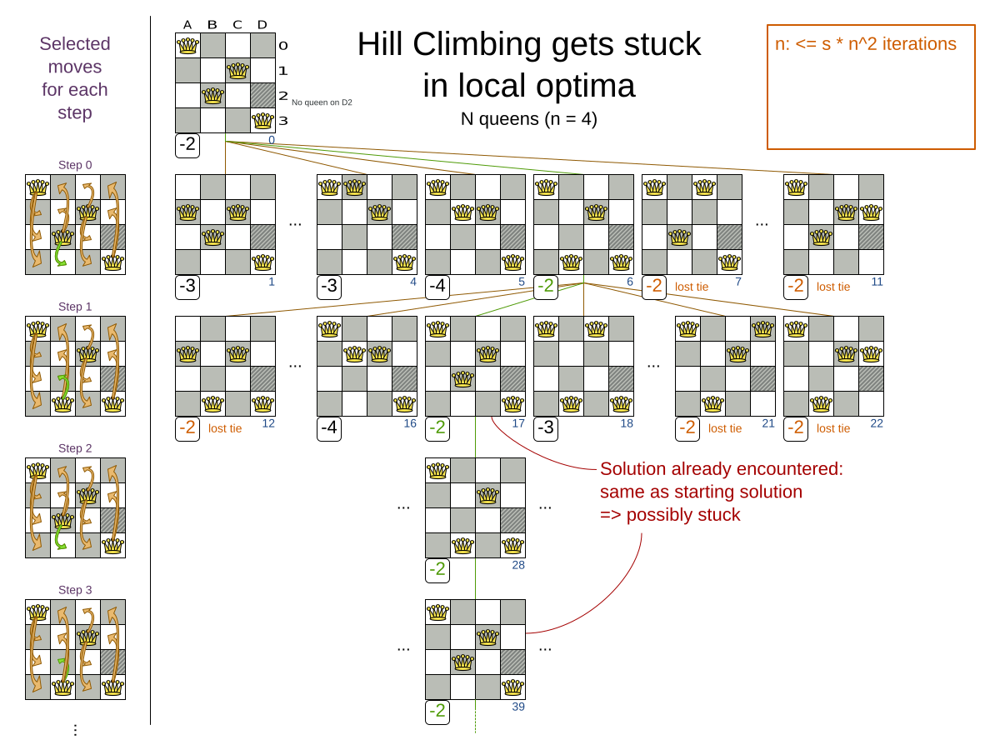

Improvements upon Hill Climbing (such as Tabu Search, Simulated Annealing and Late Acceptance) address the problem of being stuck in local optima. Therefore, it’s recommended to never use Hill Climbing, unless you’re absolutely sure there are no local optima in your planning problem.

<a id="pdf-dest-9acafd9221f152d0"></a>

<a id="section-0500"></a>
#### 39.3.3. Configuration

Simplest configuration:

```
<localSearch>
    <localSearchType>HILL_CLIMBING</localSearchType>
</localSearch>
```

Advanced configuration:

```
<localSearch>
    ...
    <acceptor>
    <acceptorType>HILL_CLIMBING</acceptorType>
    </acceptor>
    <forager>
    <acceptedCountLimit>1</acceptedCountLimit>
    </forager>
</localSearch>
```

<a id="pdf-dest-2786eebffee016f0"></a>

<a id="section-0501"></a>
### 39.4. Tabu search

<a id="pdf-dest-3d4fd5c6b284d708"></a>

<a id="section-0502"></a>
#### 39.4.1. Algorithm description

Tabu Search is a Local Search that maintains a tabu list to avoid getting stuck in local optima. The tabu list holds recently used objects that are taboo to use for now. Moves that involve an object in the tabu list, are not accepted. The tabu list objects can be anything related to the move, such as the planning entity, planning value, move, solution, …

See example with entity tabu for four queens, so the queens are put in the tabu list:

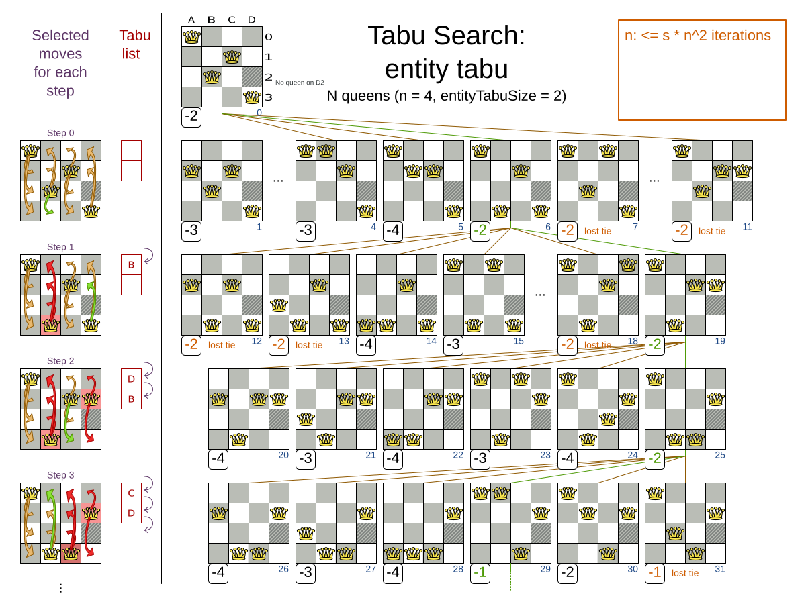

<a id="pdf-dest-50e5ea1ff364b53c"></a>

<a id="section-0503"></a>
#### 39.4.2. Configuration

Simplest configuration:

```
<localSearch>
    <localSearchType>TABU_SEARCH</localSearchType>
</localSearch>
```

When Tabu Search takes steps it creates one or more tabus. For a number of steps, it does not accept a move if that move breaks tabu. That number of steps is the tabu size. Advanced configuration:

```
<localSearch>
    ...
    <acceptor>
    <entityTabuSize>7</entityTabuSize>
    </acceptor>
    <forager>
    <acceptedCountLimit>1000</acceptedCountLimit>
    </forager>
</localSearch>
```

A Tabu Search acceptor should be combined with a high acceptedCountLimit, such

as 1000.

Timefold Solver implements several tabu types:

- Planning entity tabu (recommended) makes the planning entities of recent steps tabu. For example, for school timetabling it makes the recently moved lessons tabu. It’s recommended to start with this tabu type.
```
    <acceptor>
    <entityTabuSize>7</entityTabuSize>
    </acceptor>
```

To avoid hard coding the tabu size, configure a tabu ratio, relative to the number of entities, for example 2%:

```
    <acceptor>
    <entityTabuRatio>0.02</entityTabuRatio>
    </acceptor>
```

- Planning value tabu makes the planning values of recent steps tabu. For example, for school timetablig it makes the recently assigned timeslots tabu.
```
    <acceptor>
    <valueTabuSize>7</valueTabuSize>
    </acceptor>
```

To avoid hard coding the tabu size, configure a tabu ratio, relative to the number of values, for example 2%:

```
    <acceptor>
    <valueTabuRatio>0.02</valueTabuRatio>
    </acceptor>
```

- Move tabu makes recent steps tabu. It does not accept a move equal to one of those steps.
```
    <acceptor>
    <moveTabuSize>7</moveTabuSize>
    </acceptor>
```

When using move tabu with [custom moves](#pdf-dest-27e696416c229e3c), make sure that the planning entities

do not include planning variables in their hashCode methods. Failure to do so

results in runtime exceptions being thrown due to the hashCode not being constant, as the entities have their values changed by the local search algorithm.

Sometimes it’s useful to combine tabu types:

```
<acceptor>
    <entityTabuSize>7</entityTabuSize>
    <valueTabuSize>3</valueTabuSize>
</acceptor>
```

If the tabu size is too small, the solver can still get stuck in a local optimum. On the other hand, if the tabu size is too large, the solver can be inefficient by bouncing off the walls. Use the [Benchmarker](#pdf-dest-e921478f36b99095) to fine tweak your configuration.

<a id="pdf-dest-853f2706a664c7ea"></a>

<a id="section-0504"></a>
### 39.5. Simulated annealing

<a id="pdf-dest-94cc934c51c8e967"></a>

<a id="section-0505"></a>
#### 39.5.1. Algorithm description

Simulated Annealing evaluates only a few moves per step, so it steps quickly. In the classic implementation, the first accepted move is the winning step. A move is accepted if it doesn’t decrease the score or - in case it does decrease the score - it passes a random check. The chance that a decreasing move passes the random check decreases relative to the size of the score decrement and the time the phase has been running (which is represented as the temperature).

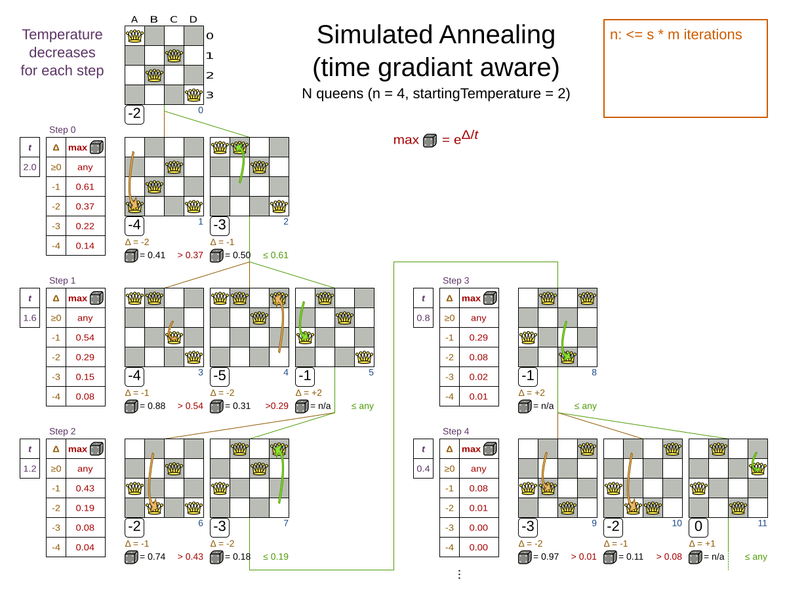

Simulated Annealing does not always pick the move with the highest score, neither does it evaluate many moves per step. At least at first. Instead, it gives non improving moves also a chance to be picked, depending on its score and the time gradient of the Termination. In the end, it gradually turns into Hill Climbing, only accepting improving moves.

<a id="pdf-dest-924371cf91bfcb32"></a>

<a id="section-0506"></a>
#### 39.5.2. Configuration

Start with a simulatedAnnealingStartingTemperature set to the maximum score delta a single move can cause. Use the [Benchmarker](#pdf-dest-e921478f36b99095) to tweak the value. Advanced configuration:

```
<localSearch>
    ...
    <acceptor>
    <simulatedAnnealingStartingTemperature>
2hard/100soft</simulatedAnnealingStartingTemperature>
    </acceptor>
    <forager>
    <acceptedCountLimit>1</acceptedCountLimit>
    </forager>
</localSearch>
```

Simulated Annealing should use a low acceptedCountLimit. The classic algorithm uses an acceptedCountLimit of 1, but often 4 performs better. Simulated Annealing can be combined with a tabu acceptor at the same time. That gives Simulated Annealing salted with a bit of Tabu. Use a lower tabu size than in a pure Tabu Search configuration.

```
<localSearch>
    ...
    <acceptor>
    <entityTabuSize>5</entityTabuSize>
    <simulatedAnnealingStartingTemperature>
2hard/100soft</simulatedAnnealingStartingTemperature>
    </acceptor>
    <forager>
    <acceptedCountLimit>1</acceptedCountLimit>
    </forager>
</localSearch>
```

<a id="pdf-dest-b3962aeb6c3ed004"></a>

<a id="section-0507"></a>
### 39.6. Late acceptance

<a id="pdf-dest-2791829b736232d4"></a>

<a id="section-0508"></a>
#### 39.6.1. Algorithm description

Late Acceptance (also known as Late Acceptance Hill Climbing) also evaluates only a few moves per step. A move is accepted if it does not decrease the score, or if it leads to a score that is at least the late score (which is the winning score of a fixed number of steps ago).

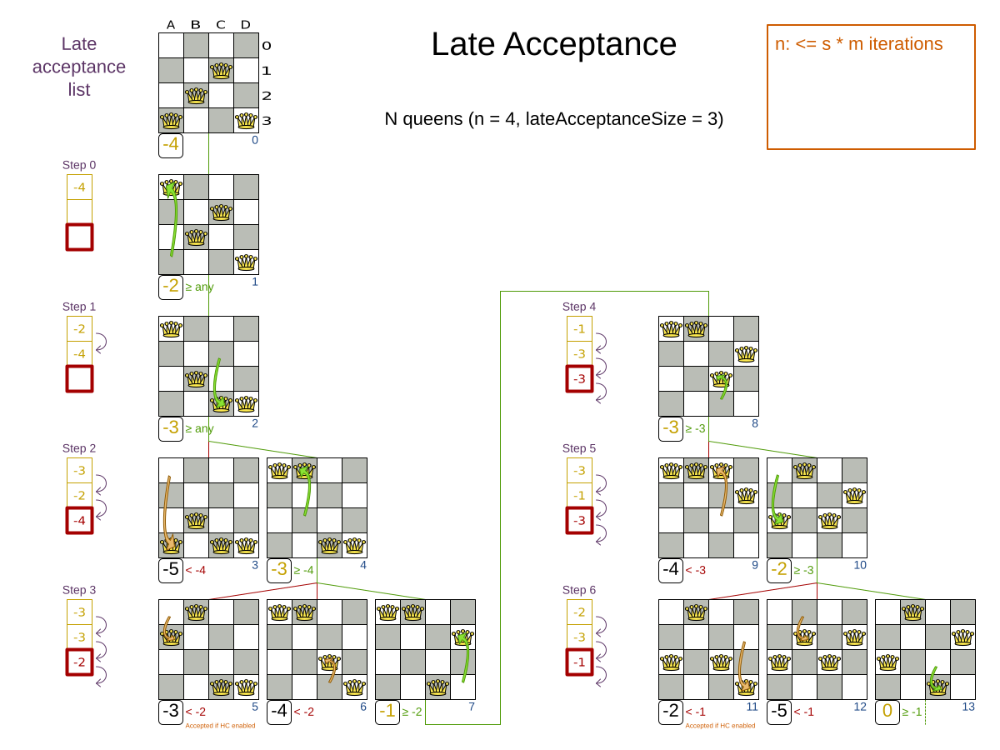

Scientific paper: [The Late Acceptance Hill-Climbing Heuristic by Edmund K. Burke, Yuri Bykov](http://www.cs.stir.ac.uk/~kjt/techreps/pdf/TR192.pdf) [(2012)](http://www.cs.stir.ac.uk/~kjt/techreps/pdf/TR192.pdf)

<a id="pdf-dest-3a9d7574859f05df"></a>

<a id="section-0509"></a>
#### 39.6.2. Configuration

Simplest configuration:

```
<localSearch>
    <localSearchType>LATE_ACCEPTANCE</localSearchType>
</localSearch>
```

Late Acceptance accepts any move that has a score which is higher than the best score of a number of steps ago. That number of steps is the lateAcceptanceSize. Advanced configuration:

```
<localSearch>
    ...
    <acceptor>
    <lateAcceptanceSize>400</lateAcceptanceSize>
    </acceptor>
    <forager>
    <acceptedCountLimit>1</acceptedCountLimit>
    </forager>
</localSearch>
```

Late Acceptance should use a low acceptedCountLimit.

Late Acceptance can be combined with a tabu acceptor at the same time. That gives Late Acceptance salted with a bit of Tabu. Use a lower tabu size than in a pure Tabu Search configuration.

```
<localSearch>
    ...
    <acceptor>
    <entityTabuSize>5</entityTabuSize>
    <lateAcceptanceSize>400</lateAcceptanceSize>
    </acceptor>
    <forager>
    <acceptedCountLimit>1</acceptedCountLimit>
    </forager>
</localSearch>
```

<a id="pdf-dest-c8ed9063e80f2f79"></a>

<a id="section-0510"></a>
### 39.7. Diversified Late acceptance

<a id="pdf-dest-3e82bb4b4443367e"></a>

<a id="section-0511"></a>
#### 39.7.1. Algorithm description

Diversified Late Acceptance is similar to Late Acceptance, but it offers different acceptance and replacement strategies. A move is accepted if its score matches the current solution score or is better than the late score (which is the winning score of a fixed number of steps ago).

Diversified Late Acceptance was first proposed in [Diversified Late Acceptance Search by M.](https://arxiv.org/pdf/1806.09328) [Namazi, C. Sanderson, M. A. H. Newton, M. M. A. Polash, and A. Sattar](https://arxiv.org/pdf/1806.09328)

<a id="pdf-dest-b56341f9aeac78dd"></a>

<a id="section-0512"></a>
#### 39.7.2. Configuration

Simplest configuration:

```
<solver xmlns="https://timefold.ai/xsd/solver">
    <enablePreviewFeature>DIVERSIFIED_LATE_ACCEPTANCE</enablePreviewFeature>
    ...
    <localSearch>
    <localSearchType>DIVERSIFIED_LATE_ACCEPTANCE</localSearchType>
    </localSearch>
</solver>
```

The late elements list is updated as follows:

- The current solution score is worse than the late score.
- The current solution score is better than the late score and different from the previous one.

The size of the late elements list is typically smaller. Advanced configuration:

```
...
<localSearch>
    ...
    <acceptor>
    <lateAcceptanceSize>5</lateAcceptanceSize>
    </acceptor>
    <forager>
    <acceptedCountLimit>1</acceptedCountLimit>
    </forager>
</localSearch>
```

The new acceptor is available as a [preview feature](#pdf-dest-0ba2746c7caf33f0) It may be subject to change and must be enabled in the solver configuration by setting: <enablePreviewFeature>DIVERSIFIED_LATE_ACCEPTANCE</enablePreviewFeature>

<a id="pdf-dest-34749648909289f4"></a>

<a id="section-0513"></a>
### 39.8. Great Deluge

<a id="pdf-dest-855965cbc1f7773b"></a>

<a id="section-0514"></a>
#### 39.8.1. Algorithm description

Great Deluge algorithm is similar to the [Simulated Annealing](#pdf-dest-853f2706a664c7ea) algorithm, it evaluates only a few moves per steps, so it steps quickly. The first accepted move is the winning step. A move is accepted only if it is not lower than the score value (water level) that we are working with. It means Great Deluge is deterministic and opposite of Simulated Annealing has no randomization in it. The water level is increased after every step either about the fixed value or by percentual value. A gradual increase in water level gives Great Deluge more time to escape from local maxima.

<a id="pdf-dest-09b333476f7d25ab"></a>

<a id="section-0515"></a>
#### 39.8.2. Configuration

Simplest configuration:

```
<localSearch>
    <localSearchType>GREAT_DELUGE</localSearchType>
</localSearch>
```

Great Deluge takes as starting water level best score from construction heuristic and uses default rain speed ratio. Advanced configuration:

```
<localSearch>
    ...
    <acceptor>
    <greatDelugeWaterLevelIncrementRatio>
0.00000005</greatDelugeWaterLevelIncrementRatio>
    </acceptor>
    <forager>
    <acceptedCountLimit>1</acceptedCountLimit>
    </forager>
</localSearch>
```

Timefold Solver implements two water level increment options:

If greatDelugeWaterLevelIncrementScore is set, the water level is increased by a constant value.

```
<acceptor>
    <greatDelugeWaterLevelIncrementScore>10</greatDelugeWaterLevelIncrementScore>
</acceptor>
```

To avoid hard coding the water level increment, configure a greatDelugeWaterLevelIncrementRatio (recommended) when the water level is increased by percentual value, so there is no need to know the size of the problem or value of a scoring function.

```
<acceptor>
    <greatDelugeWaterLevelIncrementRatio>
0.00000005</greatDelugeWaterLevelIncrementRatio>
</acceptor>
```

The algorithm takes as starting value the best score from the construction heuristic. Use the Benchmarker to fine-tune tweak your configuration.

<a id="pdf-dest-385f8d1f43e62d3e"></a>

<a id="section-0516"></a>
### 39.9. Step counting hill climbing

<a id="pdf-dest-4a736444cc64ab6a"></a>

<a id="section-0517"></a>
#### 39.9.1. Algorithm description

Step Counting Hill Climbing also evaluates only a few moves per step. For a number of steps, it keeps the step score as a threshold. A move is accepted if it does not decrease the score, or if it leads to a score that is at least the threshold score.

Scientific paper: [An initial study of a novel Step Counting Hill Climbing heuristic applied to](https://www.researchgate.net/profile/Sanja_Petrovic2/publication/299593956_A_Step_Counting_Hill_Climbing_Algorithm_applied_to_University_Examination_Timetabling/links/5729d02a08aef7c7e2c4103a/A-Step-Counting-Hill-Climbing-Algorithm-applied-to-University-Examination-Timetabling.pdf) [timetabling problems by Yuri Bykov, Sanja Petrovic (2013)](https://www.researchgate.net/profile/Sanja_Petrovic2/publication/299593956_A_Step_Counting_Hill_Climbing_Algorithm_applied_to_University_Examination_Timetabling/links/5729d02a08aef7c7e2c4103a/A-Step-Counting-Hill-Climbing-Algorithm-applied-to-University-Examination-Timetabling.pdf)

<a id="pdf-dest-274ef1a56215dc27"></a>

<a id="section-0518"></a>
#### 39.9.2. Configuration

Step Counting Hill Climbing accepts any move that has a score which is higher than a threshold score. Every number of steps (specified by stepCountingHillClimbingSize), the threshold score is set to the step score.

```
<localSearch>
    ...
    <acceptor>
    <stepCountingHillClimbingSize>400</stepCountingHillClimbingSize>
    </acceptor>
    <forager>
    <acceptedCountLimit>1</acceptedCountLimit>
    </forager>
</localSearch>
```

Step Counting Hill Climbing should use a low acceptedCountLimit.

Step Counting Hill Climbing can be combined with a tabu acceptor at the same time, similar as shown in [the Late Acceptance section](#pdf-dest-b3962aeb6c3ed004).

<a id="pdf-dest-afd2344b7df03ecf"></a>

<a id="section-0519"></a>
### 39.10. Strategic oscillation

<a id="pdf-dest-76c0c4daf30d66b1"></a>

<a id="section-0520"></a>
#### 39.10.1. Algorithm description

Strategic Oscillation is an add-on, which works especially well with [Tabu Search](#pdf-dest-2786eebffee016f0). Instead of picking the accepted move with the highest score, it employs a different mechanism: If there’s an improving move, it picks it. If there’s no improving move however, it prefers moves which improve a softer score level, over moves which break a harder score level less.

<a id="pdf-dest-9e57e085c925db12"></a>

<a id="section-0521"></a>
#### 39.10.2. Configuration

Configure a finalistPodiumType, such as in a Tabu Search configuration:

```
<localSearch>
    ...
    <acceptor>
    <entityTabuSize>7</entityTabuSize>
    </acceptor>
    <forager>
    <acceptedCountLimit>1000</acceptedCountLimit>
    <finalistPodiumType>STRATEGIC_OSCILLATION</finalistPodiumType>
    </forager>
</localSearch>
```

The following finalistPodiumTypes are supported:

- HIGHEST_SCORE (default): Pick the accepted move with the highest score.
- STRATEGIC_OSCILLATION: Alias for the default strategic oscillation variant.
- STRATEGIC_OSCILLATION_BY_LEVEL: If there is an accepted improving move, pick it. If no such move exists, prefer an accepted move which improves a softer score level over one that doesn’t (even if it has a better harder score level). A move is improving if it’s better than the last completed step score.
- STRATEGIC_OSCILLATION_BY_LEVEL_ON_BEST_SCORE: Like STRATEGIC_OSCILLATION_BY_LEVEL, but define improving as better than the best score (instead of the last completed step score).

<a id="pdf-dest-3cccfdfce4fcae27"></a>

<a id="section-0522"></a>
### 39.11. Variable neighborhood descent

<a id="pdf-dest-e2074eed90e7017b"></a>

<a id="section-0523"></a>
#### 39.11.1. Algorithm description

Variable Neighborhood Descent iteratively tries multiple move selectors in original order (depleting each selector entirely before trying the next one), picking the first improving move (which also resets the iterator back to the first move selector).

Despite that VND has a name that ends with descent (from the research papers),

the implementation will ascend to a higher score (which is a better score).

<a id="pdf-dest-8a135342ece8ded6"></a>

<a id="section-0524"></a>
#### 39.11.2. Configuration

Simplest configuration:

```
<localSearch>
    <localSearchType>VARIABLE_NEIGHBORHOOD_DESCENT</localSearchType>
</localSearch>
```

Advanced configuration:

```
<localSearch>
    <unionMoveSelector>
    <selectionOrder>ORIGINAL</selectionOrder>
    <changeMoveSelector/>
    <swapMoveSelector/>
    ...
    </unionMoveSelector>
    <acceptor>
    <acceptorType>HILL_CLIMBING</acceptorType>
    </acceptor>
    <forager>
    <pickEarlyType>FIRST_LAST_STEP_SCORE_IMPROVING</pickEarlyType>
    </forager>
</localSearch>
```

Variable Neighborhood Descent doesn’t scale well, but it is useful in some use cases with a very erratic score landscape.

<a id="pdf-dest-aa1af3fad34581e2"></a>

<a id="section-0525"></a>
## Chapter 40. Exhaustive search

<a id="pdf-dest-f2b388dc1ee05b2e"></a>

<a id="section-0526"></a>
### 40.1. Overview

Exhaustive Search will always find the global optimum and recognize it too. That being said, it doesn’t scale (not even beyond toy data sets) and is therefore mostly useless.

<a id="pdf-dest-f2269b43a2dd91d7"></a>

<a id="section-0527"></a>
### 40.2. Brute force

<a id="pdf-dest-9be25593ac541432"></a>

<a id="section-0528"></a>
#### 40.2.1. Algorithm description

The Brute Force algorithm creates and evaluates every possible solution.

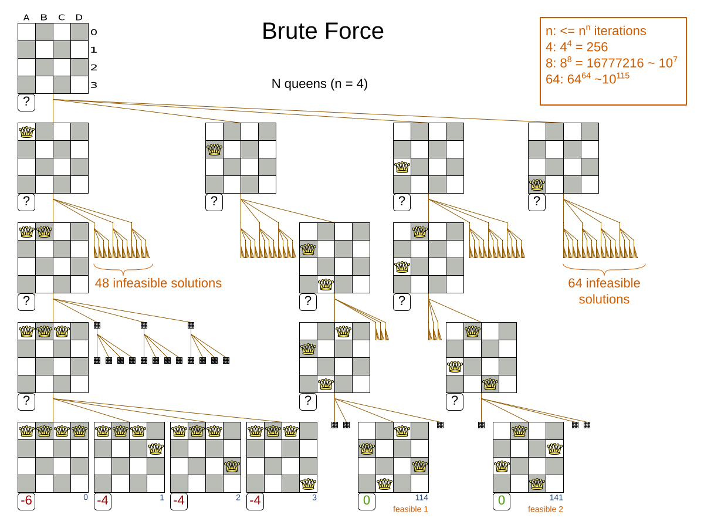

Notice that it creates a search tree that explodes exponentially as the problem size increases, so it hits a scalability wall.

<a id="section-0529"></a>
## Brute Force is mostly unusable for a real-world problem due to time

limitations, as shown in [scalability of Exhaustive Search](#pdf-dest-9dc6e5420ab64380).

<a id="pdf-dest-695f2c702ab94649"></a>

<a id="section-0530"></a>
#### 40.2.2. Configuration

Simplest configuration of Brute Force:

```
<solver xmlns="https://timefold.ai/xsd/solver" xmlns:xsi=
"http://www.w3.org/2001/XMLSchema-instance"
    xsi:schemaLocation="https://timefold.ai/xsd/solver
https://timefold.ai/xsd/solver/solver.xsd">
    ...
    <exhaustiveSearch>
    <exhaustiveSearchType>BRUTE_FORCE</exhaustiveSearchType>
    </exhaustiveSearch>
</solver>
```

<a id="pdf-dest-66bcaa308e0828c4"></a>

<a id="section-0531"></a>
### 40.3. Branch and bound

<a id="pdf-dest-bcbb84a848826cf9"></a>

<a id="section-0532"></a>
#### 40.3.1. Algorithm description

Branch And Bound also explores nodes in an exponential search tree, but it investigates more promising nodes first and prunes away worthless nodes.

For each node, Branch And Bound calculates the optimistic bound: the best possible score to which that node can lead to. If the optimistic bound of a node is lower or equal to the global pessimistic bound, then it prunes away that node (including the entire branch of all its subnodes).

Academic papers use the term lower bound instead of optimistic bound (and the term upper bound instead of pessimistic bound), because they minimize the score.

Timefold Solver maximizes the score (because it supports combining negative and positive constraints). Therefore, for clarity, it uses different terms, as it would be confusing to use the term lower bound for a bound which is always higher.

For example: at index 14, it sets the global pessimistic bound to -2. Because all solutions reachable from the node visited at index 11 will have a score lower or equal to -2 (the node’s optimistic bound), they can be pruned away.

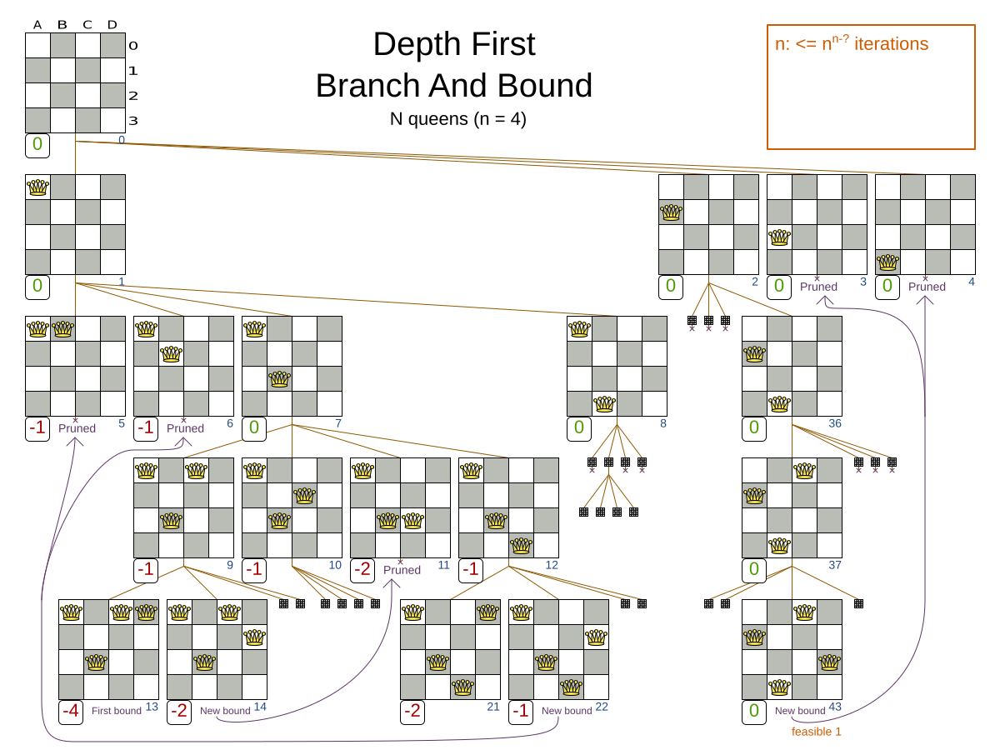

Notice that Branch And Bound (much like [Brute Force](#pdf-dest-f2269b43a2dd91d7)) creates a search tree that explodes exponentially as the problem size increases. So it hits the same scalability wall, only a little bit later.

<a id="section-0533"></a>
## Branch And Bound is mostly unusable for a real-world problem due to time

limitations, as shown in [scalability of Exhaustive Search](#pdf-dest-9dc6e5420ab64380).

<a id="pdf-dest-a83f3d9ef8ba79ac"></a>

<a id="section-0534"></a>
#### 40.3.2. Configuration

Simplest configuration of Branch And Bound:

```
<solver xmlns="https://timefold.ai/xsd/solver" xmlns:xsi=
"http://www.w3.org/2001/XMLSchema-instance"
    xsi:schemaLocation="https://timefold.ai/xsd/solver
https://timefold.ai/xsd/solver/solver.xsd">
    ...
    <exhaustiveSearch>
    <exhaustiveSearchType>BRANCH_AND_BOUND</exhaustiveSearchType>
    </exhaustiveSearch>
</solver>
```

For the pruning to work with the default ScoreBounder, the [InitializingScoreTrend](#pdf-dest-4d25901f9469bdae) should be set. Especially an [InitializingScoreTrend](#pdf-dest-4d25901f9469bdae) of ONLY_DOWN (or at least has ONLY_DOWN in the leading score levels) prunes a lot.

Advanced configuration:

```
<exhaustiveSearch>
    <exhaustiveSearchType>BRANCH_AND_BOUND</exhaustiveSearchType>
    <nodeExplorationType>DEPTH_FIRST</nodeExplorationType>
    <entitySorterManner>DESCENDING_IF_AVAILABLE</entitySorterManner>
    <valueSorterManner>ASCENDING_IF_AVAILABLE</valueSorterManner>
</exhaustiveSearch>
```

The nodeExplorationType options are:

- DEPTH_FIRST (default): Explore deeper nodes first (and then a better score and then a better optimistic bound). Deeper nodes (especially leaf nodes) often improve the pessimistic bound. A better pessimistic bound allows pruning more nodes to reduce the search space.
```
<exhaustiveSearch>
    <exhaustiveSearchType>BRANCH_AND_BOUND</exhaustiveSearchType>
    <nodeExplorationType>DEPTH_FIRST</nodeExplorationType>
</exhaustiveSearch>
```

- BREADTH_FIRST (not recommended): Explore nodes layer by layer (and then a better score and then a better optimistic bound). Scales terribly in memory (and usually in performance too).
```
<exhaustiveSearch>
    <exhaustiveSearchType>BRANCH_AND_BOUND</exhaustiveSearchType>
    <nodeExplorationType>BREADTH_FIRST</nodeExplorationType>
</exhaustiveSearch>
```

- SCORE_FIRST: Explore nodes with a better score first (and then a better optimistic bound and then deeper nodes first). Might scale as terribly as BREADTH_FIRST in some cases.
```
<exhaustiveSearch>
    <exhaustiveSearchType>BRANCH_AND_BOUND</exhaustiveSearchType>
    <nodeExplorationType>SCORE_FIRST</nodeExplorationType>
</exhaustiveSearch>
```

- OPTIMISTIC_BOUND_FIRST: Explore nodes with a better optimistic bound first (and then a better score and then deeper nodes first). Might scale as terribly as BREADTH_FIRST in some cases.
```
<exhaustiveSearch>
    <exhaustiveSearchType>BRANCH_AND_BOUND</exhaustiveSearchType>
    <nodeExplorationType>OPTIMISTIC_BOUND_FIRST</nodeExplorationType>
</exhaustiveSearch>
```

The entitySorterManner options are:

- DESCENDING: Evaluate the planning entities in descending order based on a given metric. This usually increases pruning (and therefore improves scalability). Requires the model to support [planning entity sorting](#pdf-dest-079a1ff77d0c06ee).
- DESCENDING_IF_AVAILABLE (default): If the model supports [planning entity sorting](#pdf-dest-079a1ff77d0c06ee), behave like DESCENDING, else like NONE.
- NONE: Initialize the planning entities in original order.

The valueSorterManner options are:

- ASCENDING: Evaluate the planning values in ascending order based on a given metric. Requires the model to support [planning value sorting](#pdf-dest-67c289716d37513f).
- ASCENDING_IF_AVAILABLE (default): If the model supports [planning value sorting](#pdf-dest-67c289716d37513f), behave like ASCENDING, else like NONE.
- DESCENDING: Evaluate the planning values in descending order based on a given metric. Requires the model to support [planning value sorting](#pdf-dest-67c289716d37513f).
- DESCENDING_IF_AVAILABLE: If the model supports [planning value sorting](#pdf-dest-67c289716d37513f), behave like DESCENDING, else like NONE.
- NONE: Try the planning values in original order.

<a id="pdf-dest-9dc6e5420ab64380"></a>

<a id="section-0535"></a>
### 40.4. Scalability of exhaustive search

Exhaustive Search variants suffer from two big scalability issues:

- They scale terribly memory wise.
- They scale horribly performance wise.

As shown in these time spent graphs from the [Benchmarker](#pdf-dest-e921478f36b99095), Brute Force and Branch And Bound both hit a performance scalability wall. For example, on N queens it hits wall at a few dozen queens:

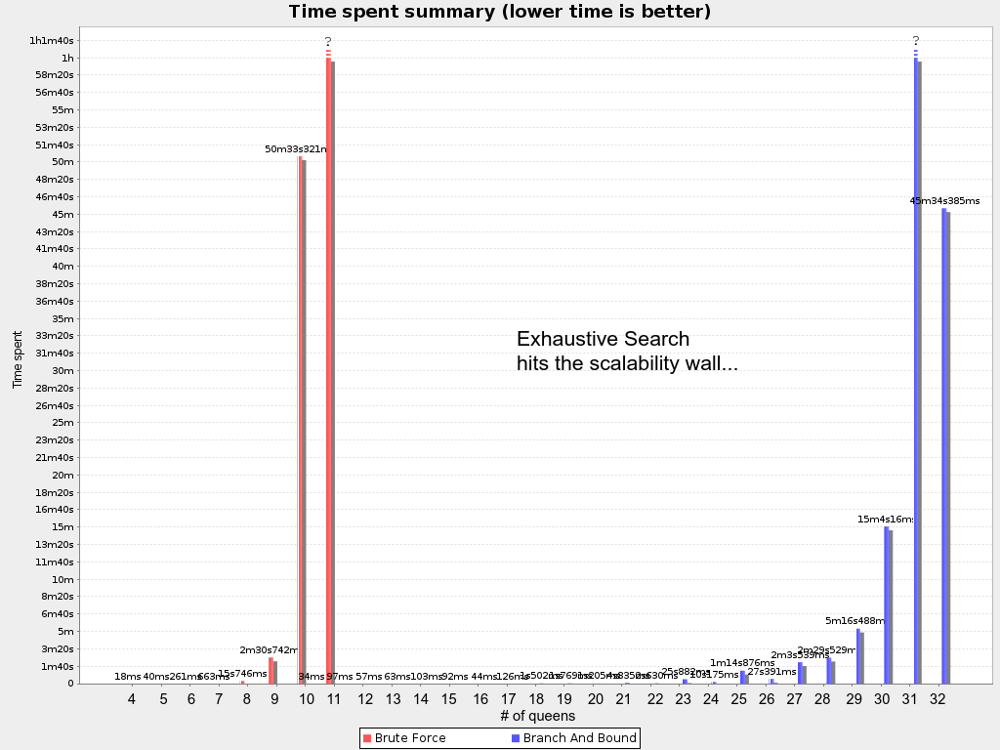

In most use cases, the wall appears out of thin air. Exhaustive Search hits this wall on small datasets already, so in production these optimizations algorithms are mostly useless. Use Construction Heuristics with Local Search instead: those can handle thousands of entities easily.

Throwing hardware at these scalability issues has no noticeable impact. Moore’s law cannot win against the onslaught of a few more planning entities in the dataset.

<a id="pdf-dest-26c007b300fb0002"></a>

<a id="section-0536"></a>
## Chapter 41. Neighborhoods: A new way to define custom moves

The Neighborhoods API is a preview feature. It intends to simplify the creation of custom moves, eventually replacing [move selectors](#pdf-dest-601e0ae9a75a4274). The component is under

development and many features are yet to be delivered. While we believe that the

basic building blocks of the API are already stable, we reserve the right to change the API or remove any part of it. Your feedback is highly appreciated and will be imperative in shaping the future of this component.

In operations research, a neighborhood is a set of solutions that are "close" to a given solution. The definition of "close" depends on the problem domain and the solution representation. For example, in a vehicle routing problem, a neighborhood might consist of all solutions that can be reached by swapping the routes of two vehicles. In such a case, the neighborhood would include solutions reachable from the current solution after a perturbation, but with slight variations in the routes taken by the vehicles.

The operation of moving from one solution to another within a neighborhood is often referred to as a move, or a perturbation. Methods such as [metaheuristics](#pdf-dest-601e0ae9a75a4274) explore these neighborhoods to find better solutions by evaluating the moves and selecting the most promising ones, in order to find the best solution according to [user-defined constraints](#pdf-dest-219abeecbbbc28d1).

In order for a metaheuristics-based solver such as Timefold Solver to explore the solution space effectively, it needs a variety of move types to generate a diverse set of neighboring solutions. For a long time, that role was fulfilled by [move selectors](#pdf-dest-601e0ae9a75a4274). However, move selectors have limitations that make it very difficult to create complex, high-performing moves, and this can in turn lead to suboptimal solver performance.

The Neighborhoods API is a new way to define moves in Timefold Solver. It is intended to be a flexible and easy way to create more complex but high-performing moves. This flexibility allows users to quickly prototype and experiment with different move types as well as create their own custom moves.

<a id="pdf-dest-9bfb1c6089f0879f"></a>

<a id="section-0537"></a>
### 41.1. Key concepts

The Neighborhoods API is built around a few key concepts:

Move The bottom-most building block of the Neighborhoods API. A move represents a distinct type of change to the solution. Examples include changing the value of a planning variable or swapping the values of two planning entities.

Move Stream Builds a set of moves, based on a declarative programming model. It defines how to create moves for a given solution. For example, if the move is to swap two visits for a vehicle, it would specify all pairs of visits that can be swapped for each vehicle. Neighborhood Bundles all the move streams that together define a full set of moves available for the solver to choose from.

In the following sections, we will explore each of these concepts in more detail.

<a id="pdf-dest-f4af0123984e5c94"></a>

<a id="section-0538"></a>
#### 41.1.1. Note on terminology

As much as we try to align with established terminology in the operations research community, in this case we make one exception. In the rest of this documentation, a neighborhood refers to a set of moves that can be applied to a given solution, and moves from this neighborhood lead the solver to neighboring solutions. This is a distinction in name only and has no impact on the underlying concepts.

<a id="pdf-dest-922fb51839c6742b"></a>

<a id="section-0539"></a>
### 41.2. Moves and their purpose

In the Neighborhoods API, a move represents a distinct type of perturbation of the current working solution. Moves are the fundamental building blocks of the Neighborhoods API, and they define how the solver can explore the solution space. For example, in a vehicle routing problem, a move might involve changing the assignment of a delivery to a different vehicle or swapping the routes of two vehicles.

In technical terms, a move is an implementation of the ai.timefold.solver.core.preview.api.move.Move interface. Let’s explore that interface in detail.

<a id="pdf-dest-555c3bb80493ac9e"></a>

<a id="section-0540"></a>
#### 41.2.1. Anatomy of a move

The Move interface specifies the following methods that must be implemented:

void execute(MutableSolutionView solutionView) This method makes changes to the given solution. MutableSolutionView provides methods to safely modify the planning variables of the working solution.

MutableSolutionView intends to be a rich API that provides all the necessary

methods to modify the solution in a safe and efficient way. If you are missing an

operation that you need to implement your move, please reach out to us so we can consider adding it to the API.

For compatibility with [Tabu Search](#pdf-dest-2786eebffee016f0), it is also recommended to override the following methods:

- equals() and hashCode(),
- Collection<Object> getPlanningEntities(),
- and Collection<Object> getPlanningValues().

Finally, the Move interface specifies the following methods that the user can optionally override to gain access to additional solver features: Move rebase(Lookup lookup)

This method creates a copy of the move that is applicable to a different working solution. This is only necessary when the solver is configured to use [multi-threaded solving](running-timefold-solver/multithreaded-solving.pdf#multithreadedSolving).

String describe()

This method returns an identifier for the move type, which is used by parts of [the benchmarker](#pdf-dest-e921478f36b99095) to separate results by move type. For example, if your move changes the value of variable called "employee" on an entity called "Task", you might return "TaskChange(employee)" from this method. Avoid whitespace and any special characters.

We encourage you to also override the toString() method of your move implementation to provide a human-readable description of the specific move instance, which is useful for debugging and logging purposes.

<a id="pdf-dest-2dccf4981ecb2b17"></a>

<a id="section-0541"></a>
#### 41.2.2. Move execution

The method void execute(MutableSolutionView solutionView) defines how the move modifies the solution. It uses MutableSolutionView to read information about the solution, and to make changes to it. Implementations of the method may be as short as a single line of code:

```
PlanningVariableMetaModel<Timetable, Lesson, Timeslot> timeslotVariable = ...;
Lesson lesson = ...;
Timeslot timeslot = ...;

@Override
public void execute(MutableSolutionView<Timetable> solutionView) {
    solutionView.changeVariable(timeslotVariable, lesson, timeslot);
}
```

This example changes the value of a planning variable called timeslotVariable for a planning entity called lesson, assigning it the new value timeslot.

solutionView.changeVariable(…) is a method provided by MutableSolutionView that safely changes the value of a planning variable on a planning entity. It ensures that all necessary notifications are sent to the solver, so that the score can be recalculated correctly both after the move is executed and when it is undone. This method is just one of many provided by MutableSolutionView; other examples include specialized methods such as swapValuesBetweenLists(…). We invite you to explore the interface to discover all the available options.

lesson and timeslot are fields of the move class, introduced by the caller.

timeslotVariable comes from the Domain MetaModel API, and serves to uniquely identify the planning variable which the move will affect.

<a id="pdf-dest-31583f155ed6559b"></a>

41.2.2.1. Domain metamodel

In order to uniquely and quickly identify planning entities and planning variables, we use the Domain MetaModel API. It provides classes that represent the structure of the planning solution, specifically:

PlanningSolutionMetaModel

Represents the entire planning solution. It gives access to individual planning entity and planning variable metamodels.

PlanningEntityMetaModel

Represents a planning entity class. It gives access to its planning variable metamodels, both genuine and shadow.

VariableMetaModel

Represents a planning variable on a planning entity class. It further specializes into PlanningVariableMetaModel for a [basic planning variable](#pdf-dest-6961175c48fffeac), PlanningListVariableMetaModel for a list ([source](#pdf-dest-fbc665f240838a05)) [variable](#pdf-dest-fbc665f240838a05), and ShadowVariableMetaModel for a shadow variable. ([source](#pdf-dest-b5d02287bce8bcd2))

These implementations are type-safe and provide methods to access the relevant parts of the planning solution structure. They do not provide any means of modifying the state of the solution, or for reading it.

Here’s how you can obtain a PlanningVariableMetaModel instance for a basic planning variable called timeslot on a planning entity called Lesson from the Timetable planning solution class:

```
PlanningSolutionMetaModel<Timetable> solutionMetaModel = ...; // The solver will give
this to you.
PlanningVariableMetaModel<Timetable, Lesson, Timeslot> timeslotVariable =
        solutionMetaModel.genuineEntity(Lesson.class)
                .basicVariable("timeslot", Timeslot.class);
```

If any of the entities or variables cannot be found, the code will fail with a well-defined exception, preventing mistakes from spreading through your code.

The code above can often be simplified with Java’s local type inference:

```
var solutionMetaModel = ...; // The solver will give this to you.
var timeslotVariable = solutionMetaModel.genuineEntity(Lesson.class)
                .basicVariable("timeslot", Timeslot.class);
```

Long-time users of Timefold Solver may be familiar with the concept of variable descriptors. The Domain MetaModel API is a modern replacement for variable

descriptors, offering a more type-safe and user-friendly way to interact with the

planning solution structure. It is recommended to use the Domain MetaModel API for all new developments, especially as the variable descriptor API is not public and therefore not covered by backward compatibility guarantees.

<a id="pdf-dest-37de4b7ece2acd6f"></a>

<a id="section-0542"></a>
#### 41.2.3. Example move implementation

The following example shows a simple move implementation which changes the value of a [basic](#pdf-dest-6961175c48fffeac) [planning variable](#pdf-dest-6961175c48fffeac), assigning a timeslot to a lesson in the school timetabling problem. It brings together all the concepts discussed above.

```
public final class ChangeMove implements Move<Timetable> {

    private final PlanningVariableMetaModel<Timetable, Lesson, Timeslot>
timeslotVariable;
    private final Lesson lesson;
    private final Timeslot timeslot;

    public ChangeMove(PlanningVariableMetaModel<Timetable, Lesson, Timeslot>
timeslotVariable,
            Lesson lesson, Timeslot timeslot) {
        this.timeslotVariable = Objects.requireNonNull(timeslotVariable);
        this.lesson = Objects.requireNonNull(lesson);
        this.timeslot = timeslot;
    }

    @Override
    public void execute(MutableSolutionView<Timetable> solutionView) {
        solutionView.changeVariable(timeslotVariable, lesson, timeslot);
    }

    @Override
    public ChangeMove rebase(Lookup lookup) {
        return new ChangeMove(timeslotVariable,
                lookup.lookUpWorkingObject(lesson),
                lookup.lookUpWorkingObject(timeslot));
    }

    @Override
    public Collection<Lesson> getPlanningEntities() {
        return Collections.singletonList(lesson);
    }

    @Override
    public Collection<Timeslot> getPlanningValues() {
        return Collections.singletonList(timeslot);
    }

    @Override
    public boolean equals(Object o) {
        return o instanceof ChangeMove other
                && Objects.equals(timeslotVariable, other.timeslotVariable)
                && Objects.equals(lesson, other.lesson)
                && Objects.equals(timeslot, other.timeslot);
    }

    @Override
    public int hashCode() {
        return Objects.hash(timeslotVariable, lesson, timeslot);
    }

    @Override
    public String toString() {
        return lesson + " -> " + timeslot;
    }

}
```

<a id="pdf-dest-b34e34bdbbb2b0cd"></a>

<a id="section-0543"></a>
#### 41.2.4. Built-in moves

Timefold Solver provides several built-in move implementations that cover the most common use cases. These moves are available through the ai.timefold.solver.core.preview.api.move.builtin.Moves class.

For example, here’s how you can obtain a change move using the built-in implementation:

```
var timeslotVariable = ...; // Comes from the solver.
var lesson = ...; // Comes from your solution.
var newTimeslot = ...; // Comes from your solution.
var move = Moves.change(timeslotVariable, lesson, newTimeslot);
```

The Moves factory builds the following kinds of change:

One or two entities Change the value of a [basic planning variable](#pdf-dest-6961175c48fffeac) on a single entity, or swap the values of two entities. A swap can cover one variable, a chosen set of variables, or every basic variable the entities have.

A group of entities Change the values of a whole group of entities at once, which we call a mass change, or swap the value combination held by one pillar with the combination held by another. A pillar is a group of entities that currently share the same value; [moving a whole pillar](#pdf-dest-40a892e727208785) defines the term in full.

One value in a list variable Insert a value into a [list variable](#pdf-dest-fbc665f240838a05) at a given position, remove it from its current position, move it to another position, or swap the positions of two values. The positions involved may belong to different entities.

A range in a list variable Move a contiguous block of values to another position, optionally reversing the order of the range, swap two such ranges, unassign a whole range at once, or reverse a range in place, which is the classic route-improvement move.

A Range identifies a contiguous block of one entity’s list variable by its start and end position. Pass a Range to Moves whenever a move acts on a block of values instead of a single value. Composing built-in moves this way is what you do inside your own move, or inside your own move provider; see [producing custom moves using Move Streams](#pdf-dest-ac9a6e3d28c28b69). If you are instead looking for ready-made move generators that need no custom code at all, see [built-in move providers](#pdf-dest-e139fc94e1b46f5b).

The runtime performance of Move implementations is of the utmost importance. Moves are on the solver hot path, and any time wasted there will directly result in suboptimal solver performance. For this reason, built-in Move implementations generally do not validate their input arguments and, unlike the rest of the solver, do not fail fast. In other words, a built-in move will break value ranges, or create inconsistent solutions, if told to. It is the responsibility of the [move provider](#pdf-dest-e139fc94e1b46f5b) not to generate such moves.

<a id="pdf-dest-31f5546c32b0db64"></a>

<a id="section-0544"></a>
#### 41.2.5. Testing moves with MoveTester

When developing custom moves, it is essential to verify that they correctly modify the solution and interact properly with the solver’s infrastructure. The MoveTester API provides a simple testing utility to execute moves in isolation, making it easy to write unit tests for your custom move implementations.

The MoveTester API is designed exclusively for testing purposes. It should not be used in production code or during normal solver operation. It is not thread-safe and not fine-tuned for performance.

<a id="pdf-dest-24e783037232a54b"></a>

41.2.5.1. Basic usage

The MoveTester API follows a fluent builder pattern:

```
// Timetable is the solution class, Lesson is a planning entity class.
var solutionMetaModel = PlanningSolutionMetaModel.of(Timetable.class, Lesson.class);
var tester = MoveTester.build(solutionMetaModel);
var context = tester.using(solution);
var move = ...; // Move you wish to test.
context.execute(move);
```

The API requires:

1. Solution class: The class annotated with @PlanningSolution

2. Entity classes: One or more classes annotated with @PlanningEntity

3. Solution instance: The working solution to execute the move on

4. Move instance: The move to execute

<a id="pdf-dest-8fddc6acf351800c"></a>

41.2.5.2. Permanent execution

The execute() method applies a move permanently to the solution:

```
@Test
void testChangeMove() {
    var timetable = new Timetable(...); // Create or load a solution instance.
    var lesson = timetable.getLessons().get(0);
    var newRoom = timetable.getRooms().get(1);

    var solutionMetaModel = PlanningSolutionMetaModel.of(Timetable.class, Lesson.
class);
    var variableMetaModel = solutionMetaModel.genuineEntity(Lesson.class)
            .basicVariable("room", Room.class);

    var move = Moves.change(variableMetaModel, lesson, newRoom);

    var tester = MoveTester.build(solutionMetaModel);
    var context = tester.using(timetable);
    context.execute(move);

    assertThat(lesson.getRoom()).isEqualTo(newRoom); // Assertion from a test
framework of choice.
}
```

After execute() returns, the solution is modified and all shadow variables are updated.

<a id="pdf-dest-e710190d72be47ab"></a>

41.2.5.3. Temporary execution with automatic undo

The executeTemporarily() method allows you to test a move’s effects without permanently modifying the solution. This is useful when you want to verify intermediate state or test that the solver’s undo mechanism works correctly:

```
@Test
void testMoveThenUndo() {
    var timetable = new Timetable(...); // Create or load a solution instance.
    var lesson = timetable.getLessons().get(0);
    var originalRoom = lesson.getRoom();
    var newRoom = timetable.getRooms().get(1);

    var solutionMetaModel = PlanningSolutionMetaModel.of(Timetable.class, Lesson.
class);
    var variableMetaModel = solutionMetaModel.genuineEntity(Lesson.class)
            .basicVariable("room", Room.class);

    var move = Moves.change(variableMetaModel, lesson, newRoom);

    var tester = MoveTester.build(solutionMetaModel);
    var context = tester.using(timetable);

    // All the code above is just domain setup.
    context.executeTemporarily(move, view -> {
        // Verify changes were applied during temporary scope
        assertThat(lesson.getRoom()).isEqualTo(newRoom);
    });
    // Verify automatic undo restored original state
    assertThat(lesson.getRoom()).isEqualTo(originalRoom);
}
```

The callback function receives a SolutionView parameter, but you typically won’t need to use it as you can directly inspect the solution’s state within the callback to verify that the move was applied correctly. Once the callback completes, the solver automatically undoes all changes made by the move.

<a id="pdf-dest-e139fc94e1b46f5b"></a>

<a id="section-0545"></a>
### 41.3. Move providers

A move and a move provider are two different things. A move is a single change to the solution, as described in [moves and their purpose](#pdf-dest-922fb51839c6742b). A move provider is a generator of moves: you register it with the solver, and it produces move after move for the solver to evaluate during local search.

Timefold Solver ships with a catalogue of move providers that work with any domain model, so the most common neighborhoods need no custom code. You register a built-in move provider exactly like your own, by adding it in your NeighborhoodProvider implementation:

```
public class MyNeighborhoodProvider implements NeighborhoodProvider<Timetable> {

    @Override
    public Neighborhood defineNeighborhood(NeighborhoodBuilder<Timetable> builder) {
        var timeslotVariable = builder.getSolutionMetaModel()
                .genuineEntity(Lesson.class)
                .basicVariable("timeslot", Timeslot.class);
        return builder.add(new ChangeMoveProvider<>(timeslotVariable))
                .build();
    }

}
```

See [configuring the solver to use Neighborhoods](#pdf-dest-913b17ef72fc04c4) for the full solver configuration this fits into.

<a id="pdf-dest-4ca0275ead0a683b"></a>

<a id="section-0546"></a>
#### 41.3.1. The default set of move providers

When you enable the Neighborhoods preview feature for local search and do not configure any move providers of your own, the solver uses a default set of move providers automatically. This default applies to local search only, and has no effect on the [construction heuristic](#pdf-dest-601e0ae9a75a4274) phase.

The solver builds the default set from your domain model as follows:

For every basic planning variable A provider that changes the variable, ChangeMoveProvider. When the variable allows unassigned values, the solver also adds AssignMoveProvider and UnassignMoveProvider. Once per entity that has at least one basic planning variable A provider that swaps every basic variable of that entity together between two entities, SwapMoveProvider.

For every list variable Providers that change and swap a single value, ListChangeMoveProvider and ListSwapMoveProvider, a provider that reverses a block within one entity’s list, TwoOptListMoveProvider, and a provider that swaps the tails of two entities' lists, ListTailSwapMoveProvider. When the variable allows unassigned values, the solver also adds ListAssignMoveProvider and ListUnassignMoveProvider.

Two of these providers are deliberately set up to do less than they can:

- By default, the change providers do not move a value into or out of the unassigned state, because the assign and unassign providers already generate those moves, and at a higher rate.
- By default, the 2-opt provider only reverses a block within a single entity’s list. It does not also swap tails across entities, because the tail-swap provider already covers that, and at a higher rate.

Every other provider described in this chapter is absent from the default set. That includes the pillar, sub-pillar, mass, mass-list, and sub-list families; you have to add each of them explicitly.

The built-in providers are generic: they know nothing about your domain, and they generate every move the model permits. Writing your own move provider is the intended way to extend the Neighborhoods API, not a fallback for gaps in this

catalogue. A provider that understands your domain can skip the moves your

model will never accept, and often performs better as a result. So if a move you need is missing here, or a built-in provider is not flexible enough, write your own instead of filing a solver feature request. Reserve feature requests for situations which the current API cannot possibly model.

<a id="pdf-dest-7320bcbc520968ca"></a>

<a id="section-0547"></a>
#### 41.3.2. Samples and samplers

Several move providers do not act on a single entity or a single value, but on a group of them drawn together. Such a group is called a sample. A sampler is the policy that decides how large a sample is, and you pass one to the provider when you construct it.

The Samplers class offers the following ready-made samplers:

| Factory | Sample size |
| --- | --- |
| Samplers.all() | Everything available. |
| Samplers.all(expectedSize) | Everything available, while telling the solver roughly how large<br>that will be. This is a performance hint, not a limit; a wrong guess<br>costs nothing but a resize. |
| Samplers.exactly(size) | Exactly the given number of members. If fewer are available, no<br>sample is produced at all. |

| Factory | Sample size |
| --- | --- |
| Samplers.upTo(maximumSize) | A number between one and the given maximum, drawn again<br>for every sample. |
| Samplers.between(minimumSize,<br>maximumSize) | A number within the given range, drawn again for every sample. |
| Samplers.pillar(sampler) | The same size as the given sampler. Use it where a group is<br>defined by a shared value, to adapt a sampler that does not need<br>to know that value. |

Drawing everything available makes the cost of a move grow with the size of your

dataset. For anything but small datasets, prefer a bounded range.

Providers discard a drawn group that holds fewer than two members. Choose a

sampler with a minimum of at least two, so that no draw goes to waste.

<a id="pdf-dest-a26f821a69f4adec"></a>

<a id="section-0548"></a>
#### 41.3.3. Working with unassigned values

Some providers can move a value into or out of the unassigned state. By default, they only do so when the variable in question allows unassigned values in the first place. Asking a provider to do so on a variable that forbids unassigned values fails when the provider is created, rather than during solving. The sections below refer back to this rule instead of repeating it.

<a id="pdf-dest-977e3844e9acdc74"></a>

<a id="section-0549"></a>
#### 41.3.4. Built-in move providers for basic variables

The following providers act on [basic planning variables](#pdf-dest-6961175c48fffeac):

| Provider | What it moves | Enabled by default |
| --- | --- | --- |
| ChangeMoveProvider | The value of one entity. | Yes |
| SwapMoveProvider | The values of two entities, exchanged. | Yes |
| AssignMoveProvider | One unassigned entity, given a value. | Yes, when the variable<br>allows unassigned<br>values |
| UnassignMoveProvider | One assigned entity, left without a value. | Yes, when the variable<br>allows unassigned<br>values |
| PillarChangeMoveProvid<br>er | The value of a whole pillar. | No |
| PillarSwapMoveProvider | The value combinations of two pillars,<br>exchanged. | No |
| PillarUnassignMoveProv<br>ider | A whole pillar, left without a value. | No |
| SubPillarChangeMovePro<br>vider | The value of part of a pillar. | No |

| Provider | What it moves | Enabled by default |
| --- | --- | --- |
| SubPillarSwapMoveProvi<br>der | The value combinations of parts of two pillars,<br>exchanged. | No |
| SubPillarUnassignMoveP<br>rovider | Part of a pillar, left without a value. | No |
| MassChangeMoveProvider | The values of a drawn group of entities. | No |
| MassAssignMoveProvider | A drawn group of unassigned entities, given one<br>shared value. | No |
| MassUnassignMoveProvid<br>er | A drawn group of assigned entities, left without<br>a value. | No |

<a id="pdf-dest-b2c7aefe3795102e"></a>

41.3.4.1. Moving one entity

ChangeMoveProvider

For each entity with an assigned value, generates a move that changes it to a different, legal value. Enabled by default.

SwapMoveProvider

For every pair of entities, generates a move that swaps their basic variable values. Depending on how you construct it, the move covers one specific variable, a chosen set of variables, or every basic variable the entity has. Enabled by default, swapping every basic variable of the entity.

AssignMoveProvider

For each entity whose basic variable is currently unassigned, generates a move that assigns it a legal value. Requires the variable to allow unassigned values, see [working with unassigned](#pdf-dest-a26f821a69f4adec) [values](#pdf-dest-a26f821a69f4adec). Enabled by default when the variable allows unassigned values.

UnassignMoveProvider

For each entity whose basic variable is currently assigned, generates a move that unassigns it. Requires the variable to allow unassigned values, see [working with unassigned values](#pdf-dest-a26f821a69f4adec). Enabled by default when the variable allows unassigned values.

<a id="pdf-dest-40a892e727208785"></a>

41.3.4.2. Moving a whole pillar

A pillar is the group of entities that currently share the same value. When more than one variable is involved, the members of a pillar share the same combination of values. A pillar move changes or moves the whole group together, keeping its members in sync, so entities that started out equal stay equal after the move.

PillarChangeMoveProvider

For each pillar, generates a move that changes every member’s value together to a different value that is legal for all of them. The pillar’s current value is never offered back as a destination. Not enabled by default.

PillarSwapMoveProvider

Swaps the value combination held by one pillar with that of another. You can construct it to swap a single variable, a chosen set of variables, or every basic variable the entities have. Not enabled by default.

PillarUnassignMoveProvider

For each pillar, generates a move that unassigns every member together. Requires the variable to allow unassigned values, see [working with unassigned values](#pdf-dest-a26f821a69f4adec). Not enabled by default.

A pillar move always acts on every member of the pillar, however large that pillar

is. To bound the size of the move, use [the sub-pillar providers](#pdf-dest-a346f049235c7d48) instead.

<a id="pdf-dest-a346f049235c7d48"></a>

41.3.4.3. Moving part of a pillar

The sub-pillar providers behave like the pillar providers above, but they act on a part of the pillar rather than on the whole of it. The part is drawn with a sampler, which lets you bound how large a single move can become.

SubPillarChangeMoveProvider Like PillarChangeMoveProvider, but changes only a sampled subset of the pillar. Not enabled by default.

SubPillarSwapMoveProvider Like PillarSwapMoveProvider, but swaps sampled subsets from each side. The two sides can use different samplers, so one side’s group can be drawn differently in size or shape from the other’s. Not enabled by default.

SubPillarUnassignMoveProvider Like PillarUnassignMoveProvider, but unassigns only a sampled subset. Requires the variable to allow unassigned values, see [working with unassigned values](#pdf-dest-a26f821a69f4adec). Not enabled by default.

See [samples and samplers](#pdf-dest-7320bcbc520968ca) for how to pick a sampler. Prefer a sampler with a minimum size of at least two, as a smaller group produces no move.

<a id="pdf-dest-613fae217e87a0af"></a>

41.3.4.4. Moving an arbitrary group of entities

Unlike a pillar, a mass move draws its group with a sampler that has no shared value requirement. Any entities can therefore be drawn together, whether or not they currently hold the same value.

MassChangeMoveProvider

Draws a sampled group of entities and changes every member’s value together to a different value that is legal for all of them. The members need not currently share a value. Not enabled by default.

MassAssignMoveProvider

Draws a sampled group of currently unassigned entities and assigns every member the same legal value. Requires the variable to allow unassigned values, see [working with unassigned](#pdf-dest-a26f821a69f4adec) [values](#pdf-dest-a26f821a69f4adec). Not enabled by default.

MassUnassignMoveProvider

Draws a sampled group of currently assigned entities and unassigns every member together. Requires the variable to allow unassigned values, see [working with unassigned values](#pdf-dest-a26f821a69f4adec). Not enabled by default.

The change and assign providers skip a drawn group that holds fewer than two members. Use a sampler with a minimum of at least two, see [samples and](#pdf-dest-7320bcbc520968ca) [samplers](#pdf-dest-7320bcbc520968ca).

<a id="pdf-dest-fada620a15ff797a"></a>

<a id="section-0550"></a>
#### 41.3.5. Built-in move providers for list variables

The following providers act on [list variables](#pdf-dest-fbc665f240838a05):

| Provider | What it moves | Enabled by default |
| --- | --- | --- |
| ListChangeMoveProvider | One value, to another position. | Yes |
| ListSwapMoveProvider | The positions of two values, exchanged. | Yes |
| ListAssignMoveProvider | One unassigned value, given a position. | Yes, when the variable<br>allows unassigned<br>values |
| ListUnassignMoveProvid<br>er | One assigned value, removed from its position. | Yes, when the variable<br>allows unassigned<br>values |
| SubListChangeMoveProvi<br>der | A contiguous block of values, to another<br>position. | No |
| SubListSwapMoveProvide<br>r | Two contiguous blocks of values, exchanged. | No |
| SubListUnassignMovePro<br>vider | A contiguous block of values, removed from its<br>positions. | No |
| MassListChangeMoveProv<br>ider | A drawn group of scattered values, gathered at<br>one position. | No |
| MassListAssignMoveProv<br>ider | A drawn group of unassigned values, inserted at<br>one position. | No |
| MassListUnassignMovePr<br>ovider | A drawn group of scattered values, removed<br>from their positions. | No |
| TwoOptListMoveProvider | A block of one entity’s list, reversed in place. | Yes |
| ListTailSwapMoveProvid<br>er | The tail ends of two entities' lists, exchanged. | Yes |

<a id="pdf-dest-9413fbc879c57e62"></a>

41.3.5.1. Moving one value

ListChangeMoveProvider

For each value currently assigned to some entity’s list, generates a move that reassigns it to a different position, possibly on a different entity. Enabled by default, without moving a value into or out of the unassigned state, see [working with unassigned values](#pdf-dest-a26f821a69f4adec). ListSwapMoveProvider

Swaps the positions of two values in list variables. The two positions may belong to different entities. Enabled by default.

ListAssignMoveProvider

For each currently unassigned value, generates a move that assigns it to a legal position in some entity’s list. Requires the variable to allow unassigned values, see [working with unassigned](#pdf-dest-a26f821a69f4adec) [values](#pdf-dest-a26f821a69f4adec). Enabled by default when the variable allows unassigned values.

ListUnassignMoveProvider

For each value currently assigned to some entity’s list, generates a move that unassigns it. Requires the variable to allow unassigned values, see [working with unassigned values](#pdf-dest-a26f821a69f4adec). Enabled by default when the variable allows unassigned values.

<a id="pdf-dest-771470551fb4ad73"></a>

41.3.5.2. Moving a sublist

A sublist is a contiguous block of values within one entity’s list. The providers below move, swap, or unassign such a block as one unit, so the values in the block stay next to each other and keep their relative order, unless the move reverses them.

SubListChangeMoveProvider

Relocates a contiguous block of values, possibly to a different entity, possibly reversing the order of the block. By default, a block holds two to ten values, and the reversed variant is generated too. You can narrow the size range and turn reversal off. Not enabled by default.

SubListSwapMoveProvider

Swaps two contiguous blocks of values, possibly reversing one or both, possibly across different entities. By default, each block holds one to ten values, and you can size the two sides independently. The reversed variant is generated too. Not enabled by default.

SubListUnassignMoveProvider

Unassigns a whole contiguous block of values at once. By default, a block holds two to ten values. Requires the variable to allow unassigned values, see [working with unassigned values](#pdf-dest-a26f821a69f4adec). Not enabled by default.

<a id="pdf-dest-adc73c52fa284f04"></a>

41.3.5.3. Moving scattered values

Unlike a sublist, the providers below draw values from anywhere in any list, using a sampler. The drawn values need not sit next to each other, or even belong to the same entity.

MassListChangeMoveProvider

Draws a sampled group of currently assigned values from anywhere and gathers them together, consecutively, at one destination position that is legal for all of them. Not enabled by default.

MassListAssignMoveProvider

Draws a sampled group of currently unassigned values and inserts them together, consecutively, at one destination position that is legal for all of them. Requires the variable to allow unassigned values, see [working with unassigned values](#pdf-dest-a26f821a69f4adec). Not enabled by default. MassListUnassignMoveProvider

Draws a sampled group of currently assigned values from anywhere and unassigns them all together. Requires the variable to allow unassigned values, see [working with unassigned values](#pdf-dest-a26f821a69f4adec). Not enabled by default.

The change and assign providers skip a drawn group that holds fewer than two members. Use a sampler with a minimum of at least two, see [samples and](#pdf-dest-7320bcbc520968ca) [samplers](#pdf-dest-7320bcbc520968ca).

<a id="pdf-dest-aefbe4c02a4064b9"></a>

41.3.5.4. Reshaping the order of values

The two providers below change the order of values within a list or between two lists. In a vehicle routing problem, these are the moves that untangle a route without changing which values a route holds, or holding that change to a single exchange of tails.

TwoOptListMoveProvider

The classic 2-opt move: reverses a block of one entity’s list in place. By default, the move stays within a single entity; you can also allow it to occasionally act across two entities instead. Enabled by default, acting within a single entity only.

ListTailSwapMoveProvider

Swaps the tail ends of two entities' lists, that is, everything from a chosen position to the end of each of the two lists. It can optionally reverse one or both of the tails. Enabled by default.

<a id="pdf-dest-ac9a6e3d28c28b69"></a>

<a id="section-0551"></a>
### 41.4. Producing custom moves using Move Streams

While a move is an atomic change to a solution, Move Streams are a way to generate a sequence of moves for the solver to choose from, based on the current state of the working solution. These moves allow the solver to transition from one solution to a neighboring solution, and Move Streams define which moves will be available.

For users familiar with the [Constraint Streams API](#pdf-dest-90641d67d73d7e7b), many of the concepts of Move Streams will feel familiar. We retain the declarative nature of the API with its underlying incremental evaluation and resulting excellent performance characteristics, while bringing just-in-time move generation to the table as well.

Users familiar with [move selectors](#pdf-dest-601e0ae9a75a4274) will find that Move Streams provide a more flexible and powerful way to define custom moves. Many concepts of move selectors, such as filtering and selection strategies, are naturally integrated into the new fluent API, while other concepts (such as caching) are handled automatically by the framework.

<a id="pdf-dest-a1335236f94e762d"></a>

<a id="section-0552"></a>
#### 41.4.1. Architecture

Move Streams consist of three key layers:

Dataset enumeration This layer is the most similar to Constraint Streams. It uses many of the same building blocks, and the same underlying execution engine, to define and efficiently cache a set of values to generate moves from. The product of this layer is an in-memory dataset of potential move elements. For example, you would enumerate a dataset of entities which your moves may want to change, based on some specific criteria.

Picking Defines how to pick from the in-memory datasets generated by the enumeration layer. Typically, this involves selecting a random combination of values from these datasets. Unlike the enumeration layer, which keeps its state in memory at all times, picking happens just-in-time when the solver requests a new move. This avoids the creation of expensive and potentially huge cross-products. For example, if you’ve enumerated all entities and all possible values they can take, the picking layer would randomly select one entity and one value to create a move.

Move generation Takes the picked items and creates a move out of them. This move is then returned to the solver for execution. For example, having picked an entity and a value, you’d generate a change move to assign the value to that entity’s variable.

All three of these layers are defined together in an implementation of the ai.timefold.solver.core.preview.api.neighborhood.MoveProvider interface. Each such move provider is expected to describe a single type of move - for example, a move which tries different timeslot assignments in a school lesson.

```
public class TimeslotChangeMoveProvider
        implements MoveProvider<Timetable> {

    private PlanningVariableMetaModel<Timetable, Lesson, Timeslot> timeslotVariable;

    public TimeslotChangeMoveProvider(PlanningVariableMetaModel<Timetable, Lesson,
Timeslot> timeslotVariable) {
        this.timeslotVariable = Objects.requireNonNull(timeslotVariable);
    }

    @Override
    public MoveStream<Timetable> build(MoveStreamFactory<Timetable> factory) {
        var lessonEnumeration = factory.forEach(Lesson.class, false); // False means
no null values.
        var timeslotEnumeration = factory.forEach(Timeslot.class, false);
        return factory.pick(lessonEnumeration)
                .pick(timeslotEnumeration,
                        filtering((solutionView, lesson, newTimeslot) -> lesson
.timeslot != newTimeslot)) // Avoid no-op.
                .asMove((solutionView, lesson, newTimeslot) -> Moves.change
(timeslotVariable, lesson, newTimeslot));
    }

}
```

We will explore each of these concepts in more detail below.

<a id="pdf-dest-4105ca258766ef99"></a>

41.4.1.1. When to enumerate and when to pick?

Operations such as join() are available both on [enumerating stream](#pdf-dest-825443926f848b36) and picking streams. The ([source](#pdf-dest-27b98d4640e32f44)) decision between enumeration and picking is effectively a trade-off between what is more important to you - solver speed or memory consumption:

- Enumerating streams will result in data structures which are fully expanded in memory, and efficiently incrementally updated by the solver.
- Picking streams, on the other hand, will be expanded just-in-time when the solver first needs to access them and will not be cached in any way.

It follows that you should prefer doing most of your work in enumerated streams, unless that work creates a lot of data - such as joins over large datasets, nested joins, or pillars. With such data structures, you run the risk of consuming so much memory that full enumeration may no longer be practically possible. In those cases, just-in-time capabilities provided by picking streams are the way to go, even if they result in comparatively slower solver performance; a slower optimization beats no optimization at all.

Some capabilities (such as pillars) may only be provided as picking streams, with the explicit assumption that every non-trivial dataset will already produce too many combinations. In cases where the API does give you a choice, you do not need to decide right away. See if your problem can handle being implemented mostly with enumerating streams, and convert to picking if/when you see the solver exceeding available memory.

<a id="pdf-dest-825443926f848b36"></a>

<a id="section-0553"></a>
#### 41.4.2. Dataset enumeration

The goal of dataset enumeration is to produce in-memory collections of values for the picking layer to choose from. This in-memory collection is kept up-to-date incrementally as the working solution changes. The entry point for enumeration is the MoveStreamFactory.forEach method, which operates much like the [forEach()](#pdf-dest-9369638902b37ea9) method of Constraint Streams. By default, forEach will exclude pinned items, as generating moves for pinned items is typically undesirable. Additionally, it allows to specify whether it should include null in the resulting dataset or not; this is useful when generating moves for nullable planning variables.

Every enumerating stream is terminated one of two ways: MoveStreamFactory.pick(), handing the rows to the [picking layer](#pdf-dest-27b98d4640e32f44) below, or asCachedDataset(), handing you the dataset handle to resolve and pick yourself. Both terminal operations keep the dataset in memory and up to date; they are not a choice between a cached and an uncached path, only between who reads the cached rows.

From there, many of the same building blocks are available, such as [filter()](#pdf-dest-9021b5644271e7fe), join(), ifExists() ([source](#pdf-dest-63b21455ba6a01f8)) ([source](#pdf-dest-ba6f21a3948a0385)) and others. However, some building blocks from Constraint Streams are not available here, and will only become available if we find a good justification to include them. We also currently only support streams of cardinality one or two ("uni" and "bi" streams), as higher cardinalities are likely unnecessary for move generation.

As enumerated datasets are kept in memory at all times, be cautious when

enumerating large datasets and apply filtering as early as possible. Take special

care to avoid large cross-products. This consideration is part of the rationale behind not including tri- and quad-streams; the mere existence of these suggests memory-intensive cross-products.

All performance and functionality characteristics of Constraint Streams still apply here, as the same underlying engine is used to execute these streams. However, the signature of some of these methods may be slightly different to better suit the purpose of move generation. Consider a simple filter in Constraint Streams:

```
// Only return lessons that are not scheduled on Monday morning.
var lessonStream = factory.forEach(Lesson.class)
        .filter(lesson -> lesson.timeslot != MONDAY_MORNING)
        ...
```

Notice that the filter predicate only has access to the lesson instance. In dataset enumeration, the predicate also has access to a SolutionView instance, which provides read-only access to the working solution to be able to make some complex decisions:

```
// Only return lessons that can be scheduled on Monday morning.
var lessonEnumeration = factory.forEach(Lesson.class, false)
        .filter((solutionView, lesson) -> solutionView.isValueInRange(
timeslotVariable, lesson, MONDAY_MORNING))
        ...
```

In this case, we have used the SolutionView.isValueInRange method to check whether the MONDAY_MORNING timeslot is a valid value for the timeslotVariable of the given lesson. If that’s not the case, we filter out this lesson from the enumeration and therefore will not generate moves which use this lesson.

The same pattern applies to other building blocks as well, such as join, ifExists and groupBy; essentially, the solutionView argument was added to every predicate or function where it could be useful.

<a id="pdf-dest-27b98d4640e32f44"></a>

<a id="section-0554"></a>
#### 41.4.3. Picking from the datasets

Once we have defined our enumerations, we need to define how to pick from them to create moves. This is done using the MoveStreamFactory.pick method, which takes an enumeration as argument and returns another builder to continue picking from more enumerations.

The difference between enumeration and picking is that enumeration keeps its state in memory at all times, while picking happens just-in-time when the solver requests a new move. This is important to avoid creating cross-products of enumerated datasets, which would make move generation practically impossible within the constraints of today’s hardware.

Picking happens randomly; that is, each time the solver requests a new move, the picking phase randomly selects one item from each enumeration. This random selection is uniform across the entire dataset; that is, each item has an equal chance of being selected. However, we can apply filtering to the picking phase to avoid certain combinations of items, as we’ve already seen in the simple example above:

```
public class TimeslotChangeMoveProvider implements MoveProvider<Timetable> {

    ...

    @Override
    public MoveStream<Timetable> build(MoveStreamFactory<Timetable> factory) {
        ...
        return factory.pick(lessonEnumeration)
                .pick(timeslotEnumeration,
                        filtering((solutionView, lesson, newTimeslot) -> lesson
.timeslot != newTimeslot))
                ...
    }

}
```

The previous code snippet applies a filter to the picking of timeslotEnumeration in order to avoid picking the same timeslot that the lesson is already assigned to. This prevents generating a move which would not change the solution at all. It is the responsibility of the move provider to avoid generating no-op moves; if the solver receives a no-op move, it will execute it anyway, wasting time and resources.

The end result of the picking phase is a random combination of items from the enumerations; in the example above, this would be a random Lesson and a random Timeslot. This pair of picked items is then passed to the move generation phase, and the process of picking is repeated each time the solver requests a new move to be generated.

The picking phase currently only supports applying filtering and a limited selection of joiners, found in the ai.timefold.solver.core.preview.api.neighborhood.stream.joiner.NeighborhoodsJoiners class. More advanced selection strategies, such as [nearby selection](#pdf-dest-047dbc59d03e12f1), are likely to materialize here in the future as well.

Should these methods of picking be too restrictive for you, refer to [iterator-based neighborhoods](#pdf-dest-2b96a6d77c35876b) which give you full control over what is picked and how, making your move providers more powerful but also more complex.

<a id="pdf-dest-cdf485ffc09f3e67"></a>

<a id="section-0555"></a>
#### 41.4.4. Move Generation

Having already enumerated datasets and defined how to pick from them, the final step is to generate a move from the picked items. This is done using the asMove method on the builder, which takes a function that creates a move from the picked items. This function also has access to the SolutionView instance, in case the move generation logic needs to read some additional data from the working solution.

In our simple example, move generation looks like this:

```
public class TimeslotChangeMoveProvider implements MoveProvider<Timetable> {
    ...

    @Override
    public MoveStream<Timetable> build(MoveStreamFactory<Timetable> factory) {
        ...
        return factory.pick(...)
                .pick(...)
                .asMove((solutionView, lesson, newTimeslot) -> Moves.change
(timeslotVariable, lesson, newTimeslot));
    }

}
```

In the previous example, we created a built-in change move using the Moves.change factory method, which takes the planning variable meta-model, the entity to change, and the new value to assign to the variable. This move is then returned to the solver for execution.

The move generation function can create any type of move - see the [section on moves](#pdf-dest-922fb51839c6742b) for more details. However, we expect that most move providers will eventually be able to use built-in moves, which will be expanded over time to cover more use cases.

<a id="pdf-dest-2b96a6d77c35876b"></a>

<a id="section-0556"></a>
#### 41.4.5. Building moves from a custom iterator

Some neighborhoods need combining logic that isn’t a join at all - randomly picking pillars, windowed/greedy pairing, or combining three or more datasets by hand. For those cases, terminate your enumerating streams with asCachedDataset() instead of pick(), then supply your own Iterator<Move> that combines the resulting dataset handles however you need.

```
public class BestShiftMoveProvider implements MoveProvider<Roster> {

    private final PlanningVariableMetaModel<Roster, Shift, Employee>
variableMetaModel;

    @Override
    public MoveStream<Roster> build(MoveStreamFactory<Roster> factory) {
        var employees = factory.forEach(Employee.class, false).asCachedDataset();
        var shifts = factory.forEach(Shift.class, false).asCachedDataset();

        return factory.buildMoveStream((session, random) -> {
            var employeeInstance = session.getInstance(employees);
            var shiftInstance = session.getInstance(shifts);
            var solutionView = session.getSolutionView();
            return new Iterator<Move<Roster>>() {
                private final Iterator<Employee> employeeIterator = employeeInstance
.iterator(random);

                @Override
                public boolean hasNext() {
                    return employeeIterator.hasNext();
                }

                @Override
                public Move<Roster> next() {
                    var employee = employeeIterator.next();
                    var bestShift = pickBestShift(employee, shiftInstance,
solutionView); // Your own logic.
                    return Moves.change(variableMetaModel, bestShift, employee);
                }
            };
        });
    }

}
```

UniEnumeratingStream#asCachedDataset() and BiEnumeratingStream#asCachedDataset() turn a stream into a UniDataset/BiDataset handle, mirroring pick() but without committing to the declarative picking approach. Call UniDataset#join(…) to correlate a cached dataset with another stream, using the same joiners as pick(). This will have the same effect as joining inside of a pick() - the join will be materialized just-in-time when needed by the solver, as opposed to fully expanded and persisted in memory.

Inside buildMoveStream(…), the MoveIteratorSession resolves each dataset handle to a UniDatasetInstance or BiDatasetInstance, which exposes size(), iterator(RandomGenerator) and exhaustiveIterator(RandomGenerator) - the same random-walk picking used throughout Move Streams. A BiDatasetInstance additionally exposes the same three operations keyed by a left-side value, for datasets produced by a join.

The order in which the iterator yields moves is never part of the API’s contract,

and you must never rely on it; the solver will not make any effort towards keeping

the iteration order stable. This is why MoveIteratorProvider only ever produces a single, random-order iterator - there is no original/deterministic-order variant.

<a id="pdf-dest-b52f3d6e69abbc72"></a>

<a id="section-0557"></a>
#### 41.4.6. Testing move generation with NeighborhoodTester

Having created a custom MoveProvider, it is essential to verify that it correctly generates moves and interacts properly with the solver’s infrastructure. The NeighborhoodTester API provides a simple testing utility to enumerate and pick moves from a move provider in isolation, making it easy to write unit tests for your move providers.

The NeighborhoodTester API is designed exclusively for testing purposes. It should not be used in production code or during normal solver operation. It is not thread-safe and not fine-tuned for performance.

<a id="pdf-dest-031395db77f76a3f"></a>

41.4.6.1. Basic usage

The NeighborhoodTester API follows a fluent builder pattern:

```
// Timetable is the solution class, Lesson is a planning entity class.
var solutionMetaModel = PlanningSolutionMetaModel.of(Timetable.class, Lesson.class);
var evaluator = NeighborhoodTester.build(new SwapMoveProvider(), solutionMetaModel);
var context = evaluator.using(solution);
context.producesAllOf(Moves.swap(entityMetaModel, lessonA, lessonB)); // Assert a
specific move exists.
context.producesNoneOf(Moves.swap(entityMetaModel, lessonA, lessonA)); // Assert a
move never exists.
```

The API requires:

1. Move provider: An implementation of ai.timefold.solver.core.preview.api.neighborhood.MoveProvider

2. Solution class: The class annotated with @PlanningSolution

3. Entity classes: One or more classes annotated with @PlanningEntity

4. Solution instance: The working solution to execute the move on

Because the order in which a move provider generates moves is never part of the API contract, NeighborhoodTester never exposes an exact move sequence to assert against. Instead, producesAllOf(Move…) and producesNoneOf(Move…) repeatedly draw moves (up to an iteration limit) and compare them to the given moves via equals(): producesAllOf fails if the limit is reached before all given moves were seen; producesNoneOf fails as soon as any given move is seen. A custom Move implementation used with these assertions must implement equals()/hashCode().

Use .within(iterationLimit) to override the default iteration limit for a single assertion; it returns a new, independently configured context and never mutates the one it was called on:

```
context.within(10_000).producesAllOf(Moves.swap(entityMetaModel, lessonA, lessonB));
```

If you need to inspect a move’s fields directly rather than compare it via equals(), getMovesAsStream()/getMovesAsIterator() return a bounded, non-exhaustive handful of moves instead - never use them for completeness assertions, that is what producesAllOf/producesNoneOf are for.

<a id="pdf-dest-708c436b92c7dc54"></a>

41.4.6.2. Running the generated moves

The moves generated by the NeighborhoodTester can be executed using [the MoveTester API](#pdf-dest-24e783037232a54b), and an initialized MoveTestContext can be obtained directly from the NeighborhoodTestContext instance.

```
var tester = NeighborhoodTester.build(new SwapMoveProvider(), solutionMetaModel);
var testerContext = tester.using(solution);
var moveTestContext = testerContext.getMoveTestContext();
```

Temporary execution with automatic undo is particularly useful for testing move correctness, and can be combined with using getMovesAsIterator() to grab a move without loading them all into memory:

```
var tester = NeighborhoodTester.build(new SwapMoveProvider(), solutionMetaModel);
var testContext = tester.using(solution);
var moveIterator = testContext.getMovesAsIterator();

assertThat(moveIterator).hasNext();
var firstMove = moveIterator.next();

var moveTestContext = testContext.getMoveTestContext();
moveTestContext.executeTemporarily(firstMove, solutionView -> assertThat(firstEntity
.getValue())
                .isEqualTo(firstValue)); // Check that the move did what was expected.
assertThat(firstEntity.getValue()).isNull(); // Check that the move's effect was
correctly undone.
```

Permanent execution can also be used when appropriate. However, permanent execution will place all move iterators in an undefined state, and it is therefore recommended to only use permanent execution when you no longer need to iterate over more moves. To continue iterating after permanent execution, you must re-obtain the move iterator from the NeighborhoodTestContext instance.

<a id="pdf-dest-913b17ef72fc04c4"></a>

<a id="section-0558"></a>
### 41.5. Configuring the solver to use Neighborhoods

To use the Neighborhoods API, you need to implement the ai.timefold.solver.core.preview.api.neighborhood.NeighborhoodProvider interface and reference the implementation class in the solver configuration like so:

```
<solver xmlns="https://timefold.ai/xsd/solver">
    ...
    <enablePreviewFeature>NEIGHBORHOODS</enablePreviewFeature>
    <constructionHeuristic/> <!-- Often used before localSearch when the solution is
not yet initialized -->

    <localSearch>
    <neighborhoodProviderClass>
com.acme.MyNeighborhoodProvider</neighborhoodProviderClass>
    </localSearch>
</solver>
```

As the Neighborhoods API is a part of Local Search, it needs to be used on an

initialized solution. This usually means that a [construction heuristic](#pdf-dest-601e0ae9a75a4274) precedes it.

The NeighborhoodProvider interface has a single method:

```
public interface NeighborhoodProvider<Solution_> {
    Neighborhood defineNeighborhood(NeighborhoodBuilder<Solution_> builder);

}
```

The defineNeighborhood method receives a NeighborhoodBuilder instance that you can use to include your move provider:

```
public class MyNeighborhoodProvider implements NeighborhoodProvider<MySolution> {

    @Override
    public Neighborhood defineNeighborhood(NeighborhoodBuilder<MySolution> builder) {
        var timeslotVariable = builder.getSolutionMetaModel()
                .genuineEntity(Lesson.class)
                .basicVariable("timeslot", Timeslot.class);
        return builder.add(new TimeslotChangeMoveProvider(timeslotVariable))
                .build();
    }

}
```

Use the add method to include every single move provider you want to use in the neighborhood. Finally, call the build method to create the Neighborhood instance.

Enabling the Neighborhoods API preview feature without specifying a NeighborhoodProvider implementation will lead to the solver using [the default set of](#pdf-dest-4ca0275ead0a683b) [move providers](#pdf-dest-4ca0275ead0a683b).

<a id="pdf-dest-3d0e866041afe503"></a>

<a id="section-0559"></a>
#### 41.5.1. Runtime limitations

As the Neighborhoods API is still in an early stage of development, it has some limitations which we will address in future releases, such as:

- The Neighborhoods API is not compatible with LocalSearchType.VARIABLE_NEIGHBORHOOD_DESCENT; configuring both together throws an exception at solver build time.
- The Neighborhoods API does not yet support move probability weighting. All move providers included in the neighborhood have the same probability of being selected to generate a move.

We are actively working on adding more advanced moves in the default neighborhood, such as [nearby selection](#pdf-dest-047dbc59d03e12f1). The Neighborhoods API is still far from being a full replacement of Move Selectors.

<a id="pdf-dest-4fcd5be267fa7716"></a>

<a id="section-0560"></a>
## Chapter 42. Move Selector reference

This chapter describes the move selectors that can be used to select moves for the optimization algorithms.

Move Selectors are not public API and even though they are not yet deprecated, we encourage you to check out the [the Neighborhoods API](#pdf-dest-601e0ae9a75a4274), which will eventually entirely replace the Move Selectors API. While the Move Selectors API will continue to be supported throughout the lifetime of Timefold Solver 2.0, it will only receive critical bug fixes and no new features.

<a id="pdf-dest-5548f80f5689295d"></a>

<a id="section-0561"></a>
### 42.1. What is a MoveSelector?

A MoveSelector's main function is to create Iterator<Move> when needed. An optimization algorithm will iterate through a subset of those moves.

Here’s an example how to configure a changeMoveSelector for the optimization algorithm Local Search:

```
<localSearch>
    <changeMoveSelector/>
    ...
</localSearch>
```

Out of the box, this works and all properties of the changeMoveSelector are defaulted sensibly (unless that fails fast due to ambiguity). On the other hand, the configuration can be customized significantly for specific use cases. For example: you might want to configure a [filter](#pdf-dest-c52cb4a39082ea49) to discard pointless moves.

<a id="pdf-dest-faa542d4709c466b"></a>

<a id="section-0562"></a>
#### 42.1.1. Subselecting of entities, values, and other moves

To create a Move, a MoveSelector needs to select one or more planning entities and/or planning values to move. Just like MoveSelectors, EntitySelectors and ValueSelectors need to support a similar feature set (such as scalable just-in-time selection). Therefore, they all implement a common interface Selector and they are configured similarly.

A MoveSelector is often composed out of EntitySelectors, ValueSelectors or even other MoveSelectors, which can be configured individually if desired:

```
<unionMoveSelector>
    <changeMoveSelector>
    <entitySelector>
        ...
    </entitySelector>
    <valueSelector>
        ...
    </valueSelector>
    ...
    </changeMoveSelector>
    <swapMoveSelector>
    ...
    </swapMoveSelector>
</unionMoveSelector>
```

Together, this structure forms a Selector tree:

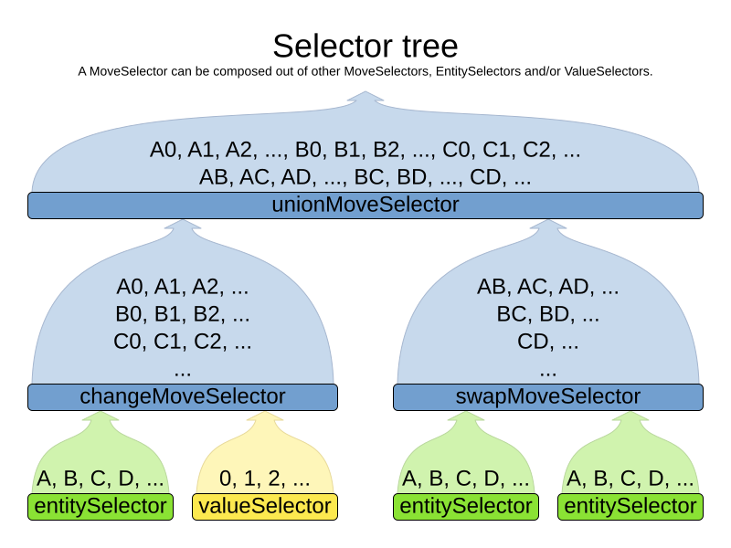

The root of this tree is a MoveSelector which is injected into the optimization algorithm implementation to be (partially) iterated in every step. For a full list of MoveSelector implementations available out of the box, see [Move Selector reference](#pdf-dest-601e0ae9a75a4274).

<a id="pdf-dest-fd07218130937acb"></a>

<a id="section-0563"></a>
#### 42.1.2. Combining multiple MoveSelectors

<a id="pdf-dest-0479dddafff919bf"></a>

42.1.2.1. unionMoveSelector

A unionMoveSelector selects a Move by selecting one of its MoveSelector children to supply the next Move.

Simplest configuration:

```
<unionMoveSelector>
    <...MoveSelector/>
    <...MoveSelector/>
    <...MoveSelector/>
    ...
</unionMoveSelector>
```

Advanced configuration:

```
<unionMoveSelector>
    ... <!-- Normal selector properties -->
    <changeMoveSelector>
    <fixedProbabilityWeight>...</fixedProbabilityWeight>
    ...
    </changeMoveSelector>
    <swapMoveSelector>
    <fixedProbabilityWeight>...</fixedProbabilityWeight>
    ...
    </swapMoveSelector>
    <...MoveSelector>
    <fixedProbabilityWeight>...</fixedProbabilityWeight>
    ...
    </...MoveSelector>
    ...
    <selectorProbabilityWeightFactoryClass>
...ProbabilityWeightFactory</selectorProbabilityWeightFactoryClass>
</unionMoveSelector>
```

The selectorProbabilityWeightFactory determines in selectionOrder RANDOM how often a MoveSelector child is selected to supply the next Move. By default, each MoveSelector child has the same chance of being selected.

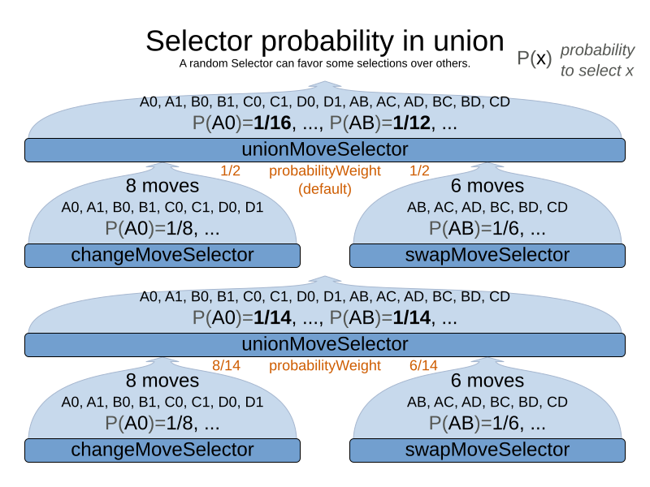

Change the fixedProbabilityWeight of such a child to select it more often. For example, the unionMoveSelector can return a SwapMove twice as often as a ChangeMove:

```
<unionMoveSelector>
    <changeMoveSelector>
    <fixedProbabilityWeight>1.0</fixedProbabilityWeight>
    ...
    </changeMoveSelector>
    <swapMoveSelector>
    <fixedProbabilityWeight>2.0</fixedProbabilityWeight>
    ...
    </swapMoveSelector>
</unionMoveSelector>
```

The number of possible ChangeMoves is very different from the number of possible SwapMoves and furthermore it’s problem dependent. To give each individual Move the same selection chance (as opposed to each MoveSelector), use the FairSelectorProbabilityWeightFactory:

```
<unionMoveSelector>
    <changeMoveSelector/>
    <swapMoveSelector/>

<selectorProbabilityWeightFactoryClass>ai.timefold.solver.core.impl.heuristic.selector
.common.decorator.FairSelectorProbabilityWeightFactory</selectorProbabilityWeightFacto
ryClass>
</unionMoveSelector>
```

<a id="pdf-dest-f505f7f5432fadb9"></a>

42.1.2.2. cartesianProductMoveSelector

A cartesianProductMoveSelector selects a new CompositeMove. It builds that CompositeMove by selecting one Move per MoveSelector child and adding it to the CompositeMove.

Simplest configuration:

```
<cartesianProductMoveSelector>
    <...MoveSelector/>
    <...MoveSelector/>
    <...MoveSelector/>
    ...
</cartesianProductMoveSelector>
```

Advanced configuration:

```
<cartesianProductMoveSelector>
    ... <!-- Normal selector properties -->
    <changeMoveSelector>
    ...
    </changeMoveSelector>
    <swapMoveSelector>
    ...
    </swapMoveSelector>
    <...MoveSelector>
    ...
    </...MoveSelector>
    ...
    <ignoreEmptyChildIterators>true</ignoreEmptyChildIterators>
</cartesianProductMoveSelector>
```

The ignoreEmptyChildIterators property (true by default) will ignore every empty childMoveSelector to avoid returning no moves. For example: a cartesian product of changeMoveSelector A and B, for which B is empty (because all it’s entities are pinned) returns no move if ignoreEmptyChildIterators is false and the moves of A if ignoreEmptyChildIterators is true.

To enforce that two child selectors use the same entity or value efficiently, use [mimic selection](#pdf-dest-ea5272da85e01e82), not move filtering.

<a id="pdf-dest-10bca8dc2b94a098"></a>

<a id="section-0564"></a>
#### 42.1.3. EntitySelector

Simplest configuration:

```
<entitySelector/>
```

Advanced configuration:

```
<entitySelector>
    ... <!-- Normal selector properties -->
    <entityClass>org.acme.vehiclerouting.domain.Vehicle</entityClass>
</entitySelector>
```

The entityClass property is only required if it cannot be deduced automatically because there are multiple entity classes.

<a id="pdf-dest-099f86859efe9c27"></a>

<a id="section-0565"></a>
#### 42.1.4. ValueSelector

Simplest configuration:

```
<valueSelector/>
```

Advanced configuration:

```
<valueSelector variableName="room">
    ... <!-- Normal selector properties -->
</valueSelector>
```

The variableName property is only required if it cannot be deduced automatically because there are multiple variables (for the related entity class).

In exotic Construction Heuristic configurations, the entityClass from the EntitySelector sometimes needs to be downcasted, which can be done with the property downcastEntityClass:

```
<valueSelector variableName="period">
    <downcastEntityClass>...LeadingExam</downcastEntityClass>
</valueSelector>
```

If a selected entity cannot be downcasted, the ValueSelector is empty for that entity.

<a id="pdf-dest-076e6211072c9be9"></a>

<a id="section-0566"></a>
#### 42.1.5. General Selector features

<a id="pdf-dest-71c183f2d9689488"></a>

42.1.5.1. CacheType: create moves ahead of time or just in time

A Selector's cacheType determines when a selection (such as a Move, an entity, a value, …) is created and how long it lives.

Almost every Selector supports setting a cacheType:

```
<changeMoveSelector>
    <cacheType>PHASE</cacheType>
    ...
</changeMoveSelector>
```

The following cacheTypes are supported:

- JUST_IN_TIME (default, recommended): Not cached. Construct each selection (Move, …) just before it’s used. This scales up well in memory footprint.
- STEP: Cached. Create each selection (Move, …) at the beginning of a step and cache them in a list for the remainder of the step. This scales up badly in memory footprint.
- PHASE: Cached. Create each selection (Move, …) at the beginning of a solver phase and cache them in a list for the remainder of the phase. Some selections cannot be phase cached because the list changes every step. This scales up badly in memory footprint, but has a slight performance gain.
- SOLVER: Cached. Create each selection (Move, …) at the beginning of a Solver and cache them in a list for the remainder of the Solver. Some selections cannot be solver cached because the list changes every step. This scales up badly in memory footprint, but has a slight performance gain.

A cacheType can be set on composite selectors too:

```
<unionMoveSelector>
    <cacheType>PHASE</cacheType>
    <changeMoveSelector/>
    <swapMoveSelector/>
    ...
</unionMoveSelector>
```

Nested selectors of a cached selector cannot be configured to be cached themselves, unless it’s a higher cacheType. For example: a STEP cached unionMoveSelector can contain a PHASE cached changeMoveSelector, but it cannot contain a STEP cached changeMoveSelector.

<a id="pdf-dest-13f75519731bbea8"></a>

42.1.5.2. SelectionOrder: original, sorted, random, shuffled, or probabilistic

A Selector's selectionOrder determines the order in which the selections (such as Moves, entities, values, …) are iterated. An optimization algorithm will usually only iterate through a subset of its MoveSelector's selections, starting from the start, so the selectionOrder is critical to decide which Moves are actually evaluated.

Almost every Selector supports setting a selectionOrder:

```
<changeMoveSelector>
    ...
    <selectionOrder>RANDOM</selectionOrder>
    ...
</changeMoveSelector>
```

The following selectionOrders are supported:

- ORIGINAL: Select the selections (Moves, entities, values, …) in default order. Each selection will be selected only once.
  - For example: A0, A1, A2, A3, …, B0, B1, B2, B3, …, C0, C1, C2, C3, …
- SORTED: Select the selections (Moves, entities, values, …) in sorted order. Each selection will be selected only once. Requires cacheType >= STEP. Mostly used on an entitySelector or valueSelector for construction heuristics. See [sorted selection](#pdf-dest-636879f0dfd222e5).
  - For example: A0, B0, C0, …, A2, B2, C2, …, A1, B1, C1, …
- RANDOM (default): Select the selections (Moves, entities, values, …) in non-shuffled random order. A selection might be selected multiple times. This scales up well in performance because it does not require caching.
  - For example: C2, A3, B1, C2, A0, C0, …
- SHUFFLED: Select the selections (Moves, entities, values, …) in shuffled random order. Each selection will be selected only once. Requires cacheType >= STEP. This scales up badly in performance, not just because it requires caching, but also because a random number is generated for each element, even if it’s not selected (which is the grand majority when scaling up).
  - For example: C2, A3, B1, A0, C0, …
- PROBABILISTIC: Select the selections (Moves, entities, values, …) in random order, based on the selection probability of each element. A selection with a higher probability has a higher chance to be selected than elements with a lower probability. A selection might be selected multiple times. Requires cacheType >= STEP. Mostly used on an entitySelector or valueSelector. See [probabilistic selection](#pdf-dest-756e9485b0296258).
  - For example: B1, B1, A1, B2, B1, C2, B1, B1, …

A selectionOrder can be set on composite selectors too.

When a Selector is cached, all of its nested Selectors will naturally default to selectionOrder ORIGINAL. Avoid overwriting the selectionOrder of those nested Selectors.

<a id="pdf-dest-988c6b96ca9b02e9"></a>

42.1.5.3. Recommended combinations of CacheType and SelectionOrder

<a id="pdf-dest-f4cbe7eec0392a8a"></a>

42.1.5.3.1. Just in time random selection (default)

This combination is great for big use cases (10 000 entities or more), as it scales up well in memory footprint and performance. Other combinations are often not even viable on such sizes. It works for smaller use cases too, so it’s a good way to start out. It’s the default, so this explicit configuration of cacheType and selectionOrder is actually obsolete:

```
<unionMoveSelector>
    <cacheType>JUST_IN_TIME</cacheType>
    <selectionOrder>RANDOM</selectionOrder>

    <changeMoveSelector/>
    <swapMoveSelector/>
</unionMoveSelector>
```

Here’s how it works. When Iterator<Move>.next() is called, a child MoveSelector is randomly selected (1), which creates a random Move (2, 3, 4) and is then returned (5):

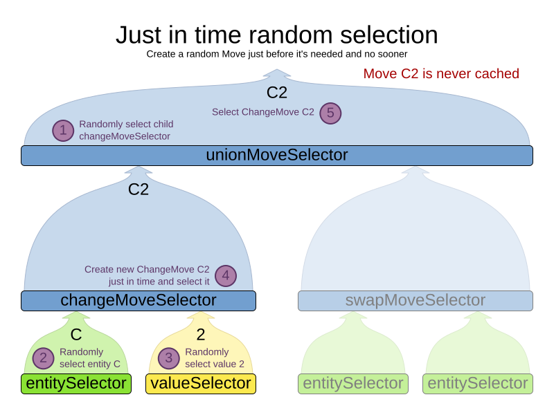

Notice that it never creates a list of Moves and it generates random numbers only for Moves that are actually selected.

<a id="pdf-dest-6dc9263a2d13db98"></a>

42.1.5.3.2. Cached shuffled selection

This combination often wins for small use cases (1000 entities or less). Beyond that size, it scales up badly in memory footprint and performance.

```
<unionMoveSelector>
    <cacheType>PHASE</cacheType>
    <selectionOrder>SHUFFLED</selectionOrder>

    <changeMoveSelector/>
    <swapMoveSelector/>
</unionMoveSelector>
```

Here’s how it works: At the start of the phase (or step depending on the cacheType), all moves are created (1) and cached (2). When MoveSelector.iterator() is called, the moves are shuffled (3). When Iterator<Move>.next() is called, the next element in the shuffled list is returned (4):

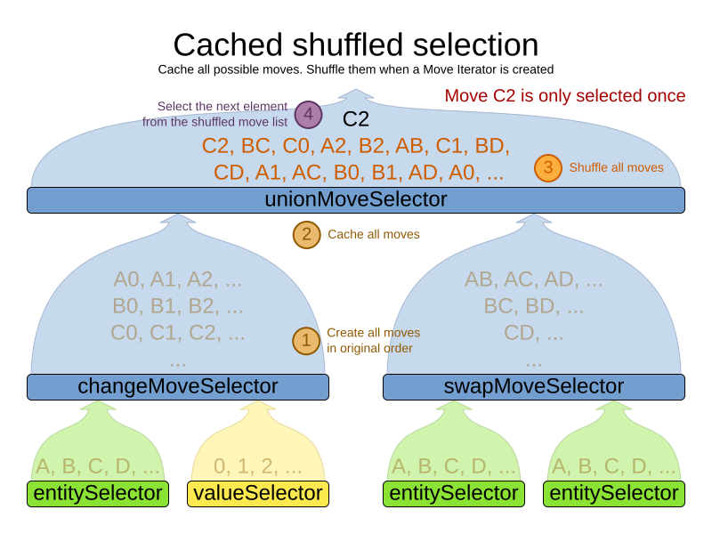

Notice that each Move will only be selected once, even though they are selected in random order.

Use cacheType PHASE if none of the (possibly nested) Selectors require STEP. Otherwise, do something like this:

```
<unionMoveSelector>
    <cacheType>STEP</cacheType>
    <selectionOrder>SHUFFLED</selectionOrder>

    <changeMoveSelector>
    <cacheType>PHASE</cacheType>
    </changeMoveSelector>
    <swapMoveSelector>
    <cacheType>PHASE</cacheType>
    </swapMoveSelector>
    <pillarSwapMoveSelector/><!-- Does not support cacheType PHASE -->
</unionMoveSelector>
```

<a id="pdf-dest-52559416a277d548"></a>

42.1.5.3.3. Cached random selection

This combination is often a worthy competitor for medium use cases, especially with fast stepping optimization algorithms (such as Simulated Annealing). Unlike cached shuffled selection, it doesn’t waste time shuffling the moves list at the beginning of every step.

```
<unionMoveSelector>
    <cacheType>PHASE</cacheType>
    <selectionOrder>RANDOM</selectionOrder>

    <changeMoveSelector/>
    <swapMoveSelector/>
</unionMoveSelector>
```

<a id="pdf-dest-c52cb4a39082ea49"></a>

42.1.5.4. Filtered selection

There can be certain moves that you don’t want to select, because:

- The move is pointless and would only waste CPU time. For example, swapping two lectures of the same course will result in the same score and the same schedule, because all lectures of one course are interchangeable (same teacher, same students, same topic).
- Doing the move would break [a built-in hard constraint](#pdf-dest-cd201d76e6ca923b), so the solution would be infeasible but the score function doesn’t check built-in hard constraints for performance reasons. For example, don’t change a gym lecture to a room which is not a gym room. It’s usually better to not use move filtering for such cases, because it allows the metaheuristics to temporarily break hard constraints to escape local optima.

Any built-in hard constraint must probably be filtered on every move type of every solver phase. For example if it filters the change move of Local Search, it

must also filter the swap move that swaps the room of a gym lecture with

another lecture for which the other lecture’s original room isn’t a gym room. Furthermore, it must also filter the change moves of the Construction Heuristics (which requires an advanced configuration).

If a move is unaccepted by the filter, it’s not executed and the score isn’t calculated.

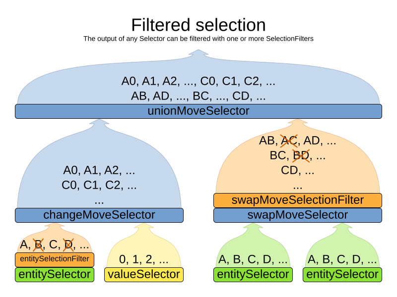

Filtering uses the interface SelectionFilter:

```
public interface SelectionFilter<Solution_, T> {

    boolean accept(ScoreDirector<Solution_> scoreDirector, T selection);

}
```

Implement the accept method to return false on a discarded selection (see below). Implementations are expected to be stateless, as the solver may choose to reuse them in different contexts.

Filtered selection can happen on any Selector in the selector tree, including any MoveSelector, EntitySelector or ValueSelector. It works with any cacheType and selectionOrder.

Apply the filter on the lowest level possible. In most cases, you’ll need to know both the entity and the value involved so you’ll have to apply it on the move selector.

<a id="pdf-dest-d716335068faf576"></a>

42.1.5.4.1. Filtered move selection

Unaccepted moves will not be selected and will therefore never need to be undone:

```
public class DifferentCourseSwapMoveFilter
    implements SelectionFilter<CourseSchedule, SelectorBasedSwapMove<CourseSchedule,
Lecture>> {

    @Override
    public boolean accept(ScoreDirector<CourseSchedule> scoreDirector,
            SelectorBasedSwapMove<CourseSchedule, Lecture> move) {
        var leftLecture = (Lecture) move.getLeftEntity();
        var rightLecture = (Lecture) move.getRightEntity();
        return !leftLecture.getCourse().equals(rightLecture.getCourse());
    }

}
```

Configure the filterClass on every targeted moveSelector (potentially both in the Local Search and the Construction Heuristics if it filters ChangeMoves):

```
<swapMoveSelector>
    <filterClass>...DifferentCourseSwapMoveFilter</filterClass>
</swapMoveSelector>
```

<a id="pdf-dest-6c34baeeb47ee1b3"></a>

42.1.5.4.2. Filtered entity selection

Unaccepted entities will not be selected and will therefore never be used to create a move.

```
public class LongLectureSelectionFilter implements SelectionFilter<CourseSchedule,
Lecture> {

    @Override
    public boolean accept(ScoreDirector<CourseSchedule> scoreDirector, Lecture
lecture) {
        return lecture.isLong();
    }

}
```

Configure the filterClass on every targeted entitySelector (potentially both in the Local Search and the Construction Heuristics):

```
<changeMoveSelector>
    <entitySelector>
    <filterClass>...LongLectureSelectionFilter</filterClass>
    </entitySelector>
</changeMoveSelector>
```

If that filter should apply on all entities, configure it as a [global pinningFilter](#pdf-dest-34e2763eb1a760ec) instead.

<a id="pdf-dest-7d10bd7c91045bb3"></a>

42.1.5.4.3. Filtered value selection

Unaccepted values will not be selected and will therefore never be used to create a move.

```
public class LongPeriodSelectionFilter implements SelectionFilter<CourseSchedule,
Period> {

    @Override
    public boolean accept(ScoreDirector<CourseSchedule> scoreDirector, Period period)
{
        return period();
    }

}
```

Configure the filterClass on every targeted valueSelector (potentially both in the Local Search and the Construction Heuristics):

```
<changeMoveSelector>
    <valueSelector>
    <filterClass>...LongPeriodSelectionFilter</filterClass>
    </valueSelector>
</changeMoveSelector>
```

<a id="pdf-dest-636879f0dfd222e5"></a>

42.1.5.5. Sorted selection

Sorted selection can happen on any Selector in the selector tree, including any MoveSelector, EntitySelector or ValueSelector. It does not work with cacheType JUST_IN_TIME and it only works with selectionOrder SORTED.

It’s mostly used in construction heuristics.

If the chosen construction heuristic implies sorting, for example

FIRST_FIT_DECREASING implies that the EntitySelector is sorted, there is no need to

explicitly configure a Selector with sorting. If you do explicitly configure the Selector, it overwrites the default settings of that construction heuristic.

<a id="pdf-dest-e60c00587147862c"></a>

42.1.5.5.1. Sorted selection by SorterManner

Some Selector types implement a SorterManner out of the box:

- EntitySelector supports:
  - DESCENDING: Sorts the [planning](#pdf-dest-079a1ff77d0c06ee) entities in descending order based on a give metric (planning [entity sorting](#pdf-dest-079a1ff77d0c06ee)). Requires that planning entity is annotated on the domain model.
```
    <entitySelector>
        <cacheType>PHASE</cacheType>
        <selectionOrder>SORTED</selectionOrder>
        <sorterManner>DESCENDING</sorterManner>
    </entitySelector>
```

- ValueSelector supports:
  - ASCENDING: Sorts the [planning](#pdf-dest-67c289716d37513f) values in ascending order based on a given metric (planning [value sorting](#pdf-dest-67c289716d37513f)). Requires that planning value is annotated on the domain model.
```
    <valueSelector>
        <cacheType>PHASE</cacheType>
        <selectionOrder>SORTED</selectionOrder>
        <sorterManner>ASCENDING</sorterManner>
    </valueSelector>
```

<a id="pdf-dest-991510aee2df6fb1"></a>

42.1.5.5.2. Sorted selection by Comparator

An easy way to sort a Selector is with a plain old Comparator:

```
public class VisitComparator implements Comparator<Visit> {

    public int compare(Visit a, Visit b) {
        return new CompareToBuilder()
                .append(a.getServiceDuration(), b.getServiceDuration())
                .append(a.getId(), b.getId())
                .toComparison();
    }

}
```

You’ll also need to configure it (unless it’s annotated on the domain model and automatically applied by the optimization algorithm):

```
<entitySelector>
    <cacheType>PHASE</cacheType>
    <selectionOrder>SORTED</selectionOrder>
    <comparatorClass>...VisitComparator</comparatorClass>
    <sorterOrder>DESCENDING</sorterOrder>
</entitySelector>
```

Comparator implementations are expected to be stateless. The solver may choose to

reuse them in different contexts.

<a id="pdf-dest-1913f3d50d496dbd"></a>

<a id="pdf-dest-8c9cd15909c3934c"></a>

42.1.5.5.3. Sorted selection by ComparatorFactory

If you need the entire solution to sort a Selector, use a ComparatorFactory instead:

```
public interface ComparatorFactory<Solution_, T> {

    Comparator<T> createComparator(Solution_ solution);

}
```

You’ll also need to configure it (unless it’s annotated on the domain model and automatically applied by the optimization algorithm):

```
<entitySelector>
    <cacheType>PHASE</cacheType>
    <selectionOrder>SORTED</selectionOrder>
    <comparatorFactoryClass>...MyComparatorFactory</comparatorFactoryClass>
    <sorterOrder>DESCENDING</sorterOrder>
</entitySelector>
```

ComparatorFactory implementations are expected to be stateless. The solver may

choose to reuse them in different contexts.

<a id="pdf-dest-d4302689396e9684"></a>

42.1.5.5.4. Sorted selection by SelectionSorter

Alternatively, you can also use the interface SelectionSorter directly:

```
public interface SelectionSorter<Solution_, T> {

    void sort(ScoreDirector<Solution_> scoreDirector, List<T> selectionList);

}

    <entitySelector>
        <cacheType>PHASE</cacheType>
        <selectionOrder>SORTED</selectionOrder>
        <sorterClass>...MyEntitySorter</sorterClass>
    </entitySelector>
```

SelectionSorter implementations are expected to be stateless. The solver may

choose to reuse them in different contexts.

<a id="pdf-dest-756e9485b0296258"></a>

42.1.5.6. Probabilistic selection

Probabilistic selection can happen on any Selector in the selector tree, including any MoveSelector, EntitySelector or ValueSelector. It does not work with cacheType JUST_IN_TIME and it only works with selectionOrder PROBABILISTIC.

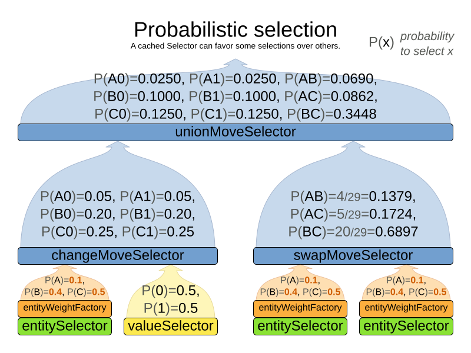

Each selection has a probabilityWeight, which determines the chance that selection will be selected:

```
public interface SelectionProbabilityWeightFactory<Solution_, T> {

    double createProbabilityWeight(ScoreDirector<Solution_> scoreDirector, T
selection);

}

    <entitySelector>
        <cacheType>PHASE</cacheType>
        <selectionOrder>PROBABILISTIC</selectionOrder>
        <probabilityWeightFactoryClass>
...MyEntityProbabilityWeightFactoryClass</probabilityWeightFactoryClass>
    </entitySelector>
```

Assume the following entities: lesson A (probabilityWeight 2.0), lesson B (probabilityWeight 0.5) and lesson C (probabilityWeight 0.5). Then lesson A will be selected four times more than B and C.

SelectionProbabilityWeightFactory implementations are expected to be stateless.

The solver may choose to reuse them in different contexts.

<a id="pdf-dest-093504348176d064"></a>

42.1.5.7. Limited selection

Selecting all possible moves sometimes does not scale well enough, especially for [construction](#pdf-dest-68e6e1c4a99df0a3) [heuristics](#pdf-dest-68e6e1c4a99df0a3), which don’t support acceptedCountLimit. ([source](#pdf-dest-8d1e0d5f1fbd1783))

To limit the number of selected selection per step, apply a selectedCountLimit on the selector:

```
<changeMoveSelector>
    <selectedCountLimit>100</selectedCountLimit>
</changeMoveSelector>
```

To scale Local Search, setting acceptedCountLimit is usually better than using

selectedCountLimit.

<a id="pdf-dest-ea5272da85e01e82"></a>

42.1.5.8. Mimic selection (record/replay)

During mimic selection, one normal selector records its selection and one or multiple other special selectors replay that selection. The recording selector acts as a normal selector and supports all other configuration properties. A replaying selector mimics the recording selection and supports no other configuration properties.

The recording selector needs an id. A replaying selector must reference a recorder’s id with a mimicSelectorRef:

```
<cartesianProductMoveSelector>
    <changeMoveSelector>
    <entitySelector id="entitySelector"/>
    <valueSelector variableName="period"/>
    </changeMoveSelector>
    <changeMoveSelector>
    <entitySelector mimicSelectorRef="entitySelector"/>
    <valueSelector variableName="room"/>
    </changeMoveSelector>
</cartesianProductMoveSelector>
```

Mimic selection is useful to create [a composite move](#pdf-dest-f505f7f5432fadb9) from two moves that affect the same entity.

<a id="pdf-dest-047dbc59d03e12f1"></a>

<a id="section-0567"></a>
#### 42.1.6. Nearby selection

This feature is exclusive to [Timefold Solver Enterprise Edition](#pdf-dest-601e0ae9a75a4274).

In some use cases (such as TSP and VRP, but also in other cases), changing entities to nearby values or swapping nearby entities leads to better results faster.

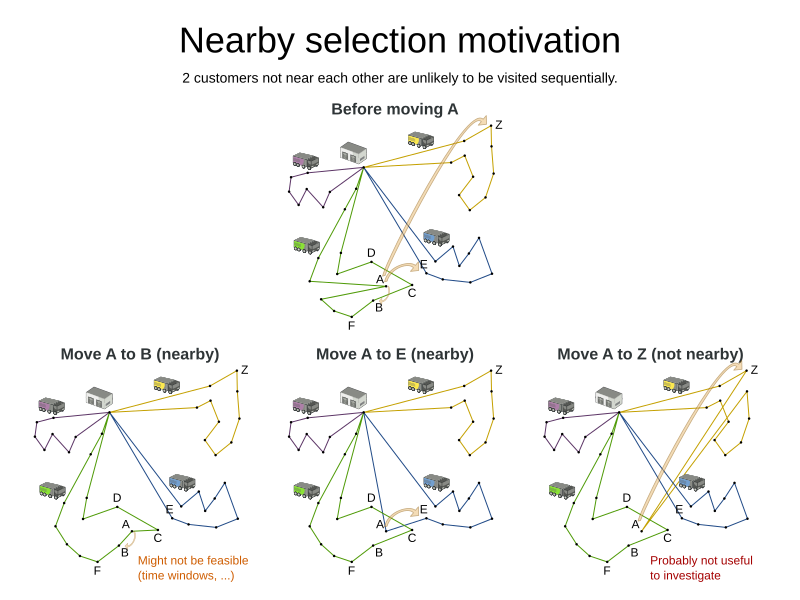

This can heavily increase scalability and improve solution quality:

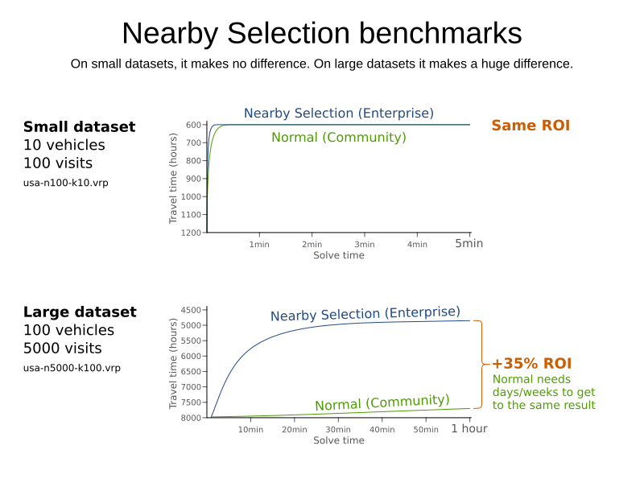

Nearby selection increases the probability of selecting an entity or value which is nearby to the first entity being moved in that move.

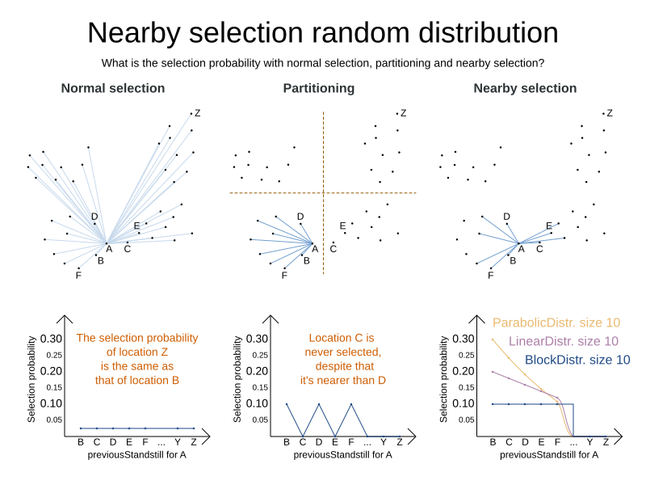

The distance between two entities or values is domain specific. Therefore, implement the NearbyDistanceMeter interface:

Java

```
public interface NearbyDistanceMeter<Origin_, Destination_> {

    double getNearbyDistance(Origin_ origin, Destination_ destination);

}
```

In a nutshell, when nearby selection is applied, the Origin_ and Destination_ types are determined by the relevant selectors within the nearbySelection configuration. For a [basic variable](#pdf-dest-eac7cd247d175d22), Origin_ is defined by the planning entity (for example Lesson) of the nearby definition, while Destination_ can be either a planning value or a planning entity. In the case of a [list variable](#pdf-dest-3b7e39f8e6b8ca1d), Origin_ is always a planning value (for example Customer), but Destination_ can be either a planning value or a planning entity.

As an example, consider the Vehicle Routing Problem and a list variable to store the customer list for each vehicle. The distance meter must be able to handle both Customer and Vehicle as the Destination_ argument: Java

```
public class CustomerNearbyDistanceMeter implements NearbyDistanceMeter
<Customer, LocationAware> {

    public double getNearbyDistance(Customer origin, LocationAware destination)
{
        return origin.getDistanceTo(destination);
    }

}
```

NearbyDistanceMeter implementations are expected to be stateless. The solver may choose to reuse them in different contexts.

The Nearby configuration is not enabled for the Construction Heuristics because the method will analyze all possible moves. Adding Nearby in this situation would

only result in unnecessary costs involving the generation of the distance matrix

and sorting operations without taking advantage of the feature.

The previous code snippet exemplifies the implementation of a distance meter for a list variable, but the general idea remains the same for basic variables, which is that the implementation must handle the related planning values and planning entities.

<a id="pdf-dest-eac7cd247d175d22"></a>

42.1.6.1. Nearby selection with a basic variable

To quickly configure nearby selection for a solution that only uses basic variables, add nearbyDistanceMeterClass element to your configuration file. The following enables nearby selection with a basic variable for the local search:

```
<?xml version="1.0" encoding="UTF-8"?>
<solver xmlns="https://timefold.ai/xsd/solver">
    ...

<nearbyDistanceMeterClass>org.acme.schooltimetabling.domain.solver.nearby.LectureNearb
yDistanceMeter</nearbyDistanceMeterClass>
    ...
</solver>
```

By default, the following move selectors are included: [Change](#pdf-dest-34f8b83c73ec2069), Swap, Change with Nearby, and ([source](#pdf-dest-3241e8cd13e17ded)) Swap with Nearby.

For a mixed model, configure nearby selection for basic-variable move selectors

explicitly.

<a id="pdf-dest-698b6c3036e09615"></a>

42.1.6.1.1. Advanced configuration for local search

To customize the move selectors, add a nearbySelection element in the valueSelector of a changeMoveSelector or in the secondaryEntitySelector of a swapMoveSelector, and use [mimic selection](#pdf-dest-ea5272da85e01e82) to specify which entity should be nearby the selection.

For a changeMoveSelector, Origin_ is the entity selected and Destination_ is the nearby planning value selected by the valueSelector. For a swapMoveSelector, both Origin_ and Destination_ are planning entities. The Destination_ is determined by the configuration setting secondaryEntitySelector.

```
<unionMoveSelector>
    <changeMoveSelector>
    <entitySelector id="entitySelector1"/>
    <valueSelector variableName="room">
        <nearbySelection>
        <originEntitySelector mimicSelectorRef="entitySelector1"/>

<nearbyDistanceMeterClass>org.acme.schooltimetabling.domain.solver.nearby.LectureNearb
yDistanceMeter</nearbyDistanceMeterClass>
        </nearbySelection>
    </valueSelector>
    </changeMoveSelector>
    <swapMoveSelector>
    <entitySelector id="entitySelector2"/>
    <secondaryEntitySelector>
        <nearbySelection>
        <originEntitySelector mimicSelectorRef="entitySelector2"/>

<nearbyDistanceMeterClass>org.acme.schooltimetabling.domain.solver.nearby.LectureNearb
yDistanceMeter</nearbyDistanceMeterClass>
        </nearbySelection>
    </secondaryEntitySelector>
    </swapMoveSelector>
</unionMoveSelector>
```

<a id="pdf-dest-3b7e39f8e6b8ca1d"></a>

42.1.6.2. Nearby selection with a list variable

To quickly configure nearby selection with a planning list variable, add nearbyDistanceMeterClass element to your configuration file. The following enables nearby selection with a list variable for the local search:

```
<?xml version="1.0" encoding="UTF-8"?>
<solver xmlns="https://timefold.ai/xsd/solver">
    ...

<nearbyDistanceMeterClass>org.acme.vehiclerouting.domain.solver.nearby.CustomerNearbyD
istanceMeter</nearbyDistanceMeterClass>
    ...
</solver>
```

By default, the following move selectors are included: [Change](#pdf-dest-34f8b83c73ec2069), Swap, K-OPT, Change with Nearby, ([source](#pdf-dest-3241e8cd13e17ded)) ([source](#pdf-dest-67c1b172f980baa7)) Swap with Nearby, and K-OPT with Nearby.

<a id="pdf-dest-ef6e5cc18d99b4de"></a>

42.1.6.2.1. Advanced configuration for local search

To customize the move selectors, add a nearbySelection element in the destinationSelector, valueSelector or subListSelector and use [mimic selection](#pdf-dest-ea5272da85e01e82) to specify which destination, value, or subList should be nearby the selection.

```
<unionMoveSelector>
    <listChangeMoveSelector>
    <valueSelector id="valueSelector1"/>
    <destinationSelector>
        <nearbySelection>
        <originValueSelector mimicSelectorRef="valueSelector1"/>

<nearbyDistanceMeterClass>org.acme.vehiclerouting.domain.solver.nearby.CustomerNearbyD
istanceMeter</nearbyDistanceMeterClass>
        </nearbySelection>
    </destinationSelector>
    </listChangeMoveSelector>
    <listSwapMoveSelector>
    <valueSelector id="valueSelector2"/>
    <secondaryValueSelector>
        <nearbySelection>
        <originValueSelector mimicSelectorRef="valueSelector2"/>

<nearbyDistanceMeterClass>org.acme.vehiclerouting.domain.solver.nearby.CustomerNearbyD
istanceMeter</nearbyDistanceMeterClass>
        </nearbySelection>
    </secondaryValueSelector>
    </listSwapMoveSelector>
    <subListChangeMoveSelector>
    <selectReversingMoveToo>true</selectReversingMoveToo>
    <subListSelector id="subListSelector3"/>
    <destinationSelector>
        <nearbySelection>
        <originSubListSelector mimicSelectorRef="subListSelector3"/>

<nearbyDistanceMeterClass>org.acme.vehiclerouting.domain.solver.nearby.CustomerNearbyD
istanceMeter</nearbyDistanceMeterClass>
        </nearbySelection>
    </destinationSelector>
    </subListChangeMoveSelector>
    <subListSwapMoveSelector>
    <selectReversingMoveToo>true</selectReversingMoveToo>
    <subListSelector id="subListSelector4"/>
    <secondarySubListSelector>
        <nearbySelection>
        <originSubListSelector mimicSelectorRef="subListSelector4"/>

<nearbyDistanceMeterClass>org.acme.vehiclerouting.domain.solver.nearby.CustomerNearbyD
istanceMeter</nearbyDistanceMeterClass>
        </nearbySelection>
    </secondarySubListSelector>
    </subListSwapMoveSelector>
</unionMoveSelector>
```

<a id="pdf-dest-5879145b91d342c0"></a>

42.1.6.3. Power-tweaking distribution type

The solver allows you to tweak the distribution type of the nearby selection, or how likely are the nearest elements to be selected based on their distance from the current.

Only tweak the default settings if you are prepared to back your choices by

extensive [benchmarking](#pdf-dest-e921478f36b99095).

The following NearbySelectionDistributionTypes are supported:

- PARABOLIC_DISTRIBUTION (default): Nearest elements are selected with a higher probability.
```
<nearbySelection>
    <parabolicDistributionSizeMaximum>80</parabolicDistributionSizeMaximum>
</nearbySelection>
```

A distributionSizeMaximum parameter should not be 1 because if the nearest is already the planning value of the current entity, then the only move that is selectable is not doable. To allow every element to be selected regardless of the number of entities, only set the distribution type (so without a distributionSizeMaximum parameter):

```
<nearbySelection>
    <nearbySelectionDistributionType>
PARABOLIC_DISTRIBUTION</nearbySelectionDistributionType>
</nearbySelection>
```

- BLOCK_DISTRIBUTION: Only the n nearest are selected, with an equal probability. For example, select the 20 nearest:
```
<nearbySelection>
    <blockDistributionSizeMaximum>20</blockDistributionSizeMaximum>
</nearbySelection>
```

- LINEAR_DISTRIBUTION: Nearest elements are selected with a higher probability. The probability decreases linearly.
```
<nearbySelection>
    <linearDistributionSizeMaximum>40</linearDistributionSizeMaximum>
</nearbySelection>
```

- BETA_DISTRIBUTION: Selection according to a beta distribution. Slows down the solver significantly.
```
<nearbySelection>
    <betaDistributionAlpha>1</betaDistributionAlpha>
    <betaDistributionBeta>5</betaDistributionBeta>
</nearbySelection>
```

<a id="pdf-dest-d08215fe5ad33e42"></a>

<a id="section-0568"></a>
### 42.2. Move selectors for basic variables

These moves are applicable to planning variables that aren’t part of a list, also called [basic](#pdf-dest-6961175c48fffeac) [variables](#pdf-dest-6961175c48fffeac).

<a id="pdf-dest-34f8b83c73ec2069"></a>

<a id="section-0569"></a>
#### 42.2.1. ChangeMoveSelector

For one planning variable, the ChangeMove selects one planning entity and one planning value and assigns the entity’s variable to that value.

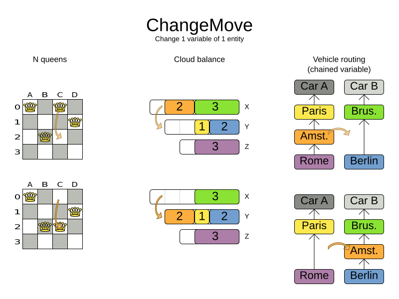

Simplest configuration:

```
<changeMoveSelector/>
```

If there are multiple entity classes or multiple planning variables for one entity class, a simple configuration will automatically unfold into an [union](#pdf-dest-0479dddafff919bf) of ChangeMove selectors for every planning variable.

Advanced configuration:

```
<changeMoveSelector>
    ... <!-- Normal selector properties -->
    <entitySelector>
    <entityClass>...Lecture</entityClass>
    ...
    </entitySelector>
    <valueSelector variableName="room">
    ...
    </valueSelector>
</changeMoveSelector>
```

A ChangeMove is the finest grained move.

Almost every moveSelector configuration injected into a metaheuristic algorithm

should include a changeMoveSelector. This guarantees that every possible solution

can be reached in theory through applying a number of moves in sequence. Of course, normally it is unioned with other, more coarse grained move selectors.

<a id="pdf-dest-3241e8cd13e17ded"></a>

<a id="section-0570"></a>
#### 42.2.2. SwapMoveSelector

The SwapMove selects two different planning entities and swaps the planning values of all their planning variables.

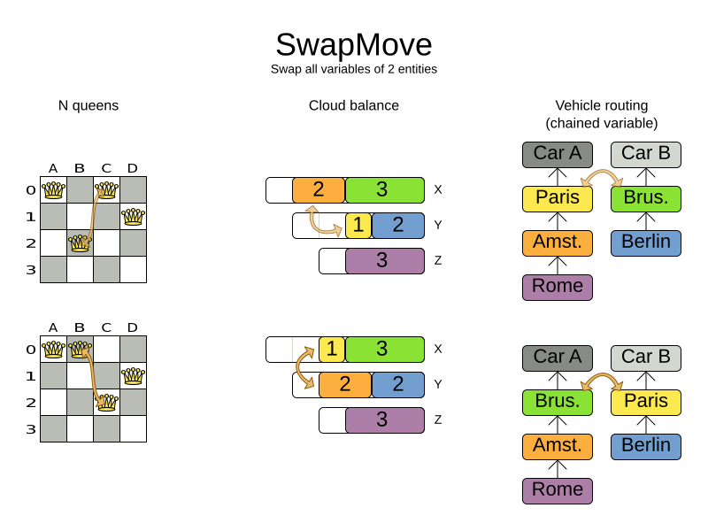

Although a SwapMove on a single variable is essentially just two ChangeMoves, it’s often the winning step in cases that the first of the two ChangeMoves would not win because it leaves the solution in a state with broken hard constraints. For example: swapping the room of two lectures doesn’t bring the solution in an intermediate state where both lectures are in the same room which breaks a hard constraint.

Simplest configuration:

```
<swapMoveSelector/>
```

If there are multiple entity classes, a simple configuration will automatically unfold into an [union](#pdf-dest-0479dddafff919bf) of SwapMove selectors for every entity class.

Advanced configuration:

```
<swapMoveSelector>
    ... <!-- Normal selector properties -->
    <entitySelector>
    <entityClass>...Lecture</entityClass>
    ...
    </entitySelector>
    <secondaryEntitySelector>
    <entityClass>...Lecture</entityClass>
    ...
    </secondaryEntitySelector>
    <variableNameIncludes>
    <variableNameInclude>room</variableNameInclude>
    <variableNameInclude>...</variableNameInclude>
    </variableNameIncludes>
</swapMoveSelector>
```

The secondaryEntitySelector is rarely needed: if it is not specified, entities from the same entitySelector are swapped.

If one or more variableNameInclude properties are specified, not all planning variables will be swapped, but only those specified.

<a id="pdf-dest-bb24c8ca7d32861a"></a>

<a id="section-0571"></a>
#### 42.2.3. Pillar-based move selectors

A pillar is a set of planning entities which have the same planning value(s) for their planning variable(s).

<a id="pdf-dest-25f82930499d738c"></a>

42.2.3.1. PillarChangeMoveSelector

The PillarChangeMove selects one entity pillar (or subset of those) and changes the value of one variable (which is the same for all entities) to another value.

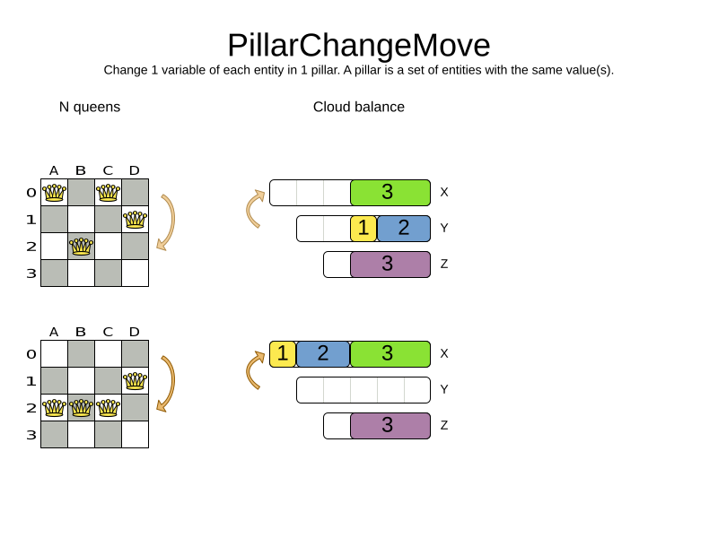

In the example above, queen A and C have the same value (row 0) and are moved to row 2. Also the yellow and blue process have the same value (computer Y) and are moved to computer X.

Simplest configuration:

```
<pillarChangeMoveSelector/>
```

Advanced configuration:

```
<pillarChangeMoveSelector>
    <subPillarType>SEQUENCE</subPillarType>
    <subPillarSequenceComparatorClass>
...ShiftComparator</subPillarSequenceComparatorClass>
    ... <!-- Normal selector properties -->
    <pillarSelector>
    <entitySelector>
        <entityClass>...Shift</entityClass>
        ...
    </entitySelector>
    <minimumSubPillarSize>1</minimumSubPillarSize>
    <maximumSubPillarSize>1000</maximumSubPillarSize>
    </pillarSelector>
    <valueSelector variableName="employee">
    ...
    </valueSelector>
</pillarChangeMoveSelector>
```

For a description of subPillarType and related properties, please refer to [Sub-pillars](#pdf-dest-f0fcf843aa5d7302).

The other properties are explained in [changeMoveSelector](#pdf-dest-34f8b83c73ec2069). This move selector doesn’t support [phase or solver caching](#pdf-dest-71c183f2d9689488) and step caching scales badly memory wise.

<a id="pdf-dest-ec3c502d53b21d5d"></a>

42.2.3.2. PillarSwapMoveSelector

The PillarSwapMove selects two different entity pillars and swaps the values of all their variables for all their entities.

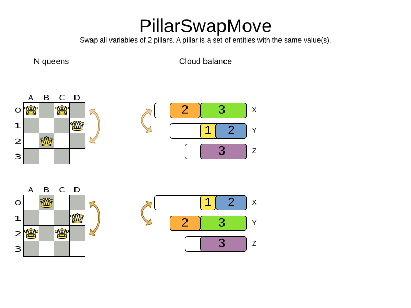

Simplest configuration:

```
<pillarSwapMoveSelector/>
```

Advanced configuration:

```
<pillarSwapMoveSelector>
    <subPillarType>SEQUENCE</subPillarType>
    <subPillarSequenceComparatorClass>
...ShiftComparator</subPillarSequenceComparatorClass>
    ... <!-- Normal selector properties -->
    <pillarSelector>
    <entitySelector>
        <entityClass>...Shift</entityClass>
        ...
    </entitySelector>
    <minimumSubPillarSize>1</minimumSubPillarSize>
    <maximumSubPillarSize>1000</maximumSubPillarSize>
    </pillarSelector>
    <secondaryPillarSelector>
    <entitySelector>
        ...
    </entitySelector>
    ...
    </secondaryPillarSelector>
    <variableNameIncludes>
    <variableNameInclude>employee</variableNameInclude>
    <variableNameInclude>...</variableNameInclude>
    </variableNameIncludes>
</pillarSwapMoveSelector>
```

For a description of subPillarType and related properties, please refer to [sub-pillars](#pdf-dest-f0fcf843aa5d7302).

The secondaryPillarSelector is rarely needed: if it is not specified, entities from the same pillarSelector are swapped.

The other properties are explained in [swapMoveSelector](#pdf-dest-3241e8cd13e17ded) and pillarChangeMoveSelector. This move ([source](#pdf-dest-25f82930499d738c)) selector doesn’t support [phase or solver caching](#pdf-dest-71c183f2d9689488) and step caching scales badly memory wise.

<a id="pdf-dest-f0fcf843aa5d7302"></a>

42.2.3.3. Sub-pillars

A sub-pillar is a subset of entities that share the same value(s) for their variable(s). For example if queen A, B, C and D are all located on row 0, they’re a pillar and [A, D] is one of the many sub-pillars.

There are several ways how sub-pillars can be selected by the subPillarType property:

- ALL (default) selects all possible sub-pillars.
- SEQUENCE limits selection of sub-pillars to [Sequential sub-pillars](#pdf-dest-6359d33d1cdd36a9).
- NONE never selects any sub-pillars.

If sub-pillars are enabled, the pillar itself is also included and the properties minimumSubPillarSize (defaults to 1) and maximumSubPillarSize (defaults to infinity) limit the size of the selected (sub) pillar.

The number of sub-pillars of a pillar is exponential to the size of the pillar. For example a pillar of size 32 has (2^32 - 1) sub-pillars. Therefore a pillarSelector only supports [JIT random selection](#pdf-dest-f4cbe7eec0392a8a) (which is the default).

<a id="pdf-dest-6359d33d1cdd36a9"></a>

42.2.3.3.1. Sequential sub-pillars

sub-pillars can be sorted with a Comparator. A sequential sub-pillar is a continuous subset of its sorted base pillar.

For example, if an employee has shifts on Monday (M), Tuesday (T), and Wednesday (W), they’re a pillar and only the following are its sequential sub-pillars: [M], [T], [W], [M, T], [T, W], [M, T, W]. But [M, W] is not a sub-pillar in this case, as there is a gap on Tuesday.

Sequential sub-pillars apply to both [Pillar change move](#pdf-dest-25f82930499d738c) and Pillar swap move. A minimal ([source](#pdf-dest-ec3c502d53b21d5d)) configuration looks like this:

```
<pillar...MoveSelector>
    <subPillarType>SEQUENCE</subPillarType>
</pillar...MoveSelector>
```

In this case, the entity being operated on must implement the Comparable interface. The size of sub-pillars will not be limited in any way.

An advanced configuration looks like this:

```
<pillar...MoveSelector>
    ...
    <subPillarType>SEQUENCE</subPillarType>
    <subPillarSequenceComparatorClass>
...ShiftComparator</subPillarSequenceComparatorClass>
    <pillarSelector>
    ...
    <minimumSubPillarSize>1</minimumSubPillarSize>
    <maximumSubPillarSize>1000</maximumSubPillarSize>
    </pillarSelector>
    ...
</pillar...MoveSelector>
```

In this case, the entity being operated on needn’t be Comparable. The given subPillarSequenceComparatorClass is used to establish the sequence instead. Also, the size of the sub-pillars is limited in length of up to 1000 entities.

<a id="pdf-dest-74050161a6ed7657"></a>

<a id="section-0572"></a>
#### 42.2.4. RuinRecreateMoveSelector

The RuinRecreateMove selects a subset of entities and sets their values to null, effectively unassigning them. Then it runs a construction heuristic to assign them again. If [unassigned values](#pdf-dest-47baf2a354e19c3d) are allowed, it may leave them unassigned.

This coarse-grained move is useful to help the solver to escape from a local optimum. It allows the solver to effectively "undo" a number of earlier decisions in one step, opening up a new part of the solution space.

If [nearby selection](#pdf-dest-047dbc59d03e12f1) is enabled, the RuinRecreateMove is likely to underperform as it won’t be able to rebuild the solution using nearby selection. This almost always results in worse solutions than those that were originally ruined, without a big likelihood of leading to a better solution further down the line. We recommend not using this move together with nearby selection.

This move is not enabled by default. To enable it, add the following to the localSearch section of the solver configuration:

```
<ruinRecreateMoveSelector/>
```

The default values have been determined by extensive benchmarking. That said, the optimal values may vary depending on the problem, available solving time, and dataset at hand. We recommend that you [experiment with these values](#pdf-dest-e921478f36b99095) to find the best fit for your problem.

Advanced configuration:

```
<ruinRecreateMoveSelector>
    <minimumRuinedCount>5</minimumRuinedCount>
    <maximumRuinedCount>20</maximumRuinedCount>
    <entitySelector>
    <entityClass>...Lecture</entityClass>
    ...
    </entitySelector>
    <variableName>room</variableName>
</ruinRecreateMoveSelector>
```

The minimumRuinedCount and maximumRuinedCount properties limit the number of entities that are unassigned. The default values are 5 and 20 respectively, but for large datasets, it may prove beneficial to increase these values.

The entitySelector property specifies which entity should be selected, allowing its values to be ruined and recreated. In a model with multiple entities, this property is required, or the solver will fail because it cannot automatically deduce the entity.

When there are multiple basic variables defined in the model, the solver cannot automatically select one of them. The property variableName allows you to specify which variable will be used by the move generator.

RuinRecreateMove doesn’t support customizing the construction heuristic that it

runs. Neither does it support customizing any entity or value selectors. If your

problem needs more control over the construction heuristic, don’t enable this move.

Since the RuinRecreateMove is a coarse-grained move, it is expensive and can slow the solver down significantly. However, the default local search configuration will attempt to run it at the same frequency as the other fine-grained moves. For that reason, we recommend that you use [probabilistic selection](#pdf-dest-756e9485b0296258) to control the frequency of this move:

```
<unionMoveSelector>
    <unionMoveSelector>
        <fixedProbabilityWeight>100.0</fixedProbabilityWeight>
        <changeMoveSelector/>
        <swapMoveSelector/>
    </unionMoveSelector>
    <ruinRecreateMoveSelector>
        <fixedProbabilityWeight>1.0</fixedProbabilityWeight>
    </ruinRecreateMoveSelector>
</unionMoveSelector>
```

The above configuration will run the RuinRecreateMove once for every 100 fine-grained moves. As always, benchmarking is recommended to find the optimal value for your use case.

<a id="pdf-dest-290b8ff6fc54bc92"></a>

<a id="section-0573"></a>
#### 42.2.5. MultistageMoveSelector

This feature is exclusive to [Timefold Solver Enterprise Edition](#pdf-dest-601e0ae9a75a4274).

The multistageMoveSelector selects a multistage move to execute from a BasicVariableStageProvider.

The BasicVariableStageProvider is initialized from the working solution at phase start and when selected supplies a list of BasicVariableCustomStage, which each select a move and are executed in order.

Each BasicVariableCustomStage has access to a BasicVariableMoveEvaluator which allows the stage to evaluate moves without executing them.

Configuration:

```
<multistageMoveSelector>
    <stageProviderClass>...MyStageProvider</stageProviderClass>
    <entityClass>...Shift</entityClass>
    <variableName>employee</variableName>
</multistageMoveSelector>

public class MyStageProvider implements BasicVariableStageProvider<Schedule, Shift,
Employee, HardSoftScore> {
List<Shift> shiftList;
Map<String, List<Employee>> employeesBySkillMap;

@Override
public void initialize(Schedule schedule) {
    this.shiftList = schedule.getShifts();
    this.employeesBySkillMap = new HashMap<>();

    for (var employee : schedule.getEmployees()) {
        this.employeesBySkillMap.computeIfAbsent(employee.getSkill(), ignored ->
new ArrayList<>()).add(employee);
    }
}

@Override
public List<BasicVariableCustomStage<Schedule, Shift, Employee, HardSoftScore>>
        createStages(Random random) {
    var shift = shiftList.get(random.nextInt(shiftList.size()));
    var employeesWithSkill = employeesBySkillMap.get(shift.getRequiredSkill());
    return List.of(
            BasicVariableCustomStage.bestFit(shift, employeesWithSkill));
}
}
```

By default, the solver uses the moves [Change](#pdf-dest-34f8b83c73ec2069) and Swap. ([source](#pdf-dest-3241e8cd13e17ded))

<a id="pdf-dest-e0842c0d797177cf"></a>

<a id="section-0574"></a>
### 42.3. Move selectors for list variables

These moves are applicable to [list planning variables](#pdf-dest-fbc665f240838a05).

<a id="pdf-dest-cce5e39a1033f45b"></a>

<a id="section-0575"></a>
#### 42.3.1. ListChangeMoveSelector

The ListChangeMoveSelector selects an element from a list variable’s value range and moves it from its current position to a new one.

Simplest configuration:

```
<listChangeMoveSelector/>
```

Advanced configuration:

```
<listChangeMoveSelector>
    ... <!-- Normal selector properties -->
    <valueSelector id="valueSelector1">
    ...
    </valueSelector>
    <destinationSelector>
    <entitySelector>
        ...
    </entitySelector>
    <valueSelector>
        ...
    </valueSelector>
    </destinationSelector>
</listChangeMoveSelector>
```

<a id="pdf-dest-7e431780c284124a"></a>

<a id="section-0576"></a>
#### 42.3.2. ListSwapMoveSelector

The ListSwapMoveSelector selects two elements from the same list variable value range and swaps their positions.

Simplest configuration:

```
<listSwapMoveSelector/>
```

<a id="pdf-dest-e32b125b5ce248c6"></a>

<a id="section-0577"></a>
#### 42.3.3. SubListChangeMoveSelector

A subList is a sequence of elements in a specific entity’s list variable between fromIndex and toIndex. The SubListChangeMoveSelector selects a source subList by selecting a source entity and the source subList’s fromIndex and toIndex. Then it selects a destination entity and a destinationIndex in the destination entity’s list variable. Selecting these parameters results in a SubListChangeMove that removes the source subList elements from the source entity and adds them to the destination entity’s list variable at the destinationIndex.

Simplest configuration:

```
<subListChangeMoveSelector/>
```

Advanced configuration:

```
<subListChangeMoveSelector>
    ... <!-- Normal selector properties -->
    <selectReversingMoveToo>true</selectReversingMoveToo>
    <subListSelector id="subListSelector1">
    <valueSelector>
        ...
    </valueSelector>
    <minimumSubListSize>2</minimumSubListSize>
    <maximumSubListSize>6</maximumSubListSize>
    </subListSelector>
</subListChangeMoveSelector>
```

<a id="pdf-dest-0e673a3b9b791d44"></a>

<a id="section-0578"></a>
#### 42.3.4. SubListSwapMoveSelector

A subList is a sequence of elements in a specific entity’s list variable between fromIndex and toIndex. The SubListSwapMoveSelector selects a left subList by selecting a left entity and the left subList’s fromIndex and toIndex. Then it selects a right subList by selecting a right entity and the right subList’s fromIndex and toIndex. Selecting these parameters results in a SubListSwapMove that swaps the right and left subLists between right and left entities.

Simplest configuration:

```
<subListSwapMoveSelector/>
```

Advanced configuration:

```
<subListSwapMoveSelector>
    ... <!-- Normal selector properties -->
    <selectReversingMoveToo>true</selectReversingMoveToo>
    <subListSelector id="subListSelector1">
    <valueSelector>
        ...
    </valueSelector>
    <minimumSubListSize>2</minimumSubListSize>
    <maximumSubListSize>6</maximumSubListSize>
    </subListSelector>
</subListSwapMoveSelector>
```

<a id="pdf-dest-67c1b172f980baa7"></a>

<a id="section-0579"></a>
#### 42.3.5. KOptListMoveSelector

The KOptListMoveSelector considers the list variable to be a graph whose edges are the consecutive elements of the list (with the last element being consecutive to the first element). A KOptListMove selects an entity, remove k edges from its list variable, and add k new edges from the removed edges' endpoints. This move may reverse segments of the graph.

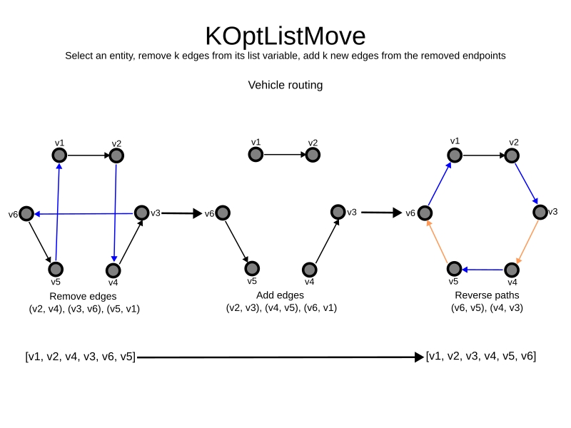

Simplest configuration:

```
<kOptListMoveSelector/>
```

Advanced configuration:

```
<kOptListMoveSelector>
    ... <!-- Normal selector properties -->
    <minimumK>2</minimumK>
    <maximumK>4</maximumK>
</kOptListMoveSelector>
```

<a id="pdf-dest-887b675f0f6d1204"></a>

<a id="section-0580"></a>
#### 42.3.6. ListRuinRecreateMoveSelector

The ListRuinRecreateMove selects a subset of values, and removes them from their list variables. Then it runs a construction heuristic to assign them again. If [unassigned values](#pdf-dest-679dffc14e52aa6e) are allowed, it may leave them unassigned.

This coarse-grained move is useful to help the solver to escape from a local optimum. It allows the solver to effectively "undo" a number of earlier decisions in one step, opening up a new part of the solution space.

If [nearby selection](#pdf-dest-047dbc59d03e12f1) is enabled, the ListRuinRecreateMove is likely to underperform as it won’t be able to rebuild the solution using nearby selection. This almost always results in worse solutions than those that were originally ruined, without a big likelihood of leading to a better solution further down the line. We recommend not using this move together with nearby selection.

This move is not enabled by default. To enable it, add the following to the localSearch section of the solver configuration:

```
<listRuinRecreateMoveSelector/>
```

The default values have been determined by extensive benchmarking. That said,

the optimal values may vary depending on the problem, available solving time,

and dataset at hand. We recommend that you [experiment with these values](#pdf-dest-e921478f36b99095) to find the best fit for your problem.

Advanced configuration:

```
<listRuinRecreateMoveSelector>
    <minimumRuinedCount>5</minimumRuinedCount>
    <maximumRuinedCount>40</maximumRuinedCount>
</listRuinRecreateMoveSelector>
```

The minimumRuinedCount and maximumRuinedCount properties limit the number of values that are unassigned. The default values are 5 and 20 respectively, but for large datasets, it may prove beneficial to increase these values.

ListRuinRecreateMove doesn’t support customizing the construction heuristic that it

runs. Neither does it support customizing any entity or value selectors. If your

problem needs more control over the construction heuristic, don’t enable this move.

Since the ListRuinRecreateMove is a coarse-grained move, it is expensive and can slow the solver down significantly. However, the default local search configuration will attempt to run it at the same frequency as the other fine-grained moves. For that reason, we recommend that you use [probabilistic selection](#pdf-dest-756e9485b0296258) to control the frequency of this move:

```
<unionMoveSelector>
    <unionMoveSelector>
        <fixedProbabilityWeight>100.0</fixedProbabilityWeight>
        <listChangeMoveSelector/>
        <listSwapMoveSelector/>
    </unionMoveSelector>
    <listRuinRecreateMoveSelector>
        <fixedProbabilityWeight>1.0</fixedProbabilityWeight>
    </listRuinRecreateMoveSelector>
</unionMoveSelector>
```

The above configuration will run the ListRuinRecreateMove once for every 100 fine-grained moves. As always, benchmarking is recommended to find the optimal value for your use case.

<a id="pdf-dest-44679f20249c49d2"></a>

<a id="section-0581"></a>
#### 42.3.7. ListMultistageMoveSelector

This feature is exclusive to [Timefold Solver Enterprise Edition](#pdf-dest-601e0ae9a75a4274).

The listMultistageMoveSelector selects a multistage move to execute from a ListVariableStageProvider.

The ListVariableStageProvider is initialized from the working solution at phase start and when selected supplies a list of ListVariableCustomStage, which each select a move and are executed in order.

Each ListVariableCustomStage has access to a ListVariableMoveEvaluator which allows the stage to evaluate moves without executing them.

Configuration:

```
<listMultistageMoveSelector>
    <stageProviderClass>...MyStageProvider</stageProviderClass>
</listMultistageMoveSelector>

public class MyStageProvider implements ListVariableStageProvider<RoutePlan, Vehicle,
Visit, HardSoftScore> {
List<Visit> visitList;
Map<String, List<Vehicle>> vehiclesBySkillMap;

@Override
public void initialize(RoutePlan routePlan) {
    this.visitList = routePlan.getVisits();
    this.vehiclesBySkillMap = new HashMap<>();

    for (var vehicle : routePlan.getVehicles()) {
        this.vehiclesBySkillMap.computeIfAbsent(vehicle.getSkill(), ignored -> new
ArrayList<>()).add(vehicle);
    }
}

@Override
public List<ListVariableCustomStage<RoutePlan, Vehicle, Visit, HardSoftScore>>
        createStages(Random random) {
    var visit = visitList.get(random.nextInt(visitList.size()));
    var vehiclesWithSkill = vehiclesBySkillMap.get(visit.getRequiredSkill());
    return List.of(
            ListVariableCustomStage.bestFit(visit, vehiclesWithSkill));
}
}
```

By default, the solver uses the moves [Change](#pdf-dest-cce5e39a1033f45b), Swap, and K-OPT. ([source](#pdf-dest-7e431780c284124a)) ([source](#pdf-dest-67c1b172f980baa7))

<a id="pdf-dest-89149724ed9a12a6"></a>

<a id="section-0582"></a>
### 42.4. Custom moves

Instead of using the generic Moves (such as ChangeMove) you can also implement your own Move. Generic and custom MoveSelectors can be [combined](#pdf-dest-fd07218130937acb) as desired.

A custom Move can be tailored to work to the advantage of your constraints. For example, in examination scheduling, changing the period of an exam A would also change the period of all the other exams that need to coincide with exam A.

A custom Move is far more work to implement and much harder to avoid bugs than a generic Move. After implementing a custom Move, turn on environmentMode TRACED_FULL_ASSERT to check for score corruptions.

For information on the Move interface, check out the [Move Anatomy](#pdf-dest-922fb51839c6742b) section of the Neighborhoods chapter. Even though Neighborhoods is an entirely different mechanism than move selectors, they share the Move interface and therefore the same custom Move can be used in both mechanisms.

<a id="pdf-dest-e7c671d6578c05fa"></a>

<a id="section-0583"></a>
#### 42.4.1. Generating custom moves

Now, let’s generate instances of this custom Move class. There are 2 ways:

<a id="pdf-dest-ee75d522c087f90e"></a>

42.4.1.1. MoveListFactory: the easy way to generate custom moves

The easiest way to generate custom moves is by implementing the interface MoveListFactory:

```
public interface MoveListFactory<Solution_> {

    List<Move> createMoveList(Solution_ solution);
}
```

Simple configuration (which can be nested in a unionMoveSelector just like any other MoveSelector):

```
<moveListFactory>
    <moveListFactoryClass>...MyMoveFactory</moveListFactoryClass>
</moveListFactory>
```

Advanced configuration:

```
<moveListFactory>
    ... <!-- Normal moveSelector properties -->
    <moveListFactoryClass>...MyMoveFactory</moveListFactoryClass>
    <moveListFactoryCustomProperties>
    ...<!-- Custom properties -->
    </moveListFactoryCustomProperties>
</moveListFactory>
```

Because the MoveListFactory generates all moves at once in a List<Move>, it does not support cacheType JUST_IN_TIME. Therefore, moveListFactory uses cacheType STEP by default and it scales badly.

To configure values of a MoveListFactory dynamically in the solver configuration (so the [Benchmarker](#pdf-dest-e921478f36b99095) can tweak those parameters), add the moveListFactoryCustomProperties element and use [custom properties](#pdf-dest-b13106eb78a3ed8c).

A custom MoveListFactory implementation must ensure that it does not move

[pinned entities](#pdf-dest-34e2763eb1a760ec).

<a id="pdf-dest-f7690f16ea74a2f4"></a>

42.4.1.2. MoveIteratorFactory: generate Custom moves just in time

Use this advanced form to generate custom moves Just In Time by implementing the MoveIteratorFactory interface:

```
public interface MoveIteratorFactory<Solution_> {

    long getSize(ScoreDirector<Solution_> scoreDirector);

    Iterator<Move> createOriginalMoveIterator(ScoreDirector<Solution_> scoreDirector);

    Iterator<Move> createRandomMoveIterator(ScoreDirector<Solution_> scoreDirector,
Random workingRandom);

}
```

The getSize() method must return an estimation of the size. It doesn’t need to be correct, but it’s better too big than too small. The createOriginalMoveIterator method is called if the selectionOrder is ORIGINAL or if it is cached. The createRandomMoveIterator method is called for selectionOrder RANDOM combined with cacheType JUST_IN_TIME.

Don’t create a collection (array, list, set or map) of Moves when creating the Iterator<Move>: the whole purpose of MoveIteratorFactory over MoveListFactory is to create a Move just in time in a custom Iterator.next().

For example:

```
public class PossibleAssignmentsOnlyMoveIteratorFactory implements
MoveIteratorFactory<MyPlanningSolution, MyChangeMove> {
    @Override
    public long getSize(ScoreDirector<MyPlanningSolution> scoreDirector) {
        // In this case, we return the exact size, but an estimate can be used
        // if it too expensive to calculate or unknown
        long totalSize = 0L;
        var solution = scoreDirector.getWorkingSolution();
        for (MyEntity entity : solution.getEntities()) {
            for (MyPlanningValue value : solution.getValues()) {
                if (entity.canBeAssigned(value)) {
                    totalSize++;
                }
            }
        }
        return totalSize;
    }

    @Override
    public Iterator<MyChangeMove> createOriginalMoveIterator(ScoreDirector
<MyPlanningSolution> scoreDirector) {
        // Only needed if selectionOrder is ORIGINAL or if it is cached
        var solution = scoreDirector.getWorkingSolution();
        var entities = solution.getEntities();
        var values = solution.getValues();
        // Assumes each entity has at least one assignable value
        var firstEntityIndex = 0;
        var firstValueIndex = 0;
        while (!entities.get(firstEntityIndex).canBeAssigned(values.get
(firstValueIndex))) {
            firstValueIndex++;
        }

        return new Iterator<>() {
            int nextEntityIndex = firstEntityIndex;
            int nextValueIndex = firstValueIndex;

            @Override
            public boolean hasNext() {
                return nextEntityIndex < entities.size();
            }

            @Override
            public MyChangeMove next() {
                var selectedEntity = entities.get(nextEntityIndex);
                var selectedValue = values.get(nextValueIndex);
                nextValueIndex++;
                while (nextValueIndex < values.size() && !selectedEntity.
canBeAssigned(values.get(nextValueIndex))) {
                    nextValueIndex++;
                }
                if (nextValueIndex >= values.size()) {
                    // value list exhausted, go to next entity
                    nextEntityIndex++;
                    if (nextEntityIndex < entities.size()) {
                        nextValueIndex = 0;
                        while (nextValueIndex < values.size() && !entities.get
(nextEntityIndex).canBeAssigned(values.get(nextValueIndex))) {
                            // Assumes each entity has at least one assignable value
                            nextValueIndex++;
                        }
                    }
                }
                return new MyChangeMove(selectedEntity, selectedValue);
            }
        };
    }

    @Override
    public Iterator<MyChangeMove> createRandomMoveIterator(ScoreDirector
<MyPlanningSolution> scoreDirector,
            Random workingRandom) {
        // Not needed if selectionOrder is ORIGINAL or if it is cached
        var solution = scoreDirector.getWorkingSolution();
        var entities = solution.getEntities();
        var values = solution.getValues();

        return new Iterator<>() {
            @Override
            public boolean hasNext() {
                return !entities.isEmpty();
            }

            @Override
            public MyChangeMove next() {
                var selectedEntity = entities.get(workingRandom.nextInt(entities.size
()));
                var selectedValue = values.get(workingRandom.nextInt(values.size()));
                while (!selectedEntity.canBeAssigned(selectedValue)) {
                    // This assumes there at least one value that can be assigned to
the selected entity
                    selectedValue = values.get(workingRandom.nextInt(values.size()));
                }
                return new MyChangeMove(selectedEntity, selectedValue);
            }
        };
    }
}
```

The same effect can also be accomplished using [filtered selection](#pdf-dest-c52cb4a39082ea49).

Simple configuration (which can be nested in a unionMoveSelector just like any other MoveSelector):

```
<moveIteratorFactory>
    <moveIteratorFactoryClass>...</moveIteratorFactoryClass>
</moveIteratorFactory>
```

Advanced configuration:

```
<moveIteratorFactory>
    ... <!-- Normal moveSelector properties -->
    <moveIteratorFactoryClass>...</moveIteratorFactoryClass>
    <moveIteratorFactoryCustomProperties>
    ...<!-- Custom properties -->
    </moveIteratorFactoryCustomProperties>
</moveIteratorFactory>
```

To configure values of a MoveIteratorFactory dynamically in the solver configuration (so the [Benchmarker](#pdf-dest-e921478f36b99095) can tweak those parameters), add the moveIteratorFactoryCustomProperties element and use [custom properties](#pdf-dest-b13106eb78a3ed8c).

A custom MoveIteratorFactory implementation must ensure that it does not move

[pinned entities](#pdf-dest-34e2763eb1a760ec).

<a id="pdf-dest-554d8ab25d16c02f"></a>

<a id="section-0584"></a>
# Responding to change

<a id="pdf-dest-bbc62cd189098fca"></a>

<a id="section-0585"></a>
## Chapter 43. Continuous planning

Continuous planning is the technique of planning one or more upcoming planning periods at the same time and repeating that process monthly, weekly, daily, hourly, or even more frequently. However, as time is infinite, planning all future time periods is impossible.

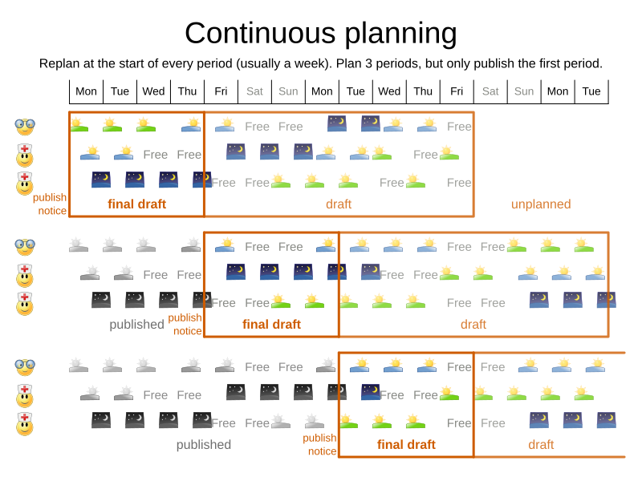

In the employee rostering example above, we re-plan every four days. Each time, we actually plan a window of 12 days, but we only publish the first four days, which is stable enough to share with the employees, so they can plan their social life accordingly.

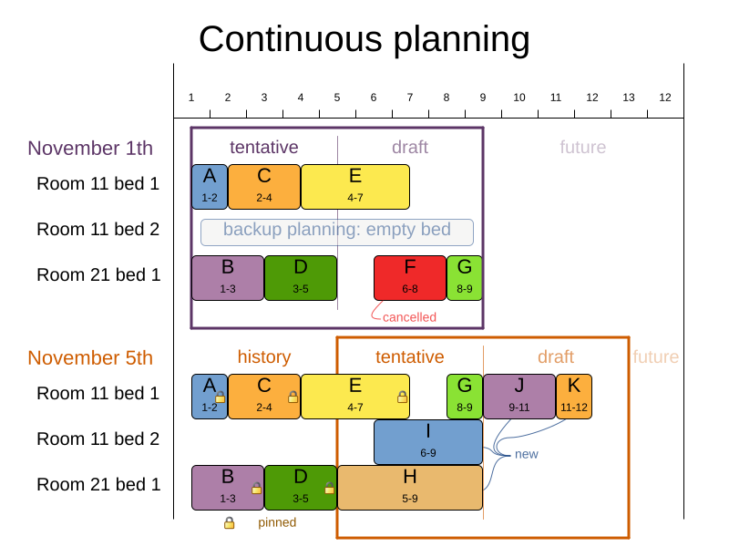

In the bed allocation example above, notice the difference between the original planning of November 1st and the re-planning on November 5th: some problem facts (F, H, I, J, K) changed in the meantime, which causes unrelated entities (G) to shift as well.

<a id="pdf-dest-9dc83ef43fa545db"></a>

<a id="section-0586"></a>
### 43.1. The planning window

The planning window is divided into stages:

- History

Immutable past time periods containing only [pinned entities](#pdf-dest-34e2763eb1a760ec).

  - Recent historic entities can still affect score constraints on movable entities. For example, in employee rostering, an employee who worked the last three historic weekends in a row should not be assigned three more consecutive weekends, because they require at least one free weekend per month.
  - Do not load all historic entities into memory: even though pinned entities do not affect solving performance, they can cause out-of-memory problems as data grows over years. Only load those that might still affect current constraints, with a reasonable safety margin.
- Published

Upcoming time periods that have been shared with the business. They contain only [pinned](#pdf-dest-34e2763eb1a760ec) and/or [semi-movable](#pdf-dest-af2e178b5c20f2d0) planning entities.

  - Normal planning will not change the published schedule.

If exceptions force a change anyway (for example, someone calls in sick), minimize disruption using [non-disruptive replanning](#pdf-dest-af2e178b5c20f2d0).

- Draft

Upcoming time periods after the published window that can change freely. They contain movable planning entities, except for any that are [pinned by a user](#pdf-dest-34e2763eb1a760ec).

  - The first part of the draft, called the final draft, will be published in the next run, so these entities change one last time. The publishing frequency (for example, once per week) determines how many time periods move from draft to published each run.
  - The latter part of the draft is likely to change again in future runs, especially as problem facts change.

Even so, these later entities must be planned now to avoid painting yourself into a corner. For example, scheduling all rare-skilled employees at the end of the upcoming published week may look fine for that week, but make it impossible to build a feasible schedule the week after. The draft window must therefore extend well beyond the portion that will be published first.

  - The latter draft is not usually shared with the business because it is too volatile. It is stored in the database and used as the starting point for the next solver run.
- Unplanned (out of scope)

Planning entities outside the current planning window.

  - If the window is too small to cover all entities, you are dealing with [overconstrained](#pdf-dest-a1f449063d6e03a2) [planning](#pdf-dest-a1f449063d6e03a2).
  - If [time is a planning variable](#pdf-dest-52174f2699a9287f), the window size is determined dynamically, and this stage does not apply.

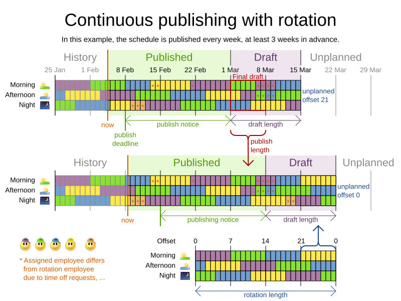

<a id="pdf-dest-a5659f6ea025e285"></a>

<a id="section-0587"></a>
## Chapter 44. Real-time planning

Real-time planning handles a planning problem where the problem facts keep changing while the solver is running. It combines [continuous planning](#pdf-dest-601e0ae9a75a4274) with short planning windows to keep the solution current as the world changes around it.

Consider the vehicle routing use case:

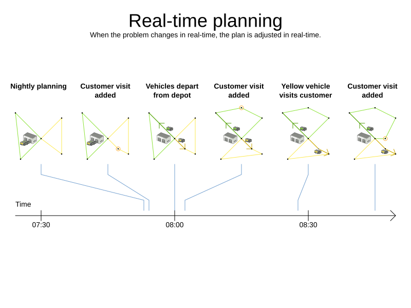

Three customers are added at different times (07:56, 08:02, and 08:45), after the original customer set finished solving at 07:55 - in some cases after vehicles have already left. Timefold Solver handles this with ProblemChange, used together with [pinned planning entities](#pdf-dest-34e2763eb1a760ec).

<a id="pdf-dest-35cafd0605efc0c5"></a>

<a id="section-0588"></a>
### 44.1. ProblemChange

While the Solver is solving, an outside event may change a problem fact or planning entity - for example, an airplane is delayed and needs the runway at a later time.

Do not change the problem fact instances used by the Solver from another thread (or even the same thread) while it is solving. Doing so will corrupt the internal state.

Instead, submit a ProblemChange to the solver, which it applies in the solver thread as soon as possible: Java

```
public interface Solver<Solution_> {

    ...

    void addProblemChange(ProblemChange<Solution_> problemChange);

    boolean isEveryProblemChangeProcessed();

    ...

}
```

You can also submit a ProblemChange via SolverManager:

Java

```
public interface SolverManager<Solution_, ProblemId_> {

    ...

    CompletableFuture<Void> addProblemChange(ProblemId_ problemId,
ProblemChange<Solution_> problemChange);

    ...

}
```

or via SolverJob:

Java

```
public interface SolverJob<Solution_, ProblemId_> {

    ...

    CompletableFuture<Void> addProblemChange(ProblemChange<Solution_>
problemChange);

    ...

}
```

The returned CompletableFuture<Void> completes when a user-defined Consumer accepts the best solution that includes this problem change.

The ProblemChange interface itself is:

Java

```
public interface ProblemChange<Solution_> {

    void doChange(Solution_ workingSolution, ProblemChangeDirector
problemChangeDirector);

}
```

The ProblemChangeDirector must be notified of every change to problem facts or

planning entities inside a ProblemChange.

<a id="pdf-dest-6317d4e5dfd1f7e4"></a>

<a id="section-0589"></a>
#### 44.1.1. Writing a ProblemChange correctly

To write a ProblemChange correctly, you need to understand the behavior of [a planning clone](#pdf-dest-565fb1d17532a1e8).

A planning clone must fulfill these requirements:

- It represents the same planning problem - usually by reusing the same problem fact instances and collections.
- It uses different, cloned instances of entities and entity collections - changes to the original solution’s entity variables must not affect the clone.

When implementing a ProblemChange, follow these rules:

1. Make every change on the @PlanningSolution instance passed to doChange().

2. The workingSolution is [a planning clone](#pdf-dest-565fb1d17532a1e8) of the BestSolutionChangedEvent’s `bestSolution.

  - The workingSolution inside the solver is never the same instance as in your application.
  - Entity collections are cloned, so changes to planning entities must happen on the workingSolution instance passed to doChange().

3. Use ProblemChangeDirector.lookUpWorkingObject() to retrieve the working solution’s version of any object. This requires [annotating a property with](#pdf-dest-8513a20fd2df1867) @PlanningId.

4. Problem facts and problem fact collections are not cloned. The workingSolution and bestSolution share the same problem fact instances.

Any problem fact or collection changed by a ProblemChange must be problem-cloned first (which may require rerouting references in other facts and entities). Otherwise a race condition can occur when the solver thread and a GUI thread access the same instance simultaneously.

5. For performance, submit multiple changes at once using addProblemChanges(List<ProblemChange>) rather than calling addProblemChange() repeatedly.

<a id="pdf-dest-a7a2687487f6ccf6"></a>

<a id="section-0590"></a>
#### 44.1.2. Cloning solutions to avoid race conditions

Many types of changes can leave a planning entity uninitialized, producing a partially initialized solution. This is acceptable as long as the first solver phase can handle it - all construction heuristic phases can, so configure one as the first phase.

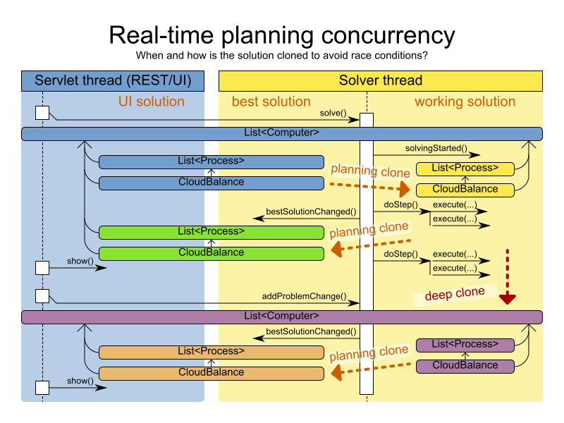

When a ProblemChange is submitted, the solver:

1. Stops.

2. Applies the ProblemChange.

3. Restarts from the adjusted best solution (warm start - much faster than a cold start).

4. Runs each solver phase again. The construction heuristic re-runs, but finishes quickly because few or no variables are uninitialized.

5. Resets each configured Termination (both solver and phase), but does not undo a prior terminateEarly() call.

Termination is usually not configured in real-time planning; instead call Solver.terminateEarly() when results are needed. Alternatively, configure a Termination and use daemon mode together with [BestSolutionChangedEvent](optimization-algorithms/optimization-algorithms.pdf#SolverEventListener) as described below.

<a id="pdf-dest-f77b12a53ece5f6b"></a>

<a id="section-0591"></a>
### 44.2. Daemon: solve() does not return

In real-time planning it is often useful for the solver thread to wait when it runs out of work, and immediately resume when new problem changes arrive. Daemon mode enables this:

- When Termination triggers, the solver does not return from solve() - it blocks the thread and frees CPU.
  - terminateEarly() is the exception: it does make the solver return, freeing system resources and allowing a graceful shutdown.
  - If the solver starts with an empty planning entity collection, it enters the blocked state immediately.
- When a ProblemChange is submitted, the solver resumes, applies the change, and continues solving.

To enable daemon mode:

1. Set <daemon>true</daemon> in the solver configuration:

```
<solver xmlns="https://timefold.ai/xsd/solver" xmlns:xsi=
"http://www.w3.org/2001/XMLSchema-instance"
    xsi:schemaLocation="https://timefold.ai/xsd/solver
https://timefold.ai/xsd/solver/solver.xsd">
    <daemon>true</daemon>
    ...
</solver>
```

Always call Solver.terminateEarly() when your application shuts down to

avoid killing the solver thread unnaturally.

2. Subscribe to [BestSolutionChangedEvent](optimization-algorithms/optimization-algorithms.pdf#SolverEventListener) to receive new best solutions from the solver thread.

A BestSolutionChangedEvent does not guarantee that every ProblemChange has been processed, or that the solution is initialized and feasible.

3. Filter out invalid solutions:

Java

```
        public void bestSolutionChanged(BestSolutionChangedEvent
    <VehicleRoutePlan> event) {
            if (event.isEveryProblemChangeProcessed()
                    // Ignore infeasible (including uninitialized) solutions
                    && event.getNewBestSolution().getScore().isFeasible()) {
                ...
            }
        }
```

4. Use isNewBestSolutionInitialized() instead of Score.isFeasible() if you want to accept infeasible solutions but still reject uninitialized ones.

<a id="pdf-dest-af2e178b5c20f2d0"></a>

<a id="section-0592"></a>
## Chapter 45. Non-disruptive replanning

Replanning an existing plan can be very disruptive. If the plan affects humans (such as employees, drivers, …), very disruptive changes are often undesirable.

There are two ways to limit disruption:

- Pinning - completely prevent specific assignments from changing. Use [@PlanningPin](#pdf-dest-34e2763eb1a760ec) to lock individual entities to their current values, or [@PlanningPinToIndex](#pdf-dest-53c0ec12bdb13443) to lock only the first portion of a planning list variable. This is appropriate when certain assignments are already confirmed or published and must not move under any circumstances.
- Non-disruptive replanning - allow changes, but make the solver justify them. The gain of changing an assignment must outweigh the disruption cost. This is usually implemented by taxing all planning entities that change, and is the approach described on this page.

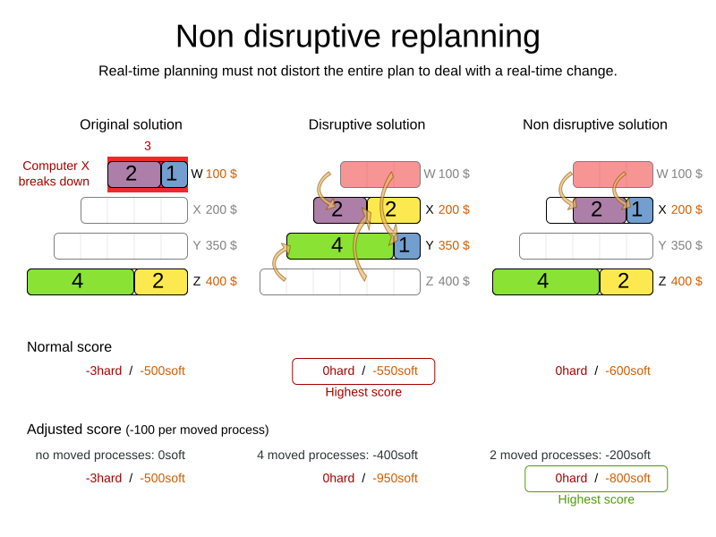

In conference scheduling, the entity has both a planning variable timeslot and its original value publishedTimeslot:

Java

```
@PlanningEntity
public class Talk {
    ...

    @PlanningVariable
    private Timeslot timeslot;

    private Timeslot publishedTimeslot;

    ...
}
```

During planning, the planning variable timeslot changes. By writing a constraint comparing it with the publishedTimeslot, a change in plan can be penalized:

Java

```
    Constraint publishedTimeslot(ConstraintFactory factory) {
        return factory.forEach(Talk.class)
                .filter(talk -> talk.getPublishedTimeslot() != null
                        && talk.getTimeslot() != talk.getPublishedTimeslot())
                .penalize(HardSoftScore.ofSoft(1000))
                .asConstraint("Published timeslot");
    }
```

By configuring a penalty weight of -1000 we can express that a solution will only be accepted if it improves the soft score for at least 1000 points per variable changed (or if it improves the hard score).

<a id="pdf-dest-566964ff09d04489"></a>

<a id="section-0593"></a>
## Chapter 46. Assignment Recommendation API

This feature is exclusive to [Timefold Solver Enterprise Edition](#pdf-dest-601e0ae9a75a4274).

With [real-time planning](#pdf-dest-601e0ae9a75a4274), we can respond to a continuous stream of external changes. However, it is often necessary to respond to ad hoc changes too, for example when a call center operator needs to arrange an appointment with a customer. In such cases, it is not necessary to use the full power of real-time planning. Instead, immediate response to the customer and a selection of available time windows are more important. This is where Assignment Recommendation API comes in.

The Assignment Recommendation API allows you to quickly respond to ad hoc changes, while providing a selection of the best available options for fitting the change in the existing schedule. It doesn’t use the full [local search algorithm](#pdf-dest-601e0ae9a75a4274). Instead, it uses a simple greedy algorithm together with [incremental calculation](#pdf-dest-061d4ebe0597a32e). This combination allows the API to find the best possible fit within the existing solution in a matter of milliseconds, even for large planning problems.

Once the customer has accepted one of the available options and the change has been reflected in the solution, the full [local search algorithm](#pdf-dest-601e0ae9a75a4274) can be used to optimize the entire solution around this change. This would be an example of [continuous planning](#pdf-dest-601e0ae9a75a4274).

<a id="pdf-dest-c4a2a6a8e0bda217"></a>

<a id="section-0594"></a>
### 46.1. Using the Assignment Recommendation API

The Assignment Recommendation API requires an entity to be evaluated for assignment:

```
EmployeeSchedule employeeSchedule = ...; // Our planning solution.
Shift unassignedShift = new Shift(...); // A new shift needs to be assigned.
employeeSchedule.getShifts().add(unassignedShift);
```

If the entity is unassigned, then it must be the only unassigned entity in the planning solution. The SolutionManager is then used to retrieve the recommended assignments for this entity:

```
SolutionManager<EmployeeSchedule, HardSoftScore> solutionManager = ...;
List<RecommendedAssignment<Employee, HardSoftScore>> recommendations =
    solutionManager.recommendAssignment(employeeSchedule, unassignedShift, Shift:
:getEmployee);
```

Breaking this down, we have:

- employeeSchedule, the planning solution.
- unassignedShift, the uninitialized entity, which is part of the planning solution.
- Shift::getEmployee, a function extracting the planning variable from the entity, also called a "proposition function".
- List<RecommendedAssignment<Employee, HardSoftScore>>, the list of recommended employees to

assign to the shift, in the order of decreasing preference. Each recommendation contains the employee and the difference in score caused by assigning the employee to the shift. This difference has the full explanatory power of [score analysis](#pdf-dest-6621208fa1cfdedb).

This list of recommendations can be used to present the operator with a selection of available options, as it is fully serializable to JSON and can be sent to a web browser or mobile app. The operator can then select the best available recommendation and assign the employee to the shift, represented here by the necessary backend code:

```
RecommendedAssignment<Employee, HardSoftScore> bestRecommendation = recommendations
.get(0);
Employee bestEmployee = bestRecommendation.proposition();
unassignedShift.setEmployee(bestEmployee);
```

If required, [continuous planning](#pdf-dest-601e0ae9a75a4274) can be used to optimize the entire solution afterwards.

Assignment Recommendation API requires the SolutionManager to be configured with a [construction heuristic](#pdf-dest-601e0ae9a75a4274) as the first phase, as it uses that construction heuristic to find the best fit. If there are multiple construction heuristics phases in the [solver configuration](#pdf-dest-e01266c80449072f), or if the first phase is not a construction heuristic (perhaps a [custom initializer](optimization-algorithms/optimization-algorithms.pdf#customSolverPhase)), the API will fail fast.

<a id="pdf-dest-aa3276c901489e51"></a>

<a id="section-0595"></a>
### 46.2. Using mutable types in the proposition function

In the previous example, we used a simple proposition function that extracts the planning variable from the entity. However, it is also possible to use a more complex proposition function that extracts the entire planning entity, or any values that will mutate as the solver tries to find the best fit. In that case, there are some caveats to consider.

The solver will try to find the best fit for the uninitialized entity, and it will start from the solution it received on input. Before trying the next value to assign, it will first return to that original solution. The consequence of this is that if our proposition function returns any values that change during this process, those changes will also affect the previously processed propositions. In other words, if we decide to return the entire entity from the proposition function, we will find that each of the final recommendations is the same. And because the solver will return to the original solution after trying the last value, the final recommendation will be unassigned, defeating the purpose of the API. Consider the following example:

```
SolutionManager<EmployeeSchedule, HardSoftScore> solutionManager = ...;
List<RecommendedAssignment<Shift, HardSoftScore>> recommendations =
    solutionManager.recommendAssignment(employeeSchedule, unassignedShift, shift ->
shift);
```

The proposition function (shift → shift) returns the entire Shift entity. Because of the behavior described above, every RecommendedAssignment in the recommendations list will point to the same unassignedShift, and its employee variable will be null. This is not what we want, because none of the RecommendedAssignment instances give us the Employee we need to assign to the shift.

To avoid this, the proposition function should preferably return a value that does not change during the process, such as the planning variable instead of the entire entity. If it’s necessary to return a value that could be mutated by the solver, we should make a defensive copy.

<a id="pdf-dest-b405bfad93fa2b69"></a>

<a id="section-0596"></a>
# Example use cases

<a id="pdf-dest-d00ac25ae816ac20"></a>

<a id="section-0597"></a>
## Chapter 47. Vehicle Routing Quick Start Guide

This guide walks you through the process of creating a Vehicle Routing application with [Quarkus](https://quarkus.io/) and [Timefold](https://timefold.ai)'s constraint solving Artificial Intelligence (AI).

[Check out our off-the-shelf model for Field Service Routing](https://docs.timefold.ai/field-service-routing/latest/introduction) (REST API)

<a id="pdf-dest-dd98f43837355a1b"></a>

<a id="section-0598"></a>
### 47.1. What you will build

You will build a REST application that optimizes a [Vehicle Routing Problem](https://timefold.ai/vehicle-routing-problem) (VRP):

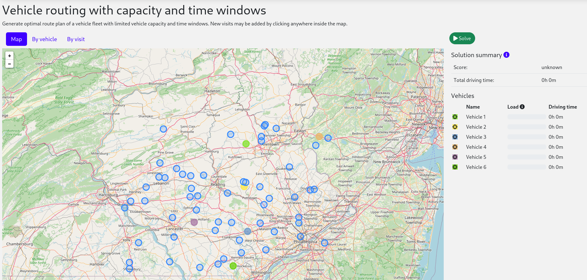

Your service will assign Visit instances to Vehicle instances automatically by using AI to adhere to hard and soft scheduling constraints, such as the following examples:

- The demand for a vehicle cannot exceed its capacity.
- The deliveries have specific deadlines that must be met.
- The less total travel time, the better.

Mathematically speaking, VRP is an NP-hard problem. This means it is difficult to scale. Simply brute force iterating through all possible combinations takes millions of years for a non-trivial dataset, even on a supercomputer. Luckily, AI constraint solvers such as Timefold Solver have advanced algorithms that deliver a near-optimal solution in a reasonable amount of time.

<a id="pdf-dest-2c43daf485b0bb99"></a>

<a id="section-0599"></a>
### 47.2. Solution source code

Follow the instructions in the next sections to create the application step by step (recommended).

Alternatively, you can also skip right to the completed example: 1. Clone the Git repository:

```
$ git clone https://github.com/TimefoldAI/timefold-quickstarts
```

or download an [archive](https://github.com/TimefoldAI/timefold-quickstarts/archive/refs/heads/stable.tar.gz).

2. Find [the](https://github.com/TimefoldAI/timefold-quickstarts/tree/stable/getting-started/vehicle-routing) solution in the java directory and run it (see its README file).

<a id="pdf-dest-dfcfde7a1dd53269"></a>

<a id="section-0600"></a>
### 47.3. Prerequisites

To complete this guide, you need:

- [JDK](https://adoptopenjdk.net/) 21+ with JAVA_HOME configured appropriately. For example with Sdkman: ([source](https://sdkman.io))
```
$ curl -s "https://get.sdkman.io" | bash
$ sdk install java
```

- [Apache Maven](https://maven.apache.org/download.html) 3.9.11+ or Gradle 7+ ([source](https://gradle.org/install/))
- An IDE, such as [IntelliJ IDEA](https://www.jetbrains.com/idea), VSCode or Eclipse

<a id="pdf-dest-370721b7922b08ae"></a>

<a id="section-0601"></a>
### 47.4. The build file and the dependencies

Use [code.quarkus.io](https://code.quarkus.io/?a=timefold-solver-quickstart&j=21&e=rest&e=rest-jackson&e=ai.timefold.solver%3Atimefold-solver-quarkus-jackson&e=ai.timefold.solver%3Atimefold-solver-quarkus) to generate an application with the following extensions, for Maven or Gradle:

Clicking the link above will automatically select the dependencies for you on

code.quarkus.io.

- Quarkus REST JAX-RS (quarkus-rest)
- Quarkus REST Jackson (quarkus-rest-jackson)
- Timefold Solver (timefold-solver-quarkus)
- Timefold Solver Jackson (timefold-solver-quarkus-jackson)

Your pom.xml file has the following content:

Java

```
<?xml version="1.0" encoding="UTF-8"?>
<project xmlns="http://maven.apache.org/POM/4.0.0" xmlns:xsi=
"http://www.w3.org/2001/XMLSchema-instance"
        xsi:schemaLocation="http://maven.apache.org/POM/4.0.0
https://maven.apache.org/xsd/maven-4.0.0.xsd">
    <modelVersion>4.0.0</modelVersion>

    <groupId>org.acme</groupId>
    <artifactId>vehicle-routing</artifactId>
    <version>1.0-SNAPSHOT</version>

    <properties>
    <maven.compiler.release>11</maven.compiler.release>
    <project.build.sourceEncoding>UTF-8</project.build.sourceEncoding>

    <version.io.quarkus>3.39.5</version.io.quarkus>
    <version.ai.timefold.solver>2.7.0</version.ai.timefold.solver>
    </properties>

    <dependencyManagement>
    <dependencies>
        <dependency>
        <groupId>io.quarkus</groupId>
        <!-- Alternatively, use <artifactId>quarkus-universe-bom</artifactId>
        which includes both quarkus-bom and timefold-solver-bom. -->
        <artifactId>quarkus-bom</artifactId>
        <version>${version.io.quarkus}</version>
        <type>pom</type>
        <scope>import</scope>
        </dependency>
        <dependency>
        <groupId>ai.timefold.solver</groupId>
        <artifactId>timefold-solver-bom</artifactId>
        <version>${version.ai.timefold.solver}</version>
        <type>pom</type>
        <scope>import</scope>
        </dependency>
    </dependencies>
    </dependencyManagement>
    <dependencies>
    <dependency>
        <groupId>io.quarkus</groupId>
        <artifactId>quarkus-rest</artifactId>
    </dependency>
    <dependency>
        <groupId>io.quarkus</groupId>
        <artifactId>quarkus-rest-jackson</artifactId>
    </dependency>
    <dependency>
        <groupId>ai.timefold.solver</groupId>
        <artifactId>timefold-solver-quarkus</artifactId>
    </dependency>
    <dependency>
        <groupId>ai.timefold.solver</groupId>
        <artifactId>timefold-solver-quarkus-jackson</artifactId>
    </dependency>
    </dependencies>

    <build>
    <plugins>
        <plugin>
        <artifactId>maven-compiler-plugin</artifactId>
        <version>${version.compiler.plugin}</version>
        </plugin>
        <plugin>
        <groupId>io.quarkus</groupId>
        <artifactId>quarkus-maven-plugin</artifactId>
        <version>${version.io.quarkus}</version>
        <extensions>true</extensions>
        <executions>
            <execution>
            <goals>
                <goal>build</goal>
            </goals>
            </execution>
        </executions>
        </plugin>
        <plugin>
        <artifactId>maven-surefire-plugin</artifactId>
        <configuration>
            <systemPropertyVariables>
            <java.util.logging.manager>
org.jboss.logmanager.LogManager</java.util.logging.manager>
            </systemPropertyVariables>
        </configuration>
        </plugin>
    </plugins>
    </build>
</project>
```

<a id="pdf-dest-1145288c46e99342"></a>

<a id="section-0602"></a>
### 47.5. Model the domain objects

Your goal is to assign each visit to a vehicle. You will create these classes:

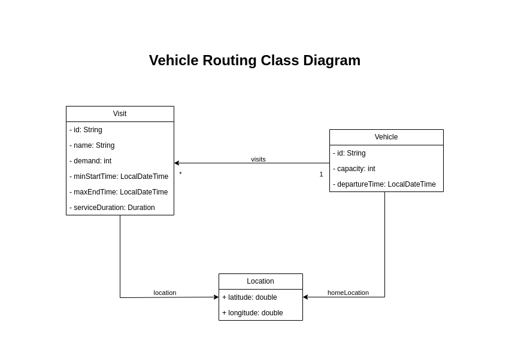

<a id="pdf-dest-dd50a1cf5ca13de3"></a>

<a id="section-0603"></a>
#### 47.5.1. Location

The Location class is used to represent the destination for deliveries or the home location for vehicles. The drivingTimeSeconds map contains the time required to drive from this location to any other location. This field will be initialized later.

Java Create the src/main/java/org/acme/vehiclerouting/domain/Location.java class:

```
package org.acme.vehiclerouting.domain;

import java.util.Map;

public class Location {

    private double latitude;
    private double longitude;

    private Map<Location, Long> drivingTimeSeconds;

    public Location(double latitude, double longitude) {
        this.latitude = latitude;
        this.longitude = longitude;
    }
    public double getLatitude() {
        return latitude;
    }

    public double getLongitude() {
        return longitude;
    }

    public Map<Location, Long> getDrivingTimeSeconds() {
        return drivingTimeSeconds;
    }

    public void setDrivingTimeSeconds(Map<Location, Long> drivingTimeSeconds) {
        this.drivingTimeSeconds = drivingTimeSeconds;
    }

    public long getDrivingTimeTo(Location location) {
        return drivingTimeSeconds.get(location);
    }
}
```

<a id="pdf-dest-982431bf1f7493be"></a>

<a id="section-0604"></a>
#### 47.5.2. Vehicle

Vehicle has a defined route plan with scheduled visits to make. Each vehicle has a specific departure time and starting location. It returns to its home location after completing the route and has a maximum capacity that must not be exceeded.

During solving, Timefold Solver updates the visits field of the Vehicle class to assign a list of visits. Because Timefold Solver changes this field, Vehicle is a [planning entity](https://timefold.ai/docs/timefold-solver/latest/using-timefold-solver/modeling-planning-problems#planningEntity):


Based on the diagram, the visits field is a genuine variable that changes during the solving process. To ensure that Timefold Solver recognizes it as a [sequence of connected variables](https://timefold.ai/docs/timefold-solver/latest/using-timefold-solver/modeling-planning-problems#planningListVariable), the field must have an @PlanningListVariable annotation indicating that the solver can distribute a subset of the available visits to it. The objective is to create an ordered scheduled visit plan for each vehicle.

Java Create the src/main/java/org/acme/vehiclerouting/domain/Vehicle.java class:

```
package org.acme.vehiclerouting.domain;

import java.time.LocalDateTime;
import java.util.ArrayList;
import java.util.List;

import ai.timefold.solver.core.api.domain.entity.PlanningEntity;
import ai.timefold.solver.core.api.domain.common.PlanningId;
import ai.timefold.solver.core.api.domain.variable.PlanningListVariable;

@PlanningEntity
public class Vehicle {

    @PlanningId
    private String id;
    private int capacity;
    private Location homeLocation;

    private LocalDateTime departureTime;

    @PlanningListVariable
    private List<Visit> visits;

    public Vehicle() {
    }

    public Vehicle(String id, int capacity, Location homeLocation,
LocalDateTime departureTime) {
        this.id = id;
        this.capacity = capacity;
        this.homeLocation = homeLocation;
        this.departureTime = departureTime;
        this.visits = new ArrayList<>();
    }

    // Getters and Setters excluded

    public int getTotalDemand() {
        int totalDemand = 0;
        for (Visit visit : visits) {
            totalDemand += visit.getDemand();
        }
        return totalDemand;
    }

    public long getTotalDrivingTimeSeconds() {
        if (visits.isEmpty()) {
            return 0;
        }

        long totalDrivingTime = 0;
        Location previousLocation = homeLocation;

        for (Visit visit : visits) {
            totalDrivingTime += previousLocation.getDrivingTimeTo(visit
.getLocation());
            previousLocation = visit.getLocation();
        }
        totalDrivingTime += previousLocation.getDrivingTimeTo(homeLocation);

        return totalDrivingTime;
    }

    @Override
    public String toString() {
        return id;
    }
}
```

The Vehicle class has an @PlanningEntity annotation, so Timefold Solver knows that this class changes during solving because it contains one or more planning variables.

Notice the toString() method keeps the output short, so it is easier to read Timefold Solver’s DEBUG or TRACE log, as shown later.

Determining the @PlanningListVariable fields for an arbitrary constraint solving use case is often challenging the first time. Read [the domain modeling guidelines](#pdf-dest-7fe374d78081ce90) to avoid common pitfalls.

<a id="pdf-dest-efb11f580e3c10c7"></a>

<a id="section-0605"></a>
#### 47.5.3. Visit

The Visit class represents a delivery that needs to be made by vehicles. A visit includes a destination location, a delivery time window represented by [minStartTime, maxEndTime], a demand that needs to be fulfilled by the vehicle, and a service duration time.

The Visit class has an @PlanningEntity annotation but no genuine variables and is called a [shadow](https://timefold.ai/docs/timefold-solver/latest/using-timefold-solver/modeling-planning-problems#shadowVariable) [entity](https://timefold.ai/docs/timefold-solver/latest/using-timefold-solver/modeling-planning-problems#shadowVariable).

Java Create or adjust the src/main/java/org/acme/vehiclerouting/domain/Visit.java class:

```
package org.acme.vehiclerouting.domain;

import java.time.Duration;
import java.time.LocalDateTime;

import ai.timefold.solver.core.api.domain.entity.PlanningEntity;
import ai.timefold.solver.core.api.domain.common.PlanningId;
import
ai.timefold.solver.core.api.domain.variable.InverseRelationShadowVariable;
import ai.timefold.solver.core.api.domain.variable.NextElementShadowVariable;
import
ai.timefold.solver.core.api.domain.variable.PreviousElementShadowVariable;
import ai.timefold.solver.core.api.domain.variable.ShadowVariable;

import org.acme.vehiclerouting.solver.ArrivalTimeUpdatingVariableListener;

@PlanningEntity
public class Visit {

    @PlanningId
    private String id;
    private String name;
    private Location location;
    private int demand;
    private LocalDateTime minStartTime;
    private LocalDateTime maxEndTime;
    private Duration serviceDuration;

    @InverseRelationShadowVariable(sourceVariableName = "visits")
    private Vehicle vehicle;

    @PreviousElementShadowVariable(sourceVariableName = "visits")
    private Visit previousVisit;

    @CascadingUpdateShadowVariable(targetMethodName = "updateArrivalTime")
    private LocalDateTime arrivalTime;

    public Visit() {
    }

    public Visit(String id, String name, Location location, int demand,
                LocalDateTime minStartTime, LocalDateTime maxEndTime, Duration
serviceDuration) {
        this.id = id;
        this.name = name;
        this.location = location;
        this.demand = demand;
        this.minStartTime = minStartTime;
        this.maxEndTime = maxEndTime;
        this.serviceDuration = serviceDuration;
    }

    // Getters and Setters excluded

    private void updateArrivalTime() {
        if (previousVisit == null && vehicle == null) {
            arrivalTime = null;
            return;
        }
        LocalDateTime departureTime = previousVisit == null ? vehicle
.getDepartureTime() : previousVisit.getDepartureTime();
        arrivalTime = departureTime != null ? departureTime.plusSeconds
(getDrivingTimeSecondsFromPreviousStandstill()) : null;
    }

    public LocalDateTime getDepartureTime() {
        if (arrivalTime == null) {
            return null;
        }
        return getStartServiceTime().plus(serviceDuration);
    }

    public LocalDateTime getStartServiceTime() {
        if (arrivalTime == null) {
            return null;
        }
        return arrivalTime.isBefore(minStartTime) ? minStartTime : arrivalTime;
    }

    public boolean isServiceFinishedAfterMaxEndTime() {
        return arrivalTime != null
                && arrivalTime.plus(serviceDuration).isAfter(maxEndTime);
    }

    public long getServiceFinishedDelayInMinutes() {
        if (arrivalTime == null) {
            return 0;
        }
        return Duration.between(maxEndTime, arrivalTime.plus(serviceDuration))
.toMinutes();
    }

    public long getDrivingTimeSecondsFromPreviousStandstill() {
        if (vehicle == null) {
            throw new IllegalStateException(
                    "This method must not be called when the shadow variables
are not initialized yet.");
        }
        if (previousVisit == null) {
            return vehicle.getHomeLocation().getDrivingTimeTo(location);
        }
        return previousVisit.getLocation().getDrivingTimeTo(location);
    }

    @Override
    public String toString() {
        return id;
    }
}
```

Some methods are annotated with @InverseRelationShadowVariable, @PreviousElementShadowVariable and @CascadingUpdateShadowVariable. They are called [shadow variables](https://timefold.ai/docs/timefold-solver/latest/using-timefold-solver/modeling-planning-problems#shadowVariable), and because Timefold Solver changes them, Visit is a [planning entity](https://timefold.ai/docs/timefold-solver/latest/using-timefold-solver/modeling-planning-problems#planningEntity):

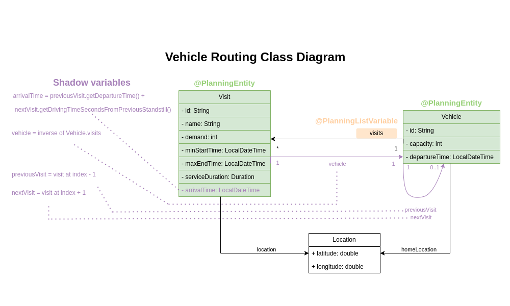

The field vehicle has an @InverseRelationShadowVariable annotation, creating a bi-directional relationship with the Vehicle. The function returns a reference to the Vehicle where the visit is scheduled. Let’s say the visit Ann was scheduled to the vehicle V1 during the solving process. The method returns a reference of V1.

The field previousVisit is annotated with @PreviousElementShadowVariable. The solver will update this field with a reference of the visit preceding the current visit instance. Assuming that vehicle V1 is assigned the visits of Ann, Beth, and Carl, the previousVisit field will be filled with Ann for the visit of Beth.

@NextElementShadowVariable also exists, which can be used to get a reference to the

successor element.

The arrivalTime field has a @CascadingUpdateShadowVariable annotation. This annotation indicates which method should be triggered to update this field whenever this entity is moved, in this case the updateArrivalTime() method. This change is automatically propagated to the subsequent visits and stops when the arrivalTime value hasn’t changed or when it’s reached the end of the chain of visit objects.

<a id="pdf-dest-23e53afd6a86c5ee"></a>

<a id="section-0606"></a>
### 47.6. Define the constraints and calculate the score

A score represents the quality of a specific solution. The higher the better. Timefold Solver looks for the best solution, which is the solution with the highest score found in the available time. It might be the optimal solution.

Because this use case has hard and soft constraints, use the HardSoftScore class to represent the score:

- Hard constraints must not be broken. For example: The vehicle capacity must not be exceeded.
- Soft constraints should not be broken. For example: The sum total of travel time.

Hard constraints are weighted against other hard constraints. Soft constraints are weighted too, against other soft constraints. Hard constraints always outweigh soft constraints, regardless of their respective weights.

To calculate the score, create a VehicleRoutingConstraintProvider class to perform incremental score calculation. It uses Timefold Solver’s [Constraint Streams API](#pdf-dest-601e0ae9a75a4274) which is inspired by Java Streams and SQL:

Java Create a src/main/java/org/acme/vehiclerouting/solver/VehicleRoutingConstraintProvider.java class:

```
package org.acme.vehiclerouting.solver;

import ai.timefold.solver.core.api.score.HardSoftScore;
import ai.timefold.solver.core.api.score.stream.Constraint;
import ai.timefold.solver.core.api.score.stream.ConstraintFactory;
import ai.timefold.solver.core.api.score.stream.ConstraintProvider;

import org.acme.vehiclerouting.domain.Visit;
import org.acme.vehiclerouting.domain.Vehicle;

public class VehicleRoutingConstraintProvider implements ConstraintProvider {

    public static final String VEHICLE_CAPACITY = "vehicleCapacity";
    public static final String SERVICE_FINISHED_AFTER_MAX_END_TIME =
"serviceFinishedAfterMaxEndTime";
    public static final String MINIMIZE_TRAVEL_TIME = "minimizeTravelTime";

    @Override
    public Constraint[] defineConstraints(ConstraintFactory factory) {
        return new Constraint[] {
                vehicleCapacity(factory),
                serviceFinishedAfterMaxEndTime(factory),
                minimizeTravelTime(factory)
        };
    }

    protected Constraint vehicleCapacity(ConstraintFactory factory) {
        return factory.forEach(Vehicle.class)
                .filter(vehicle -> vehicle.getTotalDemand() > vehicle
.getCapacity())
                .penalizeLong(HardSoftScore.ONE_HARD,
                        vehicle -> vehicle.getTotalDemand() - vehicle
.getCapacity())
                .asConstraint(VEHICLE_CAPACITY);
    }

    protected Constraint serviceFinishedAfterMaxEndTime(ConstraintFactory
factory) {
        return factory.forEach(Visit.class)
                .filter(Visit::isServiceFinishedAfterMaxEndTime)
                .penalizeLong(HardSoftScore.ONE_HARD,
                        Visit::getServiceFinishedDelayInMinutes)
                .asConstraint(SERVICE_FINISHED_AFTER_MAX_END_TIME);
    }

    protected Constraint minimizeTravelTime(ConstraintFactory factory) {
        return factory.forEach(Vehicle.class)
                .penalizeLong(HardSoftScore.ONE_SOFT,
                        Vehicle::getTotalDrivingTimeSeconds)
                .asConstraint(MINIMIZE_TRAVEL_TIME);
    }
}
```

<a id="pdf-dest-e7772b7379a973df"></a>

<a id="section-0607"></a>
### 47.7. Gather the domain objects in a planning solution

A VehicleRoutePlan wraps all Vehicle and Visit instances of a single dataset. Furthermore, because it contains all vehicles and visits, each with a specific [planning](https://timefold.ai/docs/timefold-solver/latest/using-timefold-solver/modeling-planning-problems#planningProblemAndPlanningSolution) variable state, it is a planning [solution](https://timefold.ai/docs/timefold-solver/latest/using-timefold-solver/modeling-planning-problems#planningProblemAndPlanningSolution) and it has a score:

- If visits are still unassigned, then it is an uninitialized solution.
- If it breaks hard constraints, then it is an infeasible solution, for example, a solution with the score -2hard/-3soft.
- If it adheres to all hard constraints, then it is a feasible solution, for example, a solution with the score 0hard/-7soft.

Java Create the src/main/java/org/acme/vehiclerouting/domain/VehicleRoutePlan.java class:

```
package org.acme.vehiclerouting.domain;

import java.util.List;
import java.util.stream.Stream;

import
ai.timefold.solver.core.api.domain.solution.PlanningEntityCollectionProperty;
import ai.timefold.solver.core.api.domain.solution.PlanningScore;
import ai.timefold.solver.core.api.domain.solution.PlanningSolution;
import ai.timefold.solver.core.api.domain.valuerange.ValueRangeProvider;
import ai.timefold.solver.core.api.score.HardSoftScore;
import ai.timefold.solver.core.api.solver.SolverStatus;

import org.acme.vehiclerouting.domain.geo.DrivingTimeCalculator;
import org.acme.vehiclerouting.domain.geo.HaversineDrivingTimeCalculator;

@PlanningSolution
public class VehicleRoutePlan {

    @PlanningEntityCollectionProperty
    private List<Vehicle> vehicles;

    @PlanningEntityCollectionProperty
    @ValueRangeProvider
    private List<Visit> visits;

    @PlanningScore
    private HardSoftScore score;

    // Fields and constructors used for visualization excluded

    public VehicleRoutePlan() {
    }

    public VehicleRoutePlan(String name,
            List<Vehicle> vehicles,
            List<Visit> visits) {
        this.name = name;
        this.vehicles = vehicles;
        this.visits = visits;

        // Enhance locations with a pre-calculated driving time map
        List<Location> locations = Stream.concat(
                vehicles.stream().map(Vehicle::getHomeLocation),
                visits.stream().map(Visit::getLocation)).toList();

        DrivingTimeCalculator drivingTimeCalculator =
HaversineDrivingTimeCalculator.getInstance();
        drivingTimeCalculator.initDrivingTimeMaps(locations);
    }

    // Getters and Setters excluded
}
```

The VehicleRoutePlan class has an @PlanningSolution annotation, so Timefold Solver knows that this class contains all of the input and output data.

Specifically, these classes are the input of the problem:

- The vehicles field with all vehicles
  - This is a list of planning entities, because they change during solving.
  - For each Vehicle:
  - The value of the visits is typically still empty, so unassigned. It is a planning variable.
  - The other fields, such as capacity, homeLocation and departureTime, are filled in. These fields are problem properties.
- The visits field with all visits
  - This is a list of planning entities, because they change during solving.
  - For each Visit:
  - The values of vehicle, previousVisit, nextVisit, arrivalTime are typically still null for a fresh solution. They are planning shadow variables.
  - The other fields, such as name, location and demand, are filled in. These fields are problem properties.

However, this class is also the output of the solution:

- The vehicles field for which each Vehicle instance has non-null visits field after solving.
- The score field that represents the quality of the output solution, for example, 0hard/-5soft.

<a id="pdf-dest-5197cda0eabbbb77"></a>

<a id="section-0608"></a>
#### 47.7.1. The value range providers

The visits field is a value range provider. It holds the Visit instances which Timefold Solver can pick from to assign to the visits field of Vehicle instances. The visits field has an @ValueRangeProvider annotation to connect the @PlanningListVariable with the @ValueRangeProvider, by matching the type of the planning list variable with the type returned by the [value range](#pdf-dest-5f40b7b5c099b69d) [provider](#pdf-dest-5f40b7b5c099b69d).

<a id="pdf-dest-a1cef7008b0de582"></a>

<a id="section-0609"></a>
#### 47.7.2. Distance calculation

A matrix of distances between each location is typically calculated before starting the solver. First create a contract for driving time calculation:

Java Create the src/main/java/org/acme/vehiclerouting/domain/geo/DrivingTimeCalculator.java interface:

```
package org.acme.vehiclerouting.domain.geo;

import java.util.Collection;
import java.util.Map;
import java.util.function.Function;
import java.util.stream.Collectors;

import org.acme.vehiclerouting.domain.Location;
public interface DrivingTimeCalculator {

    long calculateDrivingTime(Location from, Location to);

    default Map<Location, Map<Location, Long>> calculateBulkDrivingTime(
            Collection<Location> fromLocations,
            Collection<Location> toLocations) {
        return fromLocations.stream().collect(Collectors.toMap(
                Function.identity(),
                from -> toLocations.stream().collect(Collectors.toMap(
                        Function.identity(),
                        to -> calculateDrivingTime(from, to)))));
    }

    default void initDrivingTimeMaps(Collection<Location> locations) {
        Map<Location, Map<Location, Long>> drivingTimeMatrix =
calculateBulkDrivingTime(locations, locations);
        locations.forEach(location -> location.setDrivingTimeSeconds
(drivingTimeMatrix.get(location)));
    }
}
```

Then create an implementation using Haversine method:

Java Create the src/main/java/org/acme/vehiclerouting/domain/geo/HaversineDrivingTimeCalculator.java class:

```
package org.acme.vehiclerouting.domain.geo;

import org.acme.vehiclerouting.domain.Location;

public final class HaversineDrivingTimeCalculator implements
DrivingTimeCalculator {

    private static final HaversineDrivingTimeCalculator INSTANCE = new
HaversineDrivingTimeCalculator();

    public static final int AVERAGE_SPEED_KMPH = 50;

    private static final int EARTH_RADIUS_IN_M = 6371000;
    private static final int TWICE_EARTH_RADIUS_IN_M = 2 * EARTH_RADIUS_IN_M;

    static long metersToDrivingSeconds(long meters) {
        return Math.round((double) meters / AVERAGE_SPEED_KMPH * 3.6);
    }
    public static synchronized HaversineDrivingTimeCalculator getInstance() {
        return INSTANCE;
    }

    private HaversineDrivingTimeCalculator() {
    }

    @Override
    public long calculateDrivingTime(Location from, Location to) {
        if (from.equals(to)) {
            return 0L;
        }

        CartesianCoordinate fromCartesian = locationToCartesian(from);
        CartesianCoordinate toCartesian = locationToCartesian(to);
        return metersToDrivingSeconds(calculateDistance(fromCartesian,
toCartesian));
    }

    private long calculateDistance(CartesianCoordinate from,
CartesianCoordinate to) {
        if (from.equals(to)) {
            return 0L;
        }

        double dX = from.x - to.x;
        double dY = from.y - to.y;
        double dZ = from.z - to.z;
        double r = Math.sqrt((dX * dX) + (dY * dY) + (dZ * dZ));
        return Math.round(TWICE_EARTH_RADIUS_IN_M * Math.asin(r));
    }

    private CartesianCoordinate locationToCartesian(Location location) {
        double latitudeInRads = Math.toRadians(location.getLatitude());
        double longitudeInRads = Math.toRadians(location.getLongitude());
        // Cartesian coordinates, normalized for a sphere of diameter 1.0
        double cartesianX = 0.5 * Math.cos(latitudeInRads) * Math.sin
(longitudeInRads);
        double cartesianY = 0.5 * Math.cos(latitudeInRads) * Math.cos
(longitudeInRads);
        double cartesianZ = 0.5 * Math.sin(latitudeInRads);
        return new CartesianCoordinate(cartesianX, cartesianY, cartesianZ);
    }

    private record CartesianCoordinate(double x, double y, double z) {

    }
}
```

<a id="pdf-dest-f9c53c6a0e182cd1"></a>

<a id="section-0610"></a>
### 47.8. Create the solver service

Now you are ready to put everything together and create a REST service. But solving planning problems on REST threads causes HTTP timeout issues. Therefore, the Quarkus extension injects a SolverManager instance, which runs solvers in a separate thread pool and can solve multiple datasets in parallel.

Java Create the src/main/java/org/acme/vehiclerouting/rest/VehicleRoutePlanResource.java class:

```
package org.acme.vehiclerouting.rest;

import java.util.UUID;
import java.util.concurrent.ExecutionException;

import jakarta.inject.Inject;
import jakarta.ws.rs.Consumes;
import jakarta.ws.rs.POST;
import jakarta.ws.rs.Path;
import jakarta.ws.rs.Produces;
import jakarta.ws.rs.core.MediaType;

import ai.timefold.solver.core.api.solver.SolverJob;
import ai.timefold.solver.core.api.solver.SolverManager;

import org.acme.vehiclerouting.domain.VehicleRoutePlan;

@Path("route-plans")
public class VehicleRoutePlanResource {

    private final SolverManager<VehicleRoutePlan, String> solverManager;

    public VehicleRoutePlanResource() {
        this.solverManager = null;
    }

    @Inject
    public VehicleRoutePlanResource(SolverManager<VehicleRoutePlan, String>
solverManager) {
        this.solverManager = solverManager;
    }

    @POST
    @Consumes({ MediaType.APPLICATION_JSON })
    @Produces(MediaType.APPLICATION_JSON)
    public VehicleRoutePlan solve(VehicleRoutePlan problem) {
        String jobId = UUID.randomUUID().toString();
        SolverJob<VehicleRoutePlan, String> solverJob = solverManager
.solveBuilder()
                .withProblemId(jobId)
                .withProblem(problem)
                .run();
        VehicleRoutePlan solution;
        try {
            // Wait until the solving ends
            solution = solverJob.getFinalBestSolution();
        } catch (InterruptedException | ExecutionException e) {
            throw new IllegalStateException("Solving failed.", e);
        }
        return solution;
    }
}
```

For simplicity’s sake, this initial implementation waits for the solver to finish, which can still cause an HTTP timeout. The complete implementation avoids HTTP timeouts much more elegantly.

<a id="pdf-dest-22c1a6fa696757dd"></a>

<a id="section-0611"></a>
### 47.9. Set the termination time

Without a termination setting or a terminationEarly() event, the solver runs forever. To avoid that, limit the solving time to five seconds. That is short enough to avoid the HTTP timeout.

Create the src/main/resources/application.properties file:

```
# The solver runs only for 5 seconds to avoid a HTTP timeout in this simple
implementation.
# It's recommended to run for at least 5 minutes ("5m") otherwise.
quarkus.timefold.solver.termination.spent-limit=5s
```

Timefold Solver returns the best solution found in the available termination time. Due to [the nature](#pdf-dest-ae2450e5d591fc8f) [of NP-hard problems](#pdf-dest-ae2450e5d591fc8f), the best solution might not be optimal, especially for larger datasets. Increase the termination time to potentially find a better solution.

<a id="pdf-dest-9274daaba5d4cdbf"></a>

<a id="section-0612"></a>
### 47.10. Run the application

First start the application:

```
$ mvn compile quarkus:dev
```

The solver runs considerably slower in dev mode since the [JVM C2 compiler](https://www.baeldung.com/jvm-tiered-compilation#2c2---server-complier) is

disabled to decrease live reload times. Do not use dev mode to benchmark the

solver or assess solution quality. See [FAQ: Why is Timefold Solver so much slower](#pdf-dest-f05443fccb75dfef) [in Quarkus Dev mode?](#pdf-dest-f05443fccb75dfef) for details.

<a id="pdf-dest-c040e5e5d7caf412"></a>

<a id="section-0613"></a>
#### 47.10.1. Try the application

Now that the application is running, you can test the REST service. You can use any REST client you wish. The following example uses the Linux command curl to send a POST request:

```
$ curl -i -X POST http://localhost:8080/route-plans -H "Content-Type:application/json"
-d
'{"name":"demo","vehicles":[{"id":"1","capacity":15,"homeLocation":[40.605994321126936
,-75.68106859680056],"departureTime":"2024-02-
10T07:30:00"},{"id":"2","capacity":25,"homeLocation":[40.32196770776356,-
75.69785667307953],"departureTime":"2024-02-
10T07:30:00"}],"visits":[{"id":"1","name":"Dan Green","location":[40.76104493121754,-
75.16056341466826],"demand":1,"minStartTime":"2024-02-10T13:00:00","maxEndTime":"2024-
02-10T18:00:00","serviceDuration":1200},{"id":"2","name":"Ivy
King","location":[40.13754381024318,-75.492526629236],"demand":1,"minStartTime":"2024-
02-10T13:00:00","maxEndTime":"2024-02-
10T18:00:00","serviceDuration":1200.000000000},{"id":"3","name":"Flo
Li","location":[39.87122455090297,-75.64520072015769],"demand":2,"minStartTime":"2024-
02-10T08:00:00","maxEndTime":"2024-02-
10T12:00:00","serviceDuration":600.000000000},{"id":"4","name":"Flo
Cole","location":[40.46124744193433,-
75.18250987609025],"demand":1,"minStartTime":"2024-02-10T13:00:00","maxEndTime":"2024-
02-10T18:00:00","serviceDuration":2400.000000000},{"id":"5","name":"Carl
Green","location":[40.61352381171549,-
75.83301278355529],"demand":1,"minStartTime":"2024-02-10T08:00:00","maxEndTime":"2024-
02-10T12:00:00","serviceDuration":1800.000000000}]}'
```

After about five seconds, according to the termination spent time defined in your application.properties, the service returns an output similar to the following example:

```
HTTP/1.1 200
Content-Type: application/json
...

{"name":"demo","vehicles":[{"id":"1","capacity":15,"homeLocation":[40.605994321126936,
-75.68106859680056],"departureTime":"2024-02-10T07:30:00","visits":[<LIST OF VISITS
ASSIGNED TO CAR 1>],"arrivalTime":"2024-02-
10T15:34:11","totalDemand":3,"totalDrivingTimeSeconds":10826},{"id":"2","capacity":25,
"homeLocation":[40.32196770776356,-75.69785667307953],"departureTime":"2024-02-
10T07:30:00","visits":[<LIST OF VISITS ASSIGNED TO CAR 2>],"arrivalTime":"2024-02-
10T13:52:18","totalDemand":3,"totalDrivingTimeSeconds":7890}],"visits":[{"id":"1","nam
e":"Dan Green","location":[40.76104493121754,-
75.16056341466826],"demand":1,"minStartTime":"2024-02-10T13:00:00","maxEndTime":"2024-
02-
10T18:00:00","serviceDuration":1200.000000000,"vehicle":"1","previousVisit":"5","nextV
isit":"4","arrivalTime":"2024-02-10T09:40:50","startServiceTime":"2024-02-
10T13:00:00","departureTime":"2024-02-
10T13:20:00","drivingTimeSecondsFromPreviousStandstill":4250},{"id":"2","name":"Ivy
King","location":[40.13754381024318,-75.492526629236],"demand":1,"minStartTime":"2024-
02-10T13:00:00","maxEndTime":"2024-02-
10T18:00:00","serviceDuration":1200.000000000,"vehicle":"2","previousVisit":"3","nextV
isit":null,"arrivalTime":"2024-02-10T09:19:12","startServiceTime":"2024-02-
10T13:00:00","departureTime":"2024-02-
10T13:20:00","drivingTimeSecondsFromPreviousStandstill":2329},{"id":"3","name":"Flo
Li","location":[39.87122455090297,-75.64520072015769],"demand":2,"minStartTime":"2024-
02-10T08:00:00","maxEndTime":"2024-02-
10T12:00:00","serviceDuration":600.000000000,"vehicle":"2","previousVisit":null,"nextV
isit":"2","arrivalTime":"2024-02-10T08:30:23","startServiceTime":"2024-02-
10T08:30:23","departureTime":"2024-02-
10T08:40:23","drivingTimeSecondsFromPreviousStandstill":3623},{"id":"4","name":"Flo
Cole","location":[40.46124744193433,-
75.18250987609025],"demand":1,"minStartTime":"2024-02-10T13:00:00","maxEndTime":"2024-
02-
10T18:00:00","serviceDuration":2400.000000000,"vehicle":"1","previousVisit":"1","nextV
isit":null,"arrivalTime":"2024-02-10T14:00:04","startServiceTime":"2024-02-
10T14:00:04","departureTime":"2024-02-
10T14:40:04","drivingTimeSecondsFromPreviousStandstill":2404},{"id":"5","name":"Carl
Green","location":[40.61352381171549,-
75.83301278355529],"demand":1,"minStartTime":"2024-02-10T08:00:00","maxEndTime":"2024-
02-
10T12:00:00","serviceDuration":1800.000000000,"vehicle":"1","previousVisit":null,"next
Visit":"1","arrivalTime":"2024-02-10T07:45:25","startServiceTime":"2024-02-
10T08:00:00","departureTime":"2024-02-
10T08:30:00","drivingTimeSecondsFromPreviousStandstill":925}],"score":"0hard/-
18716soft","totalDrivingTimeSeconds":18716}
```

Notice that your application assigned all five visits to one of the two vehicles. Also notice that it conforms to all hard constraints. For example, visits 1, 4, and 5 were scheduled to the vehicle 1.

On the server side, the info log shows what Timefold Solver did in those five seconds:

```
... Solving started: time spent (17), best score (0hard/0soft), environment mode
(PHASE_ASSERT), move thread count (NONE), random (JDK with seed 0).
... Construction Heuristic phase (0) ended: time spent (33), best score (0hard/-
18755soft), move evaluation speed (2222/sec), step total (5).
... Local Search phase (1) ended: time spent (5000), best score (0hard/-18716soft),
move evaluation speed (89685/sec), step total (40343).
... Solving ended: time spent (5000), best score (0hard/-18716soft), move evaluation
speed (89079/sec), phase total (2), environment mode (PHASE_ASSERT), move thread count
(NONE).
```

<a id="pdf-dest-5708bab0cc546322"></a>

<a id="section-0614"></a>
#### 47.10.2. Test the application

A good application includes test coverage.

<a id="pdf-dest-a259d0f55d501498"></a>

47.10.2.1. Test the constraints

To test each constraint in isolation, use a ConstraintVerifier in unit tests. It tests each constraint’s corner cases in isolation from the other tests, which lowers maintenance when adding a new constraint with proper test coverage.

First update your build tool configuration:

Add some dependencies in your pom.xml:

```
<dependency>
    <groupId>io.quarkus</groupId>
    <artifactId>quarkus-junit</artifactId>
    <scope>test</scope>
</dependency>
```

Then create the test itself:

Java Create the src/test/java/org/acme/vehiclerouting/solver/VehicleRoutingConstraintProviderTest.java class:

```
package org.acme.vehiclerouting.solver;

import java.time.Duration;
import java.time.LocalDate;
import java.time.LocalDateTime;
import java.time.LocalTime;
import java.util.Arrays;

import jakarta.inject.Inject;

import ai.timefold.solver.core.api.score.stream.test.ConstraintVerifier;

import org.acme.vehiclerouting.domain.Location;
import org.acme.vehiclerouting.domain.Vehicle;
import org.acme.vehiclerouting.domain.VehicleRoutePlan;
import org.acme.vehiclerouting.domain.Visit;
import org.acme.vehiclerouting.domain.geo.HaversineDrivingTimeCalculator;
import org.junit.jupiter.api.BeforeAll;
import org.junit.jupiter.api.Test;

import io.quarkus.test.junit.QuarkusTest;

@QuarkusTest
class VehicleRoutingConstraintProviderTest {

    /*
    * LOCATION_1 to LOCATION_2 is approx. 11713 m ~843 seconds of driving time
    * LOCATION_2 to LOCATION_3 is approx. 8880 m ~639 seconds of driving time
    * LOCATION_1 to LOCATION_3 is approx. 13075 m ~941 seconds of driving time
    */
    private static final Location LOCATION_1 = new Location(49.288087,
16.562172);
    private static final Location LOCATION_2 = new Location(49.190922,
16.624466);
    private static final Location LOCATION_3 = new Location(49.1767533245638,
16.50422914190477);

    private static final LocalDate TOMORROW = LocalDate.now().plusDays(1);

    @Inject
    ConstraintVerifier<VehicleRoutingConstraintProvider, VehicleRoutePlan>
constraintVerifier;

    @BeforeAll
    static void initDrivingTimeMaps() {
        HaversineDrivingTimeCalculator.getInstance().initDrivingTimeMaps(
Arrays.asList(LOCATION_1, LOCATION_2, LOCATION_3));
    }

    @Test
    void vehicleCapacityPenalized() {
        LocalDateTime tomorrow_07_00 = LocalDateTime.of(TOMORROW, LocalTime.of
(7, 0));
        LocalDateTime tomorrow_08_00 = LocalDateTime.of(TOMORROW, LocalTime.of
(8, 0));
        LocalDateTime tomorrow_10_00 = LocalDateTime.of(TOMORROW, LocalTime.of
(10, 0));
        Vehicle vehicleA = new Vehicle("1", 100, LOCATION_1, tomorrow_07_00);
        Visit visit1 = new Visit("2", "John", LOCATION_2, 80, tomorrow_08_00,
tomorrow_10_00, Duration.ofMinutes(30L));
        vehicleA.getVisits().add(visit1);
        Visit visit2 = new Visit("3", "Paul", LOCATION_3, 40, tomorrow_08_00,
tomorrow_10_00, Duration.ofMinutes(30L));
        vehicleA.getVisits().add(visit2);

        constraintVerifier.verifyThat(VehicleRoutingConstraintProvider:
:vehicleCapacity)
                .given(vehicleA, visit1, visit2)
                .penalizesBy(20);
    }
}
```

This test verifies that the constraint VehicleRoutingConstraintProvider::vehicleCapacity, when given two visits assigned to the same vehicle, penalizes with a match weight of 20 (exceeded capacity). So with a constraint weight of 20hard it would reduce the score by -20hard.

Notice how ConstraintVerifier ignores the constraint weight during testing - even if those constraint weights are hard coded in the ConstraintProvider - because constraints weights change regularly before going into production. This way, constraint weight tweaking does not break the unit tests.

<a id="pdf-dest-84f8e17536d2a61d"></a>

47.10.2.2. Test the solver

In a JUnit test, generate a test dataset and send it to the VehicleRoutePlanResource to solve.

Add some dependencies in your pom.xml:

```
<dependency>
    <groupId>io.rest-assured</groupId>
    <artifactId>rest-assured</artifactId>
    <scope>test</scope>
</dependency>
<dependency>
    <groupId>org.awaitility</groupId>
    <artifactId>awaitility</artifactId>
    <scope>test</scope>
</dependency>
```

Then create the test itself:

Java Create the src/test/java/org/acme/vehiclerouting/rest/VehicleRoutePlanResourceTest.java class:

```
package org.acme.vehiclerouting.rest;

import static io.restassured.RestAssured.get;
import static io.restassured.RestAssured.given;
import static org.awaitility.Awaitility.await;
import static org.junit.jupiter.api.Assertions.assertEquals;
import static org.junit.jupiter.api.Assertions.assertNotNull;
import static org.junit.jupiter.api.Assertions.assertTrue;

import java.time.Duration;

import ai.timefold.solver.core.api.solver.SolverStatus;

import org.acme.vehiclerouting.domain.VehicleRoutePlan;
import org.junit.jupiter.api.Test;

import io.quarkus.test.junit.QuarkusTest;
import io.restassured.http.ContentType;

@QuarkusTest
public class VehicleRoutePlanResourceTest {
    @Test
    public void solveDemoDataUntilFeasible() {
        VehicleRoutePlan vehicleRoutePlan = given()
                .when().get("/demo-data/FIRENZE")
                .then()
                .statusCode(200)
                .extract()
                .as(VehicleRoutePlan.class);

        String jobId = given()
                .contentType(ContentType.JSON)
                .body(vehicleRoutePlan)
                .expect().contentType(ContentType.TEXT)
                .when().post("/route-plans")
                .then()
                .statusCode(200)
                .extract()
                .asString();

        await()
                .atMost(Duration.ofMinutes(1))
                .pollInterval(Duration.ofMillis(500L))
                .until(() -> SolverStatus.NOT_SOLVING.name().equals(
                        get("/route-plans/" + jobId + "/status")
                                .jsonPath().get("solverStatus")));

        VehicleRoutePlan solution = get("/route-plans/" + jobId).then().
extract().as(VehicleRoutePlan.class);
        assertEquals(solution.getSolverStatus(), SolverStatus.NOT_SOLVING);
        assertNotNull(solution.getVehicles());
        assertNotNull(solution.getVisits());
        assertNotNull(solution.getVehicles().get(0).getVisits());
        assertTrue(solution.getScore().isFeasible());
    }
}
```

This test verifies that after solving that it found a feasible solution (no hard constraints broken).

Add test properties to the src/main/resources/application.properties file:

```
quarkus.timefold.solver.termination.spent-limit=5s

# Effectively disable spent-time termination in favor of the best-score-limit
%test.quarkus.timefold.solver.termination.spent-limit=1h
%test.quarkus.timefold.solver.termination.best-score-limit=0hard/*soft
```

Normally, the solver finds a feasible solution in less than 200 milliseconds. Notice how the application.properties overwrites the solver termination during tests to terminate as soon as a feasible solution (0hard/*soft) is found. This avoids hard coding a solver time, because the unit test might run on arbitrary hardware. This approach ensures that the test runs long enough to find a feasible solution, even on slow machines. But it does not run a millisecond longer than it strictly must, even on fast machines.

<a id="pdf-dest-dae1970878d8faa2"></a>

<a id="section-0615"></a>
#### 47.10.3. Logging

When adding constraints in your ConstraintProvider, keep an eye on the move evaluation speed in the info log, after solving for the same amount of time, to assess the performance impact:

```
... Solving ended: ..., move evaluation speed (29455/sec), ...
```

To understand how Timefold Solver is solving your problem internally, change the logging in the application.properties file or with a -D system property:

```
quarkus.log.category."ai.timefold.solver".level=debug
```

Use debug logging to show every step:

```
... Solving started: time spent (67), best score (0hard/0soft), environment mode
(PHASE_ASSERT), random (JDK with seed 0).
... CH step (0), time spent (128), score (0hard/0soft), selected move count (15),
picked move ([Math(101) {null -> Room A}, Math(101) {null -> MONDAY 08:30}]).
... CH step (1), time spent (145), score (0hard/0soft), selected move count (15),
picked move ([Physics(102) {null -> Room A}, Physics(102) {null -> MONDAY 09:30}]).
...
```

Use trace logging to show every step and every move per step.

<a id="pdf-dest-001b8527b18a0a91"></a>

<a id="section-0616"></a>
### 47.11. Summary

Congratulations! You have just developed a Quarkus application with [Timefold](https://timefold.ai)!

For a full implementation with a web UI and in-memory storage, check out [the Quarkus quickstart](https://github.com/TimefoldAI/timefold-quickstarts/tree/stable/getting-started/vehicle-routing) [source code](https://github.com/TimefoldAI/timefold-quickstarts/tree/stable/getting-started/vehicle-routing).

<a id="pdf-dest-186784e7ab557095"></a>

<a id="section-0617"></a>
# FAQ

<a id="pdf-dest-2359eda0b2ba4303"></a>

<a id="section-0618"></a>
## Chapter 48. How is Timefold Solver Licensed?

Timefold Solver is open source software, released under [the Apache License 2.0](http://www.apache.org/licenses/LICENSE-2.0.html). This license is very liberal and allows reuse for commercial purposes. Read [the layman’s explanation](http://www.apache.org/foundation/licence-FAQ.html#WhatDoesItMEAN).

Timefold Solver Enterprise Edition is a commercial product that offers [additional features](#pdf-dest-601e0ae9a75a4274) to scale out to very large datasets. To find out more, see [Enterprise Edition section](#pdf-dest-601e0ae9a75a4274) of this documentation.

<a id="pdf-dest-dfeb890b32da834d"></a>

<a id="section-0619"></a>
## Chapter 49. Does Timefold offer pre-built models?

Timefold offers a suite of pre-built planning models designed to expedite development by addressing complex scheduling and routing challenges across various industries. These models are built upon Timefold Solver Enterprise Edition technology and are accessible through a REST API, facilitating seamless integration into your applications.

See all available models on [our platform](https://app.timefold.ai/).

<a id="pdf-dest-133b54b275b7d408"></a>

<a id="section-0620"></a>
## Chapter 50. Which versions of Java, Quarkus, and Spring Boot are supported?

<a id="pdf-dest-6b0deb1110eb5560"></a>

Timefold Solver integrates with [Quarkus](#pdf-dest-601e0ae9a75a4274) and Spring Boot out of the box. Get started quickly with the [Quarkus quick start](#pdf-dest-bb88aab21269eb7a) or the Spring Boot quick start. ([source](#pdf-dest-05d7f26a7f15d752))

The following table lists the supported versions of Java, Quarkus, and Spring Boot for each Timefold Solver major version:

| Timefold<br>Solver | Java Baseline | Quarkus | Spring Boot |
| --- | --- | --- | --- |
| 1.x | 17 | 3.x | 3.x |
| 2.x | 21 | 3.x | 4.x |

<a id="pdf-dest-c7e96cf3b0de28ed"></a>

<a id="section-0621"></a>
## Chapter 51. Will Timefold Solver replace our human planners?

A good Timefold Solver implementation beats any good human planner for non-trivial datasets. Many human planners fail to accept this, often because they feel threatened by an automated system.

But despite that, both can benefit if the human planner becomes the supervisor of Timefold Solver:

- The human planner defines, validates, and tweaks the score function.
  - The human planner tweaks the constraint weights of the [constraint configuration](#pdf-dest-601e0ae9a75a4274) in a UI, as the business priorities change over time.
  - When the business changes, the score function often needs to change too. The human planner can notify the developers to add, change or remove score constraints.
- The human planner is always in control of Timefold Solver.
  - The human planner can pin down one or more planning variables to a specific planning value. Because they are [pinned](#pdf-dest-34e2763eb1a760ec), Timefold Solver does not change them: it optimizes the planning around the enforcements made by the human. If the human planner pins down all planning variables, he/she sidelines Timefold Solver completely.
  - In a prototype implementation, the human planner occasionally uses pinning to intervene, but as the implementation matures, this should become obsolete. The feature should be kept available as a reassurance for the humans, and in the event that the business changes dramatically before the score constraints are adjusted accordingly.

For this reason, it is recommended that the human planner is actively involved in your project.

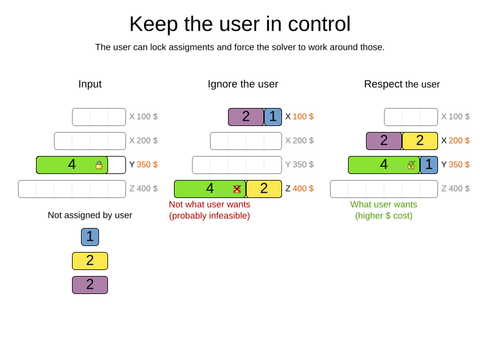

<a id="pdf-dest-255f590a2e9f4291"></a>

<a id="section-0622"></a>
## Chapter 52. Infrastructure requirements

Before sizing a Timefold Solver service, first understand the typical behaviour of a Solver.solve() call:

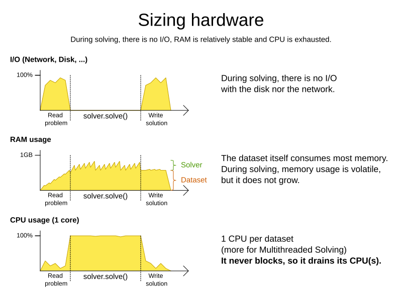

Understand these guidelines to decide the hardware for a Timefold Solver service:

RAM memory Provision plenty, but no need to provide more.

- The problem dataset, loaded before Timefold Solver is called, often consumes the most memory. It depends on the problem scale.
  - If this is a problem, review the domain class structure: remove classes or fields that Timefold Solver doesn’t need during solving.
  - Timefold Solver usually has up to three solution instances: the internal working solution, the best solution and the old best solution (when it’s being replaced). However, these are all a [planning clone](#pdf-dest-565fb1d17532a1e8) of each other, so many problem fact instances are shared between those solution instances.
- During solving, the memory is very volatile, because solving creates many short-lived objects. The Garbage Collector deletes these in bulk and therefore needs some heap space as a buffer.
- The maximum size of the JVM heap space can be in three states:
  - Insufficient: An OutOfMemoryException is thrown (often because the Garbage Collector is using more than 98% of the CPU time).
  - Narrow: The heap buffer for those short-lived instances is too small, therefore the Garbage Collector needs to run more than it would like to, which causes a performance loss.
  - Profiling shows that in the heap chart, the used heap space frequently touches the max heap space during solving. It also shows that the Garbage Collector has a significant CPU usage impact.
  - Adding more heap space increases the [move evaluation speed](#pdf-dest-d4ed04478743c7ed).
  - Plenty: There is enough heap space. The Garbage Collector is active, but its CPU usage is low.
  - Adding more heap space does not increase performance.
  - Usually, this is around 300 to 500MB above the dataset size, regardless of the problem scale, except with [nearby selection](#pdf-dest-047dbc59d03e12f1) and caching move selector, neither of which are used by default.

CPU power More is better.

- Improving CPU speed directly increases the [move evaluation speed](#pdf-dest-d4ed04478743c7ed).
  - If the CPU power is twice as fast, it takes half the time to find the same result. However, this does not guarantee that it finds a better result in the same time, nor that it finds a similar result for a problem twice as big in the same time.
  - Increasing CPU power usually does not resolve scaling issues, because planning problems scale exponentially. Power tweaking the solver configuration has far better results for scaling issues than throwing hardware at it.
- During the solve() method, the CPU power will max out until it returns (except in [daemon](#pdf-dest-f77b12a53ece5f6b) [mode](#pdf-dest-f77b12a53ece5f6b) or if your SolverEventListener writes the best solution to disk or the network). ([source](#pdf-dest-820fe464c018fa9c))

Number of CPU cores One CPU core per active Solver, plus at least one for the operating system.

- So in a multitenant application, which has one Solver per tenant, this means one CPU core per tenant, unless the number of solver threads is limited, as that limits the number of tenants being solved in parallel.
- With Partitioned Search, presume one CPU core per partition (per active tenant), unless the number of partition threads is limited.
  - To reduce the number of used cores, it can be better to reduce the partition threads (so solve some partitions sequentially) than to reduce the number of partitions.
- In use cases with many tenants (such as scheduling Software as a Service) or many partitions, it might not be affordable to provision that many CPUs.
  - Reduce the number of active Solvers at a time. For example: give each tenant only one minute of machine time and use a ExecutorService with a fixed thread pool to queue

requests.

  - Distribute the Solver runs across the day (or night). This is especially an opportunity in SaaS that’s used across the globe, due to timezones: UK and India can use the same CPU core when scheduling at night.
- The SolverManager will take care of the orchestration, especially in those underfunded environments in which solvers (and partitions) are forced to share CPU cores or wait in line.

I/O (network, disk, …) Not used during solving.

- Timefold Solver is not a web server: a solver thread does not block (unlike a servlet thread), each one fully drains a CPU.
  - A web server can handle 24 active servlets threads with eight cores without performance loss, because most servlets threads are blocking on I/O.
  - However, 24 active solver threads with eight cores will cause each solver’s [move](#pdf-dest-d4ed04478743c7ed) [evaluation speed](#pdf-dest-d4ed04478743c7ed) to be three times slower, causing a big performance loss.
- Note that calling any I/O during solving, for example a remote service in your score calculation, causes a huge performance loss because it’s called thousands of times per second, so it should complete in microseconds. So no good implementation does that.

Keep these guidelines in mind when selecting and configuring the software. See [our blog archive](https://timefold.ai/blog/) for the details of our experiments, which use our diverse set of examples. Your mileage may vary.

- Operating System
  - No experimentally proven advice yet (but prefer Linux anyway).
- JDK
  - Version: Our benchmarks have consistently shown improvements in performance when comparing new JDK releases with their predecessors. It is therefore recommended using the latest available JDK. If you’re interested in the performance comparisons of Timefold Solver running of different JDK releases, you can find them in the form of blog posts in [our blog](https://timefold.ai/blog/) [archive](https://timefold.ai/blog/).
  - Garbage Collector: ParallelGC can be potentially between 5% and 35% faster than G1GC (the default). Unlike web servers, Timefold Solver needs a GC focused on throughput, not latency. Use -XX:+UseParallelGC to turn on ParallelGC.
- Logging can have a severe impact on performance.
  - Debug logging ai.timefold.solver can be between 0% and 15% slower than info logging. Trace logging can be between 5% and 70% slower than info logging.
  - Synchronous logging to a file has an additional significant impact for debug and trace logging (but not for info logging).
- Avoid a cloud environment in which you share your CPU core(s) with other virtual machines or containers. Performance (and therefore solution quality) can be unreliable when the available CPU power varies greatly.

Keep in mind that the perfect hardware/software environment will probably not solve scaling issues (even Moore’s law is too slow). There is no need to follow these guidelines to the letter.

<a id="pdf-dest-9df6f4bd09b4e93c"></a>

<a id="section-0623"></a>
## Chapter 53. Can Timefold Solver be included in a (GraalVM) native application?

Yes. Timefold Solver has been tested with Quarkus and Spring Boot plugins to create native executables. Native executables typically have a fast startup time and reduced memory consumption. However, given the nature of the workloads running with the solver, these benefits are often overshadowed by slower solving speeds due to lack of JIT optimizations.

Read more about this in [our blog post](https://timefold.ai/blog/how-to-speed-up-timefold-solver-startup-time-by-20x-with-native-images).

<a id="pdf-dest-f05443fccb75dfef"></a>

<a id="section-0624"></a>
## Chapter 54. Why is Timefold Solver so much slower in Quarkus Dev mode?

Quarkus Dev mode disables the [JVM C2 (server) compiler](https://www.baeldung.com/jvm-tiered-compilation#2c2---server-complier) to enable fast live reload of code changes. The C2 compiler is responsible for just-in-time (JIT) compilation of hot code paths into highly optimized native machine code.

Timefold Solver is extremely CPU-intensive: it evaluates thousands of moves per second during solving, making each individual move evaluation a hot code path. Without C2, these paths run in the interpreter or with only basic JIT optimizations (C1/tier 1-3), which is typically 10x-50x slower than fully JIT-compiled code.

This slowdown affects solution quality too: because fewer moves are evaluated per second within the same time limit, the solver explores less of the search space and may return a worse solution than it would in production.

To work around this, run the solver in production mode (e.g. mvn package + java -jar) when you need representative performance or solution quality. Dev mode is fine for verifying correctness of constraints and basic wiring, but results should not be used to benchmark or tune the solver.

<a id="pdf-dest-170048a40c47dfe6"></a>

<a id="section-0625"></a>
# Upgrading Timefold Solver

<a id="pdf-dest-96f6b5c254ee9ef0"></a>

<a id="section-0626"></a>
## Chapter 55. Upgrading Timefold Solver: Overview

In this section, you will:

- Learn how to upgrade to the latest version of Timefold Solver automatically.
- Find a detailed upgrade recipe for every major change we make to the Timefold Solver APIs.

To find out what’s new in the latest version of Timefold Solver, see the [Timefold Solver release](https://github.com/TimefoldAI/timefold-solver/releases) [notes](https://github.com/TimefoldAI/timefold-solver/releases) in our GitHub repository, read our blog, or subscribe to our newsletter. ([source](https://timefold.ai/blog))

<a id="pdf-dest-53fe6baecaec8427"></a>

<a id="section-0627"></a>
## Chapter 56. Upgrade Timefold Solver to the latest version

As Timefold Solver 2.x continues developing, we occasionally have to bring changes to our APIs. We will not break backwards compatibility during the lifetime of Timefold Solver 2.x, and that means your current code will not break. But we still want you to upgrade to the new APIs easily and quickly. We provide this upgrade recipe for users who choose to keep up to date with the latest and greatest in the solver space.

Many of the upgrade steps can be applied automatically using our migration tooling, but some manual changes may still be required. This upgrade recipe is intended to help you navigate those changes and upgrade your codebase with confidence.

<a id="pdf-dest-8708e5502576d7be"></a>

<a id="section-0628"></a>
### 56.1. Before you start

Throughout this document, we assume that you are upgrading from the latest available version of the 1.x line. Make sure to first upgrade to the 2.x version and only then follow this recipe.

Please refer to [upgrade recipe for Timefold Solver 1.x](https://docs.timefold.ai/timefold-solver/1.x/upgrading-timefold-solver/upgrade-to-latest-version) or even upgrade recipe for OptaPlanner if ([source](https://docs.timefold.ai/timefold-solver/1.x/upgrading-timefold-solver/upgrade-from-optaplanner)) you go way back.

<a id="pdf-dest-32246101683512bc"></a>

<a id="section-0629"></a>
### 56.2. Automatic upgrade to latest Timefold Solver

For many of the upgrade steps mentioned later, we provide a migration tool that can automatically apply those changes to Java files and Maven POMs. This tool is based on OpenRewrite and can be run as a Maven or Gradle plugin. To run the tool, execute the following command in your project directory:

Maven

```
mvn org.openrewrite.maven:rewrite-maven-plugin:6.46.1:run
-Drewrite.recipeArtifactCoordinates=ai.timefold.solver:timefold-solver
-migration:2.7.0 -Drewrite.activeRecipes=ai.timefold.solver.migration.ToLatest
```

Gradle

```
curl https://raw.githubusercontent.com/TimefoldAI/timefold-
solver/refs/tags/v2.7.0/tools/migration/upgrade-timefold.gradle > upgrade-
timefold.gradle ; gradle -Dorg.gradle.jvmargs=-Xmx2G --init-script upgrade-
timefold.gradle rewriteRun -DtimefoldSolverVersion=2.7.0 ; rm upgrade-
timefold.gradle
```

Our automatic migrations will not change the version of your [frameworks. If you](#pdf-dest-bd8f299169ad8ea1)

run into compatibility issues, please consult the integration guides for [Spring](#pdf-dest-bd8f299169ad8ea1) or [Quarkus](#pdf-dest-1ab8ade1829825d4).

The migration tool only works on JDK 25 or earlier, because OpenRewrite only

supports LTS versions of Java.

Having done that, you can check the local changes and commit them.

For the time being, Kotlin users need to follow the upgrade recipe and apply the steps manually.

<a id="pdf-dest-d181db32c9492449"></a>

<a id="section-0630"></a>
#### 56.2.1. Summary of automated changes

The following includes a summary of all changes automated in the OpenRewrite recipe, for reference. They include both upgrades to address deprecations, and upgrades to preview features, where we are allowed to break backwards compatibility.

<a id="pdf-dest-309ad848e51ac6ae"></a>

56.2.1.1. Neighborhoods API package and class renames

As the Neighborhoods API develops in its preview status, we are tweaking names of components. Specifically:

- Sampling streams were renamed to picking streams.

<a id="pdf-dest-0b30b3d6ada70a49"></a>

<a id="section-0631"></a>
### 56.3. Manual upgrade recipe

In addition to the automated changes listed above, there are some changes that require manual intervention. Every upgrade note indicates how likely your code will be affected by that change:

- Major: Likely to affect your code.
- Minor: Less likely to affect your code, especially if you’ve been upgrading Timefold Solver regularly, paying attention to new deprecations.
- Recommended: We think this won’t affect you, but we’re listing this just to be safe.

The upgrade recipe often lists the changes as they apply to Java code. We kindly ask Kotlin users to translate the changes accordingly.

<a id="pdf-dest-3941294db6290c20"></a>

<a id="section-0632"></a>
#### 56.3.1. Conceptual changes

These changes are most likely to require you to change your code in a non-mechanical way, and they can only be automated partially, if at all.

Deprecation of @ShadowVariableInconsistent

▼ Details The solver can optionally increase the performance of shadow variable processing on dense variable graphs, in exchange for the user removing the @ShadowVariableInconsistent from their domain model. See the [detailed migration guide](#pdf-dest-601e0ae9a75a4274).

Custom moves must declare exactly the list variable range they change ▼ Details A custom move that changes a list variable must bracket that change with beforeListVariableChanged(entity, variableName, fromIndex, toIndex) and a matching afterListVariableChanged(…). The solver now verifies each such pair, and throws IllegalArgumentException if:

- a second beforeListVariableChanged opens for an entity whose previous one has not been closed yet,
- an afterListVariableChanged has no matching beforeListVariableChanged, or one arrives twice,
- the two calls disagree on fromIndex,
- the reported range does not account for every element the move added or removed.

Previously the solver accepted these and silently corrupted the solution when the move was undone. If your move now fails, make its range cover everything it changes. For example, appending one element to the end of a list is beforeListVariableChanged(entity, "valueList", size, size) followed by afterListVariableChanged(entity, "valueList", size, size + 1).

<a id="pdf-dest-198bdc124dbc6c34"></a>

<a id="section-0633"></a>
### 56.4. Changes to preview features

The API of preview features is not yet entirely stable, and changes based on user feedback can be expected. This section lists all such changes, so that users of preview features can adapt. All feedback is much appreciated!

<a id="pdf-dest-8012e0ab1c6f2d40"></a>

<a id="section-0634"></a>
#### 56.4.1. Timefold Solver 2.7.0 hides move implementations

The concrete Move implementations of the Neighborhoods API (such as ChangeMove and ListChangeMove) are no longer public. Build moves through the Moves factory class instead; see [built-](#pdf-dest-b34e34bdbbb2b0cd) [in moves](#pdf-dest-b34e34bdbbb2b0cd) for the replacement.

<a id="pdf-dest-4f9e3296ec80939e"></a>

<a id="section-0635"></a>
## Chapter 57. Upgrade from Timefold Solver 1.x to 2.x

Timefold Solver 2.x brings many improvements comparing to 1.x, and some breaking changes as well. Many of the upgrade steps can be applied automatically using our migration tooling, but some manual changes may still be required. This upgrade recipe is intended to help you navigate those changes and upgrade your codebase with confidence.

<a id="pdf-dest-fac1e1653c06601d"></a>

<a id="section-0636"></a>
### 57.1. Before you start

Throughout this document, we assume that you are upgrading from the latest available version of the 1.x line. Make sure to first upgrade to the latest 1.x version and only then follow this recipe to upgrade to 2.x.

Please refer to [upgrade recipe for Timefold Solver 1.x](https://docs.timefold.ai/timefold-solver/1.x/upgrading-timefold-solver/upgrade-to-latest-version) or even upgrade recipe for OptaPlanner if ([source](https://docs.timefold.ai/timefold-solver/1.x/upgrading-timefold-solver/upgrade-from-optaplanner)) you go way back.

<a id="pdf-dest-4f658da9711c3bb9"></a>

<a id="section-0637"></a>
### 57.2. Automatic upgrade to Timefold Solver 2.x

For many of the upgrade steps mentioned later, we provide a migration tool that can automatically apply those changes to Java files and Maven POMs. This tool is based on OpenRewrite and can be run as a Maven or Gradle plugin. To run the tool, execute the following command in your project directory:

Maven

```
mvn org.openrewrite.maven:rewrite-maven-plugin:6.46.1:run
-Drewrite.recipeArtifactCoordinates=ai.timefold.solver:timefold-solver
-migration:2.7.0 -Drewrite.activeRecipes=ai.timefold.solver.migration.ToLatest
```

Gradle

```
curl https://raw.githubusercontent.com/TimefoldAI/timefold-
solver/refs/tags/v2.7.0/tools/migration/upgrade-timefold.gradle > upgrade-
timefold.gradle ; gradle -Dorg.gradle.jvmargs=-Xmx2G --init-script upgrade-
timefold.gradle rewriteRun -DtimefoldSolverVersion=2.7.0 ; rm upgrade-
timefold.gradle
```

Our automatic migrations will not change the version of your frameworks. If you run into compatibility issues, please consult the integration guides for [Spring](#pdf-dest-bd8f299169ad8ea1) or [Quarkus](#pdf-dest-1ab8ade1829825d4).

The migration tool only works on JDK 25 or earlier, because OpenRewrite only

supports LTS versions of Java.

Having done that, you can check the local changes and commit them.

For the time being, Kotlin users need to follow the upgrade recipe and apply the steps manually.

<a id="pdf-dest-290e13b7a0e981f9"></a>

<a id="section-0638"></a>
#### 57.2.1. Summary of automated changes

The following includes a summary of all changes automated in the OpenRewrite recipe, for reference. They include both upgrades to address deprecations in Timefold Solver 1.x, and other mechanical changes that were not previously deprecated.

<a id="pdf-dest-ff2c232465bbd6b1"></a>

57.2.1.1. ConstraintFactory method renames

- ConstraintFactory.from(Class) renamed to forEach(Class).
- ConstraintFactory.fromUnfiltered(Class) renamed to forEachIncludingUnassigned(Class).
- ConstraintFactory.fromUniquePair(..) renamed to forEachUniquePair(..).

<a id="pdf-dest-da2beae833cf8228"></a>

57.2.1.2. ScoreManager renamed and methods simplified

- ScoreManager type renamed to SolutionManager.
- ScoreManager.getSummary(solution) replaced by SolutionManager.explain(solution, SolutionUpdatePolicy.UPDATE_SCORE_ONLY).getSummary().
- ScoreManager.explainScore(solution) replaced by SolutionManager.explain(solution, SolutionUpdatePolicy.UPDATE_SCORE_ONLY).
- ScoreManager.updateScore(solution) replaced by SolutionManager.update(solution, SolutionUpdatePolicy.UPDATE_SCORE_ONLY).

<a id="pdf-dest-e32da5a1e73e2d52"></a>

57.2.1.3. Score getter methods shortened

- All get-prefixed getters on score types dropped the get prefix: e.g. getScore() → score(), getHardScore() → hardScore(), getSoftScore() → softScore(), getInitScore() → initScore(), getHardLevelsSize() → hardLevelsSize(), etc. Applies to all built-in score types and IBendableScore.

<a id="pdf-dest-e7471025f8c331cc"></a>

57.2.1.4. Constraint identification refactored

- ConstraintFactory.getDefaultConstraintPackage() removed.
- Constraint.getConstraintPackage() removed.
- ConstraintRef.of(packageName, constraintName) → ConstraintRef.of(constraintId) (package argument removed).
- Constraint.getConstraintId() replaced by getConstraintRef().id().
- Constraint.getConstraintName() removed.

<a id="pdf-dest-6c73087f6df8565b"></a>

57.2.1.5. Constraint Stream terminal methods refactored

- All penalize(constraintName, score), reward(constraintName, score), impact(constraintName, score) forms (and their Configurable/Long/BigDecimal variants, across Uni/Bi/Tri/Quad streams)

are replaced by a two-call chain: penalize(score).asConstraint(constraintName), moving the constraint name out of the scoring method and into a dedicated asConstraint().

- Where the old form passed both a package and a name (penalize(pkg, name, score)), the package argument is no longer available for asConstraint(): penalize(score).asConstraint(name).
- ConstraintBuilder.asConstraint(packageName, constraintName) → asConstraint(constraintName) (two-arg form collapsed to one).
- penalizeLong(..), rewardLong(..), impactLong(..) on all stream types (Uni/Bi/Tri/Quad) renamed to penalize(..), reward(..), impact(..).
- "Constraint name" was renamed to "Constraint ID".
- "Constraint description" and "Constraint group" were removed, replaced by a more flexible ConstraintMetadata.

<a id="pdf-dest-8174dcd1add16aed"></a>

57.2.1.6. SolverManager API: Builder pattern replaces overloaded solve() methods

- Deprecated overloads of SolverManager.solve() and solveAndListen() are replaced by chained calls on solveBuilder(): e.g. solve(id, problemFinder, consumer) → solveBuilder().withProblemId(id).withProblemFinder(problemFinder).withFinalBestSolutionCons umer(consumer).run().
- solveAndListen() variants are replaced similarly, using withBestSolutionConsumer() instead of withFinalBestSolutionConsumer().

<a id="pdf-dest-ff9ad1a5d5ed5a80"></a>

57.2.1.7. SolverManager and adjacent types have some generics removed

- SolverManager<Solution_, ProblemId_> becomes SolverManager<Solution_> (second type parameter dropped).
- Same removal applies to SolverJobBuilder and SolverJob generic declarations, and to the create(), solveBuilder(), solve(), solveAndListen() method type parameters.
- SolverConfigOverride<Solution_> becomes SolverConfigOverride (type parameter dropped).

<a id="pdf-dest-968a8d49b4b046d6"></a>

57.2.1.8. Nullable planning variables renamed to unassigned

- @PlanningVariable(nullable = …) attribute renamed to @PlanningVariable(allowsUnassigned = …).
- ConstraintFactory.forEachIncludingNullVars() renamed to forEachIncludingUnassigned().
- ifExistsIncludingNullVars(), ifExistsOtherIncludingNullVars(), ifNotExistsIncludingNullVars(), ifNotExistsOtherIncludingNullVars() renamed to their IncludingUnassigned equivalents on Uni/Bi/Tri/Quad constraint streams.

<a id="pdf-dest-af02270c1b47a359"></a>

57.2.1.9. Sorting API renamed

- @PlanningVariable(strengthComparatorClass = …) renamed to comparatorClass; strengthWeightFactoryClass renamed to comparatorFactoryClass.
- PlanningVariable.NullStrengthComparator renamed to NullComparator; NullStrengthWeightFactory renamed to NullComparatorFactory.
- @PlanningEntity(difficultyComparatorClass = …) renamed to comparatorClass; difficultyWeightFactoryClass renamed to comparatorFactoryClass.
- PlanningEntity.NullDifficultyComparator renamed to NullComparator; NullDifficultyWeightFactory renamed to NullComparatorFactory.
- getSorterComparatorClass() / setSorterComparatorClass() / withSorterComparatorClass() on MoveSelectorConfig, EntitySelectorConfig, and ValueSelectorConfig renamed to getComparatorClass() / setComparatorClass() / withComparatorClass().
- getSorterWeightFactoryClass() / setSorterWeightFactoryClass() / withSorterWeightFactoryClass() on the same config classes renamed to getComparatorFactoryClass() / setComparatorFactoryClass() / withComparatorFactoryClass().
- EntitySorterManner.DECREASING_DIFFICULTY → DESCENDING; DECREASING_DIFFICULTY_IF_AVAILABLE → DESCENDING_IF_AVAILABLE.
- ValueSorterManner.DECREASING_STRENGTH → DESCENDING; DECREASING_STRENGTH_IF_AVAILABLE → DESCENDING_IF_AVAILABLE; INCREASING_STRENGTH → ASCENDING; INCREASING_STRENGTH_IF_AVAILABLE → ASCENDING_IF_AVAILABLE.

<a id="pdf-dest-fb297841fd552f61"></a>

57.2.1.10. Recommended Fit API renamed to Recommended Assignment

- SolutionManager.recommendFit() renamed to recommendAssignment().
- RecommendedFit type renamed to RecommendedAssignment.

<a id="pdf-dest-f04cf54b820a0afc"></a>

57.2.1.11. @PlanningSolution attributes removed

- @PlanningSolution(lookUpStrategyType = …) attribute removed entirely.
- @PlanningSolution(autoDiscoverMemberType = …) attribute removed entirely.

<a id="pdf-dest-b8f47ad09477367f"></a>

57.2.1.12. ProblemFactChange renamed to ProblemChange

- ProblemFactChange type renamed to ProblemChange and moved to package ai.timefold.solver.core.api.solver.change.
- Solver.isEveryProblemFactChangeProcessed() renamed to isEveryProblemChangeProcessed().
- BestSolutionChangedEvent.isEveryProblemFactChangeProcessed() renamed to isEveryProblemChangeProcessed().

<a id="pdf-dest-318f3f4c6b75c916"></a>

57.2.1.13. Score packages flattened

- All built-in score types moved from their per-type ai.timefold.solver.core.api.score.buildin.<typename> sub-packages to the parent ai.timefold.solver.core.api.score package (e.g. api.score.buildin.hardsoft.HardSoftScore → api.score.HardSoftScore).
- SimpleLongScore and HardSoftLongScore and HardMediumSoftLongScore and BendableLongScore are merged into their non-Long counterparts (SimpleScore, HardSoftScore, HardMediumSoftScore, BendableScore respectively).

<a id="pdf-dest-392ec4d74de799bc"></a>

57.2.1.14. ValueRange API cleaned up

- CountableValueRange type replaced by ValueRange.
- CompositeCountableValueRange renamed to CompositeValueRange.
- NullAllowingCountableValueRange renamed to NullAllowingValueRange.
- All value range implementation sub-packages under buildin.* flattened into ai.timefold.solver.core.impl.domain.valuerange.

<a id="pdf-dest-a3b3fb2fc65f1e21"></a>

57.2.1.15. Serialization packages flattened

- JPA score converters: per-score-type ai.timefold.solver.jpa.api.buildin.<type> packages merged into ai.timefold.solver.jpa.api.score.
- Jackson score serializers: per-score-type packages merged into ai.timefold.solver.jackson.api.score.
- JAXB score adapters: per-score-type packages merged into ai.timefold.solver.jaxb.api.score.
- Quarkus Jackson score types: per-score-type packages merged into ai.timefold.solver.quarkus.jackson.score.
- Persistence common solution API moved from ai.timefold.solver.persistence.common.api.domain.solution to ai.timefold.solver.core.api.domain.solution.

<a id="pdf-dest-ef8b9c83eb936032"></a>

57.2.1.16. Testing APIs moved into core

- Package ai.timefold.solver.test.api.score.stream moved to ai.timefold.solver.core.api.score.stream.test.
- Package ai.timefold.solver.test.api.solver.change moved to ai.timefold.solver.core.api.solver.change.
- MoveTester and MoveTestContext moved into ai.timefold.solver.core.preview.api.move.test.
- NeighborhoodTester and NeighborhoodTestContext moved into ai.timefold.solver.core.preview.api.neighborhood.test.

<a id="pdf-dest-b14fc393d088a3b4"></a>

57.2.1.17. Maven modules removed

- timefold-solver-persistence-common dependency removed (functionality moved into core).
- timefold-solver-webui dependency removed.
- timefold-solver-jsonb dependency removed.
- timefold-solver-test dependency removed (testing APIs merged into core).

<a id="pdf-dest-9ddc57f0f67664bf"></a>

57.2.1.18. Configuration property changes

- SolverConfig methods for domain access type removed: getDomainAccessType(), setDomainAccessType(), withDomainAccessType(), determineDomainAccessType().
- CartesianProductMoveSelectorConfig.getMoveSelectorConfigList() / setMoveSelectorConfigList() renamed to getMoveSelectorList() / setMoveSelectorList(). Same rename applies to

UnionMoveSelectorConfig.

- LocalSearchAcceptorConfig no longer understands undo move tabu size and value tabu ratio, including their fading variants.
- Drools-related methods on ScoreDirectorFactoryConfig removed: getScoreDrlList(), setScoreDrlList(), withScoreDrlList().
- All methods related to ConstraintStreamImplType on ScoreDirectorFactoryConfig, SolverConfig, and ConstraintVerifier removed (getConstraintStreamImplType(), setConstraintStreamImplType(), withConstraintStreamImplType()).
- In Spring Boot, property timefold.solver.solve-length renamed to timefold.solver.solve.duration in application.properties.
- In Quarkus, property quarkus.timefold.solver.solve-length renamed to quarkus.timefold.solver.solve.duration in application.properties.

<a id="pdf-dest-25c830a02f339a3e"></a>

57.2.1.19. Constraint Collector int variants removed

- countLong() renamed to count() (now returns long).
- countDistinctLong(fn) renamed to countDistinct(fn).
- sumLong(fn) renamed to sum(fn).
- averageLong(fn) renamed to average(fn).

<a id="pdf-dest-48e7cf9ac36e5e49"></a>

57.2.1.20. Assorted other changes

- @PlanningId moved from ai.timefold.solver.core.api.domain.lookup to ai.timefold.solver.core.api.domain.common.
- ScoreDirector moved from ai.timefold.solver.core.api.score.director to ai.timefold.solver.core.impl.score.director.
- SingleConstraintAssertion.penalizesBy(int, String) and rewardsWith(int, String) (and their long/BigDecimal variants) have their arguments swapped to penalizesBy(String, int) -message comes first now.
- PlannerBenchmark.benchmarkAndShowReportInBrowser() renamed to benchmark().

<a id="pdf-dest-7dc1c53d7f63b562"></a>

<a id="section-0639"></a>
### 57.3. Manual upgrade recipe

In addition to the automated changes listed above, there are some changes that require manual intervention. Every upgrade note indicates how likely your code will be affected by that change:

- Major: Likely to affect your code.
- Minor: Less likely to affect your code, especially if you’ve been upgrading Timefold Solver regularly, paying attention to new deprecations.
- Recommended: We think this won’t affect you, but we’re listing this just to be safe.

The upgrade recipe often lists the changes as they apply to Java code. We kindly ask Kotlin users to translate the changes accordingly.

<a id="pdf-dest-84e9a18b48611074"></a>

<a id="section-0640"></a>
#### 57.3.1. Conceptual changes

These changes are most likely to require you to change your code in a non-mechanical way, and they can only be automated partially, if at all.

▼ Java 21 or later required

Timefold Solver 2.x requires Java 21 or later to run, whereas Timefold Solver 1.x supported Java 17 and later. If you are using an older version of Java, you will need to upgrade your tooling and runtime to Java 21 or later.

▼ Spring Boot 4 and Jackson 3 Spring Boot integration has been upgraded to Spring Boot 4. timefold-solver-spring-boot-autoconfigure and timefold-solver-jackson now depend on Jackson 3 (groupId tools.jackson).

If you use Timefold Solver with Spring Boot, upgrade Spring Boot to 4.x. You’ll be happy to know that both projects have provided their own upgrade recipes to help with this transition:

- [Migrating to Jackson 3](https://github.com/FasterXML/jackson/blob/main/jackson3/MIGRATING_TO_JACKSON_3.md) includes a link to an automated OpenRewrite recipe for the Jackson upgrade.
- [Spring Boot 4.0 Migration Guide](https://github.com/spring-projects/spring-boot/wiki/Spring-Boot-4.0-Migration-Guide).

Users of Quarkus are not affected. They continue to use the quarkus-jackson integration module, which remains on Jackson 2.

▼ Chained planning variable support removed

Support for chained planning variables has been removed entirely. The chained variable paradigm was deprecated since 1.30.0 in favor of the planning list variable.

We invite you to read the [chained variable to list variable migration guide](#pdf-dest-601e0ae9a75a4274).

▼ Variable listeners removed

The variable listener mechanism has been removed. Variable listeners were deprecated since 1.26.0 in favor of [custom shadow variables](#pdf-dest-e7bfb6725717aac8).

We invite you to read the [variable listeners to custom shadow variables migration guide](#pdf-dest-601e0ae9a75a4274).

▼ Score analysis no longer open-source ScoreExplanation has been removed. Use ScoreAnalysis instead, which is now provided exclusively by Timefold Solver Enterprise Edition.

ScoreAnalysis provides the following methods:

- score() - the score of the solution
- isSolutionInitialized() - whether the solution is fully initialized
- constraintAnalyses() - list of ConstraintAnalysis objects, one per constraint
- summarize() and summarize(int) - human-readable score breakdown
- getConstraintAnalysis(ConstraintRef) and getConstraintAnalysis(String, String) - look up a specific constraint
- diff(ScoreAnalysis) - compare two score analyses

The following ScoreExplanation methods have no direct replacement and must be removed manually:

- getSolution() - no replacement
- getJustificationList() - no replacement; use constraintAnalyses() and filter ConstraintAnalysis.matches() by justification type
- getSummary() - use ScoreAnalysis.summarize() instead
- getConstraintMatchTotalMap() - use ScoreAnalysis.constraintAnalyses() instead

IncrementalScoreCalculator has also seen changes in this area. ConstraintMatchAwareIncrementalScoreCalculator was removed. The replacement AnalyzableIncrementalScoreCalculator is provided by the Enterprise edition.

Instead of overriding methods to return constraint matches, implement the enableConstraintMatch(ConstraintMatchRegistry<Score_>) method. Use ConstraintMatchRegistry.registerConstraintMatch(ConstraintRef, score, justification) to register each match; it returns a ConstraintMatchRegistration whose cancel() method removes the match when the assignment changes.

To use ScoreAnalysis or AnalyzableIncrementalScoreCalculator, [install the commercial editions](#pdf-dest-601e0ae9a75a4274). There is no automated migration recipe for these changes; all changes must be made manually.

▼ Recommended assignment no longer open-source

The recommended assignment API is unchanged, but it now requires Timefold Solver Enterprise Edition on the classpath.

If you use Jackson serialization, register TimefoldEnterpriseJacksonModule in addition to the standard module.

▼ Move interface refactored Together with the introduction of the [Neighborhoods API](#pdf-dest-601e0ae9a75a4274), the Move interface has been significantly refactored. Please refer to [move anatomy](#pdf-dest-555c3bb80493ac9e) for details on the new interface.

We realize this change will affect many users, and there is no clear migration path. The old Move API was never made public, even though it was the only way to implement custom moves. With Neighborhoods, this changes, as we are now providing an official and much simplified way of implementing custom moves, which we believe is well worth the breaking change. ▼ Planning solution diff no longer open-source

The solution diff API is unchanged, but it now requires Timefold Solver Enterprise Edition on the classpath.

▼ Full modularization under JPMS

Timefold Solver and all of its JARs are now modules [under JPMS](https://en.wikipedia.org/wiki/Java_Platform_Module_System).

Most users won’t need to do anything and can continue using the solver on the classpath. If your project is already using JPMS, you are not likely to notice any changes, since we were providing automatic module names in Timefold Solver 1.x, and we have kept the same module name for 2.x.

Please reach out if you notice any issues related to this change.

▼ Getter and setter access rules enforced When a planning annotation (@PlanningVariable, @PlanningScore, etc.) is placed on a getter method, that getter and its paired setter must now be public. Previously, the solver would make them accessible via reflection.

Additionally, when an annotation is placed on a field, the solver will now prefer to use the corresponding public getter and setter if they exist, rather than accessing the field directly.

If your domain class has a planning annotation on a non-public getter, make it public. If the paired setter is missing or not public, add or expose it.

If your project uses JPMS, your domain classes must be opens to ai.timefold.solver.core to allow the solver to access them via reflection.

▼ Constraint ID now strictly validated

Constraint IDs are now validated more strictly. They must be non-null, non-empty, and must not contain slashes and other special characters. If your constraint IDs do not comply, an exception will be thrown at solver initialization.

▼ @ConstraintConfiguration replaced by constraint weight overrides The @ConstraintConfiguration, @ConstraintConfigurationProvider, and @ConstraintWeight annotations have been removed. Please use [constraint weight overrides](#pdf-dest-f912b076aec80358) instead.

Before in *ConstraintProvider.java:

```
...
    .penalizeConfigurable()
    .asConstraint("maxHoursWorked");
...
```

After in *ConstraintProvider.java:

```
...
    .penalize(ONE_SOFT)
    .asConstraint("maxHoursWorked");
...
```

Before in *Solution.java:

```
...
    @ConstraintConfiguration
    private MyConstraintConfiguration myConstraintConfiguration;
...
```

After in *Solution.java:

```
...
    ConstraintWeightOverrides<HardSoftScore> constraintWeightOverrides;
...
    constraintWeightOverrides = ConstraintWeightOverrides.of(
        Map.of(
            "maxHoursWorked", HardSoftScore.ofSoft(10)
        )
    );
...
```

▼ Indictment removed The Indictment interface has been removed entirely, along with:

- indictWith() on UniConstraintBuilder, BiConstraintBuilder, TriConstraintBuilder, and QuadConstraintBuilder
- getIndictmentMap() on ScoreExplanation

There is no replacement type for Indictment. Remove all field and variable declarations of type Indictment.

To analyze per-entity score impact, use ScoreAnalysis.constraintAnalyses() and filter ConstraintAnalysis.matches() by justification.

The OpenRewrite migration recipe automatically removes indictWith() call sites. ▼ @PlanningEntity pinningFilter removed

Pinning filters were an outdated way of specifying whether any particular entity might be changed by the solver. It makes more sense to keep this information in the dataset, as opposed to having it in the runtime. We have removed the long-deprecated the pinningFilter field on @PlanningEntity annotation, and replaced it with [@PlanningPin](#pdf-dest-34e2763eb1a760ec) annotation instead.

▼ ScoreDirector removed from public API ScoreDirector is no longer a public interface. The functionality it provided in Move is now available via Lookup and MutableSolutionView. The functionality it provided in ProblemChange is now available via ProblemChangeDirector. The functionality it provided in PhaseCommand is now available via PhaseCommandContext.

If your Move implementations used ScoreDirector, migrate to the new Move interface. If your ProblemChange implementations used ScoreDirector, migrate to ProblemChangeDirector. If your PhaseCommand implementations used ScoreDirector, see the next upgrade step.

▼ PhaseCommand.changeWorkingSolution signature changed PhaseCommand.changeWorkingSolution(ScoreDirector, BooleanSupplier) has been replaced by PhaseCommand.changeWorkingSolution(PhaseCommandContext).

PhaseCommandContext provides the working solution, termination check, and the ability to execute moves. Direct modification of the working solution without going through PhaseCommandContext is no longer supported.

Before in MyPhaseCommand.java:

```
public class MyPhaseCommand implements PhaseCommand<Timetable> {

    @Override
    public void changeWorkingSolution(ScoreDirector<Timetable> scoreDirector,
BooleanSupplier isPhaseTerminated) {
        var timetable = scoreDirector.getWorkingSolution();
        while (!isPhaseTerminated.getAsBoolean()) {
            // ... make changes and notify scoreDirector
            scoreDirector.beforeVariableChanged(lesson, "room");
            lesson.setRoom(newRoom);
            scoreDirector.afterVariableChanged(lesson, "room");
            scoreDirector.triggerVariableListeners();
        }
    }

}
```

After in MyPhaseCommand.java:

```
public class MyPhaseCommand implements PhaseCommand<Timetable> {

    @Override
    public void changeWorkingSolution(PhaseCommandContext<Timetable> context) {
        var timetable = context.getWorkingSolution();
        while (!context.isPhaseTerminated()) {
            // ... execute moves through the context
            context.executeAndCalculateScore(myMove);
        }
    }

}
```

▼ SolutionPartitioner signature changed SolutionPartitioner.splitWorkingSolution(ScoreDirector, Integer) now takes the solution directly.

Before in MySolutionPartitioner.java:

```
@Override
public List<Timetable> splitWorkingSolution(ScoreDirector<Timetable> scoreDirector,
Integer runnablePartThreadLimit) {
    var solution = scoreDirector.getWorkingSolution();
    // ...
}
```

After in MySolutionPartitioner.java:

```
@Override
public List<Timetable> splitWorkingSolution(Timetable solution, Integer
runnablePartThreadLimit) {
    // ...
}
```

▼ @PlanningSolution lookUpStrategyType removed The lookUpStrategyType attribute has been removed from @PlanningSolution. Remove lookUpStrategyType from your @PlanningSolution annotations and ensure that your planning entities and problem facts have a @PlanningId-annotated field.

LookupStrategyType was used in [multi-threaded incremental solving](running-timefold-solver/multithreaded-solving.pdf#multithreadedIncrementalSolving) to specify how the solver should match entities and facts between parent and child score directors. The default value was PLANNING_ID_OR_NONE, which meant that the solver would look up entities by their [planning ID](#pdf-dest-8513a20fd2df1867). This behavior is now the default and only behavior. Before in Timetable.java:

```
@PlanningSolution(lookUpStrategyType = LookUpStrategyType.PLANNING_ID_OR_NONE)
public class Timetable {
    ...
}
```

After in Timetable.java:

```
@PlanningSolution
public class Timetable {
    ...
}
```

Before in Lesson.java:

```
@PlanningEntity
public class Lesson {

    private String id;
    ...

}
```

After in Lesson.java:

```
@PlanningEntity
public class Lesson {

    @PlanningId
    private String id;
    ...

}
```

▼ BenchmarkAggregator moved to separate module BenchmarkAggregator has been moved from timefold-solver-benchmark into a separate timefold-solver-benchmark-aggregator module. If your project uses BenchmarkAggregator, add the new module as a dependency.

<a id="pdf-dest-b096f7f2b14462b1"></a>

<a id="section-0641"></a>
#### 57.3.2. Changes likely requiring manual intervention

For the following changes, we either provide an OpenRewrite recipe which does most but not all of the necessary changes, or we don’t have an automated recipe at all. Manual review and adjustments may still be necessary.

▼ Int-based score types removed HardSoftLongScore and HardSoftBigDecimalScore are now HardSoftScore and HardSoftBigDecimalScore respectively, and the same for all other score variants. The long variants (HardSoftLongScore, HardMediumSoftLongScore, SimpleLongScore, BendableLongScore) have been merged into their int counterparts as int-based scores are no longer supported.

▼ Score can no longer be uninitialized

All score types lost their ability to be uninitialized; that is now considered an implementation detail and users can no longer represent this situation.

The following methods were removed from all score types:

- ofUninitialized(…) factory methods.
- isSolutionInitialized()
- initScore()
- getInitScore()
- withInitScore(int)

▼ BendableScore array type changed from int[] to long[] BendableScore and BendableLongScore have been merged into a single BendableScore backed by long[]. BendableScore.of(int[], int[]) is now BendableScore.of(long[], long[]).

Before in *.java:

```
BendableScore score = BendableScore.of(new int[]{0, -1}, new int[]{-2});
```

After in *.java:

```
BendableScore score = BendableScore.of(new long[]{0L, -1L}, new long[]{-2L});
```

▼ Constraint stream penalizeLong, rewardLong, impactLong removed The penalizeLong, rewardLong, and impactLong methods on constraint streams have been removed. Use penalize, reward, and impact respectively; they now also accept long weights. ▼ Deprecated SolverManager solve methods removed Various previously deprecated overloads of SolverManager.solve() and SolverManager.solveAndListen() were removed. Use the SolverManager.solveBuilder() method to build a SolverJob instead, as it provides more flexibility.

▼ SolverJobBuilder deprecated consumer methods removed The following deprecated SolverJobBuilder methods have been removed:

| Removed method | Replacement |
| --- | --- |
| withBestSolutionConsumer | withBestSolutionEventConsumer |
| withFinalBestSolutionConsumer | withFinalBestSolutionEventConsumer |
| withFirstInitializedSolutionConsumer | withFirstInitializedSolutionEventConsumer |
| withSolverJobStartedConsumer | withSolverJobStartedEventConsumer |

To migrate, change your Consumer to accept the event instead of the solution:

Before in *.java:

```
SolverManager<Timetable, Long> solverManager = SolverManager.create(solverConfig);

void runJob(Timetable timetable) {
    solverManager.solveBuilder()
        .withProblemId(1L)
        .withProblem(timetable)
        .withSolverJobStartedConsumer(this::onJobStart)
        .withFirstInitializedSolutionConsumer(this::onInitializedSolution)
        .withBestSolutionConsumer(this::onNewBestSolution)
        .withFinalBestSolutionConsumer(this::onFinalBestSolution)
        .run();
}

void onJobStart(Timetable timetable) {
    // ...
}

void onInitializedSolution(Timetable timetable) {
    // ...
}

void onNewBestSolution(Timetable timetable) {
    // ...
}

void onFinalBestSolution(Timetable timetable) {
    // ...
}
```

After in *.java:

```
SolverManager<Timetable> solverManager = SolverManager.create(solverConfig);

void runJob(Timetable timetable) {
    solverManager.solveBuilder()
        .withProblemId(1L)
        .withProblem(timetable)
        .withSolverJobStartedEventConsumer(this::onJobStart)
        .withFirstInitializedSolutionEventConsumer(this::onInitializedSolution)
        .withBestSolutionEventConsumer(this::onNewBestSolution)
        .withFinalBestSolutionEventConsumer(this::onFinalBestSolution)
        .run();
}

void onJobStart(SolverJobStartedEvent<Timetable> event) {
    var timetable = event.solution();
    // ...
}

void onInitializedSolution(FirstInitializedSolutionEvent<Timetable> event) {
    var timetable = event.solution();
    // ...
}

void onNewBestSolution(NewBestSolutionEvent<Timetable> event) {
    var timetable = event.solution();
    // ...
}

void onFinalBestSolution(FinalBestSolutionEvent<Timetable> event) {
    var timetable = event.solution();
    // ...
}
```

Users of [solution throttling](#pdf-dest-24afffa957a4858c) should also update their code to use ThrottlingBestSolutionEventConsumer instead of the now removed ThrottlingBestSolutionConsumer.

▼ SubList selector configuration moved

Previously, sublist selector configuration was specified directly on SubListChangeMoveSelectorConfig and SubListSwapMoveSelectorConfig using the following methods / XML elements:

- minimumSubListSize / <minimumSubListSize> (plus getters and setters)
- maximumSubListSize / <maximumSubListSize> (plus getters and setters)

The same can now be achieved by using a SubListSelectorConfig as the subListSelectorConfig property of those move selector configs.

▼ NoChangePhase removed from XML configuration The <noChangePhase> element has been removed from the solver XML configuration, and the phase itself has been removed from the codebase, including EventProducerId.noChange(). If you used this phase as a placeholder, remove it from your configuration.

▼ EnvironmentMode FAST_ASSERT and REPRODUCIBLE removed EnvironmentMode.FAST_ASSERT and EnvironmentMode.REPRODUCIBLE have been removed. They were deprecated since 1.19.0. Use EnvironmentMode.STEP_ASSERT and EnvironmentMode.NO_ASSERT respectively. See the 1.19.0 to 1.20.0 upgrade step for details.

▼ All code must use RandomGenerator instead of Random If you used any solver API which took a Random argument, change it to use RandomGenerator instead.

Before in *.java:

```
@Override
public Iterator<LocalDate> createRandomIterator(Random workingRandom) {
    ...
}
```

After in *.java:

```
@Override
public Iterator<LocalDate> createRandomIterator(RandomGenerator workingRandom) {
    ...
}
```

▼ Termination can no longer be customized Custom Termination implementations are no longer supported. In practice, this hasn’t worked for a very long time. All remnants of this functionality have now been removed, including the terminationClass field in the solver configuration.

▼ Score can no longer be customized Custom Score implementations are no longer supported. In practice, this hasn’t worked for a very long time. All remnants of this functionality have now been removed, including ScoreDefinition and ScoreDefinitionType.

▼ ConstraintRef package change and constraint packages removed ConstraintRef has been moved from ai.timefold.solver.core.api.score.constraint to ai.timefold.solver.core.api.score.stream.

Additionally, constraint packages have been fully removed. ConstraintRef.of(String, String) (package + name) has been replaced by ConstraintRef.of(String) (name only). Methods to retrieve the package name of a constraint have been removed from every other place where they existed, most notably from ConstraintAnalysis and Constraint.

▼ ConstraintMetadata replaces string-based constraint description and group APIs The old asConstraintDescribed(String name, String description) and asConstraintDescribed(String name, String group, String description) methods have been removed. Use asConstraint(String id) (description dropped) or implement the ConstraintMetadata interface and call asConstraint(ConstraintMetadata) to carry additional metadata.

The following methods have also been renamed or removed:

- ConstraintRef.constraintName() → ConstraintRef.id()
- ConstraintAnalysis.constraintName() → ConstraintAnalysis.constraintId()
- Constraint.getConstraintGroup() removed - constraint groups are no longer supported.
- Constraint.getDescription() returning String removed - use Constraint.getConstraintMetadata() returning ConstraintMetadata instead.
- ConstraintMetaModel.getConstraintsPerGroup(…) and ConstraintMetaModel.getConstraintGroups() removed.

▼ Deprecated ConstraintCollectors methods removed Various previously deprecated static methods on ConstraintCollectors have been removed:

- Specialized min() and max() overloads that took a Comparator argument; use the remaining overloads, which take a Comparable mapping instead.
- toCollection(); prefer toList() or toSet() instead.

▼ count() and countDistinct() now return Long instead of Integer ConstraintCollectors.count() and ConstraintCollectors.countDistinct(…) previously returned Integer. They now return Long. ▼ sum(ToIntFunction) removed ConstraintCollectors.sum(ToIntFunction) has been removed. Replace it with sum(ToLongFunction) and update the lambda accordingly.

▼ AutoDiscoverMemberType removed from @PlanningSolution The autoDiscoverMemberType attribute of @PlanningSolution has been removed. If your solution class relied on auto-discovery, add the appropriate annotations explicitly: @ProblemFactCollectionProperty, @ProblemFactProperty, @PlanningEntityCollectionProperty, @PlanningEntityProperty, or @PlanningScore. The solver will throw helpful exceptions if any members are missing the necessary annotations.

▼ DoubleValueRange removed DoubleValueRange was replaced by BigDecimalValueRange. If you used DoubleValueRange, change your code to use BigDecimalValueRange instead or, better yet, start using a collection-based value range if possible.

▼ BestSolutionChangedEvent is now an interface BestSolutionChangedEvent has been converted from a class to an interface. Its public constructors were already deprecated; if your code constructed instances of this class (e.g. for unit tests), you must remove those usages.

<a id="pdf-dest-b74f004e7afe4c92"></a>

<a id="section-0642"></a>
## Chapter 58. Backwards compatibility

Timefold Solver separates its API from its implementation:

- Public API: All classes under these api and config namespaces are 100% backwards compatible in future minor and hotfix releases:
  - ai.timefold.solver.core.api
  - ai.timefold.solver.benchmark.api
  - ai.timefold.solver.test.api
  - ai.timefold.solver.*.api
  - ai.timefold.solver.core.config
  - ai.timefold.solver.benchmark.config
- Implementation classes: All other classes are not backwards compatible. They will change in future major or minor releases, but probably not in hotfix releases.

Backwards incompatible changes for a new major version are clearly documented in [the upgrade](#pdf-dest-7dc1c53d7f63b562) [recipe](#pdf-dest-7dc1c53d7f63b562).

<a id="pdf-dest-0ba2746c7caf33f0"></a>

<a id="section-0643"></a>
### 58.1. Preview features

Timefold Solver includes several components which are only available as preview features. We use preview features as means of sharing our work with the community early and to get feedback on how to develop them further, without being hamstrung by our strict backwards compatibility guarantees.

We deliver preview features to the same standard of quality as the rest of Timefold Solver. However, their APIs and behavior are not yet considered stable, pending user feedback. Any class, method or field related to these features may change or be removed without prior notice, although we strive to avoid this as much as possible.

Preview features need to be activated in the solverConfig.xml file.

```
<solver xmlns="https://timefold.ai/xsd/solver">
    <enablePreviewFeature>DIVERSIFIED_LATE_ACCEPTANCE</enablePreviewFeature>
    <enablePreviewFeature>PLANNING_SOLUTION_DIFF</enablePreviewFeature>
</solver>
```

Preview features often live in the preview.api package, and they are:

- [Diversified Late Acceptance](#pdf-dest-c8ed9063e80f2f79) acceptor,
- [Solution diff API](#pdf-dest-682edda9d8cd728d) in the ai.timefold.solver.core.preview.api.domain.solution.diff package and in the SolutionManager,
- Neighborhoods API.

We encourage you to try these preview features and give us feedback on your experience with them. Please direct your feedback to [Timefold Solver GitHub](https://github.com/TimefoldAI/timefold-solver/discussions) or to Timefold Discord ([source](https://discord.com/channels/1413420192213631086/1414521616955605003))

<a id="pdf-dest-b13dd8d40ab37099"></a>

<a id="section-0644"></a>
## Chapter 59. Variable Listeners to Custom Shadow Variables

This section explains how to update your planning model to use the new declarative [custom](#pdf-dest-e7bfb6725717aac8) [shadow variable](#pdf-dest-e7bfb6725717aac8) approach instead of the custom VariableListener pattern, which has been deprecated in Timefold Solver 1.x and removed entirely in Timefold Solver 2.0.

Custom shadow variables replace imperative update logic with declarative, side-effect-free supplier methods. Timefold Solver automatically recalculates shadow values when their source variables change.

<a id="pdf-dest-f0067d2f4cb3eb91"></a>

<a id="section-0645"></a>
### 59.1. Why migrate

In earlier versions of Timefold Solver, shadow variables were updated using a VariableListener. This required:

- Writing and maintaining listener classes.
- Manually calling ScoreDirector.beforeVariableChanged() and afterVariableChanged().
- Handling entity lifecycle events explicitly.

This approach has been removed in Timefold Solver 2.0.0.

For example:

```
@ShadowVariable(
        variableListenerClass = MyVariableListener.class,
        sourceVariableName = "someGenuineVariable"
)
private SomeType myShadow;
```

With custom shadow variables, you declare:

- A shadow field annotated with @ShadowVariable.
- A supplier method annotated with @ShadowSources that computes the value.

This approach:

- Removes the need for listener classes.
- Eliminates manual ScoreDirector calls.
- Makes dependencies explicit and easier to reason about.

<a id="pdf-dest-ad795d8567f04bf5"></a>

<a id="section-0646"></a>
### 59.2. Migration steps

<a id="pdf-dest-dc84876b4255af00"></a>

<a id="section-0647"></a>
#### 59.2.1. 1. Add the supplier method

Add a method to the planning entity that computes the shadow value. Annotate the method with @ShadowSources and list all planning variables the computation depends on.

```
@ShadowSources("someVariable")
public SomeType computeMyShadow() {
    if (someVariable == null) {
        return null;
    }
    // Compute shadow value based on source variable(s).
    return ...;
}
```

- The return type must match the type of the shadow field.
- The method must be pure and deterministic.
- Do not modify any fields inside the supplier method.
- List every source variable that affects the result.

<a id="pdf-dest-346abfab5579e2a8"></a>

<a id="section-0648"></a>
#### 59.2.2. 2. Update the shadow variable annotation

Replace the variableListenerClass reference with a supplierName that points to the new method.

```
@ShadowVariable(supplierName = "computeMyShadow")
private SomeType myShadow;
```

Timefold Solver invokes the supplier automatically whenever one of the source variables changes and assigns the returned value to the shadow field.

<a id="pdf-dest-965e4084ca8e37bf"></a>

<a id="section-0649"></a>
#### 59.2.3. 3. Remove the VariableListener class

Delete the custom VariableListener implementation. It is no longer needed.

<a id="pdf-dest-5b5ffe2e1280d0e2"></a>

<a id="section-0650"></a>
### 59.3. Example: before and after

<a id="pdf-dest-264c65dedd627226"></a>

<a id="section-0651"></a>
#### 59.3.1. Before: using VariableListener

```
@PlanningEntity
public class Job {
    private int durationInDays;
    @PlanningVariable
    private LocalDate startDate;
    @ShadowVariable(variableListenerClass = EndDateUpdatingVariableListener.class,
                    sourceVariableName = "startDate")
    private LocalDate endDate;
    // ...
}

public class EndDateUpdatingVariableListener implements VariableListener
<MaintenanceSchedule, Job> {

    @Override
    public void beforeEntityAdded(ScoreDirector<MaintenanceSchedule> scoreDirector,
Job job) {
        // Do nothing
    }

    @Override
    public void afterEntityAdded(ScoreDirector<MaintenanceSchedule> scoreDirector, Job
job) {
        updateEndDate(scoreDirector, job);
    }

    @Override
    public void beforeVariableChanged(ScoreDirector<MaintenanceSchedule>
scoreDirector, Job job) {
        // Do nothing
    }

    @Override
    public void afterVariableChanged(ScoreDirector<MaintenanceSchedule> scoreDirector,
Job job) {
        updateEndDate(scoreDirector, job);
    }

    @Override
    public void beforeEntityRemoved(ScoreDirector<MaintenanceSchedule> scoreDirector,
Job job) {
        // Do nothing
    }

    @Override
    public void afterEntityRemoved(ScoreDirector<MaintenanceSchedule> scoreDirector,
Job job) {
        // Do nothing
    }

    protected void updateEndDate(ScoreDirector<MaintenanceSchedule> scoreDirector, Job
job) {
        scoreDirector.beforeVariableChanged(job, "endDate");
        job.setEndDate(calculateEndDate(job.getStartDate(), job.getDurationInDays()));
        scoreDirector.afterVariableChanged(job, "endDate");
    }
    public static LocalDate calculateEndDate(LocalDate startDate, int durationInDays)
{
        if (startDate == null) {
            return null;
        } else {
            return startDate.plusDays(durationInDays);
        }
    }
}
```

<a id="pdf-dest-3cfa238ef0b21960"></a>

<a id="section-0652"></a>
#### 59.3.2. After: declarative custom shadow variable

```
@PlanningEntity
public class Job {
    private int durationInDays;
    @PlanningVariable
    private LocalDate startDate;
    @ShadowVariable(supplierName = "endDateSupplier")
    private LocalDate endDate;

    @ShadowSources("startDate")
    public LocalDate endDateSupplier() {
        return calculateEndDate(startDate, durationInDays);
    }

    public static LocalDate calculateEndDate(LocalDate startDate, int durationInDays)
{
        if (startDate == null) {
            return null;
        } else {
            return startDate.plusDays(durationInDays);
        }
    }
    // ...
}
```

In this version:

- The supplier method computes the shadow value.
- Timefold Solver updates endDate automatically when startDate changes.

<a id="pdf-dest-6fbfc2304327b04e"></a>

<a id="section-0653"></a>
### 59.4. Advanced migration scenarios

<a id="pdf-dest-528be0c4fb2f6f10"></a>

<a id="section-0654"></a>
#### 59.4.1. Shadow variables with multiple dependencies

If the shadow value depends on multiple planning or shadow variables, list all dependencies in @ShadowSources. Before in Visit.java:

```
public class Visit {
    @InverseRelationShadowVariable(sourceVariableName = "visits")
    private Vehicle vehicle;

    @PreviousElementShadowVariable(sourceVariableName = "visits")
    private Visit previous;

    @ShadowVariable(
            variableListenerClass = ArrivalTimeUpdatingVariableListener.class,
            sourceVariableName = "vehicle")
    @ShadowVariable(
            variableListenerClass = ArrivalTimeUpdatingVariableListener.class,
            sourceVariableName = "previous")
    private LocalDateTime arrivalTime;

    // ...
}
```

After in Visit.java:

```
public class Visit {
    @InverseRelationShadowVariable(sourceVariableName = "visits")
    private Vehicle vehicle;

    @PreviousElementShadowVariable(sourceVariableName = "visits")
    private Visit previous;

    @ShadowVariable(supplierName = "computeArrivalTime")
    private LocalDateTime arrivalTime;

    @ShadowSources({"vehicle", "previous.arrivalTime"})
    public LocalDateTime computeArrivalTime() { … }

    // ...
}
```

Timefold Solver triggers the supplier whenever either vehicle or previous changes.

Read the [full @ShadowSources reference here](#pdf-dest-0951ddc187f48505).

<a id="pdf-dest-e54a9dc6e6f9db26"></a>

<a id="section-0655"></a>
#### 59.4.2. Variable listeners that updated multiple fields

A custom shadow variable updates exactly one field. If your listener updated multiple fields, split the logic into multiple shadow variables.

Before in Visit.java:

```
public class Visit {
    @PreviousElementShadowVariable(sourceVariableName = "visits")
    private Visit previous;

    @ShadowVariable(
            variableListenerClass = ArrivalTimeUpdatingVariableListener.class,
            sourceVariableName = "previous")
    private int totalFuelConsumptionSinceStart;

    @PiggybackShadowVariable(shadowVariableName = "totalFuelConsumptionSinceStart")
    private Duration totalTravelTimeSinceStart;

    // ...
}
```

After in Visit.java:

```
public class Visit {
    @PreviousElementShadowVariable(sourceVariableName = "visits")
    private Visit previous;

    @ShadowVariable(supplierName = "computeTotalFuelConsumption")
    private int totalFuelConsumptionSinceStart;

    @ShadowVariable(supplierName = "computeTotalTravelTime")
    private Duration totalTravelTimeSinceStart;

    @ShadowSources({"previous.totalFuelConsumptionSinceStart"})
    public int computeTotalFuelConsumption() { … }

    @ShadowSources({"previous.totalTravelTimeSinceStart"})
    public Duration computeTotalTravelTime() { … }

    // ...
}
```

<a id="pdf-dest-497885a0e0c1f8cf"></a>

<a id="section-0656"></a>
#### 59.4.3. Accessing the planning solution

In rare cases, a shadow computation needs access to data stored on the @PlanningSolution. You can add the solution as a parameter to the supplier method.

In the following example, the travel time matrix is stored on the planning solution.

Before in Visit.java and ArrivalTimeUpdatingVariableListener.java

```
public class Visit {
    private Location location;
    @PreviousElementShadowVariable(sourceVariableName = "visits")
    private Visit previous;

    @ShadowVariable(
            variableListenerClass = ArrivalTimeUpdatingVariableListener.class,
            sourceVariableName = "previous")
    private LocalDateTime arrivalTime;

    // ...
}

public class ArrivalTimeUpdatingVariableListener
        implements VariableListener<RoutingSolution, Visit> {

    @Override
    public void afterVariableChanged(
            ScoreDirector<RoutingSolution> scoreDirector, Visit visit) {
        updateArrivalTime(scoreDirector, visit);
    }

    @Override
    public void afterEntityAdded(
            ScoreDirector<RoutingSolution> scoreDirector, Visit visit) {
        updateArrivalTime(scoreDirector, visit);
    }

    protected void updateArrivalTime(
            ScoreDirector<RoutingSolution> scoreDirector, Visit visit) {
        RoutingSolution solution = scoreDirector.getWorkingSolution();

        Visit previous = visit.getPreviousStandstill();
        Long arrivalTime = null;

        if (previous != null) {
            // Global travel time matrix stored on the solution
            long travelTime = solution.getTravelTime(
                previous.getLocation(), visit.getLocation());

            Long previousDeparture = previous.getDepartureTime();
            if (previousDeparture != null) {
                arrivalTime = previousDeparture + travelTime;
            }
        }

        scoreDirector.beforeVariableChanged(visit, "arrivalTime");
        visit.setArrivalTime(arrivalTime);
        scoreDirector.afterVariableChanged(visit, "arrivalTime");
    }
}
```

After in Visit.java. ArrivalTimeUpdatingVariableListener.java is removed.

```
import java.time.LocalDateTime;// This example keeps the "travel time matrix" on the
solution
public class Visit {
    private Location location;

    @PreviousElementShadowVariable(sourceVariableName = "visits")
    private Visit previous;

    @ShadowVariable(supplierName = "computeArrivalTime")
    private LocalDateTime arrivalTime;

    @ShadowSources({"previous.arrivalTime"})
    public LocalDateTime computeArrivalTime(RoutingSolution solution) {
        if (previous == null) {
            return null;
        }
        // Global travel time matrix stored on the solution
        var travelTime = solution.getTravelTime(previous.getLocation(), location);
        var previousDeparture = previous.arrivalTime.plus(solution.getDefaultDuration
());
        return previousDeparture.plus(travelTime);
    }

    // ...
}
```

Use this sparingly. In many cases, storing derived data directly on the planning entity leads to simpler and more testable models.

<a id="pdf-dest-b255dc6875c9d444"></a>

<a id="section-0657"></a>
### 59.5. Next

- [Custom shadow variables](#pdf-dest-e7bfb6725717aac8)
- [@ShadowSources paths](#pdf-dest-0951ddc187f48505)

<a id="pdf-dest-8b10f8236e3a567d"></a>

<a id="section-0658"></a>
## Chapter 60. Chained planning variable to planning list variable

This section explains how to update your planning model to use the [planning list variable](#pdf-dest-fbc665f240838a05) approach instead of the chained planning variable, which has been deprecated in Timefold Solver 1.x and removed entirely in Timefold Solver 2.0.

Chained planning variables allowed planning entities to point to each other and form chains, which was used for sequence-based problems like TSP and vehicle routing. The planning list variable provides a modern, more intuitive way to model sequences as lists of values on a parent entity.

If you modeled vehicle routing, TSP, or any ‘ordered sequence’ problem using chained planning variables, migrate to planning list variables to simplify your domain model and remove deprecated APIs.

<a id="pdf-dest-697edef5247e2699"></a>

<a id="section-0659"></a>
### 60.1. Migration steps

<a id="pdf-dest-36abbd000479ca68"></a>

<a id="section-0660"></a>
#### 60.1.1. 1. Define the list variable on the parent entity

Identify the parent or anchor entity in your chain (for example, the Vehicle or route entity that started each chain). Add a new field of type List<X> to this class, where X is the type of the child element that was previously chained. Annotate this field with @PlanningListVariable.

For example:

```
@PlanningEntity
public class Vehicle {

    @PlanningListVariable
    private List<Customer> customers = new ArrayList<>();

    // ... other properties (capacity, etc.)
}
```

<a id="pdf-dest-28af754acabe3914"></a>

<a id="section-0661"></a>
#### 60.1.2. 2. Convert the chained entity to use shadow variables

On the child element class (e.g. Customer), we need to replace some of the existing annotations with [planning list shadow variables](#pdf-dest-5801eae82a417ae0) to mirror the relationships now implied by the list assignment:

- Parent reference: Replace the existing @AnchorShadowVariable with @InverseRelationShadowVariable(sourceVariableName = "…"), where the source is the name of the list variable on the parent.
- Previous element: Replace the existing @PlanningVariable(graphType = CHAINED) annotation with @PreviousElementShadowVariable(sourceVariableName = "…"). For the first customer in a vehicle’s list, previousCustomer will be null.
- Next element: If present, replace the existing @InverseRelationShadowVariable(sourceVariableName = PREVIOUS_ELEMENT) which pointed to the next element with @NextElementShadowVariable(sourceVariableName = "…"). For the last customer in a vehicle’s list nextCustomer will be null.
- Index (optional): If you need the index of an element in the list (e.g. position in route), you can add an @IndexShadowVariable(sourceVariableName = "…") on an Integer property to get its 0-based index in the parent’s list.
```
@PlanningEntity
public class Customer {

    @InverseRelationShadowVariable(sourceVariableName = "customers")
    private Vehicle vehicle;

    @PreviousElementShadowVariable(sourceVariableName = "customers")
    private Customer previousCustomer;

    @NextElementShadowVariable(sourceVariableName = "customers")
    private Customer nextCustomer;

    // ... other properties (demand, etc.)
}
```

<a id="pdf-dest-4339a44f2a905cb8"></a>

<a id="section-0662"></a>
#### 60.1.3. 3. Update the planning solution

By moving to [planning list variables](#pdf-dest-fbc665f240838a05), we no longer need two @ValueRangeProviders.

```
@PlanningSolution
public class VehicleRoutingPlan {

    @PlanningEntityCollectionProperty
    private List<Vehicle> vehicles;

    @ValueRangeProvider
    @PlanningEntityCollectionProperty
    private List<Customer> customers;

    // ...
}
```

<a id="pdf-dest-937a0d52f06bfa4a"></a>

<a id="section-0663"></a>
#### 60.1.4. 4. Clean up chain-specific constructs

Remove any remaining artifacts of the chained model that are no longer needed:

- Utility fields/methods: Remove the Standstill interface (and any related methods) if it was used only for the chained variable relationship.
- Constraint adjustments: Review your score constraints to use the new model.
  - Constraints that iterated over chain links or accessed previousStandstill will need to be updated.
  - If you wrote a constraint to ensure all elements in a chain share the same anchor, that can be removed. It is inherently satisfied now since each customer’s vehicle is set by the list assignment.

After these changes, your planning entities will use the list variable approach. Each parent entity has an ordered list of child elements, and Timefold Solver will automatically manage the insertion/removal of those elements in lists during moves, as well as update all the above shadow variables when the solution changes.

<a id="pdf-dest-b464a2f6eac6cbf4"></a>

<a id="section-0664"></a>
### 60.2. Example: before and after

<a id="pdf-dest-31bfee1306bae2ed"></a>

<a id="section-0665"></a>
#### 60.2.1. Before: using a chained planning variable

Consider a vehicle routing domain with vehicles and customers. In the chained model, each Customer points to a Standstill (either a Vehicle or another Customer) as its previous stop, forming a chain. A Vehicle acts as the anchor (start of the chain) but isn’t a planning entity. For example:

```
public class Vehicle implements Standstill {

    private Location depot;
    private int capacity;

    // ...
}

@PlanningEntity
public class Customer implements Standstill {

    private Location location;
    private int demand;

    @PlanningVariable(graphType = PlanningVariableGraphType.CHAINED,
valueRangeProviderRefs = "standstillRange")
    private Standstill previousStandstill;

    // ...
}
```

In this model, each Customer’s previousStandstill could be a Vehicle (if it’s the first customer in that vehicle’s route) or another Customer.

<a id="pdf-dest-4d0f946372e83e4a"></a>

<a id="section-0666"></a>
#### 60.2.2. After: using a planning list variable

Using a planning list variable, the vehicle becomes a planning entity that directly contains an ordered list of customers. The Customer no longer has a chain pointer:

```
@PlanningEntity
public class Vehicle {
    private Location depot;
    private int capacity;

    @PlanningListVariable
    private List<Customer> customers = new ArrayList<>();

    // ...
}

@PlanningEntity
public class Customer {
    private Location location;
    private int demand;

    @InverseRelationShadowVariable(sourceVariableName = "customers")
    private Vehicle vehicle;

    @PreviousElementShadowVariable(sourceVariableName = "customers")
    private Customer previousCustomer;

    @NextElementShadowVariable(sourceVariableName = "customers")
    private Customer nextCustomer;

    // ...
}
```

In this version:

- Each Vehicle directly owns a list of Customer values. The solver ensures that a customer is in at most one vehicle’s list at a time.
- Customer no longer implements Standstill (the shared interface), and it has no genuine planning variable.
- Anchor and neighbors are easy to access through shadow variables if needed.
- The chain integrity (no loops, one sequence per vehicle) is naturally enforced by the list structure.

<a id="pdf-dest-82899f4e596d84bf"></a>

<a id="section-0667"></a>
### 60.3. Next

- [Planning list variable reference](#pdf-dest-fbc665f240838a05)

<a id="pdf-dest-d45f06c3043f277e"></a>

<a id="section-0668"></a>
## Chapter 61. @ShadowVariablesInconsistent to structural scores

This section explains how to update your planning model to use the [structural score](#pdf-dest-7331bc9bbf44c3bc) approach instead of @ShadowVariablesInconsistent, which has been deprecated in Timefold Solver 2.x and will be removed entirely in Timefold Solver 3.0.

If you have complex shadow variables that can form dependency loops and have been using the @ShadowVariablesInconsistent annotation, migrate to using structural scores to simplify your domain model, remove deprecated APIs, and have faster move evaluation.

<a id="pdf-dest-68e6914ac5ce5730"></a>

<a id="section-0669"></a>
### 61.1. Migration steps

<a id="pdf-dest-38b9ef4014b21c69"></a>

<a id="section-0670"></a>
#### 61.1.1. 1. Remove the @ShadowVariablesInconsistent fields from all entities

Identify the entities that had a @ShadowVariablesInconsistent field and remove the @ShadowVariablesInconsistent field from the entity. For instance,

```
@PlanningEntity
public class Visit {

    @ShadowVariablesInconsistent
    private boolean isInconsistent;

    // ... other properties (capacity, etc.)
}
```

becomes

```
@PlanningEntity
public class Visit {
    // ... other properties (capacity, etc.)
}
```

<a id="pdf-dest-d8fd5b90dc13f068"></a>

<a id="section-0671"></a>
#### 61.1.2. 2. Remove shadow variable consistency constraints

In your ConstraintProvider, find the constraints that were using the @ShadowVariablesInconsistent field to penalize inconsistent solutions and remove them. For instance,

```
public class MyConstraintProvider implements ConstraintProvider {

    @Override
    public Constraint[] defineConstraints(ConstraintFactory constraintFactory) {
        return new Constraint[] {
                penalizeInconsistentSolutions(constraintFactory),
                // ... other constraints
        };
    }

    Constraint penalizeInconsistentSolutions(ConstraintFactory constraintFactory) {
        constraintFactory.forEachUnfiltered(Visit.class)
            .filter(Visit::isInconsistent)
            .penalize(HardMediumSoftScore.ONE_HARD)
            .asConstraint("Inconsistent Visit");
    }
    // ... other constraints
}
```

becomes

```
public class MyConstraintProvider implements ConstraintProvider {

    @Override
    public Constraint[] defineConstraints(ConstraintFactory constraintFactory) {
        return new Constraint[] {
                // ... other constraints
        };
    }

    // ... other constraints
}
```

After these changes, your domain is now using the structural score approach. As a result, the Solver will automatically handle consistency in your domain, avoid calculating the score of inconsistent solutions, and other performance optimizations. Additionally, the Solver API will behave differently when a [structurally flawed solution](#pdf-dest-7331bc9bbf44c3bc) is passed:

- When Solver.solve, SolverManager.solve or SolverJobBuilder is given a structurally flawed solution, all entities involved in variable loops will be unassigned before solving is started.
- When SolutionManager.update, SolverManager.updateShadowVariables or SolutionManager.recommendAssignment is called with a structurally flawed solution, an instance of InconsistentSolutionException will be thrown containing the variable loops in the solution.
- When SolutionManager.analyze is called with structurally flawed solution, the returned ScoreAnalysis will have a non-null structuralFlawAnalysis containing the variable loops in the solution.

<a id="pdf-dest-d13a425535b1b8b1"></a>

<a id="section-0672"></a>
# Commercial editions

<a id="pdf-dest-515ec2197b1ab652"></a>

<a id="section-0673"></a>
## Chapter 62. Enterprise Edition

Timefold Solver Enterprise is a commercial product which offers additional features, such as [score](#pdf-dest-601e0ae9a75a4274) [analysis](#pdf-dest-601e0ae9a75a4274), nearby selection and multithreaded solving. These features are essential to scale out to ([source](#pdf-dest-047dbc59d03e12f1)) ([source](running-timefold-solver/multithreaded-solving.pdf#multithreadedIncrementalSolving)) large datasets and build trust with your users.

Unlike Timefold Solver Community Edition, this commercial edition is not open-source.

Looking for quicker time-to-value? Timefold offers [pre-built, fully tuned](https://docs.timefold.ai/) [optimization models](https://docs.timefold.ai/), no constraint building required. Just plug into our API and start optimizing immediately.

<a id="pdf-dest-e16f0f40bec2126e"></a>

<a id="section-0674"></a>
### 62.1. Free trials and licenses

Every new account on the [Timefold License Manager](https://licenses.timefold.ai/) starts with a free, time-limited Enterprise trial, so you can create and download fully functional Enterprise Edition license files without talking to sales first. We also offer free licenses to non-profit organizations and for academic research.

<a id="pdf-dest-62451d38387a6c87"></a>

<a id="section-0675"></a>
### 62.2. Features

| Feature | Enterprise |
| --- | --- |
| Score Analysis | ✓ |
| Recommendation API | ✓ |
| Performance improvements | ✓ |
| Nearby selection | ✓ |
| Multithreaded solving | ✓ |
| Partitioned search | ✓ |
| Constraint profiling | ✓ |
| Multistage moves | ✓ |
| Throttling best solution events | ✓ |

<a id="pdf-dest-4b0273e1ba5d5d3c"></a>

<a id="section-0676"></a>
## Chapter 63. Installing Timefold Solver Enterprise

In order to work with the commercial edition of Timefold Solver, 2 actions need to be taken:

- [Configure a license key](#pdf-dest-178ef8fc55d42dcf);
- [Use the Enterprise artifacts](#pdf-dest-b52e68aeeaa87d07);

<a id="pdf-dest-178ef8fc55d42dcf"></a>

<a id="section-0677"></a>
### 63.1. License Key

A correctly configured and active license key is required in order for our commercial versions to function.

<a id="pdf-dest-de3a9afb57dc559a"></a>

<a id="section-0678"></a>
#### 63.1.1. Obtaining a license key

Generate your license key using the [Timefold License Manager](#pdf-dest-601e0ae9a75a4274). Every new account starts with a free, time-limited Enterprise trial, so you don’t need to talk to sales to get started.

Take care not to leak the license file, for example by committing it to a public repository, logging the license file content in logs, or sharing it with unauthorized parties.

Consult [Terms of Use](https://timefold.ai/terms) for details on license key usage and restrictions.

<a id="pdf-dest-4154c8520eaed0b0"></a>

<a id="section-0679"></a>
#### 63.1.2. Set up your license key

After obtaining your license file you can introduce it to your project by one of the following methods:

Take care that the file name matches exactly, including letter case and the lines

containing "BEGIN CERTIFICATE" and "END CERTIFICATE".

- Store the license’s PEM string (the contents of the license file) in the TIMEFOLD_LICENSE environment variable, e.g. with the export TIMEFOLD_LICENSE="$(cat ./path/to/timefold-license.pem)".
- Store the absolute path to the file in TIMEFOLD_LICENSE_PATH environment variable.
- Name the file timefold-license.pem and place it in the user’s home directory.
- Name the file timefold-license.pem and place it in the root of your application classpath.

<a id="pdf-dest-b52e68aeeaa87d07"></a>

<a id="section-0680"></a>
### 63.2. Use the enterprise artifacts

The commercial edition uses different artifacts than our open-source version. These artifacts are available from Maven Central, so no additional repositories need to be configured.

The Enterprise edition of Timefold Solver uses the enterprise artifacts.

Replace references to open-source artifacts by their enterprise counterparts as shown in the following table:

| Open source | Enterprise |
| --- | --- |
| ai.timefold.solver:timefold-solver-bom | ai.timefold.solver.enterprise:timefold-solver-<br>enterprise-bom |
| ai.timefold.solver:timefold-solver-core | ai.timefold.solver.enterprise:timefold-solver-<br>enterprise-core |
| ai.timefold.solver:timefold-solver-jackson | ai.timefold.solver.enterprise:timefold-solver-<br>enterprise-jackson |
| ai.timefold.solver:timefold-solver-quarkus | ai.timefold.solver.enterprise:timefold-solver-<br>enterprise-quarkus |
| ai.timefold.solver:timefold-solver-quarkus-<br>jackson | ai.timefold.solver.enterprise:timefold-solver-<br>enterprise-quarkus-jackson |
| ai.timefold.solver:timefold-solver-spring-<br>boot-starter | ai.timefold.solver.enterprise:timefold-solver-<br>enterprise-spring-boot-starter |

If you were not using some of these open source artifacts until now, you do not need to add the enterprise counterparts to your project either.

<a id="pdf-dest-8214c4ab4aee9a52"></a>

<a id="section-0681"></a>
### 63.3. Troubleshooting

After migrating to a commercial edition, most projects work out of the box.

When using the Enterprise version, automatic node sharing is the only feature that places additional restrictions on your code. If you run into unexpected behavior, try [disabling that feature](#pdf-dest-78bedb7b8cad7fd5) or align your code to [comply](#pdf-dest-9cfd4ba3cf15b201).

If that did not resolve the issue, [contact Timefold support](https://timefold.ai/contact).

<a id="pdf-dest-13ede461a082ac9d"></a>

<a id="section-0682"></a>
## Chapter 64. Performance improvements

Timefold Solver Enterprise brings many performance improvements. These are shortly described here.

<a id="pdf-dest-3720a5d51f2fc772"></a>

<a id="section-0683"></a>
### 64.1. Faster shadow variables

This feature is exclusive to [Timefold Solver Enterprise Edition](#pdf-dest-601e0ae9a75a4274).

Updates to shadow variables happen incrementally with Timefold Solver Enterprise. For models making intensive use of [shadow variables](#pdf-dest-e7bfb6725717aac8), this should be visible as a serious performance improvement out-of-the-box.

This is enabled by default and doesn’t require any special considerations.

<a id="pdf-dest-46e4adc01ad56b14"></a>

<a id="section-0684"></a>
### 64.2. Node sharing

This feature is exclusive to [Timefold Solver Enterprise Edition](#pdf-dest-601e0ae9a75a4274).

When a ConstraintProvider does an operation for multiple constraints (such as finding all shifts corresponding to an employee), that work can be shared. This can significantly improve move evaluation speed if the repeated operation is computationally expensive:

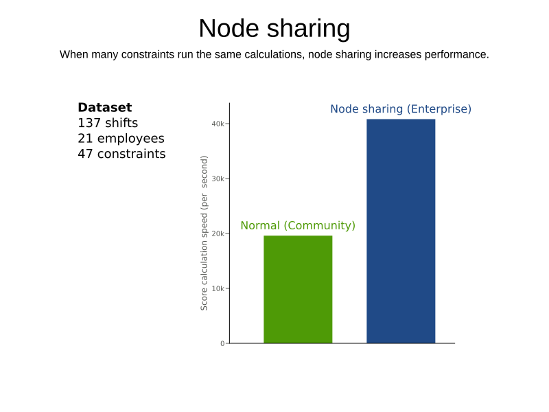

Debugging breakpoints put inside your constraints will not be respected, because

the ConstraintProvider class will be transformed when this feature is enabled.

<a id="pdf-dest-9cfd4ba3cf15b201"></a>

<a id="section-0685"></a>
#### 64.2.1. Restrictions

To use automatic node sharing outside Quarkus, your ConstraintProvider class must oblige by several restrictions so a valid subclass can be generated:

- The ConstraintProvider class cannot be final.
- The ConstraintProvider class cannot have any final methods.
- The ConstraintProvider class cannot access any protected classes, methods or fields.

<a id="pdf-dest-78bedb7b8cad7fd5"></a>

<a id="section-0686"></a>
#### 64.2.2. Configuration

Node sharing is automatically enabled when running Timefold Solver Enterprise. You can disable the feature by changing the following settings.

XML

- Add <constraintStreamAutomaticNodeSharing>false</constraintStreamAutomaticNodeSharing> in your solverConfig.xml:
```
    <!-- ... -->
    <scoreDirectorFactory>
    <constraintProviderClass>
    org.acme.MyConstraintProvider</constraintProviderClass>
    <constraintStreamAutomaticNodeSharing>
    false</constraintStreamAutomaticNodeSharing>
    </scoreDirectorFactory>
    <!-- ... -->
```

Spring Boot Set the property timefold.solver.constraint-stream-automatic-node-sharing to false in application.properties:

```
timefold.solver.constraint-stream-automatic-node-sharing=false
```

Quarkus Set the property quarkus.timefold.solver.constraint-stream-automatic-node-sharing to false in application.properties:

```
quarkus.timefold.solver.constraint-stream-automatic-node-sharing=false
```

<a id="pdf-dest-d0b8072bb9cc4519"></a>

<a id="section-0687"></a>
#### 64.2.3. What is node sharing?

When using [constraint streams](#pdf-dest-90641d67d73d7e7b), each building block forms a node in the score calculation network. ([source](#pdf-dest-688ae56f1364f4b6)) When two building blocks are functionally equivalent, they can share the same node in the network. Sharing nodes allows the operation to be performed only once instead of multiple times, improving the performance of the solver. To be functionally equivalent, the following must be true:

- The building blocks must represent the same operation.
- The building blocks must have functionally equivalent parent building blocks.
- The building blocks must have functionally equivalent inputs.

When all of the above is the case, Timefold Solver can rewrite the ConstraintProvider code at runtime to benefit from the performance improvements node sharing brings.

<a id="pdf-dest-38c37e7ce9317056"></a>

<a id="section-0688"></a>
## Chapter 65. Multistage moves

This feature is exclusive to [Timefold Solver Enterprise Edition](#pdf-dest-601e0ae9a75a4274).

Multistage moves are moves composed of one or more stages, where each stage selects a single Move to execute.

Each stage has access to either a BasicVariableMoveEvaluator or a ListVariableMoveEvaluator, which allows the stage to evaluate moves without executing them.

Stages are selected from either a BasicVariableStageProvider or a ListVariableStageProvider, which is initialized from the working solution at phase start.

Multistage moves are configured from either a [MultistageMoveSelectorConfig](#pdf-dest-290b8ff6fc54bc92) or a [ListMultistageMoveSelectorConfig](#pdf-dest-44679f20249c49d2).

Multistage moves are useful for creating specialized ruin-and-recreate moves where the valid values that won’t violate hard constraints can be determined in advance.

<a id="pdf-dest-173c4a60ffaa34ca"></a>

<a id="section-0689"></a>
## Chapter 66. License management

The [Timefold License Manager](https://licenses.timefold.ai/) is where you register for a free trial, add and download license files, and manage your team’s access to Timefold Solver Enterprise Edition.

<a id="pdf-dest-4aec8c9badf5d3ef"></a>

<a id="section-0690"></a>
### 66.1. Register and free trial

1. Go to [licenses.timefold.ai](https://licenses.timefold.ai/) and click Register.

2. Log in with your company email address. Public email domains (Gmail, Hotmail, Yahoo, and similar) aren’t accepted. You must use a work email.

3. Fill in the registration form: company name and website URL, the scheduling problem you’re solving, the scale of your problem, and how you currently solve it.

4. Accept the terms of service and click Register.

Your account and company are created immediately, and you’re given a free, time-limited Enterprise trial: you can create and download fully functional Enterprise Edition license files right away, without talking to sales first.

The first user to register for a company automatically becomes that company’s admin.

You can change who holds the admin role at any time; see Change a user’s role or

[remove a user](#pdf-dest-6dff3ec386aab06f).

When the trial ends, you need a paid subscription to keep creating new licenses.

<a id="pdf-dest-5a8f5ed8cf03986b"></a>

<a id="section-0691"></a>
### 66.2. Managing licenses

Creating licenses requires the admin role within your company. Regular users can view and download their own licenses only.

<a id="pdf-dest-dde7965ca7eae5eb"></a>

<a id="section-0692"></a>
#### 66.2.1. View your licenses

Click Licenses in the sidebar to see your active licenses, or switch to the Expired tab to see past ones. Each license card shows its type, expiration date, and a download button.

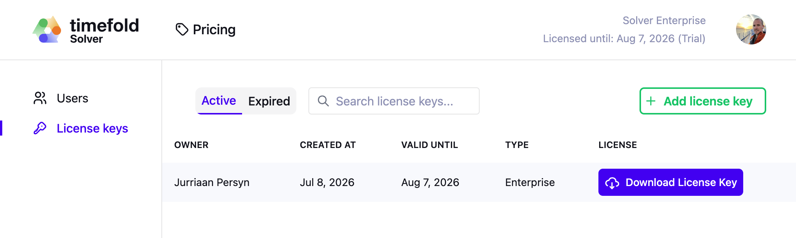

Figure 18. The Licenses list in the Timefold License Manager

<a id="pdf-dest-1c6d9c70c87c7324"></a>

<a id="section-0693"></a>
#### 66.2.2. Add a license

1. Click Licenses → Add license key.

2. Select an expiration date. It can’t exceed your company’s contract end date.

3. Optionally, assign the license to a specific user in your company.

4. Click Add license key.

Your company’s plan determines the license type; you don’t need to select it manually.

<a id="pdf-dest-46ef4f418049fc93"></a>

<a id="section-0694"></a>
#### 66.2.3. Download a license key

Click Download license key next to a license to get its .pem file. Introduce it to your project as described in [Set up your license key](#pdf-dest-4154c8520eaed0b0).

Treat your license key as a secret. Don’t commit it to source control; inject it at runtime using your secret manager instead (for example Kubernetes Secrets, AWS Secrets Manager, HashiCorp Vault, or a CI/CD secret store).

<a id="pdf-dest-b3de27492ab1c14b"></a>

<a id="section-0695"></a>
#### 66.2.4. Expired licenses

Expired licenses remain visible under the Expired tab, and you can still download them to review, but they’re no longer accepted by the solver.

Once a license expires, Timefold Solver refuses to start. There is no grace period.

Renew your license before it expires to avoid downtime.

<a id="pdf-dest-90514dc7a4b8abd2"></a>

<a id="section-0696"></a>
### 66.3. Notifications

<a id="pdf-dest-04a628ff1685461f"></a>

<a id="section-0697"></a>
#### 66.3.1. Email reminders

The license manager emails the license owner before a license expires: seven days before, and again one day before. If you’re not receiving these emails, check your spam folder or ask your company admin to verify the license owner’s address.

<a id="pdf-dest-920673507e43edd4"></a>

<a id="section-0698"></a>
#### 66.3.2. Solver warnings

Timefold Solver also logs warnings as a license approaches expiry, with increasing urgency at less than 30 days, less than 14 days, and less than one day remaining. Once expired, the solver refuses to start. Monitor your application logs for these warnings so you have time to renew.

<a id="pdf-dest-9dea460f314af63e"></a>

<a id="section-0699"></a>
### 66.4. Managing your team

Inviting and managing team members requires the admin role within your company.

<a id="pdf-dest-617737d7ba08d1f8"></a>

<a id="section-0700"></a>
#### 66.4.1. Invite team members

Open your company from the sidebar, go to the Users tab, and click Invite user. The invitee receives an email with an acceptance link that is valid for 14 days. Once they accept, they join your company with the user role.

If an invitation expires or wasn’t received, find it in the Users tab and click Resend to send a fresh 14-day link.

<a id="pdf-dest-6dff3ec386aab06f"></a>

<a id="section-0701"></a>
#### 66.4.2. Change a user’s role or remove a user

From the Users tab, click Edit next to a user to change their role between admin and user, or click Delete to remove them.

At least one admin must remain in a company at all times; you can’t demote or

delete the last admin.

<a id="pdf-dest-cc8ce1471ac0d668"></a>

<a id="section-0702"></a>
### 66.5. Account and company settings

Update your name from your avatar menu → Settings. Your identity provider manages your email address, so you can’t change it there.

Only Timefold can change company-level settings, such as your plan and contract dates. Contact [support@timefold.ai](mailto:support@timefold.ai) if you need your plan updated.

<a id="pdf-dest-2047de7cf5ff6e4f"></a>

<a id="section-0703"></a>
### 66.6. Pricing

Visit [the pricing page](https://licenses.timefold.ai/pricing) for current Enterprise pricing and contact details.

## Additional source links

Links attached to code, tables, or other PDF regions that could not be placed inline:

- [./rest-api.pdf#modelConverter](./rest-api.pdf#modelConverter)
- [https://docs.spring.io/spring-boot/docs/current/maven-plugin/reference/htmlsingle/#run.run-goal.parameter-details.optimized-launch](https://docs.spring.io/spring-boot/docs/current/maven-plugin/reference/htmlsingle/#run.run-goal.parameter-details.optimized-launch)
- [https://www.markdownguide.org/extended-syntax/#tables](https://www.markdownguide.org/extended-syntax/#tables)
